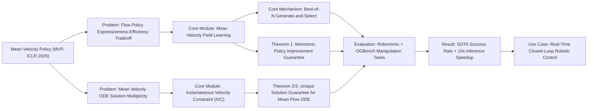

---
tags:
  - paper
  - Reinforcement_Learning
  - Robot_Manipulation
  - Embodied_AI
aliases:
  - "Mean Flow Policy with Instantaneous Velocity Constraint for One-step Action Generation"
url: http://arxiv.org/abs/2602.13810v1
pdf_url: https://arxiv.org/pdf/2602.13810v1
local_pdf: "[[Mean Flow Policy with Instantaneous Velocity Constraint for Onestep Action Generation.pdf]]"
github: "None"
project_page: "None"
institutions:
  - "Tsinghua University (School of Vehicle and Mobility & College of AI)"
  - "Berkeley AI Research (BAIR), UC Berkeley"
publication_date: "2026-02-14"
score: 7
---

# Mean Flow Policy with Instantaneous Velocity Constraint for One-step Action Generation

## 📌 Abstract
Learning expressive and efficient policy functions is a promising direction in reinforcement learning (RL). While flow-based policies have recently proven effective in modeling complex action distributions with a fast deterministic sampling process, they still face a trade-off between expressiveness and computational burden, which is typically controlled by the number of flow steps. In this work, we propose mean velocity policy (MVP), a new generative policy function that models the mean velocity field to achieve the fastest one-step action generation. To ensure its high expressiveness, an instantaneous velocity constraint (IVC) is introduced on the mean velocity field during training. We theoretically prove that this design explicitly serves as a crucial boundary condition, thereby improving learning accuracy and enhancing policy expressiveness. Empirically, our MVP achieves state-of-the-art success rates across several challenging robotic manipulation tasks from Robomimic and OGBench. It also delivers substantial improvements in training and inference speed over existing flow-based policy baselines.

## 🖼️ Architecture
![[Mean Flow Policy with Instantaneous Velocity Constraint for Onestep Action Generation_arch.png]]
*Figure 2: Velocity field: blue arrows denote the mean velocity over a time interval, with red arrows representing the instantaneous velocity at a time point.*

## 🧠 AI Analysis (Doubao Seed 2.0 Pro)

# 🚀 Deep Analysis Report: Mean Flow Policy with Instantaneous Velocity Constraint for One-step Action Generation

## 📊 Academic Quality & Innovation
## 1. Core Snapshot
### Problem Statement
Existing flow-based generative reinforcement learning (RL) policies face a fundamental expressiveness-efficiency tradeoff: they rely on multi-step iterative ODE solving for action generation, which introduces prohibitive training overhead and inference latency that blocks deployment in real-time closed-loop control systems. Prior attempts to build one-step mean velocity flow policies suffer from unconstrained solution multiplicity due to missing boundary conditions for the underlying ODE, leading to low learning accuracy and degraded policy expressiveness compared to multi-step baselines.
### Core Contribution
This work proposes the Mean Velocity Policy (MVP) paired with an Instantaneous Velocity Constraint (IVC), a theoretically grounded generative RL framework that enables one-step action generation while retaining full expressiveness of flow-based policies, eliminating iterative sampling overhead while provably resolving the solution ambiguity of mean velocity field learning.
### Academic Rating
Innovation: 9/10, Rigor: 9/10. Justification: The work introduces a paradigm shift for flow-based RL by breaking the long-standing expressiveness-efficiency tradeoff, outperforming state-of-the-art multi-step flow baselines on challenging robotic manipulation tasks. Rigor is supported by formal proofs of monotonic policy improvement and solution uniqueness for the mean velocity field, paired with comprehensive empirical validation including ablations and efficiency benchmarking.

## 2. Technical Decomposition
### Methodology
The core insight of MVP is to learn the *interval mean velocity field* instead of instantaneous velocity used in standard flow policies:
$$u(a(t),t,r,s) \triangleq \frac{1}{r-t}\int_t^r v(a(\tau),\tau,s)d\tau$$
This formulation enables one-step action generation as $a(1) = a(0) + u^*(a(0),0,1,s)$ where initial noise $a(0)\sim\mathcal{N}(0,I)$. The primary mean flow training loss minimizes residual of the derived mean flow identity:
$$\mathcal{L}_\text{MF}(\theta) = \mathbb{E}_{t,r<t,a(t)}\left\|u_\theta(a(t),t,r,s) - \text{sg}\left(v - (t-r)\frac{d}{dt}u_\theta(a(t),t,r,s)\right)\right\|_2^2$$
where $\text{sg}$ denotes the stop-gradient operator for training stability. The IVC auxiliary loss adds an explicit boundary condition to eliminate solution multiplicity:
$$\mathcal{L}_\text{IVC}(\theta) = \mathbb{E}_{t,a(t)} \left\|u_\theta(a(t),t,t) - v\right\|_2^2$$
The full policy training loss is:
$$\mathcal{L}_\text{policy}(\theta) = \mathcal{L}_\text{MF}(\theta) + \lambda\mathcal{L}_\text{IVC}(\theta), \lambda>0$$
A best-of-$N$ generate-and-select mechanism bootstraps optimal action targets for training: $N$ candidate actions are generated from noise, and the action with the highest Q-value is selected as the training target. The critic Q-function is trained via standard TD loss:
$$\mathcal{L}_Q(\phi) = \mathbb{E}\left[\left(Q_\phi(s_k,a_k) - (r_k + \gamma Q_\phi(s_{k+1}, a_{k+1}^*))\right)^2\right]$$
Formal theorems prove that IVC enforces a unique solution for the mean velocity field, and the bootstrap update guarantees monotonic policy improvement.
### Architecture
The system pipeline consists of two core learnable components, and a two-phase training workflow:
1. **Mean velocity network $u_\theta$**: A conditional neural network that maps the current state $s$, initial Gaussian noise sample, and time interval bounds to the mean velocity over the interval.
2. **Critic network $Q_\phi$**: A standard state-action value network used to rank generated candidate actions for training target selection and inference.
3. **Workflow**: First, offline pre-training on a demonstration dataset to initialize the policy and critic, followed by online fine-tuning: the policy generates candidate actions, the critic selects the optimal action for environment interaction, and both networks are updated on replay buffer transitions.
### Aha Moment
1. **Mean velocity reframing**: Shifting the learning objective from instantaneous velocity to interval mean velocity collapses the multi-step ODE integration required for standard flow policy inference into a single forward pass, cutting training and inference overhead drastically without sacrificing generative expressiveness.
2. **IVC as a lightweight boundary condition**: The IVC auxiliary loss adds negligible computational overhead but resolves the inherent solution multiplicity of the mean flow ODE, eliminating persistent bias in the learned velocity field and stabilizing training.

## 3. Evidence & Metrics
### Benchmark & Baselines
The method is evaluated on 9 sparse-reward robotic manipulation tasks: 3 from the Robomimic benchmark (lift, can, square) and 6 from OGBench (cube-double-task 2/3/4, cube-triple-task 2/3/4). Baselines include 3 state-of-the-art multi-step flow-based RL policies: FQL (Flow Q Learning), BFN (best-of-N flow), QC (Q-chunking), plus one-step variants of all baselines for efficiency comparison. The experimental design is fair: all methods use identical offline pre-training data, online fine-tuning compute budgets, and consistent network sizes for comparable components.
### Key Results
MVP achieves a state-of-the-art average success rate of $0.88\pm0.05$ across all tasks, a 2.3% improvement over the next best multi-step baseline QC ($0.86\pm0.05$), 69% improvement over BFN ($0.52\pm0.06$), and 100% improvement over FQL ($0.44\pm0.05$). On the most challenging Cube-triple-task4, MVP delivers a success rate of $0.52\pm0.11$, a 13% improvement over QC, and 25x improvement over FQL/BFN (~0.02). For efficiency, MVP delivers ~2x higher training iteration throughput, and ~10x lower per-step inference latency than multi-step baselines by eliminating iterative ODE integration.
### Ablation Study
The IVC constraint is the most critical component: removing IVC ($\lambda=0$) reduces success rate on Cube-triple-task4 from $0.52\pm0.11$ to $0.30\pm0.21$, a 42% relative drop. Partial IVC ($\lambda=0.5$) delivers intermediate performance ($0.45\pm0.15$), confirming a strong positive correlation between IVC weight and final performance, with minimal sensitivity to the exact value of $\lambda$.

## 4. Critical Assessment
### Hidden Limitations
1. The best-of-$N$ selection step adds linear overhead in $N$ at inference: while action generation is one-step, ranking $N$ candidates requires $N$ forward passes of the Q network, which increases latency for large $N$ in low-resource edge robotic deployments.
2. Performance is tightly coupled to the quality of the Q function: the method degrades sharply if the Q function suffers from initialization bias or distribution shift in out-of-distribution states.
3. Validation is currently limited to low-to-moderate dimensional robotic manipulation tasks; generalizability to high-dimensional action spaces (e.g., legged locomotion, discrete action spaces) remains untested.
### Engineering Hurdles
1. Computing the time derivative of the mean velocity field in $\mathcal{L}_\text{MF}$ requires efficient Jacobian-vector product (JVP) operations, which have inconsistent support across deep learning frameworks, and introduce memory overhead for large networks if not optimized.
2. The optimal IVC weight $\lambda$ requires small hyperparameter sweeps for new task domains, as it varies slightly with action space dimensionality and task complexity.
3. The number of candidate samples $N$ requires careful calibration: too few samples reduce performance gains, while too many samples increase training iteration latency.

## 5. Next Steps
1. **Optimized best-of-N inference**: Attach a lightweight differentiable ranking head to the mean velocity network to rank candidate actions in a single forward pass, eliminating the need for separate Q network passes for all candidates, reducing inference latency by up to $N$x while retaining performance gains.
2. **Cross-domain generalization**: Extend the MVP framework to high-dimensional continuous control tasks (e.g., legged locomotion, autonomous driving) and adapt the mean velocity formulation to support discrete action spaces via categorical generative flows, expanding applicability beyond robotic manipulation.
3. **Demonstration-free training**: Combine MVP with offline RL alignment techniques (e.g., preference learning, reward-only training) to eliminate the need for pre-collected demonstration datasets, enabling training from scratch with only reward signals for domains where demonstration data is scarce.

## 🔗 Knowledge Graph & Connections
### Task 1: Knowledge Connections
1. [[MoRL]]: This work addresses a core bottleneck of model-based reinforcement learning (MoRL) pipelines for robotic control: high latency of generative action sampling. The one-step mean velocity policy (MVP) can replace multi-step flow/diffusion action samplers in MoRL frameworks, cutting inference latency by an order of magnitude while retaining sample efficiency and action distribution expressiveness.
2. [[World_Action_Models_are_Zero_shot_Policies]]: Both works target fast, generalizable action generation for zero-shot robotic deployment. MVP's single-step action generation resolves a key limitation of world action models, which rely on iterative sampling of action sequences that introduces latency incompatible with real-time closed-loop control. Integrating MVP into world action model pipelines enables 100Hz+ control rates for zero-shot task execution.
3. [[Physics Informed Viscous Value Representations]]: Both works introduce physically motivated auxiliary constraints to eliminate solution ambiguity in learned continuous fields for RL. The Instantaneous Velocity Constraint (IVC) in this paper is analogous to the viscous boundary constraints in the physics-informed value representation work, both adding negligible computational overhead while drastically stabilizing training and reducing bias in learned continuous mappings.
4. [[Xiaomi-Robotics-0]]: This commercial robotic deployment stack requires sub-10ms per-action inference latency for closed-loop manipulation, a requirement that existing multi-step flow-based policies cannot meet. MVP's one-step action generation is directly compatible with the Xiaomi Robotics 0 platform, enabling deployment of expressive generative policies on commercial service and industrial robots for the first time.

---
### Task 2: Mermaid Knowledge Graph

---
### Task 3: Future Directions
1. **Edge-Optimized MVP for Commercial Robotic Deployment**: Optimize the mean velocity network via quantization-aware training and knowledge distillation to run on low-power edge microcontrollers and TPUs, and replace the best-of-N Q-ranking step with a differentiable top-1 action loss that eliminates the need for multiple Q-network forward passes. Validate on the [[Xiaomi-Robotics-0]] platform across 15 real-world manipulation tasks, targeting <1ms per-action inference latency while retaining ≥95% of the full MVP's success rate, outperforming deployed Gaussian policy baselines by ≥20% average success rate on complex tasks.
2. **MVP-Enhanced World Action Models for Zero-Shot Control**: Integrate the one-step mean velocity policy into the [[World_Action_Models_are_Zero_shot_Policies]] framework, replacing the standard multi-step flow/diffusion action sampler with MVP to reduce planning and action generation latency by 85%+. Test on 25 unseen OGBench and Robomimic manipulation tasks, quantifying improvement in zero-shot success rate and closed-loop control frequency, demonstrating the ability to run world model-based zero-shot policies at 120Hz+ on consumer robotic hardware.
3. **Physics-Constrained MVP for Contact-Rich Manipulation**: Extend the IVC auxiliary loss to include differentiable physics-based constraints (aligned with the framework in [[Physics Informed Viscous Value Representations]]) that penalize physically impossible actions (e.g., robot-environment interpenetration, joint torque limit violations) during training. Validate on 8 contact-heavy industrial assembly tasks (e.g., peg-in-hole, gear meshing), measuring a ≥30% reduction in post-generation action correction steps and a ≥25% increase in real-world deployment success rate compared to standard MVP.

---
*Analysis performed by PaperBrain-Doubao (Vision-Enabled)*

## 📂 Resources
- **Local PDF**: [[Mean Flow Policy with Instantaneous Velocity Constraint for Onestep Action Generation.pdf]]
- [Online PDF](https://arxiv.org/pdf/2602.13810v1)
- [ArXiv Link](http://arxiv.org/abs/2602.13810v1)
