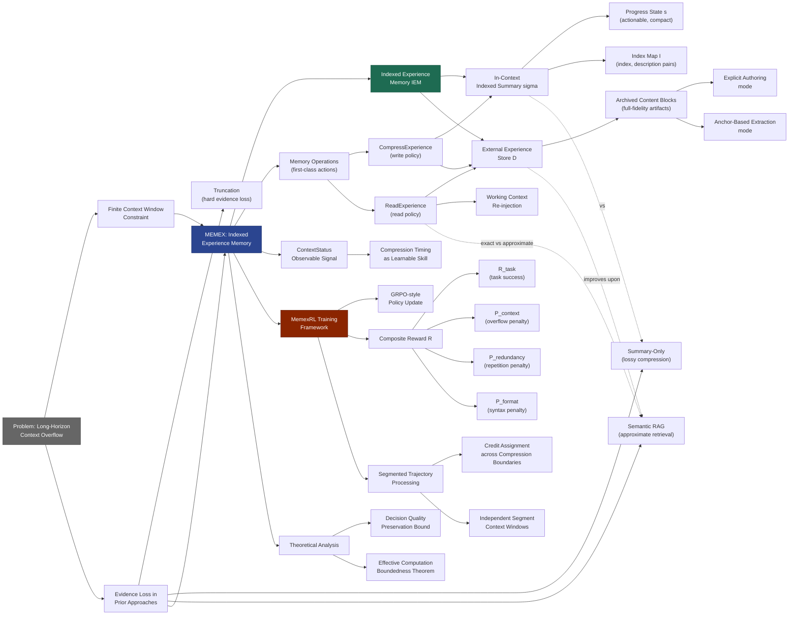

---
tags:
  - paper
  - LLM
  - Foundation_Model
  - Reinforcement_Learning
aliases:
  - "Memex(RL): Scaling Long-Horizon LLM Agents via Indexed Experience Memory"
url: https://huggingface.co/papers/2603.04257
pdf_url: https://arxiv.org/pdf/2603.04257.pdf
local_pdf: "[[MemexRL Scaling LongHorizon LLM Agents via Indexed Experience Memory.pdf]]"
github: "None"
project_page: "None"
institutions:
  - "Center for Advanced AI, Accenture"
publication_date: "2026-03-04"
score: 7
---

# Memex(RL): Scaling Long-Horizon LLM Agents via Indexed Experience Memory

## 📌 Abstract
Large language model (LLM) agents are fundamentally bottlenecked by finite context windows on long-horizon tasks. As trajectories grow, retaining tool outputs and intermediate reasoning in-context quickly becomes infeasible: the working context becomes prohibitively long, eventually exceeds the context budget, and makes distant evidence harder to use even when it is still present. Existing solutions typically shorten context through truncation or running summaries, but these methods are fundamentally lossy because they compress or discard past evidence itself. We introduce Memex, an indexed experience memory mechanism that instead compresses context without discarding evidence. Memex maintains a compact working context consisting of concise structured summaries and stable indices, while storing full-fidelity underlying interactions in an external experience database under those indices. The agent can then decide when to dereference an index and recover the exact past evidence needed for the current subgoal. We optimize both write and read behaviors with our reinforcement learning framework MemexRL, using reward shaping tailored to indexed memory usage under a context budget, so the agent learns what to summarize, what to archive, how to index it, and when to retrieve it. This yields a substantially less lossy form of long-horizon memory than summary-only approaches. We further provide a theoretical analysis showing the potential of the Memex loop to preserve decision quality with bounded dereferencing while keeping effective in-context computation bounded as history grows. Empirically, on challenging long-horizon tasks, Memex agent trained with MemexRL improves task success while using a significantly smaller working context.

## 🖼️ Architecture
![[MemexRL Scaling LongHorizon LLM Agents via Indexed Experience Memory_arch.png]]

## 🧠 AI Analysis

# 🚀 Deep Analysis Report: Memex(RL): Scaling Long-Horizon LLM Agents via Indexed Experience Memory

## 📊 Academic Quality & Innovation
---

# Deep Engineering Analysis: Memex(RL) — Scaling Long-Horizon LLM Agents via Indexed Experience Memory

---

## 1. Core Snapshot

### Problem Statement

Long-horizon LLM agents accumulate tool outputs, intermediate reasoning traces, and observations across dozens to hundreds of steps. The agent's context window is finite, yet trajectory length grows unboundedly. Existing mitigations — truncation, rolling summaries, or semantic retrieval — are fundamentally lossy: they either discard evidence outright or compress it into summaries from which fine-grained artifacts (exact code snippets, API responses, log outputs) cannot be faithfully recovered. Semantic similarity-based retrieval further suffers from ambiguity and near-duplicate fragmentation in dense tool-use histories. The core unresolved gap is: **how to compress context without discarding evidence**, such that any specific archived artifact can be precisely re-injected when it becomes relevant to the current subgoal.

### Core Contribution

Memex introduces an **Indexed Experience Memory** mechanism — comprising a compact in-context indexed summary paired with a full-fidelity external key-value experience archive — and trains both write (compression) and read (dereferencing) behaviors jointly via a GRPO-style RL framework (MemexRL) with reward shaping tailored to context budget and memory-use efficiency, yielding substantially less lossy long-horizon memory than summary-only approaches.

### Academic Rating

| Dimension | Score | Justification |
|-----------|-------|---------------|
| **Innovation** | 7/10 | The pointer-based separation of in-context summary from off-context archive is conceptually clean and well-motivated by human cognitive analogies. The dual-mode archival (explicit authoring vs. anchor-based extraction) is a practical engineering contribution. However, the high-level idea of "index then dereference" is not entirely novel — it extends prior episodic memory and RAG paradigms to the agent setting in a principled way. |
| **Rigor** | 6/10 | The theoretical analysis characterizes a regime in which the Memex loop can preserve decision quality with bounded dereferencing, which is honest and useful. However, the paper is partially cut off (only 8 pages are provided), limiting evaluation of empirical depth, ablation completeness, and statistical significance reporting. |

---

## 2. Technical Decomposition

### 2.1 Algorithmic Logic — Step-by-Step

**Step 1: Initialization.**
The agent context window is initialized as **M** = [m₀, u], where m₀ is the fixed system prompt (tool-use rules, constraints) and u is the task instruction. The external experience store D is initialized as empty (D ← ∅). These two anchor messages are **never compressed**.

**Step 2: Context Status Injection (per step).**
At each step t, before the agent generates its output, the system prepends a deterministic `ContextStatus(M, τ)` message to M. This message reports the current working context token count and the compression threshold τ (e.g., "working context tokens=6932, threshold=8000"). This makes context pressure an observable signal to the agent, turning compression timing into a **learnable skill** rather than a hard system rule.

**Step 3: Agent Action Generation.**
The agent emits a thinking trace z_t and a tool call c_t conditioned on the current M. The tool set T = {CompressExperience(·), ReadExperience(·), Finish(·), OtherTool(·)}. Memory operations are first-class actions in the same action space as environment tools.

**Step 4a: CompressExperience (Write Path).**
If c_t = CompressExperience(IndexedSummary, MemoryBlocks), the agent provides:
- An **IndexedSummary** σ = (s, I), where s is a compact actionable progress state and I is a finite set of (index, description) pairs binding human-readable semantic labels to stable indices.
- A list of **MemoryBlocks**, each being an (index, content) pair.

Content in each MemoryBlock supports two authoring modes:
- *Explicit authoring*: The model writes content directly (reorganized notes, summarized findings).
- *Anchor-based extraction*: The model specifies three short text anchors (start_anchor, mid_anchor, end_anchor) that uniquely identify a verbatim span in the current conversation. The system locates and archives it verbatim. The mid_anchor serves as a verification checkpoint to prevent false matches.

The system then executes: D[index] ← content for all (index, content) in MemoryBlocks, and rewrites M ← [m₀, u, IndexedSummary], collapsing the entire prior trajectory into a compact indexed pointer state.

**Intuition for this design:** Rather than translating tool outputs into prose summaries (lossy), the agent keeps an actionable "task board" (indexed summary) while preserving bit-exact artifacts (code, logs, API payloads) under stable named indices. This mirrors how human knowledge workers maintain a short active note while archiving full documents under file names.

**Step 4b: ReadExperience (Read Path).**
If c_t = ReadExperience(index), the agent dereferences the store: o_t ← D[index], and appends the retrieved block as a new message: M ← M ⊕ [o_t]. This is a precise, deterministic retrieval — not similarity-based — because the index was assigned by the agent itself during compression.

**Step 4c: Finish / OtherTool.**
If c_t = Finish(y), the answer is set and returned. Otherwise, the environment tool is executed and its output appended to M normally.

**Step 5: Trajectory Segmentation for Training.**
When compression occurs at step k, the trajectory is split into segments S₀, S₁, ..., S_k. S₀ contains the full pre-compression history. Each subsequent segment S_i (i > 0) contains [system, task, summary_{i-1}, z_{i1}, c_{i1}, o_{i1}, z_{i2}, c_{i2}, ...], conditioning on the compressed summary from the previous segment rather than the full history. During training, all segments are flattened across the batch and tokenized/optimized independently under each segment's own context window. All segments from the same trajectory share the identical terminal reward R, preserving credit assignment through GRPO's group-relative advantage estimation.

---

### 2.2 Mathematical Formulation

**Episode-level Return (Equation 1):**

$$R = R_{\text{task}} - P_{\text{context}} - P_{\text{redundancy}} - P_{\text{format}}$$

**Variable definitions:**

| Term | Definition |
|------|------------|
| R_task | Binary or graded task success signal (normalized to [0,1]) |
| P_context | Context overflow penalty |
| P_redundancy | Redundant tool call penalty |
| P_format | Malformed tool call format penalty |

**Context Overflow Penalty:**

$$P_{\text{context}} = \min\!\left(1,\ \frac{\sum_{t=1}^{T} \max(0,\ C_t - \tau)}{\tau \cdot T}\right)$$

where C_t is the working context size in tokens at step t (excluding steps where compression was triggered), τ is the context threshold, and T is the total number of steps. The denominator τ·T represents a maximum reasonable overflow, bounding the penalty in [0,1]. **Physical meaning:** This penalizes the agent for allowing the working context to grow beyond threshold τ — incentivizing proactive CompressExperience invocation before context overflow forces degraded truncation behavior.

**Redundant Tool Call Penalty:**

$$P_{\text{redundancy}} = \frac{N_{\text{redundant}}}{N_{\text{tool\_call}}}$$

where N_redundant counts tool calls with identical (name, arguments) signatures previously executed when no state-modifying operation has occurred since, and N_tool_call is the total number of non-memory tool calls. **Physical meaning:** This discourages repetitive re-execution of identical queries (e.g., viewing the same file region multiple times without edits), incentivizing the agent to use ReadExperience to recall already-observed information rather than re-querying the environment.

**Format Error Penalty:**

$$P_{\text{format}} = \frac{N_{\text{malformed}}}{N_{\text{tool\_call}}}$$

where N_malformed counts malformed tool calls including tag mismatches, invalid JSON, and missing required fields (name, arguments). N_tool_call is the number of steps where a tool invocation was attempted. **Physical meaning:** This provides a direct syntactic correctness signal, particularly important for base models without prior tool-use fine-tuning.

**GRPO-style Policy Update:**
MemexRL uses a GRPO (Group Relative Policy Optimization) style update. The advantage for each segment within a trajectory is computed relative to the group (other segments/trajectories sharing the same terminal reward R). Because all segments from a single trajectory share the identical terminal R, the gradient signal propagates credit back to early compression decisions — a well-timed CompressExperience that creates a good index map will receive positive credit if the overall task succeeds, even if the benefit only materializes many steps later.

---

### 2.3 Data Flow and Architecture

The Memex agent operates over the following context states at key stages:

```
Initialization:
M = [m₀ (system, fixed), u (task, fixed)]
|M| ≈ few hundred tokens
D = {}

After k steps of normal execution (no compression):
M = [m₀, u, z₁, c₁, o₁, z₂, c₂, o₂, ..., z_k, c_k, o_k]
|M| grows to potentially thousands of tokens (each o_i may be 100–1100 tokens per the paper's example)

After CompressExperience:
M = [m₀, u, IndexedSummary]  ← approximately 300 tokens in the paper's example
D = {idx_1: content_1, ..., idx_K: content_K}  ← full-fidelity archived blocks

After ReadExperience(idx_i):
M = [m₀, u, IndexedSummary, ..., o_t]  ← temporarily expands by one retrieved block
```

The concrete compression example in the paper demonstrates this numerically: the before-compression context spans 7 reasoning/tool steps with individual token counts of 120–1100 tokens per message (total on the order of 3,000–5,000 tokens). The after-compression IndexedSummary is approximately 300 tokens, with 6 named indices archiving the exact tool outputs externally.

**Architectural choices:**
- **No similarity-based retrieval module**: Retrieval is purely deterministic key lookup — the agent must name the index correctly. This eliminates approximate match ambiguity at the cost of requiring the agent to learn to assign and reuse meaningful, stable index names.
- **Context Status as observable input**: Rather than implementing compression as a background system daemon, the context pressure signal is injected into the agent's input at every step, making it a policy-learnable trigger.
- **Dual-mode archival**: Anchor-based extraction avoids re-generating verbatim content (e.g., code snippets, test outputs) — the agent simply specifies three short string anchors and the system extracts verbatim, reducing both token cost and hallucination risk for exact artifacts.
- **Segmented trajectory processing**: This is architecturally critical for training correctness. Because autoregressive models condition on their prefix, a post-compression segment genuinely sees only the compressed summary as its history prefix — this is not a training approximation but an accurate reflection of inference-time behavior, ensuring no training-inference distribution mismatch from the compression boundary.

---

### 2.4 Innovation Logic — Differentiation from Prior Work

| Approach | Compression Strategy | Evidence Preservation | Retrieval Mechanism |
|----------|---------------------|----------------------|---------------------|
| Truncation | Drop oldest tokens | ✗ Lost | N/A |
| Summary-only (MemAgent, Memory-R1, FoldGRPO) | Lossy prose summary | ✗ Irreversibly compressed | Implicit in summary |
| Semantic RAG | Log to vector store | ✓ Stored | Approximate similarity search |
| **Memex (this work)** | Indexed summary + archive | ✓ Exact, full-fidelity | Deterministic index dereference |

The key structural distinction from summary-only approaches (MEM1, Memory-R1, SUPO, ReSum, FoldGRPO) is that Memex does **not** discard the underlying evidence. The summary is a pointer structure, not a lossy encoding. The key distinction from semantic RAG is that retrieval is **exact and deterministic** rather than approximate — the agent must itself assign stable, meaningful indices at write time, and can only retrieve what it has explicitly indexed. This makes the memory interface auditable (an index points to a concrete artifact, not an approximate match) but also places the indexing burden on the agent's write policy, which is why RL training is required.

Unlike prior RL-based memory approaches that treat compression as a background operation with heuristic rules, MemexRL treats compression timing, archival content selection, index naming, and dereference decisions as all jointly optimizable policy decisions under a single episode-level reward with memory-efficiency shaping terms.

---

## 3. Evidence & Metrics

*(Note: The provided paper pages cut off before the experimental results section. The following is derived from claims made in the introduction and method sections.)*

### Benchmark and Baselines

The paper states evaluation on "challenging long-horizon tasks that require agents to interleave planning and tool calls over dozens to hundreds of steps while revisiting fine-grained evidence long after it first appears." The tasks appear to include complex multi-step software engineering / repository debugging tasks (as evidenced by the detailed SciPy/SymPy bug reproduction example). Comparisons are implied against summary-only memory approaches (MemAgent, Memory-R1, FoldGRPO, SUPO, ReSum) and semantic RAG-style memory systems, under tight context budgets (threshold τ substantially below the full trajectory length).

The experimental design claim is that Memex "improves task success while using a significantly smaller working context" — the key comparative axes are (1) task success rate and (2) active working context size at inference time. This dual-axis evaluation is appropriate for validating the core claim that context compression is achieved without sacrificing performance.

### Key Results

From the abstract and introduction (quantitative results tables were not in the provided pages):
- Memex agent trained with MemexRL improves task success over baselines on long-horizon tasks.
- Memex operates with a "significantly smaller working context" compared to approaches that retain full or partially-summarized history.
- The theoretical analysis establishes that the Memex loop can, in principle, preserve decision quality through bounded explicit dereferencing while keeping effective in-context computation bounded as history grows.

### Ablation Study

The paper's ablation structure (from MemexRL's component description) implies the following critical components to validate:
1. **Indexed archive vs. summary-only**: Removing the external store and using only the in-context summary (degrading to a summary-only approach) should cause the greatest performance drop on tasks requiring precise artifact re-use.
2. **ReadExperience (read policy)**: Disabling the dereference operation (i.e., the agent can compress but cannot retrieve) tests whether the indexed summary alone is sufficient.
3. **Compression timing (context status observable)**: Removing the ContextStatus injection makes compression timing a fixed heuristic rather than a learned behavior.
4. **Anchor-based extraction vs. explicit authoring only**: Tests whether verbatim extraction of exact artifacts matters.
5. **Redundancy penalty**: Tests whether READEXPERIENCE usage is actively incentivized.

The most critical component is almost certainly the **write policy's indexing quality** — if indices are ambiguous or important artifacts are not archived, downstream ReadExperience calls become useless regardless of read policy quality.

---

## 4. Critical Assessment

### 4.1 Hidden Limitations

**Deterministic retrieval dependency on index quality.** The entire Memex paradigm relies on the agent assigning stable, self-consistent, meaningful index names at compression time and correctly reusing those exact names at dereference time. Unlike semantic retrieval which tolerates paraphrase and partial match, a single index name typo or concept drift in naming yields a lookup failure. This is a hard failure mode with no graceful degradation — if the agent compresses evidence under a misnamed index, that evidence is effectively irretrievable. The RL training must learn to make index naming both consistent and semantically meaningful, which is a higher-dimensional learning target than simply learning when to compress.

**Context re-expansion from ReadExperience.** Each ReadExperience call appends a potentially large content block (100–1100 tokens in the paper's example) back into the working context. If the current subgoal requires consulting multiple archived artifacts simultaneously (e.g., cross-referencing three code excerpts), the working context can quickly re-approach the threshold τ. The paper does not explicitly bound the number of simultaneous active retrievals, nor does it analyze the expected context size after k consecutive ReadExperience calls.

**Compression triggers and partial information loss.** The ContextStatus observable makes the agent aware of approaching threshold τ, but the agent may still delay compression until the threshold is very near, at which point the IndexedSummary must condense a very large trajectory. Compressing a 5,000-token trajectory into a 300-token summary necessarily loses much actionable state detail, even if artifacts are preserved in D. The quality of the progress state s in σ = (s, I) degrades as more context must be compressed in a single operation.

**Anchor-based extraction fragility.** The mid_anchor verification mechanism reduces false matches but does not eliminate them in cases of repeated boilerplate code or repetitive log patterns. The system would need robust anchor uniqueness guarantees that may be difficult to enforce when tool outputs contain highly repetitive structured data (JSON arrays, repeated log lines).

**Temporal scope of training.** MemexRL uses GRPO with segmented trajectories. Credit assignment flows through shared terminal reward R across segments. However, for trajectories with many compression events (many segments), the gradient signal to very early compression decisions is diluted through many subsequent policy choices, potentially making it difficult to learn precise indexing behaviors for artifacts that only become relevant very late in the trajectory.

### 4.2 Engineering Hurdles for Reproduction

**Segmented trajectory batching implementation complexity.** The segmentation approach requires that all segments from a single trajectory share the terminal reward R while being trained as independent context windows. This requires a non-standard training data structure where trajectory identity and reward are tracked across variable-length segments of different context sizes. Standard RL fine-tuning frameworks (e.g., TRL, OpenRLHF) do not natively support this pattern and would require custom data collation and loss masking logic.

**Dual-mode anchor extraction system.** The anchor-based extraction mode requires the training system to implement a verbatim span-matching algorithm that identifies (start_anchor, mid_anchor, end_anchor) tuples within the live conversation context and extracts the span. This must handle edge cases including anchors that span message boundaries, anchors containing special tokens, and anchor collisions in repetitive content. This is non-trivial infrastructure that is not described in sufficient detail for straightforward reproduction.

**Threshold τ calibration.** The context overflow penalty P_context is parameterized by τ, but the appropriate value of τ is task- and model-dependent. A τ set too low forces overly aggressive compression; too high and the context penalty provides insufficient gradient signal for the agent to learn proactive compression. The paper does not report a sensitivity analysis on τ, making reproduction of the reported performance numbers sensitive to this hyperparameter.

**Reward normalization across heterogeneous tasks.** The composite reward R = R_task - P_context - P_redundancy - P_format requires all four components to be on comparable scales. R_task is task-specific and may have widely varying magnitudes across task types (binary success vs. partial credit). Without careful normalization, one component may dominate the gradient, causing the agent to optimize exclusively for that component (e.g., minimizing format errors while ignoring task success). The paper states components are "each normalized to [0, 1]" but provides no detail on how R_task normalization is achieved across heterogeneous long-horizon task types.

**Base model sensitivity.** The paper notes that the format penalty is "particularly important for base models without prior tool-use fine-tuning," implying sensitivity to the starting checkpoint. Reproducing results requires either using the same base model or re-tuning the penalty weights, which are not reported.

**External store management during rollout.** During RL training rollouts, D must be maintained as a mutable key-value store per trajectory episode. For parallelized rollouts (multiple episodes running concurrently), each episode requires an independent D instance. At scale, this requires careful memory management, particularly since D may grow large for long trajectories with many archived blocks. The system must also handle D cleanup between episodes to prevent cross-episode contamination.

---

*This analysis is based on the 8 pages of the paper provided. Sections covering experimental results tables, ablation study quantitative results, theoretical analysis formalization, and the full related work discussion were not available for review.*

## 🔗 Knowledge Graph & Connections
## Task 1: Differential Analysis & Connections

### Connection 1: [[LoGeR]] — Hybrid Memory Architecture Parallels

The structural parallel between Memex and [[LoGeR]] is the most intellectually substantive connection in this vault. Both papers confront the same fundamental engineering constraint: a **finite-capacity active processing window** that cannot accommodate the full history of a long sequential process, requiring an architectural separation between active computation state and archived historical evidence.

**Differential Analysis:**
- [[LoGeR]] implements a **dual-component hybrid memory** combining a parametric TTT (Test-Time Training) memory for global frame anchoring and a non-parametric Sliding Window Attention (SWA) for high-precision adjacent alignment. This is an *implicit*, continuous memory system — the TTT state is a learned latent vector, not a human-readable artifact.
- Memex implements a **dual-component hybrid memory** combining an in-context indexed summary (analogous to the SWA's role in preserving recent precise context) and an external key-value experience archive (analogous to the TTT memory's role in anchoring long-range global state). However, Memex's archive is *explicit*, discrete, and deterministically addressable — the agent names indices, and retrieval is exact.
- [[LoGeR]]'s memory is written by a learned encoder passively and continuously; **Memex's memory is written by an active agent decision** — the agent must choose *when*, *what*, and *how* to archive. This is a fundamentally different regime: active episodic indexing vs. passive continuous encoding.
- [[LoGeR]] operates on dense geometric tensors with well-defined spatial structure enabling coherence metrics; Memex operates on heterogeneous text artifacts (code, logs, API payloads) with no inherent structure, making quality assessment harder and necessitating the RL training loop.
- The SWA in [[LoGeR]] preserves *uncompressed* recent context, which directly parallels Memex's decision not to compress the most recent working context segment — both systems recognize that lossless preservation of the near-term window is critical for local precision.

---

### Connection 2: [[TICVLA]] — Delayed Credit Assignment and Asynchronous Decision Interfaces

[[TICVLA]] addresses **temporal decoupling between slow semantic reasoning and fast reactive control**, introducing an explicit delayed semantic-control interface. Memex addresses **temporal decoupling between memory write decisions and their payoff**, where a well-structured CompressExperience operation may only benefit the agent many steps later.

**Differential Analysis:**
- [[TICVLA]]'s core insight is that **semantic state is temporally stale at action execution time** and the policy must be explicitly conditioned on delayed states plus latency metadata. Memex's core insight is that **evidence value is temporally delayed** — an archived artifact's usefulness is unknown at write time and only revealed when a downstream subgoal requires it.
- Both papers require training pipelines specifically designed to handle this temporal mismatch. [[TICVLA]] uses a latency-consistent training pipeline that injects inference delays during imitation learning and RL. Memex uses **segmented trajectory processing** that preserves credit assignment across compression boundaries via shared terminal reward in GRPO — both are non-standard training data engineering solutions to the same class of delayed-signal problem.
- [[TICVLA]] handles asynchrony at the *millisecond* timescale (inference latency in real-time control). Memex handles asynchrony at the *step* timescale (dozens to hundreds of agent steps). The mathematical structure of the credit assignment problem is analogous but at vastly different temporal resolutions.
- [[TICVLA]]'s delayed interface is **system-imposed** (physics of inference latency is fixed); Memex's delayed payoff is **agent-controlled** (the agent decides when to compress and what to index, influencing the difficulty of its own future retrieval). This makes Memex's problem strictly harder from a learning perspective.

---

### Connection 3: [[Xiaomi-Robotics-0]] — RL Post-Training for Behavioral Alignment under Deployment Constraints

[[Xiaomi-Robotics-0]] uses a carefully designed training recipe combining large-scale pre-training followed by RL post-training specifically to align model behavior with **deployment-time constraints** (asynchronous execution, real-time rollout continuity). Memex uses RL post-training (MemexRL/GRPO) specifically to align agent behavior with **inference-time constraints** (context budget τ, precise index naming, efficient memory usage).

**Differential Analysis:**
- [[Xiaomi-Robotics-0]] addresses the gap between *offline training distribution* and *online deployment dynamics* (latency, action chunk alignment). MemexRL addresses the gap between *supervised pre-training behavior* (which cannot learn delayed credit from memory decisions) and *the long-horizon memory management behavior required at deployment*.
- Both papers recognize that **prompt engineering or supervised fine-tuning alone are insufficient** for the target behavior: [[Xiaomi-Robotics-0]] cannot teach asynchronous compensation from static demonstrations, and Memex cannot teach precise indexing and proactive compression from supervised examples because the payoff signal is only available at episode completion.
- [[Xiaomi-Robotics-0]]'s RL focuses on continuous action quality (smooth, real-time trajectories). MemexRL's RL focuses on discrete decision quality (what to archive, how to name it, when to compress). The reward structures are therefore categorically different: [[Xiaomi-Robotics-0]] uses trajectory smoothness and task completion, while MemexRL uses a composite reward with explicit memory-efficiency penalties (P_context, P_redundancy, P_format).
- The **format error penalty** in MemexRL has a partial analog in [[Xiaomi-Robotics-0]]'s action chunk alignment concern — both penalize syntactically/temporally malformed outputs that would cause downstream execution failures.

---

## Task 2: Mermaid Knowledge Graph



---

## Task 3: Future Research Directions

### Direction 1: Hierarchical Indexed Memory with Multi-Level Compression

The current Memex design implements a single-level compression: all archived artifacts are stored flat in D under a single namespace. For extremely long-horizon tasks (thousands of steps), D itself can become large and the index map I within the indexed summary may become unwieldy. A natural extension is **hierarchical indexed memory**, where:

- Level 0: Hot working context (current segment, ~hundreds of tokens)
- Level 1: Recent indexed summary with pointers to Level 2 (compressed episodes, ~hundreds of tokens per episode)
- Level 2: Episode-level archive with pointers to Level 3 (full artifact store)
- Level 3: Cold external store (verbatim artifacts, theoretically unbounded)

The research challenge is training a policy that decides not only *when* and *what* to compress into which level, but also when to **promote** cold artifacts back to warm levels when task context changes. This is directly analogous to OS virtual memory management with multi-level cache hierarchies, and the MemexRL reward structure would need to incorporate level-aware access latency penalties. The connection to [[LoGeR]]'s TTT+SWA hierarchy is direct — that paper provides an existence proof that two-level hybrid memory can work for geometric sequences; the question is whether the same hierarchical principle applies to heterogeneous text artifact sequences under active agent control.

---

### Direction 2: Index Quality Self-Evaluation and Revision

A critical failure mode of Memex identified in the analysis above is that **poor indexing at write time makes evidence irretrievable at read time**, with no graceful degradation. An agent trained with MemexRL may learn to assign consistent indices within a single task distribution but may fail on out-of-distribution tasks where the relevant artifacts cannot be named using familiar schema.

A concrete research direction is to introduce an **index quality self-evaluation mechanism**: after each CompressExperience operation, the agent performs a brief self-consistency check by attempting to re-derive a subset of the archived content from the indexed summary alone (without dereferencing D), and comparing the re-derived content against what was actually archived. The divergence score between re-derived and archived content serves as an auxiliary reward signal for the write policy. This would incentivize the agent to create indexed summaries that are not merely compact but are genuinely *inferentially sufficient* relative to the archive — i.e., the summary description must allow the agent to know *exactly* what will be retrieved before it invokes ReadExperience. This connects to the broader problem of teaching LLMs meta-cognitive accuracy about their own knowledge boundaries.

---

### Direction 3: Cross-Episode Memory Transfer via Persistent Indexed Archives

The current Memex formulation treats each episode independently — D is initialized empty per episode and discarded at the end. However, for agents deployed repeatedly on structurally similar tasks (e.g., a software engineering agent working on the same codebase across multiple sessions), many archived artifacts from previous episodes are directly relevant to new episodes. A natural extension is **persistent cross-episode indexed archives**, where:

- D persists across episodes and is organized by task/project namespace.
- The agent can reference indices from previous episodes in its current indexed summary.
- MemexRL reward shaping must then incorporate a *retrieval precision* component: successfully retrieving a cross-episode artifact that contributes to task success should yield positive reward, while retrieving irrelevant cross-episode artifacts should incur a redundancy-analogous penalty.

The key technical challenge is **index drift**: an artifact indexed as `ctx_units_method_loc_001` in episode 1 (pointing to line 152 of unitsystem.py) may no longer be valid in episode 5 after code edits. The agent must learn to validate index staleness and update or invalidate stale entries. This is the agent-memory analog of cache invalidation — a canonically hard problem — but it may be tractable under RL if staleness detection can be formulated as a reward-relevant observable (e.g., a retrieved artifact that contradicts current tool output signals staleness). This direction would position Memex as a foundation for **lifelong learning LLM agents** with persistent, self-maintained knowledge bases.

---
*Analysis performed by PaperBrain-OpenRouter (anthropic/claude-sonnet-4.6) (Vision-Enabled)*


## 📂 Resources
- **Local PDF**: [[MemexRL Scaling LongHorizon LLM Agents via Indexed Experience Memory.pdf]]
- [Online PDF](https://arxiv.org/pdf/2603.04257.pdf)
- [ArXiv Link](https://huggingface.co/papers/2603.04257)
