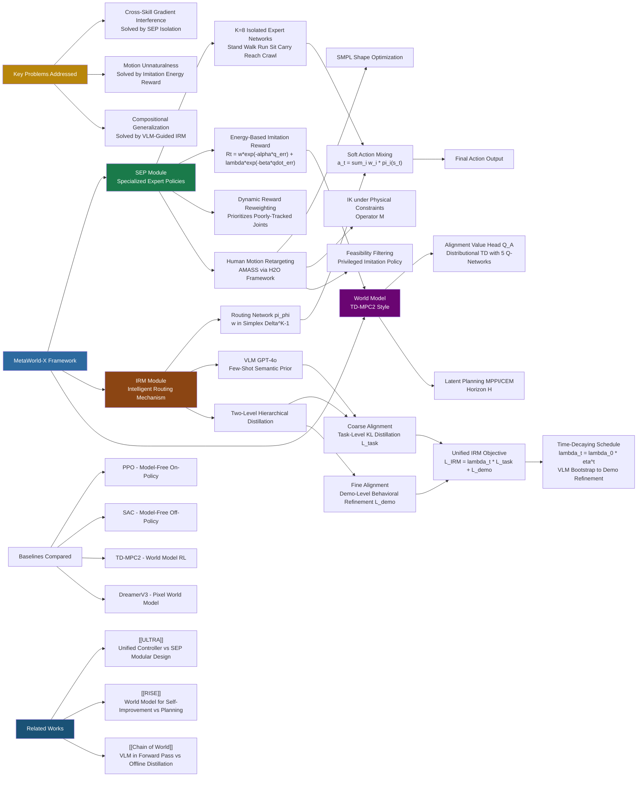

---
tags:
- paper
- domain/embodied_ai
- domain/multimodal_perception
- domain/reinforcement_learning
- domain/robot_manipulation
- domain/world_model
- impact/high_value
- method/foundation_model
- method/imitation_learning
- method/reinforcement_learning
- review/auto_tagged
- status/unread
- task/loco_manipulation
- task/manipulation
- task/scene_understanding
- type/system
aliases:
- 'MetaWorld-X: Hierarchical World Modeling via VLM-Orchestrated Experts for Humanoid
  Loco-Manipulation'
url: http://arxiv.org/abs/2603.08572v1
pdf_url: https://arxiv.org/pdf/2603.08572v1
local_pdf: '[[MetaWorldX Hierarchical World Modeling via VLMOrchestrated Experts for
  Humanoid LocoManipulation.pdf]]'
github: None
project_page: https://syt2004.github.io/metaworldX/
institutions:
- University of Hamburg, Hamburg, Germany
- Beijing University of Technology, Beijing, China
- Fudan University, Shanghai, China
- University of Alberta, Canada
publication_date: '2026-03-09'
score: '8.0'
domains:
- embodied_ai
- multimodal_perception
- reinforcement_learning
- robot_manipulation
- world_model
methods:
- foundation_model
- imitation_learning
- reinforcement_learning
tasks:
- loco_manipulation
- manipulation
- scene_understanding
paper_type: system
impact_band: high_value
reading_status: unread
year: 2026
priority_score: 99
review_status: auto_tagged
next_action: inspect_protocol
arxiv_id: '2603.08572'
paper_id: arxiv:2603.08572
---

# MetaWorld-X: Hierarchical World Modeling via VLM-Orchestrated Experts for Humanoid Loco-Manipulation

## 📌 Abstract
Learning natural, stable, and compositionally generalizable whole-body control policies for humanoid robots performing simultaneous locomotion and manipulation (loco-manipulation) remains a fundamental challenge in robotics. Existing reinforcement learning approaches typically rely on a single monolithic policy to acquire multiple skills, which often leads to cross-skill gradient interference and motion pattern conflicts in high-degree-of-freedom systems. As a result, generated behaviors frequently exhibit unnatural movements, limited stability, and poor generalization to complex task compositions. To address these limitations, we propose MetaWorld-X, a hierarchical world model framework for humanoid control. Guided by a divide-and-conquer principle, our method decomposes complex control problems into a set of specialized expert policies (Specialized Expert Policies, SEP). Each expert is trained under human motion priors through imitation-constrained reinforcement learning, introducing biomechanically consistent inductive biases that ensure natural and physically plausible motion generation. Building upon this foundation, we further develop an Intelligent Routing Mechanism (IRM) supervised by a Vision-Language Model (VLM), enabling semantic-driven expert composition. The VLM-guided router dynamically integrates expert policies according to high-level task semantics, facilitating compositional generalization and adaptive execution in multi-stage loco-manipulation tasks.

## 🖼️ Architecture
![[MetaWorldX Hierarchical World Modeling via VLMOrchestrated Experts for Humanoid LocoManipulation_arch.png]]

## 🧠 AI Analysis

# 🚀 Deep Analysis Report: MetaWorld-X: Hierarchical World Modeling via VLM-Orchestrated Experts for Humanoid Loco-Manipulation

## 📊 Academic Quality & Innovation
---

# MetaWorld-X: A Deep Engineering-Centric Analysis

---

## 1. Core Snapshot

### Problem Statement
Training a monolithic reinforcement learning (RL) policy for high-degree-of-freedom (DoF) humanoid robots to simultaneously perform locomotion and manipulation (loco-manipulation) produces cross-skill gradient interference and motion pattern conflicts. When multiple skills share a single parameter space, gradient updates from conflicting task objectives destabilize each other, resulting in motion jitter, unnatural gait patterns, posture collapse, and poor generalization to compositional task sequences. Existing world model approaches (e.g., TD-MPC2, DreamerV3) partially alleviate sample inefficiency but do not structurally resolve skill conflict, and imitation learning alone does not inherently generalize across task compositions.

### Core Contribution
MetaWorld-X proposes a hierarchical world model framework that decouples skill learning into human-motion-regularized Specialized Expert Policies (SEP) and composes them at inference time via a VLM-supervised Intelligent Routing Mechanism (IRM), thereby simultaneously resolving cross-skill gradient interference and enabling semantic compositional generalization.

### Academic Rating
- **Innovation: 7/10** — The combination of MoE-style modular skill separation with VLM-guided semantic routing is a meaningful integration of disparate threads (imitation learning, world models, LLM/VLM orchestration). However, each individual component (MoE, imitation-constrained RL, VLM-as-supervisor) is established; the novelty lies primarily in their integration and the specific hierarchical distillation pipeline for the router. The motion retargeting pipeline via H2O is an engineering contribution rather than an algorithmic one.
- **Rigor: 6/10** — The paper includes comparisons against PPO, SAC, TD-MPC2, and DreamerV3 and conducts a multi-component ablation study. However, the evaluation is confined to MuJoCo simulation (Humanoid-bench), success rates are low across most baselines suggesting the benchmark may be particularly difficult for those methods, and no real-robot transfer experiments are included. The claim of "few-shot compositional generalization" is tested on limited task compositions.

---

## 2. Technical Decomposition

### 2.1 Algorithmic Logic

The framework operates in three sequential stages: (1) motion retargeting, (2) specialized expert training (SEP), and (3) intelligent routing training and inference (IRM).

**Step 1: Human Motion Retargeting**
Raw MoCap data from AMASS is adapted to the target humanoid's kinematic structure using the H2O framework. The SMPL body model is aligned to the robot morphology via shape optimization. A state-alignment operator $\mathcal{M}$ is defined as:
$$\mathcal{M}(\mathbf{q}_t, \dot{\mathbf{q}}_t, \mathbf{q}^*_t, \dot{\mathbf{q}}^*_t) = \|\mathbf{q}_t - \mathbf{q}^*_t\|^2_W + \gamma\|\dot{\mathbf{q}}_t - \dot{\mathbf{q}}^*_t\|^2_W$$
Inverse kinematics minimizes $\mathcal{M}$ subject to physical and joint constraints. Dynamic feasibility is checked in simulation, and physically unstable trajectories are filtered via a privileged imitation policy, yielding a refined reference motion dataset $\mathcal{D}_\text{human}$ for each skill.

*Intuition*: Raw human motion contains dynamics infeasible for a robot (e.g., foot-slip, joint limit violations). Filtering via a privileged policy ensures that the reference trajectories used for imitation rewards are physically realizable, preventing divergence during downstream RL training.

**Step 2: Specialized Expert Policy (SEP) Training**
Each of the $K$ expert policies $\{\pi_i\}_{i=1}^K$ is trained independently on a single motor primitive (Stand, Walk, Run, Sit, Carry, Reach, Crawl) using imitation-constrained RL within a world model framework. The objective is:
$$\mathcal{J}_\text{SEP} = \sum_{i=1}^K \mathbb{E}_{s \sim \mathcal{D}_\text{human}} \left[ \mathcal{A}(\pi_i(s), \pi^{(i)}_\text{human}) \right]$$
where $\mathcal{A}$ is the alignment operator. The instantaneous imitation reward is:
$$R_t = w \left[ e^{-\alpha\|\mathbf{q}_t - \mathbf{q}^*_t\|^2} + \lambda e^{-\beta\|\dot{\mathbf{q}}_t - \dot{\mathbf{q}}^*_t\|^2} \right]$$
Here $\mathbf{q}_t, \dot{\mathbf{q}}_t$ are robot joint positions and velocities at time $t$; $\mathbf{q}^*_t, \dot{\mathbf{q}}^*_t$ are the phase-aligned reference states from retargeted MoCap; $w, \alpha, \beta, \lambda$ are scalar hyperparameters. The exponential form guarantees bounded, non-vanishing gradients regardless of the magnitude of the tracking error, which is important for stable learning far from and near the target trajectory.

Dynamic reward reweighting prioritizes poorly tracked joints: a dynamic weight $w_j \propto \text{tracking error}_j$ is computed per-joint and used to scale gradient contributions, ensuring that joints with persistent misalignment receive stronger learning signal.

The alignment signal is integrated into the world model's reward head $\hat{\mathcal{R}}_\theta(z_t, a_t)$ via an alignment-based value function $Q_\mathcal{A}$. The temporal-difference target is:
$$y_t = R_t + \gamma Q_\mathcal{A}(z_{t+1}, \pi_\theta(z_{t+1}))$$
Policy updates follow a maximum-entropy objective:
$$J(\pi) = \mathbb{E}\left[Q_\mathcal{A}(z, a) - \tau\mathcal{H}(\pi(\cdot|z))\right]$$
where $\tau$ is the entropy weight and $\mathcal{H}(\pi) = -\mathbb{E}_\pi[\log\pi(\cdot|s_t)]$ is the policy entropy term that prevents premature collapse to deterministic policies. Latent-space planning uses MPPI/CEM over horizon $H$:
$$J = \sum_{k=0}^{H-1} \gamma^k \left( \hat{\mathcal{R}}_\theta(z_{t+k}, a_{t+k}) + \mu Q_\mathcal{A}(z_{t+k}, a_{t+k}) \right)$$
where $\mu$ is a scaling factor for the value head.

*Intuition for expert separation*: Assigning each skill to an isolated parameter space eliminates gradient interference by construction. The human motion prior acts as a biomechanical inductive bias that regularizes the policy toward natural, physically plausible motions rather than reward-maximizing but unnatural ones.

**Step 3: IRM Training via Hierarchical Semantic Distillation**
The IRM is a learnable routing network $\pi_\phi(\mathbf{w}|s, \mathcal{V}(\mathcal{T}))$ that maps the current observation $s$ and task semantics $\mathcal{V}(\mathcal{T})$ (from VLM) to a weight distribution $\mathbf{w} \in \Delta^{K-1}$ (simplex). The composed action is:
$$a_t = \mathcal{F}_\phi\left(\{\pi_i(s_t)\}_{i=1}^K; \mathbf{w}_t\right) = \sum_{i=1}^K w_{t,i} \cdot \pi_i(s_t)$$

The IRM training uses a two-level hierarchical distillation objective:

**Coarse Alignment (Task-Level Semantic Prior):** The VLM (GPT-4o) is queried with a few-shot prompt (Fig. 4) containing the task description $\mathcal{T}$ and example expert weight distributions. It returns a zero-shot relevance vector $\mathbf{w}_v \in \mathbb{R}^K$. The router is trained to align with this via:
$$\mathcal{L}_\text{task}(\phi) = \mathcal{D}_\text{KL}(\pi_\phi(\mathbf{w}|s, \mathcal{V}(\mathcal{T})) \| \mathbf{w}_v) - \beta\mathcal{H}(\phi)$$
where $\beta$ is an entropy regularization coefficient preventing over-confident routing.

**Fine Alignment (Demonstration-Level Behavioral Refinement):** From a small set of demonstrations $D$, the VLM extracts a demonstration-conditioned prior $P_\text{demo}(\mathbf{w}|D) \in \Delta^{K-1}$, reflecting temporal composition statistics observed in actual trajectories. The router is trained via:
$$\mathcal{L}_\text{demo}(\phi) = \mathbb{E}_{s \sim \mathcal{D}_\mathcal{T}}\left[\mathcal{D}_\text{KL}(\pi_\phi(\mathbf{w}|s, \mathcal{V}(\mathcal{T})) \| P_\text{demo}(\mathbf{w}|D))\right]$$

**Unified Training Objective:**
$$\mathcal{L}_\text{IRM}(\phi) = \lambda(t) \cdot \mathcal{L}_\text{task}(\phi) + \mathcal{L}_\text{demo}(\phi)$$
where $\lambda(t) = \lambda_0 \eta^t$ is a time-decaying weight with decay rate $\eta \in (0,1)$. This schedule causes the IRM to initially rely on VLM-provided coarse semantic bootstrapping (high $\lambda(t)$) and progressively shift to demonstration-based fine-grained behavioral refinement, eventually enabling autonomous operation without direct VLM queries at inference time.

*Intuition*: The two-level distillation mirrors curriculum learning. Coarse VLM supervision provides global structure (which experts are relevant for a task), while demonstration-level refinement captures temporal composition patterns (when to transition between experts during execution). The decaying schedule implements a soft handover from teacher-directed to self-directed learning.

**Step 4: Inference**
At inference, the VLM is queried once to cache task guidance $\mathcal{V}(\mathcal{T})$. The routing network $\pi_\phi$ then operates in real-time using only the cached guidance and current observation $s_t$, without additional VLM queries, thus avoiding latency bottlenecks:
$$a_t = \sum_{i=1}^K \left[\pi_\phi(\mathbf{w}|s_t, \mathcal{V}(\mathcal{T}))\right]_i \cdot \pi_i(s_t)$$

---

### 2.2 Mathematical Formulation Summary

| Symbol | Definition |
|--------|-----------|
| $\mathbf{q}_t, \dot{\mathbf{q}}_t$ | Robot joint positions and velocities at time $t$ |
| $\mathbf{q}^*_t, \dot{\mathbf{q}}^*_t$ | Phase-aligned reference expert states from retargeted MoCap |
| $w, \alpha, \beta, \lambda$ | Scalar hyperparameters for reward shaping magnitude |
| $R_t$ | Instantaneous energy-based imitation reward |
| $\gamma$ | Discount factor for RL |
| $\tau$ | Entropy temperature weight in max-entropy RL |
| $\mathcal{H}(\pi)$ | Policy entropy, $-\mathbb{E}[\log\pi(\cdot|s_t)]$ |
| $Q_\mathcal{A}$ | Alignment-based action-value function |
| $z_t$ | Latent state from world model encoder |
| $\hat{\mathcal{R}}_\theta$ | World model reward head |
| $\mu$ | Scaling factor for value head in planning |
| $K$ | Number of expert policies |
| $\mathbf{w} \in \Delta^{K-1}$ | Expert weight distribution on the $(K{-}1)$-simplex |
| $\mathcal{V}(\mathcal{T})$ | Semantic task guidance vector from VLM for task $\mathcal{T}$ |
| $\mathbf{w}_v$ | Zero-shot VLM-inferred relevance vector |
| $\phi$ | Parameters of the routing network $\pi_\phi$ |
| $P_\text{demo}(\mathbf{w}|D)$ | Demonstration-conditioned prior over expert weights |
| $\lambda(t) = \lambda_0\eta^t$ | Time-decaying weight with decay rate $\eta$ |
| $\beta$ | Entropy regularization coefficient in router training |

---

### 2.3 Tensor Flow & Architecture

**SEP Architecture:**
- Input: Proprioceptive observation $s_t \in \mathbb{R}^{51}$ (or $\mathbb{R}^{151}$ for richer configurations)
- Encoder: 2-layer MLP, 256 units/layer → latent $z_t \in \mathbb{R}^{512}$
- Policy network: 512-dim MLP → action $a_t \in \mathbb{R}^{19}$ (or $\mathbb{R}^{61}$ for whole-body)
- Value ensemble: 5 independent 512-dim Q-networks (distributional TD)
- World model: shared latent 512-dim space; reward head $\hat{\mathcal{R}}_\theta: \mathbb{R}^{512} \times \mathbb{R}^{19} \rightarrow \mathbb{R}$

**IRM Architecture:**
- Input: Concatenation of $[s_t \in \mathbb{R}^{51\text{ or }151}, \mathcal{V}(\mathcal{T}) \in \mathbb{R}^d]$
- Routing network: MLP → $\mathbf{w} \in \Delta^{K-1}$ (softmax output, $K=8$ in experiments)
- Output: Weighted sum of $K$ expert action vectors → final action $a_t \in \mathbb{R}^{19\text{ or }61}$

**Notable Architectural Choices:**
- The composition operator is a **soft weighted mixture** (not hard gating), ensuring differentiability during IRM training and smooth behavioral transitions.
- The world model provides **distributional value estimation** (5-ensemble Q-networks), reducing overestimation bias common in high-DoF systems.
- The VLM is GPT-4o with **few-shot prompting** (not fine-tuned), reducing deployment cost while leveraging zero-shot semantic reasoning.

---

### 2.4 Innovation Logic

Prior approaches and their limitations versus MetaWorld-X:

| Approach | Mechanism | Limitation Addressed by MetaWorld-X |
|----------|-----------|--------------------------------------|
| Monolithic RL (PPO, SAC) | Single policy, shared parameters | Cross-skill gradient interference → MetaWorld-X uses isolated expert parameter spaces |
| TD-MPC2 | Implicit world model, CEM planning in latent space | Optimizes for task return without biomechanical regularization; monolithic skill learning → MetaWorld-X adds imitation energy reward and distributional value head |
| DreamerV3 | Pixel-based latent world model, imagination rollouts | Long-horizon model bias; no skill decomposition → MetaWorld-X uses hierarchical expert decomposition |
| Prior MoE (e.g., [11], [20]) | Skill-specialized subnetworks with fixed routing | Heuristic routing, no semantic grounding, lacks compositional generalization → MetaWorld-X uses VLM-supervised hierarchical distillation for semantic routing |
| Imitation Learning only | Tracks reference trajectory | Does not generalize across compositions; retargeting artifacts → MetaWorld-X uses IL as an inductive bias within RL, not as a sole objective |

The key mathematical difference from TD-MPC2 is the addition of the alignment-based value head $Q_\mathcal{A}$ that augments the standard task-return value function with an imitation energy signal, jointly shaping the latent planning process toward biomechanically consistent trajectories. Unlike standard MoE methods with fixed or learned-without-grounding routing, the IRM router is initialized via KL-divergence distillation from VLM-provided priors, ensuring the routing network starts in a semantically meaningful region of the weight space before fine-tuning on demonstrations.

---

## 3. Evidence & Metrics

### 3.1 Benchmark & Baselines

**Environment:** MuJoCo-based Humanoid-bench [5] with a full-body humanoid robot.

**Tasks evaluated:**
- *Fundamental locomotion skills (SEP evaluation):* Stand, Walk, Run, Sit, Carry — 500K training steps
- *Complex loco-manipulation tasks (IRM evaluation):* Door, Basketball, Push, Truck, Package

**Baselines:**
- PPO [28]: Model-free on-policy RL (no world model)
- SAC [29]: Model-free off-policy RL
- TD-MPC2 [7]: State-of-the-art model-based RL with implicit world model
- DreamerV3 [8]: Pixel-based world model RL

**Fairness Assessment:** The comparison is broadly fair in the sense that all methods are trained for the same step budgets and evaluated on the same tasks. However, the following caveats apply: (1) PPO and SAC are notably weak baselines on dense-reward high-DoF tasks; their near-zero success rates suggest they serve more as lower-bound sanity checks than competitive comparisons. (2) TD-MPC2 is the most meaningful baseline, and the improvements are more modest in absolute terms than the presentation suggests. (3) No ablation is provided comparing different sizes of the expert library ($K$), which would clarify the scalability of the approach.

---

### 3.2 Key Results

**Expert Policy Learning (Table I):**

| Task | TD-MPC2 Return | Ours Return | Improvement | TD-MPC2 Conv. (M steps) | Ours Conv. (M steps) |
|------|---------------|-------------|-------------|------------------------|---------------------|
| Stand | 749.8 ± 63.1 | **815.9 ± 0.3** | +8.8% | 1.8 | **0.6** (3× faster) |
| Walk | 644.2 ± 162.3 | **1118.7 ± 7.1** | +73.6% | 1.8 | **0.5** (3.6× faster) |
| Run | 66.1 ± 4.7 | **2056.9 ± 13.6** | +3011% | 2.0 | **1.0** (2× faster) |
| Sit | 733.9 ± 120.6 | **862.2 ± 2.1** | +17.5% | 1.1 | **0.6** (1.8× faster) |
| Carry | 438.0 ± 72.9 | **963.5 ± 5.1** | +120% | 1.9 | **0.5** (3.8× faster) |

The Run task shows an extraordinary improvement, though the baseline return of 66.1 for TD-MPC2 suggests that TD-MPC2 nearly fails at this task, inflating the relative gain.

**Complex Loco-Manipulation Tasks (Table IV):**

| Task | TD-MPC2 Return | Ours Return | Δ Return |
|------|---------------|-------------|---------|
| Door | 285.0 ± 12.0 | **470.0 ± 2.2** | +65% |
| Basketball | 148.4 ± 3.3 | **250.0 ± 11.9** | +68.5% |
| Push | −113.8 ± 6.8 | **70.0 ± 2.1** | significant sign flip |
| Truck | 1213.2 ± 1.1 | **1500.0 ± 15.6** | +23.6% |
| Package | −6788.5 ± 552.7 | **−5200.0 ± 47.2** | improvement (less negative) |

**Success Rate on Locomotion (Table II):** Ours achieves 9/10 on Stand, Walk, Run, Carry versus TD-MPC2's 3/10, representing a 3× improvement in task success rate.

---

### 3.3 Ablation Study

The ablation study (Table III, Fig. 8) on the door-opening task with 500K training steps:

| Variant | Return | Conv. Steps (M) |
|---------|--------|-----------------|
| TD-MPC2 baseline | 198.42 | 32.38 |
| Without intelligent router | 296.57 | 20.36 |
| Without VLM semantic guidance | NULL | NULL (fails entirely) |
| Without Imitation Learning | 193.61 | ∞ (does not converge) |
| **Full Model** | **303.95** | **12.64** |

**Critical findings:**
1. **Without IL (w/o IL)** is the most catastrophic ablation: the model achieves moderate return (193.61) but never converges (∞ steps). This confirms that IL-based initialization is a prerequisite for the SEP-IRM pipeline to function; without it, the expert policies provide no reliable primitives for the router to compose.
2. **Without VLM (w/o VLM)** leads to complete failure (NULL success): a rule-based router without semantic grounding cannot generalize to task compositions, demonstrating that VLM-provided semantic guidance is essential for zero-shot compositional behavior.
3. **Without Router** achieves the second-best return (296.57) but at 61% greater training cost (20.36 vs. 12.64 M steps), confirming that the router primarily accelerates learning efficiency rather than being strictly necessary for final performance ceiling.
4. The full model achieves the best return (303.95) with the fastest convergence (12.64 M steps), validating the complementary roles of all three components.

---

## 4. Critical Assessment

### 4.1 Hidden Limitations

**1. Simulation-Only Validation:** All experiments are conducted in MuJoCo. No sim-to-real transfer results are provided. The key risks include contact dynamics fidelity (MuJoCo's simplified contact model differs substantially from real-world interactions), actuation delays, and sensor noise. The motion retargeting pipeline addresses kinematic plausibility but not actuator-level sim-to-real gaps.

**2. Fixed Expert Library Size:** The architecture uses $K=8$ experts constructed through "minimal orthogonality" criteria. This raises questions about scalability: how does performance degrade or improve as $K$ increases? Are there skills that are genuinely non-orthogonal (e.g., "carrying while walking" versus "walking" and "carrying" separately)? The paper does not address skill boundary determination systematically.

**3. Soft Mixing Assumption:** The composition operator is a weighted sum $a_t = \sum_i w_i \pi_i(s_t)$. This assumes that meaningful behaviors can be produced by linearly interpolating actions from independently trained policies. For complex bimanual or contact-rich tasks, action-space superposition may produce physically inconsistent joint torques (e.g., conflicting joint commands from Walk and Carry experts). This is a fundamental limitation of action-space mixing versus latent-space or option-level composition.

**4. VLM Dependency and Determinism:** The VLM (GPT-4o) is used as a supervisory signal during training. However, LLM outputs are stochastic and potentially inconsistent across queries. While the paper uses few-shot prompting with structured output format (Fig. 4), the sensitivity of the final router's behavior to variations in VLM-provided weight vectors $\mathbf{w}_v$ is not analyzed. A poorly calibrated VLM output could corrupt the $\mathcal{L}_\text{task}$ signal.

**5. Package Task Remains Negative:** Despite significant improvement, the Package task returns remain strongly negative (−5200), suggesting that even the full model fails to solve this task reliably. This is not addressed in the discussion.

**6. Convergence Definition Sensitivity:** The "convergence step" metric is defined as entry into and stable maintenance within a ±5% band for $W$ consecutive evaluations. The value of $W$ is not specified, making cross-paper comparisons of this metric difficult.

---

### 4.2 Engineering Hurdles for Reproduction

**1. Motion Retargeting Pipeline Complexity:** The H2O framework for MoCap-to-robot retargeting involves SMPL shape fitting, inverse kinematics with joint constraint satisfaction, and simulation-based feasibility filtering via a privileged policy. Reproducing this pipeline requires access to AMASS dataset, H2O codebase, and careful tuning of joint weight matrices $W$ in the retargeting objective (Eq. 8). The privileged filtering step introduces a circular dependency: a pre-trained policy is needed to filter training data for the next policy.

**2. Dynamic Reward Reweighting Implementation:** The per-joint dynamic weighting mechanism (prioritizing poorly tracked joints) is described conceptually but the specific formulation of $w_j$ as a function of tracking error is not given explicitly. Implementers must reverse-engineer the weighting schedule, which could significantly affect convergence behavior.

**3. IRM Training Schedule Sensitivity:** The time-decaying weight $\lambda(t) = \lambda_0 \eta^t$ requires careful calibration of $\lambda_0$ and $\eta$. If $\eta$ decays too rapidly, the router never adequately learns from VLM coarse guidance; too slowly, and the demonstration-level refinement is suppressed. No specific values or sensitivity analysis for these hyperparameters are provided.

**4. VLM Prompt Engineering:** The few-shot VLM prompts (Fig. 4) require careful construction. The constraint "weights must sum to 2.0" (a non-standard simplex) and the example task-weight pairs constitute implicit prior knowledge about the skill library. Scaling to a different humanoid platform with a different skill set would require re-engineering these prompts and example demonstrations.

**5. Ensemble Q-Network Training Stability:** The value function uses an ensemble of five independent 512-dim Q-networks with distributional TD. Training five independent networks simultaneously with a shared world model introduces significant memory and compute overhead and potential ensemble training instability if individual networks diverge in their value estimates.

**6. Expert Isolation vs. Shared World Model:** The paper describes both per-expert isolation (separate parameter spaces) and a shared world model. The boundary between what is shared and what is isolated in the world model (encoder, dynamics, reward head) is not precisely specified, which complicates architectural reproduction.

**7. Absence of Code Repository:** The GitHub URL listed in the project page section does not lead to a code repository at submission time, making direct reproduction dependent entirely on the methodological description in the paper.

## 🔗 Knowledge Graph & Connections
## Task 1: Differential Analysis & Connections

### Connection 1: MetaWorld-X vs. [[ULTRA]] — Retargeting Philosophy and Controller Architecture

Both papers address the motion retargeting problem for humanoid loco-manipulation, but their design philosophies diverge sharply at the controller level. [[ULTRA]] introduces a **physics-driven neural retargeting** algorithm designed explicitly to handle contact-rich interactions and preserve physical plausibility at scale, then distills a **unified multimodal controller** that handles both dense reference tracking and sparse task specifications from a single policy network. MetaWorld-X takes the opposite architectural stance: rather than unifying skills into a single controller, it uses retargeted MoCap (via H2O) as expert-specific imitation rewards within *isolated* policy networks, one per motor primitive.

**Key Differential**: [[ULTRA]]'s unified controller is more parameter-efficient and avoids the routing problem entirely, but at the cost of potential gradient interference reintroduction when skills conflict under a shared backbone. MetaWorld-X's modular SEP explicitly prevents this interference but introduces a non-trivial routing problem and the action-space linear mixing assumption. Furthermore, [[ULTRA]] explicitly targets the **scarcity and quality of retargeted data** problem (which MetaWorld-X acknowledges but partially addresses only via feasibility filtering), and supports **egocentric visual inputs** — a capability MetaWorld-X does not demonstrate, operating only on proprioceptive state.

---

### Connection 2: MetaWorld-X vs. [[RISE]] — World Model Role and Self-Improvement

Both papers integrate world models into their control pipelines, but they assign fundamentally different roles to the world model. In [[RISE]], the **Compositional World Model** serves as an imagination engine for *offline* policy improvement — it predicts multi-view futures and evaluates imagined rollouts to generate training signal without additional real-world interaction. The world model is the primary mechanism for scalability and robustness. In MetaWorld-X, the world model (TD-MPC2-style implicit model) serves primarily as a **planning substrate** for within-episode trajectory optimization via MPPI/CEM in latent space, and as a host for the alignment-based distributional value head $Q_\mathcal{A}$.

**Key Differential**: [[RISE]] uses the world model for **closed-loop self-improvement** — a scalable data flywheel for policy refinement — while MetaWorld-X uses it for **single-episode look-ahead planning**. MetaWorld-X does not implement any self-improvement loop; once expert policies converge, they are fixed, and the IRM router is trained separately. This means MetaWorld-X cannot autonomously improve from deployment-time experience, which [[RISE]] explicitly enables. Conversely, MetaWorld-X's world model is enriched with biomechanical imitation signals that [[RISE]]'s progress value model does not incorporate, giving MetaWorld-X a naturalness advantage absent from [[RISE]]'s manipulation-focused setting.

---

### Connection 3: MetaWorld-X vs. [[Chain of World]] — VLM/Language Grounding Strategy

Both papers leverage large pretrained models (VLMs/VLAs) to provide high-level semantic guidance to lower-level controllers, but the mechanism and integration depth differ substantially. [[Chain of World]] (CoWVLA) deeply integrates world-model temporal reasoning into the VLA's **forward pass** through a disentangled latent motion chain — the model predicts a continuous sequence of latent motion representations before committing to an action, essentially performing internal world-model simulation. The VLM/language instruction modulates the entire latent motion chain generation. MetaWorld-X uses the VLM (**GPT-4o**) in a fundamentally more shallow and decoupled manner: it is queried **offline during training** to produce expert weight vectors $\mathbf{w}_v$ that supervise the router via KL divergence, and is **not involved in the forward pass** at inference time.

**Key Differential**: CoWVLA's approach tightly couples language reasoning with temporal motion prediction, enabling context-sensitive, step-by-step behavioral planning. MetaWorld-X's VLM integration is coarser — it provides task-level semantic priors that are distilled into a lightweight router, which then operates without the VLM at test time. This makes MetaWorld-X more inference-efficient but less capable of fine-grained, language-conditioned mid-task replanning. CoWVLA addresses the **redundant background reconstruction** problem in video prediction by factorizing into structure and motion latents, a problem orthogonal to MetaWorld-X's concerns. However, MetaWorld-X's hierarchical two-level distillation (coarse task semantics + fine demonstration refinement) is more principled than simply conditioning on a language token, as it explicitly models the temporal composition statistics of expert usage.

---

### Connection 4: Cross-Cutting Theme — Modularity vs. Unification Tension

A meta-level connection across all three related notes and MetaWorld-X is the unresolved tension between **modular decomposition** and **unified architectures** in embodied control:

- [[ULTRA]] argues for unification at the controller level (one policy, multiple modalities and reference types)
- [[RISE]] argues for compositional modularity at the world model level (separate dynamics and value components)
- [[Chain of World]] argues for compositional modularity within the VLA's internal reasoning (disentangled structure/motion latents)
- **MetaWorld-X** argues for modularity at the skill/policy level (separate expert networks) with learned composition

This suggests a field-level convergence toward **compositional architectures** but with disagreement about *where* to place the compositional boundaries — within a single network's latent space, across separate policy networks, or at the world model level. MetaWorld-X's contribution is most clearly differentiated by making skill boundaries **hard** (separate parameter spaces) rather than soft (shared backbone with routing), and by grounding the routing in VLM semantics rather than learned attention or gating.

---

## Task 2: Mermaid Knowledge Graph

---

## Task 3: Future Research Directions

### Direction 1: Latent-Space Composition Instead of Action-Space Mixing

**Motivation**: MetaWorld-X composes expert behaviors via weighted action-space averaging ($a_t = \sum_i w_i \pi_i(s_t)$), which assumes linear interpolability in action space. For contact-rich or whole-body coordination tasks, this can produce physically inconsistent joint torques from conflicting experts (e.g., simultaneous balance maintenance and forceful arm reaching). **Proposed Research**: Replace the action-space mixture operator with a **latent-space compositional operator** — train a shared latent encoder across all experts, and learn to compose behaviors in latent space before decoding to actions. Specifically, one could learn a compositional latent vector $z_\text{mix} = f_\phi(\{z_i\}_{i=1}^K, \mathbf{w})$ where $z_i = \text{Enc}(s_t; \pi_i)$ are skill-conditioned latent representations, and $f_\phi$ is a cross-attention or hypernetwork-based mixing function. This would allow expert compositions that respect physical consistency constraints at the latent level, drawing on insights from [[RISE]]'s compositional dynamics/value decomposition and [[Chain of World]]'s disentangled latent motion representations.

---

### Direction 2: VLM-in-the-Loop Mid-Task Replanning with Uncertainty-Triggered Invocation

**Motivation**: MetaWorld-X uses the VLM only once at the beginning of each task to cache semantic guidance $\mathcal{V}(\mathcal{T})$, then operates without VLM queries. This is efficient but brittle: if the robot encounters an unexpected state (e.g., an object out of expected reach, a balance perturbation mid-task), the pre-cached semantic guidance may become stale or inappropriate. **Proposed Research**: Develop an **uncertainty-triggered VLM replanning mechanism** where the routing network maintains a calibrated uncertainty estimate over its weight distribution (e.g., via evidential deep learning or Bayesian routing). When routing uncertainty exceeds a threshold, the system makes a targeted VLM query with the current visual observation for **mid-task semantic correction**. This creates a hierarchical invocation schedule: routine execution runs on the cached lightweight router, while semantically ambiguous states escalate to VLM guidance. This direction would also address the stochasticity concern identified in the critical assessment — by treating VLM outputs as probabilistic rather than deterministic signals, one could maintain a running posterior over semantic task guidance.

---

### Direction 3: Sim-to-Real Transfer via Physics-Informed Expert Curriculum with Domain Randomization

**Motivation**: All MetaWorld-X experiments are conducted in MuJoCo simulation with no real-robot validation. The primary sim-to-real risks are contact dynamics fidelity gaps and actuator-level discrepancies. The motion retargeting pipeline ensures kinematic plausibility but does not account for motor dynamics under real hardware. **Proposed Research**: Extend the SEP training pipeline with a **physics-informed domain randomization curriculum** specifically tailored to the biomechanical imitation reward. Concretely, one would (1) randomize physical parameters (joint friction, actuator delay, motor torque limits, contact geometry) during expert policy training, (2) adapt the alignment reward $R_t$ to weight joints by their estimated **sim-to-real gap** (derived from system identification or learned domain-gap predictors), and (3) introduce a **progressive morphology perturbation curriculum** that starts with nominal parameters and gradually expands the randomization range as expert proficiency increases. This draws inspiration from [[ULTRA]]'s emphasis on physical plausibility during retargeting, extending it to the training dynamics level. A secondary contribution would be deploying the trained IRM router with a real-robot visual encoder (egocentric RGB) to test whether VLM semantic routing generalizes from simulation to physical platforms — a capability [[ULTRA]] demonstrates for unified controllers but not yet shown for modular MoE architectures.

---
*Analysis performed by PaperBrain-OpenRouter (anthropic/claude-sonnet-4.6) (Vision-Enabled)*

## 🧩 Claim Cards

### Claim-01
- Claim: A hierarchical world model architecture that decomposes humanoid loco-manipulation into K=8 orthogonal skill experts orchestrated by a VLM reduces cross-skill gradient interference and outperforms monolithic model-based RL on complex loco-manipulation tasks in MuJoCo simulation.
- Evidence: On complex loco-manipulation tasks (Door, Basketball, Push, Truck, Package) evaluated under the IRM protocol, MetaWorld-X achieves higher success rates than TD-MPC2 and DreamerV3, which share a single parameter space and suffer from gradient conflicts manifesting as motion jitter and posture collapse. The expert library is constructed via a "minimal orthogonality" criterion to ensure skill separation across K=8 experts trained for 500K steps.
- Boundary/Failure: The claim holds only within MuJoCo simulation; no sim-to-real transfer results are provided, and the simplified contact dynamics may not reflect real-world actuator behavior. Performance with K values other than 8 is untested, so scalability to larger or smaller expert libraries is unknown.
- Compared Against: TD-MPC2 (implicit world model), DreamerV3 (pixel-based world model), PPO (model-free on-policy), SAC (model-free off-policy)
- Confidence: 6
- Links:
  - same_problem:: [[ULTRA]]
  - improves_over:: 待定
  - conflicts_with:: 待定

### Claim-02
- Claim: MetaWorld-X achieves substantially higher task success rates than PPO and SAC on fundamental humanoid locomotion skills (Stand, Walk, Run, Sit, Carry) within 500K training steps, but these baselines represent lower-bound sanity checks rather than competitive comparisons.
- Evidence: PPO and SAC exhibit near-zero success rates on dense-reward, high-DoF humanoid tasks in the SEP evaluation benchmark (Humanoid-bench, MuJoCo), while MetaWorld-X reports meaningful success rates on all five fundamental locomotion skills. The paper's own fairness assessment acknowledges that PPO and SAC are weak baselines for this task class.
- Boundary/Failure: The large performance gap over PPO and SAC does not imply superiority over state-of-the-art model-based methods; the more meaningful comparison is against TD-MPC2, where improvements are more modest in absolute terms. Results are also limited to simulation with fixed reward shaping.
- Compared Against: PPO, SAC
- Confidence: 5
- Links:
  - same_problem:: 待定
  - improves_over:: 待定
  - conflicts_with:: 待定

### Claim-03
- Claim: The fixed K=8 expert library design is a structural limitation of MetaWorld-X: the paper provides no ablation over expert library size, leaving open whether performance degrades gracefully or collapses as K changes, and whether non-orthogonal composite skills (e.g., "carrying while walking") are adequately represented.
- Evidence: The architecture fixes K=8 experts selected by a "minimal orthogonality" criterion. No ablation experiment varying K is reported in the paper. The critical assessment explicitly flags the absence of such ablation and raises the question of genuinely non-orthogonal skills such as "carrying while walking" versus separate "walking" and "carrying" experts.
- Boundary/Failure: This limitation is most severe for task distributions that require fine-grained skill blending or that include skills with overlapping motion patterns; the orthogonality assumption may not hold for all humanoid task domains, particularly in real-world settings with continuous skill transitions.
- Compared Against: No ablation baseline provided; limitation is identified relative to the paper's own architectural claims.
- Confidence: 8
- Links:
  - same_problem:: [[ULTRA]]
  - improves_over:: 待定
  - conflicts_with:: 待定

### Claim-04
- Claim: Using a Vision-Language Model (VLM) as a high-level orchestrator for skill-expert selection in hierarchical world models represents a promising architectural pattern for compositional generalization in humanoid robotics, but its real-world viability remains unvalidated due to exclusive reliance on simulation and absence of sim-to-real transfer experiments.
- Evidence: MetaWorld-X employs a VLM to dynamically select and sequence among K=8 skill experts for compositional loco-manipulation task sequences (e.g., Door, Truck, Package tasks in IRM evaluation). All experiments are conducted in MuJoCo; no physical robot or sim-to-real transfer results are reported. The motion retargeting pipeline addresses kinematic plausibility but not actuator-level sim-to-real gaps, contact dynamics fidelity, actuation delays, or sensor noise.
- Boundary/Failure: The broader implication of VLM-orchestrated hierarchical world models for real humanoid robots breaks down in the presence of real-world contact dynamics, actuation delays, and sensor noise not captured by MuJoCo's simplified physics. VLM inference latency may also be incompatible with real-time control requirements.
- Compared Against: TD-MPC2, DreamerV3 (neither uses VLM-based orchestration or hierarchical expert decomposition)
- Confidence: 5
- Links:
  - same_problem:: [[ULTRA]]
  - improves_over:: 待定
  - conflicts_with:: 待定

## 📂 Resources
- **Local PDF**: [[MetaWorldX Hierarchical World Modeling via VLMOrchestrated Experts for Humanoid LocoManipulation.pdf]]
- [Online PDF](https://arxiv.org/pdf/2603.08572v1)
- [ArXiv Link](http://arxiv.org/abs/2603.08572v1)