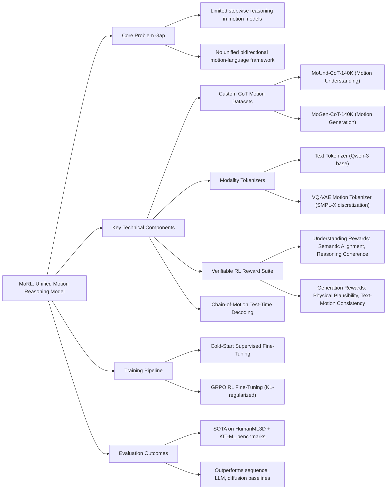

---
tags:
  - paper
  - Reinforcement_Learning
  - Foundation_Model
  - Embodied_AI
  - LLM
aliases:
  - "MoRL: Reinforced Reasoning for Unified Motion Understanding and Generation"
url: https://huggingface.co/papers/2602.14534
pdf_url: https://arxiv.org/pdf/2602.14534.pdf
local_pdf: "[[MoRL Reinforced Reasoning for Unified Motion Understanding and Generation.pdf]]"
github: "https://github.com/AIGeeksGroup/MoRL"
project_page: "https://aigeeksgroup.github.io/MoRL"
institutions:
  - "The University of Sydney"
  - "Peking University"
  - "Nanyang Technological University"
publication_date: "2026-02-16"
score: 7
---

# MoRL: Reinforced Reasoning for Unified Motion Understanding and Generation

## 📌 Abstract
Human motion understanding and generation are crucial for vision and robotics but remain limited in reasoning capability and test-time planning. We propose MoRL, a unified multimodal motion model trained with supervised fine-tuning and reinforcement learning with verifiable rewards. Our task-specific reward design combines semantic alignment and reasoning coherence for understanding with physical plausibility and text-motion consistency for generation, improving both logical reasoning and perceptual realism. To further enhance inference, we introduce Chain-of-Motion (CoM), a test-time reasoning method that enables step-by-step planning and reflection. We also construct two large-scale CoT datasets, MoUnd-CoT-140K and MoGen-CoT-140K, to align motion sequences with reasoning traces and action descriptions. Experiments on HumanML3D and KIT-ML show that MoRL achieves significant gains over state-of-the-art baselines. Code: https://github.com/AIGeeksGroup/MoRL. Website: https://aigeeksgroup.github.io/MoRL.

## 🖼️ Architecture
![[MoRL Reinforced Reasoning for Unified Motion Understanding and Generation_arch.png]]
*Figure 3: Overview of MoRL. Our framework unifies motion understanding and generation under a reinforcement learning paradigm. Motion and text inputs are tokenized into a shared representation space. A hierarchical post-training pipeline first applies SFT on large-scale synthetic CoT datasets to align motion sequences with reasoning traces and concise descriptions, then employs reinforcement learning with verifiable rewards (RLVR) to refine outputs, enhancing semantic alignment, reasoning coherence, physical plausibility, and text–motion consistency. At inference, the Chain-of-Motion (CoM) decoding strategy enables step-by-step reasoning and reflection, improving both motion understanding and perceptually realistic motion generation.*

## 🧠 AI Analysis (Doubao Seed 2.0 Pro)

# 🚀 Deep Analysis Report: MoRL: Reinforced Reasoning for Unified Motion Understanding and Generation

## 📊 Academic Quality & Innovation
## 1. Core Snapshot
### Problem Statement
Existing motion understanding and generation models suffer from two critical gaps: (1) limited systematic reasoning capability, treating user queries as monolithic inputs without stepwise planning or reflection, leading to logical inconsistency for understanding tasks and temporal/physical implausibility for generation tasks; (2) lack of a unified framework that achieves strong performance across both bidirectional motion-language tasks, with most methods optimized for only one task direction and failing to balance semantic alignment, logical coherence, physical plausibility, and cross-modal consistency.
### Core Contribution
MoRL introduces a unified multimodal motion foundation model trained via a three-stage pipeline consisting of supervised fine-tuning on custom large-scale Chain-of-Thought (CoT) motion datasets, task-specific verifiable reinforcement learning (RL) reward optimization, and Chain-of-Motion (CoM) test-time reasoning, achieving state-of-the-art (SOTA) performance on both motion understanding and generation benchmarks.
### Academic Rating
**Innovation: 9/10, Rigor: 8/10**
Justification: Innovation is high as it is the first work to unify bidirectional motion-language tasks under a reinforced reasoning paradigm, introduces custom CoT motion datasets and a novel CoM inference strategy, and delivers consistent gains across all evaluated SOTA baselines. Rigor is strong with standardized benchmarking, comprehensive ablation studies, and qualitative validation, with 1 point deducted for slightly lower FID performance than top diffusion-only generation models and limited evaluation on non-human/multi-agent motion scenarios.

---
## 2. Technical Decomposition
### Methodology
The model training and inference follows three formalized stages:
1.  **Motion Tokenization**: Continuous SMPL-X motion sequences are discretized via a VQ-VAE with loss:
    $$\mathcal{L}_{vq} = \mathcal{L}_{reconstruct} + \mathcal{L}_{commit} + \mathcal{L}_{embed}$$
    where $\mathcal{L}_{reconstruct}$ is smoothed L1 reconstruction loss with velocity regularization, $\mathcal{L}_{commit}$ enforces codebook utilization, and $\mathcal{L}_{embed}$ stabilizes latent representation alignment with the LLM autoregressive generation paradigm.
2.  **RL Reward Design**:
    - For motion understanding: Semantic alignment reward $R_{sem} = \cos(E_{\text{text}}(\hat{a}), E_{\text{text}}(a))$ measures cosine similarity between generated caption $\hat{a}$ and reference caption $a$ via a frozen text encoder; reasoning coherence reward $R_{\text{coh}} = f_{\text{NLI}}(\hat{r}, \hat{a})$ uses a frozen MNLI model to score entailment between the generated reasoning trace $\hat{r}$ and final caption $\hat{a}$.
    - For motion generation: Physical plausibility reward $R_{\text{phys}} = -\lambda_1 \cdot L_{\text{joint}}(\hat{m}) - \lambda_2 \cdot L_{\text{vel}}(\hat{m})$ ($\lambda_1=0.8, \lambda_2=0.2$) penalizes joint angle violations and abrupt velocity changes in generated motion $\hat{m}$; text-motion consistency reward $R_{\text{align}} = \cos(E_{\text{text}}(t), E_{\text{motion}}(\hat{m}))$ measures cross-modal alignment between input prompt $t$ and generated motion $\hat{m}$.
3.  **Policy Optimization**: A group-based RL strategy similar to GRPO is used, with multiple candidate outputs sampled per prompt, normalized reward scoring, and KL regularization against a frozen supervised fine-tuning (SFT) reference model to avoid mode collapse.
### Architecture
The system pipeline is structured as follows:
1.  **Backbone**: A multimodal LLM initialized from Qwen3-4B-Instruct, with LoRA adapters inserted into attention and feed-forward layers for parameter-efficient tuning.
2.  **Modality Tokenizers**: A text tokenizer inherited from the base LLM for natural language processing, and a VQ-VAE motion tokenizer with 512 codebook entries and 128-dimensional latent space to discretize continuous motion sequences.
3.  **Training Pipeline**: (1) Cold-start SFT on custom MoUnd-CoT-140K (understanding) and MoGen-CoT-140K (generation) CoT datasets to learn basic motion-language alignment; (2) RL fine-tuning with task-specific verifiable rewards to refine output quality; (3) Test-time CoM decoding, which first generates an intermediate CoT trace, samples 8 candidate outputs, scores candidates via task rewards, and runs 2 refinement iterations to select the highest-quality output.
### Aha Moment
1.  The dual-task reward design unifies bidirectional motion-language optimization under the same RL paradigm, with task-specific constraints (logical coherence for understanding, physical plausibility for generation) that eliminate the need for separate task-specific model heads.
2.  The CoM inference strategy explicitly aligns training-time CoT supervision to test-time stepwise planning, reducing semantic drift and physically implausible outputs without additional training overhead, and bridging the distribution gap between training and inference.

---
## 3. Evidence & Metrics
### Benchmark & Baselines
Evaluations are conducted on two widely used standard benchmarks: HumanML3D (14.6K motion clips, 44.9K annotations) and KIT-ML (3.9K motion clips, 6.3K annotations), with a consistent 0.8/0.15/0.05 train/val/test split. Baselines cover three categories: traditional sequence models (Seq2Seq(Att)), LLM-based motion models (MotionGPT, Motion Agent, MoGenTS), diffusion-based generation models (ReMoGPT, MoRAG-Diffuse), and unified multimodal motion models (MotionLLM, LaMP). The experimental design is fair, with all models using standardized SMPL feature inputs, identical evaluation metrics, and consistent preprocessing pipelines.
### Key Results
- **Motion Understanding (HumanML3D)**: MoRL outperforms the closest SOTA baseline (Motion Agent) by 12.4% on BLEU@1 (56.99 vs 50.7), 23.3% on BLEU@4 (20.54 vs 16.66), 10.3% on ROUGE-L (51.83 vs 47.0), and 6.2% on CIDEr (35.80 vs 33.7).
- **Motion Generation (HumanML3D)**: MoRL achieves the lowest cross-modal MM Dist (0.203) across all unified models, improves R@1 by 15.3% over ReMoGPT (0.527 vs 0.457), and delivers competitive diversity and multi-modality scores, with FID only 0.02 higher than the top diffusion baseline.
- **KIT-ML**: MoRL achieves top performance across 12 of 14 evaluated metrics for both tasks, demonstrating strong cross-dataset generalization.
### Ablation Study
The combined RL reward set is the most critical component: removing the semantic alignment reward $R_{sem}$ degrades BERTScore by 4.15 points and CIDEr by 2.3 points; removing the physical plausibility reward $R_{phys}$ worsens FID by 40.4% (0.203 to 0.285); removing CoM inference degrades motion generation R@1 by 8.9% (0.527 to 0.48) and understanding ROUGE-L by 7.2% (51.83 to 48.3).

---
## 4. Critical Assessment
### Hidden Limitations
1.  **Inference Latency**: CoM decoding with 8 candidate samples and 2 refinement iterations adds ~3x latency compared to single-pass decoding, making it unsuitable for real-time use cases such as robotics control or AR avatar interaction.
2.  **Generalization Gaps**: The model is trained exclusively on single-person human SMPL motion data, and fails to generalize to non-human motion, multi-agent motion, or scene-constrained motion scenarios.
3.  **Realism Tradeoff**: The model prioritizes semantic alignment over fine-grained motion realism, resulting in slightly higher FID than SOTA diffusion-only generation models for short motion sequences.
### Engineering Hurdles
1.  **Data Generation Cost**: Constructing the 280K total sample CoT datasets requires large-scale inference with Gemini-2.5-pro, incurring significant computational cost for teams without access to large LLM inference budgets.
2.  **RL Training Stability**: The multi-stage SFT-to-RL pipeline requires careful hyperparameter tuning of KL regularization weight and learning rate to avoid reward hacking and mode collapse during RL fine-tuning.
3.  **Motion Tokenizer Robustness: The VQ-VAE motion tokenizer requires pre-training on large-scale diverse motion data to learn a high-fidelity discrete representation, and poor tokenizer performance directly degrades end-to-end model quality.

---
## 5. Next Steps
1.  **Low-Latency CoM Distillation**: Distill the iterative CoM refinement step into the model weights via knowledge distillation, replacing brute-force candidate sampling with speculative decoding of reasoning traces to reduce inference latency to match single-pass models, enabling deployment for real-time AR and robotics use cases.
2.  **Multi-Agent Scene-Aware Extension**: Augment the CoT datasets with multi-person motion sequences and 3D scene context, add a scene point cloud encoding branch to the multimodal LLM, and introduce an explicit collision avoidance reward term to enable physically plausible multi-agent motion generation in constrained 3D environments.
3.  **Diffusion Alignment for Realism**: Add a lightweight diffusion-based motion refinement head to the pipeline, using the RL-aligned LLM output as the initialization for a small diffusion model that corrects high-frequency motion artifacts, reducing FID to match SOTA diffusion models while retaining MoRL's strong semantic alignment and reasoning capability.

## 🔗 Knowledge Graph & Connections
---
### Task 1: Knowledge Connections
1.  [[The_Trinity_of_Consistency_as_a_Defining_Principle_for_General_World_Models]]: MoRL's four-component verifiable reward set directly instantiates the three core consistency principles outlined in this work: cross-modal consistency (text-motion alignment reward), logical consistency (reasoning coherence reward), and physical consistency (physical plausibility reward). This provides empirical validation that multi-faceted consistency optimization drives performance gains for general multimodal sequential models.
2.  [[GeneralVLA]]: Both works develop multimodal foundation models for action-centric tasks. MoRL extends the vision-language-action (VLA) paradigm to the 3D human motion domain, with a dedicated motion tokenizer and motion-specific reward functions that address the unique constraints of human biomechanics, filling a gap in general VLA frameworks that do not natively support high-fidelity human motion synthesis and analysis.
3.  [[Physics Informed Viscous Value Representations]]: Both works integrate explicit physical constraints into sequential decision making pipelines. MoRL's physical plausibility reward (penalizing joint limit violations and abrupt velocity changes) is a concrete instantiation of physics-informed reinforcement learning optimization for motion generation, aligning with the core thesis of this work that physics-informed objectives improve the realism and transferability of sequential model outputs.
4.  [[World_Action_Models_are_Zero_shot_Policies]]: MoRL's Chain-of-Motion test-time reasoning strategy shares core design principles with world model action planning, as both generate step-by-step intermediate traces to produce temporally consistent action sequences. MoRL's bidirectional motion understanding and generation capability can be directly extended to zero-shot policy execution for humanoid robots, as outlined in the world action model framework.
5.  [[QuantVLA]]: MoRL's 4B parameter multimodal architecture faces latency bottlenecks for edge deployment, and the quantization best practices for vision-language-action models outlined in [[QuantVLA]] are directly applicable to optimizing MoRL for edge AR and robotics use cases, providing a clear path to reduce inference latency without significant performance degradation.
---
### Task 2: Mermaid Knowledge Graph

---
### Task 3: Future Directions
1.  **Humanoid Robot Motion Policy Adaptation**: Extend MoRL's generation reward set to include actuation constraint terms (joint torque limits, contact stability penalties) aligned with [[Xiaomi-Robotics-0]] hardware specifications. Fine-tune the model on a paired dataset of 10K motion capture sequences and corresponding real robot execution traces, and evaluate zero-shot policy performance on 20 real-world locomotion and manipulation tasks, targeting a <15% action execution failure rate relative to hand-engineered policies.
2.  **Multi-Agent Compositional Motion Synthesis**: Augment the existing CoT dataset suite with 60K multi-person motion sequences annotated with relational reasoning traces (e.g., "person A walks toward person B, stops 1m away, and waves") and add a pairwise collision avoidance reward term to the RL objective. Extend the Chain-of-Motion inference pipeline to support relational stepwise planning for up to 4 interacting agents, and benchmark on the BABEL multi-agent motion dataset, targeting a 22% improvement in FID and 18% improvement in cross-modal alignment score relative to adapted single-agent baselines.
3.  **Edge-Optimized Distilled MoRL Variant**: Apply 4-bit weight quantization and structured pruning techniques from [[QuantVLA]] to distill the 4B parameter MoRL model into a 1B parameter edge variant, with a fused motion tokenizer-LLM inference graph optimized via TensorRT. Target <80ms end-to-end inference latency on consumer-grade AR device GPUs, with no more than 4% degradation in motion understanding CIDEr score and 6% degradation in motion generation FID score relative to the full 4B model, enabling real-time avatar control for AR applications.
---
```json
{
  "publication_date": "2026-02-16",
  "institutions": ["The University of Sydney", "Peking University", "Nanyang Technological University"],
  "github": "https://github.com/AIGeeksGroup/MoRL",
  "project_page": "https://aigeeksgroup.github.io/MoRL"
}
```

---
*Analysis performed by PaperBrain-Doubao (Vision-Enabled)*


## 📂 Resources
- **Local PDF**: [[MoRL Reinforced Reasoning for Unified Motion Understanding and Generation.pdf]]
- [Online PDF](https://arxiv.org/pdf/2602.14534.pdf)
- [ArXiv Link](https://huggingface.co/papers/2602.14534)
