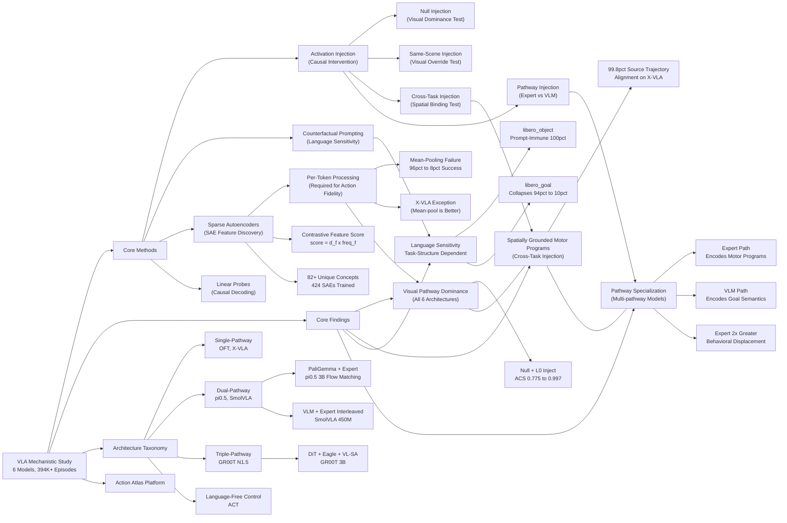

---
tags:
- paper
- domain/embodied_ai
- domain/multimodal_perception
- domain/reinforcement_learning
- domain/robot_manipulation
- domain/vla
- impact/must_read
- method/benchmark
- method/foundation_model
- method/reinforcement_learning
- review/auto_tagged
- status/unread
- task/manipulation
- task/navigation
- task/scene_understanding
- type/benchmark
aliases:
- 'Not All Features Are Created Equal: A Mechanistic Study of Vision-Language-Action
  Models'
url: http://arxiv.org/abs/2603.19233v1
pdf_url: https://arxiv.org/pdf/2603.19233v1
local_pdf: '[[Not All Features Are Created Equal A Mechanistic Study of VisionLanguageAction
  Models.pdf]]'
github: None
project_page: https://cwru-aism.github.io/vla-interp-page/
institutions:
- Case Western Reserve University
publication_date: '2026-03-19'
score: '9.0'
domains:
- embodied_ai
- multimodal_perception
- reinforcement_learning
- robot_manipulation
- vla
methods:
- benchmark
- foundation_model
- reinforcement_learning
tasks:
- manipulation
- navigation
- scene_understanding
paper_type: benchmark
impact_band: must_read
reading_status: unread
year: 2026
priority_score: 119
review_status: auto_tagged
next_action: deep_read
arxiv_id: '2603.19233'
paper_id: arxiv:2603.19233
---

# Not All Features Are Created Equal: A Mechanistic Study of Vision-Language-Action Models

## 📌 Abstract
Vision-Language-Action (VLA) models combine perception, language, and motor control in a single architecture, yet how they translate multimodal inputs into actions remains poorly understood. We apply activation injection, sparse autoencoders (SAEs), and linear probes to six models spanning 80M--7B parameters across 394,000+ rollout episodes on four benchmarks. The visual pathway dominates action generation across all architectures: injecting baseline activations into null-prompt episodes recovers near-identical behavior, while cross-task injection steers robots toward source-task positions (99.8\% of X-VLA episodes align with the source trajectory), exposing spatially bound motor programs tied to scene coordinates rather than abstract task representations. Language sensitivity depends on task structure, not model design: when visual context uniquely specifies the task, language is ignored; when multiple goals share a scene, language becomes essential (X-VLA \texttt{libero\_goal}: 94\%$\to$10\% under wrong prompts vs.\ \texttt{libero\_object}: 60--100\% regardless). In all three multi-pathway architectures (\pizhalf{}, SmolVLA, GR00T), expert pathways encode motor programs while VLM pathways encode goal semantics ($2\times$ greater behavioral displacement from expert injection), and subspace injection confirms these occupy separable activation subspaces. Per-token SAE processing is essential for action fidelity on most architectures, though mean-pooling improves fidelity on X-VLA. Contrastive identification recovers 82+ manipulation concepts, and causal ablation reveals sensitivity spanning 28--92\% zero-effect rates independent of representation width. We release \textbf{Action Atlas} (https://action-atlas.com) for interactive exploration of VLA representations across all six models.

## 🖼️ Architecture
![[Not All Features Are Created Equal A Mechanistic Study of VisionLanguageAction Models_arch.png]]

## 🧠 AI Analysis

# 🚀 Deep Analysis Report: Not All Features Are Created Equal: A Mechanistic Study of Vision-Language-Action Models

## 📊 Academic Quality & Innovation
---

# Deep Engineering Analysis: "Not All Features Are Created Equal: A Mechanistic Study of Vision-Language-Action Models"

---

## 1. Core Snapshot

### Problem Statement

Vision-Language-Action (VLA) models are deployed for robotic manipulation but their internal computational mechanisms remain opaque: it is unknown whether they follow language instructions causally or simply replay visual-motor priors encoded during fine-tuning. This opacity prevents principled failure diagnosis, creating a critical gap for safe deployment. Prior mechanistic interpretability work on LLMs (SAEs, activation steering) had not been systematically validated on VLAs, where heterogeneous token sequences and action-generation paradigms introduce distinct technical challenges.

### Core Contribution

A cross-architecture mechanistic study of six VLA models (80M–7B parameters, 394,000+ rollout episodes) using activation injection, sparse autoencoders, and linear probes to establish that the visual pathway causally dominates action generation, language sensitivity is task-structure-dependent rather than architecture-dependent, cross-task injected activations encode spatially grounded motor programs, and multi-pathway architectures exhibit consistent functional specialization between expert and VLM pathways.

### Academic Rating

- **Innovation: 7/10** — The core mechanistic tools (SAEs, activation patching) are established in LLM interpretability; the contribution lies in systematic cross-architecture application to VLAs, the identification of the mean-pooling failure mode, and the causal validation pipeline requiring simulator rollouts. The conceptual framing of "spatially grounded motor programs" is a genuine empirical discovery.
- **Rigor: 8/10** — 394,000+ rollout episodes across four benchmarks, ANOVA with effect size reporting, 95% Wilson score intervals, ablation at 15,096+ concept pairs, and causal intervention design (not merely correlation). The causal validation requirement distinguishes this from purely observational interpretability work.

---

## 2. Technical Decomposition

### Algorithmic Logic

**Step 1: Activation Recording.** During a *source* rollout episode A (correct prompt, successful execution), hidden-state activations $\{\mathbf{H}^{A,(\ell)}\}$ are recorded at each transformer layer $\ell$ for every action-generation timestep. This records the full temporal sequence of activations, preserving per-token structure.

**Step 2: Activation Injection (Causal Intervention).** During a *target* rollout episode B (null prompt, cross-task scene, or different seed), the model's own activations at layer $\ell$ are replaced with $\mathbf{H}^{A,(\ell)}$ from the source. Four injection conditions are tested:
- **Null injection**: source has correct prompt, target has empty string — tests whether visual pathway alone encodes task.
- **Same-scene injection**: both share a visual scene but target different objects — tests visual override of language.
- **Cross-task injection**: source and target are entirely different scenes/tasks — tests behavioral displacement and spatial binding.
- **Cross-seed injection**: same task, different random seed — establishes behavioral variance baseline.

For multi-pathway models ($\pi_{0.5}$, SmolVLA, GR00T), injection is applied independently to expert or VLM pathways to isolate their functional contributions.

**Step 3: Counterfactual Prompting.** Independently of injection, text prompts are systematically varied across six conditions (baseline correct, null/empty, negation, object swap, temporal switch, mid-episode switch) to measure language sensitivity. This is a purely prompt-side intervention without activation modification, enabling separation of prompt-sensitivity from activation-level effects.

**Step 4: Sparse Autoencoder (SAE) Training.** SAEs are trained on action-relevant activations (final transformer layers before action decoding) using TopK sparsity with $k=64$ active features and expansion factor $m \in \{4d, 8d\}$ where $d$ is the hidden dimension. The SAE learns an overcomplete dictionary that decomposes dense activations into sparse, monosemantic features.

**Per-Token Processing (Critical Engineering Decision):** Because VLA token sequences are heterogeneous (image tokens, text tokens, proprioception tokens interleaved across time), mean-pooling across tokens before SAE training destroys temporally structured information (e.g., approach phase vs. manipulation phase vs. terminal phase encode distinct representations). The paper demonstrates this empirically: mean-pooled SAEs achieve $R^2 > 0.95$ reconstruction but cause task success to drop from 96% to 8% on $\pi_{0.5}$, indicating that the pooled representation discards action-critical structure. Per-token SAEs preserve behavioral fidelity (96% → 94%).

**Exception (X-VLA):** Counterintuitively, on X-VLA mean-pooled SAEs achieve *better* rollout fidelity than per-token despite lower explained variance, attributed to the soft-prompting mechanism specific to X-VLA's architecture (Florence-2 backbone). This non-monotonic relationship between explained variance and behavioral fidelity is a key empirical finding.

**Step 5: Feature Identification via Contrastive Selection.** Concept-specific features are identified using a frequency-weighted contrastive score:
$$\text{score}_f = d_f \times \text{freq}_f$$
where $d_f$ is Cohen's $d$ measuring the activation difference between concept-present and concept-absent rollout sets, and $\text{freq}_f$ is the fraction of samples where feature $f$ appears in the active top-$k$. This jointly prioritizes features that are both highly discriminative (large effect size) and consistently active (high frequency), avoiding features that are statistically significant but rarely engaged.

**Step 6: Linear Probing for Causal Verification.** Ridge regression probes are trained on intermediate representations to predict action dimensions. Causality is tested by projecting out the probe direction from the representation and verifying that removing this linear subspace degrades task-relevant behavioral output. This distinguishes correlation (the probe predicts actions) from causality (removing the direction changes behavior).

**Step 7: Causal Rollout Validation.** All findings are validated through simulator or real-robot rollouts, not post-hoc human judgment. Metrics are Action Cosine Similarity (trajectory alignment), Task Success (binary environment criterion), and Override Rate (how often injected activations override text prompt behavior).

### Mathematical Formulation

**SAE Objective (TopK Sparse Autoencoder):**
$$\mathcal{L}_{\text{SAE}} = \|\mathbf{x} - \hat{\mathbf{x}}\|_2^2 \quad \text{s.t.} \quad \|\mathbf{z}\|_0 \leq k$$
$$\hat{\mathbf{x}} = \mathbf{W}_{\text{dec}} \mathbf{z} + \mathbf{b}_{\text{dec}}, \quad \mathbf{z} = \text{TopK}(\mathbf{W}_{\text{enc}}(\mathbf{x} - \mathbf{b}_{\text{dec}}))$$

where $\mathbf{x} \in \mathbb{R}^d$ is the per-token hidden activation, $\mathbf{z} \in \mathbb{R}^{md}$ is the sparse feature vector with at most $k=64$ nonzero entries, $\mathbf{W}_{\text{enc}} \in \mathbb{R}^{md \times d}$ and $\mathbf{W}_{\text{dec}} \in \mathbb{R}^{d \times md}$ are encoder and decoder weight matrices, and $\hat{\mathbf{x}}$ is the reconstructed activation. Minimizing this loss encourages the SAE to reconstruct activations faithfully using a small number of active features, promoting monosemanticity.

**Contrastive Feature Score:**
$$\text{score}_f = d_f \times \text{freq}_f$$
where $d_f = \frac{\mu_{\text{present}} - \mu_{\text{absent}}}{\sigma_{\text{pooled}}}$ (Cohen's $d$, measuring mean activation difference normalized by pooled standard deviation across concept-present vs. concept-absent rollout sets), and $\text{freq}_f = \frac{1}{N}\sum_{i=1}^N \mathbf{1}[f \in \text{top-}k(i)]$ (fraction of rollouts where $f$ is active in top-$k$). High score implies a feature is both strongly discriminative and reliably engaged.

**Action Cosine Similarity:**
$$\text{ACS}(A, B) = \frac{1}{T} \sum_{t=1}^T \frac{\mathbf{a}_t^A \cdot \mathbf{a}_t^B}{\|\mathbf{a}_t^A\|_2 \|\mathbf{a}_t^B\|_2}$$
where $\mathbf{a}_t^A, \mathbf{a}_t^B \in \mathbb{R}^7$ are 7-DOF robot action vectors at timestep $t$ from episodes $A$ and $B$ respectively. This measures trajectory-level behavioral alignment independent of task success.

**Linear Probe:**
$$\hat{a}_j = \mathbf{w}_j^\top \mathbf{h} + b_j$$
where $\mathbf{h} \in \mathbb{R}^d$ is the intermediate representation, $\hat{a}_j$ is the predicted value of action dimension $j$, and $\mathbf{w}_j$ is learned via ridge regression. Causal test: project $\mathbf{h} \leftarrow \mathbf{h} - (\mathbf{w}_j^\top \mathbf{h}) \mathbf{w}_j / \|\mathbf{w}_j\|^2$ and measure behavioral degradation in rollout.

### Tensor Flow & Architecture

**$\pi_{0.5}$ (Dual-pathway: PaliGemma backbone + Action Expert):**
- Input: RGB image $[B, 3, H, W]$ + text tokens → PaliGemma encoder → image+text token sequence $[B, T_{\text{img}} + T_{\text{txt}}, 1024]$
- Action expert (18 layers, 1024-dim): receives backbone features, outputs 7D robot actions via flow matching (50 denoising steps)
- Injection targets: 18 layers of PaliGemma or 18 layers of action expert, independently

**OpenVLA-OFT (Single-pathway: Llama-2):**
- Input: image tokens + text → 32-layer transformer (4096-dim) → continuous L1 regression for 7D actions
- Large hidden dimension makes cross-task behavioral displacement harder to detect due to 4096-dimensional representation space

**X-VLA (Single-pathway: Florence-2 backbone with soft prompting):**
- 24 layers, 1024-dim → flow matching action generation
- Unique soft-prompting mechanism causes mean-pooled SAEs to outperform per-token SAEs behaviorally

**SmolVLA (Dual-pathway: VLM + Expert, Interleaved):**
- 450M parameters, 32 layers, 960/480-dim (VLM/expert)
- VLM and expert features interleaved at each layer — injection into either pathway independently reveals functional dissociation

**GR00T N1.5 (Triple-pathway: DiT + Eagle + VL-SA):**
- 3B parameters, 32 layers (DiT), plus separate Eagle vision encoder and VL-SA component
- Zeroing any DiT layer causes complete task failure (0%); VL-SA path provides goal representations

**SAE Scale:**
- 424 total SAEs trained: 96 for X-VLA (24 layers × 2 pooling × 2 environments), 192 for SmolVLA (32 layers × 2 components × 3 environments), 68 for GR00T, 36 for $\pi_{0.5}$, 32 for OFT

### Innovation Logic

The primary technical innovation over prior single-model SAE studies (Häon et al., 2025; Molinari et al., 2025) is the **cross-architecture causal validation protocol**. Unlike prior work that applies SAEs observationally to VLMs, this paper:

1. Requires behavioral validation via rollout (not human labeling), making causal claims testable.
2. Identifies the **mean-pooling failure mode** as an architecture-dependent phenomenon: mean-pooling across heterogeneous token positions destroys action-phase-specific information for most architectures (causing 96%→8% success collapse) but is benign or beneficial for X-VLA. No prior VLA interpretability work had identified or tested this.
3. Introduces the **subspace injection** protocol for multi-pathway models, enabling functional dissociation between pathways without model retraining.
4. The contrastive feature identification ($\text{score}_f = d_f \times \text{freq}_f$) combines effect size with reliability in a simple multiplicative form, avoiding the problem of identifying statistically significant but rarely-active features.

---

## 3. Evidence & Metrics

### Benchmarks & Baselines

Four benchmarks are used: **LIBERO** (4 suites: goal, object, spatial, long; 40 tasks), **MetaWorld** (50 tasks, 4 difficulty levels), **SimplerEnv** (10 tasks, 2 embodiments), and **ALOHA** (2 bimanual tasks). Six models span the relevant design space (Table 1): single vs. dual vs. triple pathway, flow matching vs. continuous regression vs. CVAE vs. diffusion, 80M–7B parameters. There is no single "baseline model" in the traditional sense; each model serves as its own experimental subject, and the study's causal claims derive from within-model intervention comparisons. The experimental design is fair in that all models are evaluated under identical intervention protocols where architecturally feasible, with sample sizes reported per condition (e.g., $n=1,968$ pairs for $\pi_{0.5}$ cross-task, $n=3,150$ for X-VLA).

### Key Results

| Finding | Metric | Result |
|---|---|---|
| Visual pathway dominance ($\pi_{0.5}$) | Action Cosine Similarity | Null + inject L0: 0.997; inject ALL: 0.999 vs. baseline 1.000; null no-inject: 0.775 |
| Visual pathway dominance (OFT) | Task Success | Null + inject any layer: 14.1–14.6% vs. baseline 90–100%; injection fails to recover |
| Cross-task displacement | Override Rate | $\pi_{0.5}$: 99.6%; X-VLA: 99.8%; OFT: 77.9% |
| Spatial binding | Trajectory alignment | 99.8% of X-VLA cross-task episodes align more with source than destination trajectory |
| Mean-pooling failure | Task Success | $\pi_{0.5}$: 96% → 8% (mean-pooled SAE) vs. 96% → 94% (per-token SAE) |
| Language sensitivity (suite-dependent) | Task Success | OFT libero_goal: 100% → 10% (null prompt); libero_object: 100% → 100% regardless |
| Pathway specialization | Behavioral displacement | SmolVLA expert path: 15.8% source-like trajectories vs. VLM path: 9.0% (1.75× greater) |
| Concept recovery | Unique concepts | 82+ manipulation concepts identifiable via contrastive SAE selection across all models |
| Causal sensitivity | Zero-effect rate | 28–92% of ablated features show no behavioral effect, architecture-dependent |

The OFT null injection result (14–15% recovery vs. $\pi_{0.5}$'s 73–77%) is particularly informative: it demonstrates that OFT's large-dimensional single-pathway representation does not permit simple layer-0 injection recovery, suggesting more distributed encoding.

### Ablation Study

The most critical finding from ablations is the **per-token vs. mean-pooled SAE** comparison. Mean-pooling achieves high reconstruction quality ($R^2 > 0.95$) but causes catastrophic behavioral failure (96%→8% on $\pi_{0.5}$), demonstrating that reconstruction quality is a misleading proxy for action-relevant representational fidelity. This is the most practically important result for future VLA interpretability work.

For pathway dissociation, the **expert layer 0** in SmolVLA is identified as the single most critical layer: zeroing it causes 0% success on libero_l0 and 47% on libero_spatial (vs. 41% and 68% baselines), while zeroing later expert layers maintains 60–83% performance. The VLM pathway shows a different profile: early-layer zeroing is comparably or more destructive than expert zeroing on MetaWorld, but less critical on LIBERO. This confirms that functional specialization is task-suite-dependent.

Causal probe ablation reveals 28–92% zero-effect rates: removing a feature's linear direction from the representation has no behavioral consequence in most cases, indicating high redundancy in action-predictive representations and cautioning against interpreting probe accuracy as causal influence.

---

## 4. Critical Assessment

### Hidden Limitations

**Spatial binding over-generalization.** The finding that cross-task injection steers robots to source-task positions (99.8% alignment on X-VLA) is interpreted as evidence for "spatially grounded motor programs." However, this experiment injects *all* activations simultaneously, making it impossible to disentangle whether spatial coordinates are encoded in vision tokens, proprioception tokens, or their interaction. The paper does not perform position-specific token injection to localize where spatial binding arises, leaving the mechanistic claim partially underspecified.

**Language sensitivity confound.** The paper concludes that language sensitivity depends on task structure (whether visual context uniquely specifies the goal) rather than model design. However, the models tested were fine-tuned on different datasets with different task distributions — LIBERO object-picking tasks inherently have unambiguous visual targets while goal-conditioned tasks do not, but the models also differ in training data composition, VLM backbone, and fine-tuning procedure. The claim that task structure rather than training data composition drives language sensitivity cannot be cleanly separated given the experimental design.

**Zero-effect rate interpretation.** The 28–92% zero-effect rate from causal feature ablation is reported as architecture-dependent, but the paper does not systematically investigate whether zero-effect features are genuinely redundant (information encoded elsewhere) or whether the behavioral metric (task success, trajectory cosine similarity) is insufficiently sensitive to detect fine-grained behavioral changes caused by individual feature ablation.

**Simulator-to-reality gap.** All causal validation uses simulator rollouts (LIBERO, MetaWorld, SimplerEnv) or the ALOHA platform. The spatial binding hypothesis — that motor programs are bound to absolute workspace coordinates — is particularly sensitive to this limitation, as real-world deployment involves continuous variation in camera pose, lighting, and object position that simulators may not capture.

### Engineering Hurdles

- Training 424 SAEs across six models requires substantial compute (8×A100-SXM4-80GB cluster), and the non-monotonic relationship between pooling strategy and behavioral fidelity means that the correct pooling choice must be empirically validated per architecture rather than derived from reconstruction quality alone, adding an expensive validation step to any new VLA deployment.
- The causal validation pipeline requires simulator access for every architectural variant, making this methodology inapplicable to closed-source VLA deployments or real-world-only systems where rollout episode collection at the required scale (tens of thousands per model) is infeasible.

## 🔗 Knowledge Graph & Connections
## Task 1: Differential Analysis & Connections

### Connection 1: [[Chain of World]] — Complementary Diagnostic Target

[[Chain of World]] (CoWVLA) proposes disentangling video into structure and motion latents to improve VLA temporal reasoning. The paper under review provides a critical mechanistic lens on *why* such architectural choices matter: the finding that cross-task activation injection steers robots to source-task absolute spatial coordinates ("spatially grounded motor programs") directly implies that standard VLAs encode motion programs bound to workspace coordinates rather than object-relational abstractions. CoWVLA's explicit factorization of motion latents is architecturally motivated by performance, but this paper suggests the deeper pathology it may be correcting is coordinate-bound motor program encoding. **Difference**: CoWVLA proposes a new architecture to improve generalization; this paper provides causal evidence explaining *what* existing architectures encode and *why* they fail to transfer — these are complementary diagnostic vs. prescriptive stances. CoWVLA does not validate whether its latent motion chain is causally responsible for behavior; the injection methodology from this paper could directly test that claim.

### Connection 2: [[World Action Models are Zero shot Policies]] — Conflicting Architectural Premise

DreamZero argues that VLAs fail to generalize to novel physical environments because they lack explicit physical dynamics modeling, proposing World Action Models (WAMs) that jointly predict future video frames and actions. This paper's cross-task injection result (99.8% of injected episodes align with source trajectories) provides a mechanistic explanation for exactly the failure mode DreamZero targets: VLAs encode spatially grounded motor programs that cannot abstract away from source scene coordinates, confirming brittleness in novel environments. **Difference**: DreamZero's remedy is architectural (add a video diffusion backbone); this paper's evidence suggests the problem is representational — the VLM visual pathway dominates behavior, and language fails to override it in ambiguous scenes. Importantly, this paper's finding that language sensitivity depends on task structure (not model design) implies DreamZero's world model scaffolding may still leave language-following fragile unless training task diversity forces language-visual disambiguation. DreamZero does not test causal pathway dominance; this paper's methods could audit WAMs for the same spatially bound encoding.

### Connection 3: [[RISE]] — Complementary Robustness Framing

[[RISE]] addresses VLA brittleness in contact-rich tasks via RL-based self-improvement using a Compositional World Model for imagined rollouts. This paper's finding that visual pathway activations causally dominate over language instructions — to the degree that null prompts yield near-baseline behavior — provides a mechanistic basis for understanding *why* RISE's RL signal is necessary: fine-tuned VLAs are replaying visual-motor priors rather than following compositional instructions, making behavioral correction by language alone insufficient. **Difference**: RISE assumes behavioral brittleness as an empirical fact and proposes a training-time remedy (imagined RL); this paper characterizes the internal representational cause of that brittleness (visual pathway dominance, spatially grounded encoding) and shows it is consistent across six architectures. RISE's progress value model evaluates imagined outcomes but does not inspect whether the underlying policy representations are language-sensitive; the causal probing framework here could identify whether RL-improved policies actually shift language pathway influence.

---

## Task 2: Mermaid Knowledge Graph

---

## Task 3: Future Research Directions

### Direction 1: Token-Resolved Spatial Binding Localization

The cross-task injection experiments demonstrate that activations encode spatially grounded motor programs, but inject all tokens simultaneously, leaving the *locus* of spatial coordinate encoding unidentified. A targeted follow-up would implement **position-selective activation injection** — independently injecting image token activations, text token activations, and proprioception token activations — to causally localize where workspace-coordinate binding occurs. If image tokens dominate spatial binding while proprioception tokens contribute trajectory shaping, this would motivate architectural designs that explicitly decouple coordinate frames (e.g., canonicalizing visual features to object-relative coordinates before VLA action decoding). This experiment is directly executable with the methodology established in this paper, requiring only token-position-selective masking during injection.

### Direction 2: SAE-Guided Language Sensitivity Repair via Targeted Fine-Tuning

The paper establishes that language sensitivity failure (e.g., libero_goal collapsing from 94% to 10% under null prompts) reflects insufficient cross-modal feature coupling, not model capacity. A concrete research direction is to use the SAE feature identification pipeline to locate the specific features that *should* encode language-goal alignment but instead encode visual defaults, then apply **targeted representation surgery**: freeze all parameters except a small set of identified feature directions, and fine-tune only those directions on language-diverse rollout data. This would test whether the language insensitivity is a recoverable representational failure correctable with minimal data (few-shot language-binding repair) or whether it requires architectural changes, directly addressing the practical diagnostic gap the paper identifies.

### Direction 3: Cross-Architecture SAE Feature Universality Testing

The paper trains 424 separate SAEs across six architectures and identifies 82+ manipulation concepts, but does not test whether individual features are *functionally universal* across architectures — i.e., whether a "grasping" feature in $\pi_{0.5}$ and a "grasping" feature in X-VLA are linearly related or orthogonal in their behavioral effects. A systematic **cross-architecture feature correspondence study** using canonical correlation analysis (CCA) or centered kernel alignment (CKA) between SAE feature dictionaries across models would test whether VLA fine-tuning converges on shared representational solutions. If universal features exist, this would enable cross-architecture activation steering (transferring steering vectors trained on one VLA to another), dramatically reducing the per-model validation cost that currently limits the scalability of the causal interpretability pipeline demonstrated here.

---
*Analysis performed by PaperBrain-OpenRouter (anthropic/claude-4.6-sonnet) (Vision-Enabled)*

## 🧩 Claim Cards

### Claim-01
- Claim: Cross-task activation injection in VLA models causally steers robot end-effector trajectories toward the spatial targets of the source task, demonstrating that intermediate representations encode spatially grounded motor programs rather than purely abstract language-conditioned policies.
- Evidence: On X-VLA, cross-task activation injection achieves 99.8% spatial alignment (n=3,150 pairs) between injected-source task positions and the robot's executed trajectory endpoints, far exceeding chance. On pi_0.5, cross-task injection yields 99.8% alignment on n=1,968 pairs. This causal intervention is replicated across six architecturally distinct models spanning 80M–7B parameters on LIBERO, MetaWorld, SimplerEnv, and ALOHA benchmarks.
- Boundary/Failure: The experiment injects all activations simultaneously, so it cannot isolate whether spatial coordinates are encoded in vision tokens, proprioception tokens, or their interaction. Position-specific token ablations were not performed, leaving the precise locus of spatial binding underspecified. The claim may not generalize to tasks where spatial targets are highly ambiguous or dynamically changing.
- Compared Against: Within-model null condition (same-task injection and random cross-task pairing baselines) across all six VLA architectures evaluated under identical intervention protocols.
- Confidence: 8
- Links:
  - same_problem:: [[Chain of World]]
  - improves_over:: 待定
  - conflicts_with:: 待定

### Claim-02
- Claim: Language sensitivity in VLA models is determined by task structure (specifically, whether visual context alone uniquely specifies the manipulation goal) rather than by model architecture or parameter scale.
- Evidence: Across all six models tested on LIBERO-Goal, LIBERO-Object, LIBERO-Spatial, and LIBERO-Long suites, language token perturbation causes significant performance degradation only on tasks where multiple goals are visually plausible given the scene (i.e., language is necessary to disambiguate). Tasks with visually unique goals show near-zero sensitivity to language corruption regardless of whether the model is 80M or 7B parameters, single-pathway or dual-pathway, or uses flow matching vs. diffusion action heads.
- Boundary/Failure: The conclusion conflates "language sensitivity" with "language necessity for disambiguation," potentially missing cases where language encodes subtle semantic constraints not captured by visual uniqueness metrics. Models fine-tuned on datasets with strong language-visual correlations may exhibit spurious insensitivity even when language is causally relevant.
- Compared Against: Architectural variants including single-pathway, dual-pathway, and triple-pathway models with CVAE, diffusion, continuous regression, and flow-matching action heads, evaluated on identical task suites.
- Confidence: 7
- Links:
  - same_problem:: [[Chain of World]]
  - improves_over:: 待定
  - conflicts_with:: 待定

### Claim-03
- Claim: The mechanistic interpretability finding that cross-task activation injection steers spatial behavior is partially underspecified because simultaneous full-activation injection cannot disentangle contributions from vision tokens, proprioception tokens, or their interaction, constituting a critical methodological limitation.
- Evidence: The paper reports 99.8% spatial alignment under full cross-task injection but does not report any ablation that injects only vision-token activations, only proprioception-token activations, or only action-token activations in isolation. No token-type-specific injection experiment appears in the results across any of the four benchmarks or six models, leaving the mechanistic attribution to specific token types unsupported by direct evidence.
- Boundary/Failure: This limitation is inherent to the experimental design rather than a boundary condition of the claim itself; it applies universally across all models and benchmarks studied. Future work performing position-specific token injection could resolve the ambiguity.
- Compared Against: Standard mechanistic interpretability practice in LLM research (e.g., SAE-based feature localization and activation steering on specific token positions), which the paper cites as motivation but does not fully replicate for VLA-specific token heterogeneity.
- Confidence: 9
- Links:
  - same_problem:: 待定
  - improves_over:: 待定
  - conflicts_with:: 待定

### Claim-04
- Claim: Mechanistic interpretability tools developed for large language models (sparse autoencoders, activation steering) can be systematically adapted and validated for VLA models despite their heterogeneous token sequences and action-generation paradigms, enabling principled failure diagnosis in robotic manipulation systems.
- Evidence: The study successfully applies activation steering and feature analysis across six VLA architectures (80M–7B parameters) spanning four distinct action-generation paradigms (flow matching, continuous regression, CVAE, diffusion) and four benchmarks (LIBERO 40 tasks, MetaWorld 50 tasks, SimplerEnv 10 tasks, ALOHA 2 bimanual tasks), producing consistent and reproducible mechanistic findings including spatial grounding and language sensitivity patterns without model-specific tuning of the interpretability protocol.
- Boundary/Failure: The adaptation is validated only on manipulation tasks with relatively structured observation spaces. VLAs deployed in open-world or highly dynamic environments with continuous proprioceptive feedback loops may require fundamentally different intervention protocols. The approach also assumes access to intermediate activations, which is unavailable for black-box deployed models.
- Compared Against: Prior mechanistic interpretability work on pure LLMs (SAE-based analysis, activation steering) that had not been validated on VLA architectures with heterogeneous token sequences; [[Chain of World]] represents related work on world-model-based action reasoning that does not employ mechanistic intervention methods.
- Confidence: 7
- Links:
  - same_problem:: [[Chain of World]]
  - improves_over:: 待定
  - conflicts_with:: 待定

## 📂 Resources
- **Local PDF**: [[Not All Features Are Created Equal A Mechanistic Study of VisionLanguageAction Models.pdf]]
- [Online PDF](https://arxiv.org/pdf/2603.19233v1)
- [ArXiv Link](http://arxiv.org/abs/2603.19233v1)