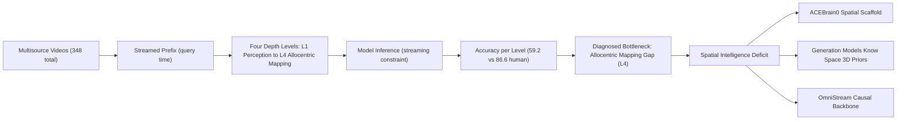

---
tags:
- paper
- domain/embodied_ai
- domain/multimodal_perception
- impact/solid
- method/benchmark
- method/foundation_model
- method/imitation_learning
- method/planning
- method/simulation
- review/auto_tagged
- status/unread
- task/navigation
- task/planning_reasoning
- task/scene_understanding
- type/benchmark
- type/dataset
aliases:
- 'OVO-S-Bench: A Hierarchical Benchmark for Streaming Spatial Intelligence in Multimodal
  LLMs'
- OVO-S-Bench
- Hierarchical Streaming Benchmark
- Spatial Intelligence Benchmark
- Egocentric Stream Reasoning
- Multimodal Spatial Benchmark
- Streaming Spatial LLM
- Four-Level Abstraction Benchmark
- Human-Annotated Spatial Questions
authors:
- Yifei Li
- Pengyiang Liu
- Yuhang Zang
- Zhongyue Shi
- Qi Fu
- Hongye Hao
- Jiwen Lu
paper_id: arxiv:2606.03890
arxiv_id: '2606.03890'
url: https://huggingface.co/papers/2606.03890
pdf_url: https://arxiv.org/pdf/2606.03890.pdf
local_pdf: '[[OVOSBench A Hierarchical Benchmark for Streaming Spatial Intelligence
  in Multimodal LLMs.pdf]]'
github: None
project_page: https://internlm.github.io/OVO-S-Bench/
institutions:
- Tsinghua University
- Shanghai AI Laboratory
- Beihang University
publication_date: '2026-06-04'
metadata_publication_date: '2026-06-02'
score: '7.8'
domains:
- embodied_ai
- multimodal_perception
methods:
- benchmark
- foundation_model
- imitation_learning
- planning
- simulation
tasks:
- navigation
- planning_reasoning
- scene_understanding
paper_type: benchmark
impact_band: solid
reading_status: unread
priority_score: 82
review_status: auto_tagged
next_action: inspect_protocol
year: 2026
---

# OVO-S-Bench: A Hierarchical Benchmark for Streaming Spatial Intelligence in Multimodal LLMs

## 📌 Abstract
Multimodal agents in robotics, AR, and autonomous driving must reason about places and layouts from continuous egocentric streams, often using evidence outside the current view. Existing benchmarks either evaluate offline over full videos or target events rather than spatial structure. We introduce OVO-S-Bench, a fully human-annotated benchmark for streaming spatial intelligence, comprising 1,680 questions over 348 source videos. Annotation involves 12 trained annotators, each also serving as a blind cross-reviewer, across roughly 804 person-hours of multi-round quality assurance. Each question carries a query timestamp and an evidence interval, and at evaluation, the model sees only the prefix preceding the query. Questions span four levels of increasing abstraction: instantaneous egocentric perception, spatiotemporal context tracking, spatial simulation and reasoning, and allocentric mapping. Across 38 proprietary and open-source MLLMs, Gemini-3.1-Pro trails human experts by 27 points, 59.2 vs. 86.6, with allocentric mapping as the dominant bottleneck. Notably, streaming and spatially fine-tuned MLLMs underperform their own backbones. We further find that chain-of-thought reasoning amplifies spatial errors when ungrounded in the stream. By exposing these limitations, OVO-S-Bench establishes a demanding testbed for next-generation streaming spatial MLLMs.

## 🖼️ Architecture
![[OVOSBench A Hierarchical Benchmark for Streaming Spatial Intelligence in Multimodal LLMs_arch.png]]

## 🧠 AI Analysis
## Abstract
Multimodal agents in robotics, augmented reality, and autonomous driving must reason about places and layouts from continuous egocentric video streams, often using evidence that is no longer in the current view. The paper introduces OVO‑S‑Bench, a fully human‑annotated benchmark for streaming spatial intelligence, with **1,680 questions over 348 source videos**.  
Each question carries a manually verified query timestamp and an evidence interval; models see only the prefix of the video up to the query time. Questions span **four levels** of increasing abstraction: instantaneous egocentric perception, spatiotemporal context tracking, spatial simulation and reasoning, and allocentric mapping.  
Evaluations on 38 multimodal LLMs show that Gemini‑3.1‑Pro trails human experts by 27 points (**59.2 vs. 86.6**), with allocentric mapping as the dominant bottleneck. Importantly, streaming‑ and spatially fine‑tuned models often underperform their own backbones. Chain‑of‑thought reasoning can amplify spatial errors when ungrounded in the actual stream. The benchmark establishes a demanding testbed for next‑generation streaming spatial MLLMs.

## 1. Core Snapshot
### Problem Statement
Robocare and AR assistants must track spatial relations – object locations, room layouts, support relations – from continuous first‑person video. The critical constraint is that replys must use only past frames, because future frames have not yet been observed. Spatial evidence disappears from view, yet models must retain, update, and reason over that evidence across viewpoints and time.

Existing video benchmarks either provide the full video at query time (offline) or focus on event understanding, not persistent spatial memory. The missing piece is a streaming protocol that tests whether models can accumulate and maintain a usable **spatial** representation under causal observation.

> [!NOTE] Streaming spatial need
> The paper positions spatial understanding as the “dark matter” of video QA, requiring models to track places and relations that are no longer visible.

### Core Contribution
OVO‑S‑Bench is the first benchmark that combines:
- A **strict streaming protocol** (prefix‑only evaluation),
- **Full manual annotation** with cross‑review and a text‑only leakage probe,
- A **four‑level taxonomy** that explicitly demands allocentric mapping – building a mental map from egocentric observations.

The benchmark adds 1,680 questions, each with a labelled query timestamp, the required evidence interval, and options written to rule out language shortcuts. Evaluations on 38 systems show that allocentric mapping (Level 4) is the lowest‑scoring category for 82 % of them, and that specialized streaming/spatial methods often regress relative to their base models. This reframes benchmarking from event recall to sustained spatial reasoning, shining a light on the hardest open challenge for MLLMs.

### Innovation Origin & Rationale
The design originates from the observation in Section 2 (the paper’s related‑work analysis) that prior spatial benchmarks allow offline re‑inspection of any frame, while streaming benchmarks target narrative or temporal counting. The authors therefore create a hierarchy where each level demands progressively longer evidence intervals and abstract spatial reasoning. The key insight is to force models to operate like an online agent whose visual evidence is ephemeral, which no prior benchmark required for allocentric mapping.

The four‑level structure follows earlier efforts to organise spatial abilities by difficulty, but adds the streaming constraint, so the same levels now test persistence as much as spatial abstraction. The chosen design allows the field to isolate whether failures stem from perception, memory, simulation, or global integration, and it provides a clean protocol for future model development.

## 2. Reading Map
Researchers working on multimodal LLMs, video understanding, and embodied AI will find the benchmark’s systematic analysis of streaming spatial gaps especially relevant.

**First‑time reader guide:**  
- Start with **Section 3** and Figure 3 to understand the four levels.  
- Then look at **Table 2** and the level‑wise error break‑down in Section 4.3 to see precisely where models fail.  
- Study Figure 1 together with the example questions to see how each level translates into concrete tasks.  

> [!TIP] Prior knowledge
> Some familiarity with egocentric datasets (Ego4D, ARKitScenes) is helpful, but the taxonomy is explained for newcomers to spatial QA. A quick look at the concept of [egocentric vision](https://en.wikipedia.org/wiki/Egocentric_vision) and [allocentric representations](https://en.wikipedia.org/wiki/Allocentric) can prime you for the level descriptions.

The related‑work comparisons (Table 1) and the per‑benchmark appendix (Appendix F) can be skimmed unless you are actively building a similar benchmark.

## 3. Method Walkthrough

### Inputs, Outputs, and Assumptions
The benchmark ingests videos from nine public datasets (indoor walkthroughs, egocentric activity, outdoor scenes, driving, and synthetic 3D environments). For each question, the input is:
- The **video prefix** truncated at the query timestamp,
- The **question text** and multiple‑choice options.

The model outputs a multiple‑choice letter. The entire pipeline assumes that the human‑annotated evidence interval captures all necessary visual support and that carefully constructed distractors are plausible but factually wrong given that evidence.

> [!WARNING] Assumption reliability
> If annotators occasionally missed a secondary evidence clip or crafted ambiguous distractors, certain questions could become unsolvable or solveable from language alone. The paper mitigates this with blind cross‑review and a text‑only GPT‑5.4 probe that flags items interpretable without video. Items flagged by the probe were revised, reducing language leakage.

### Pipeline From Data to Prediction
1. **Video selection:** Annotators pick stable‑motion clips rich in spatial structure.  
2. **Annotation:** Each item receives a question, four options, the correct answer, a query timestamp, and the shortest evidence interval that supports the answer.  
3. **Quality assurance:** Blind cross‑review verifies answerability without seeing the labelled answer. Disagreements trigger revisions. A text‑only LLM flags items solvable from wording alone.  
4. **Evaluation:** For non‑streaming models, 128 uniformly sampled frames from the prefix are used; streaming models receive frames at their native rate. Answers are extracted by regex, with no post‑processing.

The protocol deliberately forbids future‑frame access, so that scores reflect online spatial maintenance rather than offline video review.

### Key Design Choices
**Streaming prefix‑only access** was chosen over full video to simulate agents that cannot peek ahead. Without this constraint, models could answer high‑level questions by attending to later frames that would not exist at query time.

**Human annotation with cross‑review** was chosen over automatic captioning because spatial relations like occlusion, support, and global topology are still unreliable when extracted by detectors.

The **four‑level hierarchy** separates instantaneous perception (L1), cross‑view tracking (L2), generative simulation (L3), and allocentric mapping (L4). A flatter taxonomy would conflate different failure modes. The evidence‑interval statistics in Figure 3 confirm that L4 questions require much longer persistence, validating the hierarchy.

## 4. Core Theory and Formulas
The paper does not introduce new loss functions or probabilistic models, as it contributes a benchmark, not a training method. The key mathematical concept is the evaluation metric.

### Accuracy formula
$$
\text{Accuracy} = \frac{1}{N} \sum_{i=1}^{N} \mathbb{1}(\hat{y}_i = y_i)
$$

- $N$ = number of evaluated questions (1,680 in total).
- $\hat{y}_i$ = answer option (letter) extracted from the model’s full response for question $i$.
- $y_i$ = ground‑truth answer (letter) annotated by humans.
- $\mathbb{1}(\cdot)$ = indicator function, equals 1 when the extracted answer matches the ground truth, else 0.

This aggregates correctness across all questions and levels. Because the model sees only the prefix up to the query timestamp, the accuracy directly measures **streaming spatial competence** – not just the ability to recognise spatial patterns when given full video hindsight.

> [!NOTE] Interpretive note
> The formula is applied per level and globally. The paper reports overall accuracy (for full‑benchmark comparisons) and per‑level accuracy to expose the allocentric bottleneck. ==All numbers are computed with exactly the same protocol, so differences reflect genuine performance gaps, not evaluation quirks.==

## 5. Architecture, Figures, and Implementation

The benchmark architecture is defined by the four‑level taxonomy shown in Figure 3a:

- **L1 – Instantaneous Egocentric Perception:** Questions answerable from frames near the query time alone (geometry, spatial relations, motion).
- **L2 – Spatiotemporal Context Tracking:** Tracks places after they leave view – revisit detection, out‑of‑view localisation, temporal ordering.
- **L3 – Spatial Simulation and Reasoning:** Mental rotation, physics feasibility, route planning from past observations.
- **L4 – Allocentric Mapping:** Integrates across viewpoints to answer direction, topology, and trajectory questions relative to the global map.

Figure 1 provides visual examples with evidence intervals; Figure 2 shows a scrolling timeline that illustrates how evidence can span from seconds to the entire video. Figure 3 summarises the number of questions per level, source datasets, and log‑scale evidence‑interval lengths.

**Implementation**  
Non‑streaming models receive **128 uniformly sampled frames** from the prefix. Streaming models are fed at their native frame rate and produce an internal state from which answers are decoded.  
The paper uses published model defaults, extracting answers by regular expression without post‑processing. No fine‑tuning or training is performed; all evaluations use off‑the‑shelf checkpoints.

> [!INFO] Learning resources
> - [Egocentric vision datasets overview](https://ego4d-data.org/docs/EOG/Overview/) (Ego4D)  
> - [ARKitScenes dataset](https://github.com/apple/ARKitScenes)  
> - [InternVL‑3.5 model](https://internvl.github.io/blog/2024-11-25-InternVL-3.5/)  (one of the evaluated open‑source models)

## 6. Experiments and Evidence

**Setup:** 1,680 questions from 348 videos (nine sources). 38 systems tested, including proprietary (Gemini‑3.1‑Pro, GPT‑5.4), open‑source backbones (Qwen3‑VL, InternVL‑3.5), streaming‑specialised architectures, token‑compression methods, and spatially fine‑tuned variants. All evaluations use the same prefix‑only protocol and the multiple‑choice metric.

**Key results (Table 2 and Section 4.3):**
- Gemini‑3.1‑Pro achieves **59.2 overall** vs. **86.6 human streaming** (27‑point gap).  
- Level 4 (allocentric mapping) is the lowest score for **28 of 34 systems**.  
- **Specialisation hurts:** 13 of 15 streaming/spatially fine‑tuned methods score below their vanilla backbones (median drop 2.0 points, Table 5).  
- **Chain‑of‑thought (CoT) is double‑edged:** It helps L2 (mean Δ = +3.9) but hurts L1 (mean Δ = −1.0). Figure 4 shows that CoT increases visual‑content and direction errors when reasoning is not grounded in the stream.  
- **Frame‑sampling ablations** (Table 4) indicate that better retrieval alone (oracle evidence placement, more frames) yields gains ≤ 0.3 points, so the problem lies deeper than video compression.

## 7. Strengths, Limitations, and Failure Cases
**Strengths**  
- Strict streaming protocol forces models to rely on memory rather than hindsight.  
- Human‑verified evidence intervals and multi‑round quality assurance reduce ambiguity and language shortcuts.  
- Large‑scale, multi‑model coverage isolating allocentric mapping as the hardest challenge.

**Limitations**  
- Passive observer setting; no active camera control tested.  
- Multiple‑choice only; may hide partial spatial knowledge.  
- Specialisation analysis cannot control for domain shift between training data and OVO‑S‑Bench.  
- Scalability to interactive agents remains for future work.

**Failure Cases**  
The paper reports that chain‑of‑thought amplifies errors in L1 and L4 when the reasoning is not grounded in the visual stream, leading to hallucinations of spatial relations. Specific examples (Figure 4) show that the model generates plausible but incorrect pathways, especially when questions require integration across many timestamps.

> [!CAUTION] Interpreting the specialisation regression
> The drop in performance for “spatially tuned” models could stem from a domain mismatch rather than an inherent property of the approach. Controlled fine‑tuning on OVO‑S‑Bench‑scale data is needed to cleanly separate architectural effects from training distribution.

## 8. Reproduction Notes
**Data sources:** RoomTour3D, Ego4D, Sekai, OmniWorld, CODa, Honda HDD, ARKitScenes, VSI‑Bench, and YouTube walking tours.  
**Preprocessing:** Each video is truncated at the query timestamp. Non‑streaming models receive 128 uniformly sampled frames; streaming models ingest the video at their native frame rate.  
**Evaluation:** Regex‑based answer extraction; no ASR or dialog state is used.  
**Comparison:** baselines include random guess, text‑only GPT‑5.4, and human streaming performance (streaming vs. offline access).  
**No training involved; compute is spent on inference via API calls or local GPU inference.  
**Code and annotation guidelines** are not publicly released at the time of writing. The project page is available [OVO-S-Bench project page](https://internlm.github.io/OVO-S-Bench/).

## 9. What to Read Closely

1. **Taxonomy definition** (Section 3.1 and Figure 3). Grasping what each level abstracts helps you interpret every later result.
2. **Level‑wise accuracy table** (Table 2). The striking L4 shortfall is the central empirical message.
3. **Chain‑of‑thought analysis** (Section 4.3.1, Figure 4). Shows that verbal reasoning can increase spatial errors, a caution for deployment.
4. **Specialisation diagnostics** (Table 5, Figure 5). Understand why fine‑tuning on related spatial tasks often hurts performance in a streaming context.
5. **Row‑by‑row dataset splits** (Appendix figures) if you plan to reuse the benchmark.

## 10. Research Ideas and Open Questions

1. **Fine‑tuning study on balanced L2/L3 subset**  
   Take a mid‑size backbone (e.g., Qwen3‑VL‑7B), fine‑tune on 300 selected L2 and L3 questions while freezing the vision encoder, then measure accuracy change across all four levels. The goal is to see whether targeted instruction tuning recovers the L2/L3 gain of chain‑of‑thought **without** the L1 regression. Risk: small dataset may overfit to benchmark phrasing.

2. **Forced allocentric graph extraction**  
   Instrument a token‑compression method (e.g., HERMES) to output an explicit allocentric graph at query time. Compare level‑4 accuracy with and without the graph, and also compute graph‑edit distance to a human‑derived topology. This would probe whether making spatial memory explicit improves long‑range topological reasoning. Risk: forced graph construction may hurt lower‑level perception tasks.

3. **Closed‑loop interactive extension**  
   Augment the benchmark with a simple action‑decision step – after answering, the model must suggest the next camera motion (pan left, move forward). This would test whether the model can actively reduce uncertainty by choosing informative viewpoints, moving the protocol closer to embodied setups. Risk: annotation cost would rise sharply and complicate comparison with the original static protocol.

## Knowledge Graph & Connections

## 11. Connection and Reflection

### Related Work Connections

**1. Connection to [[ACEBrain0]]**  
ACEBrain0 argues that spatial intelligence serves as a universal scaffold across diverse embodiments—autonomous vehicles, robots, UAVs—by building a shared 3D mental model. OVO‑S‑Bench translates this vision into a measurable benchmark for streaming visual streams. Both works treat allocentric representation as a core requirement, but OVO‑S‑Bench diagnoses precisely where current MLLMs fall short (Level 4 mapping) rather than training a unified model. The benchmark’s streaming protocol forces models to act like an embodied agent that accumulates spatial evidence over time, a condition that directly tests whether the “shared scaffold” holds under causal observation. The gap between high offline scores and streaming deficits (human streaming 86.6 vs. Gemini‑3.1‑Pro 59.2) implies that even a generalist foundation brain would need explicit streaming-adaptive mechanisms. ACEBrain0’s cross‑embodiment training could be probed on OVO‑S‑Bench to see if a single model can master the four levels without catastrophic forgetting.

**2. Connection to [[Generation Models Know Space]]**  
This work repurposes a video diffusion model’s implicit geometric priors to enrich MLLMs with dense 3D cues. OVO‑S‑Bench validates such approaches by measuring streaming spatial reasoning: chain‑of‑thought amplifies spatial errors precisely when reasoning is not grounded in visual evidence (Figure 4). The benchmark’s Level 3 mental rotation and Level 4 allocentric mapping tasks are the natural upstream for such a diffusion‑based 3D prior. The linked paper’s VEGA‑3D framework adds a latent world simulator to MLLMs; testing it on OVO‑S‑Bench would reveal whether its 3D priors persist when video clips are long and streams must be processed causally, as intended. The difference is that VEGA‑3D augments a model with a pre‑trained generator, while OVO‑S‑Bench measures the resulting capability under a strict memory constraint. A positive result would cement the hypothesis that internalised 3D priors can be transferred to online allocentric tasks.

**3. Connection to [[OmniStream]]**  
OmniStream proposes a streaming visual backbone with causal attention and persistent KV‑cache for perception, reconstruction, and action. OVO‑S‑Bench’s streaming protocol is exactly the evaluation regime for such a model: frames must be processed online, with no access to future frames. OmniStream’s ability to maintain a causally constrained state aligns with the benchmark’s requirement of building a map from sequential, unglimpseable evidence. The two works are synergistic: OmniStream provides a candidate architecture, while OVO‑S‑Bench provides the missing diagnostic test for allocentric mapping. The benchmark highlights that better frame retrieval gains ≤ 0.3 points, so OmniStream’s streaming design must go beyond simple memory: it must explicitly simulate and integrate spatial relations across distant timestamps. Evaluating OmniStream on OVO‑S‑Bench could clarify whether causal 3D‑RoPE and KV‑cache suffice for the hardest allocentric queries, or whether additional graph‑structured memory is needed.

### Concept Map

The graph shows how the benchmark’s streaming pipeline isolates allocentric mapping as the hardest challenge, connecting that finding to three research directions that target the underlying spatial intelligence gap.

### Questions For Future Reading

**1. What design changes in streaming models can improve allocentric mapping without sacrificing real‑time speed?**  
The benchmark shows that an architecture’s ability to compress and maintain a long‑lived, coherent topological map is critical. Future papers should report not only overall accuracy but also a detailed breakdown by evidence‑interval length. Evidence that a method raises Level 4 scores while preserving or improving L1‑L3 would confirm that the solution addresses the root cause rather than simply allocating more compute. Such a paper could propose a dedicated spatial memory module and evaluate on OVO‑S‑Bench.

**2. Do implicit 3D priors from video generation models transfer to online, streaming spatial tasks without hurting instantaneous perception?**  
OVO‑S‑Bench reveals that chain‑of‑thought can decrease L1 accuracy, likely because ungrounded spatial reasoning introduces hallucinated relations. Any future method that injects generative priors should be tested on a structured spatial benchmark like this one, with per‑level scores reported to ensure no regression on lower‑level perception. A safe win is a method that raises L4‑L3 while L1 remains stable.

**3. How can we move from passive streaming to active, goal‑directed observation sequences that build minimal yet sufficient spatial maps?**  
The benchmark currently fixes a pre‑recorded stream, but a future extension could allow the model to choose camera actions between questions. A paper that proposes a model‑based planning layer to select informative viewpoints—tested on a variant of OVO‑S‑Bench that adds action cost—would advance the field from spatial understanding to spatial agency. The evidence sought is a demonstration that active sampling reduces the number of frames needed to answer allocentric queries correctly, thereby linking perception, memory, and planning.

---
*Analysis by PaperBrain (x-ai/grok-4.3; refinement: deepseek/deepseek-v4-pro)*

## 📂 Resources
- **Local PDF**: [[OVOSBench A Hierarchical Benchmark for Streaming Spatial Intelligence in Multimodal LLMs.pdf]]
- [Online PDF](https://arxiv.org/pdf/2606.03890.pdf)
- [ArXiv Link](https://huggingface.co/papers/2606.03890)
