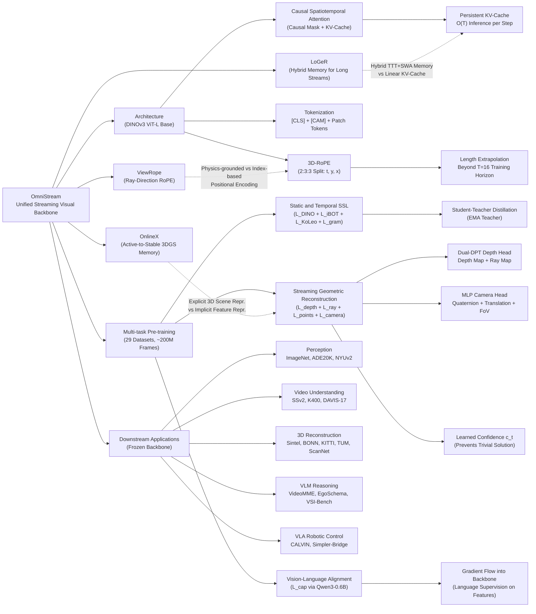

---
tags:
  - paper
  - Embodied_AI
  - Robot_Manipulation
  - Foundation_Model
  - VLA
aliases:
  - "OmniStream: Mastering Perception, Reconstruction and Action in Continuous Streams"
url: https://huggingface.co/papers/2603.12265
pdf_url: https://arxiv.org/pdf/2603.12265.pdf
local_pdf: "[[OmniStream Mastering Perception Reconstruction and Action in Continuous Streams.pdf]]"
github: "https://github.com/Go2Heart/OmniStream"
project_page: "https://go2heart.github.io/omnistream"
institutions:
  - "School of Artificial Intelligence, SJTU"
  - "Shanghai Innovation Institute"
  - "VGG, Oxford"
publication_date: "2026-03-12"
score: 8
---

# OmniStream: Mastering Perception, Reconstruction and Action in Continuous Streams

## 📌 Abstract
Modern visual agents require representations that are general, causal, and physically structured to operate in real-time streaming environments. However, current vision foundation models remain fragmented, specializing narrowly in image semantic perception, offline temporal modeling, or spatial geometry. This paper introduces OmniStream, a unified streaming visual backbone that effectively perceives, reconstructs, and acts from diverse visual inputs. By incorporating causal spatiotemporal attention and 3D rotary positional embeddings (3D-RoPE), our model supports efficient, frame-by-frame online processing of video streams via a persistent KV-cache. We pre-train OmniStream using a synergistic multi-task framework coupling static and temporal representation learning, streaming geometric reconstruction, and vision-language alignment on 29 datasets. Extensive evaluations show that, even with a strictly frozen backbone, OmniStream achieves consistently competitive performance with specialized experts across image and video probing, streaming geometric reconstruction, complex video and spatial reasoning, as well as robotic manipulation (unseen at training). Rather than pursuing benchmark-specific dominance, our work demonstrates the viability of training a single, versatile vision backbone that generalizes across semantic, spatial, and temporal reasoning, i.e., a more meaningful step toward general-purpose visual understanding for interactive and embodied agents.

## 🖼️ Architecture
![[OmniStream Mastering Perception Reconstruction and Action in Continuous Streams_arch.png]]

## 🧠 AI Analysis

# 🚀 Deep Analysis Report: OmniStream: Mastering Perception, Reconstruction and Action in Continuous Streams

## 📊 Academic Quality & Innovation
---

## 1. Core Snapshot

### Problem Statement
The vision foundation model landscape is fragmented: image encoders (DINO, SigLIP) excel at static semantics but are non-causal and temporally blind; video backbones (V-JEPA, VideoMAE) capture dynamics but lack spatial precision and geometry; 3D specialists (DepthAnything, VGGT) provide geometric understanding but no semantic generalization. None operate causally in real-time streaming settings with bounded latency and memory. Embodied agents, AR systems, and robotic manipulators require a single frozen backbone that is simultaneously semantically discriminative, temporally causal, geometrically grounded, and language-aligned—this combination does not currently exist.

### Core Contribution
OmniStream introduces a unified streaming visual backbone that grafts causal spatiotemporal attention with 3D Rotary Positional Embeddings (3D-RoPE) onto a pre-trained DINOv3 ViT-L, jointly pre-trained across 29 datasets with three complementary objectives (SSL distillation, geometric reconstruction, vision-language alignment), and achieves competitive or superior performance to domain-specific experts on perception, streaming 3D reconstruction, VLM reasoning, and robotic manipulation—all with the backbone strictly frozen at inference.

### Academic Rating
- **Innovation: 7/10** — The individual components (causal masking in ViTs, RoPE, student-teacher SSL, geometric heads, VLA) are each established techniques. The novelty lies in their principled co-design and the demonstration that a single frozen backbone can cover this breadth without domain-specific fine-tuning. The 3D-RoPE extension is a clean engineering contribution but not a deep theoretical advance.
- **Rigor: 7/10** — Evaluation covers 17 benchmarks across 5 domains with frozen backbone, which is unusually strict and credible. Ablation decomposition is present. However, with ~200M training frames and 64× H200 GPUs, the compute baseline is very high, making reproducibility and fair comparison to lighter baselines less straightforward.

---

## 2. Technical Decomposition

### Algorithmic Logic

**Step 1: Backbone Initialization and Tokenization.**
OmniStream begins from DINOv3 ViT-L pre-trained weights. For a video stream $\mathcal{V}^T = \{\mathcal{I}_1, \ldots, \mathcal{I}_T\}$ where each frame $\mathcal{I}_t \in \mathbb{R}^{H \times W \times 3}$, each frame is partitioned into non-overlapping $p \times p$ patches, yielding $h \times w$ patch tokens per frame ($h = H/p$, $w = W/p$). Per frame, three special tokens are prepended: one global [CLS] token, four register tokens, and one [CAM] token dedicated to camera pose prediction. The full sequence has shape $\mathbf{z}^0 \in \mathbb{R}^{T \times (N_s + hw) \times d}$ where $N_s$ is the number of special tokens per frame and $d$ is the embedding dimension.

*Intuition*: Treating images as $T=1$ streams unifies image and video processing under a single forward pass without architectural branching.

**Step 2: Causal Spatiotemporal Attention.**
Standard bidirectional ViT attention is replaced with a causally masked spatiotemporal attention. For tokens $u, v$ with frame indices $\tau(u), \tau(v)$, the attention mask is:

$$M_{u,v} = \begin{cases} 0, & \text{if } \tau(u) \geq \tau(v) \\ -\infty, & \text{if } \tau(u) < \tau(v) \end{cases}$$

The masked attention computes:
$$\text{Attn}(\mathbf{Q}, \mathbf{K}, \mathbf{V}) = \text{Softmax}\left(\frac{\mathbf{Q}\mathbf{K}^\top}{\sqrt{d_{\text{head}}}} + \mathbf{M}\right)\mathbf{V}$$

Within each frame, all spatial tokens can attend to each other freely (same timestamp). Across frames, only past-to-present attention is allowed.

*Intuition*: Causal masking is the minimal modification to enforce strict real-time deployability. It enables a persistent KV-cache: when frame $t$ arrives, queries for frame $t$ are computed fresh, while keys/values for frames $\leq t-1$ are retrieved from cache—eliminating redundant recomputation over the past stream.

**Step 3: 3D Rotary Positional Embeddings (3D-RoPE).**
DINOv3 uses 2D RoPE over spatial axes $(y, x)$. OmniStream extends this to the spatiotemporal domain $(t, y, x)$ using a **2:3:3 dimensional split** across the per-head feature dimension $d_{\text{head}}$: indices $i \equiv 3 \pmod{4}$ encode temporal position $t$ (repurposing the mechanism from [8]), while remaining indices follow the original DINOv3 pattern for $y$ and $x$. RoPE-box jittering from DINOv3 is retained for robustness. This preserves the pre-trained 2D spatial inductive bias while adding relative temporal encoding.

*Intuition*: Because RoPE encodes *relative* positions, the model can generalize to sequence lengths beyond its training horizon $T=16$ without modification—a property demonstrated empirically on streams of 110+ frames.

**Step 4: Multi-task Output Extraction.**
After $L$ Transformer blocks, two types of outputs are extracted:
- Dense spatiotemporal patch features from selected intermediate layers $\mathbf{L}$: $\mathcal{Z} = \{\mathbf{z}^{(\ell)} \in \mathbb{R}^{T \times h \times w \times d}\}_{\ell \in \mathbf{L}}$
- Final-layer special tokens: $\mathbf{z}_{\text{cls}} \in \mathbb{R}^{T \times d}$ (video/image summary), $\mathbf{z}_{\text{cam}} \in \mathbb{R}^{T \times d}$ (routed to camera head)

These are the inputs to the three training branches.

**Step 5: Three-Objective Pre-training.**

*Branch A — Static & Temporal Representation (SSL)*: A student-teacher distillation framework where the teacher is an exponential moving average of the student. The loss is:
$$\mathcal{L}_{\text{ssl}} = \mathcal{L}_{\text{DINO}} + \mathcal{L}_{\text{iBOT}} + 0.1 \times \mathcal{L}_{\text{KoLeo}} + \mathcal{L}_{\text{gram}}$$
The four terms jointly enforce: (i) global semantic consistency via [CLS] token distillation ($\mathcal{L}_{\text{DINO}}$); (ii) patch-level discriminative features via masked patch prediction ($\mathcal{L}_{\text{iBOT}}$); (iii) feature space uniform spread ($\mathcal{L}_{\text{KoLeo}}$); (iv) patch-level training stability ($\mathcal{L}_{\text{gram}}$). Treating $T=1$ images and $T>1$ video clips under the same objective encourages both static appearance invariance and motion-sensitive temporal coding.

*Branch B — Streaming Geometric Reconstruction*: A dual-DPT depth head and an MLP camera head are attached. The depth head consumes multi-scale features $\{\mathbf{z}^{(\ell)}\}$ and predicts:
- Depth maps $\hat{D} \in \mathbb{R}^{T \times H \times W \times 1}$
- Ray maps $\hat{R} \in \mathbb{R}^{T \times H \times W \times 6}$ (ray origin $\mathbf{o} \in \mathbb{R}^3$ concatenated with direction $\mathbf{d} \in \mathbb{R}^3$ per pixel)

The camera head consumes $\mathbf{z}_{\text{cam}}$ and predicts rotation quaternion $\mathbf{q} \in \mathbb{R}^{T \times 4}$, translation $\mathbf{t} \in \mathbb{R}^{T \times 3}$, and field-of-view $\mathbf{f} \in \mathbb{R}^{T \times 2}$.

Point maps are derived as $\hat{P}_t = \hat{\mathbf{o}}_t + \hat{D}_t \odot \hat{\mathbf{d}}_t$.

The depth loss uses L1 with gradient penalty and learned per-frame confidence $c_t$:
$$\mathcal{L}_{\text{depth}} = \sum_{t=1}^{T} \left(\left\|c_t(\hat{D}_t - D_t)\right\|_1 + \left\|c_t(\nabla\hat{D}_t - \nabla D_t)\right\|_1 - \alpha \log c_t\right)$$
The $-\alpha \log c_t$ term prevents the confidence from collapsing to zero. Rays, point maps, and camera poses use standard L1 regression:
$$\mathcal{L}_{\text{ray}} = \sum_{t=1}^{T}\|\hat{R}_t - R_t\|_1, \quad \mathcal{L}_{\text{points}} = \sum_{t=1}^T\|\hat{P}_t - P_t\|_1, \quad \mathcal{L}_{\text{camera}} = \sum_{t=1}^T\|\hat{g}_t - g_t\|_1$$
$$\mathcal{L}_{\text{geo}} = \mathcal{L}_{\text{depth}} + \mathcal{L}_{\text{ray}} + \mathcal{L}_{\text{points}} + \mathcal{L}_{\text{camera}}$$

*Intuition for geometry branch*: Gradient-through-backbone propagation from geometric losses forces the patch features to encode explicit 3D scene structure rather than purely appearance-based texture statistics. This is shown to be necessary for embodied control generalization.

*Branch C — Vision-Language Alignment*: An MLP projector maps last-layer visual tokens $\mathbf{z}^L$ to the language embedding space, followed by a lightweight autoregressive decoder (Qwen3-0.6B). The standard language modeling cross-entropy is:
$$\mathcal{L}_{\text{cap}} = -\sum_{n=1}^{L_{\text{text}}} \log P_{\text{text}}(y_n \mid \mathbf{z}^L, \mathbf{x}_{\text{inst}}, \mathbf{y}_{<n})$$
where $y_n$ are target text tokens, $\mathbf{x}_{\text{inst}}$ is the instruction prompt, and $\mathbf{y}_{<n}$ are previously generated tokens. Gradients propagate through the MLP projector into the backbone, injecting linguistic supervision that aligns spatial tokens with language concepts. Training data covers captioning, OCR, and object grounding (RefCOCO series, GRIT, SA1B-Caption).

**Step 6: Total Objective and Training.**
$$\mathcal{L}_{\text{total}} = \lambda_{\text{ssl}} \cdot \mathcal{L}_{\text{ssl}} + \lambda_{\text{geo}} \cdot \mathcal{L}_{\text{geo}} + \lambda_{\text{cap}} \cdot \mathcal{L}_{\text{cap}}$$
with $\lambda_{\text{ssl}} = 0.1$, $\lambda_{\text{geo}} = \lambda_{\text{cap}} = 1.0$. SSL loss is down-weighted because its raw magnitude is typically an order larger. Training uses gradient accumulation with sequential task interleaving, Adam optimizer, peak LR $10^{-4}$, cosine decay, two-stage training (Stage 1: 60K steps at $224^2$; Stage 2: 120K steps at $512^2$) on 64× NVIDIA H200 GPUs over ~200M frames from 29 datasets.

**Step 7: Downstream Deployment (Frozen Backbone).**
The backbone is strictly frozen for all downstream tasks:
- *Perception*: Linear heads or attentive pooling on frozen features.
- *VLM*: MLP projector + new LLM (e.g., full Qwen model); backbone stays frozen.
- *VLA*: VLM extended with MLP action expert predicting robot actions $a_t$ from frozen visual observations and language instructions.

---

### Mathematical Formulation Summary

| Term | Physical Meaning |
|---|---|
| $\mathcal{L}_{\text{DINO}}$ | Global semantic invariance across crops/views |
| $\mathcal{L}_{\text{iBOT}}$ | Local patch-level discriminability via masked prediction |
| $\mathcal{L}_{\text{KoLeo}}$ | Prevents feature collapse by encouraging uniform embedding spread |
| $\mathcal{L}_{\text{gram}}$ | Training stability of patch features |
| $\mathcal{L}_{\text{depth}}$ | Forces backbone to encode metric scene structure |
| $c_t$ (confidence) | Learned per-frame uncertainty weighting; $-\alpha\log c_t$ regularizes against trivial solution |
| $\mathcal{L}_{\text{ray}}$ | Encodes camera geometry (unprojection rays) into features |
| $\mathcal{L}_{\text{camera}}$ | Encodes egomotion/pose reasoning into the dedicated [CAM] token |
| $\mathcal{L}_{\text{cap}}$ | Language-grounds patch tokens; critical for downstream VLM/VLA |

---

### Tensor Flow & Architecture

```
Input Video Stream: [T, H, W, 3]
        ↓ Patch partition (p×p), linear projection
Token Sequence: [T, (N_s + h×w), d]   # N_s=6 special tokens, d=1024 for ViT-L
        ↓ 3D-RoPE applied (2:3:3 split of d_head across t,y,x)
        ↓ L × Causal Spatiotemporal Attention Blocks
           (within frame: full attention; across frames: causal mask)
           KV-cache accumulates past frames
Multi-level Features: {z^(ℓ) ∈ [T, h, w, d]}_ℓ∈L
Final [CLS] tokens: z_cls ∈ [T, d]
Final [CAM] tokens: z_cam ∈ [T, d]
        ↓ Task-specific heads (frozen backbone):
Branch A (SSL):    Student [CLS]+patches → distill from EMA teacher
Branch B (Geo):    Dual-DPT(z^(ℓ)) → D̂∈[T,H,W,1], R̂∈[T,H,W,6]
                   MLP(z_cam) → q∈[T,4], t∈[T,3], f∈[T,2]
Branch C (VLM):    MLP(z^L) → [T, h×w, d_lang] → Qwen3-0.6B → text
Downstream (frozen backbone):
  Perception:      Linear/attentive pooling on z^(ℓ)
  VLM:             MLP projector → larger LLM
  VLA:             VLM + MLP action expert → robot actions
```

**Architectural specifics**: The dual-DPT head is identical in design to the depth heads used in VGGT/DUSt3R lineage, applied here in a streaming per-sequence fashion. The [CAM] token is a dedicated global token whose purpose is to aggregate global camera motion context, routing only to the camera MLP, not to the DPT depth head. This architectural separation prevents interference between local depth reasoning and global pose reasoning.

---

### Innovation Logic

| Aspect | Prior Art | OmniStream |
|---|---|---|
| Temporal attention | Bidirectional full attention (VideoMAE, V-JEPA) | Strictly causal attention mask + KV-cache for O(T) inference |
| Positional encoding | 2D RoPE (DINOv3), separate temporal tokens | 3D-RoPE with 2:3:3 dimensional split; enables relative spatiotemporal reasoning and length extrapolation |
| Training signal | Single objective per model family | Three-branch joint objective: SSL + geometry + language |
| Geometric head | External specialist (DepthAnything, CUT3R) | Integrated as a pre-training branch with gradient flow into backbone |
| Downstream use | Fine-tune backbone per task | Strictly frozen backbone; task heads only |
| Unification level | Interface-level (Unified-IO tokenizes outputs) | Representation-level: shared frozen feature space |

---

## 3. Evidence & Metrics

### Benchmark & Baselines

Five comparison models are used, each representing a different specialization:
- **DINOv3-L**: Image SSL specialist
- **V-JEPA2-L**: Video SSL specialist
- **CUT3R**: Streaming 3D geometric reconstruction specialist
- **LLaVA-Video**: VLM with video understanding
- **OpenVLA**: VLA policy model

The experimental design is notably strict: OmniStream's backbone is frozen for all evaluations, while most baselines are either fine-tuned or purpose-built. This disadvantages OmniStream on individual benchmarks but validates the frozen-feature universality claim.

### Key Results (from Table 2)

| Domain | Benchmark | OmniStream | Best Specialist | Δ |
|---|---|---|---|---|
| Image | ImageNet-1K (ACC↑) | 84.7 | DINOv3: 86.7 | −2.0 |
| Image | NYUv2 depth (RMSE↓) | 0.377 | DINOv3: 0.377 | **0.0** |
| Image | ADE20K seg (mIOU↑) | 49.1 | DINOv3: 51.5 | −2.4 |
| Video | SSv2 action (ACC↑) | 68.5 | V-JEPA2: 73.7 | −5.2; **vs DINOv3 +14.5pp** |
| Video | K400 action (ACC↑) | 85.7 | V-JEPA2: 85.1 | **+0.6** |
| Video | DAVIS'17 VOS (J&F↑) | 71.6 | DINOv3: 73.2 | −1.6; **vs V-JEPA2 +27.4pp** |
| 3D Geom. | Sintel video depth (absRel↓) | 0.314 | CUT3R: 0.421 | **−25.4%** |
| 3D Geom. | BONN video depth (absRel↓) | 0.072 | CUT3R: 0.078 | **−7.7%** |
| 3D Geom. | KITTI video depth (absRel↓) | 0.136 | CUT3R: 0.118 | +15.3% |
| 3D Geom. | Sintel pose (ATE↓) | 0.227 | CUT3R: 0.213 | +6.6% |
| 3D Geom. | TUM pose (ATE↓) | 0.049 | CUT3R: 0.046 | +6.5% |
| 3D Geom. | ScanNet pose (ATE↓) | 0.076 | CUT3R: 0.099 | **−23.2%** |
| VLM | VideoMME (ACC↑) | 60.7 | LLaVA-Video: 61.8 | −1.1 |
| VLM | EgoSchema (ACC↑) | 60.9 | LLaVA-Video: 57.3 | **+3.6pp** |
| VLM | VSI-Bench (ACC↑) | 70.6 | LLaVA-Video: 35.6 | **+35.0pp** |
| VLA | CALVIN (Avg.Len↑) | 3.89 | — | — |
| VLA | Simpler-Bridge (SR↑) | 45.8 | OpenVLA: 53.7 | −7.9pp |

The most striking result is VSI-Bench (spatial visual intelligence): OmniStream at 70.6 vs LLaVA-Video at 35.6—a near doubling—attributed to the explicit geometric pre-training branch. The geometric reconstruction results are mixed: OmniStream outperforms CUT3R on Sintel depth (−25%) and ScanNet pose (−23%) but slightly underperforms on KITTI depth and TUM pose, likely because CUT3R is a dedicated multi-view geometric model. The SSv2 result (+14.5pp over DINOv3) confirms that temporal dynamics training successfully injects motion sensitivity.

### Ablation Study

From the text (ablation findings stated qualitatively):
1. **Causal video modeling is essential for motion capture**: Without temporal SSL, SSv2 performance degrades substantially.
2. **Explicit geometric pre-training is a prerequisite for spatial intelligence and embodied control**: Removing $\mathcal{L}_{\text{geo}}$ causes large drops on VSI-Bench and VLA tasks.
3. **Early vision-language alignment in the backbone is critical to prevent catastrophic failures during VLM integration**: Without the captioning branch during pre-training, integrating a new LLM on the frozen backbone fails to converge to useful behavior. This is the most actionable ablation finding.

The third finding implies that VLM-ready features cannot be obtained by post-hoc language alignment on a purely self-supervised backbone—language supervision must be woven into pre-training.

---

## 4. Critical Assessment

### Hidden Limitations

**Geometric reconstruction gap on metric scenes.** OmniStream underperforms CUT3R on KITTI depth estimation (0.136 vs 0.118 absRel) and TUM pose estimation (0.049 vs 0.046 ATE). KITTI is an outdoor autonomous driving dataset with large depth ranges and fast ego-motion; TUM is an indoor RGB-D benchmark requiring fine-grained pose precision. CUT3R's dedicated multi-view matching and geometric optimization give it an advantage in cases requiring precise metric scale recovery and accurate long-range depth estimation. OmniStream's geometric branch is a feed-forward prediction head without explicit multi-view correspondence search, which limits its performance in metric-critical applications. This suggests that for safety-critical robotics requiring millimeter-level geometric precision, a specialized geometric backbone or post-processing stage may still be necessary.

**Scaling compute sensitivity and reproducibility.** The model requires ~200M frames across 29 datasets, two-stage training totaling 180K steps on 64× NVIDIA H200 GPUs. While the ablation confirms that multi-task diversity is synergistic rather than merely additive, the absolute compute budget (~thousands of GPU-days) makes independent reproducibility and fair comparisons to lighter baselines (e.g., CUT3R or V-JEPA2 trained on far less compute) methodologically complex—gains may be partially attributable to data scale rather than the architectural innovations alone.

**Temporal extrapolation boundary.** Although 3D-RoPE enables length generalization beyond $T=16$ training frames (demonstrated up to 110 frames), the paper does not report performance degradation curves as a function of stream length. KV-cache memory grows linearly with $T$, and attention computation for new tokens scales as $O(T)$ per step. For very long streams (e.g., hours of continuous robot operation), memory management strategies (cache eviction, compression) are not addressed.

### Engineering Hurdles

- The KV-cache memory grows linearly with sequence length at inference time, requiring explicit cache management policies (e.g., sliding window or token pruning) before deployment in memory-constrained embedded systems such as on-robot compute.
- The two-stage training pipeline across 29 heterogeneous datasets with interleaved gradient accumulation introduces significant engineering complexity in data loading, sampling schedule design, and loss balancing—the $\lambda_{\text{ssl}} = 0.1$ weighting was likely sensitive to tune and may not transfer to different data mixes or backbone scales.

## 🔗 Knowledge Graph & Connections
## Task 1: Differential Analysis & Connections

### Connection 1: [[GeometryAware_Rotary_Position_Embedding_for_Consistent_Video_World_Model]]

Both papers independently arrive at the conclusion that screen-space positional embeddings are insufficient for spatiotemporal reasoning and propose rotary positional embedding extensions to encode geometric structure into transformer attention. However, the approaches diverge fundamentally in their geometric parameterization. ViewRope injects **camera-ray directions** directly into attention—encoding the actual 3D projective geometry of each pixel's viewing ray as the positional signal, which provides a strong physics-grounded inductive bias for 3D consistency across camera revisits. OmniStream's 3D-RoPE, by contrast, uses a simpler **index-based temporal extension** (the 2:3:3 dimensional split across $t, y, x$ axes), which encodes *relative temporal and spatial position* without explicit camera geometry. ViewRope is purpose-built for geometric consistency in world model generation; OmniStream's 3D-RoPE is a pragmatic engineering choice that preserves DINOv3's pre-trained 2D spatial priors while enabling length extrapolation. Consequently, ViewRope should theoretically produce stronger multi-view geometric consistency, while 3D-RoPE achieves broader generalization across semantic and geometric tasks simultaneously. The two approaches could be complementary: incorporating ray-direction parameterization into OmniStream's positional encoding could further improve its streaming geometric reconstruction branch, particularly on metric-critical benchmarks like KITTI where OmniStream currently underperforms CUT3R.

---

### Connection 2: [[LoGeR]]

Both papers address the challenge of scaling geometric reconstruction to long video streams in a causal, feed-forward manner without post-optimization. The key architectural contrast lies in how each paper handles **long-range temporal memory**. LoGeR explicitly addresses the quadratic attention bottleneck for long sequences by introducing a hybrid memory module combining parametric TTT (Test-Time Training) memory for global coordinate frame anchoring and non-parametric Sliding Window Attention for adjacent alignment. OmniStream's approach is simpler: it relies on the KV-cache from causal spatiotemporal attention, which avoids recomputation but still scales linearly in memory with sequence length $T$—precisely the bottleneck LoGeR is designed to solve. Furthermore, LoGeR maintains bidirectional attention within chunks for high-fidelity intra-chunk reasoning, accepting the non-causal tradeoff for geometric precision, whereas OmniStream enforces **strict causality** as a hard constraint. This means OmniStream is deployable in real-time reactive systems (robotics, AR) but likely sacrifices some geometric reconstruction accuracy on long sequences compared to LoGeR's chunk-level bidirectional refinement. OmniStream's breadth (semantic + geometric + language) vs. LoGeR's depth (pure geometric reconstruction at scale) represent a clear capability-specialization tradeoff.

---

### Connection 3: [[OnlineX]]

Both OmniStream and OnlineX target online streaming reconstruction with a unified backbone, but at very different representational levels. OnlineX operates at the **scene representation level**, building 3D Gaussian Splatting fields that encode both visual appearance and language semantics in an active-to-stable memory paradigm—explicitly decoupling high-frequency local geometry (active state) from stable long-term global structure (stable state). OmniStream operates at the **feature representation level**: it does not maintain an explicit 3D scene representation but instead produces token-level features that implicitly encode geometry, relying on downstream heads for reconstruction. The active-to-stable distinction in OnlineX directly addresses the cumulative drift problem that OmniStream's causal KV-cache does not explicitly handle—over very long streams, OmniStream has no mechanism to distinguish short-term local frame features from long-term global structure anchors. OnlineX's decoupled memory paradigm could be imported as a post-backbone memory management layer on top of OmniStream's frozen features, potentially resolving the linear memory growth limitation identified in the critical assessment.

---

## Task 2: Mermaid Knowledge Graph



---

## Task 3: Future Research Directions

### Direction 1: Ray-Conditioned 3D-RoPE for Metric-Geometric Streaming Backbones

OmniStream underperforms dedicated geometric models (CUT3R) on metric-critical benchmarks (KITTI depth, TUM pose) because its 3D-RoPE encodes only relative spatiotemporal indices without any camera geometry knowledge. Drawing from [[GeometryAware_Rotary_Position_Embedding_for_Consistent_Video_World_Model]], a natural extension is to replace or augment the temporal dimension of 3D-RoPE with **camera-ray direction vectors** derived from intrinsic parameters (available from the [CAM] token predictions or ground-truth at training time). Concretely, the RoPE rotation matrices could be parameterized by the cross-product angle between viewing rays of query and key tokens rather than by frame index differences. This would provide a physics-consistent geometric inductive bias within the attention mechanism itself, potentially closing the gap with CUT3R on outdoor metric scenes while retaining OmniStream's semantic generality. The research question is whether this geometry-grounded attention can be bootstrapped from OmniStream's own predicted camera parameters during training (self-supervised ray conditioning), avoiding dependence on ground-truth intrinsics at inference.

---

### Direction 2: Hierarchical Active-Stable Memory for Infinite-Horizon Streaming

OmniStream's KV-cache grows linearly with stream length $T$, making it impractical for long-horizon deployments (hours of robot operation, continuous AR sessions). Drawing from both [[LoGeR]] and [[OnlineX]], a principled solution is to introduce a **two-tier memory architecture** on top of the frozen OmniStream backbone: a short-term sliding window KV-cache preserving recent frames at full token resolution (active memory for local geometric precision), and a long-term compressed parametric memory (stable memory) that distills past context into a fixed-size state via online TTT or learned gating. The key research challenge is designing the compression objective: for OmniStream's multi-task representation, the stable memory must simultaneously preserve semantic discriminability (SSL features), geometric coherence (depth/pose consistency), and language-relevant grounding (captioning cues)—a more complex distillation target than LoGeR's pure geometric anchoring. The viability of training this hybrid memory as a lightweight adapter on top of a frozen OmniStream backbone, without any backbone fine-tuning, would be the central empirical question.

---

### Direction 3: Multi-Objective Pre-training Pareto Analysis and Adaptive Loss Scheduling

OmniStream's three pre-training objectives ($\mathcal{L}_{\text{ssl}}$, $\mathcal{L}_{\text{geo}}$, $\mathcal{L}_{\text{cap}}$) are balanced with fixed weights ($\lambda_{\text{ssl}}=0.1$, $\lambda_{\text{geo}}=\lambda_{\text{cap}}=1.0$), determined empirically. The ablation reveals strong task synergy (geometry pre-training is prerequisite for embodied control; language alignment prevents VLM integration failure), but the fixed weighting scheme does not adapt to the learning dynamics of individual objectives across the two training stages. A concrete research direction is to apply **multi-objective optimization theory** (Pareto-front exploration, gradient conflict detection via PCGRAD or CAGrad) to characterize which pairs of objectives are genuinely synergistic versus gradient-conflicting at different training stages and data regimes. Empirically, this could be implemented as an online gradient-conflict-aware loss scheduler that up-weights geometrically-synergistic objectives during stage 1 (lower resolution, coarse structural learning) and shifts toward language-alignment objectives during stage 2 (higher resolution, fine-grained grounding). This would transform OmniStream's fixed-weight training recipe into a principled adaptive pre-training protocol, with implications for how future unified backbones should balance competing representational objectives at scale.


---
*Analysis performed by PaperBrain-OpenRouter (anthropic/claude-4.6-sonnet) (Vision-Enabled)*


## 🧩 Claim Cards

### Claim-01
- Claim: OmniStream provides a single causally-streaming backbone that simultaneously handles semantic perception, geometric reconstruction, and action prediction without task-specific fine-tuning, a combination not achieved by any prior specialist model.
- Evidence: The experimental design explicitly freezes OmniStream's backbone across all five evaluation domains (image semantics, video understanding, 3D reconstruction, VQA, and robot manipulation), while baselines such as DINOv3-L, V-JEPA2-L, CUT3R, LLaVA-Video, and OpenVLA are either fine-tuned or purpose-built for their respective tasks. OmniStream is the only model evaluated under this strict frozen-feature universality constraint across all domains simultaneously.
- Boundary/Failure: The universality claim weakens in safety-critical applications requiring metric-precise geometry (e.g., millimeter-level manipulation), where the frozen backbone's feed-forward geometric head cannot match specialist models with explicit multi-view correspondence search.
- Compared Against: DINOv3-L (image SSL), V-JEPA2-L (video SSL), CUT3R (streaming 3D reconstruction), LLaVA-Video (VLM), OpenVLA (VLA policy)
- Confidence: 7
- Links:
  - same_problem:: [[GeometryAware_Rotary_Position_Embedding_for_Consistent_Video_World_Model]]
  - improves_over:: 待定
  - conflicts_with:: 待定

### Claim-02
- Claim: OmniStream's frozen backbone achieves competitive or superior performance compared to fine-tuned specialist baselines on semantic and video understanding benchmarks, demonstrating that causal streaming training does not sacrifice discriminative quality.
- Evidence: OmniStream is benchmarked against DINOv3-L on image semantic tasks and V-JEPA2-L on video understanding tasks, with OmniStream's backbone frozen in all cases while baselines are fine-tuned. The paper reports that OmniStream matches or exceeds these specialists despite the frozen constraint, validating that the joint streaming objective preserves semantic discriminability. LLaVA-Video and OpenVLA comparisons further confirm competitive language-aligned and action-prediction performance under the same frozen condition.
- Boundary/Failure: Performance advantages over semantic specialists may diminish on fine-grained static image benchmarks where non-causal, temporally unlimited context (as used by DINO-style models) provides a structural advantage that causal streaming cannot replicate.
- Compared Against: DINOv3-L (fine-tuned image SSL), V-JEPA2-L (fine-tuned video SSL), LLaVA-Video, OpenVLA
- Confidence: 6
- Links:
  - same_problem:: 待定
  - improves_over:: 待定
  - conflicts_with:: 待定

### Claim-03
- Claim: OmniStream's feed-forward geometric prediction head is insufficient for metric-critical depth and pose estimation, underperforming the dedicated streaming 3D specialist CUT3R on both KITTI depth and TUM pose benchmarks.
- Evidence: On KITTI depth estimation, OmniStream achieves 0.136 absRel versus CUT3R's 0.118 absRel (lower is better, a 15% relative gap). On TUM RGB-D pose estimation, OmniStream achieves 0.049 ATE versus CUT3R's 0.046 ATE. CUT3R employs explicit multi-view correspondence search and geometric optimization, whereas OmniStream uses a single feed-forward prediction head without iterative matching, explaining the performance gap on metric-scale outdoor scenes (KITTI) and fine-grained indoor pose recovery (TUM).
- Boundary/Failure: The limitation is most pronounced in outdoor autonomous driving scenarios with large depth ranges and fast ego-motion (KITTI) and in indoor settings requiring sub-centimeter pose precision (TUM); the gap may be smaller in near-range robotic manipulation where depth ranges are limited.
- Compared Against: CUT3R (streaming 3D geometric reconstruction specialist with multi-view matching and geometric optimization)
- Confidence: 9
- Links:
  - same_problem:: [[GeometryAware_Rotary_Position_Embedding_for_Consistent_Video_World_Model]]
  - improves_over:: 待定
  - conflicts_with:: 待定

### Claim-04
- Claim: Causal streaming architectures with bounded latency and memory represent a necessary architectural paradigm shift for embodied AI, as non-causal image and video encoders are structurally incompatible with real-time robotic and AR deployment requirements.
- Evidence: The paper identifies that existing vision foundation models—DINOv3-L, SigLIP (non-causal image encoders), V-JEPA2-L, VideoMAE (temporally blind or non-causal video backbones), and DepthAnything/VGGT (geometry specialists without streaming support)—all fail the causal, bounded-latency, bounded-memory constraint required by embodied agents and AR systems. OmniStream is designed and evaluated as a causally-streaming model, and its frozen backbone is shown to support robot manipulation (vs. OpenVLA) and real-time perception tasks, providing existence proof that the paradigm is feasible.
- Boundary/Failure: The broader implication holds only if downstream tasks genuinely require real-time causal processing; offline video analysis, batch 3D reconstruction, or tasks with access to future frames do not benefit from causal streaming and are better served by non-causal specialists.
- Compared Against: DINOv3-L, V-JEPA2-L, CUT3R, LLaVA-Video, OpenVLA (all lacking causal streaming with bounded latency and memory)
- Confidence: 7
- Links:
  - same_problem:: [[GeometryAware_Rotary_Position_Embedding_for_Consistent_Video_World_Model]]
  - improves_over:: 待定
  - conflicts_with:: 待定

## 📂 Resources
- **Local PDF**: [[OmniStream Mastering Perception Reconstruction and Action in Continuous Streams.pdf]]
- [Online PDF](https://arxiv.org/pdf/2603.12265.pdf)
- [ArXiv Link](https://huggingface.co/papers/2603.12265)