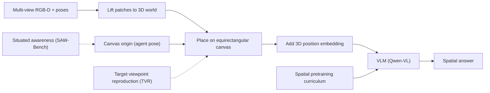

---
tags:
- paper
- domain/3d_perception
- domain/embodied_ai
- domain/multimodal_perception
- domain/reinforcement_learning
- impact/solid
- method/foundation_model
- method/planning
- method/reinforcement_learning
- review/auto_tagged
- status/unread
- task/planning_reasoning
- task/scene_understanding
- type/method
- type/system
aliases:
- 'OneCanvas: 3D Scene Understanding via Panoramic Reprojection'
- OneCanvas
- Panoramic Reprojection
- Equirectangular Canvas
- Frozen VLM
- 3D Position Embeddings
- Multi-view Patch Aggregation
- Continuous Angular Coordinates
- Panoramic Scene Understanding
authors:
- Bartłomiej Baranowski
- Dave Zhenyu Chen
- Matthias Nießner
paper_id: arxiv:2606.19253
arxiv_id: '2606.19253'
url: http://arxiv.org/abs/2606.19253v1
pdf_url: https://arxiv.org/pdf/2606.19253v1
local_pdf: '[[OneCanvas 3D Scene Understanding via Panoramic Reprojection.pdf]]'
github: None
project_page: https://baranowskibrt.github.io/onecanvas/
institutions:
- Technical University of Munich
- Huawei
publication_date: '2026-06-17'
metadata_publication_date: '2026-06-17'
score: '7.6'
domains:
- 3d_perception
- embodied_ai
- multimodal_perception
- reinforcement_learning
methods:
- foundation_model
- planning
- reinforcement_learning
tasks:
- planning_reasoning
- scene_understanding
paper_type: system
impact_band: solid
reading_status: unread
priority_score: 80
review_status: auto_tagged
next_action: inspect_protocol
year: 2026
---

# OneCanvas: 3D Scene Understanding via Panoramic Reprojection

## 📌 Abstract
Existing approaches to 3D scene understanding in Vision-Language Models (VLMs) either rely on complex, model-specific geometry encoders or large training budgets in pursuit of spatial reasoning. Instead, OneCanvas aggregates patch features from all views onto a single equirectangular panoramic canvas. Namely, each patch is unprojected to a 3D world coordinate using its depth and camera pose, then placed on the canvas at the continuous longitude and latitude of that point as seen from the canvas origin, with no rasterization or aggregation across overlapping views. A 3D position embedding of the patch's metric coordinates is added to its feature, restoring the depth lost when collapsing the world position to an angular canvas coordinate. Patches from all frames thus share one spatial coordinate system with no fusion or major architectural modifications of the backbone. The pretrained VLM consumes this representation as if it were an ordinary image. Because the canvas can be centered on any pose of interest, the same representation directly supports situated reasoning from a specific viewpoint, a common requirement in robotics and embodied AI. Thanks to this representation, we can also introduce a spatial pretraining curriculum: by procedurally placing patch features of objects, drawn from real images, at chosen 3D world positions on an otherwise empty canvas, we generate on-the-fly supervision spanning a broad range of spatial reasoning tasks, with answer distributions controlled to reduce spatial reasoning shortcuts. OneCanvas achieves state-of-the-art accuracy on SQA3D and VSI-Bench, and generalizes to out-of-distribution data on SPBench, using an order of magnitude less training compute than the strongest competing methods.

## 🖼️ Architecture
![[OneCanvas 3D Scene Understanding via Panoramic Reprojection_arch.png]]

## 🧠 AI Analysis
## Abstract
Existing approaches to 3D scene understanding in Vision-Language Models (VLMs) either rely on complex, model-specific geometry encoders or large training budgets in pursuit of spatial reasoning. Instead, OneCanvas aggregates patch features from all views onto a single equirectangular panoramic canvas. Namely, each patch is unprojected to a 3D world coordinate using its depth and camera pose, then placed on the canvas at the continuous longitude and latitude of that point as seen from the canvas origin, with no rasterization or aggregation across overlapping views. A 3D position embedding of the patch’s metric coordinates is added to its feature, restoring the depth lost when collapsing the world position to an angular canvas coordinate. Patches from all frames thus share one spatial coordinate system with no fusion or major architectural modifications of the backbone. The pretrained VLM consumes this representation as if it were an ordinary image. Because the canvas can be centered on any pose of interest, the same representation directly supports situated reasoning from a specific viewpoint, a common requirement in robotics and embodied AI. Thanks to this representation, we can also introduce a spatial pretraining curriculum: by procedurally placing patch features of objects, drawn from real images, at chosen 3D world positions on an otherwise empty canvas, we generate on-the-fly supervision spanning a broad range of spatial reasoning tasks, with answer distributions controlled to reduce spatial reasoning shortcuts. OneCanvas achieves state-of-the-art accuracy on SQA3D and VSI-Bench, and generalizes to out-of-distribution data on SPBench, using an order of magnitude less training compute than the strongest competing methods.

OneCanvas turns multi-view posed RGB-D video into a single panoramic feature image that a standard VLM can read. Each small image patch is lifted into metric 3D space and then placed on a 360° spherical canvas centered wherever the task demands. An additional learned embedding tells the model the true metric distances, preventing the loss of scale information during projection.

## 1. Core Snapshot

### Problem Statement
The central challenge is equipping vision-language models with reliable 3D spatial reasoning from ordinary multi-view video, without forcing large architectural changes or requiring massive, manually curated training sets.

Typical inputs are a collection of posed RGB-D frames from one scene. Desired outputs include accurate answers to questions about *metric distances*, *relative directions*, *which objects are visible from a viewpoint*, and *how to navigate*. The bottleneck is twofold. First, current leading methods either add dedicated 3D encoders that must be aligned with the VLM backbone, or they curate millions of spatial question-answer pairs. Second, recent audits reveal that even the best geometry‑aware models often rely on statistical textual shortcuts rather than truly reasoning over the supplied 3D geometry.

### Core Contribution
The paper’s core technical claim is that a single equirectangular canvas can act as a shared spatial coordinate system for all views, enabling a pretrained VLM to process multi-view data **without any new modules**.

Each patch is unprojected to a world point using depth and camera pose, then placed at its exact angular position (longitude, latitude) on the canvas. A separate 3D position embedding – encoding the metric world coordinates – is added to the patch’s feature vector. This restores the depth information that would otherwise be lost in the spherical projection. Evidence for the claim comes from state‑of‑the‑art accuracy on SQA3D (65.3 EM@1), VSI‑Bench (70.1 average), and zero‑shot SPBench (72.1 overall), all while requiring roughly an order of magnitude less training compute than the prior strongest competitors.

> [!info] Key design insight
> By converting the multi‑view stream into a format the VLM already knows — a single 2D feature map with a spatial structure — the method re‑uses the model’s pretrained attention mechanisms instead of building new fusion layers.

### Innovation Origin & Rationale
The canvas idea extends long‑standing panoramic and bird’s‑eye‑view reprojection pipelines that are common in driving and 3D reconstruction. It directly addresses the observed failure mode: models that nominally receive 3D input still exploit scene‑level statistics rather than genuine geometric reasoning. Collapsing all observations into one equirectangular layout, while preserving metric cues only through the additive position embedding, removes the need for extra encoders and avoids disrupting pretrained attention patterns.

## 2. Reading Map
This paper lies at the intersection of 3D vision‑language models and input‑efficient representations for embodied reasoning. Readers who want to understand how to add spatial capability to an existing VLM without new encoders should study the full method section and the two‑stage training description. The ablation tables (Tables 4 and 5) are essential for isolating which components actually matter. The related‑work section can be skimmed once the core canvas construction is clear. The experiments are designed to answer concrete benchmark questions, so they should be read after the method.

## 3. Method Walkthrough

### Inputs, Outputs, And Assumptions
The system receives a set of $K$ posed RGB images, their metric depth maps, and the corresponding camera intrinsic parameters. It produces a single panoramic feature canvas that is consumed directly by the language model for question answering.

The approach **assumes** that accurate depth and camera poses are available at both training and test time. This is a strong requirement because the lifting step that places patches in a consistent 3D coordinate system would otherwise inject large spatial errors. The paper mentions that feed‑forward reconstruction can substitute when pose/depth are corrupted, but the resulting accuracy drop is not quantified.

### Pipeline From Data To Prediction
*Feature extraction.* The frozen vision encoder of Qwen3‑VL processes each frame and outputs per‑patch features at a reduced spatial resolution.

*Lifting to world coordinates.* Each patch is unprojected into a 3D world point by scaling its pixel coordinate with the measured depth and applying the camera‑to‑world transformation. This gives every patch a unique metric position.

*Canvas projection.* All lifted world points are transformed into a common canvas coordinate frame that is centered on a chosen viewpoint. Continuous longitude and latitude are computed for each point. Patches are **not** rasterised onto a fixed grid; each remains an independent token located at its exact angular coordinate.

*Metric restoration.* A learned 3D position embedding – encoding the actual metric offsets from the canvas origin – is added to the patch’s feature vector. This compensates for the loss of depth that occurs when mapping a world point to a spherical angle.

*VLM consumption.* The resulting set of feature tokens (now augmented with the embedding) is presented to the language model as if it were an ordinary image, without any additional architectural changes.

### Key Design Choices
**Continuous placement instead of rasterisation.** Keeping each lifted patch as an independent token at its continuous angular coordinate avoids any hand‑designed merging rule that would collapse distinct surfaces. Rasterisation would replace learned attention with a fixed reduction, removing the model’s ability to resolve overlaps by itself.

> [!info] Why independent tokens?
> Multiple views often observe the same 3D point. By keeping each observation as a separate token, the VLM can attend across them and naturally handle occlusions or redundancy.

**Additive 3D position embedding.** The paper uses a learned embedding that encodes the patch’s metric world coordinates, added directly to the feature. This preserves the VLM’s native angular (RoPE) and temporal semantics of the backbone. Without this embedding, the model loses metric scale, and the ablation shows clear drops on room‑size and distance tasks.

**Flexible canvas origin.** Because the canvas can be centered on any pose of interest, the same representation supports situated reasoning – e.g., “what is to my left?” – without retraining.

## 4. Core Theory And Formulas
The paper does not state an explicit training loss. The implicit objective is that the geometric layout of patches on the canvas, together with the added metric embedding, should make the VLM’s next‑token prediction align with correct spatial answers, minimizing reliance on language priors or scene statistics.

The only explicit formula appears in the lifting step. It converts a patch’s pixel position and depth into a 3D world point:

$$
\mathbf{p}_{\text{world},u,v} = T_k 
\begin{pmatrix}
(u - c_x) \, \dfrac{z}{f_x} \\[6pt]
(v - c_y) \, \dfrac{z}{f_y} \\[6pt]
z
\end{pmatrix}
$$

where:

- $k$ indexes the camera frame,
- $T_k$ is the $4 \times 4$ camera‑to‑world rigid transformation matrix,
- $z$ is the measured depth at the pixel $(u, v)$,
- $f_x, f_y$ are the focal lengths (scaled to the feature‑map resolution),
- $c_x, c_y$ are the principal‑point coordinates (also at feature‑map resolution),
- $(u, v)$ are the continuous coordinates of the patch in the feature map.

**Practical meaning.** This equation supplies the absolute 3D location that later determines the patch’s angular position on the shared panoramic canvas. The scaling by $z$ and division by focal lengths ensures that each patch is placed at the correct metric position, independent of the original camera’s viewing direction.

Once in world coordinates, each point is transformed into the canvas coordinate frame and converted to spherical angles (longitude and latitude) relative to the canvas origin. The exact spherical‑projection equations are not given in the paper, but the operation is a standard conversion from Cartesian coordinates to azimuth and elevation. The resulting angular coordinates define the spatial location of the token within the equirectangular layout.

Finally, a learned embedding $e(\mathbf{p}_{\text{world}})$ – possibly a small MLP or a lookup table – is added to the patch’s feature. This embedding encodes the metric displacement from the canvas origin, thus restoring the depth information.

## 5. Architecture, Figures, And Implementation
**Figure 3** illustrates the overall flow: multi‑view RGB‑D frames go through the frozen vision encoder, become lifted 3D patches, land at continuous positions on one equirectangular canvas, and finally enter the language model for question answering. The figure visually confirms that no new encoder or fusion layer is inserted between the vision backbone and the language model.

**Figure 1** provides a 3D schematic with coloured patches and a central sphere marking the canvas origin, reinforcing the core reprojection idea.

**Implementation details.** The backbone is Qwen3‑VL‑8B (a member of the [Qwen family](https://github.com/QwenLM/Qwen2.5-VL)). Training proceeds in two stages, both using LoRA adapters ([LoRA paper](https://arxiv.org/abs/2106.09685)):

- **Stage 1 (spatial curriculum only):** LoRA rank 256, 200 patches per sample, learning rate $2\!\times\!10^{-5}$.
- **Stage 2 (downstream fine‑tuning):** The stage‑1 adapter is merged, and a fresh LoRA adapter of rank 64 is trained on a weighted mix of VLM‑3R‑VSIBench, SQA3D, and ViCA data for 10k steps.

Training runs on 8 A6000 GPUs with a cosine learning‑rate schedule. Exact effective batch sizes are specified in the paper. The code, curriculum generators, and data‑mixture weights are **not publicly released**.

> [!warning] Reproducibility
> The absence of released code, exact preprocessing scripts, and the hand‑designed spatial curriculum makes a full reproduction a significant engineering effort. Implementing the lifting pipeline and constructing the geometric question generators from the paper’s description requires careful, non‑trivial work.

## 6. Experiments And Evidence
The experiments aim to answer whether the canvas representation plus the spatial pretraining curriculum yields higher accuracy than methods that add dedicated geometry encoders or that scale up data collection.

**Benchmark performance:**

- **SQA3D** [benchmark](https://sqa3d.github.io/): 65.3 EM@1, 2.3 points above the previous best. Per‑question‑type breakdown (Figure 2a) shows particularly strong gains on “Is” and “How” questions, which often demand metric reasoning.
- **VSI‑Bench** (no public URL available in excerpt): 70.1 average accuracy, leading on route planning and room‑size tasks.
- **SPBench** (zero‑shot): 72.1 overall, with the largest advantage on the multi‑view multiple‑choice split – a gain of 4.8 points over the next best method.

**Ablations:**

- Table 4: Removing the spatial pretraining stage hurts the route‑planning task the most. Removing the 3D position embedding mainly degrades metric numeric tasks (e.g., absolute distance, room size).
- Table 5: Centering the canvas on the agent’s pose improves viewpoint‑dependent questions, confirming that the choice of canvas origin directly aids situated reasoning.

**Compute efficiency.** Figure 2c shows that these state‑of‑the‑art results are achieved with roughly one‑tenth the A100‑equivalent GPU‑hours of the strongest competitors.

## 7. Strengths, Limitations, And Failure Cases
**Strengths.** The main strength is reaching top accuracy without architectural fusion or millions of curated QA pairs. The ablation clearly separates the contributions of the canvas, the 3D embedding, and the curriculum. The ability to freely choose the canvas origin makes the representation directly useful for situated tasks.

**Limitations.** The system has a hard dependency on accurate depth and poses. When these are corrupted, the lifting step can misplace patches and distort the spatial layout. The paper notes that feed‑forward reconstructions can be substituted, but the resulting accuracy loss is not quantified. Because the canvas projects everything onto a sphere, very large scenes may suffer from reduced angular precision for distant objects. The curriculum is hand‑crafted, so extending to new spatial skills requires writing new generators rather than simply collecting more data.

**Failure cases.** Not explicitly enumerated in the excerpt, but one can infer that the method would struggle when depth noise is high or when the scene contains many overlapping transparent or reflective surfaces where single‑view depth is unreliable.

## 8. Reproduction Notes
- **Base model:** Qwen3‑VL‑8B (access the [Qwen family](https://github.com/QwenLM/Qwen2.5-VL)).
- **Adapters:** LoRA rank 256 (stage 1), rank 64 (stage 2).
- **Training steps:** 10k for stage‑2 fine‑tuning.
- **Learning rate:** $2\!\times\!10^{-5}$ (stage 1), with a cosine schedule.
- **Input resolution:** 320×240 for SQA3D, 640×480 for other benchmarks.
- **Depth and poses:** Ground‑truth when available; otherwise, feed‑forward reconstruction (no quantitative comparison given).
- **Spatial curriculum object pool:** extracted from held‑out scenes of [ScanNet](http://www.scan-net.org/), [ScanNet++](https://kaldir.vc.in.tum.de/scannetpp/), and [ARKitScenes](https://github.com/apple/ARKitScenes).
- **Code and data:** Not released. The exact curriculum generators, stage‑2 data mixture weights, and preprocessing scripts are not provided.

## 9. What To Read Closely
Start with **Section 3.2** (panoramic canvas construction and position encoding), as that is the novel input format. Then study **Tables 4 and 5** because they isolate the contributions of the 3D embedding and canvas‑origin choice. The **lifting equation (1)** should be examined together with the description of continuous angular placement. Related work can be skimmed after the method is clear. The SPBench zero‑shot numbers are worth checking for generalization claims.

## 10. Research Ideas And Open Questions

1. **Replace ground‑truth depth with feed‑forward reconstruction.** Measure the drop on VSI‑Bench numeric tasks (absolute distance, room size). The same two‑stage schedule would be used, swapping only the depth source. The main risk is that reconstruction noise could fragment patches on the canvas, erasing the metric signal that the 3D embedding is supposed to carry.

2. **Test on outdoor or large‑scale scenes.** Apply OneCanvas to a subset of [Habitat](https://aihabitat.org/) or [Matterport3D](https://niessner.github.io/Matterport/) environments with known metric scale. Generate panoramas from 32‑frame trajectories, evaluate zero‑shot on route planning and observability questions, and compare to indoor SQA3D numbers. The equirectangular projection may become too distorted at large distances, so angular coordinates might need an additional radial scaling factor.

3. **Learn depth residuals before lifting.** Insert a small learned module that predicts per‑patch depth corrections on top of the provided (possibly noisy) depth. Train this correction head only in stage 1 on the curriculum, then evaluate the full model on indoor benchmarks and SPBench single‑image split. The goal is to reduce sensitivity to depth errors while keeping the rest of the pipeline unchanged. Risk: the correction head could overfit to the curriculum distribution and harm generalization on real scans.

## Knowledge Graph & Connections

### Related Work Connections
**Generation Models Know Space.** Both papers tackle the spatial blindness of large vision-language models without introducing heavy 3D encoders. VEGA-3D repurposes a video diffusion model as a “latent world simulator”, extracting spatiotemporal features and fusing them via learned gating. OneCanvas instead projects multi-view patch features onto a single equirectangular canvas and adds a metric 3D position embedding. The key difference is the source of auxiliary geometric signal: VEGA-3D relies on a separately trained generative model, while OneCanvas exploits only the VLM’s own pretrained attention by organising its input in a physically meaningful coordinate frame. This implies that the canvas approach can be much more compute‑frugal and avoids the complexity of training a video diffusion model, but it may not capture dynamic scene dynamics or physical laws as naturally as a world‑simulator pipeline.

**Learning Situated Awareness in the Real World.** SAW-Bench highlights a critical gap in multimodal models: they often fail at observer‑centric tasks that require reasoning from the agent’s viewpoint. OneCanvas addresses this challenge directly by allowing the canvas origin to be freely placed at the agent’s current pose. When the canvas is centred on the observer, questions like “what is to my left?” become natural because the entire visual input is reorganised around that viewpoint. The SAW‑Bench study therefore provides motivation for OneCanvas’s flexibility, and the canvas method offers a concrete representational tool that could improve performance on exactly the type of egocentric tasks SAW‑Bench measures.

**Target Viewpoint Reproduction TVR Benchmark.** TVR tasks require an agent to actively move until its observation matches a target image, demanding both spatial understanding and embodied action planning. OneCanvas’s ability to centre the canvas on any pose suggests a possible intermediate representation for TVR: the VLM could compare the current canvas with a target canvas and infer the required translation and rotation. However, TVR also requires multi‑turn history and closed‑loop control, which OneCanvas does not yet address. The connection therefore highlights a direction for extending the canvas framework to interactive, sequential reasoning, where the agent’s ability to re‑centre the canvas as it moves could become a powerful primitive.

### Concept Map

### Questions For Future Reading
1. **How sensitive is the canvas representation to noisy depth and imperfect poses, and can a lightweight learned correction module recover the lost metric signal?** This matters because real‑world robotic systems rarely provide clean depth; evidence would come from systematic ablations that inject Gaussian noise into depth maps during test time, and from experiments that train a small depth‑residual head on top of the vision encoder, measuring the resulting drop (or recovery) on metric‑heavy tasks like absolute distance and room‑size estimation.

2. **When the canvas is centred on the agent’s viewpoint, does the model lose global geometric context needed for tasks that compare distant objects or that require reasoning about the entire scene?** Understanding this trade‑off is essential for deploying OneCanvas in embodied systems that must mix local situated actions with global scene memory. A study could evaluate performance on SPBench when the canvas origin is fixed at the agent’s pose versus placed at the scene centroid, measuring whether global questions (e.g., “which object is closest to the door?”) suffer from an ego‑centric origin, and whether a multi‑canvas or coarse‑to‑fine scheme can recover both kinds of awareness.

3. **Can the equirectangular canvas be extended to outdoor, large‑scale environments without losing spatial precision due to angular compression?** The paper’s experiments are limited to indoor rooms, but many robotics applications operate outdoors. An informative follow‑up would test OneCanvas on a habitat‑like outdoor dataset (e.g., Matterport3D or Gibson) with longer trajectories, and measure whether distant patches become indistinguishable in the angular coordinates. A positive result would require a variant that either adds a radial scaling factor or uses a stack of multi‑resolution hemispherical canvases.

### Learning Roadmap And Verified Resources
**Knowledge Point 1 – Camera geometry and unprojection from depth**  
OneCanvas lifts every image patch into metric 3D space using the pinhole camera model and measured depth. Without a solid grasp of how a pixel coordinate plus a depth value yields a 3D world point, the core equation (and its sensitivity to noise) will remain opaque. Start with the pinhole model and intrinsic/extrinsic matrices, then learn how to invert the projection using depth, and finally understand the homogeneous coordinates used in the 4×4 transformation matrix.

*Study order:* Learn pinhole model → study camera intrinsics and extrinsics → practice unprojection (lift) from calibrated images → review the homogeneous transformation notation.

| Type | Resource | Why this one |
|------|----------|--------------|
| Open Textbook/Lecture Notes | Stanford CS231A: Camera Models (Lecture 2) (link removed: validation failed) | Directly covers the pinhole camera, intrinsic and extrinsic matrices, and the unprojection operation used in Equation (1). |
| Video/Public Course | [CS231A 2017 lectures (YouTube playlist)](https://www.youtube.com/playlist?list=PLf7L7Kg8_FNxHATtLwDceyh72QQL9pvpQ) | Visual explanation of camera geometry concepts by Prof. Silvio Savarese. |
| Documentation | [OpenCV: Camera Calibration and 3D Reconstruction](https://docs.opencv.org/4.x/d9/d0c/group__calib3d.html) | Hands‑on code snippets for unprojection and coordinate transforms, useful for implementing the lifting step. |

**Knowledge Point 2 – Equirectangular projection and panoramic imaging**  
The canvas is an equirectangular map; understanding how a 3D world point is mapped to continuous longitude and latitude is essential to interpreting why depth is lost and why the 3D position embedding is needed. Equirectangular projections are widely used in 360° imaging and bring specific distortion properties (area stretch near poles) that can affect the VLM’s attention.

*Study order:* Understand spherical coordinates (azimuth and elevation) → learn how they map to a 2D plane (equirectangular) → study distortion characteristics → explore how panoramas are stitched from multiple views.

| Type | Resource | Why this one |
|------|----------|--------------|
| Blog/Tutorial | [Wikipedia: Equirectangular projection](https://en.wikipedia.org/wiki/Equirectangular_projection) | Clear definition, formula for mapping between Cartesian and planar image coordinates, and explanation of distortions. |
| Video/Public Course | [CMU 15-463 Computational Photography – Panoramic Imaging](http://graphics.cs.cmu.edu/courses/15-463/) (Lecture 10 slides) | Covers spherical and equirectangular projections in the context of stitching and computer graphics, directly relevant to the canvas construction. |

**Knowledge Point 3 – Vision‑language model architecture and image tokenization**  
OneCanvas feeds a single 2D feature map to a pretrained VLM (Qwen‑VL). To see why that works, you need to know how a typical VLM splits an image into patches, embeds them, adds positional encoding, and processes them with a transformer alongside text tokens. This foundation reveals why re‑arranging patches onto a canvas does not break the model’s processing pipeline.

*Study order:* Understand ViT (Vision Transformer) and patch embedding → learn how VLMs combine vision and language tokens → study Qwen‑VL specifically → appreciate why additive position embeddings (RoPE) are compatible with the canvas method.

| Type | Resource | Why this one |
|------|----------|--------------|
| Blog/Tutorial | [Hugging Face: A Dive into Vision-Language Models](https://huggingface.co/blog/vision_language_pretraining) | Provides a clear, high‑level walkthrough of how images become tokens and how text and vision streams are fused. |
| Paper | [Qwen-VL: A Frontier Large Vision-Language Model](https://arxiv.org/abs/2308.12966) | The specific backbone used in OneCanvas; details its image processing and positional encoding scheme. |
| Survey | [Multimodal Large Language Models: A Survey](https://arxiv.org/abs/2306.13549) | Broader context on the landscape of VLMs, helping to situate the design choices. |

**Knowledge Point 4 – Position embeddings in transformers, especially RoPE**  
OneCanvas relies on the VLM’s native rotary position embedding (RoPE) for the angular layout of patches, while adding a separate learned 3D position embedding to restore metric depth. Understanding how RoPE encodes relative positions in a rotation‑invariant way, and why an extra additive embedding does not conflict with it, is key to grasping the design.

*Study order:* Learn absolute and learned positional embeddings → study relative positional encoding → deep dive into RoPE’s mathematical formulation → see how 3D positional embeddings can be added for spatial information.

| Type | Resource | Why this one |
|------|----------|--------------|
| Paper | [RoFormer: Enhanced Transformer with Rotary Position Embedding](https://arxiv.org/abs/2104.09864) | The original RoPE paper; explains the rotation‑based encoding used by Qwen‑VL. |
| Blog/Tutorial | [EleutherAI: Rotary Embeddings – A Detailed Look](https://blog.eleuther.ai/rotary-embeddings/) | Accessible explanation with visuals, making the maths intuitive. |
| Open Textbook/Lecture Notes | Stanford CS224N: Transformers and Positional Encoding (link removed: validation failed) | Broader treatment of position encoding, providing the historical context for RoPE. |

**Knowledge Point 5 – Parameter‑efficient fine‑tuning with LoRA**  
OneCanvas is trained with two LoRA stages, meaning that the base VLM’s weights remain frozen and only low‑rank adapters are updated. Knowing how LoRA works explains the compute efficiency of the approach and why catastrophic forgetting of the pretrained vision‑language abilities is avoided.

*Study order:* Understand the problem of full fine‑tuning for large models → learn the low‑rank decomposition idea of LoRA → practice applying LoRA with Hugging Face PEFT → study two‑stage merging strategies.

| Type | Resource | Why this one |
|------|----------|--------------|
| Paper | [LoRA: Low-Rank Adaptation of Large Language Models](https://arxiv.org/abs/2106.09685) | Original work introducing the low‑rank adaptation technique. |
| Documentation | [Hugging Face PEFT: LoRA](https://huggingface.co/docs/peft/en/package_reference/lora) | The practical API used to implement LoRA in many projects; includes code examples. |
| Blog/Tutorial | [Hugging Face: Using LoRA for Efficient Fine-Tuning](https://huggingface.co/blog/lora) | Step‑by‑step tutorial on fine‑tuning a model with LoRA, directly applicable to the OneCanvas training recipe. |

**Knowledge Point 6 – Spatial reasoning benchmarks for VLMs (SQA3D, SPBench, VSI-Bench)**  
To interpret the paper’s results, you must understand what SQA3D, SPBench, and VSI-Bench actually measure: situated questions, zero‑shot spatial reasoning, and embodied tasks like route planning. Knowing the benchmark design also helps you judge the generalisation claims and the significance of the compute‑efficiency comparison.

*Study order:* Explore the SQA3D dataset and question types → read the SPBench paper to understand its zero‑shot split → review VSI-Bench through the OneCanvas paper’s discussion → compare task formats and metrics.

| Type | Resource | Why this one |
|------|----------|--------------|
| Benchmark / Project Page | [SQA3D: Situated Question Answering in 3D Scenes](https://sqa3d.github.io/) | Main benchmark for situated reasoning used in the paper; provides examples and leaderboard. |
| Paper | [SPBench: Spatial Relation Prior Prompting for Vision-Language Models](https://arxiv.org/abs/2307.15207) | Introduces the zero‑shot benchmark where OneCanvas shows strong generalisation. |
| (Referenced in paper) | VSI-Bench (from VLM-3R) – see the OneCanvas paper for details | No public standalone page; understanding via the paper’s description is sufficient to grasp the route‑planning and room‑size tasks where the 3D embedding shines. |

> [!info] Resource link validation: checked 16 URL(s), 14 reachable, removed 2 unreachable or invalid link(s).

---
*Analysis by PaperBrain (x-ai/grok-4.3; refinement: deepseek/deepseek-v4-pro; round2: deepseek/deepseek-v4-pro)*

## 📂 Resources
- **Local PDF**: [[OneCanvas 3D Scene Understanding via Panoramic Reprojection.pdf]]
- [Online PDF](https://arxiv.org/pdf/2606.19253v1)
- [ArXiv Link](http://arxiv.org/abs/2606.19253v1)
