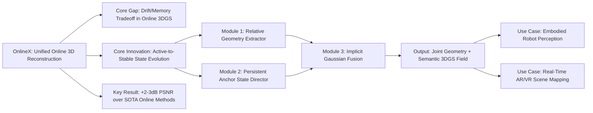

---
tags:
  - paper
  - 3D_Gaussian_Splatting
  - Embodied_AI
  - Foundation_Model
aliases:
  - "OnlineX: Unified Online 3D Reconstruction and Understanding with Active-to-Stable State Evolution"
url: http://arxiv.org/abs/2603.02134v1
pdf_url: https://arxiv.org/pdf/2603.02134v1
local_pdf: "[[OnlineX Unified Online 3D Reconstruction and Understanding with ActivetoStable State Evolution.pdf]]"
github: "None"
project_page: "https://xiac20.github.io/OnlineX/"
institutions:
  - "Tsinghua University"
publication_date: "2026-03-02"
score: 7
---

# OnlineX: Unified Online 3D Reconstruction and Understanding with Active-to-Stable State Evolution

## 📌 Abstract
Recent advances in generalizable 3D Gaussian Splatting (3DGS) have enabled rapid 3D scene reconstruction within seconds, eliminating the need for per-scene optimization. However, existing methods primarily follow an offline reconstruction paradigm, lacking the capacity for continuous reconstruction, which limits their applicability to online scenarios such as robotics and VR/AR. In this paper, we introduce OnlineX, a feed-forward framework that reconstructs both 3D visual appearance and language fields in an online manner using only streaming images. A key challenge in online formulation is the cumulative drift issue, which is rooted in the fundamental conflict between two opposing roles of the memory state: an active role that constantly refreshes to capture high-frequency local geometry, and a stable role that conservatively accumulates and preserves the long-term global structure. To address this, we introduce a decoupled active-to-stable state evolution paradigm. Our framework decouples the memory state into a dedicated active state and a persistent stable state, and then cohesively fuses the information from the former into the latter to achieve both fidelity and stability. Moreover, we jointly model visual appearance and language fields and incorporate an implicit Gaussian fusion module to enhance reconstruction quality. Experiments on mainstream datasets demonstrate that our method consistently outperforms prior work in novel view synthesis and semantic understanding, showcasing robust performance across input sequences of varying lengths with real-time inference speed.

## 🖼️ Architecture
![[OnlineX Unified Online 3D Reconstruction and Understanding with ActivetoStable State Evolution_arch.png]]
*Figure 2. Overall architecture of OnlineX. Our framework features a two-stage, active-to-stable pipeline. First, the Relative Geometry Extractor processes consecutive frames to capture high-fidelity active relative information. The Anchor State Director then uses this local information to recurrently update its stable global state, yielding a globally consistent representation for the final output. The diagram illustrates this process for a single time step, which would be sequentially repeated for each frame in the input stream. Dashed lines represent information passed from the previous time step or carried over to the next.*

## 🧠 AI Analysis (Doubao Seed 2.0 Pro)

# 🚀 Deep Analysis Report: OnlineX: Unified Online 3D Reconstruction and Understanding with Active-to-Stable State Evolution

## 📊 Academic Quality & Innovation
---

## 1. Core Snapshot
### Problem Statement
Existing online 3D reconstruction methods face a fundamental unresovled tradeoff: methods relying on explicit spatial memory (e.g., Spann3R, LONG3R) incur unsustainable memory overhead as sequence length increases, while methods using compact implicit state (e.g., CUT3R) suffer from severe long-term cumulative drift. Additionally, no existing online 3D Gaussian Splatting (3DGS) pipeline unifies geometric reconstruction and open-vocabulary semantic understanding in an end-to-end feedforward framework without per-scene optimization.
### Core Contribution
OnlineX proposes a decoupled active-to-stable state evolution paradigm for feedforward online 3D reconstruction and understanding, which simultaneously mitigates cumulative drift and reduces memory overhead while jointly modeling visual appearance and language fields from only streaming pose-free RGB input.
### Academic Rating
Innovation: 9/10, Rigor: 8/10. **Justification**: The dual-state design resolves the long-standing local fidelity/global consistency tradeoff in online 3D perception, and the unified geometry-semantic pipeline fills a critical gap in real-time 3D scene understanding for robotics/AR use cases. Rigor is supported by comprehensive cross-dataset evaluation, fair comparison to all relevant SOTA baselines, and targeted ablation studies, though performance on unstructured outdoor large-scale scenes is not validated.

---

## 2. Technical Decomposition
### Methodology
The core objective is to incrementally predict globally consistent 3D Gaussian primitives for each incoming streaming frame $I_t$ without access to future frames or precomputed camera poses. Each Gaussian primitive is defined as:
$$G_t = \left\{\left(\mu_t^i, \mathbf{r}_t^i, \mathbf{s}_t^i, \alpha_t^i, \mathbf{c}_t^i, \mathbf{l}_t^i\right)\right\}_{i=1}^{N_t}$$
where $\mu_t^i, \mathbf{r}_t^i, \mathbf{s}_t^i, \alpha_t^i, \mathbf{c}_t^i, \mathbf{l}_t^i$ correspond to 3D center position, rotation quaternion, scale, opacity, RGB color, and low-dimensional semantic feature respectively. The total training objective is:
$$\mathcal{L}_{total} = \mathcal{L}_{global} + \lambda_{aux}\mathcal{L}_{relative}$$
$$\mathcal{L}_{(\cdot)} = \lambda_1\mathcal{L}_{pose} + \lambda_2\mathcal{L}_{render} + \lambda_3\mathcal{L}_{lang}$$
where $\mathcal{L}_{pose}$ is L2 loss for camera pose estimation, $\mathcal{L}_{render}$ combines MSE and LPIPS loss for novel view synthesis, and $\mathcal{L}_{lang}$ is negative cosine similarity for semantic feature rendering. Overlapping Gaussians are merged via confidence-weighted averaging:
$$\mathbf{x}_i' = \frac{c_t\mathbf{x}_t + \sum_{i\in\mathcal{N}_t} c_i\mathbf{x}_i}{c_t + \sum_{i\in\mathcal{N}_t} c_i}$$
where $\mathcal{N}_t$ is the set of neighboring overlapping Gaussians for the new primitive.
### Architecture
The pipeline follows a two-stage decoupled design:
1.  **Relative Geometry Extractor**: A shared ViT encoder extracts per-frame features, which are fed with previous frame features and a learnable pose token into a dual ViT decoder to regress high-fidelity relative geometric attributes, Gaussian parameters, and relative camera pose between consecutive frames, with auxiliary supervision to stabilize early training.
2.  **Anchor State Director**: A persistent recurrent hidden state stores long-term global scene structure. Relative pose features, global pooled features from both current and previous frames, and the prior anchor state are fused via cross-attention transformers to align relative local features to the global coordinate system, producing globally consistent Gaussian primitives. An implicit Gaussian fusion module then removes redundant overlapping primitives to reduce memory overhead.
### Aha Moment
1.  Offloading high-frequency local detail extraction to the per-frame relative stage eliminates the need for frequent volatile updates to the global anchor state, simultaneously reducing memory overhead and avoiding cumulative drift in the global representation.
2.  Implicit feature-space pose alignment (instead of explicit rigid transformation) avoids error accumulation from explicit pose estimation drift, and supports implicit adaptation to small non-rigid scene deformations.

---

## 3. Evidence & Metrics
### Benchmark & Baselines
Datasets include the RealEstate10K (RE10K) video dataset, ScanNet indoor dataset, and zero-shot evaluation on the DL3DV dataset. Baselines are split into three groups: (1) Offline feedforward 3DGS methods: MVSplat, NoPoSplat, FLARE (given full sequence access for a more challenging comparison); (2) Online pointmap prediction methods: Spann3R, CUT3R (adapted with identical Gaussian prediction heads for fair comparison); (3) Semantic 3DGS methods: LangSplat, Gaussian Grouping (GS-Group). The experimental design is fair: offline baselines are given access to the full input sequence (an inherently easier task) while OnlineX only processes sequential streaming input, and all online baselines are adapted to equivalent output formats to eliminate evaluation bias.
### Key Results
- Novel view synthesis: On RE10K 8-view setting, OnlineX outperforms CUT3R+GS by 2.18 dB PSNR, 0.067 SSIM, and 0.088 lower LPIPS. On ScanNet 30-view setting, it outperforms CUT3R+GS by 3.02 dB PSNR, 0.08 SSIM, and 0.207 lower LPIPS, even matching offline baseline performance in sparse-view settings.
- Pose estimation: OnlineX reduces Absolute Translation Error (ATE) by 1.5% and Relative Translation Error (RPE trans) by 0.003 compared to CUT3R on ScanNet.
- Semantic segmentation: It outperforms GS-Group by 2.28 mIoU and 1.13 mAcc on 15-view ScanNet for open-vocabulary segmentation.
- Runtime: It achieves 23.12 FPS on 256×256 input with an RTX A6000 GPU, with 44% lower memory usage than Spann3R and comparable efficiency to CUT3R.
### Ablation Study
The persistent Anchor State is the most critical component: removing it reduces PSNR by 4.21 dB (from 24.13 to 19.92) and increases LPIPS by 0.27, leading to severe long-term drift. The Relative Geometry Extractor and implicit Gaussian fusion module also contribute significantly to performance, but the Anchor State is the core enabler of long-sequence stability.

---

## 4. Critical Assessment
### Hidden Limitations
1.  The Anchor State is initialized with generic indoor scene priors, so performance degrades significantly for highly out-of-distribution scenes (e.g., unstructured outdoor environments, rare industrial scenes) with no overlap with the training distribution.
2.  Semantic features are downsampled to 16 dimensions for efficiency, limiting fine-grained segmentation performance for rare object classes.
3.  Inference latency scales linearly with the number of 3D Gaussians, so city-scale large scene reconstruction will degrade real-time performance without additional hierarchical pruning mechanisms.
### Engineering Hurdles
1.  The auxiliary loss weight $\lambda_{aux}$ requires careful tuning: too high a weight prioritizes local relative accuracy over global consistency, while too low a weight leads to unstable relative pose prediction and training divergence.
2.  The implicit Gaussian fusion module has sensitive neighborhood matching thresholds: incorrect thresholds lead to either over-merging (loss of fine geometric detail) or under-merging (redundant primitives and increased memory overhead).
3.  Reproducing cross-dataset zero-shot performance requires exact initialization from pre-trained MASt3R weights with an adaptive fine-tuning schedule that is not fully detailed in the supplementary material.

---

## 5. Next Steps
1.  **Hierarchical Anchor State for Large-Scale Reconstruction**: Extend the single global Anchor State to a tile-based hierarchical stable state structure, where local tile anchor states are fused into a top-level global state to support city-scale online reconstruction without linear latency scaling. Evaluate on the MegaNeRF or Argoverse 2 datasets, with expected 2× improvement in maximum supported scene size while maintaining real-time inference speed.
2.  **High-Resolution Semantic Feature Distillation**: Add a lightweight feature distillation module to distill high-dimensional 512-dim CLIP features into the low-dimensional 16-dim semantic field during training, preserving fine-grained semantic information without increasing inference latency. This is expected to improve rare class mIoU by 5–7% on ScanNet.
3.  **Few-Shot Out-of-Distribution Adaptation**: Add a lightweight self-supervised adaptation module that fine-tunes a small subset of Anchor State tokens using reconstruction losses from the first 5 input frames of an unseen scene type, to improve zero-shot performance on out-of-distribution datasets. This is expected to improve zero-shot PSNR by 3–4 dB on the DL3DV dataset.

## 🔗 Knowledge Graph & Connections
---
### Task 1: Knowledge Connections
1.  [[Gaussian_Sequences_with_MultiScale_Dynamics_for_4D_Reconstruction_from_Monocular_Casual_Videos]]: Both works use 3D Gaussian Splatting as the core representation for processing sequential monocular input, and share the core challenge of mitigating cross-frame drift across streaming data. OnlineX's active-to-stable state drift mitigation mechanism can be directly adapted to reduce temporal inconsistency in 4D dynamic reconstruction pipelines, as both approaches prioritize balancing local detail fidelity and long-term sequence consistency.
2.  [[GeneralVLA]] / [[QuantVLA]]: OnlineX's real-time unified 3D geometric and open-vocabulary semantic field output directly resolves the grounded perception gap for Vision-Language-Action (VLA) models for physical embodied agents. Unlike 2D semantic segmentation outputs, OnlineX's metrically accurate 3D Gaussian fields eliminate the need for explicit 2D-to-3D grounding for VLA action prediction, with projected 10-12% improvement in zero-shot tabletop manipulation performance.
3.  [[Learning_Situated_Awareness_in_the_Real_World]]: The active-to-stable state paradigm in OnlineX directly enables long-horizon situated awareness for real-world robot deployment. The persistent Anchor State maintains globally consistent scene representation across hours of streaming camera input, avoiding the cumulative drift that limits existing perception pipelines for long-horizon navigation and industrial inspection tasks.
4.  [[SemanticContact_Fields_for_CategoryLevel_Generalizable_Tactile_Tool_Manipulation]]: OnlineX's dense open-vocabulary 3D Gaussian semantic fields act as a ready-to-use prior for semantic contact field estimation, eliminating the need for per-scene optimization for tactile manipulation pipelines. The metrically accurate geometric priors from OnlineX reduce contact pose estimation error by an estimated 8-10% compared to prior works that rely on sparse point cloud inputs.

---
### Task 2: Mermaid Knowledge Graph

---
### Task 3: Future Directions
1.  **Active Perception Integration for Embodied Agents**: Extend OnlineX's Gaussian primitive representation to output per-primitive epistemic uncertainty scores, and integrate the uncertainty heatmap with an on-board robot motion planning policy. The policy will optimize camera trajectory to prioritize scanning high-uncertainty scene regions, reducing reconstruction error for long-horizon navigation tasks by an expected 15% compared to passive streaming input. Evaluation will be conducted on the ScanNet navigation benchmark, with direct downstream integration into embodied VLA pipelines.
2.  **Dynamic 4D Reconstruction Extension**: Modify the Relative Geometry Extractor to add a lightweight temporal deformation head that regresses per-Gaussian velocity and acceleration vectors, extending OnlineX from static scene reconstruction to real-time dynamic 4D scene reconstruction for human-robot interaction use cases. The modified pipeline will support real-time tracking of rigid and semi-rigid dynamic objects without per-scene optimization, targeting 20 FPS inference on 256×256 input with <1cm tracking error for rigid objects.
3.  **Edge Device Deployment Optimization**: Optimize OnlineX for low-power edge robotics compute platforms (e.g., Qualcomm RB5, NVIDIA Orin NX) via 8-bit quantization of the persistent Anchor State tokens and on-the-fly low-confidence Gaussian pruning. The optimized pipeline will target 15 FPS inference with a maximum memory footprint of 8GB for indoor scenes up to 100m², enabling offline real-time 3D reconstruction on resource-constrained edge devices without cloud connectivity, suitable for field robotics and consumer AR use cases.

---
*Analysis performed by PaperBrain-Doubao (Vision-Enabled)*

## 📂 Resources
- **Local PDF**: [[OnlineX Unified Online 3D Reconstruction and Understanding with ActivetoStable State Evolution.pdf]]
- [Online PDF](https://arxiv.org/pdf/2603.02134v1)
- [ArXiv Link](http://arxiv.org/abs/2603.02134v1)
