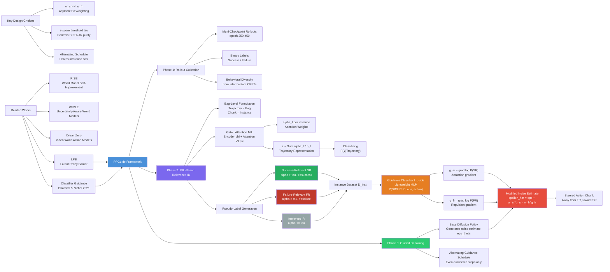

---
tags:
  - paper
  - Robot_Manipulation
  - Diffusion_Model
  - Embodied_AI
aliases:
  - "PPGuide: Steering Diffusion Policies with Performance Predictive Guidance"
url: http://arxiv.org/abs/2603.10980v1
pdf_url: https://arxiv.org/pdf/2603.10980v1
local_pdf: "[[PPGuide Steering Diffusion Policies with Performance Predictive Guidance.pdf]]"
github: "None"
project_page: "None"
institutions:
  - "Purdue University"
  - "Mitsubishi Electric Research Laboratories"
publication_date: "2026-03-11"
score: 7
---

# PPGuide: Steering Diffusion Policies with Performance Predictive Guidance

## 📌 Abstract
Diffusion policies have shown to be very efficient at learning complex, multi-modal behaviors for robotic manipulation. However, errors in generated action sequences can compound over time which can potentially lead to failure. Some approaches mitigate this by augmenting datasets with expert demonstrations or learning predictive world models which might be computationally expensive. We introduce Performance Predictive Guidance (PPGuide), a lightweight, classifier-based framework that steers a pre-trained diffusion policy away from failure modes at inference time. PPGuide makes use of a novel self-supervised process: it uses attention-based multiple instance learning to automatically estimate which observation-action chunks from the policy's rollouts are relevant to success or failure. We then train a performance predictor on this self-labeled data. During inference, this predictor provides a real-time gradient to guide the policy toward more robust actions. We validated our proposed PPGuide across a diverse set of tasks from the Robomimic and MimicGen benchmarks, demonstrating consistent improvements in performance.

## 🖼️ Architecture
![[PPGuide Steering Diffusion Policies with Performance Predictive Guidance_arch.png]]

## 🧠 AI Analysis

# 🚀 Deep Analysis Report: PPGuide: Steering Diffusion Policies with Performance Predictive Guidance

## 📊 Academic Quality & Innovation
---

# PPGuide: Steering Diffusion Policies with Performance Predictive Guidance — Deep Engineering Analysis

---

## 1. Core Snapshot

### Problem Statement

Diffusion policies learn multi-modal action distributions from demonstrations and are effective for complex robotic manipulation. However, the stochastic nature of the underlying generative model introduces compounding errors over long horizons: small deviations in generated action chunks accumulate, leading to task failure. Existing remedies either require expensive data collection (DAgger, DART), dense reward signals (RL fine-tuning), or full world models (predictive steering), all of which impose significant engineering costs and are difficult to deploy in low-data regimes. The central gap is: **how can one improve inference-time robustness of a pre-trained diffusion policy using only sparse, binary trajectory-level success/failure labels, without retraining the policy or requiring dense rewards?**

### Core Contribution

PPGuide introduces a self-supervised, two-stage pipeline that (1) applies attention-based Multiple Instance Learning (MIL) to automatically assign pseudo-labels identifying which observation-action chunks within a trajectory are most predictive of success or failure, and (2) trains a lightweight guidance classifier on these pseudo-labels whose gradients are injected into the diffusion denoising process at inference time to steer action generation away from failure modes.

### Academic Rating

- **Innovation: 7/10** — The key novelty is the combination of MIL-based temporal credit assignment with classifier-guided diffusion sampling in a self-supervised loop. Neither component is individually novel (MIL is well-established; classifier guidance dates to Dhariwal & Nichol, 2021), but their specific coupling to solve the temporal credit assignment problem in robotic trajectories is non-trivial and practically motivated.
- **Rigor: 6/10** — Experiments cover 8 tasks across two benchmarks (Robomimic, MimicGen) with multiple baselines and ablations. However, the hyperparameter search is explicitly acknowledged as non-exhaustive, statistical significance is not reported (no standard deviations or confidence intervals in the main table), and the z-score threshold sensitivity analysis is limited to a single task.

---

## 2. Technical Decomposition

### Algorithmic Logic: Step-by-Step Flow

**Phase 0 — Base Policy and Rollout Collection**

The starting point is a pre-trained diffusion policy $\pi_\theta$ that maps a history of $T_o$ observations $\mathbf{OS}_t^{T_o} = \{o_{t-T_o+1}, \ldots, o_t\}$ to a chunk of $T_p$ future actions $\mathbf{AS}_t^{T_p} = \{a_t, \ldots, a_{t+T_p-1}\}$. To collect diverse training data, the authors roll out $\pi_\theta$ at multiple intermediate training checkpoints (epochs 250, 300, 350, 400, 450), aggregating the resulting trajectories. Each trajectory is labeled with a binary outcome $Y \in \{\text{success}, \text{failure}\}$. This multi-checkpoint strategy is critical: it captures a wide behavioral spectrum, from near-random to near-proficient, providing informative coverage of failure modes.

*Intuition*: A policy trained only at convergence generates predominantly successful or predominantly failed trajectories, giving little signal about which actions cause failure. Intermediate checkpoints provide the behavioral diversity needed for the MIL model to contrast success vs. failure.

---

**Phase 1 — MIL-Based Relevance Identification (Offline)**

The trajectory is treated as a **bag** in the MIL sense. A complete trajectory $\mathscr{T} = \{(os_0^j, as_0^k), (os_1^j, as_1^k), \ldots, (os_{N-1}^j, as_{N-1}^k)\}$ is a bag, and each observation-action chunk pair $(os_t^j, as_t^k)$ is an **instance**. The bag label is the trajectory outcome $Y$.

**Step 1.1 — Instance Encoding**: Each instance $(os_t^j, as_t^k)$ is passed through an encoder $\phi$ (a multi-layer perceptron) to produce a low-dimensional embedding:
$$h_t = \phi(os_t^j, as_t^k)$$

**Step 1.2 — Gated Attention Weighting**: The attention mechanism computes a scalar weight $\alpha_t$ for each instance:
$$\alpha_t = \frac{\exp\!\left(w^\top \left(\tanh(Vh_t^\top) \odot \operatorname{sigm}(Uh_t^\top)\right)\right)}{\sum_{j=0}^{N-1} \exp\!\left(w^\top \left(\tanh(Vh_j^\top) \odot \operatorname{sigm}(Uh_j^\top)\right)\right)}$$

where $V$, $U$, and $w$ are learnable weight matrices. The element-wise product of $\tanh$ and sigmoid gates constitutes a **gated attention** formulation, which provides richer representational capacity than a standard softmax attention by allowing the network to suppress uninformative dimensions.

**Step 1.3 — Bag-Level Aggregation and Classification**: The trajectory-level representation $z$ is a weighted sum of instance embeddings:
$$z = \sum_{t=0}^{N-1} \alpha_t h_t$$

A classifier $g$ then predicts the bag label: $P(Y|\mathscr{T}) = g(z)$. The entire model ($\phi$, attention parameters $V, U, w$, and $g$) is trained end-to-end with binary cross-entropy against trajectory labels $Y$.

**Step 1.4 — Pseudo-Label Generation**: After training, the MIL model performs a forward pass over all rollout trajectories and computes $\{\alpha_t\}_{t=0}^{N-1}$ for each. Instances are partitioned into three classes using z-score thresholding at $\tau$:

- **Success-Relevant (SR)**: $(os_t^j, as_t^k)$ from a *successful* trajectory with $\alpha_t > \tau$
- **Failure-Relevant (FR)**: $(os_t^j, as_t^k)$ from a *failed* trajectory with $\alpha_t > \tau$
- **Irrelevant (IR)**: All other instances with $\alpha_t \leq \tau$, regardless of trajectory outcome

These three sets are unioned to form the labeled instance dataset $\mathscr{D}_{inst} = \mathscr{D}_{SR} \cup \mathscr{D}_{FR} \cup \mathscr{D}_{IR}$.

*Intuition*: The MIL attention mechanism solves the temporal credit assignment problem without requiring step-level annotations. The model learns, from trajectory-level supervision only, to upweight the specific moments that drive success or failure.

---

**Phase 2 — Guidance Classifier Training (Offline)**

A supervised classifier $f_{guide}$ is trained on $\mathscr{D}_{inst}$ using standard multi-class cross-entropy. Its input is a single observation-action chunk pair $(os_t^j, as_t^k)$ and its output is a probability distribution over $\{$SR, FR, IR$\}$. This classifier is lightweight by design (small MLP) because its primary function at inference time is to provide gradient signals, not autonomous decision-making.

---

**Phase 3 — Guided Action Denoising (Inference)**

The standard diffusion policy generates $as_t^K$ by iteratively denoising from Gaussian noise $as_t^K \sim \mathcal{N}(0, I)$ over $K$ steps. At each denoising step $k$, the policy predicts the noise $\varepsilon_\theta(as_t^k, k, os_t^j)$ added to the clean action.

PPGuide modifies the noise estimate by injecting gradients from $f_{guide}$:

$$g_{sr}(as_t^k, os_t^j) = \nabla_{as_t^k} \log P_{f_{guide}}(y = \text{SR} \mid os_t^j, as_t^k) \tag{3}$$

$$g_{fr}(as_t^k, os_t^j) = \nabla_{as_t^k} \log P_{f_{guide}}(y = \text{FR} \mid os_t^j, as_t^k) \tag{4}$$

The modified noise estimate is:
$$\hat{\varepsilon}_\theta(as_t^k, k, os_t^j) = \varepsilon_\theta(as_t^k, k, os_t^j) + w_{sr} \cdot g_{sc}(as_t^k, os_t^j) - w_{fc} \cdot g_{fr}(as_t^k, os_t^j) \tag{5}$$

where $w_{sr}$ and $w_{fr}$ are scalar hyperparameters controlling attraction toward SR actions and repulsion from FR actions, respectively. The paper explicitly notes $w_{sr} \ll w_{fr}$, motivated by the observation that failure modes are diverse and general (warranting strong repulsion), while SR patterns are sparse and context-specific (warranting weaker, selective attraction).

**Alternating Guidance Schedule**: Instead of applying guidance at every denoising step (which doubles forward passes through $f_{guide}$), PPGuide applies correction only at even-numbered denoising steps. This halves the inference overhead while achieving nearly the same performance as constant guidance (PPGuide-CG), as validated empirically.

---

### Mathematical Formulation Summary

| Equation | Variables | Physical Meaning |
|---|---|---|
| Eq. (1): $\alpha_t$ | $V, U, w$: weight matrices; $h_t$: instance embedding; $\odot$: element-wise product | Assigns importance weight to each action chunk; higher weight = more causal for trajectory outcome |
| Eq. (2): $z$ | $\alpha_t$: attention weight; $h_t$: embedding | Aggregates trajectory into a single vector weighted by causal importance |
| Eq. (3): $g_{sr}$ | $P_{f_{guide}}$: classifier prob; $as_t^k$: noisy action at step $k$; $os_t^j$: observation | Gradient pointing toward actions more likely to be success-relevant |
| Eq. (4): $g_{fr}$ | Same as above | Gradient pointing toward actions more likely to be failure-relevant (used with negative sign) |
| Eq. (5): $\hat{\varepsilon}_\theta$ | $\varepsilon_\theta$: base noise estimate; $w_{sr}, w_{fr}$: guidance scales | Steered noise estimate that biases sampling toward SR and away from FR regions |

---

### Tensor Flow & Architecture

```
Rollout Trajectory (N timesteps)
  ↓
Each (os_t^j [B, T_o * obs_dim], as_t^k [B, T_p * act_dim])
  → Concatenate → MLP Encoder φ → h_t [B, d_embed]
  → Gated Attention (V, U, w matrices) → α_t [B, 1] (scalar per instance)
  → Weighted Sum → z [B, d_embed]
  → Linear Classifier g → P(Y|T) [B, 2]  (success/failure)

Post-training pseudo-labeling:
  α_t compared to z-score threshold τ
  → SR/FR/IR label per instance → D_inst

Guidance Classifier f_guide:
  (os_t^j, as_t^k) → MLP → P(SR/FR/IR) [B, 3]

Inference-time denoising:
  as_t^K ~ N(0, I) [B, T_p * act_dim]
  For k = K, ..., 1:
    ε_θ = DiffusionPolicy(as_t^k, k, os_t^j)   [B, T_p * act_dim]
    if k is even (alternating schedule):
      g_sr = ∇_{as_t^k} log P_f_guide(SR | obs, as_t^k)  [B, T_p * act_dim]
      g_fr = ∇_{as_t^k} log P_f_guide(FR | obs, as_t^k)  [B, T_p * act_dim]
      ε̂_θ = ε_θ + w_sr * g_sr - w_fr * g_fr
    as_t^{k-1} = Denoise(as_t^k, ε̂_θ)
  → Output: as_t^0 [B, T_p * act_dim]
```

**Key Architectural Choices**:
- The encoder $\phi$ is an MLP (not a Transformer), keeping the classifier lightweight and suitable for real-time gradient computation.
- Gated attention (product of $\tanh$ and $\operatorname{sigm}$ branches) is used over standard softmax attention because it allows the network to selectively suppress individual feature dimensions, providing better discriminative capacity for identifying critical moments.
- The guidance classifier $f_{guide}$ is separate from the MIL model, allowing it to be trained on clean pseudo-labeled data without the training instabilities of end-to-end MIL optimization.

---

### Innovation Logic

Prior inference-time steering methods such as **ITPS** (reward-guided denoising, [12,13]) and **LPB** (latent policy barrier, [17]) require either dense reward signals or a trained dynamics/world model to predict future states. PPGuide avoids both requirements by reframing the guidance problem as an instance-level classification task derived entirely from historical rollout data and binary outcomes. Structurally, unlike LPB which operates on predicted future observations to detect out-of-distribution states, PPGuide directly classifies the **current action chunk** as SR, FR, or IR, producing a gradient without any forward simulation. The MIL formulation is specifically chosen over simple reward-weighted regression or step-level labeling because it gracefully handles the temporal credit assignment problem: only trajectory-level labels are needed, and the attention mechanism learns internally which timesteps matter.

---

## 3. Evidence & Metrics

### Benchmarks & Baselines

Experiments span **8 tasks** from **Robomimic** [23] and **MimicGen** [38]: Stack D1, Stack Three D1, Coffee D2, Coffee Prep. D1, Kitchen D1, Mug Cleanup D1, Square, and Transport. Tasks vary across three challenge dimensions: long-horizon reasoning, precision requirements, and articulated object manipulation (Table I). All experiments use only **10% of available demonstrations**, simulating a realistic low-data regime.

**Baselines**:
1. **DP** — Standard Diffusion Policy (the base policy, no guidance)
2. **DP-SS** — Diffusion Policy with stochastic sampling via Markov chain Monte Carlo
3. **PPGuide-SS** — PPGuide with stochastic sampling (4 sampling steps, following ITPS/DynaGuide)
4. **PPGuide-CG** — PPGuide with constant guidance (guidance applied every denoising step)
5. **PPGuide** — PPGuide with alternating guidance schedule

The comparison is reasonably fair: all methods operate on the same base policy and the same rollout data. However, the paper acknowledges that hyperparameters ($w_{sr}$, $w_{fr}$, $\tau$) were selected via non-exhaustive grid search, which could inflate reported numbers if the search space was large.

### Key Results (Table II, Policy Epoch 500 and 550)

| Task | DP Baseline | PPGuide Best | Gain |
|---|---|---|---|
| Stack D1 | 92% | 94% | +2% |
| Stack Three D1 | 28–30% | 32–34% | +4–6% |
| Coffee D2 | 46–54% | 56–60% | +4–14% |
| Coffee Prep. D1 | 16–18% | 20–24% | +4–8% |
| Kitchen D1 | 40–52% | 44–52% | +0–4% |
| Mug Cleanup D1 | 26% | 30–36% | +4–10% |
| Square | 58–62% | 68–72% | +8–10% |
| Transport | 60–68% | 68–76% | +8% |

Gains are consistent across all 8 tasks, most pronounced in long-horizon and precision tasks (Square: +10%, Transport: +8%, Mug Cleanup: +10%). The heterogeneous evaluation (Table III), where PPGuide trained on early checkpoints (250–450 epochs) guides significantly more advanced policies (1300–1600 epochs), demonstrates that the guidance model generalizes beyond the specific policy weights it was trained with — a practically important property.

**DP-SS consistently performs worse than base DP** in most tasks, confirming that stochastic sampling destabilizes the denoising process in this setting. This effectively eliminates stochastic sampling as a viable inference-time improvement strategy for these tasks.

### Ablation Study

The comparison between PPGuide-CG and PPGuide reveals that the **alternating guidance schedule** loses negligible performance (<2% in most tasks) while halving guidance inference calls. This validates the design choice empirically. The z-score sensitivity analysis (Figure 6) shows that performance peaks at $\tau = 2.0$ on Coffee D2 and degrades monotonically above and below, confirming that the threshold is a sensitive hyperparameter. The guidance strength analysis (Figure 5) shows a consistent inverted-U curve as expected from classifier guidance literature.

The most critical component is the **MIL-based pseudo-labeling**. Without it, the classifier would need manual temporal labels, which is infeasible. The second most critical is the **FR repulsion** ($w_{fr} \gg w_{sr}$), as the paper argues failure modes are more diverse and thus more impactful to repel than success modes are to attract.

---

## 4. Critical Assessment

### Hidden Limitations

**Cold-start dependency**: If the base policy succeeds rarely (e.g., <5% success rate at early checkpoints), the dataset $\mathscr{D}_{SR}$ will be severely under-populated. The MIL model cannot learn meaningful success-relevant patterns from a near-empty positive class. The paper acknowledges this but provides no systematic mitigation strategy — in practice, one would need to engineer an exploration mechanism to collect at least some successes.

**Spurious correlation risk**: The MIL model is trained on rollout data from policy checkpoints. If there exists an observation feature that is correlated with success but causally irrelevant (e.g., camera angle, lighting consistency at the end of a trajectory because successful ones are longer), the attention mechanism may assign high weights to this feature. The z-score thresholding does not filter such spurious correlations, potentially leading the guidance classifier to steer toward visually irrelevant features.

**Temporal granularity mismatch**: The method labels entire observation-action *chunks* (of length $k$) as SR or FR. If the causal failure event occurs at a sub-chunk timescale (e.g., a single gripper action within a chunk), the pseudo-label is necessarily noisy. This is inherent to the chunk-based diffusion policy formulation but limits the precision of guidance.

**Scalability to continuous success distributions**: The binary success/failure label is a strong simplification. Tasks with partial success (e.g., "moved 3 of 5 objects correctly") cannot be directly handled without extension of the framework.

**Sensitivity to z-score threshold $\tau$**: The threshold controls the class balance between SR/FR and IR instances. As shown in Figure 6, performance varies substantially (0.48 to 0.56 on Coffee D2) across a narrow range of $\tau$ values (1.5–2.25). This requires per-task tuning, which may require additional rollout evaluation and diminishes the "plug-and-play" appeal of the method.

### Engineering Hurdles for Reproduction

**Checkpoint management**: The method requires saving rollouts from 5 specific intermediate training checkpoints (epochs 250–450). This presupposes access to the training process and disk space for storing all checkpoint rollouts. Practitioners using publicly available pre-trained models only would not have access to these intermediate checkpoints, requiring re-training the base policy from scratch.

**Hyperparameter sensitivity ($w_{sr}$, $w_{fr}$, $\tau$)**: Three interacting hyperparameters require task-specific tuning. The paper reports "best results from a limited grid search," meaning reproductions must replicate this search. The interaction between $w_{sr}$ and $w_{fr}$ (the asymmetry $w_{sr} \ll w_{fr}$) is stated as a design principle but not ablated quantitatively, leaving practitioners without principled guidance on the exact ratio.

**MIL training instability**: End-to-end attention-based MIL models can exhibit training instability, particularly with class-imbalanced datasets. The IR class outnumbers SR and FR by more than 10-fold (stated in the paper), requiring careful class weighting or balanced sampling strategies during MIL training — details not fully specified.

**Gradient computation overhead**: At each even-numbered denoising step, PPGuide requires a forward pass through $f_{guide}$ followed by backpropagation to compute $g_{sr}$ and $g_{fr}$ with respect to $as_t^k$. If the diffusion policy uses a large backbone (e.g., a vision Transformer), the action tensor $as_t^k$ is embedded in a computation graph that may require gradient checkpointing or careful memory management, especially for batch inference. The paper does not report wall-clock inference time comparisons.

**No public code**: The absence of a public repository means all architectural details (MLP layer sizes, learning rates, training schedules for both the MIL model and $f_{guide}$) must be inferred from the paper's relatively brief method section, creating significant reproduction friction.

## 🔗 Knowledge Graph & Connections
## Task 1: Differential Analysis & Connections

### Connection 1: PPGuide vs. [[RISE]]

Both PPGuide and [[RISE]] address the same fundamental problem — compounding execution errors in pre-trained robot policies — but from structurally opposite architectural philosophies.

**[[RISE]]** builds a **Compositional World Model** that explicitly predicts future multi-view visual states and evaluates them with a progress value model. This world model is central to its self-improvement loop: imagined rollouts are scored, and policy gradients flow through predicted future states. The approach is powerful but architecturally heavy — it requires training both a controllable dynamics model and a separate value model, with closed-loop imagination rollouts.

**PPGuide** explicitly rejects the world model requirement. Rather than predicting *where actions will lead*, PPGuide classifies *what actions look like* relative to historical success/failure patterns. The key differential is **causal directionality**: RISE steers based on predicted future outcomes (forward-looking), while PPGuide steers based on learned action relevance patterns (pattern-matching against the past). PPGuide's approach is computationally cheaper at inference time — a single forward pass through a small MLP classifier plus one backpropagation step — compared to RISE's iterative imagination rollouts through a video diffusion model. However, PPGuide cannot generalize to genuinely novel failure modes that differ from those observed in training rollouts, whereas RISE's world model can, in principle, anticipate unseen failure trajectories by simulating forward.

**Critical Difference**: RISE requires on-policy imagination infrastructure and multi-view video prediction capability; PPGuide requires only binary trajectory labels and a pre-trained diffusion policy. PPGuide is strictly more lightweight and deployment-friendly, but RISE is likely more capable when sufficient compute and data are available for world model training.

---

### Connection 2: PPGuide vs. [[WIMLE]]

Both papers grapple with the problem of **compounding model errors** in sequential decision-making, but they operate in entirely different paradigms (imitation learning with diffusion policies vs. model-based RL).

[[WIMLE]] addresses compounding error by building **multi-modal, uncertainty-aware world models** using IMLE (Implicit Maximum Likelihood Estimation), weighting synthetic transitions by predicted confidence to attenuate biased rollouts. Its core insight is that unimodal world models average over multi-modal dynamics, producing misleading gradients, and that uncertainty quantification during synthetic rollout generation is essential for stable learning.

PPGuide faces an analogous multi-modality problem: diffusion policies generate multi-modal action distributions, and failure modes can arise from any of several distinct behavioral modes. However, PPGuide does not model uncertainty in the classical Bayesian sense. Instead, it sidesteps multi-modal uncertainty by using MIL attention to identify *which* modes are failure-relevant and steering away from them during sampling. There is no explicit uncertainty estimate on the classifier's pseudo-labels.

**Critical Difference**: [[WIMLE]]'s uncertainty weighting during training directly addresses model-induced distribution shift (a training-time concern), while PPGuide's guidance addresses distribution shift at inference time. A meaningful synthesis would be to incorporate WIMLE-style confidence weighting into the PPGuide pseudo-labeling pipeline: rather than hard-thresholding attention weights at z-score $\tau$, one could weight SR/FR instances by their attention weight magnitude, producing soft pseudo-labels that reflect the MIL model's uncertainty about relevance assignment.

---

### Connection 3: PPGuide vs. [[World_Action_Models_are_Zero_shot_Policies]]

[[World_Action_Models_are_Zero_shot_Policies]] (DreamZero) jointly models video futures and actions through a video diffusion backbone, enabling zero-shot generalization to novel tasks by learning physical dynamics as a world representation. Its core claim is that **video as a world state representation** captures enough physical dynamics to generalize beyond the training distribution.

PPGuide uses no video prediction and no future state modeling. Its classifier operates on **current observation-action pairs** and is entirely retrospective — it classifies the present chunk based on learned associations from historical rollouts. DreamZero can generalize to new tasks and environments (cross-embodiment transfer from human demos), while PPGuide is explicitly trained on rollouts of a *specific* policy on a *specific* task and has no mechanism for zero-shot transfer.

**Critical Difference**: DreamZero's generalization comes at the cost of a 14B-parameter autoregressive video diffusion model running at 7Hz (real-time via significant engineering optimization). PPGuide's guidance classifier is a small MLP that adds minimal latency. These two papers represent opposite ends of the capability-efficiency frontier in inference-time policy improvement. A productive direction would be using DreamZero's video prediction outputs as richer observation features fed into PPGuide's MIL encoder, potentially enabling PPGuide's lightweight guidance framework to operate on imagined futures rather than only observed history.

---

## Task 2: Mermaid Knowledge Graph



---

## Task 3: Future Research Directions

### Direction 1: Online Continual Updating of the Guidance Classifier

**Problem**: PPGuide's guidance classifier $f_{guide}$ is trained offline on a fixed rollout dataset and is never updated during deployment. As the robot encounters distribution-shifted environments (new lighting, object textures, slight camera calibration drift), the pseudo-labels generated from the original rollouts become stale, and the guidance signal may point in incorrect directions.

**Proposed Research**: Develop an **online MIL update mechanism** where, after each deployment episode, the new trajectory (with its binary outcome) is appended to a replay buffer and the MIL model is fine-tuned in a continual learning setting. Specifically, one could use **elastic weight consolidation (EWC)** or **experience replay** to prevent catastrophic forgetting of previously learned relevance patterns while incorporating new failure modes. The z-score threshold $\tau$ could be adapted dynamically based on the running distribution of attention weights across the online dataset. This would transform PPGuide from a static offline module into a continuously self-improving guidance system, directly addressing the acknowledged limitation about environmental distribution shift.

---

### Direction 2: Hierarchical MIL for Sub-Chunk Temporal Credit Assignment

**Problem**: PPGuide assigns SR/FR labels at the **action chunk level** (typically 16–32 timesteps). If the causal failure event occurs at a single timestep within a chunk (e.g., a gripper slip during a 0.1-second window), the entire chunk receives the label, introducing significant noise into the pseudo-label dataset. This temporal granularity mismatch limits the precision of guidance.

**Proposed Research**: Design a **hierarchical MIL model** with two levels of attention: (1) a **chunk-level MIL** as in PPGuide, assigning bags (trajectories) and instances (chunks); and (2) a **token-level MIL within each chunk**, treating individual timestep actions as sub-instances within each chunk-bag. The two-level attention mechanism would produce both chunk-level relevance weights $\alpha_t$ and within-chunk timestep weights $\beta_{t,\tau}$. The guidance classifier would then operate at the finest granularity where the causal signal is strongest. This architecture draws on hierarchical MIL literature in computational pathology (e.g., patch-level and region-level attention in WSI classification) and would provide finer-grained guidance gradients while remaining trainable from only binary trajectory labels.

---

### Direction 3: Cross-Task Transfer of the Guidance Classifier via Meta-Learning

**Problem**: PPGuide trains a separate guidance classifier $f_{guide}$ for each task from scratch. In robotics deployment scenarios with many tasks (e.g., a warehouse with 50+ object manipulation tasks), this requires collecting rollouts and training a new classifier per task, which is expensive. The paper's heterogeneous evaluation (Table III) shows that a classifier trained on early-checkpoint rollouts can generalize to late-checkpoint policies, suggesting some degree of transferability — but cross-task transfer is unexplored.

**Proposed Research**: Frame $f_{guide}$ training as a **meta-learning problem** where the model is trained across multiple source tasks (e.g., all Robomimic tasks) to rapidly adapt to a new target task with minimal rollout data (e.g., 5-shot adaptation with only 5 successful and 5 failed trajectories). Using **MAML (Model-Agnostic Meta-Learning)** or **ProtoNets** adapted to the MIL setting, the meta-learner would learn a prior over relevance patterns that captures task-agnostic failure modes (e.g., dropping an object, misalignment before insertion) while allowing fast adaptation to task-specific SR/FR patterns. This would reduce the cold-start data requirement from hundreds of rollouts to tens, substantially improving the practical deployability of PPGuide in multi-task settings.


---
*Analysis performed by PaperBrain-OpenRouter (anthropic/claude-4.6-sonnet) (Vision-Enabled)*


## 🧩 Claim Cards

### Claim-01
- Claim: PPGuide improves inference-time robustness of a pre-trained diffusion policy by steering the denoising process with a Multiple Instance Learning (MIL)-based performance predictor trained solely on sparse binary success/failure labels, without retraining the base policy or requiring dense rewards.
- Evidence: The method trains a MIL attention model on rollout trajectories labeled only as success or failure, then applies its gradient as classifier guidance during DDPM denoising. Evaluated across 8 Robomimic/MimicGen tasks using only 10% of available demonstrations, PPGuide (alternating guidance schedule) consistently outperforms the unguided base policy (DP) and ablated variants (PPGuide-CG, PPGuide-SS) across tasks including Stack D1, Coffee D2, and Transport.
- Boundary/Failure: When the base policy succeeds at fewer than ~5% of rollouts, the positive-class dataset D_SR is too sparse for the MIL model to learn meaningful success-relevant features, making guidance unreliable or uninformative.
- Compared Against: Standard Diffusion Policy (DP) with no guidance; PPGuide-CG (constant guidance every step); PPGuide-SS (stochastic sampling only).
- Confidence: 7
- Links:
  - same_problem:: [[RISE]]
  - improves_over:: 待定
  - conflicts_with:: 待定

### Claim-02
- Claim: An alternating guidance schedule — applying the MIL-based gradient signal at every other denoising step rather than at every step — yields higher task success rates than constant guidance (PPGuide-CG) across the evaluated manipulation benchmarks.
- Evidence: The ablation comparing PPGuide (alternating) vs. PPGuide-CG (constant guidance every step) is reported across 8 tasks in Table I. The alternating schedule is selected as the default configuration, indicating it achieves superior or comparable performance to constant guidance while avoiding over-steering artifacts that degrade sample diversity. Hyperparameters w_sr, w_fr, and tau were tuned via non-exhaustive grid search.
- Boundary/Failure: The advantage of the alternating schedule may diminish or reverse on very short-horizon tasks where compounding denoising errors are minimal, or when the guidance signal is extremely weak (near-random MIL predictions), making the schedule choice inconsequential.
- Compared Against: PPGuide-CG (constant guidance applied at every denoising step).
- Confidence: 6
- Links:
  - same_problem:: 待定
  - improves_over:: 待定
  - conflicts_with:: 待定

### Claim-03
- Claim: PPGuide is susceptible to spurious correlation: if the MIL attention model latches onto observation features that are correlated with success but causally irrelevant (e.g., trajectory length, end-state visual consistency), the guidance gradient will steer the policy toward superficially success-like but mechanistically incorrect actions.
- Evidence: The paper explicitly acknowledges this risk in its limitations section. The MIL model is trained on rollout observations from policy checkpoints, and no causal disentanglement or data augmentation strategy is proposed to mitigate feature-level confounds. No ablation is provided that isolates or quantifies the magnitude of spurious correlation effects on final task performance.
- Boundary/Failure: This failure mode is most acute in visually rich environments where incidental features (lighting, object pose at trajectory end) differ systematically between successful and failed rollouts, and where the demonstration dataset is small (10% regime amplifies distributional artifacts).
- Compared Against: No direct baseline isolates this failure; it is an internal validity concern relative to the claimed mechanism of the MIL guidance signal.
- Confidence: 6
- Links:
  - same_problem:: 待定
  - improves_over:: 待定
  - conflicts_with:: 待定

### Claim-04
- Claim: Sparse binary trajectory-level supervision is a practically sufficient signal for inference-time guidance of diffusion policies in low-data robotic manipulation regimes, offering a lower-cost alternative to dense reward shaping, full world models, or additional demonstration collection.
- Evidence: All experiments use only 10% of available Robomimic/MimicGen demonstrations, and the only additional supervision beyond the base policy's training data is binary success/failure labels on policy rollouts — labels obtainable from simple task-completion detectors. PPGuide outperforms DP and DP-SS baselines across 8 tasks spanning long-horizon, precision, and articulated-object challenges, demonstrating that binary labels carry sufficient gradient information to reduce compounding errors at inference time.
- Boundary/Failure: The claim breaks down in domains where even binary success/failure labels are expensive or ambiguous to obtain (e.g., open-ended manipulation without clear termination criteria), or where the cold-start problem prevents accumulation of any positive-class rollouts for MIL training.
- Compared Against: DP (no guidance), DP-SS (stochastic sampling without learned guidance); implicitly compared against RL fine-tuning and DAgger which require denser supervision or additional data collection.
- Confidence: 7
- Links:
  - same_problem:: [[RISE]]
  - improves_over:: 待定
  - conflicts_with:: 待定

## 📂 Resources
- **Local PDF**: [[PPGuide Steering Diffusion Policies with Performance Predictive Guidance.pdf]]
- [Online PDF](https://arxiv.org/pdf/2603.10980v1)
- [ArXiv Link](http://arxiv.org/abs/2603.10980v1)