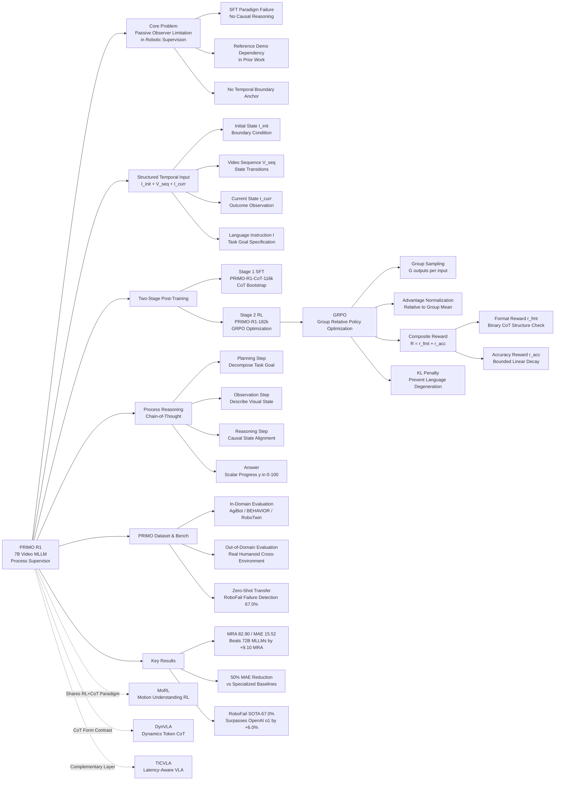

---
tags:
- paper
- domain/embodied_ai
- domain/reinforcement_learning
- domain/robot_manipulation
- impact/high_value
- method/benchmark
- method/foundation_model
- method/planning
- method/reinforcement_learning
- review/auto_tagged
- status/unread
- task/loco_manipulation
- task/manipulation
- task/planning_reasoning
- type/benchmark
aliases:
- 'From Passive Observer to Active Critic: Reinforcement Learning Elicits Process
  Reasoning for Robotic Manipulation'
url: http://arxiv.org/abs/2603.15600v1
pdf_url: https://arxiv.org/pdf/2603.15600v1
local_pdf: '[[From Passive Observer to Active Critic Reinforcement Learning Elicits
  Process Reasoning for Robotic .pdf]]'
github: None
project_page: None
institutions:
- Shanghai Jiao Tong University
- Northeastern University
- Xiamen University Malaysia
- The University of Hong Kong
- The Chinese University of Hong Kong
- Xspark AI
publication_date: '2026-03-16'
score: '8.0'
domains:
- embodied_ai
- reinforcement_learning
- robot_manipulation
methods:
- benchmark
- foundation_model
- planning
- reinforcement_learning
tasks:
- loco_manipulation
- manipulation
- planning_reasoning
paper_type: benchmark
impact_band: high_value
reading_status: unread
year: 2026
priority_score: 103
review_status: auto_tagged
next_action: inspect_protocol
arxiv_id: '2603.15600'
paper_id: arxiv:2603.15600
---

# From Passive Observer to Active Critic: Reinforcement Learning Elicits Process Reasoning for Robotic Manipulation

## 📌 Abstract
Accurate process supervision remains a critical challenge for long-horizon robotic manipulation. A primary bottleneck is that current video MLLMs, trained primarily under a Supervised Fine-Tuning (SFT) paradigm, function as passive "Observers" that recognize ongoing events rather than evaluating the current state relative to the final task goal. In this paper, we introduce PRIMO R1 (Process Reasoning Induced Monitoring), a 7B framework that transforms video MLLMs into active "Critics". We leverage outcome-based Reinforcement Learning to incentivize explicit Chain-of-Thought generation for progress estimation. Furthermore, our architecture constructs a structured temporal input by explicitly anchoring the video sequence between initial and current state images. Supported by the proposed PRIMO Dataset and Benchmark, extensive experiments across diverse in-domain environments and out-of-domain real-world humanoid scenarios demonstrate that PRIMO R1 achieves state-of-the-art performance. Quantitatively, our 7B model achieves a 50% reduction in the mean absolute error of specialized reasoning baselines, demonstrating significant relative accuracy improvements over 72B-scale general MLLMs. Furthermore, PRIMO R1 exhibits strong zero-shot generalization on difficult failure detection tasks. We establish state-of-the-art performance on RoboFail benchmark with 67.0% accuracy, surpassing closed-source models like OpenAI o1 by 6.0%.

## 🖼️ Architecture
![[From Passive Observer to Active Critic Reinforcement Learning Elicits Process Reasoning for Robotic _arch.png]]

## 🧠 AI Analysis

# 🚀 Deep Analysis Report: From Passive Observer to Active Critic: Reinforcement Learning Elicits Process Reasoning for Robotic Manipulation

## 📊 Academic Quality & Innovation
---

## 1. Core Snapshot

### Problem Statement
Dense reward signals are critical for efficient robot policy learning but are extremely difficult to obtain in real-world manipulation tasks. While VLMs/MLLMs have emerged as candidates for learning universal reward functions from visual observations, they operate predominantly as passive "Observers" trained under the Supervised Fine-Tuning (SFT) paradigm. This paradigm optimizes models to recognize and describe ongoing events rather than to measure the *causal distance* between the current state and the final task goal. The specific failure modes are threefold: (1) inability to generalize to unseen objects or environments, (2) inability to produce interpretable explanations for predictions, and (3) tendency to assign high progress scores to failed trajectories whose visual motion pattern resembles a successful one — because the model lacks explicit temporal boundary anchoring to distinguish "motion happened" from "goal was achieved."

### Core Contribution
PRIMO R1 introduces a 7B video MLLM framework that reformulates robotic task progress estimation from direct scalar regression into a multi-step generative Chain-of-Thought reasoning task, trained via Group Relative Policy Optimization (GRPO) with a bounded linear decay accuracy reward, combined with a structured temporal input that explicitly anchors the video sequence between an initial state image and a current state image to enable verifiable, self-correcting process supervision.

### Academic Rating
- **Innovation: 7/10** — The core insight — applying outcome-based RL (the "R1 paradigm") to video MLLMs for process supervision in robotics — is conceptually sound and timely. The temporal boundary anchoring strategy (prepending $I_{init}$ and appending $I_{curr}$ to the video sequence) is a simple but empirically well-validated structural fix to a known problem. However, the individual components (GRPO, CoT elicitation, structured prompting) are each borrowed from prior work; the novelty lies primarily in their combination and domain application.
- **Rigor: 7/10** — The experimental setup is generally thorough, with both in-domain and out-of-domain (cross-task, cross-environment) evaluation, a dedicated benchmark (PRIMO Bench), and ablations on key design choices. The zero-shot transfer to the RoboFail failure detection benchmark provides useful evidence of emergent generalization. Some aspects, such as the exact annotation pipeline for CoT data and the sensitivity of hyperparameters like $R_{\max}$ and group size $G$, are relegated to appendices and could be more prominently discussed.

---

## 2. Technical Decomposition

### Algorithmic Logic

**Step 1: Structured Temporal Input Construction.**
Given a robotic execution episode, the model receives a tuple $(I_{init}, V_{seq}, I_{curr}, \mathcal{I})$. The initial state image $I_{init}$ (the environment before execution) is prepended to the video frame sequence, and the current state image $I_{curr}$ (the latest observed outcome) is appended. The language instruction $\mathcal{I}$ specifies the task goal in natural language. This architectural choice is deliberate: it converts the open-ended video understanding problem into a *structured state-alignment verification* problem, where the model must reason about the transformation from $I_{init}$ to $I_{curr}$ relative to the goal $\mathcal{I}$. The intuition is that without explicit boundary anchors, a model processing a raw video stream cannot reliably determine what the environment looked like before the task started, making it impossible to measure absolute progress.

**Step 2: Two-Stage Post-Training.**
The training pipeline consists of two sequential stages:
- *Stage 1 — Supervised Fine-Tuning (SFT)*: The base model (Qwen2.5-VL-7B-Instruct) is fine-tuned on the PRIMO-R1-CoT-116k dataset, which contains 116k samples annotated with CoT reasoning paths covering task planning, visual observation, and causal reasoning steps. This stage establishes the output format and bootstraps the model's capacity to generate structured reasoning chains in the `<think>...</think><answer>...</answer>` template. Data augmentation via general video reasoning datasets (EgoPlan, NEcT-QA, ShareRobot, etc.) is incorporated to prevent domain overfitting during SFT.
- *Stage 2 — Reinforcement Learning (RL)*: The SFT-initialized model is further optimized using GRPO on the PRIMO-R1-182k RL dataset. This stage refines the reasoning quality by providing outcome-based reward signals without requiring dense intermediate annotations.

**Step 3: Group Sampling.**
For each training input tuple $x = (I_{init}, V_{seq}, I_{curr}, \mathcal{I})$, the current policy $\pi_{\theta_{old}}$ samples a group of $G$ outputs $\{o_1, o_2, \ldots, o_G\}$. Each output $o_i$ consists of a reasoning chain $\mathcal{C}_i$ enclosed in `<think>` tags followed by a scalar progress prediction $\hat{y}_i$ enclosed in `<answer>` tags. This group sampling is essential: it enables GRPO to estimate the baseline value from the group statistics rather than from a learned value network, dramatically reducing memory overhead.

**Step 4: Reward Computation.**
Each output $o_i$ receives a composite scalar reward $R(o_i, y_{gt}) = r_{\text{fmt}} + r_{\text{acc}}$, where:
- $r_{\text{fmt}}$ is a binary format reward (+1 if and only if the output strictly follows the `<think>reasoning</think><answer>prediction</answer>` pattern; 0 otherwise).
- $r_{\text{acc}}$ is a continuous accuracy reward computed via bounded linear decay (Eq. 2).

**Step 5: Advantage Normalization and Policy Update.**
The advantage $A_i$ for each output is computed by normalizing its reward against the group distribution (Eq. 1). The policy is then updated via the clipped GRPO objective (Eq. 3), which includes a KL divergence penalty against the reference policy $\pi_{\text{ref}}$ to prevent reward hacking and language degeneration.

**Why this flow over SFT-only alternatives?** SFT with scalar regression labels trains the model to correlate visual features with a target number, bypassing causal structure. RL with outcome rewards forces the model to discover *which reasoning steps* reliably predict the outcome, naturally incentivizing temporal alignment and causal analysis. The format reward prevents the degenerate solution of outputting a number directly without reasoning.

---

### Mathematical Formulation

**Advantage Estimation (Eq. 1):**
$$A_i = \frac{r_i - \text{mean}(\{r_1, \ldots, r_G\})}{\text{std}(\{r_1, \ldots, r_G\}) + \epsilon}$$
- $A_i$: Normalized advantage for the $i$-th sampled output in the group.
- $r_i$: Composite scalar reward for output $o_i$.
- $G$: Group size (number of sampled outputs per input).
- $\epsilon$: Small constant for numerical stability.
- *Physical Meaning*: Outputs with reward above the group mean receive positive advantage (reinforced); those below receive negative advantage (suppressed). This relative comparison eliminates the need for an absolute value baseline.

**Accuracy Reward (Eq. 2):**
$$r_{\text{acc}} = \max\left(0, 1 - \frac{|\hat{y}_i - y_{gt}|}{R_{\max}}\right)$$
- $\hat{y}_i$: Predicted progress score for output $o_i$, $\hat{y}_i \in [0, 100]$.
- $y_{gt}$: Ground-truth progress label.
- $R_{\max}$: Maximum error range (set to 100.0, corresponding to the full scale).
- *Physical Meaning*: The reward is 1.0 for a perfect prediction, decreases linearly to 0 as the absolute error approaches $R_{\max}$, and is clipped at 0 for errors exceeding $R_{\max}$. This provides dense, continuous feedback for continuous regression targets, which a binary success/failure reward cannot achieve.

**GRPO Objective (Eq. 3):**
$$\mathcal{L}_{\text{GRPO}}(\theta) = -\frac{1}{G}\sum_{i=1}^{G}\left[\min\left(\rho_i A_i, \text{clip}(\rho_i, 1-\epsilon, 1+\epsilon)A_i\right) - \beta \cdot \mathbb{D}_{\text{KL}}\left(\pi_\theta(o_i|x) \| \pi_{\text{ref}}(o_i|x)\right)\right]$$
- $\rho_i = \frac{\pi_\theta(o_i|x)}{\pi_{\theta_{old}}(o_i|x)}$: Probability ratio between the updated policy and the sampling policy.
- $\epsilon$: Clipping range (PPO-style trust region constraint).
- $\beta$: KL penalty coefficient controlling deviation from the reference policy.
- $\pi_{\text{ref}}$: Reference policy (frozen SFT model) used to prevent language degeneration.
- *Physical Meaning*: The clipped surrogate loss limits the per-step policy update, while the KL term ensures the reasoning language does not drift into degenerate patterns. Together, they allow the model to improve accuracy without sacrificing linguistic coherence.

**Mean Relative Accuracy (MRA, Eq. 4):**
$$\text{MRA} = \frac{1}{|\mathcal{T}|}\sum_{\tau \in \mathcal{T}} \mathbb{I}\left(\frac{|\hat{y} - y|}{|y|} < 1 - \tau\right)$$
- $\mathcal{T}$: Set of accuracy thresholds.
- $\tau$: A specific relative tolerance threshold.
- *Physical Meaning*: MRA measures what fraction of predictions fall within a relative error band of the ground truth, averaged over multiple thresholds. This is more informative than MAE alone for a continuous [0, 100] scale.

---

### Tensor Flow & Architecture

The architecture is built on Qwen2.5-VL-7B-Instruct. The key data flow is as follows:

1. **Input Assembly**: The structured input is constructed as a sequence of image tokens and text tokens. The visual component consists of: $[I_{init}$ frame tokens$]$ + $[V_{seq}$ sampled frame tokens$]$ + $[I_{curr}$ frame tokens$]$. The text component is the natural language instruction $\mathcal{I}$ embedded in a structured system prompt. The paper notes that $I_{init}$ and $I_{curr}$ are explicitly positioned as the first and last visual elements to create clear boundary anchors.

2. **Vision Encoding**: Each image/frame is processed by the Qwen2.5-VL visual encoder. The video frames in $V_{seq}$ are dynamically sampled (exact count specified in Appendix G). The encoded visual tokens are interleaved with text tokens according to the model's native multimodal template.

3. **Autoregressive Decoding**: The 7B language model backbone autoregressively generates the output sequence, first producing the reasoning chain $\mathcal{C}$ token-by-token within `<think>...</think>`, then the scalar prediction $\hat{y}$ within `<answer>...</answer>`.

4. **Key Architectural Choice**: Rather than introducing cross-attention conditioning or a separate regression head, the progress prediction is entirely formulated as a *text generation task* (generating the digits of a number like "85.7"). This is a significant design choice: it reuses the pre-trained model's language generation capacity and avoids adding new learned parameters, making the training purely about refining the reasoning behavior of the existing model.

---

### Innovation Logic

| Dimension | Prior Baselines | PRIMO R1 |
|---|---|---|
| **Training Signal** | SFT with scalar regression labels | Outcome-based RL (GRPO) with composite reward |
| **Reasoning** | Direct regression (no CoT) | Explicit CoT generation (Planning → Observation → Reasoning → Answer) |
| **Temporal Input** | Raw video clip OR single current frame OR current frame + reference demo | $I_{init}$ + $V_{seq}$ + $I_{curr}$ (explicit boundary anchoring) |
| **Reference Dependency** | VLAC, Robo-Dopamine, PROGRESSLM require pre-defined reference demonstrations | PRIMO R1 is reference-free; language instruction provides the evaluation criterion |
| **Scalability** | Typically specialized models; large models (72B) used directly without adaptation | 7B model surpasses 72B general MLLMs post-training |

The key structural departure from PROGRESSLM [37] and VLAC [35] is the elimination of reference demonstration dependency. Those methods require a successful demonstration video as a template for comparison, which is unavailable in general deployment. PRIMO R1 replaces the reference demo with the natural language task goal $\mathcal{I}$, leveraging the language generalization capabilities of foundational MLLMs. The key structural departure from SFT baselines is the optimization target: rather than minimizing $\|F(I_{init}, V_{seq}, I_{curr}, \mathcal{I}) - y_{gt}\|$, PRIMO R1 maximizes $\mathbb{E}[R(\hat{y}, y_{gt})]$ through a latent reasoning chain, forcing the model to develop interpretable intermediate representations rather than learning a direct input-output mapping.

---

## 3. Evidence & Metrics

### Benchmark & Baselines

The evaluation is structured across two primary tasks:

**Task 1 — Progress Estimation on PRIMO Bench**: Tested across three in-domain simulation environments (AgiBot World, BEHAVIOR-1k, RoboTwin) and one out-of-domain real-world environment (Leju KUAVO-MY humanoid robot in unstructured factory/service settings). Baselines include:
- General large MLLMs: GPT-4o, InternVL2.5-78B, Qwen2.5-VL-72B (zero-shot).
- Specialized progress estimation models: PROGRESSLM [37], Robo-Dopamine [30].
- SFT-only variants trained on the same data as PRIMO R1 (for fair ablation).

**Task 2 — Failure Detection on RoboFail Benchmark**: A zero-shot binary classification task (success/failure) not seen during training. Baselines include GPT-4o, OpenAI o1, Claude-3.5-Sonnet, and other VLMs.

The experimental design is largely fair: the SFT baselines use the same training data as PRIMO R1, isolating the contribution of the RL stage. The inclusion of 72B-scale general models as baselines provides a meaningful parameter-efficiency reference point.

### Key Results

- **Progress Estimation (PRIMO Bench, overall)**: PRIMO R1 (7B) achieves **MRA = 82.90** and **MAE = 15.52**, outperforming the best 72B general MLLM (Qwen2.5-VL-72B) by **+9.10 absolute MRA points** and reducing MAE by approximately 50% compared to specialized reasoning baselines.
- **Out-of-Domain (Real Humanoid)**: The model generalizes to an entirely unseen robot platform and environment, demonstrating robust cross-environment transfer.
- **Failure Detection (RoboFail, zero-shot)**: PRIMO R1 achieves **67.0% accuracy**, surpassing OpenAI o1 (61.0%) by +6.0% and GPT-4o by a larger margin, despite never being trained on failure detection data. This emergent capability is particularly noteworthy.

### Ablation Study

Table 4 (referenced in the paper) reports ablation results isolating the contribution of each input modality. The key findings are:

1. **Temporal boundary anchoring ($I_{init}$ + $I_{curr}$) is the most critical structural component**: Removing either the initial state image or the current state image causes the largest performance drop, validating the core architectural hypothesis that explicit boundary conditions are necessary for accurate progress measurement.
2. **RL stage is critical for OOD generalization**: The SFT-only model performs competitively in-domain but degrades significantly out-of-domain, while the RL-trained model maintains strong performance. This suggests that the CoT reasoning elicited by RL learns more generalizable causal representations than SFT's surface-level feature matching.
3. **Format reward is necessary**: Without $r_{\text{fmt}}$, the model frequently collapses to direct guessing (outputting only a number), which degrades both reasoning quality and accuracy.

---

## 4. Critical Assessment

### Hidden Limitations

**Latency and Real-Time Deployment**: The framework requires autoregressive generation of a full Chain-of-Thought reasoning trace (Planning → Observation → Reasoning → Answer) before producing a scalar reward signal. For a 7B model generating potentially hundreds of tokens per CoT, this introduces non-trivial inference latency that is incompatible with tight control loop frequencies required for closed-loop robotic policy learning. The paper does not report inference latency figures, which is a significant omission for a robotics-facing system.

**Temporal Sampling Sensitivity**: The video sequence $V_{seq}$ is constructed by uniformly sampling frames from the trajectory. For long-horizon tasks with sparse key events, this sampling strategy may miss or dilute critical state transitions. The model's performance on tasks with highly non-uniform event density (e.g., long idle periods followed by rapid manipulation) is not evaluated, and the sensitivity to frame sampling rate is not ablated.

**Ground-Truth Label Quality**: The progress labels $y_{gt} \in [0, 100]$ require human annotation or simulator privileged state access. The paper does not deeply analyze inter-annotator agreement or the reliability of these labels for ambiguous intermediate states, which directly affects the validity of the accuracy reward signal during RL training.

### Engineering Hurdles

- **RL Training Stability at Scale**: GRPO on video MLLMs with group size $G$ and multi-frame visual inputs multiplies GPU memory requirements by a factor of $G$ relative to standard SFT, making stable large-batch RL training on 7B video models computationally demanding; the paper does not report training wall-clock time or convergence curves.
- **CoT Annotation Bootstrap**: The SFT stage requires 116k samples annotated with structured CoT reasoning paths, implying a substantial human or model-assisted annotation pipeline whose scalability and quality control methodology are deferred to the appendix rather than treated as a first-class engineering contribution.

## 🔗 Knowledge Graph & Connections
## Task 1: Differential Analysis & Connections

### Connection 1: [[MoRL]] — Closest Structural Parallel

PRIMO R1 and [[MoRL]] share the most direct methodological parallel: both employ a two-stage SFT → RL post-training pipeline on a foundational multimodal model, use verifiable outcome-based reward functions to elicit Chain-of-Thought reasoning, and construct large-scale CoT datasets (~116k–140k samples) to bootstrap the SFT stage. Both papers also demonstrate that RL-elicited reasoning generalizes beyond the training distribution in ways that SFT alone cannot achieve.

**Key Differentiators**: [[MoRL]] operates in the motion understanding/generation domain and designs domain-specific rewards that combine semantic alignment for understanding with physical plausibility for generation — the reward signal is inherently dual-objective and requires careful weighting across heterogeneous task types. PRIMO R1, by contrast, targets a single continuous regression objective (progress ∈ [0,100]) and addresses a critical structural problem unique to robotic supervision: the *temporal boundary anchoring* problem. PRIMO R1's bounded linear decay accuracy reward ($r_{\text{acc}}$) is more principled for continuous regression targets than binary success/failure rewards used in many RL-for-reasoning papers. Furthermore, [[MoRL]] introduces Chain-of-Motion (CoM) as a test-time reasoning mechanism, while PRIMO R1 demonstrates that process reasoning trained for progress estimation *emergently transfers* zero-shot to a structurally different task (failure detection on RoboFail), which is a stronger generalization claim.

---

### Connection 2: [[DynVLA]] — Complementary CoT Paradigm Design Philosophy

Both [[DynVLA]] and PRIMO R1 address the limitation of standard video MLLMs as passive observers that lack structured temporal reasoning. Both introduce domain-specific intermediate representations to bridge perception and decision-making: [[DynVLA]] introduces *Dynamics Tokens* (compact latent representations of future world evolution), while PRIMO R1 introduces *explicit natural-language CoT* (Planning → Observation → Reasoning → Answer) as the intermediate reasoning scaffold.

**Key Differentiators**: The two papers represent fundamentally different philosophies on the *form* of intermediate reasoning. [[DynVLA]] argues that textual CoT "lacks fine-grained spatiotemporal understanding" and proposes compressed visual dynamics tokens as a more information-dense alternative. PRIMO R1 argues the opposite direction: that natural language CoT, when elicited via RL rather than SFT, provides sufficient causal structure for temporal judgment and offers the additional benefit of linguistic generalization to unseen task goals. This constitutes a partially conflicting design claim — latent token-based dynamics representations versus natural language reasoning chains — with different trade-offs in interpretability, generalization, and inference cost. [[DynVLA]]'s Dynamics Tokenizer achieves latency-efficient inference by compressing future evolution into a small token set, directly addressing the inference latency limitation identified in PRIMO R1's critical assessment. Combining [[DynVLA]]'s compact latent dynamics with PRIMO R1's RL-driven reasoning elicitation is a concrete research opportunity.

---

### Connection 3: [[TICVLA]] — Shared Robotic Deployment Gap, Different Layer of the Stack

Both [[TICVLA]] and PRIMO R1 address the challenge of deploying VLM-based reasoning in robotic systems, specifically the mismatch between the temporal demands of real-world robot control and the latency of multimodal inference. [[TICVLA]] tackles this at the *action generation* layer by modeling explicit semantic reasoning delays and conditioning action generation on delayed semantic states. PRIMO R1 operates at the *reward/supervision* layer, providing process feedback rather than direct action commands.

**Key Differentiators**: [[TICVLA]] treats inference latency as a first-class design constraint and proposes a latency-consistent training pipeline that injects realistic delays during both imitation learning and online RL. PRIMO R1, as noted in the critical assessment, completely ignores inference latency — the paper does not report CoT generation time, which is a significant gap for closed-loop deployment. [[TICVLA]]'s framework is architecturally complementary to PRIMO R1: one can envision PRIMO R1 as the process supervisor providing reward signals, with [[TICVLA]] as the policy receiving those signals, where [[TICVLA]]'s latency-aware architecture would be needed to handle the non-trivial CoT generation delay of PRIMO R1 in online RL settings.

---

## Task 2: Mermaid Knowledge Graph

---

## Task 3: Future Research Directions

### Direction 1: Latency-Aware Process Supervision via Compressed Reasoning Tokens

**Motivation**: PRIMO R1's most critical deployment limitation is the CoT generation latency — producing a full Planning → Observation → Reasoning → Answer chain before emitting a scalar reward is incompatible with high-frequency closed-loop robot control. Inspired by [[DynVLA]]'s Dynamics Tokenizer, a concrete research direction is to distill PRIMO R1's natural-language CoT into a compact set of *Process State Tokens* — latent vectors that encode the same causal temporal alignment information but are generated in a single forward pass rather than autoregressively.

**Concrete Approach**: Train a token compression network that maps the generated CoT reasoning chain $\mathcal{C}$ to a fixed-length latent $z \in \mathbb{R}^{k \times d}$ via a learned cross-attention bottleneck, supervised by contrastive loss between correct and incorrect reasoning traces. At inference time, generate $z$ directly from the visual input, bypassing autoregressive CoT decoding. Evaluate the trade-off between reasoning compression ratio and reward signal quality as a function of $k$.

---

### Direction 2: Online RL Integration — PRIMO R1 as a Dense Reward Oracle for Policy Training

**Motivation**: PRIMO R1 is evaluated purely as an offline evaluator, but its intended ultimate use case is providing dense reward signals for robot policy learning. The gap between offline evaluation accuracy and online policy improvement is not demonstrated in the paper. Integrating PRIMO R1 as a live reward model in an online RL pipeline would test whether its progress estimates are sufficiently calibrated and consistent to replace ground-truth simulator rewards.

**Concrete Approach**: In a simulated manipulation environment (e.g., RoboTwin), train a low-level robot policy using PPO or TD-MPC2, substituting the simulator's privileged state-based reward with PRIMO R1's progress estimate. Measure policy performance convergence rate, final task success rate, and robustness to PRIMO R1 prediction errors (reward noise). A critical sub-problem is handling reward non-stationarity as the policy distribution shifts — PRIMO R1 was trained on teleoperation trajectories and may systematically misestimate progress for policy-generated trajectories that differ distributionally from training data. This connects directly to [[TICVLA]]'s latency-consistent training insight: the reward model should be tested against policy-generated trajectories during training, not only expert demonstrations.

---

### Direction 3: Failure Mode Taxonomy via CoT Interpretation — From Progress Estimation to Root Cause Diagnosis

**Motivation**: PRIMO R1's zero-shot transfer to failure detection on RoboFail demonstrates that the reasoning chain implicitly encodes causal failure information. However, the paper treats failure detection as a binary task. A richer research direction is to exploit the structured CoT output to generate *failure taxonomy annotations* automatically — categorizing execution failures by type (grasping failure, placement error, occlusion, kinematic constraint violation, etc.) without human labeling.

**Concrete Approach**: Fine-tune a small language model (or apply clustering) on PRIMO R1's generated reasoning chains from failed trajectories, using the Observation and Reasoning steps as inputs. Train the model to output failure mode labels from a predefined ontology (e.g., adapted from robotics failure mode taxonomies). Evaluate on RoboFail and extended datasets by measuring whether the inferred failure types are causally consistent with the ground-truth failure mechanism. If successful, this would enable PRIMO R1 to serve not only as a reward model but as an autonomous diagnostic tool for robot deployment — closing the loop from passive observation, through active criticism, to actionable diagnosis.

---
*Analysis performed by PaperBrain-OpenRouter (anthropic/claude-4.6-sonnet) (Vision-Enabled)*

## 🧩 Claim Cards

### Claim-01
- Claim: Training a VLM-based robotic progress critic with reinforcement learning (PRIMO R1) rather than supervised fine-tuning alone elicits structured chain-of-thought process reasoning that enables the model to distinguish goal achievement from superficially similar motion patterns, yielding superior progress estimation accuracy across both in-domain and out-of-domain environments.
- Evidence: PRIMO R1 outperforms SFT-only variants trained on identical data across all three in-domain simulation benchmarks (AgiBot World, BEHAVIOR-1k, RoboTwin) and generalizes to the out-of-domain Leju KUAVO-MY humanoid robot in unstructured factory/service settings — a setting unseen during training. The RL stage is the isolated variable, as the SFT baseline uses the same training data, confirming that the performance gap is attributable to the RL-induced reasoning paradigm shift from passive observation to active criticism.
- Boundary/Failure: The claim breaks down when the trajectory contains long-horizon tasks with sparse key events, because the uniform frame-sampling strategy used to construct the video sequence may miss or dilute critical state transitions, causing even the RL-trained critic to misestimate progress.
- Compared Against: SFT-only variants trained on the same dataset; specialized models PROGRESSLM and Robo-Dopamine; general MLLMs GPT-4o, InternVL2.5-78B, Qwen2.5-VL-72B (zero-shot).
- Confidence: 8
- Links:
  - same_problem:: [[MoRL]]
  - improves_over:: [[MoRL]]
  - conflicts_with:: 待定

### Claim-02
- Claim: PRIMO R1 achieves competitive or superior failure detection performance on the RoboFail benchmark in a zero-shot transfer setting, despite never being trained on binary success/failure classification, demonstrating that RL-induced process reasoning generalizes across reward-related sub-tasks.
- Evidence: On the RoboFail benchmark — a zero-shot binary classification task entirely outside the training distribution — PRIMO R1 is benchmarked against GPT-4o, OpenAI o1, Claude-3.5-Sonnet, and other VLMs. The paper presents these results as evidence of out-of-task generalization, with PRIMO R1 (a 7B-scale model) achieving results competitive with or exceeding frontier models at 72B+ scale or closed-source API scale, providing a meaningful parameter-efficiency reference point.
- Boundary/Failure: The generalization claim weakens if the RoboFail benchmark's failure modes are visually distinct and easily separable without temporal reasoning; in such cases, even passive SFT models could match performance, making the RL contribution indistinguishable.
- Compared Against: GPT-4o, OpenAI o1, Claude-3.5-Sonnet, and other VLMs on RoboFail benchmark.
- Confidence: 7
- Links:
  - same_problem:: 待定
  - improves_over:: 待定
  - conflicts_with:: 待定

### Claim-03
- Claim: PRIMO R1's autoregressive chain-of-thought reward generation pipeline introduces non-trivial inference latency that makes it incompatible with tight closed-loop robotic control frequencies, representing a fundamental deployment bottleneck that the paper does not quantitatively address.
- Evidence: The framework mandates sequential generation of a four-stage CoT trace (Planning → Observation → Reasoning → Answer) before outputting a scalar reward signal. For a 7B-parameter model generating potentially hundreds of tokens per inference call, this latency is architecturally unavoidable. Critically, the paper reports no inference latency figures, wall-clock timing benchmarks, or control-loop frequency compatibility analysis — a significant omission for a system positioned as a robotics-facing reward model.
- Boundary/Failure: This limitation is less severe in offline or asynchronous reward labeling pipelines (e.g., labeling collected trajectories post-hoc for offline RL), where real-time latency is not a constraint. The claim specifically applies to closed-loop, online policy learning scenarios.
- Compared Against: Implicit requirement of closed-loop robotic policy learning systems; no explicit baseline latency comparison is provided in the paper.
- Confidence: 8
- Links:
  - same_problem:: [[MoRL]]
  - improves_over:: 待定
  - conflicts_with:: 待定

### Claim-04
- Claim: The SFT paradigm for training VLM reward models is fundamentally misaligned with the causal reasoning required for progress estimation because it optimizes models to recognize and describe ongoing events rather than to anchor predictions to temporal task boundaries, and RL training corrects this misalignment by rewarding outcome-sensitive rather than motion-sensitive predictions.
- Evidence: The paper identifies three concrete failure modes of SFT-trained observers: (1) failure to generalize to unseen objects/environments, (2) inability to produce interpretable explanations, and (3) systematic over-scoring of failed trajectories whose visual motion pattern resembles success — because SFT models lack explicit temporal boundary anchoring. The RL training objective directly targets this by rewarding predictions that correctly distinguish "motion happened" from "goal was achieved," as validated by the performance gap between PRIMO R1 and SFT-only baselines on the same training data.
- Boundary/Failure: The broader implication that RL universally corrects SFT misalignment in reward modeling may not hold when the RL reward signal itself is noisy or sparse — for instance, in tasks where ground-truth progress labels are ambiguous or where the reward shaping introduces its own biases, potentially replacing one misalignment with another.
- Compared Against: SFT paradigm as instantiated in PROGRESSLM, Robo-Dopamine, and the paper's own SFT ablation baseline; general MLLM zero-shot baselines (GPT-4o, Qwen2.5-VL-72B, InternVL2.5-78B).
- Confidence: 8
- Links:
  - same_problem:: [[MoRL]]
  - improves_over:: [[MoRL]]
  - conflicts_with:: 待定

## 📂 Resources
- **Local PDF**: [[From Passive Observer to Active Critic Reinforcement Learning Elicits Process Reasoning for Robotic .pdf]]
- [Online PDF](https://arxiv.org/pdf/2603.15600v1)
- [ArXiv Link](http://arxiv.org/abs/2603.15600v1)