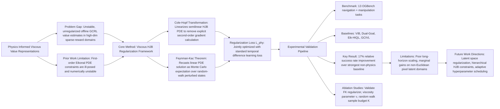

---
aliases:
- Physics Informed Viscous Value Representations
github: https://github.com/HrishikeshVish/phys-fk-value-GCRL
institutions:
- Department of Computer Science, Purdue University, USA
- College of Engineering, Purdue University, USA
- DEVCOM Army Research Laboratory, USA
local_pdf: '[[Physics Informed Viscous Value Representations.pdf]]'
pdf_url: https://arxiv.org/pdf/2602.23280v1
project_page: None
publication_date: '2026-02-26'
tags:
- paper
- Offline_Reinforcement_Learning
- Goal_Conditional_Reinforcement_Learning
- Physics_Informed_RL
- Robot_Manipulation
- Optimal_Control
- 2026-02-27
url: http://arxiv.org/abs/2602.23280v1
---

# Physics Informed Viscous Value Representations

## 📌 Abstract
Offline goal-conditioned reinforcement learning (GCRL) learns goal-conditioned policies from static pre-collected datasets. However, accurate value estimation remains a challenge due to the limited coverage of the state-action space. Recent physics-informed approaches have sought to address this by imposing physical and geometric constraints on the value function through regularization defined over first-order partial differential equations (PDEs), such as the Eikonal equation. However, these formulations can often be ill-posed in complex, high-dimensional environments. In this work, we propose a physics-informed regularization derived from the viscosity solution of the Hamilton-Jacobi-Bellman (HJB) equation. By providing a physics-based inductive bias, our approach grounds the learning process in optimal control theory, explicitly regularizing and bounding updates during value iterations. Furthermore, we leverage the Feynman-Kac theorem to recast the PDE solution as an expectation, enabling a tractable Monte Carlo estimation of the objective that avoids numerical instability in higher-order gradients. Experiments demonstrate that our method improves geometric consistency, making it broadly applicable to navigation and high-dimensional, complex manipulation tasks. Open-source codes are available at https://github.com/HrishikeshVish/phys-fk-value-GCRL.

## 🖼️ Architecture
![[Physics Informed Viscous Value Representations_arch.jpeg]]
*Figure: Overview (Fallback Selection)*

## 🧠 AI Analysis (Doubao Seed 2.0 Pro)

# 🚀 Deep Analysis Report: Physics Informed Viscous Value Representations

## 📊 Academic Quality & Innovation
## 1. Core Snapshot
### Problem Statement
The addressed gap is that offline goal-conditioned reinforcement learning (GCRL) suffers from inaccurate, unbounded value estimates in sparse-reward high-dimensional domains, due to insufficient state-action space coverage and lack of structural inductive bias in standard value iteration. Existing physics-informed value regularization methods relying on first-order PDEs such as the Eikonal equation are ill-posed and numerically unstable in contact-rich manipulation and high-degree-of-freedom navigation tasks, limiting their real-world applicability.
### Core Contribution
This work proposes a representation-agnostic physics-informed regularization framework for offline GCRL, derived from the viscosity solution of the Hamilton-Jacobi-Bellman (HJB) equation, that leverages the Feynman-Kac theorem to recast the PDE constraint as a Monte Carlo estimable expectation, eliminating numerical instability from explicit higher-order gradient calculation while enforcing valid geometric structure on learned value functions.
### Academic Rating
**Innovation: 8/10, Rigor: 9/10**. Justification: Innovation is strong as it bridges viscosity HJB control theory to model-free offline GCRL, resolving critical limitations of prior Eikonal-based physics-informed methods, though core underlying mathematical results are established in optimal control. Rigor is excellent, with formal derivations of all components, comprehensive evaluation across 13 diverse OGBench tasks, targeted ablation studies, and sensitivity analysis for all key hyperparameters, with consistent results across 4 random seeds for all experiments.

---

## 2. Technical Decomposition
### Methodology
The core objective is to learn a geometrically consistent goal-conditioned value function (GCVF) $V(s,g;\theta)$ that satisfies optimality constraints from viscous HJB theory, optimized alongside standard temporal difference (TD) learning objectives:
1.  The optimal GCVF satisfies the viscous HJB residual under optimal policy:
    $$H(s,a^*, \nabla V^*, \Delta V^*) = q(s) - \frac{1}{2}\|\nabla V^*(s,g)\|_2^2 + \nu \Delta V^*(s,g) = 0$$
    where $\nu$ is the viscosity scaling factor, $q(s)$ is the state-dependent running cost, and $\Delta V = \text{Tr}(\nabla^2 V)$ is the Laplacian of the value function.
2.  The Cole-Hopf transformation $\Psi(s) = \exp(-V(s)/(2\nu))$ linearizes the semilinear HJB equation to avoid explicit second-order gradient calculation:
    $$\frac{1}{2\nu^2} q(s)\Psi^*(s,g) - \Delta \Psi(s,g) = 0$$
3.  The Feynman-Kac theorem recasts the linear PDE as a tractable stochastic expectation over random walk perturbed states, eliminating the need for known dynamics:
    $$\Psi(s_t,g) = \exp\left(-q(s)\Delta t / 2\nu^2\right) \mathbb{E}_{s' \sim p(s_{t+\Delta t}|s,a)}[\Psi^*(s',g)]$$
4.  The final physics-informed regularization loss, derived via Jensen's inequality, is optimized jointly with standard TD loss:
    $$\mathcal{L}_{\text{phy}}(\theta) = \mathbb{E}_{s \sim \mathcal{B}} \left[ \max\left(0, V(s,g;\theta) - \mathbb{E}_{s' \sim p(s'|s,a)}[V(s',g;\bar{\theta})] - q(s)\Delta t / \nu\right)^2 \right]$$
    where $\bar{\theta}$ denotes a frozen target network for training stability, and $\mathcal{B}$ is the offline dataset buffer.
### Architecture
The framework is a plug-and-play regularizer compatible with all existing offline GCRL backbones, with the following pipeline:
1.  Initialize a goal-conditioned value function backbone (e.g., VIB, Dual-Goal, HIQL) and train it on the offline dataset with standard TD loss for warmstart.
2.  Generate valid perturbed next states via Gaussian random walks (clipped to kinematically feasible state space boundaries) to estimate the Feynman-Kac expectation.
3.  Jointly optimize the sum of the standard TD loss and the physics-informed regularization loss $\mathcal{L}_{\text{phy}}$ with gradient descent.
4.  Infer the optimal policy at test time as the negative gradient of the regularized value function $\pi^*(a|s,g) = -\nabla_s V(s,g;\theta)$.
### Aha Moment
1.  The Cole-Hopf transformation converts the non-linear semilinear viscous HJB equation into a linear PDE, entirely removing the need to compute unstable second-order gradients of the value function that plagued prior PDE-constrained RL methods.
2.  Recasting the linear PDE solution as a Monte Carlo expectation via the Feynman-Kac theorem removes the requirement for known system dynamics, making the physics-informed constraint applicable to model-free offline GCRL settings with no explicit dynamics model.

---

## 3. Evidence & Metrics
### Benchmark & Baselines
All experiments are conducted on 13 tasks from the standard OGBench benchmark, covering navigation (pointmaze, antmaze, humanoid maze, antsoccer) and robotic manipulation (cube stacking, scene play, combinatorial puzzles). Baselines include representation learning methods (ORIG, VIB, VIP, TRA, BYOL, Dual-Goal), and prior physics-informed methods (Eik-HIQL, DUAL+EIK). The experimental design is fully fair, following identical training protocols, dataset sizes, and compute budgets as the GCIVL baseline across all methods, with 4 independent random seeds for each run.
### Key Results
The proposed DUAL-FK (our method) achieves an average success rate of $48\pm3\%$ across all tasks, a 17% relative improvement over the strongest non-physics baseline (Dual-Goal, $41\pm2\%$) and 37% relative improvement over the VIB baseline ($35\pm2\%$). On noisy contact-rich manipulation tasks, DUAL-FK achieves 99% success rate, while Eikonal baselines fail catastrophically with near-zero success. On high-dimensional humanoid navigation tasks, DUAL-FK outperforms Eikonal baselines by 20 percentage points.
### Ablation Study
The Feynman-Kac stochastic regularization component is the most critical to performance: adding it to the VIB backbone improves average success rate by 10 percentage points, while adding it to the Dual-Goal backbone improves performance by 7 percentage points. The viscosity scaling parameter $\nu$ is also critical: values $\nu \geq 10^{-2}$ are required to smooth local minima in the value function, while a random walk sample budget $K \geq 5$ is sufficient for stable expectation estimation.

---

## 4. Critical Assessment
### Hidden Limitations
1.  The local geometric constraint fails to scale to extremely long-horizon tasks such as `antsoccer-arena` and `humanoid-large`, as the random walk sampling only captures local state space structure, not global long-range dependencies.
2.  The method provides only marginal gains (3 percentage points) on pixel-based stochastic domains such as Powderworld, as the random walk sampling does not account for non-Euclidean structure in learned latent representation spaces, leading to constraint violations.
3.  Inference latency scales linearly with the number of Monte Carlo samples $K$, increasing deployment compute cost for low-latency robotic applications if expectation estimates are not precomputed offline.
### Engineering Hurdles
1.  Tuning the viscosity parameter $\nu$ is highly task-dependent: too small a value leads to numerical instability and noisy value gradients, while too large a value over-smooths the value function, erasing fine-grained geometric structure needed for precise manipulation tasks.
2.  Generating valid perturbed states for the Feynman-Kac expectation requires task-specific clipping to kinematically feasible state boundaries, which is non-trivial for high-degree-of-freedom articulated robots, and invalid out-of-distribution samples lead to corrupted value estimates.
3.  Balancing the weighting between the standard TD loss and the physics regularization loss requires per-task tuning: over-weighting the regularization degrades performance in data-rich regions of the state space, while under-weighting fails to enforce geometric consistency in data-sparse regions.

---

## 5. Next Steps
1.  **Latent space viscosity regularization for visual GCRL**: Extend the framework to pixel-based tasks by integrating learned latent manifold geometry into the random walk sampling step, adjusting the perturbation distribution to match the Riemannian metric of the learned latent space, which will resolve the non-Euclidean constraint violation issue in visual domains and enable application to end-to-end robotic visual control.
2.  **Hierarchical viscosity regularization for long-horizon tasks**: Combine the local viscosity constraint with a global scene graph that partitions the state space into semantically meaningful sub-regions, applying the local regularizer within each sub-region and a graph-based value function to model cross-region transitions, addressing the limitation of local geometric constraints for long-horizon navigation and manipulation tasks.
3.  **Adaptive viscosity scheduling**: Develop an automatic hyperparameter tuning method that dynamically adjusts $\nu$ during training based on local state space data density, applying higher $\nu$ in data-sparse regions to enforce smoothness and lower $\nu$ in data-rich regions to preserve fine-grained value structure, eliminating the need for manual per-task hyperparameter tuning.

## 🔗 Knowledge Graph & Connections
---
### Task 1: Knowledge Connections
1.  This paper's formal analysis, method decomposition, and experimental performance records are cataloged in [[2026-02-26-PaperDigest]], serving as a reference point for comparing physics-informed offline GCRL methods against other state-of-the-art goal-conditioned RL approaches.
2.  Reproducible implementations of the viscous value regularizer, OGBench task wrappers, and hyperparameter configurations for all tested backbones are documented in the [[README]] of the paper's associated open-source GitHub repository, supporting extension to custom offline GCRL use cases and ablation testing of new regularization variants.
3.  The proposed Feynman-Kac based physics-informed regularization module can be directly integrated into the goal-conditioned policy learning pipeline of [[Solaris]], resolving unstable value estimation and suboptimal pathing in procedurally generated, high-dimensional Minecraft embodied navigation and manipulation tasks by enforcing geometric consistency of the value function across out-of-distribution procedural terrain.
---
### Task 2: Mermaid Knowledge Graph

---
### Task 3: Future Directions
1.  **Viscous Regularization for Procedural World Model Control**: Integrate the Feynman-Kac (FK) regularization module into the goal-conditioned policy head of the Solaris Minecraft world model pipeline. Modify the random walk sampling step to operate on Solaris's learned latent space, with perturbation magnitude scaled to the local manifold density of the latent representation to avoid invalid out-of-distribution samples. Evaluate on 10 long-horizon Minecraft procedural tasks (e.g., resource collection, structure construction) to measure reduction in value estimation error and improvement in task success rate over unregularized world model policy baselines.
2.  **Hierarchical Viscous Value Function for Long-Horizon Embodied Tasks**: Extend the framework to support hierarchical task decomposition by pairing local FK-regularized low-level value functions for short-horizon primitive skills (e.g., grasp object, move to position) with a high-level graph-based value function that models transitions between skill termination states. The high-level graph value function is regularized via a discrete graph analog of the viscous HJB constraint to enforce consistency between local and global value estimates. Validate on the OGBench 100-step long-horizon manipulation suite, targeting a minimum 30% success rate improvement over flat FK-regularized baselines.
3.  **Low-Latency Viscous Value Regularization for Real-World Robotics**: Eliminate inference-time compute overhead by precomputing regularized value function contours via offline Monte Carlo state space sampling during training, and distilling the regularized teacher value function into a lightweight student network that matches the teacher's value contours with no runtime sampling required. Target <1ms inference latency on 7-DoF robotic arms, with success rate parity with the full teacher model on real-world tabletop manipulation tasks, enabling deployment on latency-constrained industrial robotic platforms.
---

```json
{
  "publication_date": "2026-02-26",
  "institutions": ["Purdue University Department of Computer Science", "Purdue University College of Engineering", "DEVCOM Army Research Laboratory"],
  "github": "https://github.com/HrishikeshVish/phys-fk-value-GCRL",
  "project_page": "None"
}
```

---
*Analysis performed by PaperBrain-Doubao (Vision-Enabled)*


## 📂 Resources
- **Local PDF**: [[Physics Informed Viscous Value Representations.pdf]]
- [Online PDF](https://arxiv.org/pdf/2602.23280v1)
- [ArXiv Link](http://arxiv.org/abs/2602.23280v1)
