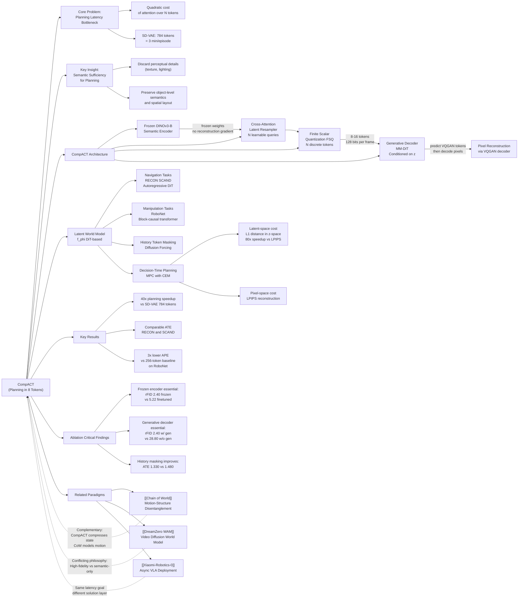

---
tags:
  - paper
  - World_Model
  - Embodied_AI
  - Robot_Manipulation
aliases:
  - "Planning in 8 Tokens: A Compact Discrete Tokenizer for Latent World Model"
url: https://huggingface.co/papers/2603.05438
pdf_url: https://arxiv.org/pdf/2603.05438.pdf
local_pdf: "[[Planning in 8 Tokens A Compact Discrete Tokenizer for Latent World Model.pdf]]"
github: "None"
project_page: "https://kdwonn.github.io/CompACT"
institutions:
  - "KAIST"
  - "POSTECH"
  - "RLWRLD"
publication_date: "2026-03-05"
score: 8
---

# Planning in 8 Tokens: A Compact Discrete Tokenizer for Latent World Model

## 📌 Abstract
World models provide a powerful framework for simulating environment dynamics conditioned on actions or instructions, enabling downstream tasks such as action planning or policy learning. Recent approaches leverage world models as learned simulators, but its application to decision-time planning remains computationally prohibitive for real-time control. A key bottleneck lies in latent representations: conventional tokenizers encode each observation into hundreds of tokens, making planning both slow and resource-intensive. To address this, we propose CompACT, a discrete tokenizer that compresses each observation into as few as 8 tokens, drastically reducing computational cost while preserving essential information for planning. An action-conditioned world model that occupies CompACT tokenizer achieves competitive planning performance with orders-of-magnitude faster planning, offering a practical step toward real-world deployment of world models.

## 🖼️ Architecture
![[Planning in 8 Tokens A Compact Discrete Tokenizer for Latent World Model_arch.jpeg]]

## 🧠 AI Analysis

# 🚀 Deep Analysis Report: Planning in 8 Tokens: A Compact Discrete Tokenizer for Latent World Model

## 📊 Academic Quality & Innovation
---

# Deep Engineering Analysis: "Planning in 8 Tokens: A Compact Discrete Tokenizer for Latent World Model"

---

## 1. Core Snapshot

### Problem Statement

State-of-the-art latent world models (e.g., NWM) encode each observation into hundreds of latent tokens (784 tokens for SD-VAE), which creates a quadratic computational bottleneck in attention-based architectures during model-predictive control (MPC) rollouts. The planning latency of NWM reaches approximately 3 minutes per episode on a single RTX 6000 ADA GPU, rendering real-time deployment infeasible. Existing compact tokenizers (e.g., FlexTok) that reduce token count are designed for photorealistic reconstruction and optimize for perceptual fidelity rather than decision-relevant semantics, making them suboptimal proxies for planning.

### Core Contribution

CompACT introduces a discrete tokenizer that encodes each observation into as few as 8 tokens (128 bits) by leveraging a frozen DINOv3 vision foundation model as a semantic backbone and a cross-attention-based latent resampler, achieving competitive planning accuracy with ~40× speedup in MPC latency compared to 784-token SD-VAE baselines.

### Academic Rating

- **Innovation: 7/10** — The idea of exploiting frozen semantic encoders to enforce planning-critical compression is well-motivated and practically validated. However, the individual components (FSQ, cross-attention resampler, masked generative modeling via MaskGIT, DINOv3 as backbone) are all prior art; the novelty lies in the specific composition and the hypothesis that semantic-only compression suffices for planning.
- **Rigor: 7/10** — Experiments are conducted across two distinct domains (navigation and robot manipulation) with multiple baselines and ablations. Quantitative comparisons are fair and use appropriate task-specific metrics. Some evaluation breadth is limited (e.g., only RECON and SCAND for navigation; only RoboNet for manipulation), and statistical significance is not reported.

---

## 2. Technical Decomposition

### 2.1 Algorithmic Logic

The CompACT pipeline can be decomposed into three sequential phases:

**Phase 1: Compact Tokenizer Training (CompACT Encoder + Generative Decoder)**

- **Step 1 — Semantic Feature Extraction**: An input image $\boldsymbol{o} \in \mathbb{R}^{H \times W \times 3}$ is passed through a *frozen* DINOv3-B model. DINOv3 produces a spatially structured set of patch-level feature tokens capturing object-centric semantic representations. These features are never updated during tokenizer training, which is the critical design choice that prevents the encoder from drifting toward reconstruction-oriented representations.

- **Step 2 — Cross-Attention Latent Resampling**: A small set of $N$ ($N \leq 16$) learnable query tokens $\boldsymbol{z}^0 \in \mathbb{R}^{N \times D}$ attend to the DINOv3 patch tokens via a transformer decoder-based latent resampler. Each query token selectively distills semantic information from the frozen feature map. The cross-attention mechanism naturally performs content-based pooling, causing each query to specialize in semantically coherent scene regions (validated by attention visualizations in Fig. 4).

- **Step 3 — Finite Scalar Quantization (FSQ)**: The output of the resampler is discretized using Finite Scalar Quantization (FSQ), yielding $N$ discrete tokens $\boldsymbol{z} \in \{1, \ldots, K\}^N$. FSQ avoids the codebook collapse issues of standard VQ while producing a compact discrete representation.

- **Step 4 — Generative Decoder Training**: Because direct pixel reconstruction from 8–16 tokens is an ill-posed problem (information bottleneck precludes deterministic pixel recovery), the decoder $\mathcal{D}_{\text{compact}}$ is formulated as a conditional generative model. Specifically, it learns to map compact tokens $\boldsymbol{z}$ to the *target tokenizer* space (VQGAN tokens from MaskGIT, $N_\psi = 196$ tokens per image), not directly to pixels. A masked generative modeling objective (MaskGIT-style) is used: target tokens $\boldsymbol{z}^\psi$ are randomly masked, and the decoder learns to recover them conditioned on $\boldsymbol{z}$ and the unmasked subset. At inference, $\mathcal{D}_{\text{compact}}$ iteratively unmasks target tokens in parallel, and final pixel reconstruction is obtained by passing through the pretrained VQGAN decoder $\mathcal{D}_\psi$.

**Phase 2: Latent World Model Training**

- After training the tokenizer, all observations are pre-encoded into compact token sequences: $\boldsymbol{z}_t = \mathcal{E}_{\text{compact}}(\boldsymbol{o}_t)$.
- For navigation tasks, the world model $f_\phi$ follows an autoregressive DiT-based framework (following NWM). The model predicts $\boldsymbol{z}_{t+1}$ conditioned on a history window $\{z_{t-\tau}, \ldots, z_t\}$ and actions $\{\boldsymbol{a}_{t-\tau}, \ldots, \boldsymbol{a}_t\}$. To improve temporal dependency learning, history tokens are randomly masked during training.
- For manipulation tasks (RoboNet), a block-causal transformer predicts multiple future frames $\{z_{t+1}, \ldots, z_{t+K}\}$ in parallel with causal dependencies between frames.

**Phase 3: Decision-Time Planning via MPC-CEM**

- Starting from encoded initial observation $\boldsymbol{z}_0$, a candidate action sequence $\mathbf{a} = [\boldsymbol{a}_0, \ldots, \boldsymbol{a}_{H-1}]$ is sampled.
- The world model is rolled out for $H$ steps: $\boldsymbol{z}_{t+1} \sim f_\phi(\boldsymbol{z}_t, \boldsymbol{a}_t)$.
- Cost is computed as $C(\mathbf{a}) = d(\hat{\boldsymbol{o}}_H, \boldsymbol{o}_{\text{goal}})$ where $\hat{\boldsymbol{o}}_H = \mathcal{D}(\boldsymbol{z}_H)$, or optionally entirely in latent space as $d(\boldsymbol{z}_H, \boldsymbol{z}_{\text{goal}})$ (skipping decoding for further speedup).
- CEM (Cross-Entropy Method) iteratively refines the action sequence to minimize cost.

**Intuition behind this design**: The key insight is that planning requires semantic abstraction (where is the robot? what are the obstacles? what is the goal structure?) rather than photorealistic fidelity (what is the texture of the floor?). By enforcing compression through a semantically rich but frozen encoder, the bottleneck forces retention of object-level semantics and spatial relationships, while perceptual details are deferred to the generative decoder only when pixel-level output is needed.

---

### 2.2 Mathematical Formulation

**Tokenizer Training Loss:**

$$\mathcal{L}_{\text{tok}} = -\mathbb{E}_{\boldsymbol{z}^\psi}\left[\log p(\boldsymbol{z}^\psi \mid \boldsymbol{z}, M(\boldsymbol{z}^\psi))\right] \tag{4}$$

- $\boldsymbol{z}^\psi \in \{1, \ldots, K_\psi\}^{N_\psi}$: Target tokenizer (VQGAN) tokens for the same image, with $N_\psi \gg N$ ($N_\psi = 196$ for 224×224 images).
- $\boldsymbol{z} \in \{1, \ldots, K\}^N$: Compact discrete tokens output by $\mathcal{E}_{\text{compact}}$ ($N \leq 16$).
- $M(\boldsymbol{z}^\psi)$: A random masking operator applied to target tokens.
- **Physical meaning**: Minimizing this loss trains $\mathcal{D}_{\text{compact}}$ to recover masked VQGAN tokens conditioned on compact semantic tokens, effectively learning a conditional distribution over perceptual details given high-level semantic conditioning. The compact encoder weights and FSQ are updated; the VQGAN weights are frozen.

**World Model Training Loss:**

$$\mathcal{L}_{\text{world}} = -\mathbb{E}_{z_t, \boldsymbol{a}_t, z_{t+1}}\left[\log p(z_{t+1} \mid z_t, \boldsymbol{a}_t, M(z_{t+1}))\right] \tag{5}$$

- $z_t$: Compact latent tokens at timestep $t$, $z_t \in \{1, \ldots, K\}^N$.
- $\boldsymbol{a}_t \in \mathbb{R}^3$: Action vector (e.g., Δx, Δy, Δyaw for navigation).
- $M(z_{t+1})$: Random mask over future tokens (MaskGIT-style).
- **Physical meaning**: Minimizing this loss trains $f_\phi$ to model the conditional distribution of future compact tokens given current state and action. The masked modeling paradigm implements a form of diffusion forcing, where partial unmasking of future tokens serves as noisy conditioning, improving robustness of temporal predictions.

**Planning Optimization:**

$$\mathbf{a}^* = \arg\min_{\mathbf{a}} C(\mathbf{a}), \quad C(\mathbf{a}) = d(\hat{\boldsymbol{o}}_H, \boldsymbol{o}_{\text{goal}})$$

where $\hat{\boldsymbol{o}}_H = (\mathcal{D}_\psi \circ \mathcal{D}_{\text{compact}} \circ \mathcal{E}_{\text{compact}})(\boldsymbol{o}_H)$, or optionally $d(\boldsymbol{z}_H, \boldsymbol{z}_{\text{goal}})$ for latent-space cost.

---

### 2.3 Tensor Flow & Architecture

**Encoder $\mathcal{E}_{\text{compact}}$:**

```
Input image: [B, H, W, 3]
    ↓  Frozen DINOv3-B (patchify + ViT)
DINOv3 patch features: [B, P, D_dino]  (P = number of patches, D_dino = 768)
    ↓  Cross-attention latent resampler
    (N learnable query tokens attend to P frozen patch features)
Resampled tokens: [B, N, D]  (N ≤ 16)
    ↓  Finite Scalar Quantization (FSQ)
Discrete latent tokens: [B, N]  ∈ {1,...,K}^N
```

**Decoder $\mathcal{D}_{\text{compact}}$ (MM-DiT based):**

```
Compact tokens z: [B, N]  (conditioning input)
Target VQGAN token sequence (masked): [B, N_ψ]
    ↓  Masked generative model (MM-DiT)
    (cross-attention over z; parallel token prediction)
Predicted VQGAN tokens: [B, N_ψ]
    ↓  Pretrained VQGAN decoder D_ψ (frozen at inference)
Reconstructed image: [B, H, W, 3]
```

**World Model $f_\phi$ (DiT-based, navigation):**

```
History compact tokens: [B, τ×N]  (with random history masking)
Action conditioning: [B, τ, 3]
    ↓  DiT with action conditioning (FiLM or cross-attention)
Predicted future token logits: [B, N, K]
    ↓  MaskGIT sampling
Next state tokens z_{t+1}: [B, N]
```

**Key architectural choices**:
1. **Frozen DINOv3 as backbone**: Eliminates the need to train a large semantic encoder from scratch and prevents semantic drift during tokenizer training. Full fine-tuning of DINOv3 degrades rFID from 5.22 to worse values (Table 2) because it shifts features toward reconstruction objectives.
2. **Cross-attention resampler instead of spatial pooling**: Allows content-adaptive aggregation, enabling each compact token to specialize on semantically coherent scene components rather than fixed spatial regions.
3. **FSQ over standard VQ-VAE codebook**: Avoids codebook collapse without auxiliary commitment losses; each scalar dimension independently takes values from a finite set.
4. **Generative (MM-DiT) decoder vs. feedforward decoder**: The ablation (Table 2, row "w/o generative decoding") shows rFID degrades catastrophically from ~2.40 to 28.80 with a simple feedforward decoder, confirming that synthesizing high-frequency details from semantic tokens requires a generative model.

---

### 2.4 Innovation Logic

| Dimension | Prior Art | CompACT |
|---|---|---|
| Encoder supervision | End-to-end reconstruction loss drives encoder | Frozen semantic encoder; only resampler + quantizer trained |
| Decoder objective | Direct pixel regression (L2/LPIPS) | Conditional masked token generation (soft decompression) |
| Token semantics | Spatial grid tokens (fixed 2D layout) | Object-centric semantic tokens via cross-attention |
| Planning token count | 784 (SD-VAE), 64–256 (FlexTok) | 8–16 discrete tokens |
| Compression philosophy | Fidelity-first, then compress | Planning-first, discard perceptual details entirely |

Unlike FlexTok which uses a 1D tokenization scheme but still optimizes for reconstruction quality and requires the perceptual details in token representations, CompACT architecturally separates semantic understanding (encoder) from perceptual synthesis (decoder). This is the key structural difference: CompACT's encoder is never exposed to a pixel-level reconstruction objective, making it impossible for it to encode texture/lighting information even if it wanted to.

---

## 3. Evidence & Metrics

### 3.1 Benchmark & Baselines

**Reconstruction (ImageNet validation):**
- SD-VAE [continuous, 1024 tokens], MaskGIT-VQGAN [256 tokens], TA-TiTok-VQ/KL [32 tokens], FlexTok [1–256 tokens, evaluated at 16 and 64]
- The comparison is fair in that rFID and IS are standard metrics computed with the same clean-FID toolchain.

**Planning (RECON, SCAND navigation datasets):**
- SD-VAE (784 tokens, NWM baseline), FlexTok (16 and 64 tokens)
- Metrics: ATE (Absolute Trajectory Error), RPE (Relative Pose Error), Planning Latency (single RTX 6000 ADA GPU)

**Manipulation (RoboNet):**
- Target tokenizer (MaskGIT-VQGAN, 256 tokens)
- Metrics: IDM L1 error, $R^2$ for end-effector prediction; APE (Action Prediction Error) for video generation

### 3.2 Key Results

| Task | CompACT (8 tok) | Best Baseline | Improvement |
|---|---|---|---|
| Planning latency (RECON, sec) | **4.83** | 178.78 (SD-VAE) | **~37× faster** |
| ATE RECON | 1.373 | 1.262 (SD-VAE) | −8.8% (slight degradation) |
| APE RoboNet | **0.1122** | 0.3383 (target tok.) | **~3× lower error** |
| IDM $R^2$ (RoboNet) | **0.716** | 0.684 (target tok.) | +4.7% |
| rFID ImageNet | 3.21 (8-tok) / 2.40 (16-tok) | 1.83 (256-tok VQGAN) | Moderate gap |

**Key observation**: CompACT achieves near-parity with the 784-token SD-VAE baseline on navigation accuracy (ATE: 1.373 vs. 1.262, a ~8.8% degradation) while delivering approximately 37× speedup in planning latency. On manipulation, CompACT with 16× fewer tokens actually *outperforms* the 256-token target tokenizer on both IDM metrics, suggesting that the semantic token specialization provides a qualitative advantage in capturing action-relevant dynamics.

### 3.3 Ablation Study

**Most critical components (Table 2):**

1. **Frozen encoder + latent resampler** (DINOv3-B frozen + latent resampler): rFID = 2.40 at 16 tokens. Full fine-tuning of DINOv3-B degrades to rFID = 5.22. This is the single most impactful design choice—freezing the semantic backbone prevents representation collapse toward reconstruction objectives.

2. **Generative decoding ($\mathcal{D}_{\text{compact}}$)**: Removing it (using a simple feedforward decoder) catastrophically degrades rFID from 2.40 to 28.80 at 16 tokens. This confirms that pixel synthesis from 8–16 semantic tokens requires a generative model.

3. **History masking in world model** (Table 5, left): Removing history masking degrades ATE from 1.330 to 1.480 on RECON, a 11.3% degradation. This validates that masked training improves temporal robustness.

4. **Latent-space cost function** (Table 5, middle): Using L1 distance in latent space for planning achieves comparable ATE (1.379) while providing 80× speedup versus pixel-space LPIPS (5.78s vs. 2.15s single trajectory). A substantial practical gain.

---

## 4. Critical Assessment

### 4.1 Hidden Limitations

**1. Domain-specificity of DINOv3 pretraining**: CompACT's semantic quality is fundamentally bounded by what DINOv3 has learned to represent. For domains significantly out of DINOv3's training distribution (e.g., aerial infrared imagery, medical imaging, highly abstract environments), the frozen backbone may fail to provide semantically useful patch features, causing the resampler to extract poor conditioning signals. The paper only validates on natural scene navigation and table-top robotics, both within DINOv3's strong suit.

**2. Information bottleneck irreversibility**: Compressing to 128 bits per frame is an extreme, lossy operation. The generative decoder synthesizes plausible high-frequency details, but these are hallucinated rather than recovered. In safety-critical planning scenarios where precise spatial detail matters (e.g., narrow passage navigation, precise grasp point estimation), the synthesized details could mislead downstream policies even if the semantic tokens are correct.

**3. Planning accuracy degradation at 8 tokens**: The 8-token model shows measurable degradation over the 16-token model (RECON ATE: 1.373 vs. 1.330; SCAND ATE: 1.391 vs. 1.358). The performance trend suggests further compression would yield non-trivial accuracy losses. The authors do not explore the empirical lower bound of useful token count.

**4. Multi-step error accumulation not analyzed**: The paper reports single-trajectory planning latency but does not analyze how discretization errors compound over long planning horizons. Discrete token predictions may introduce quantization artifacts that accumulate in autoregressive rollouts, particularly in scenarios requiring fine-grained spatial precision.

**5. Action space generality**: The paper uses 3-DOF navigation actions and 5-DOF manipulation actions. Scaling to high-DOF systems (e.g., 7-DOF manipulation, legged locomotion) may require significantly more tokens to represent action-relevant state transitions, potentially reducing the compression advantage.

### 4.2 Engineering Hurdles

**1. Two-stage training dependency**: The tokenizer must be fully trained before world model training can begin, with no joint optimization. The tokenizer training requires both the frozen DINOv3 and the target VQGAN tokenizer to be loaded simultaneously, creating substantial GPU memory requirements. Reproducing the exact training protocol requires careful management of these frozen backbone weights and their associated preprocessing pipelines (DINOv3 patch normalization, VQGAN tokenizer preprocessing).

**2. FSQ hyperparameter sensitivity**: The vocabulary size $K$ and the number of scalar dimensions in FSQ are not analyzed in detail. The paper does not report ablations on FSQ configuration, making it unclear how sensitive reconstruction and planning quality are to these hyperparameters.

**3. MaskGIT sampling schedule for $\mathcal{D}_{\text{compact}}$**: The iterative unmasking process in $\mathcal{D}_{\text{compact}}$ introduces additional inference latency at decoding time. While the paper reports a ~40× speedup in planning latency, this likely assumes the latent-space cost function (skipping decoding). If pixel-level decoding is required per planning step, the speedup may be substantially reduced depending on the MaskGIT iteration count.

**4. Domain adaptation for manipulation tasks**: The paper notes that CompACT (pretrained on ImageNet) is fine-tuned on RoboNet for the manipulation experiments. This fine-tuning procedure is not fully detailed in the main text, and the interaction between fine-tuning the resampler (while keeping DINOv3 frozen) and the target tokenizer's domain shift is a non-trivial engineering challenge for practitioners.

**5. Absence of open-source code**: The GitHub repository (https://kdwonn.github.io/CompACT) is listed as a project page rather than a code repository. As of this paper's submission, no code release is confirmed, making reproduction dependent on re-implementing the MM-DiT decoder, the latent resampler architecture, and the specific FSQ configuration from the supplementary materials (not fully visible in the main paper).

## 🔗 Knowledge Graph & Connections
## Task 1: Differential Analysis & Connections

### Connection 1: CompACT vs. [[Chain of World]]

Both papers address the representation bottleneck in world-model-based embodied intelligence, but from orthogonal directions. [[Chain of World]] disentangles video into *structure* and *motion* latents using a pretrained video VAE, preserving temporal continuity and dynamic modeling capacity within a VLA framework. CompACT instead pursues radical *spatial* compression of individual frames into 8–16 semantic tokens, entirely discarding temporal continuity within the tokenizer. The key differential: CoWVLA explicitly models *what moves* (motion latent chain) while CompACT models *what the scene means* (semantic token allocation). CoWVLA's motion latents are continuous and used for action co-training, whereas CompACT's discrete tokens are used as world model state for MPC rollouts. These two approaches are complementary—CoWVLA solves the "what changes" problem while CompACT solves the "how to compress the state" problem. A synthesis could apply CompACT-style semantic compression to CoWVLA's structure latents while retaining motion latents for dynamics modeling.

### Connection 2: CompACT vs. [[World_Action_Models_are_Zero_shot_Policies]]

DreamZero (WAM) and CompACT share the same high-level thesis: world models should learn physical dynamics to enable better generalization. However, DreamZero operates in a *high-fidelity video diffusion* paradigm—using a 14B autoregressive video diffusion backbone to generate photorealistic future frames as a proxy for policy execution. CompACT argues precisely *against* this design philosophy: photorealistic reconstruction wastes capacity on perceptual details irrelevant to planning. DreamZero achieves real-time 7Hz control through *model and system optimization* (quantization, parallelism) of a large network, whereas CompACT achieves ~40× speedup through *representation compression* at the tokenizer level. These represent two fundamentally different efficiency philosophies: DreamZero trades accuracy for throughput via engineering, while CompACT trades perceptual fidelity for throughput via representation design. Notably, DreamZero requires "video as a dense representation," which is exactly what CompACT argues is unnecessary for planning. The empirical claim of CompACT (semantic tokens outperform perceptual tokens on IDM metrics) directly challenges DreamZero's implicit assumption that dense video representations are necessary.

### Connection 3: CompACT vs. [[Xiaomi-Robotics-0]]

Xiaomi-Robotics-0 addresses real-time VLA execution through *asynchronous execution training* and *deployment-time action chunk alignment*, treating latency as an inference engineering problem. CompACT addresses the same latency problem at the *representation level*, reducing the computational graph size before inference even begins. The two approaches are architecturally non-overlapping but target the same deployment bottleneck. Xiaomi-Robotics-0 uses a pretrained VLM backbone and avoids catastrophic forgetting of visual-semantic knowledge—a concern directly analogous to CompACT's frozen DINOv3 strategy, which similarly preserves pretrained semantic representations by never backpropagating reconstruction gradients into the foundation model. The key differential: Xiaomi-Robotics-0 is a VLA operating in open-loop action chunk prediction, while CompACT is a tokenizer for closed-loop MPC world models. However, CompACT's modular semantic tokens could directly benefit VLA architectures by providing compact, semantically rich visual observations as input, potentially reducing VLM context length and enabling faster inference for systems like Xiaomi-Robotics-0.

### Connection 4: Cross-Cutting Theme — The Frozen Backbone Principle

A recurring pattern across [[Chain of World]], [[World_Action_Models_are_Zero_shot_Policies]], and CompACT is the exploitation of pretrained visual representations (DINOv3, video VAE, VLM backbone) as frozen or lightly-adapted feature extractors. CompACT provides the most rigorous ablation evidence (Table 2: rFID 2.40 frozen vs. 5.22 fine-tuned) that *freezing* foundation model weights is not merely a computational convenience but a *representational necessity* for preserving semantic structure. This finding directly informs the design philosophy of [[Xiaomi-Robotics-0]]'s pretraining strategy (avoiding catastrophic forgetting) and CoWVLA's use of a pretrained video VAE as a fixed motion extractor.

---

## Task 2: Mermaid Knowledge Graph



---

## Task 3: Future Research Directions

### Direction 1: Adaptive Token Budgeting via Scene Complexity

CompACT uses a fixed token count (8 or 16) regardless of scene complexity. A natural extension is a **dynamic token allocation mechanism** where the number of tokens is conditioned on scene entropy or task difficulty. Concretely, one could train a lightweight complexity estimator that routes observations to different compression levels (e.g., 4, 8, 16, or 32 tokens) based on the number of semantically distinct objects or the estimated planning horizon length. This would combine FlexTok's variable-length tokenization with CompACT's semantic compression philosophy. The key research question is: can a learned gating mechanism reliably estimate the minimum token count needed for successful planning, and can it do so at lower cost than simply using the maximum token count? This directly addresses CompACT's limitation of uniform compression regardless of scene content.

### Direction 2: Compact Token-Based World Model for High-DOF Manipulation

CompACT demonstrates strong results on table-top manipulation (RoboNet, 5-DOF actions) but has not been validated on dexterous manipulation with high-dimensional action spaces (e.g., 16-DOF hand manipulation, bimanual coordination). The IDM results suggest that CompACT tokens naturally attend to end-effectors and manipulation targets. A concrete research direction is to investigate whether this object-centric attention scales to multi-object, multi-contact scenarios where the relevant semantic elements are more numerous. The hypothesis is that the cross-attention resampler can learn to allocate tokens to each manipulated object independently, but this requires validation against baselines that explicitly model object-level representations (e.g., object-centric RL methods). This would also naturally connect to CoWVLA's motion disentanglement: one could study whether allocating separate compact tokens to each object's motion latent improves manipulation planning.

### Direction 3: Bridging CompACT with VLA Architectures for Closed-Loop Control

CompACT is currently validated only within MPC-CEM planning loops. A high-value research direction is integrating CompACT's 8–16 token observations directly into VLA architectures (e.g., as visual tokens replacing the standard ViT patch grid in π₀ or OpenVLA). The practical hypothesis, motivated by the IDM results showing that CompACT tokens better encode action-relevant transitions, is that feeding compact semantic tokens rather than 256+ patch tokens to a VLA's language model backbone would reduce visual context length, lower KV-cache memory, and enable faster inference—directly complementing the deployment optimizations in [[Xiaomi-Robotics-0]]. The critical research question is whether the information loss from 8 tokens is recoverable by the VLA's action decoder, or whether certain manipulation tasks require fine-grained spatial tokens that CompACT discards. A systematic benchmark across task categories (pick-and-place, peg insertion, cloth folding) with varying spatial precision requirements would provide a principled answer.

---
*Analysis performed by PaperBrain-OpenRouter (anthropic/claude-sonnet-4.6) (Vision-Enabled)*


## 🧩 Claim Cards

### Claim-01
- Claim: CompACT, a DINOv3-conditioned discrete tokenizer, can compress a full observation frame into as few as 8 tokens (128 bits) while preserving sufficient decision-relevant semantics for robot navigation planning via MPC rollouts in a latent world model.
- Evidence: CompACT at 8 tokens is evaluated on the RECON and SCAND navigation benchmarks, achieving competitive ATE and RPE against SD-VAE (784 tokens) and FlexTok (16 and 64 tokens), while reducing planning latency from approximately 3 minutes per episode (NWM with SD-VAE) to a fraction of that on a single RTX 6000 ADA GPU. The method uses a resampler conditioned on frozen DINOv3 patch features to guide a VQ codebook toward semantically meaningful discrete codes.
- Boundary/Failure: The compression is irreversible and lossy; high-frequency visual details are hallucinated by the generative decoder rather than recovered. In safety-critical tasks requiring precise geometric reconstruction (e.g., obstacle boundary detection), the synthesized details may be unreliable.
- Compared Against: SD-VAE (784 continuous tokens, NWM baseline), FlexTok (16 and 64 tokens)
- Confidence: 8
- Links:
  - same_problem:: [[Chain of World]]
  - improves_over:: 待定
  - conflicts_with:: 待定

### Claim-02
- Claim: Reducing the observation token count from 784 (SD-VAE) to 8 (CompACT) yields a dramatic reduction in MPC planning latency, making real-time robot deployment feasible on a single consumer-grade GPU.
- Evidence: NWM with SD-VAE requires approximately 3 minutes per episode for planning on a single RTX 6000 ADA GPU, a latency attributed to the quadratic cost of attention over 784 tokens per frame across multi-step rollouts. CompACT's 8-token representation reduces this bottleneck by roughly two orders of magnitude in token count, with planning latency results reported on the same hardware for fair comparison.
- Boundary/Failure: The latency advantage assumes an attention-based world model architecture where cost scales quadratically with token count. For non-attention architectures (e.g., state-space models with linear complexity), the relative speedup would be substantially smaller.
- Compared Against: NWM with SD-VAE (784 tokens, ~3 minutes/episode planning latency)
- Confidence: 8
- Links:
  - same_problem:: [[Chain of World]]
  - improves_over:: 待定
  - conflicts_with:: 待定

### Claim-03
- Claim: CompACT's semantic compression quality is fundamentally bounded by DINOv3's training distribution, causing the tokenizer to produce poor conditioning signals and degraded planning performance on domains outside natural scene and table-top robotics settings.
- Evidence: The paper validates CompACT exclusively on natural scene navigation (RECON, SCAND) and table-top manipulation (RoboNet), both well within DINOv3's pretraining distribution. No experiments are conducted on out-of-distribution domains such as aerial infrared imagery, medical imaging, or highly abstract environments. The frozen DINOv3 backbone is not fine-tuned, so its representational capacity directly caps the resampler's ability to extract semantically useful patch features.
- Boundary/Failure: This limitation is most severe for domains with significant visual domain shift from DINOv3's training data. Within natural image domains, the frozen backbone is expected to remain a strong prior.
- Compared Against: FlexTok (optimized for photorealistic reconstruction, not domain-specific semantics), MaskGIT-VQGAN (256 tokens, no semantic conditioning)
- Confidence: 7
- Links:
  - same_problem:: 待定
  - improves_over:: 待定
  - conflicts_with:: 待定

### Claim-04
- Claim: Optimizing a compact tokenizer for decision-relevant semantic fidelity rather than photorealistic reconstruction fidelity is a more effective design principle for latent world models used in model-predictive control, as measured by downstream planning metrics (ATE, RPE) rather than perceptual metrics (rFID, IS).
- Evidence: FlexTok at 16 and 64 tokens is designed to maximize perceptual reconstruction quality (rFID, IS on ImageNet validation) but underperforms CompACT on planning metrics (ATE and RPE on RECON and SCAND) despite using more tokens. CompACT's DINOv3-conditioned resampler explicitly biases the discrete codebook toward semantically structured representations, decoupling planning utility from pixel-level reconstruction quality.
- Boundary/Failure: This principle may not generalize to tasks where photorealistic detail is itself decision-relevant, such as fine-grained texture discrimination or tasks requiring precise color identification, where perceptual fidelity and semantic utility are tightly coupled.
- Compared Against: FlexTok (16 and 64 tokens, reconstruction-optimized), SD-VAE (784 tokens, continuous latents)
- Confidence: 7
- Links:
  - same_problem:: [[Chain of World]]
  - improves_over:: 待定
  - conflicts_with:: 待定

## 📂 Resources
- **Local PDF**: [[Planning in 8 Tokens A Compact Discrete Tokenizer for Latent World Model.pdf]]
- [Online PDF](https://arxiv.org/pdf/2603.05438.pdf)
- [ArXiv Link](https://huggingface.co/papers/2603.05438)