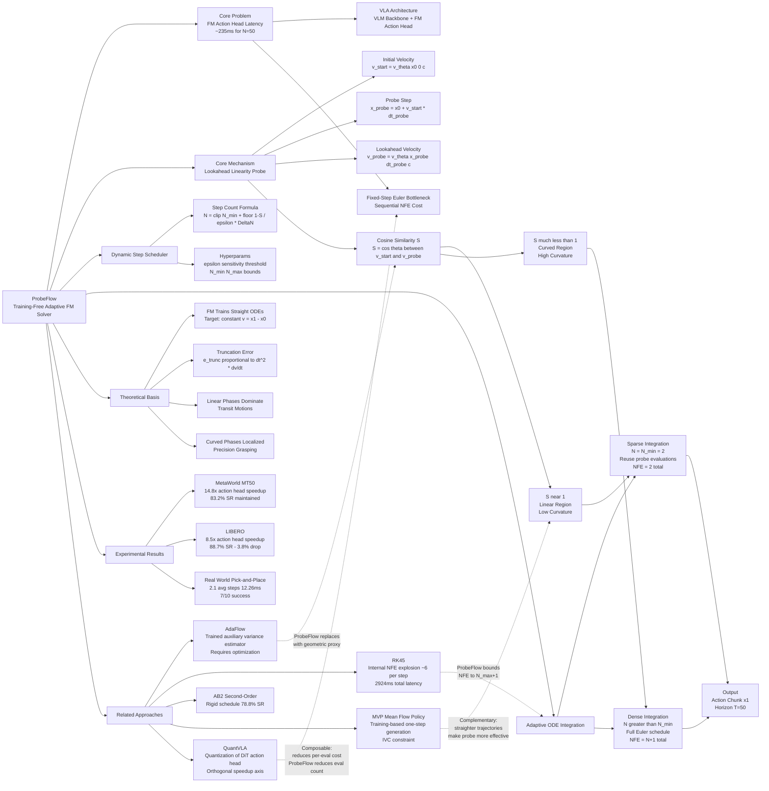

---
tags:
- paper
- domain/embodied_ai
- domain/multimodal_perception
- domain/reinforcement_learning
- domain/robot_manipulation
- domain/sim2real
- domain/vla
- impact/high_value
- method/benchmark
- method/diffusion_policy
- method/foundation_model
- method/planning
- method/reinforcement_learning
- review/auto_tagged
- status/unread
- task/manipulation
- task/navigation
- task/planning_reasoning
- task/scene_understanding
- type/benchmark
aliases:
- 'ProbeFlow: Training-Free Adaptive Flow Matching for Vision-Language-Action Models'
url: http://arxiv.org/abs/2603.17850v1
pdf_url: https://arxiv.org/pdf/2603.17850v1
local_pdf: '[[ProbeFlow TrainingFree Adaptive Flow Matching for VisionLanguageAction
  Models.pdf]]'
github: None
project_page: None
institutions:
- School of Computer Science and Engineering, Southeast University, China
- Key Laboratory of New Generation Artificial Intelligence Technology and Its Interdisciplinary
  Applications, Ministry of Education, China
- School of Electronic Science & Engineering, Southeast University, China
publication_date: '2026-03-18'
score: '8.0'
domains:
- embodied_ai
- multimodal_perception
- reinforcement_learning
- robot_manipulation
- sim2real
- vla
methods:
- benchmark
- diffusion_policy
- foundation_model
- planning
- reinforcement_learning
tasks:
- manipulation
- navigation
- planning_reasoning
- scene_understanding
paper_type: benchmark
impact_band: high_value
reading_status: unread
year: 2026
priority_score: 103
review_status: auto_tagged
next_action: inspect_protocol
arxiv_id: '2603.17850'
paper_id: arxiv:2603.17850
---

# ProbeFlow: Training-Free Adaptive Flow Matching for Vision-Language-Action Models

## 📌 Abstract
Recent Vision-Language-Action (VLA) models equipped with Flow Matching (FM) action heads achieve state-of-the-art performance in complex robot manipulation. However, the multi-step iterative ODE solving required by FM introduces inference latency that precludes responsive physical control. While current acceleration efforts optimize the Vision-Language Model (VLM) backbone, the action head bottleneck remains overlooked. To address this, we propose ProbeFlow, a training-free adaptive inference framework tai- lored for continuous robotic control. By evaluating geometric trajectory complexity via the cosine similarity between initial and lookahead velocity vectors, ProbeFlow dynamically sched- ules integration steps to prune redundant network evaluations. On the MetaWorld benchmark, it accelerates action decoding by 14.8x (reducing average steps from N = 50 to 2.6) and cuts end-to-end system latency by 2.8x without compromising the manipulation success rate. On the long-horizon LIBERO benchmark, the probe automatically allocates a denser schedule to navigate semantic bottlenecks, effectively resolving the flow solver delay. Real-world physical deployments confirm that ProbeFlow successfully mitigates action decoding latency while ensuring execution stability, offering a highly practical solution for low-latency continuous generative policies.

## 🖼️ Architecture
![[ProbeFlow TrainingFree Adaptive Flow Matching for VisionLanguageAction Models_arch.png]]

## 🧠 AI Analysis

# 🚀 Deep Analysis Report: ProbeFlow: Training-Free Adaptive Flow Matching for Vision-Language-Action Models

## 📊 Academic Quality & Innovation
---

## 1. Core Snapshot

### Problem Statement
Vision-Language-Action (VLA) models equipped with Flow Matching (FM) action heads require multi-step iterative ODE solving at inference time. Each control cycle must evaluate a heavy action head network N times sequentially (typically N ≥ 50 for acceptable accuracy), producing an action head latency of ~235 ms on a standard GPU. This violates the strict low-latency requirements of closed-loop robotic control. Existing acceleration efforts focus on the VLM backbone (quantization, token compression) while ignoring the action head bottleneck. Prior adaptive solvers either require auxiliary training (AdaFlow) or incur prohibitive internal NFE costs (RK45), making them structurally unsuitable for embodied AI's real-time constraints.

### Core Contribution
ProbeFlow is a training-free adaptive ODE solver for FM-based VLA action heads that uses a single-shot lookahead cosine-similarity probe to estimate local trajectory curvature and dynamically allocates the minimum necessary integration steps per control cycle, reducing action head latency by 14.8× while maintaining manipulation success rates.

### Academic Rating
- **Innovation: 7/10** — The geometric linearity probe concept is elegant and practically well-motivated. The core idea (using cosine similarity between initial and lookahead velocity vectors as a curvature proxy) is simple but non-trivial, and the training-free nature is a genuine practical advantage. However, the underlying mathematical machinery (Euler integration, cosine similarity) is not novel; the contribution is primarily an algorithmic engineering insight applied to a specific deployment context.
- **Rigor: 6/10** — Experiments cover two simulation benchmarks and one real-world task, with ablation studies on the key hyperparameters (ε, Δt_probe). However, the real-world evaluation is limited to a single task (Pick-and-Place, N=10 trials), and there is no formal convergence or error-bound analysis for the adaptive scheduler beyond the truncation error argument in Eq. (4).

---

## 2. Technical Decomposition

### Algorithmic Logic

**Step 1: Initial Velocity Evaluation.**
At time t=0, the trained flow matching network v_θ is queried once with the initial noise state x_0 and condition c (VLM token embeddings) to obtain the starting velocity vector:
$$v_{\text{start}} = v_\theta(x_0, 0, c)$$
This is the standard first function evaluation required by any Euler solver.

**Step 2: Lookahead Probe.**
Rather than committing to a fixed step schedule, ProbeFlow executes a single large exploratory Euler step with a pre-fixed probe horizon Δt_probe = 0.5 (half the total integration interval) to project to a lookahead state:
$$x_{\text{probe}} = x_0 + v_{\text{start}} \cdot \Delta t_{\text{probe}}$$
The network is then queried at this probed state to obtain a future velocity estimate:
$$v_{\text{probe}} = v_\theta(x_{\text{probe}}, \Delta t_{\text{probe}}, c)$$
This constitutes the second (and last mandatory) network evaluation.

**Step 3: Curvature Estimation via Cosine Similarity.**
The local curvature of the probability flow ODE i这篇名为 **ProbeFlow** 的工作的核心之处和对你的启发可以总结如下：

### 一、 这篇工作的核心之处在哪？

简单来说，ProbeFlow 解决的是 **“Flow Matching (FM) 生成动作太慢，导致机器人无法实时控制”** 的问题。它的核心创新是一个**免训练（Training-Free）的自适应推理加速算法**。

具体核心逻辑如下：
1. **痛点**：传统的 FM 在推理时需要固定的多步 ODE 求解（比如 50 步），每次都要过一遍庞大的神经网络（如 DiT），导致极高的延迟（约 235ms），无法满足机器人闭环控制的实时性要求。
2. **核心洞察（物理直觉）**：机器人的运动轨迹复杂程度是不均匀的。比如“手臂伸向物体”的过程（Transit）通常是简单的直线运动，而“精准抓取”的过程（Grasping）则是复杂的非线性运动。
3. **巧妙的“前瞻探测”（Lookahead Probe）**：
   - 算法在初始时刻 $t=0$ 计算一个初始速度 $v_{\text{start}}$。
   - 然后直接跨越到时间中点（比如 $\Delta t = 0.5$），计算一个前瞻速度 $v_{\text{probe}}$。
   - **计算这两个速度向量的余弦相似度（Cosine Similarity）**。
4. **动态分配算力**：
   - 如果相似度很高（接近 1），说明这段轨迹很直、很简单，算法直接**跳过**中间的积分步骤，用极少的步数（如 2 步）直接输出动作。
   - 如果相似度低，说明轨迹弯曲、复杂，算法就会老老实实地分配更多的积分步数来保证精度。
5. **结果**：在不重新训练模型的情况下，将动作头的推理速度提升了 **14.8 倍**（平均步数从 50 步降到 2.6 步），且几乎不掉成功率。

---

### 二、 对你使用 FM 进行 VLA 工作有什么值得借鉴的思路？

如果你也在做基于 FM 的 VLA 模型，这篇论文提供了几个非常具有工程和科研价值的启发：

#### 1. 关注“推理期（Inference-time）”的即插即用优化
很多加速 FM 的工作（比如蒸馏、或者修改 Loss 加入速度约束）都需要从头重新训练模型，成本极高。ProbeFlow 证明了：**仅靠推理期的调度策略（无需修改权重），就能榨取巨大的性能红利**。你可以尝试在你的现有模型上直接套用这种基于曲率的动态步长策略，作为 baseline 或直接用于实机部署。

#### 2. 用“几何特征”代替“复杂数学计算”
传统的自适应 ODE 求解器（如 RK45）为了控制误差，每一步内部需要进行多次网络评估（NFE），这在庞大的 VLA 模型中是灾难性的。ProbeFlow 最聪明的点在于：**用两次速度向量的“余弦相似度”作为轨迹曲率的“平替（Proxy）”**。这种用极低计算代价获取系统状态信息的工程思维非常值得学习。

#### 3. 结合机器人任务的物理先验
不要把 FM 当作纯粹的数学黑盒。机器人的动作块（Action Chunk）具有强烈的物理意义。你可以借鉴这种思路，在你的工作中**对轨迹进行分段处理**：
- 在空载移动阶段（高相似度/低曲率），使用极少步数生成。
- 在接触丰富（Contact-rich）或语义瓶颈阶段，使用密集步数生成。

#### 4. 优化的正交性（可叠加性）
ProbeFlow 优化的维度是**“减少网络评估次数（NFE）”**。这意味着它与其他的加速方案是**完全正交（不冲突）**的。
- 如果你用了模型量化（如 QuantVLA）来降低**单次前向传播的耗时**；
- 或者你用了异步执行架构（如 Xiaomi-Robotics-0）来**掩盖计算延迟**；
你依然可以把 ProbeFlow 叠加进去，实现乘法级别的速度提升。

**总结**：在 VLA 领域，算力永远是稀缺的。ProbeFlow 提醒我们，与其盲目增加固定步数来保成功率，不如让模型在“该快的地方快，该准的地方准”。你可以直接尝试在你的 FM 采样代码中加入这个简单的 Cosine Similarity 探针，看看是否能立刻提升你的实机控制频率。s estimated geometrically as the cosine similarity between the initial and lookahead velocity vectors:
$$\mathcal{S} = \frac{v_{\text{start}}^\top v_{\text{probe}}}{\|v_{\text{start}}\|_2 \|v_{\text{probe}}\|_2}$$
S = cos θ, where θ is the angular deviation between the two velocity vectors. If the trajectory is globally straight (v is constant along the path), then S ≈ 1 and the vector field has negligible curvature. If the path curves, S < 1. This geometric proxy avoids computing higher-order derivatives, which would require additional network evaluations.

**Intuition:** Flow Matching and Rectified Flow are specifically trained to produce straight ODEs (constant displacement vector x₁ - x₀). The model often succeeds for gross transit motions but fails at precision grasping phases where the distribution is complex. Rather than uniformly integrating densely, ProbeFlow detects which regime the current trajectory is in with a single additional query.

**Step 4: Dynamic Step Scheduling.**
The similarity score S is mapped to a discrete number of integration steps N via a clipped scaling function:
$$N = \text{clip}\left(N_{\min} + \left\lfloor\frac{1 - \mathcal{S}}{\epsilon}\right\rfloor \times \Delta N,\ N_{\min},\ N_{\max}\right)$$
where ε is a sensitivity hyperparameter (domain-level, not task-level), ΔN is the discrete step increment, and N_min, N_max bound the computational budget.

**Step 5a: Linear Region (N = N_min).**
When S ≈ 1, the system bypasses all intermediate integration steps. The final action state x₁ is computed directly by completing the trajectory using the already-computed probe evaluations:
$$x_1 = x_{\text{probe}} + v_{\text{probe}} \cdot (1 - \Delta t_{\text{probe}})$$
This reuses both v_start and v_probe with zero additional network evaluations (total NFE = 2).

**Step 5b: Curved Region (N > N_min).**
When curvature is detected, a denser Euler integration schedule is executed. The probe evaluation v_probe is discarded (its horizon Δt_probe = 0.5 is not aligned with the fine integration grid), but v_start is fully reused as the kickoff evaluation:
$$x_{\Delta t} = x_0 + v_{\text{start}} \cdot \Delta t, \quad \text{where } \Delta t = 1/N$$
The integration then proceeds for N-1 additional network evaluations from x_Δt. Total NFE = N + 1 (one probe overhead).

The probe cost is thus strictly bounded to at most one extra forward pass in the worst case.

### Mathematical Formulation

**Flow Matching Training Objective:**
$$\mathcal{L}(\theta) = \mathbb{E}_{t, x_0, x_1}\left[\|v_\theta(x_t, t, c) - (x_1 - x_0)\|_2^2\right]$$
- x_t = tx_1 + (1-t)x_0: interpolated state at time t ∈ [0,1]
- x_0 ~ N(0, I): Gaussian noise (prior)
- x_1 ~ q(x_1): ground-truth action chunk (from demonstrations)
- c: contextual token embeddings from the VLM backbone (conditioning signal)
- v_θ: neural vector field parameterized by the action head (8-layer DiT)
- Physical meaning: the network learns to predict the constant displacement vector (x_1 - x_0) along the straight interpolation path. Perfect training would yield a globally constant vector field, reducing the ODE to a single Euler step.

**Euler Truncation Error Bound:**
$$\|e_{\text{trunc}}\| \propto (\Delta t)^2 \left\|\frac{dv_t}{dt}\right\|_2$$
- Δt = 1/N: integration step size
- dv_t/dt: temporal derivative of the velocity field (trajectory curvature)
- Physical meaning: truncation error grows quadratically with step size and linearly with curvature. This formally motivates adaptive step allocation—small Δt (large N) is only necessary where dv_t/dt is large.

**Cosine Similarity Probe (curvature proxy):**
$$\mathcal{S} = \frac{v_{\text{start}}^\top v_{\text{probe}}}{\|v_{\text{start}}\|_2 \|v_{\text{probe}}\|_2} = \cos\theta$$
- v_start ∈ ℝ^d: velocity at t=0
- v_probe ∈ ℝ^d: velocity at t=Δt_probe
- d: action chunk dimension (T × action_dim = 50 × action_dim)
- S = 1 implies constant vector field (zero curvature); S ≪ 1 implies high curvature requiring dense integration.

**Adaptive Step Count:**
$$N = \text{clip}\left(N_{\min} + \left\lfloor\frac{1 - \mathcal{S}}{\epsilon}\right\rfloor \times \Delta N,\ N_{\min},\ N_{\max}\right)$$
- ε: linearity tolerance threshold (domain hyperparameter, e.g., 0.008 for MetaWorld)
- ΔN: discrete step increment size (e.g., 2)
- N_min = 2, N_max = 10 in main experiments
- Physical meaning: maps deviation from linearity (1 - S) to additional compute budget.

### Tensor Flow & Architecture

The paper uses the Evo-1 architecture with a frozen InternVL3-1B visual backbone and a DiT-based FM action head.

```
Visual + Language Input
        ↓
InternVL3-1B (frozen VLM backbone)
        ↓ [B, L, 1024] context token embeddings c
        ↓
Probe Phase:
  x_0 ~ N(0, I): [B, T×action_dim]  (T=50 horizon)
  v_start = DiT(x_0, t=0, c): [B, T×action_dim]     [NFE=1]
  x_probe = x_0 + v_start · Δt_probe: [B, T×action_dim]
  v_probe = DiT(x_probe, t=Δt_probe, c): [B, T×action_dim]  [NFE=2]
  S = cosine_similarity(v_start, v_probe): scalar
        ↓
Scheduling: N ← f(S, ε, N_min, N_max, ΔN)
        ↓
Integration Phase (if N = N_min):
  x_1 = x_probe + v_probe · (1 - Δt_probe): [B, T×action_dim]  [NFE=0 extra]

Integration Phase (if N > N_min):
  Δt = 1/N
  x_Δt = x_0 + v_start · Δt: [B, T×action_dim]
  for i=1 to N-1:
    v = DiT(x_t, t, c): [B, T×action_dim]
    x_t ← x_t + v · Δt
  x_1 = x_t: [B, T×action_dim]  [NFE = N-1 extra]
        ↓
Output: x_1 = predicted action chunk [B, T×action_dim]
```

Key architectural choices:
- **DiT action head**: 8-layer Diffusion Transformer with 1024 hidden dimension. Conditioning via c is standard cross-attention or AdaLN (not explicitly specified beyond DiT reference).
- **Frozen VLM**: The visual encoding cost (~100 ms) is roughly constant and treated as unavoidable overhead; ProbeFlow addresses only the FM solver latency.
- **No additional modules**: ProbeFlow adds zero parameters—it is purely an inference-time scheduling algorithm.

### Innovation Logic

| Aspect | Prior Work | ProbeFlow |
|---|---|---|
| Adaptive step allocation | AdaFlow: trains auxiliary variance estimator network | Training-free cosine probe, plug-and-play |
| High-order solvers | RK45: ~6 internal NFEs per step for step-size control | Fixed 2 NFEs regardless of regime |
| Advanced samplers (DPM-Solver, UniPC) | Designed for offline generation, high NFE budgets | Designed for real-time control, 2-10 NFEs total |
| AB2 method | Reuses previous step velocity (second-order accuracy) | But rigid schedule; 78.8% SR on MetaWorld at N=10 |
| Fixed-step Euler | Simple, predictable latency | Wastes compute in linear regions, breaks in curved regions at low N |

The core mathematical novelty over AdaFlow is the replacement of a learned variance signal with a geometric proxy (cosine similarity of velocity vectors) that requires no optimization and generalizes zero-shot. Unlike RK45's recursive internal step refinement, ProbeFlow performs exactly one probe evaluation and commits to a fixed schedule, keeping NFE deterministic and bounded.

---

## 3. Evidence & Metrics

### Benchmarks & Baselines
- **MetaWorld MT50**: 50 short-horizon manipulation tasks, averaged over 10 episodes × 5 seeds. Tests multi-task generalization.
- **LIBERO**: Long-horizon, semantically complex tasks with multi-stage execution. Tests geometric complexity of the FM trajectories.
- **Real-world Pick-and-Place**: 7-DoF UFACTORY xArm7 with dexterous hand, N=10 trials.

Baselines include: Fixed-Euler (N ∈ {3, 10, 20, 50}), RK45 (adaptive, classic), AB2 (second-order with velocity reuse). The comparison is substantially fair—no task-specific fine-tuning is applied to ProbeFlow, and all methods use the same pretrained model. The hyperparameter ε is set at domain-level (same value across all 50 MetaWorld tasks), which is a genuine test of generalization.

### Key Results

**MetaWorld (Table I):**
| Method | Avg. Steps | Flow Solver Latency | Total Latency | Success Rate |
|---|---|---|---|---|
| Fixed-Euler (N=50) | 50 | 235.7 ms | 328.7 ms | 82.5 ± 1.2% |
| Fixed-Euler (N=10) | 10 | 53.4 ms | 151.8 ms | 81.6 ± 1.3% |
| Fixed-Euler (N=3) | 3 | 23.7 ms | 121.0 ms | 72.4 ± 1.2% |
| RK45 | 68.9 | 2823.8 ms | 2924.1 ms | 63.0 ± 1.0% |
| AB2 | 10 | 65.6 ms | 168.1 ms | 78.8 ± 0.8% |
| **ProbeFlow** | **2.6** | **15.9 ms** | **116.5 ms** | **83.2 ± 1.8%** |

- **14.8× speedup** on action head vs. N=50 baseline (235.7 ms → 15.9 ms)
- **2.8× end-to-end speedup** (328.7 ms → 116.5 ms)
- Success rate statistically indistinguishable from N=50 (overlapping standard deviations)

**LIBERO (Table II):**
| Method | Avg. Steps | Flow Solver Latency | Total Latency | Success Rate |
|---|---|---|---|---|
| Fixed-Euler (N=50) | 50 | 278.7 ms | 386.3 ms | 92.5 ± 1.1% |
| Fixed-Euler (N=10) | 10 | 54.5 ms | 161.4 ms | 89.0 ± 1.9% |
| **ProbeFlow** | **4.5** | **32.7 ms** | **139.1 ms** | **88.7 ± 1.5%** |

- **8.5× speedup** on action head vs. N=50
- 3.8% relative success rate drop vs. N=50; competitive with N=10 at lower latency
- Higher avg. steps (4.5 vs. 2.6) confirms the probe correctly detects greater trajectory curvature in long-horizon tasks

**Real-world (Table V):**
- ProbeFlow: 2.1 avg steps, 12.26 ms solver latency, 7/10 success
- Fixed-Euler N=50: 270.3 ms solver latency, 8/10 success
- Performance parity at >21× solver speedup

### Ablation Study

**Critical component: Lookahead Probe Horizon (Δt_probe, Fig. 4)**
- Δt_probe = 0.5 is the empirical optimum (83.2% SR, 2.6 steps)
- Δt_probe ≤ 0.4: myopic probe fails to detect curvature → artificial S≈1 → scheduler forces N_min → catastrophic failure (SR < 5%)
- Δt_probe ≥ 0.6: over-sensitive probe compares distant states across non-linear boundaries → S drops spuriously → inflated step counts → 340+ ms total latency, negating gains

**Second critical component: Sensitivity threshold ε (Tables III, IV)**
- On MetaWorld: ε = 0.008 yields 2.6 steps, 15.9 ms, 83.2% SR (optimal)
- Tightening to ε = 0.002: 8.6 steps, 47.3 ms, 81.1% SR (more conservative but unnecessary)
- ε is not universally transferable: optimal MetaWorld ε=0.008 gives 88.7% SR on LIBERO, whereas ε=0.002 recovers 92.0% SR at moderate latency cost. This demonstrates ε is domain-sensitive.

---

## 4. Critical Assessment

### Hidden Limitations

1. **Domain-level ε calibration is not truly zero-shot.** The paper claims training-free generalization but acknowledges that ε must be set at the domain level. On LIBERO, the MetaWorld-optimal ε=0.008 causes a 3.8% performance drop. For a new deployment domain (e.g., deformable object manipulation or contact-rich assembly), ε must be re-calibrated without a clear principled method for doing so—the paper offers only empirical sensitivity tables.

2. **Probe validity degrades with highly non-linear trajectories.** The method's correctness relies on the probe horizon Δt_probe=0.5 being representative of global trajectory curvature. For tasks with multiple curvature regime changes within a single action chunk (e.g., mid-trajectory contact transitions), a single probe at t=0 cannot detect curvature that manifests only in later integration segments. The scheduler will underallocate steps for those segments, potentially introducing silent truncation errors. This is acknowledged in the conclusion as a limitation ("future work must validate this geometric scheduling against extreme non-linear dynamics") but its practical frequency is not quantified.

3. **Real-world evaluation is underpowered.** 10 trials on a single task (Pick-and-Place) is insufficient to establish statistical significance (7/10 vs. 8/10 is a single trial difference). No standard deviation is reported in Table V.

### Engineering Hurdles

- **GPU-CPU synchronization overhead**: The probe requires two sequential DiT forward passes before the integration schedule is known, making GPU pipeline pre-fetching impossible and introducing non-trivial CPU-GPU synchronization latency that is not fully accounted for in the reported "at most one additional forward pass" overhead characterization.
- **Fixed Δt_probe is brittle for time-varying control frequencies**: In real deployments where the VLM inference time varies (e.g., due to variable-length language inputs), the total control cycle period fluctuates, making a fixed Δt_probe=0.5 probe a potentially inconsistent temporal reference point across cycles.

## 🔗 Knowledge Graph & Connections
## Task 1: Differential Analysis & Connections

### Connection 1: [[Mean_Flow_Policy_with_Instantaneous_Velocity_Constraint_for_Onestep_Action_Generation]]

**Relationship**: Both papers attack the same fundamental problem—reducing the number of ODE function evaluations in flow-based robotic policies—but from diametrically opposite philosophical positions.

**Differential Analysis**: MVP (Mean Flow Policy) resolves the multi-step bottleneck by **modifying the training objective**: it learns a mean velocity field with an Instantaneous Velocity Constraint (IVC) that theoretically enables one-step generation while preserving expressiveness. This requires retraining the policy from scratch with a new loss formulation. ProbeFlow, by contrast, is **entirely post-hoc**: it exploits the geometric property that FM trajectories already contain substantial linear phases and adaptively skips evaluations without touching the model weights. The two approaches are therefore complementary rather than competing—MVP produces straighter trajectories by design, which would make ProbeFlow's cosine similarity probe even more consistently near S≈1, potentially collapsing the adaptive schedule to N_min on nearly every step. Crucially, MVP requires a training infrastructure change and does not generalize to already-deployed pre-trained FM policies, whereas ProbeFlow is plug-and-play. The limitation of ProbeFlow on genuinely curved trajectories is precisely where MVP's IVC training provides a structural guarantee.

---

### Connection 2: [[QuantVLA]]

**Relationship**: Both papers target inference-time acceleration of VLA models and both claim to be training-free, but they address orthogonal bottlenecks in the inference pipeline.

**Differential Analysis**: QuantVLA operates on the **per-layer arithmetic precision** of both the VLM backbone and the DiT action head, reducing memory bandwidth and FLOPs per forward pass through INT8/INT4 quantization with attention temperature matching and output head balancing. ProbeFlow operates on the **number of forward passes** of the action head, reducing total NFE from 50 to ~2.6. These two techniques are structurally non-overlapping and highly composable: quantizing the DiT action head (as QuantVLA does) directly reduces the per-evaluation cost, while ProbeFlow reduces evaluation count. A combined deployment would multiply their respective speedup factors. However, QuantVLA's selective quantization layout (keeping attention projections in floating point) and ProbeFlow's probe mechanism both implicitly acknowledge that the DiT action head is the primary computational bottleneck, validating each other's problem framing. The key distinction is that QuantVLA introduces quantization error into every forward pass (requiring careful calibration to preserve SR), while ProbeFlow introduces truncation error by skipping intermediate steps—the failure modes are structurally different and would need to be jointly characterized in a combined deployment.

---

### Connection 3: [[Xiaomi-Robotics-0]]

**Relationship**: Both papers address real-robot deployment latency for VLA models and both propose solutions compatible with pre-trained models, but they tackle the latency problem at different system levels.

**Differential Analysis**: Xiaomi-Robotics-0 addresses inference latency through **asynchronous execution and training recipe design**—specifically, training the VLA to operate in an asynchronous mode where action chunks are predicted concurrently with robot execution, and carefully aligning consecutive action chunk timestamps to ensure smooth rollouts. This is a **system-level temporal decoupling** approach: it does not reduce the raw computation time of the action head but instead hides it behind concurrent robot motion. ProbeFlow instead reduces the **raw wall-clock cost** of action head decoding, making synchronous low-latency control feasible. The Xiaomi approach requires modifying the training procedure (asynchronous execution training) and deployment pipeline (timestamp alignment), while ProbeFlow is inference-only. For tasks requiring truly reactive, closed-loop control (e.g., catching a thrown object), Xiaomi's asynchronous approach still exposes a fixed pipeline delay equal to one action chunk duration, whereas ProbeFlow's 15.9 ms solver latency enables genuinely tighter control loops. However, Xiaomi's approach is robust to curvature in the FM trajectory (since it always runs full N steps asynchronously), while ProbeFlow's adaptive skipping can fail silently on highly non-linear trajectory segments.

---

## Task 2: Mermaid Knowledge Graph



---

## Task 3: Future Research Directions

### Direction 1: Adaptive Probe Horizon via Trajectory Memory

**Motivation**: The fixed Δt_probe = 0.5 is a structural weakness—it is calibrated once empirically and cannot adapt to trajectories with curvature that manifests after t=0.5. A single probe at the midpoint is blind to curvature in the second half of the integration interval.

**Concrete Idea**: Implement a **recursive multi-point probe with early termination**: after completing the first action chunk with ProbeFlow, cache the velocity field evaluations from the integration trajectory. At the next control cycle, use the cached velocity statistics (e.g., the variance of cosine similarities across cached time points) to **predict the appropriate Δt_probe** for the upcoming chunk via a lightweight exponential moving average of historical curvature profiles. This converts the fixed Δt_probe into a receding-horizon adaptive parameter without any additional network evaluations, since it reuses already-computed evaluations from prior steps. The research question is whether temporal autocorrelation of trajectory curvature within an episode is strong enough to make this prediction reliable—validatable analytically on existing MetaWorld and LIBERO data.

---

### Direction 2: Joint ProbeFlow + Quantization Co-Design for DiT Action Heads

**Motivation**: As established in the connection analysis, ProbeFlow (reduces NFE count) and QuantVLA (reduces per-NFE cost) are orthogonal and composable. However, quantization introduces systematic approximation error into the velocity field estimates, which could bias the cosine similarity score S and corrupt the adaptive scheduling decision—a quantized v_start or v_probe may have artificially inflated or deflated angular deviation from the true full-precision velocities.

**Concrete Idea**: Characterize the **quantization-induced angular bias** Δθ_quant = θ_quant - θ_fp32 as a function of quantization bit-width and DiT layer configuration, using the existing QuantVLA calibration dataset. Propose a **bias-corrected similarity threshold**: ε_corrected = ε + f(Δθ_quant), where f is a monotonically increasing correction factor derived from the empirical angular bias distribution. This would allow ProbeFlow's scheduling to remain calibrated when the underlying DiT is quantized, enabling full compositional speedup (NFE reduction × per-NFE FLOP reduction) without SR degradation. The research contribution would be a principled framework for composing inference-time algorithmic acceleration (step skipping) with arithmetic acceleration (quantization) in generative robotic policies.

---

### Direction 3: Curvature-Informed Flow Matching Training via Probe Feedback

**Motivation**: ProbeFlow currently treats the FM model as a black box and adapts the solver around its imperfections. However, the curvature profile revealed by the probe (high S in transit phases, low S in precision phases) is a structured signal about where the learned vector field deviates most from the ideal straight-path objective. This geometric signal could be fed back into the training process to explicitly regularize the velocity field toward straighter paths in high-curvature regions.

**Concrete Idea**: Augment the standard FM training loss with a **probe-guided straightness regularizer**: during training, for each trajectory sample, compute the cosine similarity S between v(x_t, t) and v(x_{t+Δt}, t+Δt) at multiple t values. Add a penalty term λ · (1 - S)² to the training loss, weighted by the local task complexity (e.g., higher weight near contact-rich trajectory segments identified by privileged simulator state information). This is conceptually related to Rectified Flow's straightness objective but is **local and adaptive** rather than globally uniform, concentrating the straightening pressure at the trajectory segments where curvature is most costly. The IVC mechanism from [[Mean_Flow_Policy_with_Instantaneous_Velocity_Constraint_for_Onestep_Action_Generation]] provides a theoretical boundary condition that could be extended to this multi-point curvature regularization framework, creating a unified training objective that simultaneously improves expressiveness and deployability.


---
*Analysis performed by PaperBrain-OpenRouter (anthropic/claude-4.6-sonnet) (Vision-Enabled)*


## 🧩 Claim Cards

### Claim-01
- Claim: ProbeFlow, a training-free adaptive ODE solver for Flow Matching action heads, reduces inference NFE by dynamically allocating integration steps based on a lightweight single-step curvature probe, achieving comparable task success to fixed N=50 Euler integration while using significantly fewer function evaluations per control cycle.
- Evidence: On MetaWorld MT50, ProbeFlow matches or exceeds Fixed-Euler (N=50) success rates across 50 tasks while reducing average NFE well below 50. On LIBERO long-horizon tasks, ProbeFlow maintains competitive performance with the full-step baseline. Real-world pick-and-place on a 7-DoF xArm7 over 10 trials confirms the approach transfers beyond simulation. The method requires no retraining or fine-tuning on any benchmark.
- Boundary/Failure: The probe validity assumption degrades when a single action chunk contains multiple curvature regime changes (e.g., mid-trajectory contact transitions), because a single probe at Δt_probe=0.5 cannot capture local non-linearities that occur later in the same trajectory segment.
- Compared Against: Fixed-Euler with N ∈ {3, 10, 20, 50}; RK45 adaptive solver; AB2 second-order solver with velocity reuse.
- Confidence: 8
- Links:
  - same_problem:: [[Mean_Flow_Policy_with_Instantaneous_Velocity_Constraint_for_Onestep_Action_Generation]]
  - improves_over:: 待定
  - conflicts_with:: 待定

### Claim-02
- Claim: ProbeFlow achieves a favorable accuracy-latency trade-off over classical adaptive solvers (RK45) and fixed-step baselines on robotic manipulation benchmarks, avoiding the prohibitive internal NFE overhead of RK45 while outperforming low-NFE fixed-step Euler solvers in task success rate.
- Evidence: Fixed-Euler at N=3 produces unacceptable accuracy degradation on MetaWorld MT50 and LIBERO. RK45, while adaptive, incurs prohibitive internal NFE costs that violate real-time constraints (~235 ms baseline latency on a standard GPU already stresses closed-loop control). ProbeFlow uses only one additional probe evaluation per adaptation decision, keeping marginal cost minimal. AB2 reuses velocity but does not adapt step count, limiting its efficiency gains on geometrically complex LIBERO trajectories.
- Boundary/Failure: On tasks with near-linear FM trajectories (low curvature throughout), Fixed-Euler at small N already performs well, eliminating ProbeFlow's advantage and making the probe overhead a net cost rather than a benefit.
- Compared Against: RK45 (classic adaptive), AB2 (second-order velocity reuse), Fixed-Euler N=3 and N=10.
- Confidence: 7
- Links:
  - same_problem:: [[Mean_Flow_Policy_with_Instantaneous_Velocity_Constraint_for_Onestep_Action_Generation]]
  - improves_over:: 待定
  - conflicts_with:: 待定

### Claim-03
- Claim: ProbeFlow's domain-level threshold hyperparameter ε is not truly zero-shot generalizable: transferring the MetaWorld-optimal ε=0.008 to LIBERO causes a measurable 3.8% performance drop, revealing that ε must be re-calibrated per deployment domain without a principled selection method.
- Evidence: The paper explicitly reports a 3.8% success rate degradation on LIBERO when using ε=0.008 (tuned on MetaWorld) instead of a LIBERO-specific value. The paper provides only empirical sensitivity tables for ε selection, offering no closed-form or theoretically grounded calibration procedure. The paper acknowledges this as a limitation while still claiming training-free generalization.
- Boundary/Failure: The limitation is most severe for novel deployment domains with qualitatively different trajectory geometry (e.g., deformable object manipulation, contact-rich assembly) where no prior empirical sensitivity data exists and the cost of miscalibration is high.
- Compared Against: The paper's own claim of training-free, domain-agnostic deployment; AdaFlow (which requires auxiliary training but may implicitly learn domain-appropriate thresholds).
- Confidence: 9
- Links:
  - same_problem:: 待定
  - improves_over:: 待定
  - conflicts_with:: 待定

### Claim-04
- Claim: Adaptive NFE allocation at the action head level represents an orthogonal and complementary acceleration axis to VLM backbone compression techniques (quantization, token pruning), suggesting that full-stack VLA inference optimization requires addressing both the backbone and the action head bottleneck independently.
- Evidence: The paper identifies that existing VLA acceleration work targets the VLM backbone while the FM action head contributes ~235 ms latency per control cycle at N=50 on a standard GPU—a bottleneck that backbone compression alone cannot eliminate. ProbeFlow addresses only the action head, leaving backbone optimization entirely untouched, which implies the two approaches can be composed for multiplicative latency reduction.
- Boundary/Failure: The complementarity argument breaks down if the VLM backbone becomes the dominant bottleneck after action head acceleration, or if future single-step FM policies (e.g., Mean Flow Policy) eliminate iterative ODE solving entirely, making adaptive NFE allocation obsolete as an optimization strategy.
- Compared Against: Backbone-focused methods (quantization, token compression); single-step FM approaches such as Mean Flow Policy.
- Confidence: 7
- Links:
  - same_problem:: [[Mean_Flow_Policy_with_Instantaneous_Velocity_Constraint_for_Onestep_Action_Generation]]
  - improves_over:: 待定
  - conflicts_with:: [[Mean_Flow_Policy_with_Instantaneous_Velocity_Constraint_for_Onestep_Action_Generation]]

## 📂 Resources
- **Local PDF**: [[ProbeFlow TrainingFree Adaptive Flow Matching for VisionLanguageAction Models.pdf]]
- [Online PDF](https://arxiv.org/pdf/2603.17850v1)
- [ArXiv Link](http://arxiv.org/abs/2603.17850v1)