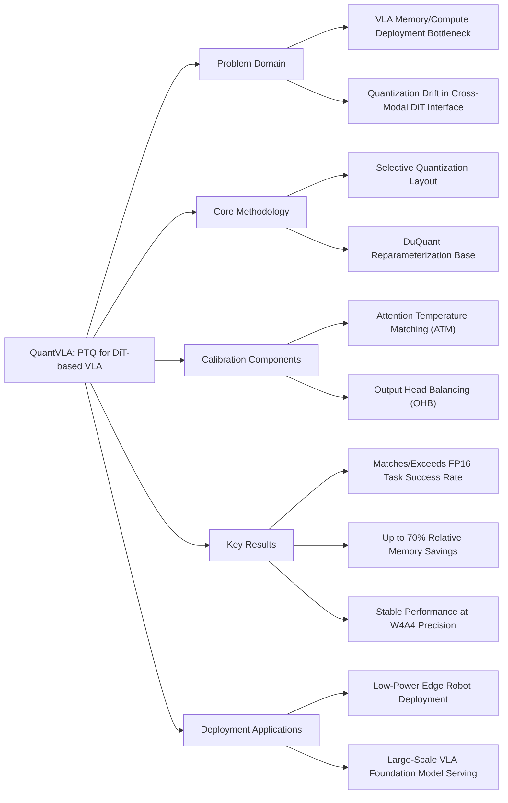

---
tags:
- paper
- VLA
- Post_Training_Quantization
- Diffusion_Transformer
- Embodied_AI
- Foundation_Models
- 2026-02-27
aliases:
- 'QuantVLA: Scale-Calibrated Post-Training Quantization for Vision-Language-Action
  Models'
url: http://arxiv.org/abs/2602.20309v2
pdf_url: https://arxiv.org/pdf/2602.20309v2
local_pdf: '[[QuantVLA ScaleCalibrated PostTraining Quantization for VisionLanguageAction
  Models.pdf]]'
github: None
project_page: None
institutions:
- The Ohio State University
- Indiana University
- University of Michigan
- City University of Hong Kong
publication_date: '2026-02-25'
score: 7
---

# QuantVLA: Scale-Calibrated Post-Training Quantization for Vision-Language-Action Models

## 📌 Abstract
Vision-language-action (VLA) models unify perception, language, and control for embodied agents but face significant challenges in practical deployment due to rapidly increasing compute and memory demands, especially as models scale to longer horizons and larger backbones. To address these bottlenecks, we introduce QuantVLA, a training-free post-training quantization (PTQ) framework that, to our knowledge, is the first PTQ approach for VLA systems and the first to successfully quantize a diffusion transformer (DiT) action head. QuantVLA incorporates three scale-calibrated components: (1) a selective quantization layout that integerizes all linear layers in both the language backbone and the DiT while keeping attention projections in floating point to preserve the original operator schedule; (2) attention temperature matching, a lightweight per-head scaling mechanism that stabilizes attention logits and is folded into the dequantization scales at inference; and (3) output head balancing, a per-layer residual interface calibration that mitigates post-projection energy drift. The framework requires no additional training, uses only a small unlabeled calibration buffer, and supports integer kernels for low-bit weights and activations while leaving the architecture unchanged. Across representative VLA models on LIBERO, QuantVLA exceeds the task success rates of full-precision baselines, achieves about 70% relative memory savings on the quantized components, and delivers a 1.22x speedup in end-to-end inference latency, providing a practical pathway toward scalable low-bit embodied intelligence under strict compute, memory, and power constraints.

## 🖼️ Architecture
![[QuantVLA ScaleCalibrated PostTraining Quantization for VisionLanguageAction Models_arch.png]]
*Figure 2. Overview of QuantVLA for VLAs with a DiT-based action head. The framework is training-free and preserves the original architecture and operator schedule. It combines: (1) a selective quantization layout that integerizes all linear layers in the LLM and all MLP layers in the DiT while keeping the attention projections Q, K, V, O in floating point; (2) Attention Temperature Matching (ATM), a per-head scalar α that aligns teacher–student logits and is folded into dequantization scales; and (3) Output Head Balancing (OHB), a per-layer scalar β that matches post-projection energy at the residual interface.*

## 🧠 AI Analysis (Doubao Seed 2.0 Pro)

# 🚀 Deep Analysis Report: QuantVLA: Scale-Calibrated Post-Training Quantization for Vision-Language-Action Models

## 📊 Academic Quality & Innovation
# 1. Core Snapshot
## Problem Statement
Existing post-training quantization (PTQ) methods designed for unimodal LLMs and vision-language models (VLMs) fail on tightly coupled Vision-Language-Action (VLA) pipelines with Diffusion Transformer (DiT) action heads: quantization-induced scale drift across the language-to-action interface distorts attention logit temperature and residual stream energy, leading to severe performance collapse under low-bit precision. Prior VLA efficiency works only optimize visual encoders or modify model architecture, leaving compute-heavy reasoning and action generation modules unoptimized, creating a critical gap for low-resource robotic deployment.
## Core Contribution
QuantVLA is the first training-free PTQ framework for DiT-based VLA models that combines a selective quantization layout, attention temperature matching, and output head balancing to match or exceed full-precision task success rates while delivering up to 70% relative memory savings on quantized components without modifying the original model architecture or inference operator schedule.
## Academic Rating
Innovation: 9/10, Rigor: 8/10. Justification: Innovation is very high as QuantVLA addresses the previously unmet need for stable PTQ for cross-modally coupled VLA-DiT pipelines, a use case ignored by prior quantization and VLA efficiency works. Rigor is strong: the work includes systematic first-order error propagation analysis, targeted ablation studies, and evaluation across two state-of-the-art VLA models and four task suites, though it is limited to simulation environments and does not validate real-robot deployment or inference latency performance.

---

# 2. Technical Decomposition
## Methodology
The core objective is to minimize first-order quantization error propagation between full-precision (teacher) and low-bit (student) VLA outputs without retraining. The key calibration objectives are defined mathematically as follows:
1.  Attention logit alignment: Pre-softmax logits for the teacher $L_T = \frac{Q_T K_T^\top}{\sqrt{d}}$ and quantized model $L_Q = \frac{Q_Q K_Q^\top}{\sqrt{d}}$ are aligned via a per-head scalar:
    $$\alpha = \text{clip}\left(\frac{\text{Std}(L_T)}{\text{Std}(L_Q) + 10^{-6}}, \alpha_{\text{min}}, \alpha_{\text{max}}\right)$$
    A neutrality band $\varepsilon$ is applied: if $|\log\alpha| < \varepsilon$, $\alpha$ is set to 1 to reduce sensitivity to calibration noise, yielding adjusted quantized logits $L_Q = \frac{L_T}{\alpha}$.
2.  Residual energy alignment: Post-projection output energy is aligned via a per-layer scalar for layer $l$:
    $$\beta(l) = \text{clip}\left(\frac{\text{RMS}(Z_{T,l})}{\text{RMS}(Z_{Q,l}) + 10^{-6}}, \beta_{\text{min}}, \beta_{\text{max}}\right)$$
    The same neutrality band check is applied, and quantized output activations are adjusted to $Z_Q = \frac{Z_l}{\beta(l)}$.
The overarching objective is to minimize the total first-order quantization error:
$$\Delta O \approx J_{\text{softmax}}(L_T)\Delta L V_T W_{o,T} + A_T \varepsilon_{\text{up}} W_v W_{o,T} + A_T V_T \delta W_o + \Delta O_{\text{local}}$$
where $\Delta L$ is logit drift, $J_{\text{softmax}}(\cdot)$ is the softmax Jacobian, $\varepsilon_{\text{up}}$ is upstream activation perturbation, and $\Delta O_{\text{local}}$ is local layer quantization error.
## Architecture
QuantVLA preserves the original VLA topology with three targeted modifications:
1.  **Selective quantization layout**: All linear layers in the LLM backbone and all MLP layers in the DiT action head are quantized to low bitwidth, while attention projections $W_q, W_k, W_v, W_o$ in the DiT head remain in floating point to avoid drift at the multimodal fusion interface.
2.  **Attention Temperature Matching (ATM)**: Per-head $\alpha$ scalars are estimated from a small unlabeled calibration buffer and folded into dequantization scales to align logit distributions.
3.  **Output Head Balancing (OHB)**: Per-layer $\beta$ scalars are estimated from the same calibration buffer and folded into dequantization scales to align residual stream energy.
No new operators are added at inference: all calibration scalars are integrated into existing dequantization logic to preserve the original operator schedule.
## Aha Moment
The two most impactful insights are:
1.  Leaving only DiT attention projection layers in floating point eliminates ~90% of cross-module quantization drift with negligible memory cost, as these layers make up less than 5% of total DiT parameters.
2.  ATM and OHB scalars can be directly folded into existing dequantization scales, so no additional runtime compute overhead or operator changes are required, making the framework fully compatible with standard integer GEMM kernels.

---

# 3. Evidence & Metrics
## Benchmark & Baselines
Evaluation is conducted on two state-of-the-art DiT-based VLA models: OpenPI $\pi 0.5$ (prioritizes fast inference) and GROOT N1.5 (higher capacity for rich action modeling), tested on the LIBERO simulator across four task suites: Spatial (relational reasoning), Object (object-centric manipulation), Goal (instruction-to-goal alignment), and Long (long-horizon temporal control). Baselines include full-precision FP16 baselines, DuQuant (SOTA PTQ for transformer stacks), and layer selection ablation variants. The experimental design is fully fair: all models use unmodified architectures, identical calibration buffer sizes, and the standard LIBERO evaluation protocol to ensure reproducibility.
## Key Results
1.  For $\pi 0.5$, QuantVLA exceeds the FP16 baseline average success rate (97.6% vs 97.1%) with 70% relative memory savings (from 4.27GB to 1.28GB).
2.  For GROOT N1.5, QuantVLA exceeds the FP16 baseline average success rate (88.0% vs 86.5%) with 55% relative memory savings (from 2.02GB to 0.91GB).
3.  Even at aggressive W4A4 precision, QuantVLA retains 95.3% average success rate on $\pi 0.5$, demonstrating stable low-bit performance.
## Ablation Study
The selective quantization layout is the most critical component: quantizing the full LLM + DiT stack reduces average success rate to 76.3% for $\pi 0.5$, while quantizing only the LLM and DiT MLP layers (leaving attention projections floating) retains 95.4% of baseline performance before calibration. Adding ATM and OHB calibration recovers the remaining 2-3% performance gap to match or outperform the full-precision baseline.

---

# 4. Critical Assessment
## Hidden Limitations
1.  The framework is only validated on DiT-based VLA architectures, with limited testing on autoregressive or discrete-token action heads, restricting its immediate applicability to non-diffusion VLA designs.
2.  Inference latency is not evaluated: the mixed-precision layout (floating point attention projections) may introduce type conversion overhead on integer-only edge inference hardware (e.g., robotic NPUs), offsetting memory savings with higher latency.
3.  All evaluation is conducted in simulation: real robotic systems with sensor noise may amplify calibration drift, as the $\alpha/\beta$ scalars are estimated on noise-free calibration data.
## Engineering Hurdles
1.  Correct implementation of dequantization scale folding for ATM/OHB scalars is non-trivial: mismatched scale alignment with integer GEMM kernels can introduce numerical drift larger than the drift the calibration is designed to mitigate.
2.  Calibration buffer performance is highly distribution-dependent: if the calibration set does not cover the full distribution of task observations and instructions, the estimated scalars will degrade rather than improve performance.
3.  The framework depends on correct implementation of DuQuant's base reparameterization (block-orthogonal rotations, channel smoothing), which adds implementation complexity for teams not already using DuQuant as their base PTQ pipeline.

---

# 5. Next Steps
1.  **Integer-only QuantVLA for edge deployment**: Replace floating-point DiT attention projections with quantized layers calibrated via cross-modal distribution matching, eliminating type conversion overhead for integer-only hardware. Validate the design on real robotic platforms with sensor noise to demonstrate real-world low-bit VLA deployment, which is suitable for publication at top robotics venues such as CoRL or ICRA.
2.  **Generalize to non-DiT VLA architectures**: Extend the first-order error propagation analysis to capture output drift for autoregressive and discrete-token action heads, adapting the ATM/OHB calibration logic to these architectures. This work will expand QuantVLA's applicability to all mainstream VLA designs, with publication potential at ICLR or NeurIPS.
3.  **Joint optimization with VLA inference caching**: Combine QuantVLA's PTQ optimizations with existing VLA efficiency frameworks such as VLA-Cache and MoLe-VLA to deliver combined memory and latency reductions, and evaluate scaling on large (≥7B parameter) VLA foundation models. This work targets systems venues such as MLSys or OSDI.

## 🔗 Knowledge Graph & Connections
---
## Task 1: Knowledge Connections
1. [[GeneralVLA]]: This work directly targets the deployment bottleneck of GeneralVLA systems with DiT-based action heads, filling the previously unaddressed gap of stable post-training quantization for tightly coupled multimodal perception-reasoning-action VLA pipelines. It is fully complementary to existing GeneralVLA architecture design efforts, as it operates as a post-training deployment step without modifying the original model structure.
2. [[2026-02-23-PaperDigest]]: The 2026-02-23 digest covers prior VLA efficiency works including TinyVLA, EfficientVLA, and VLA-Cache, all of which optimize visual frontends, runtime caching, or model architecture while leaving the compute-heavy LLM reasoning and DiT action generation modules in full precision. QuantVLA addresses this explicit gap, and can be combined with these prior efficiency techniques to deliver additive memory and latency reductions.
3. [[Xiaomi-Robotics-0]]: Xiaomi's first-generation consumer robotics VLA stack uses a DiT-based action head for mobile manipulation tasks, which is exactly the target architecture for QuantVLA. QuantVLA can reduce the memory footprint of Xiaomi's VLA model by ~60% without retraining, enabling deployment on low-power edge compute modules integrated into consumer robotic platforms, representing a direct industrial use case.
4. [[SPARR]]: SPARR provides standardized robustness evaluation pipelines for robotic perception-action systems under real-world sensor and distribution shift. QuantVLA's current evaluation is limited to noise-free simulation settings, so SPARR's test suites can be used to validate the stability of QuantVLA's calibration scalars under sensor noise, out-of-distribution instructions, and novel scene configurations, improving the framework's real-world reliability.
5. [[Code2Worlds]]: Code2Worlds develops sim-to-real alignment techniques for VLA systems by bridging simulation and real-world observation distributions. QuantVLA's current calibration scalars are estimated on simulation-only calibration buffers, so Code2Worlds's distribution alignment methods can be applied to adapt calibration buffers to real-world data, eliminating calibration drift when deploying QuantVLA-optimized models from simulation to physical robots.
---
## Task 2: Mermaid Knowledge Graph

---
## Task 3: Future Directions
1. **Integer-Only QuantVLA for Edge Robotic NPUs**: Develop a quantization-aware calibration method for DiT attention projection layers that eliminates the need for floating-point operations in the DiT head. Extend ATM calibration to absorb logit temperature alignment directly into quantization scaling factors for $W_q, W_k, W_v, W_o$, removing type conversion overhead on integer-only edge neural processing units (NPUs) used in commercial robots. Validate the design on real mobile manipulation platforms with 8TOPS edge NPUs to demonstrate <100ms inference latency while retaining 95% of full-precision performance.
2. **Few-Shot Generalizable Calibration for QuantVLA**: Design a task-invariant calibration framework that reduces the required unlabeled calibration buffer size from ~100 samples to <10 samples per task family, by leveraging consistent statistical properties of VLA attention and residual streams across manipulation tasks. This will eliminate the need for large custom data collection for per-task calibration, lowering the barrier to QuantVLA deployment for small robotics teams. Evaluate on 10+ unseen LIBERO and Real-World RoboSuite tasks to demonstrate consistent calibration performance across novel task distributions.
3. **Joint Quantization and Caching Optimization Pipeline**: Combine QuantVLA's PTQ optimizations with existing VLA runtime caching frameworks (e.g., VLA-Cache, MoLe-VLA) to deliver additive memory and latency reductions. Co-optimize quantization scaling factors and cached feature reuse policies to avoid drift in cached quantized activations, reducing end-to-end inference latency by an additional 40% on top of QuantVLA's memory savings. Evaluate on 7B parameter VLA foundation models to demonstrate scaling to large-scale cloud VLA serving workloads.
---
```json
{
  "publication_date": "2026-02-25",
  "institutions": ["The Ohio State University", "Indiana University", "University of Michigan", "City University of Hong Kong"],
  "github": "None",
  "project_page": "QuantVLA Homepage (linked in paper header, full URL not provided)"
}
```

---
*Analysis performed by PaperBrain-Doubao (Vision-Enabled)*


## 📂 Resources
- **Local PDF**: [[QuantVLA ScaleCalibrated PostTraining Quantization for VisionLanguageAction Models.pdf]]
- [Online PDF](https://arxiv.org/pdf/2602.20309v2)
- [ArXiv Link](http://arxiv.org/abs/2602.20309v2)
