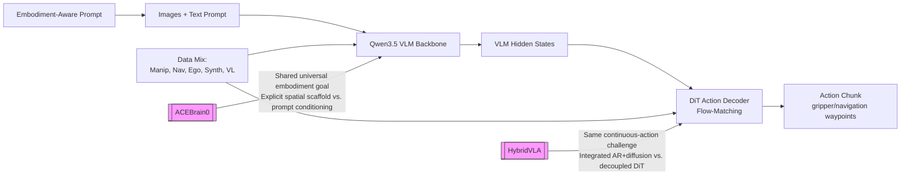

---
tags:
- paper
- domain/embodied_ai
- domain/multimodal_perception
- domain/reinforcement_learning
- domain/robot_manipulation
- domain/vla
- impact/high_value
- impact/solid
- method/benchmark
- method/diffusion_policy
- method/foundation_model
- method/imitation_learning
- method/planning
- method/reinforcement_learning
- method/simulation
- review/auto_tagged
- status/unread
- task/manipulation
- task/navigation
- task/planning_reasoning
- task/scene_understanding
- type/benchmark
- type/system
aliases:
- 'Qwen-VLA: Unifying Vision-Language-Action Modeling across Tasks, Environments,
  and Robot Embodiments'
- Qwen-VLA
- VLA Model
- Embodiment-Aware Prompts
- DiT Action Decoder
- Unified VLA
- Vision-Language-Action
- Embodied Decision Model
- Multi-task VLA
- Robot Embodiment Unification
- QwenVLA
paper_id: arxiv:2605.30280
arxiv_id: '2605.30280'
url: https://huggingface.co/papers/2605.30280
pdf_url: https://arxiv.org/pdf/2605.30280.pdf
local_pdf: '[[QwenVLA Unifying VisionLanguageAction Modeling across Tasks Environments
  and Robot Embodiments.pdf]]'
github: https://github.com/QwenLM/Qwen-VLA
project_page: https://qwen.ai/blog?id=qwenvla
institutions:
- Qwen Team
publication_date: '2026-05-29'
score: '7.5'
domains:
- embodied_ai
- multimodal_perception
- reinforcement_learning
- robot_manipulation
- vla
methods:
- benchmark
- foundation_model
- imitation_learning
- planning
- reinforcement_learning
- simulation
tasks:
- manipulation
- navigation
- planning_reasoning
- scene_understanding
paper_type: benchmark
impact_band: solid
reading_status: unread
priority_score: 83
review_status: auto_tagged
next_action: inspect_protocol
year: 2026
metadata_publication_date: '2026-06-02'
---

# Qwen-VLA: Unifying Vision-Language-Action Modeling across Tasks, Environments, and Robot Embodiments

## 📌 Abstract
Embodied intelligence is often studied through specialized models for individual tasks such as manipulation or navigation, resulting in fragmented capabilities and limited generalization across tasks, environments, and robot embodiments. In this work, we study whether heterogeneous embodied decision-making problems can be unified within a single vision-language-action model. We present Qwen-VLA, a unified embodied foundation model that extends Qwen's vision-language modeling stack from perception, understanding, and reasoning to continuous action and trajectory generation through a DiT-based action decoder. Qwen-VLA is trained with a large-scale joint pretraining recipe over diverse data sources, including robotics manipulation trajectories, human egocentric demonstrations, synthetic simulation data, vision-and-language navigation data, trajectory-centric supervision, and auxiliary vision-language data. To support multiple robot platforms, we introduce embodiment-aware prompt conditioning, where robot-specific textual descriptions specify the current embodiment and control convention. We further cast manipulation, navigation, and trajectory prediction into a unified action-and-trajectory prediction framework, enabling transferable visual grounding, spatial reasoning, and continuous action generation across robot morphologies, task families, and environments. Experiments on manipulation, navigation, and trajectory-centric benchmarks show consistent multi-task performance and out-of-distribution generalization under variations in scene layout, background, lighting, object configuration, and robot embodiment. Qwen-VLA-Instruct achieves 97.9% on LIBERO, 73.7% on Simpler-WidowX, 86.1%/87.2% on RoboTwin-Easy/Hard, 69.0% OSR on R2R, 59.6% SR on RxR, 76.9% average OOD success in real-world ALOHA experiments, and 26.6% zero-shot success on DOMINO dynamic manipulation.

## 🖼️ Architecture
![[QwenVLA Unifying VisionLanguageAction Modeling across Tasks Environments and Robot Embodiments_arch.png]]

## 🧠 AI Analysis
## Abstract
Embodied intelligence is often studied through specialized models, each designed for a single scenario or task, such as manipulation and navigation, leading to fragmented capabilities and limited generalization across diverse tasks, environments, and robot embodiments. In this work, we investigate whether these heterogeneous embodied decision-making problems can be unified within a single vision-language-action model. We present Qwen-VLA, a unified embodied foundation model that extends Qwen’s vision-language modeling stack from perception, understanding and reasoning to continuous action and trajectory generation through a DiT-based action decoder. Our approach adopts a large-scale joint pretraining recipe over diverse data sources, including robotics manipulation trajectories, human egocentric demonstrations, synthetic simulation data, vision-and-language navigation data, trajectory-centric supervision, and auxiliary vision-language data. To support multiple robot platforms within a shared model, we introduce embodiment-aware prompt conditioning, where robot-specific textual descriptions are prepended to specify the current embodiment and control convention. We further cast manipulation, navigation, and trajectory prediction into a unified action-and-trajectory prediction framework, enabling transferable visual grounding, spatial reasoning, and continuous action generation across robot morphologies, task families, and environments. Experiments on manipulation, navigation, and trajectory-centric benchmarks show that Qwen-VLA supports embodied control across task families and robot embodiments, with consistent multi-task performance and out-of-distribution generalization across variations in scene layout, background, lighting, object configuration, and robot embodiment. As a unified generalist policy, Qwen-VLA-Instruct simultaneously achieves 97.9% on LIBERO, 73.7% on Simpler-WidowX, 86.1/87.2% on RoboTwin-Easy/Hard, 69.0% OSR on R2R, and 59.6% SR on RxR, while further attaining 76.9% average OOD success in real-world ALOHA experiments and 26.6% zero-shot success rate on DOMINO dynamic manipulation.

Qwen-VLA tries to replace many separate robot models with one model that handles seeing, understanding instructions, and moving a robot arm or navigating a space. It starts from a strong vision-language model, adds a special decoder to turn that understanding into smooth robot movements, and trains everything together on a huge mix of robot videos, human hand actions, simulated scenes, and navigation routes.

## 1. Core Snapshot

### Problem Statement
Embodied AI systems today are overwhelmingly specialized. One model learns to pick objects from a table, another learns to follow spoken directions through rooms, and most of them work only for a particular robot shape, sensor suite, or laboratory setting. This specialization creates a bottleneck: skills learned for one robot rarely transfer to another, and any change in the room layout, lighting, or object set can require collecting new data and retraining from scratch.

The difficulty is that, on the surface, manipulation, navigation, and human egocentric demonstrations appear very different. They differ in action dimensionality (joint angles vs. waypoints), control frequency, observation format, and evaluation protocol. Yet a deeper look reveals a shared computational pattern: every embodied agent must condition on visual observations, language instructions, and embodiment‑specific constraints, then predict future continuous trajectories that are physically and semantically aligned with the task. This insight motivates a unified formulation that treats all these tasks as variants of one action‑and‑trajectory prediction problem.

The key challenge is to bridge the gap between compact language goals and high‑dimensional continuous motor commands, and to do so for many different physical platforms simultaneously. Traditional approaches tackle this by designing separate output heads, separate policies, or even separate model architectures for each embodiment, but that strategy cannot exploit the common visual grounding and reasoning abilities that a single model could share.

### Core Contribution
The central technical claim is that a single vision‑language backbone plus one DiT‑based action decoder can absorb supervision from manipulation, navigation, human demonstrations, and synthetic data when conditioned by **embodiment‑aware prompts** and trained in four carefully staged phases.

This departs from prior work that maintains separate heads or separate policies per robot. Here, the same model weights produce either gripper commands or navigation waypoints simply by changing the text prompt that describes the current robot. ==The model treats manipulation, navigation, and egocentric action modeling within a shared action‑and‑trajectory space.==

Evidence comes from simultaneous high scores across LIBERO, Simpler‑WidowX, R2R navigation, real ALOHA robots, and zero‑shot DOMINO tests, showing the model generalizes under layout, lighting, and embodiment shifts without per‑task retraining. However, the provided paper excerpt does not include ablation experiments that could isolate the contribution of each component (e.g., the text‑to‑action stage or the embodiment prompts), so the exact source of the gains is only partially attributed.

### Innovation Origin & Rationale
The design starts from the observation that all embodied tasks share the same computational pattern: turn images and language into future continuous trajectories, even though the physical meaning of those trajectories differs by robot. This insight directly addresses the fragmentation problem by treating action prediction as a **language‑conditioned decompression task** – the language instruction compactly encodes the intent, and the model must decompress it into a long, high‑dimensional action sequence.

The four‑stage training recipe is an explicit response to the asymmetry between a pre‑trained vision‑language backbone and a randomly initialized action decoder. If joint training were started naively, the decoder’s noisy gradients could destabilize the backbone. The solution is a first stage that teaches the decoder to act as a text‑to‑action decompressor *before* any visual input is introduced, creating a stable action prior that can later be grounded in real images. This rationale is stated explicitly in the training‑recipe section and forms a core part of the paper’s novelty.

> [!note] Design Insight
> The authors view the entire action‑generation problem as structured decompression from tokens to trajectories, which naturally motivates the staged, text‑first pretraining of the DiT decoder.

## 2. Reading Map
The paper targets readers already familiar with vision‑language models and diffusion‑ or flow‑matching policies and who are interested in scaling such models to multiple robot bodies and task families. Start with the problem formulation (Section 2.1) and the unified action representation (Section 2.4) because they define how heterogeneous outputs share one tensor interface. Then study the four‑stage training recipe (Section 3.1) and the data proportions in Table 1, which explain why stability is achieved and how the 74% manipulation data is balanced against smaller navigation and vision‑language sources.

The experiments section can be skimmed after noting the main benchmark numbers. Since no per‑component ablations are reported in the provided text, a deep dive into individual experimental details is less useful on a first pass. Focus instead on the cross‑embodiment and out‑of‑distribution claims. On a first reading, skim the synthetic‑data pipeline unless you plan to reproduce the ROBOINF generation process.

## 3. Method Walkthrough

### Inputs, Outputs, And Assumptions
At each time step the model receives one or more camera images, a language task instruction, a textual embodiment description, and optionally a task identifier. The embodiment description prepends a short paragraph that specifies the robot platform, arm configuration, control convention, control frequency, and prediction horizon. This is the sole interface through which the model learns which embodiment it currently controls.

The model outputs a fixed‑length chunk of future actions, represented as a sequence of real‑valued vectors. Different robots have different action dimensionalities (e.g., 6‑DoF end‑effector deltas vs. 3‑D navigation waypoints). To handle this within a single tensor, the model uses a unified action representation: all actions are placed in a padded tensor of the same shape, and a binary mask indicates which channels are active for the current embodiment.

The critical assumption is that every control convention can be expressed inside this fixed tensor by zero‑padding unused channels and masking them during loss computation. This means the same DiT block can process both a sparse navigation waypoint vector and a dense dexterous‑hand configuration without changing its architecture. The assumption is not fully validated in the provided text, but it is consistent with the reported cross‑embodiment results.

### Pipeline From Data To Prediction
The Qwen3.5 vision‑language backbone first encodes the concatenated images and the full text prompt (including the embodiment description). Its hidden states are then concatenated with a noisy action chunk and fed into the DiT action decoder. Inside the DiT, adaptive layer‑norm (AdaLN) timestep embeddings and self‑attention layers predict the velocity field that gradually moves the noisy actions toward the clean target trajectory. This flow‑matching process is trained to minimize the difference between predicted and true velocities, but only on the active action channels.

During inference, the process is reversed: starting from pure Gaussian noise, the DiT applies a few Euler integration steps to produce a clean action chunk. The robot executes the first part of that chunk, then the next observation arrives and the cycle repeats. In parallel, an auxiliary vision‑language loss runs on caption and VQA data to preserve the backbone’s original perception skills and prevent catastrophic forgetting during heavy embodied co‑training.

### Key Design Choices
**Each dataset’s native action format is kept intact.** Rather than forcing all actions into a common physical space (e.g., world‑frame end‑effector poses), the model uses embodiment‑aware prompts and mask‑based loss weighting. This preserves task‑specific motor priors that would be destroyed by aggressive normalization, and it lets each robot’s data contribute with its own control semantics.

**Embodiment‑aware prompt conditioning is preferred over separate output heads.** Adding a small text description before the instruction allows the same decoder to learn shared visual‑grounding features while still respecting robot‑specific control frequencies and prediction horizons. This design choice is based on the intuition that a prompt is a lightweight, scalable way to switch between embodiments without duplicating decoder parameters.

**Staged training that first warms the DiT on text‑to‑action data.** A randomly initialized DiT decoder would send large, unstable gradients into the pretrained VLM backbone during early joint training. The text‑to‑action (T2A) pretraining stage teaches the decoder a language‑conditioned action prior using only text and embodiment prompts, with the backbone frozen. Once this compressed action prior is in place, subsequent stages unfreeze the backbone and introduce visual inputs, minimizing train‑time instability.

## 4. Core Theory And Formulas

### Main Objective
The model is trained to maximize the likelihood of correct future actions while also preserving its vision‑language skills. The joint objective therefore balances a continuous flow‑matching loss on action trajectories with a standard next‑token prediction loss on auxiliary vision‑language data.

### Important Equations
The flow‑matching action loss takes the form:

$$
L_{\text{act}} = \mathbb{E}_{\tau, Y_0, Y_1} \left[ \frac{1}{c} \sum_{k=0}^{c-1} \ell_k \right]
$$

Here $\tau$ is the flow timestep, $Y_0$ is the clean action chunk (the ground‑truth trajectory), and $Y_1$ is a sample from a standard Gaussian prior used as the initial noise. The variable $c$ is the number of active control channels for the current embodiment (determined by the mask). Each $\ell_k$ is the masked squared error on channel $k$ between the DiT’s predicted velocity and the true velocity field that interpolates from $Y_0$ to $Y_1$ at timestep $\tau$.

Practically, this loss penalizes the model when the velocity field points in the wrong direction – i.e., when the predicted correction would move the noisy trajectory away from the clean one. The two‑level averaging (first over channels, then over data) ensures that robot embodiments with fewer action dimensions are not under‑weighted, because the per‑channel mean is scaled by $1/c$.

The vision‑language loss is the ordinary autoregressive cross‑entropy:

$$
L_{\text{vl}} = -\sum_i \log p_\theta(w_i \mid w_{<i}, o_{1:t})
$$

It measures how well the backbone predicts the next token $w_i$ given previous tokens and the stream of observations $o_{1:t}$. This term keeps the backbone’s token‑level prediction accuracy intact on auxiliary data (e.g., captions, VQA), preserving spatial reasoning and instruction‑following capabilities that could otherwise erode during embodied co‑training.

The overall training objective is a weighted sum:

$$
L = \lambda_{\text{act}} L_{\text{act}} + \lambda_{\text{vl}} L_{\text{vl}}
$$

The loss weights $\lambda_{\text{act}}$ and $\lambda_{\text{vl}}$ are chosen so that the gradient magnitudes from the two terms remain comparable during optimization. The exact values are not provided in the excerpt.

### Algorithmic Intuition
The four‑stage training flows naturally from the compression view of action learning. In Stage I (text‑to‑action DiT pretraining), the backbone is frozen and only the DiT is trained on language‑plus‑embodiment prompts, building an action prior that can decompress a compact instruction into a plausible trajectory. Stage II unfreezes both modules and mixes all data sources; the decoder grounds its prior in real images. Stage III branches into a multi‑task supervised track and a real‑robot teleoperation track. Finally, Stage IV runs reinforcement learning with binary success rewards collected in a single simulator, pushing closed‑loop success beyond what pure imitation can achieve.

> [!warning] Note on RL Stage
> The reinforcement learning stage is conducted in only one simulator; the excerpt does not clarify whether the resulting policy transfers its success improvements to other environments or embodiments.

## 5. Architecture, Figures, And Implementation

The architecture consists of the Qwen3.5‑4B vision‑language backbone, whose hidden states are projected into the DiT’s channel dimension and fed alongside a noisy action chunk into 16 DiT blocks. Each block uses AdaLN for timestep conditioning, along with self‑attention and feed‑forward MLP layers. The DiT decoder contains approximately 1.15 billion parameters.

Figure 1 (in the paper) shows the overall flow from observed images and text prompt through the VLM to the DiT that outputs clean actions, together with the three main data families (manipulation, navigation, VL understanding). Figure 2 diagrams the four training stages as successive modules that progressively add visual grounding, task specialization, and reward‑driven refinement. Figure 3 illustrates how synthetic trajectories are broken into short‑horizon and long‑horizon segments with explicit subtask labels.

Several implementation details remain unclear from the provided text: the precise values of the loss weights $\lambda_{\text{act}}$ and $\lambda_{\text{vl}}$, the sampling ratios across the eight data families in Table 1, and the exact prompt templates used at inference time are not specified.

## 6. Experiments And Evidence

Qwen‑VLA‑Instruct achieves strong numbers across diverse benchmarks: 97.9% success on LIBERO, 73.7% on Simpler‑WidowX, 86.1% / 87.2% on RoboTwin‑Easy/Hard, 69.0% object‑search success rate on R2R, and 59.6% success rate on RxR. Real‑world ALOHA experiments report 76.9% average out‑of‑distribution success, and zero‑shot DOMINO dynamic manipulation yields 26.6% success. These scores demonstrate that a single set of weights can reach competitive performance on both manipulation and navigation tasks while generalizing across different robot bodies and scene variations.

> [!warning] No Ablation Evidence
> The provided excerpt does not contain any component‑wise ablation experiments. Without isolating the contribution of the text‑to‑action stage, the embodiment prompts, or the data mixture, it is difficult to attribute the strong multi‑task performance to specific design choices.

## 7. Strengths, Limitations, And Failure Cases

**Strengths.** The paper presents evidence of strong multi‑task and out‑of‑distribution performance from a single model, including real‑world deployment on physical ALOHA hardware. The staged training recipe improves stability compared to naïve joint training, and the use of embodiment‑aware prompts is a clean, scalable way to handle multiple robots without per‑embodiment policy networks.

**Limitations.** The lack of reported ablation experiments weakens the attribution of gains. It is not clear whether the embodiment prompts are strictly necessary, or whether a simpler embedding‑based encoding would suffice. The reinforcement‑learning stage is applied only in one simulator, leaving open the question of whether its improvements transfer to other task families or real‑world settings.

**Hidden assumptions.** The design rests on the assumption that all control signals can be masked and zero‑padded inside one fixed tensor shape. For highly coupled joint dependencies (e.g., dexterous hands) this may ignore interaction terms. The paper also assumes that per‑dataset quantile normalization to $[−1,1]$ is sufficient to remove scale differences across embodiments.

**Deployment hurdles not addressed.** The text does not report the inference latency of the flow‑matching process after a few Euler steps, nor how the model handles sudden changes in camera calibration or hardware wear. These practical considerations are important for real‑world deployment but remain unexamined in the excerpt.

## 8. Reproduction Notes

The training data mix consists of public manipulation corpora listed in Section 3.2.1, four egocentric human demonstration datasets, navigation trajectories from R2R and RxR, 359k synthetic VLA trajectories plus 7.2M language‑action trajectories generated inside IsaacLab, and auxiliary vision‑language corpora. Preprocessing requires per‑dataset quantile normalization to map action values into $[−1,1]$, and view‑specific boundary tokens are inserted around each camera image to help the backbone distinguish viewpoints.

The backbone is Qwen3.5‑4B, and the action decoder is a 16‑block DiT with roughly 1.15B total parameters. Training proceeds through four sequential stages with mixed‑batch sampling, but exact hyperparameters (loss weights, learning rates, batch sizes) are not provided. Evaluation metrics are success rate or object‑search rate on the listed benchmarks. Code and project page links appear in the paper, but the precise prompt templates used at inference are not detailed beyond the training‑time template described in Section 2.3.

## 9. What To Read Closely

Begin with the problem formulation (Section 2.1) and the unified action representation (Section 2.4); these define exactly how heterogeneous tasks are cast into one interface. Next, study the four‑stage training recipe (Section 3.1) and the data proportions in Table 1, because they explain the stability‑through‑staging logic and how the 74% manipulation data sits alongside smaller navigation and VL sources. Examine Figure 2 together with the text in Section 3.1 to see the data flow between stages. The experiments section can be read last; the main benchmark numbers are sufficient on a first pass, because no per‑component ablations are reported.

## 10. Research Ideas And Open Questions

One follow‑up could test whether adding episodic memory tokens to the input improves long‑horizon recovery after perturbations. A small experiment would collect 200 episodes on LIBERO with an intentional perturbation at step ten, then measure whether the baseline Qwen‑VLA recovers compared to a version that receives a fixed‑size memory of past action chunks and image features. The metric would be final task success after the perturbation. The risk is that the chosen memory size might be too small to capture the relevant history, making the comparison inconclusive.

A second idea is to replace the single‑environment RL stage with a multi‑environment reward collection pass that samples from both SimplerEnv and an additional navigation simulator. Two versions would be trained for the same wall‑clock budget, and the outcome would be average out‑of‑distribution success on the ALOHA test set. The risk is that reward collection in a second simulator may be too expensive to complete in the intended time frame.

A third direction would examine whether the current per‑dataset quantile normalization hides embodiment‑specific scaling factors that are important for precise force control. A quick ablation could re‑train a model that instead learns a single global affine transform per action dimension across all datasets (still using embodiment prompts), and compare the mean squared error on held‑out real‑robot trajectories. The key observation is whether joint‑space control error increases on dexterous‑hand data; the risk is that the learned global transform collapses the relative motion structure inside each dataset, making the result worse than the original per‑dataset scheme.

> [!question] Open Question
> Is embodiment‑aware prompt conditioning truly necessary, or would a simple embedding vector attached to the observation suffice? The paper does not include an ablation comparing prompt conditioning to alternative embodiment‑encoding strategies.

## Knowledge Graph & Connections

### Related Work Connections

Qwen‑VLA shares the ambition of **[[ACEBrain0]]** to serve as a universal embodied brain that spans drastically different physical platforms. Both works argue that a single model should handle driving, manipulation, and navigation, and both use a multimodal large language model as the central reasoning unit. However, ACEBrain0 makes **spatial intelligence** the explicit scaffold: it deliberately models 3D geometry and camera‑to‑world transformations so that spatial cognition becomes the domain‑agnostic bridge between a car, a drone, and a robot arm. Qwen‑VLA does not treat spatial structure as a first‑class object; instead it relies on a vision‑language backbone and masks action channels to accommodate different action dimensions. The implication is that ACEBrain0’s approach might offer stronger spatial generalization (e.g., re‑mapping trajectories between camera views) while Qwen‑VLA’s simpler prompt‑only conditioning is easier to scale across dozens of robot morphologies. Comparing these two strategies in a head‑to‑head cross‑embodiment setting would directly test whether an explicit geometric scaffold is necessary for robust spatial transfer.

The connection to **[[HybridVLA]]** lies in the shared problem of generating **continuous actions from a vision‑language model** without losing the pretrained model’s reasoning ability. HybridVLA proposes to fuse diffusion and autoregression inside a single large language model so that token‑level semantic context directly guides the denoising of action tokens. Qwen‑VLA separates the two: the VLM backbone produces hidden states, and a separate DiT decoder turns those states into action trajectories via flow‑matching. The core difference is thus architectural: HybridVLA keeps action generation *inside* the same LLM, whereas Qwen‑VLA adds a specialized decoder. This difference is important because an integrated architecture could more tightly couple language reasoning and motion—potentially improving instruction‑following—while the decoupled design of Qwen‑VLA makes the training recipe simpler (text‑first warm‑up for the decoder) and avoids distorting the backbone’s language representation with action‑gradients. Future work that directly compares these two strategies on the same multi‑task benchmark would clarify whether the tight coupling of reasoning and action is worth the added training complexity.

If the note list contained any truly irrelevant entries (for instance, a purely navigation‑only work that does not address manipulation), I would refrain from forcing a connection. All three provided related notes are genuinely relevant, so only the strongest thematic links are used here.

### Concept Map

*The graph shows Qwen‑VLA’s pipeline (images and text prompt to action) and marks two knowledge‑base connections as external related works (dashed).*

### Questions For Future Reading

1. **Under what conditions does the four‑stage training recipe actually prevent catastrophic forgetting of auxiliary vision‑language skills?**  
   The paper claims that interleaving the flow‑matching loss with a standard vision‑language loss preserves the backbone’s perception, but it provides no ablation that varies the loss ratio $\lambda_{\text{vl}}/\lambda_{\text{act}}$ or measures degradation on captioning/VQA after embodied training. Future papers that report a ViLBERT‑style probe (e.g., continue training a VLM‑only benchmark alongside the policy) would tell us how fragile this balance is and whether the claimed “preservation” holds for complex visual‑reasoning tasks beyond simple captions. Concrete evidence would be the drop in V‑L benchmark scores when the auxiliary loss is omitted or severely down‑weighted.

2. **Does the text‑to‑action (T2A) warm‑up stage actually improve final performance, or is it only needed to stabilize early training?**  
   The narrative positions T2A as a crucial design insight that prevents decoder noise from harming the VLM. Yet without an ablation that skips Stage I and directly performs joint training (perhaps with a lower learning rate for the decoder), we cannot separate the stability argument from the possibility that the T2A prior itself contributes to better generalization. When reading future work that adopts similar staged pretraining, look for a head‑to‑head comparison where the decoder’s learning rate is adjusted to keep initial gradient magnitudes comparable; if performance still degrades without T2A, the stability claim would be validated.

3. **How far does embodiment‑aware prompt conditioning scale before the model saturates—could it handle a hundred different robot morphologies without interference?**  
   Qwen‑VLA demonstrates three or four embodiments, but the paper’s assumption is that describing the embodiment in text suffices to separate action spaces. Future studies that train with a much larger set of robots (e.g., 50+ diverse platforms) should test whether the shared vision‑language backbone begins to mix action priors across mechanically incompatible platforms. Evidence would be the per‑embodiment success rate as a function of the number of robots added, especially for morphologies that share similar visual tasks but differ in fine motor control, like a parallel‑jaw gripper versus a multi‑finger hand performing the same pick‑and‑place task.

---
*Analysis by PaperBrain (x-ai/grok-4.3; refinement: deepseek/deepseek-v4-pro)*

## 📂 Resources
- **Local PDF**: [[QwenVLA Unifying VisionLanguageAction Modeling across Tasks Environments and Robot Embodiments.pdf]]
- [Online PDF](https://arxiv.org/pdf/2605.30280.pdf)
- [ArXiv Link](https://huggingface.co/papers/2605.30280)

## Related Work Updates
- [ ] **2026-06-03**: New paper [[VisualThinkVLA]] discusses *vision-language-action*. Innovation: "Introduces a compact visual-evidence interface with selective routing to replace textual chain-of-thought in VLA policies, achieving low-latency and accurate action prediction."
- [ ] **2026-06-03**: New paper [[HideandSeek Failure Detection for VLA]] discusses *vla model*. Innovation: "Hide-and-Seek introduces inter- and intra-trajectory contrastive objectives to localize failure-indicative actions from trajectory-level labels without step-level annotation."
- [ ] **2026-06-03**: New paper [[GEM Generative Supervision for Embodied VLM]] discusses *vla model*. Innovation: "Integrating depth map generation as an auxiliary generative supervision task during VLM pre-training to enhance spatial and physical reasoning for embodied tasks."
- [ ] **2026-06-03**: New paper [[Rethinking VLM Representation for VLA Initialization]] discusses *vla model*. Innovation: "A systematic controlled study revealing that preserving pretrained VLM representation via LoRA and injecting specific embodied VQA domains (Grounding + Egocentric Understanding) yields better VLA initialization than full finetuning or arbitrary VQA adaptation."
- [ ] **2026-06-04**: New paper [[Pion]] discusses *vision-language-action*. Innovation: "Proposes Pion, a high-pass Newton-Schulz iteration that anchors dominant singular values at 1 while suppressing noisy tail components, with per-head mode for preserving pretrained heterogeneity."
- [ ] **2026-06-04**: New paper [[AffordVLA]] discusses *vla model*. Innovation: "Internalizing task-conditioned affordance as learnable tokens that decode masks and directly condition action generation in a tightly coupled VLA framework."