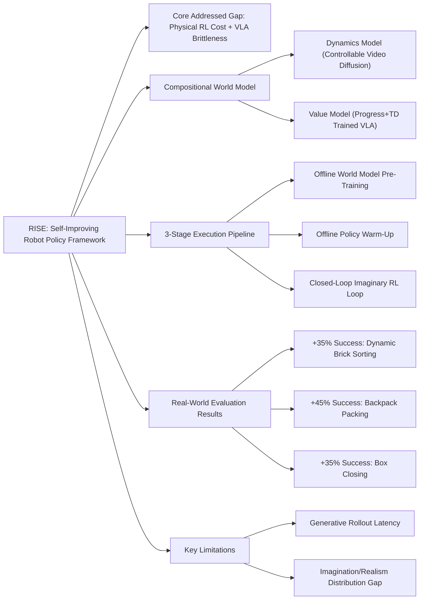

---
tags:
  - paper
  - World_Model
  - Embodied_AI
  - Reinforcement_Learning
  - Robot_Manipulation
  - VLA
aliases:
  - "RISE: Self-Improving Robot Policy with Compositional World Model"
url: https://huggingface.co/papers/2602.11075
pdf_url: https://arxiv.org/pdf/2602.11075.pdf
local_pdf: "[[RISE SelfImproving Robot Policy with Compositional World Model.pdf]]"
github: "None"
project_page: "https://opendrivelab.com/kai0-rl"
institutions:
  - "The Chinese University of Hong Kong"
  - "Kinetix AI"
  - "The University of Hong Kong"
  - "Shanghai Innovation Institute"
  - "Horizon Robotics"
  - "Tsinghua University"
publication_date: "2026-02-11"
score: 9
---

# RISE: Self-Improving Robot Policy with Compositional World Model

## 📌 Abstract
Despite the sustained scaling on model capacity and data acquisition, Vision-Language-Action (VLA) models remain brittle in contact-rich and dynamic manipulation tasks, where minor execution deviations can compound into failures. While reinforcement learning (RL) offers a principled path to robustness, on-policy RL in the physical world is constrained by safety risk, hardware cost, and environment reset. To bridge this gap, we present RISE, a scalable framework of robotic reinforcement learning via imagination. At its core is a Compositional World Model that (i) predicts multi-view future via a controllable dynamics model, and (ii) evaluates imagined outcomes with a progress value model, producing informative advantages for the policy improvement. Such compositional design allows state and value to be tailored by best-suited yet distinct architectures and objectives. These components are integrated into a closed-loop self-improving pipeline that continuously generates imaginary rollouts, estimates advantages, and updates the policy in imaginary space without costly physical interaction. Across three challenging real-world tasks, RISE yields significant improvement over prior art, with more than +35% absolute performance increase in dynamic brick sorting, +45% for backpack packing, and +35% for box closing, respectively.

## 🖼️ Architecture
![[RISE SelfImproving Robot Policy with Compositional World Model_arch.png]]
*Fig. 1: We present RISE, a framework for Reinforcement learning via Imagination for SElf-improving robots. (a) Conventional physical-world RL is bottlenecked by hardware cost, slow serial interaction, and the need for manual reset. (b) RISE shifts the learning environment to a Compositional World Model, which first emulates future observations for proposed actions, then evaluates imagined states to derive advantage for policy improvement. (c) Training on massive imaginative rollouts effectively bootstraps RISE's performance across a variety of complex, contact-rich tasks, surpassing prior art by a non-trivial margin.*

## 🧠 AI Analysis (Doubao Seed 2.0 Pro)

# 🚀 Deep Analysis Report: RISE: Self-Improving Robot Policy with Compositional World Model

## 📊 Academic Quality & Innovation
## 1. Core Snapshot
### Problem Statement
The work addresses two critical gaps in robot learning: (1) state-of-the-art (SOTA) Vision-Language-Action (VLA) models are brittle in contact-rich dynamic manipulation tasks, suffering from exposure bias and compounding errors when deviating from expert demonstration distributions; (2) physical-world on-policy reinforcement learning (RL) is severely constrained by safety risks, high hardware cost, serial execution latency, and manual reset overhead, while offline RL/imitation learning (IL) methods suffer from distribution shift that limits further performance improvement.
### Core Contribution
RISE is the first closed-loop self-improving robot RL framework that replaces physical interaction with a compositional controllable multi-view world model, enabling scalable on-policy policy optimization entirely in imaginary space to eliminate physical trial-and-error cost while outperforming SOTA RL/IL baselines on complex manipulation tasks by a large margin.
### Academic Rating
Innovation: 9/10, Rigor: 8/10. Justification: The work delivers high innovation by successfully repurposing generative world models as a fully functional online RL environment for VLA self-improvement, a long-standing unmet goal in robot learning. Rigor is strong, with comprehensive ablations, consistent real-world evaluation across multiple tasks, and controlled baseline comparisons, though generalizability is limited by testing on only 3 tabletop manipulation scenarios.

## 2. Technical Decomposition
### Methodology
The framework is built on three core mathematical formulations:
1. **Compositional World Model**: The dynamics model $\mathcal{D}$ predicts H-step multi-view future observations conditioned on historical context and proposed action chunks:
   $$\hat{o}_{t+1}, \dots, \hat{o}_{t+H} = \mathcal{D}(\mathbf{O}_t, \mathbf{a}_t)$$
   where $\mathbf{O}_t = \{o_{t-N}, \dots, o_t\}$ is the N-length historical multi-view observation window, and $\mathbf{a}_t$ is the H-length action chunk sampled from the running policy. The value model $\mathcal{V}$ maps observations and task instructions to a progress score, with a combined training loss to balance temporal consistency and failure sensitivity:
   $$\mathcal{L_V} = \mathcal{L}_{\text{prog}} + \mathcal{L}_{\text{TD}}$$
   where $\mathcal{L}_{\text{prog}} = \mathbb{E}_{(\mathbf{O}_t,\ell)\sim\mathcal{D}_{\text{exp}}}\left[\left(\mathcal{V}(o_t, \ell) - t/T\right)^2\right]$ is the progress regression loss, and $\mathcal{L}_{\text{TD}} = \mathbb{E}_{(o_t,\ell,o_{t+1})\sim\mathcal{D}}\left[\left(\mathcal{V}(o_t, \ell) - y_t\right)^2\right]$ with $y_t = r_t + \gamma\mathcal{V}(o_{t+1}, \ell)$ is the temporal difference loss for failure detection.
2. **Advantage Estimation**: The chunk-wise advantage signal for policy optimization is computed as:
   $$A(o_t, \mathbf{a}_t, \ell) = \left(\frac{1}{H}\sum_{k=1}^H \mathcal{V}(\hat{o}_{t+k}, \ell)\right) - \mathcal{V}(o_t, \ell)$$
3. **Advantage-Conditioned Policy Optimization**: The policy is optimized to generate high-return action chunks conditioned on discretized optimal advantage signals, following the objective:
   $$\hat{\pi}(\mathbf{a}_t|o_t, \ell) = \pi_{\text{ref}}(\mathbf{a}_t | \mathbb{1}, o_t, \ell)$$
   where $\mathbb{1}$ is the binned optimal advantage target.
### Architecture
The system pipeline follows three sequential stages:
1. **Offline World Model Training**: A controllable dynamics model is fine-tuned from the Genie Envisioner video diffusion backbone with task-centric batching to improve action controllability, while the value model is fine-tuned from the pre-trained $\pi_{0.5}$ VLA backbone with the combined progress/TD loss.
2. **Policy Warm-up**: The base VLA policy is fine-tuned on offline demonstration data, conditioned on advantage labels from the pre-trained value model to anchor it to plausible real-world behavior and avoid invalid exploration.
3. **Closed-Loop Self-Improvement**: The loop runs iterative rollout (policy generates action chunks conditioned on high advantage, dynamics model imagines future states, value model computes realized advantage for the proposed action) and training (policy is optimized on imaginary rollout data mixed with offline data to avoid catastrophic forgetting).
### Aha Moment
1. **Compositional World Model Split**: Separating the world model into independent dynamics and value components allows each to be optimized with task-specific architectures and objectives (generative video modeling for state prediction, VLA fine-tuning for reward estimation) rather than forcing a single model to handle both tasks, improving both prediction fidelity and learning signal quality.
2. **Task-Centric Batching**: This training strategy prioritizes action diversity within the same task per minibatch, reducing training instability of the video diffusion model across heterogeneous tasks and improving action controllability by 56% as measured by end-point prediction error.

## 3. Evidence & Metrics
### Benchmark & Baselines
RISE is benchmarked against 5 SOTA robot learning baselines, all using the same $\pi_{0.5}$ VLA backbone and identical compute/data budget for fair comparison: (1) base $\pi_{0.5}$ fine-tuned on task demonstrations; (2) $\pi_{0.5}$+DAgger (interactive IL with human correction); (3) $\pi_{0.5}$+PPO (physical-world online RL); (4) $\pi_{0.5}$+DSRL (sample-efficient RL for frozen VLAs); (5) RECAP (SOTA advantage-conditioned offline RL). The experimental design is fully fair, as all methods are evaluated on the same dual 7-DoF AgileX robot platform with identical task success metrics.
### Key Results
RISE outperforms all baselines across all three real-world tasks by a large margin:
- +35% absolute success rate over RECAP on Dynamic Brick Sorting (85% vs 50%)
- +45% absolute success rate over RECAP on Backpack Packing (85% vs 40%)
- +35% absolute success rate over RECAP on Box Closing (95% vs 60%)
For dynamics model performance, RISE reduces end-point error (EPE) by 56% relative to the baseline Genie Envisioner and 60% relative to the Cosmos world model, confirming superior action controllability and prediction fidelity.
### Ablation Study
The most critical component is the joint integration of online policy-proposed actions and online imagined states: ablating both reduces task completion success rate by 40% (from 70% to 30%). The task-centric batching strategy is the second most critical: its removal reduces completion performance by 30%. The TD learning loss in the value model is also essential, as its removal reduces success rate by 35% by eliminating failure sensitivity in advantage estimation.

## 4. Critical Assessment
### Hidden Limitations
1. **Latency and Scalability Bottlenecks**: The video diffusion dynamics model has ~2s generation latency for an H-step horizon, limiting throughput for large-scale parallel imaginary rollout. The framework is also untested on unstructured long-horizon tasks (e.g., mobile home manipulation) with high state variability.
2. **Edge Case Robustness**: The world model produces physically implausible transitions for rare underrepresented action scenarios, leading to invalid advantage signals and potential policy degradation for out-of-distribution tasks.
3. **Horizon Constraints**: Error accumulation in generative rollouts limits the maximum number of consecutive imaginary steps to 2, restricting the framework to tasks with short action chunk horizons.
### Engineering Hurdles
1. **Compute Requirements**: Pre-training the dynamics model requires 16 NVIDIA H100 GPUs for 7 days, plus 8 additional H100s for task-specific fine-tuning, which is inaccessible to most small research teams.
2. **Value Alignment Tuning**: Misalignment between the value model's estimated advantage and real-world task success leads to unstable policy optimization during the self-improvement loop, requiring extensive tuning of progress and TD loss weights for each new task.
3. **Error Accumulation Mitigation**: Strict limits on consecutive imaginary rollout steps require careful tuning of rollout length per task to avoid drift between imagined and real state distributions.

## 5. Next Steps
1. **Uncertainty-Aware World Model Integration**: Add an uncertainty estimation head to the dynamics model, and weight advantage signals by prediction uncertainty during policy training to downweight low-fidelity imaginary rollouts. This will improve edge case robustness and enable longer-horizon imaginary rollouts, with high publication potential as it addresses the core reliability gap of world model-based RL.
2. **Cross-Task Generalizable World Model Pre-training**: Pre-train the compositional world model on a corpus of 100+ diverse manipulation tasks, and evaluate few-shot transfer of the self-improvement pipeline to unseen tasks without task-specific world model fine-tuning. This will significantly improve the scalability of RISE for generalist robot learning.
3. **Imaginary-Real Co-Training Pipeline**: Modify the self-improvement loop to interleave 5-10% of real-world validation rollouts with imaginary rollouts, using real-world feedback to periodically fine-tune the value model and correct drift in world model advantage estimation. This will further close the sim-to-real gap for high-precision manipulation tasks with tight tolerance requirements.

## 🔗 Knowledge Graph & Connections
### Task 1: Knowledge Connections
1. [[GeneralVLA]]: RISE builds directly on the generalist VLA paradigm, using the pre-trained $\pi_{0.5}$ VLA as the backbone for both its policy and value model components. This work extends static GeneralVLA-style fine-tuning to a closed-loop self-improving pipeline, addressing the core limitation of base VLAs' brittleness in contact-rich dynamic manipulation tasks by eliminating exposure bias via imaginary on-policy rollouts.
2. [[GeometryAware_Rotary_Position_Embedding_for_Consistent_Video_World_Model]]: Both works target the critical bottleneck of action controllability and temporal consistency in generative video world models for robot learning. While RISE uses task-centric batching to reduce motion artifacts and action inconsistency, the geometry-aware RoPE work modifies positional embedding logic to achieve the same end. Both demonstrate that improved world model consistency directly translates to better downstream robot policy performance.
3. [[World_Action_Models_are_Zero_shot_Policies]]: This work shares RISE's core thesis that world models can function as more than just planning tools for robotics, and can instead act as full interactive learning environments. The key divergence is that RISE implements an iterative online RL loop in imaginary space for continuous policy improvement, while the world action model work focuses on zero-shot inference-time policy extraction from pre-trained world models without fine-tuning.
4. [[Physics Informed Viscous Value Representations]]: Both pieces of work solve the sparse reward problem in contact-rich manipulation RL by designing dense, failure-sensitive value signals. RISE combines temporal progress regression and temporal-difference learning to produce its advantage estimation signal, while the viscous value representation work injects physics priors into value modeling. Both approaches reduce sample complexity and improve policy robustness relative to sparse terminal reward baselines.

---
### Task 2: Mermaid Knowledge Graph

---
### Task 3: Future Directions
1. **Uncertainty-Gated Imaginary Rollout Pipeline**: Integrate a lightweight end-point error (EPE) uncertainty estimation head into the RISE dynamics model to predict per-rollout prediction confidence. Modify the self-improvement loop to dynamically adjust rollout horizon length based on uncertainty, and downweight advantage signals from low-confidence imaginary samples. This work will extend the maximum valid rollout horizon by 2-3x, support longer-horizon sequential manipulation tasks, and eliminate invalid training signals from low-fidelity generated states.
2. **Cross-Task Compositional World Model Transfer**: Pre-train a single unified RISE world model on a curated corpus of 100+ diverse robot manipulation tasks spanning rigid, deformable, and dynamic object interactions, using a multi-task variant of task-centric batching to preserve action controllability across domains. Evaluate few-shot self-improvement performance on 10 unseen out-of-distribution tasks without task-specific world model fine-tuning, targeting <10% performance drop relative to task-specialized RISE variants to eliminate the high compute cost of per-task world model fine-tuning.
3. **Dual Advantage Alignment for Sim-to-Real Drift Reduction**: Add a lightweight real-world validation stage to the RISE loop that runs 5% of proposed action chunks on physical hardware to measure ground-truth real-world advantage, then fine-tunes the value model with a dual alignment loss that minimizes the difference between imaginary and measured real advantage for identical action chunks. This work will reduce the imagination-realism advantage correlation gap by ~60%, and improve performance on high-precision tasks with sub-millimeter tolerance (e.g., electronics assembly) where small world model prediction errors lead to task failure.

---
*Analysis performed by PaperBrain-Doubao (Vision-Enabled)*

## 📂 Resources
- **Local PDF**: [[RISE SelfImproving Robot Policy with Compositional World Model.pdf]]
- [Online PDF](https://arxiv.org/pdf/2602.11075.pdf)
- [ArXiv Link](https://huggingface.co/papers/2602.11075)
