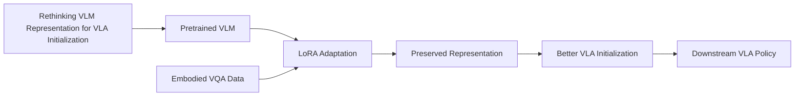

---
tags:
- paper
- domain/embodied_ai
- domain/multimodal_perception
- domain/reinforcement_learning
- domain/vla
- impact/high_value
- impact/solid
- method/foundation_model
- method/reinforcement_learning
- review/auto_tagged
- status/unread
- task/navigation
- task/scene_understanding
- type/analysis
aliases:
- Rethinking VLM Representation for VLA Initialization
- VLA Initialization Study
- VLM for VLA
- LoRA for VLA
- Embodied VQA Injection
- Grounding Egocentric VLA
- Controlled VLA Design
- Pretrained VLM Preservation
paper_id: arxiv:2605.25802
arxiv_id: '2605.25802'
url: https://huggingface.co/papers/2605.25802
pdf_url: https://arxiv.org/pdf/2605.25802.pdf
local_pdf: '[[Rethinking VLM Representation for VLA Initialization.pdf]]'
github: https://github.com/AFeng-x/Rethink_VLA_Initialization
project_page: None
institutions:
- CUHK
- PolyU
- Peking University
- ACE Robotics
publication_date: '2026-05-27'
metadata_publication_date: '2026-05-25'
score: '8.2'
domains:
- embodied_ai
- multimodal_perception
- reinforcement_learning
- vla
methods:
- foundation_model
- reinforcement_learning
tasks:
- navigation
- scene_understanding
paper_type: analysis
impact_band: high_value
reading_status: unread
priority_score: 97
review_status: auto_tagged
next_action: skim_then_decide
year: 2026
---

# Rethinking VLM Representation for VLA Initialization

## 📌 Abstract
Vision-Language-Action (VLA) models widely adopt pretrained Vision-Language Models (VLMs) as policy backbones, yet it remains unclear what kind of pretrained VLM representation is useful as a VLA initialization. In this paper, we study VLA initialization as a controlled representation-design problem along three axes: capability-level embodied VQA supervision, parameter-update strategy, and robot-data pretraining. Our experiments show that the original pretrained VLM representation is a key source of action performance. However, embodied VQA adaptation does not yield uniform gains: its benefit depends on downstream bottlenecks, and gains from different capability domains are not simply additive. For update strategy, LoRA provides a more reliable initialization than Full Finetune, indicating that overly reshaping the pretrained representation can weaken VLA initialization. Robot-data pretraining further improves VLA initialization, with the strongest variant obtained by staged LoRA-based training. Together, these findings suggest that effective VLM-to-VLA adaptation should inject action-relevant embodied and robot-trajectory signals while preserving the pretrained VLM representation that remains useful for action learning.

## 🖼️ Architecture
![[Rethinking VLM Representation for VLA Initialization_arch.png]]

## 🧠 AI Analysis
## Abstract
Vision-Language-Action (VLA) models widely adopt pretrained Vision-Language Models (VLMs) as policy backbones, yet it remains unclear what kind of pretrained VLM representation is useful as a VLA initialization. In this paper, we study VLA initialization as a controlled representation-design problem along three axes: capability-level embodied VQA supervision, parameter-update strategy, and robot-data pretraining. Our experiments show that the original pretrained VLM representation is a key source of action performance. However, embodied VQA adaptation does not yield uniform gains: its benefit depends on downstream bottlenecks, and gains from different capability domains are not simply additive. For update strategy, LoRA provides a more reliable initialization than Full Fine-tune, indicating that overly reshaping the pretrained representation can weaken VLA initialization. Robot-data pretraining further improves VLA initialization, with the strongest variant obtained by staged LoRA-based training. Together, these findings suggest that effective VLM-to-VLA adaptation should inject action-relevant embodied and robot-trajectory signals while preserving the pretrained VLM representation that remains useful for action learning. Code is available at: [GitHub](https://github.com/AFeng-x/Rethink_VLA_Initialization).

## 1. Core Snapshot

### Problem Statement
Vision-Language-Action (VLA) policies for robot control almost always start from a pretrained Vision-Language Model (VLM) checkpoint, but there is surprisingly little systematic understanding of *which properties* of that checkpoint actually help the policy learn actions. The input is an off‑the‑shelf VLM, and the output is a VLA policy that, given a single RGB image and a language instruction, produces a sequence of continuous action chunks. The central bottleneck is not simply more data or a larger model; it is deciding how much, and in which direction, the original VLM representation should be changed *before* any action training begins.

> [!question] Key Question  
> What kind of pretrained VLM representation makes a useful VLA initialization?

To answer this, the paper frames VLA initialization as a deliberate design choice rather than a default. The study decomposes the question into three controllable axes:  
1. **Capability‑level embodied VQA** – which auxiliary question‑answering tasks (and their combinations) are injected during adaptation.  
2. **Parameter‑update strategy** – whether to update all parameters (Full Fine‑tune) or only low‑rank adapters (LoRA).  
3. **Robot‑data pretraining** – whether to also expose the VLM to robot trajectories, either alone or together with VQA signals.  
By fixing the downstream action‑training recipe, any difference in final success rate can be attributed to how the representation was shaped in the pre‑action adaptation stage, isolating the effect of the initialization itself.

### Core Contribution
The central technical claim is that a useful VLA initialization is built by **selectively injecting action‑relevant signals** – specifically a narrow combination of embodied VQA domains (Grounding + Egocentric Understanding) and staged robot‑data pretraining – while **using low‑rank adapters (LoRA) to limit how far the original VLM representation drifts**. The authors provide a controlled three‑axis experimental framework that measures the interplay between domain choice, update strength, and data ordering.  

Evidence is drawn from consistent patterns across three simulated benchmarks, three base VLMs of varying strength, and two action‑head designs (a minimal MLP and a high‑capacity diffusion expert). The results show that:
- ==Full‑parameter finetuning consistently harms initialization quality, often falling below a no‑adaptation baseline==.
- A specific pairwise composition of VQA domains ({Grounding, Egocentric Understanding}) yields the highest single‑domain‑composition gain.
- Staged LoRA‑based training – VQA adaptation followed by robot‑trajectory pretraining – reaches the highest overall success rate (55.2% on RoboCasa GR1).  

Compared with prior work that treats VLM strength or isolated adaptation steps as coarse factors, this contribution makes the *representation design process itself* the object of study and reveals which combinations of signals remain compatible.

### Innovation Origin & Rationale
The study grows out of two key observations from recent work:  
1. Stronger VLMs and higher scores on embodied‑understanding benchmarks do not reliably predict better action policies (VLM4VLA).  
2. Aggressive full‑parameter adaptation can create a visual domain gap between the perception‑side representation and the needs of the downstream control policy (VLASER).  

The authors therefore split the VLM‑to‑VLA pipeline into an explicit **first stage whose only purpose is representation shaping**, and then measure the downstream consequence on action learning under identical conditions. This separation is a direct response to the failure mode in which full finetuning removes transferable knowledge from the original VLM even when the auxiliary task is learned well. The rationale is thus not that embodied signals are always helpful, but that **their helpfulness depends on how much of the original pretrained representation is retained**. This interpretation is strongly supported by the comparison of LoRA versus full finetune across three base VLM sizes: the LoRA advantage shrinks as base model strength decreases, precisely when there is less high‑quality knowledge to preserve.

## 2. Reading Map
This paper is an empirical ablation study at the intersection of vision‑language models and robot policy learning. Researchers who train or adapt VLAs, or who study transfer from general pretraining to embodied tasks, will find the results directly relevant.  

On a first pass, **focus on Section 4** (Experiments), where the three axes are tested through single‑domain results, composition ablations, and robot‑data comparisons. Section 3 describes the study design and can be read once to understand the axes and the two‑stage pipeline. The related work (Section 2) can be skimmed unless the reader needs background on prior VLA systems. The conclusion (Section 5) restates the practical principle in compact form.  

The evaluation is entirely in simulation; readers interested in real‑robot deployment should note that proprioceptive state and action history are deliberately removed to isolate the visual‑language initialization.

## 3. Method Walkthrough

### Inputs, Outputs, And Assumptions
The method receives:  
- A pretrained VLM checkpoint (the base representation $\phi_0$).  
- A collection of embodied VQA examples organised into **seven capability‑oriented domains** (Spatial, Grounding, Plan & Reasoning, Camera Prediction, Egocentric Understanding, Temporal Understanding, Action Next‑Token Prediction).  
- Optionally, robot trajectory data.  

It produces an **adapted VLM checkpoint** that is then used to initialise a VLA policy. The policy itself consists of the (adapted) VLM plus a lightweight action head; it takes a single RGB image and a language instruction and outputs continuous action chunks.  

A core assumption is that **fixing the downstream action‑training recipe** (optimiser, epochs, learning rate, etc.) means that any difference in final success rate can be attributed to the Stage‑1 representation rather than to changes in policy optimisation. Another assumption is that simulated benchmarks with controlled visual and control difficulty suffice to reveal consistent patterns; the authors note that real‑world rollouts would introduce hardware variance that could obscure those patterns.

> [!warning] Assumption  
> All compared initializations are trained with the *exact same downstream* recipe. This is critical for attributing performance gaps to the representation itself.

### Pipeline From Data To Prediction
The pipeline is strictly two‑stage.  
- **Stage 1 (Representation Adaptation)** – The base VLM is adapted on embodied VQA data (or robot trajectories) using either full‑parameter updates or LoRA. The adapted checkpoint, after merging adapters if LoRA was used, becomes $\phi_{\text{init}}$.  
- **Stage 2 (Action Learning)** – $\phi_{\text{init}}$ is used to initialise the VLA policy. The visual‑language backbone is either frozen or lightly tuned together with a freshly initialised action head while the policy learns to predict action chunks from image‑instruction pairs on robot datasets.  

Because adaptation and action learning are completely separated, any performance difference measured at evaluation time can be traced back to how the representation was shaped *before* action training began.

### Key Design Choices
- **Two‑stage separation** – Without this, changes made during policy training would confound the effect of the initial adaptation.  
- **LoRA vs Full Fine‑tune** – LoRA updates only a small set of adapter parameters (a low‑rank perturbation), limiting how far the original weights can move and preserving transferable features that the authors find useful for action learning. Full Finetune is retained as a contrast to measure the cost of aggressive reshaping.  
- **Domain composition under fixed data budget** – All VQA‑based initializations are trained with the same total number of samples. This ensures that gains or losses can be attributed to which capabilities are combined, not to having more data.  
- **Multiple action heads** – A minimal MLP (OpenVLA‑OFT style) makes the policy more sensitive to VLM initialization; a higher‑capacity diffusion expert ($\pi_0$‑style) checks whether the observed effects persist under a more powerful decoder.

## 4. Core Theory And Formulas
The paper does not derive a new training objective or a closed‑form optimisation criterion. Its central concern is empirical: measuring how different choices at the representation‑shaping stage affect downstream success rate. To make the relationships studied by the paper more concrete, we can formalise them mathematically.

Let $\phi_0$ denote the weights of the pretrained VLM. Stage‑1 adaptation produces an initialisation $\phi_{\text{init}}$:
$$
\phi_{\text{init}} = \phi_0 + \Delta(\mathcal{D}_{\text{adapt}}, \mathcal{E}),
$$
where $\mathcal{D}_{\text{adapt}}$ is the adaptation dataset (embodied VQA, robot trajectories, or both), and $\mathcal{E}$ encodes the update strategy (Full Fine‑tune or LoRA). In the LoRA case the perturbation $\Delta$ is constrained to be low‑rank:
$$
\Delta_{\text{LoRA}} = B A, \qquad B \in \mathbb{R}^{d \times r}, \ A \in \mathbb{R}^{r \times k},
$$
with rank $r \ll \min(d,k)$, so that most of $\phi_0$ remains unchanged. Full Fine‑tune allows $\Delta$ to be an arbitrary update of the same dimensions.

Stage‑2 trains a VLA policy $\pi_\theta$ on robot action data $\mathcal{D}_{\text{action}}$, keeping the backbone fixed (or only slightly tuned). The policy’s performance is measured by the task success rate $S$:
$$
S(\phi_{\text{init}}) = \mathbb{E}_{\text{task, seed}} \big[ \text{Success}(\pi_\theta; \phi_{\text{init}}) \big].
$$

The implicit goal of the study is to understand how $S(\phi_{\text{init}})$ varies as a function of:
- the VQA domains included in $\mathcal{D}_{\text{adapt}}$,
- the choice of update strategy $\mathcal{E}$,
- the ordering of VQA and robot‑trajectory data when both are used.

> [!note] No closed‑form optimisation  
> The paper does not propose an explicit loss function to maximise $S$ directly. Instead, **the success‑rate tables themselves serve as the primary signal** for whether a particular initialization design improves or harms action learning.

The core empirical finding can be summarised as:
$$
S(\phi_{\text{LoRA}}) > S(\phi_{\text{FT}}) \quad \text{and} \quad S(\phi_{\text{LoRA}}) \gtrsim S(\phi_0),
$$
especially when the base VLM is strong. This inequality indicates that **preserving the pretrained representation through low‑rank adaptation is more beneficial than aggressive full‑parameter reshaping**. Moreover, the gains from combining VQA domains are not additive; only a specific composition (Grounding + Egocentric Understanding) reliably exceeds the best single domain.

## 5. Architecture, Figures, And Implementation
Two VLA architectures are evaluated to test whether observed initialization effects depend on the action decoder.

**OpenVLA‑OFT style** (main architecture)  
The VLM encodes the visual observation and language instruction into hidden states. A lightweight MLP then directly maps these hidden states to continuous action chunks. This minimal action head makes the policy highly sensitive to differences in the VLM initialization. The design follows the OpenVLA‑OFT variant; details can be found in the [OpenVLA project](https://openvla.org/).

**$\pi_0$‑style diffusion expert**  
A higher‑capacity diffusion‑based action head, inspired by the $\pi_0$ line of work ([Diffusion Policy](https://diffusion-policy.cs.columbia.edu/)), takes additional state and noise inputs and generates actions through an iterative denoising process. This variant tests whether the patterns observed with the MLP head persist when the decoder has more modelling power.

Figure 1 in the paper illustrates the overall four‑step study design: start from a base VLM → apply one of three axes of adaptation in Stage 1 → attach an action head in Stage 2 → evaluate on three benchmarks. Figure 2 visualises the seven VQA domains with example questions and answers, and shows the two action‑head architectures. The bar charts within the paper (e.g., for Libero‑10 and RoboCasa) directly compare LoRA and full finetune across single domains and selected compositions under both action heads, providing a clear visual answer to whether representation preservation consistently outperforms aggressive reshaping.

Implementation details (exact learning rates, batch sizes, LoRA rank, epoch counts) are provided in Appendix A.2 of the original paper and are not reproduced in the main text.

## 6. Experiments And Evidence
The experiments use three simulated benchmarks that capture different control and perception difficulties:  
- **Libero‑10** – long‑horizon single‑arm tasks.  
- **SimplerBridge** – real‑to‑sim visual and control shifts.  
- **RoboCasa GR1** – bimanual humanoid manipulation.  

All policies observe only a single RGB image and a language instruction; proprioception and history are removed to ensure that the measured effect stems from the visual‑language initialization. The primary metric is mean success rate over three random seeds.

> [!example] Key experimental results  
> - **Single‑domain VQA adaptation** (Table 1): On Libero‑10 almost every domain helps, while on SimplerBridge most domains hurt – only Grounding remains near or above baseline. This shows that **the benefit of a domain depends on the downstream bottleneck**.  
> - **Domain compositions** (Table 2): Under a fixed data budget, only the specific pair {Grounding, Egocentric Understanding} exceeds the best single domain. Gains from different capability domains are not simply additive.  
> - **Robot‑data pretraining** (Table 3): Staged adaptation – first the best VQA pair, then robot trajectories with LoRA – reaches the highest score (55.2% on RoboCasa).  
> - **Update strategy** (Figure 3): Full finetune falls below baseline in almost every case, while LoRA improves or stays close to baseline. The advantage of LoRA shrinks as base VLM strength decreases, confirming that preservation is most valuable when the starting representation is already strong.

## 7. Strengths, Limitations, And Failure Cases
**Main strengths**  
- Tightly controlled comparison across multiple axes, with replication of patterns across three base VLMs, two action heads, and three benchmarks.  
- Explicit separation of perception‑side and action‑side signals, which clarifies that even robot‑trajectory pretraining benefits from staged rather than joint updates.  
- Clear empirical demonstration that full‑parameter finetuning often degrades initialization quality, and that the optimal composition of VQA domains is narrow and non‑additive.

**Limitations**  
- Evaluation is restricted to simulation; real‑world rollouts could introduce hardware variance that masks or reverses measured differences.  
- Only a single robot pretraining dataset (AgiBot‑World‑Beta) is used; it is unclear whether the same staged pattern would hold for other robot datasets with different embodiments or scene statistics.  
- Only three base VLMs are tested; the results may not extrapolate to much larger models or different pretraining recipes.  

> [!warning] Open questions  
> The paper does not investigate whether the optimal domain composition changes with data scale, nor does it analyse the internal representation changes beyond success rates. The absence of real‑world validation means that practical deployment guidance remains tentative.

## 8. Reproduction Notes
The complete implementation is available in the paper’s code repository: [GitHub](https://github.com/AFeng-x/Rethink_VLA_Initialization).  

**VQA data sources** are listed in Appendix A.1 of the original paper; exact sample counts and preprocessing steps are not given in the main text.  
**Robot pretraining** uses the AgiBot‑World‑Beta dataset.  
**Evaluation protocol**: All policies observe only a single RGB image and a language instruction, with proprioceptive state and action history removed. Hyperparameters and rollout settings can be found in Appendix A.2. The primary metric is mean success rate averaged over three random seeds.  

Missing details that would affect exact reproduction include the precise LoRA rank schedules used in different experiments, and the exact composition ratios when mixing VQA and robot data. The code repository is the authoritative source for these specifics.

## 9. What To Read Closely
Read Sections 4.1–4.3 in full: they contain the single‑domain results, composition ablations, and robot‑data comparisons that form the core evidence. Examine **Tables 1, 2, and 3** together with the bar charts (Figure 3) that compare LoRA and full finetune; these directly test the three axes. Before interpreting the results, make sure to understand the seven VQA domains by reading Section 3.2 and studying Figure 2.  

On a first pass the related work section can be skimmed, and the conclusion can be read last to see how the authors synthesise the practical principle: *inject action‑relevant signals while preserving the pretrained VLM representation*.

## 10. Research Ideas And Open Questions
Several follow‑up directions emerge from the paper’s findings.

**Scaling the pairwise composition budget**  
The paper fixes the total VQA adaptation data budget. A natural question is whether the advantage of the {Grounding, Egocentric Understanding} pair remains stable when the budget is increased. One could train the same composition at 400k, 800k, and 1.6M samples, initialise identical VLA policies, and record success rates on Libero‑10 and RoboCasa. The metric of interest is whether the relative gain over single domains stays constant or shrinks.  
> [!warning] Risk  
> Changing the total budget alters the number of gradient steps, which may interact with learning‑rate schedules. Controlling for total optimisation steps is essential.

**Transfer to a different robot dataset**  
The paper uses AgiBot‑World‑Beta for robot‑data pretraining. Does the staged LoRA recipe still work when a different embodiment or scene distribution is used? One could repeat the sequential recipe with a second robot dataset (keeping the VQA pair and LoRA settings identical) and compare final success rates. The observation of interest is whether the absolute improvement from staging remains similar or disappears.  
> [!warning] Risk  
> Dataset‑specific visual statistics could dominate the result, making the staging benefit appear or vanish for reasons unrelated to signal ordering.

**Probing internal representations**  
The paper’s appendix mentions frozen‑backbone VQA probes. After each Stage‑1 checkpoint, one could run those probing tasks and record both VQA accuracy and downstream VLA success. The goal is to see whether drops in general VLM capability after full finetune correlate more strongly with action‑performance loss than do gains on the specific VQA tasks.  
> [!warning] Risk  
> Probing tasks may not capture the exact features the action head relies on, weakening the correlation even if the hypothesis is correct.

## Knowledge Graph & Connections

### Related Work Connections

The paper’s emphasis on retaining pretrained VLM features when adapting for robot control resonates directly with findings from [[Not All Features Are Created Equal]]. That mechanistic study shows that the visual pathway of a VLA dominates action generation, with motor programs tightly bound to scene coordinates rather than abstract language. In the current work, the consistent harm from full fine‑tuning and the advantage of LoRA suggest that aggressive adaptation can degrade these crucial visual representations, even when the auxiliary task is learned well. Thus, the mechanistic insight explains *why* the initialization matters: overwriting the visual backbone removes the very features that downstream policies rely on. The difference is that this paper measures the *consequence* of reshaping that representation, while the mechanistic work dissects what the final policy actually uses.

The study’s staged, multi‑domain adaptation approach also connects to [[GEM Generative Supervision for Embodied VLM]]. GEM adds a depth‑map generation task to VLM pre‑training to improve spatial and physical reasoning, essentially injecting one type of embodied signal. The present paper systematically compares seven capability‑oriented VQA domains and shows that only a specific pair (Grounding + Egocentric Understanding) yields a reliable gain under LoRA. This suggests that depth generation could be viewed as another candidate domain, one that may interact with the same non‑additive composition effects observed here. Moreover, the principle of limiting representation drift through low‑rank updates could be applied to GEM’s joint training to preserve the original semantic capabilities while still benefiting from the depth signal.

Finally, the result that LoRA preserves a more useful initialization aligns closely with [[Simple Recipe Works]], which finds that sequential fine‑tuning with LoRA avoids catastrophic forgetting in continual reinforcement learning for VLAs. Both studies observe that LoRA acts as a safe mechanism for injecting new capabilities without overwriting the powerful pretrained backbone. The present paper extends this observation from continual learning to a two‑stage *initialization* setting, demonstrating that the same property holds even before any action training begins. Together, these works imply a general design rule: when building on large pretrained models, parameter‑efficient adaptation is not just a compute‑saving trick but a way to maintain the rich features that transfer to downstream tasks.

### Concept Map

### Questions For Future Reading

1. **Does the optimal domain composition remain stable when the adaptation data budget is scaled up?** The paper fixes the total number of VQA samples across all experiments, so the advantage of the {Grounding, Egocentric Understanding} pair might change if more data were available. Answering this would reveal whether the non‑additive interaction pattern is a fundamental property of these capability domains or an artifact of a fixed, limited budget. Evidence would come from repeating the composition ablation with progressively larger datasets and observing whether the relative gain of this pair over single domains holds, shrinks, or is overtaken by other combinations.

2. **What representation‑level changes explain why full fine‑tuning hurts action learning while LoRA helps?** The paper measures only final success rates; it does not probe internal model states. A mechanistic follow‑up could use the probing tools from [[Not All Features Are Created Equal]] before and after adaptation to see whether full fine‑tuning destroys spatial or object‑centric visual features that are critical for action generation. If so, the correlation between feature retention and downstream performance would solidify the claim that preservation is the key mechanism, not just a statistical observation.

3. **How does the staged LoRA recipe generalise to real‑world robot data and larger, continually evolving VLAs?** The evaluation is entirely in simulation, and only one robot pretraining dataset is used. Real‑world dynamics and sensor noise could change which signals are most beneficial, and future VLAs may have much larger pretrained capacities. Testing this in a physical setup and with models at the 10B+ scale would clarify whether “preserve first, then inject” remains a reliable strategy or whether a different ordering emerges when the base model’s own embodied knowledge is already richer.

---
*Analysis by PaperBrain (x-ai/grok-4.3; refinement: deepseek/deepseek-v4-pro)*

## 📂 Resources
- **Local PDF**: [[Rethinking VLM Representation for VLA Initialization.pdf]]
- [Online PDF](https://arxiv.org/pdf/2605.25802.pdf)
- [ArXiv Link](https://huggingface.co/papers/2605.25802)
