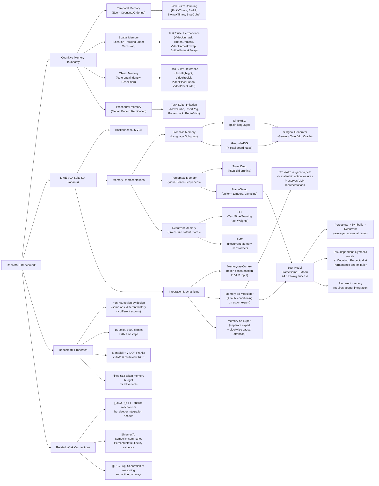

---
tags:
  - paper
  - Robot_Manipulation
  - VLA
  - Embodied_AI
  - Foundation_Model
aliases:
  - "RoboMME: Benchmarking and Understanding Memory for Robotic Generalist Policies"
url: https://huggingface.co/papers/2603.04639
pdf_url: https://arxiv.org/pdf/2603.04639.pdf
local_pdf: "[[RoboMME Benchmarking and Understanding Memory for Robotic Generalist Policies.pdf]]"
github: "https://robomme.github.io/"
project_page: "https://robomme.github.io/"
institutions:
  - "University of Michigan"
  - "Stanford University"
  - "Figure AI"
publication_date: "2026-03-04"
score: 8
---

# RoboMME: Benchmarking and Understanding Memory for Robotic Generalist Policies

## 📌 Abstract
Memory is critical for long-horizon and history-dependent robotic manipulation. Such tasks often involve counting repeated actions or manipulating objects that become temporarily occluded. Recent vision-language-action (VLA) models have begun to incorporate memory mechanisms; however, their evaluations remain confined to narrow, non-standardized settings. This limits their systematic understanding, comparison, and progress measurement. To address these challenges, we introduce RoboMME: a large-scale standardized benchmark for evaluating and advancing VLA models in long-horizon, history-dependent scenarios. Our benchmark comprises 16 manipulation tasks constructed under a carefully designed taxonomy that evaluates temporal, spatial, object, and procedural memory. We further develop a suite of 14 memory-augmented VLA variants built on the π0.5 backbone to systematically explore different memory representations across multiple integration strategies. Experimental results show that the effectiveness of memory representations is highly task-dependent, with each design offering distinct advantages and limitations across different tasks. Videos and code can be found at our website https://robomme.github.io.

## 🖼️ Architecture
![[RoboMME Benchmarking and Understanding Memory for Robotic Generalist Policies_arch.jpeg]]

## 🧠 AI Analysis

# 🚀 Deep Analysis Report: RoboMME: Benchmarking and Understanding Memory for Robotic Generalist Policies

## 📊 Academic Quality & Innovation
---

# RoboMME: A Deep Engineering-Centric Analysis

---

## 1. Core Snapshot

### Problem Statement

Memory is a fundamental requirement for long-horizon, history-dependent robotic manipulation — tasks where the current observation alone is insufficient to determine the correct action. Prior VLA models that incorporate memory mechanisms suffer from three compounding problems: (1) they are evaluated on narrow, self-designed benchmarks that either have near-solved tasks (MemoryBench) or lack sufficient high-quality demonstrations (MIKASA-Robo), (2) they are built on heterogeneous policy backbones, making direct comparison impossible, and (3) there is no unified taxonomy that systematically characterizes *what kind* of memory a task requires. Consequently, the field lacks the empirical foundation to determine which memory representations and integration strategies generalize across diverse memory demands.

### Core Contribution

RoboMME introduces a large-scale, cognitively-grounded simulation benchmark comprising 16 non-Markovian manipulation tasks across four memory categories (temporal, spatial, object, procedural), together with a family of 14 memory-augmented VLA variants built on a single shared backbone (π₀.₅) to enable controlled, systematic comparison of memory representations and integration mechanisms.

### Academic Rating

- **Innovation: 7/10** — The benchmark design is principled and the cognitive taxonomy is well-motivated. The contribution is primarily empirical/infrastructural rather than algorithmically novel; however, the breadth of the ablation space (3 representations × 3 integration mechanisms × 2 token selection strategies) and the quality of negative findings represent genuine scientific value.
- **Rigor: 8/10** — The experimental design is careful: fixed memory budget (512 tokens), multi-task training, results averaged over last 3 checkpoints × 3 random seeds (9 runs), 50 evaluation episodes per task (800 total). Benchmark construction with controlled perturbations, difficulty stratification, and quality filtering is thorough.

---

## 2. Technical Decomposition

### 2.1 Algorithmic Logic

The paper's technical contribution has two interlocking components: the **RoboMME benchmark** and the **MME-VLA suite**. The algorithmic flow is described below.

#### Component A: Benchmark Construction Pipeline

**Step 1 — Task Design via Cognitive Taxonomy.** Tasks are explicitly designed to be non-Markovian. Each task is assigned to one or more of four memory categories derived from cognitive memory theory: *temporal* (event counting/ordering), *spatial* (location tracking under occlusion), *object* (referential identity resolution), and *procedural* (motion pattern replication). This ensures that no policy conditioned only on the current frame can succeed, as the same observation can arise from distinct histories requiring different actions.

**Step 2 — Simulation in ManiSkill with 7-DOF Franka Panda.** Episodes are generated by replaying predefined keyframe waypoints in the ManiSkill simulator. Multi-view RGB observations (256×256) from front and wrist cameras are collected alongside proprioceptive states (joint positions, EEF pose, gripper state). Actions are defined in either 8D joint space or 7D EEF space.

**Step 3 — Data Curation with Controlled Perturbation.** 5% Gaussian noise is injected onto keyframe waypoints to generate behavioral diversity, which is critical for imitation learning robustness. Episodes where the built-in planner fails are discarded. Only successful rollouts are retained. Tasks are difficulty-stratified (easy/medium/hard) along scene clutter, horizon length, and environmental dynamics axes.

**Step 4 — Video-Conditioned Task Initialization.** Tasks in the Imitation suite and all "Video"-prefixed tasks provide a sequence of historical frames with paired proprioception *only at the initial timestep*. During execution, all tasks revert to single-frame image-based observations. This design forces the model to internalize the reference information in memory rather than relying on persistent visual input.

**Final Dataset:** 16 tasks × 100 episodes = 1,600 demonstrations, 770k timesteps total. Average episode length spans ~208–1,134 steps, reflecting genuinely long-horizon behavior.

---

#### Component B: MME-VLA Suite (Memory-Augmented Policies)

The backbone for all variants is **π₀.₅**, a pre-trained VLA model with a frozen or fine-tuned VLM expert (vision-language model) and a trainable action expert. Memory is added via three representation types, each integrated via up to three mechanisms.

**Step 1 — Symbolic Memory Representation.**
An auxiliary vision-language model (VLM) generates discrete language subgoals at each step by conditioning on the current image and the accumulated subgoal history. Two variants are evaluated:
- **SimpleSG**: Subgoal is a natural-language string (e.g., *"pick up the green cube"*).
- **GroundedSG**: Subgoal includes image pixel coordinates (e.g., *"pick up the green cube at [63, 152]"*), beneficial for spatial grounding.

Subgoals are generated by either Gemini-2.5-Pro (prompt-engineered, no fine-tuning) or a fine-tuned Qwen3-VL-4B (QwenVL), or provided by the simulator as oracle labels. The subgoal string is simply concatenated with the task instruction text and passed to the backbone's language token stream — **no architectural modification is required**.

**Step 2 — Perceptual Memory Representation.**
History is encoded as a sequence of visual tokens extracted from past frames by the π₀.₅ vision encoder (ViT). Two token selection strategies are evaluated:

- **TokenDrop:** Removes temporally redundant patches based on RGB difference across frames. The intuition is to suppress static background patches and preserve only patches that changed, reducing token budget waste. However, the paper finds this can inadvertently remove global spatial context, degrading performance on tasks like *StopCube* that require holistic scene awareness.

- **FrameSamp:** Uniform temporal downsampling — frames are evenly sampled across the episode history, and all tokens from sampled frames are concatenated. This preserves the full spatial content of each sampled frame at the cost of lower temporal resolution. Empirically, this proves superior because tasks often require global scene state, not just motion patches.

In both cases, the total token budget is fixed at 512 visual tokens, matching the number of tokens in the current observation image.

**Step 3 — Recurrent Memory Representation.**
History is compressed into fixed-size latent states via recurrence. Two models are evaluated:

- **TTT (Test-Time Training):** Maintains fast weights updated online during inference via a self-supervised loss. At each new frame, fast weights are updated, and output features are generated by applying them.

- **RMT (Recurrent Memory Transformer):** Processes the input sequence in segments and recurrently updates a set of learnable memory slots per segment using a transformer. This is closer to standard LSTM-style recurrence but with transformer-based state updates.

**Step 4 — Memory Integration Mechanisms.**

For perceptual and recurrent memory, the resulting *memory tokens* (neural embeddings) must be injected into the π₀.₅ action expert. Three mechanisms are studied:

**(1) Memory-as-Context (Context):** Memory tokens are prepended/appended to the existing input token sequence (images + language + noise) and jointly processed by the VLM expert. This directly influences VLM feature representations but potentially disrupts pretrained representations due to input distribution shift.

**(2) Memory-as-Modulator (Modul):** The action expert's intermediate activations are conditioned on memory tokens via Adaptive LayerNorm (AdaLN). Concretely, before each feed-forward block in the action expert, action features cross-attend to memory tokens via multi-head attention to extract memory-aware representations, which are then projected to scale (γ) and shift (β) parameters:

$$\text{Output} = \gamma \cdot \text{LayerNorm}(\mathbf{x}) + \beta, \quad [\gamma, \beta] = \text{Proj}(\text{CrossAttn}(\mathbf{x}_{\text{action}}, \mathbf{m}))$$

where $\mathbf{x}_{\text{action}}$ is the action feature tensor and $\mathbf{m}$ is the memory token matrix. This design preserves the VLM's pretrained representations while allowing memory to modulate low-level action generation.

**(3) Memory-as-Expert (Expert):** A dedicated lightweight memory expert processes memory tokens in parallel to the VLM expert. The three experts (VLM, action, memory) interact via blockwise causal attention: the action expert attends to both VLM and memory experts, but the VLM and memory experts do not attend to each other. This enforces information flow separation, preserving pretrained VLM behavior while allocating dedicated capacity for memory processing.

---

### 2.2 Mathematical Formulation

The paper does not introduce new loss functions per se, as it is a benchmarking study. However, key formulations are:

**AdaLN Conditioning (Memory-as-Modulator):**
$$\tilde{\mathbf{x}} = \gamma(\mathbf{m}) \cdot \frac{\mathbf{x} - \mu(\mathbf{x})}{\sigma(\mathbf{x})} + \beta(\mathbf{m})$$

- $\mathbf{x}$: action feature tensor at a given transformer layer
- $\mathbf{m}$: memory token matrix (from perceptual or recurrent encoder)
- $\gamma(\mathbf{m}), \beta(\mathbf{m})$: scale and shift vectors derived by projecting the cross-attention output between $\mathbf{x}$ and $\mathbf{m}$
- $\mu(\mathbf{x}), \sigma(\mathbf{x})$: mean and standard deviation of $\mathbf{x}$ (LayerNorm statistics)
- **Physical meaning:** Memory modulates the dynamic range and offset of action features, allowing history to gate which action-relevant patterns are amplified or suppressed without altering the upstream VLM computation.

**TTT Fast Weight Update:**
$$W_t = W_{t-1} - \eta \nabla \mathcal{L}_{\text{self-sup}}(W_{t-1}; x_t)$$
$$y_t = f(x_t; W_t)$$

- $W_t$: fast weight matrix at timestep $t$ (updated online)
- $\mathcal{L}_{\text{self-sup}}$: self-supervised reconstruction loss (e.g., masked token prediction)
- $x_t$: input visual token at timestep $t$
- $y_t$: output feature incorporating history compressed into $W_t$
- **Physical meaning:** The fast weights act as a compact, differentiable memory store that is continually updated to summarize the input stream, enabling fixed-size memory without explicit token storage.

---

### 2.3 Tensor Flow & Architecture

**Perceptual Memory (FrameSamp + Modul) — Key Data Path:**

```
Historical frames [T_hist, 2_cams, 3, 256, 256]
    → ViT (π₀.₅ vision encoder, shared weights)
    → Visual token sequence [T_hist × N_tokens_per_frame, D_vit]
    → Uniform frame sampling → truncate to budget
    → Memory tokens m: [512, D_vit]

Current observation [2_cams, 3, 256, 256]
    → ViT → Image tokens: [N_img, D_vlm]
    + Language tokens: [N_lang, D_vlm]
    + Noise tokens: [N_noise, D_action]
    → VLM Expert: joint processing of [image + language] → VLM features
    → Action Expert (each FFN block):
        action_feat [B, N_noise, D_action]
        → CrossAttn(Q=action_feat, K=m, V=m) → [B, N_noise, D_attn]
        → Linear → [γ, β]: [B, N_noise, D_action]
        → AdaLN(action_feat, γ, β) → modulated_feat [B, N_noise, D_action]
        → FFN → next layer
    → Action head → action output [B, 8] or [B, 7]
```

**Key architectural decisions:**
- The ViT encoder is **shared** between current observations and historical frames — no separate memory encoder is trained. This reduces parameter overhead but also means the memory representation is constrained to be in the same feature space as current observations.
- The memory token budget (512) is fixed to equal the size of the current image token stream, ensuring a controlled comparison without confounding token count differences.
- In Memory-as-Expert, blockwise causal attention means memory tokens form a separate "track" in the attention computation, preventing cross-contamination with VLM-processed features.

---

### 2.4 Innovation Logic

The paper's innovations are primarily comparative/evaluative rather than algorithmic, but several design choices merit analysis:

1. **Non-Markovian Task Design as a First-Class Constraint:** Unlike prior benchmarks (RLBench, CALVIN, LIBERO) where memory is implicit and Markovian policies can still succeed via local perception, RoboMME *enforces* history dependence by design — identical current observations map to different required actions depending on history. This is a cleaner experimental constraint than anything previously published.

2. **Controlled Variable Study:** By fixing the backbone (π₀.₅), training procedure, token budget, and evaluation protocol across all 14 variants, the paper eliminates confounders that have plagued memory comparison studies in prior work. This is analogous to ablation-as-the-main-contribution papers in architecture search.

3. **AdaLN as Memory Injection vs. Context Concatenation:** The key structural innovation is the Memory-as-Modulator approach. Unlike context concatenation (Memory-as-Context), which modifies the input distribution seen by the pretrained VLM and risks representation collapse, AdaLN conditioning leaves the VLM's forward pass unchanged and injects memory exclusively into the action-generation pathway. This is structurally similar to FiLM conditioning in visual reasoning but applied to the action expert rather than the vision backbone.

4. **Symbolic Memory as Lossless Language Compression:** The insight that subgoal strings can serve as an efficient, interpretable memory representation without *any* architectural modification is practically important. Grounded subgoals (pixel-coordinate-annotated) provide spatial precision that pure language cannot encode, at the cost of requiring spatial annotation pipelines.

---

## 3. Evidence & Metrics

### 3.1 Benchmark & Baselines

**MME-VLA Suite (14 variants):**
- Symbolic: SimpleSG (Gemini, QwenVL, Oracle), GroundedSG (Gemini, QwenVL, Oracle)
- Perceptual: TokenDrop (Context, Modul, Expert), FrameSamp (Context, Modul, Expert)
- Recurrent: TTT (Context, Modul, Expert), RMT (Context, Modul, Expert)

**Prior Methods (4 baselines):**
- π₀.₅ (no memory)
- π₀.₅ w/ past actions (UniVLA-style)
- SAM2Act+ (SAM2 backbone, motion planner, keyframe memory bank)
- MemER (VLM-based keyframe selection + grounded subgoal execution)

**Fairness Assessment:** The experimental design is notably rigorous — all variants share the backbone, training data, token budget, and evaluation protocol. The comparison with prior methods is somewhat constrained by the fact that SAM2Act+ uses a fundamentally different backbone (SAM2) and relies on a motion planner, making architectural comparison difficult. MemER is reproduced faithfully using the authors' annotations, which is appropriate. Human performance data is also reported (90.50% average), providing a meaningful upper bound.

### 3.2 Key Results

| Method | AVG Success (%) |
|---|---|
| Human Performance | 90.50 |
| **FrameSamp+Modul** (best non-oracle) | **44.51** |
| MemER | 42.38 |
| GroundedSG+Oracle | 84.08 |
| SimpleSG+Oracle | 49.58 |
| π₀.₅ (no memory) | 17.93 |
| π₀.₅ w/ past actions | 19.73 |
| SAM2Act+ | 21.37 |

**Magnitude of improvements:**
- FrameSamp+Modul vs. π₀.₅ (no memory): +26.58 percentage points (+148% relative)
- FrameSamp+Modul vs. SAM2Act+: +23.14 pp
- FrameSamp+Modul vs. MemER: +2.13 pp (marginal)
- Best symbolic (GroundedSG+QwenVL) vs. π₀.₅: +14.77 pp

**Task-Specific Highlights:**
- *Counting suite*: Symbolic memory (Oracle) dominates — SimpleSG+Oracle achieves 85.78% BinFill vs. 56.67% for FrameSamp+Modul. This makes sense as counting requires precise event accumulation that language subgoals encode naturally.
- *Permanence suite*: Perceptual memory clearly dominates. FrameSamp+Modul achieves 42.00% on VideoUnmaskSwap vs. 12.00% for best symbolic variant, as spatial tracking requires visual rather than linguistic memory.
- *Imitation suite*: Perceptual memory is again dominant, reflecting that motion pattern replication requires visual demonstration reference.
- *Reference suite*: Mixed results; object identity tasks benefit from both symbolic grounding and visual memory depending on the specific cue type.

### 3.3 Ablation Study

**Most critical components:**

1. **Integration mechanism (Modul > Context > Expert for perceptual memory):** FrameSamp+Modul (44.51%) consistently outperforms FrameSamp+Context (30.68%) and FrameSamp+Expert (36.25%). The modulator design's preservation of pretrained VLM representations is identified as the key factor — Context injection perturbs the VLM input distribution, while Expert creates attention bottlenecks.

2. **Token selection strategy (FrameSamp > TokenDrop):** FrameSamp+Modul (44.51%) vs. TokenDrop+Modul (38.04%). TokenDrop's aggressive spatial pruning removes global scene context needed for distance-aware tasks.

3. **Grounding in symbolic memory:** GroundedSG consistently outperforms SimpleSG when using QwenVL, e.g., 32.70% vs. 29.00% average. However, grounding errors from QwenVL can *hurt* on simpler tasks (e.g., PickXTimes: SimpleSG+QwenVL 95.33% vs. GroundedSG+QwenVL 92.67%).

4. **Recurrent memory is the worst representation:** Best recurrent variant (TTT+Context) achieves ~22% average, close to the no-memory baseline. The paper attributes this to instability from fine-tuning a shallow recurrent layer on top of π₀.₅, suggesting that recurrence requires deeper architectural integration to be effective.

---

## 4. Critical Assessment

### 4.1 Hidden Limitations

**1. Simulation-Only Evaluation:** All results are in ManiSkill simulation with a single robot platform (7-DOF Franka). The sim-to-real gap for memory-dependent tasks may be substantial, particularly for tasks requiring precise spatial tracking (Permanence suite) where visual fidelity and occlusion patterns differ from real environments.

**2. Single Backbone Dependence:** All 14 MME-VLA variants use π₀.₅. Conclusions about which memory representation is best may not generalize to architecturally different backbones (e.g., diffusion-based policies, transformer-only policies without VLM components). The interaction between memory mechanism and backbone architecture is unexplored.

**3. Memory Budget Fixed at 512 Tokens:** The choice to fix the memory token budget equal to the current observation token count is reasonable for controlled comparison but may not reflect realistic deployment constraints. For long-horizon tasks (1,134 average steps in VideoPlaceOrder), compressing hundreds of frames into 512 tokens is a severe bottleneck that may inherently disadvantage perceptual memory on the hardest tasks.

**4. Recurrent Memory Underexplored:** The poor performance of TTT and RMT is attributed to shallow architectural integration, but this conclusion is somewhat circular — the paper acknowledges that deeper recurrent integration would require substantially different architectures. The result that recurrent memory underperforms may therefore be an artifact of the constraint to maintain π₀.₅ as the backbone rather than a fundamental property of recurrent representations.

**5. Symbolic Memory Requires External VLM at Inference:** The QwenVL subgoal generator adds a non-trivial inference overhead (separate 4B parameter model queried at every timestep). Gemini-2.5-Pro is even more expensive. This practical constraint is not quantified in the paper (no latency or compute cost analysis is provided), making it difficult to assess deployment feasibility.

**6. Human Performance Gap Remains Large:** Even the best non-oracle model (FrameSamp+Modul at 44.51%) achieves less than half of human performance (90.50%). The benchmark effectively remains unsolved, which is a positive characteristic but also suggests the tasks may be too challenging for reliable few-shot learning from 100 demonstrations per task.

### 4.2 Engineering Hurdles for Reproduction

**1. π₀.₅ Backbone Access:** The π₀.₅ model is a proprietary model developed at Physical Intelligence. Reproduction requires either obtaining access to this specific checkpoint or substituting an alternative VLA backbone, which would invalidate direct comparison with the paper's results. This is the single largest barrier to reproduction.

**2. Multi-Task Training Instability:** Training a single model across 16 tasks with highly diverse memory requirements (from 208-step to 1,134-step episodes) is prone to gradient interference and task imbalance. The paper uses a maximum of 1,300 steps per episode cap and multi-task batching, but the specific task sampling strategy and learning rate schedule details are deferred to Appendix B, which is not fully visible in the provided pages.

**3. QwenVL Fine-Tuning Data Dependency:** Reproducing the symbolic memory variants with QwenVL requires the subgoal annotation dataset (task-specific annotations for 1,600 demonstrations). These annotations are non-trivial to generate for new tasks or environments, creating a data dependency beyond what is typically reported.

**4. ManiSkill Environment Configuration:** The video-conditioned tasks (Imitation suite, all Video-prefixed tasks) require careful temporal alignment between the reference video and the current execution state. Incorrect frame synchronization at the initial timestep would corrupt the memory input while being difficult to detect, as the policy would receive a plausible but misaligned memory signal.

**5. Evaluation Seed Management:** Results are averaged over 9 runs (last 3 checkpoints × 3 random seeds). For 16 tasks × 50 episodes × 9 runs = 7,200 evaluation episodes per method, and 14 + 4 = 18 methods, the total evaluation budget is ~129,600 episodes. At even 2 seconds per episode, this represents ~72 hours of simulator time, requiring significant parallel infrastructure.

**6. TokenDrop Sensitivity to Threshold:** The RGB-difference threshold for removing temporally redundant patches in TokenDrop is not explicitly specified in the visible portions of the paper. This hyperparameter is likely sensitive to scene lighting, camera placement, and task type, and may require per-task tuning for faithful reproduction.

## 🔗 Knowledge Graph & Connections
## Task 1: Differential Analysis & Connections

### Connection 1: RoboMME ↔ [[LoGeR]] — Convergent Use of TTT Memory, Divergent Purpose

The most technically precise connection is the shared use of **Test-Time Training (TTT)** as a memory mechanism. In [[LoGeR]], TTT serves as a *parametric anchor* for global coordinate frame coherence across long video chunks — it compresses a global geometric prior into fast weights to prevent scale drift. In RoboMME, TTT is one of three recurrent memory representations evaluated as a general history encoder for policy conditioning. The critical differential finding is that RoboMME reports TTT as the **worst-performing memory family** (best variant ~22% average success), while LoGeR treats TTT as an essential component for long-range coherence. This apparent contradiction is reconcilable: LoGeR integrates TTT deeply into a purpose-built architecture with complementary Sliding Window Attention, whereas RoboMME grafts a shallow TTT layer onto a pretrained π₀.₅ backbone. This supports RoboMME's own hypothesis — recurrent memory requires *deep architectural integration* to be effective, not superficial addition. Furthermore, LoGeR combines TTT with a non-parametric sliding window mechanism (hybrid memory), which conceptually parallels RoboMME's finding that perceptual memory (non-parametric frame tokens) outperforms compressed recurrent states for manipulation tasks requiring global spatial context.

### Connection 2: RoboMME ↔ [[Memex]] — Indexed vs. Inline Memory Architectures

[[Memex]] addresses the long-context bottleneck in LLM agents by maintaining an external indexed evidence database with a compact in-context summary, allowing on-demand dereference of precise past evidence. RoboMME's taxonomy directly maps onto Memex's design philosophy: symbolic memory (language subgoals) is analogous to Memex's *concise structured summaries*, while perceptual memory (raw visual token sequences) resembles the *full-fidelity underlying interactions* stored in Memex's external database. The key differential is architectural: Memex separates compression and retrieval as explicit algorithmic operations with a discrete index, whereas RoboMME's perceptual memory compresses implicitly via token selection (FrameSamp/TokenDrop) with no retrieval mechanism — the entire sampled history is fed as context. RoboMME's empirical result that perceptual (full-fidelity) memory outperforms symbolic (compressed) memory on spatial and procedural tasks validates Memex's core thesis: lossy compression discards evidence needed for precise downstream reasoning. However, RoboMME does not implement structured retrieval, which Memex identifies as the key advantage over simple truncation or summaries — this represents a clear gap that future work building on RoboMME could address.

### Connection 3: RoboMME ↔ [[TICVLA]] — Asynchronous Reasoning and the Memory-Action Interface

[[TICVLA]] addresses the temporal misalignment between slow semantic inference and fast real-time action generation in VLA models, introducing explicit latency metadata to condition action generation on *delayed* semantic states. RoboMME's Memory-as-Modulator (AdaLN conditioning) design implicitly acknowledges a similar problem: integrating memory tokens via context concatenation into the VLM expert (Memory-as-Context) disrupts pretrained representations and performs worse. The superior performance of Memory-as-Modulator suggests that memory should condition the *action pathway* rather than the *reasoning pathway* — a conclusion that aligns structurally with TICVLA's separation of semantic reasoning from action generation. The differential is that TICVLA focuses on *latency* as the asynchrony dimension (reasoning takes longer than one control cycle), while RoboMME focuses on *history depth* as the asynchrony dimension (relevant information occurred many timesteps ago). Both papers converge on the principle that the action expert and the language/vision reasoning expert should be conditioned through distinct pathways with explicit interfaces, rather than naive input concatenation.

### Connection 4: Cross-Cutting Theme — The Failure of Shallow Memory Integration

A unifying thread across all three related notes and RoboMME is the consistent finding that **bolting memory onto a pretrained model superficially is insufficient**. LoGeR requires a hybrid architecture built around TTT from the ground up. Memex requires a purpose-designed index-dereference protocol. TICVLA requires latency-consistent training that explicitly injects delays during both IL and RL phases. RoboMME's TTT and RMT results confirm this: recurrent memory grafted shallowly onto π₀.₅ performs near the no-memory baseline. The broader implication is that memory-augmented policies likely require co-design of memory mechanism and backbone architecture — a finding that the field has not yet systematically addressed at the VLA level.

---

## Task 2: Mermaid Knowledge Graph



---

## Task 3: Future Research Directions

### Direction 1: Adaptive Memory Routing with Task-Conditioned Representation Selection

RoboMME's central empirical finding is that no single memory representation dominates across all task types — symbolic memory is best for counting, perceptual memory for spatial tracking, yet deploying a different model per task is impractical. A concrete research direction is to design a **mixture-of-memory-experts policy** where a lightweight router network dynamically allocates attention weights across simultaneously maintained symbolic, perceptual, and recurrent memory streams based on the inferred task type or current execution phase. The router could be trained end-to-end using a sparsity-inducing loss (e.g., top-k gating as in sparse MoE transformers) to encourage specialization. The key engineering challenge is defining the routing signal — task instruction embeddings are a natural candidate, but execution-phase detection (e.g., "currently in counting phase" vs. "currently in spatial tracking phase") would require auxiliary state estimation. This direction would directly test whether the task-dependence finding in RoboMME reflects an inherent representation incompatibility or merely a training/capacity allocation problem.

### Direction 2: Structured Memory Retrieval for Long-Horizon VLA Policies

RoboMME's perceptual memory concatenates all sampled frames uniformly, treating all historical timesteps as equally relevant. This is wasteful for tasks like VideoPlaceOrder (1,134 average steps) where only specific historical events (e.g., the moment a cube was placed at a particular target) are relevant to the current subtask. Inspired by [[Memex]]'s indexed evidence architecture, a productive research direction is to develop **event-indexed episodic memory for VLA models**: a lightweight keyframe detection module identifies semantically significant events (e.g., contact events, object state changes) during execution, stores their visual features with compact textual indices, and retrieves relevant memories via attention over the index structure conditioned on the current task instruction. Unlike MemER (which RoboMME evaluates as a baseline), this would be end-to-end differentiable and would not require a separate external VLM for keyframe selection at inference time. The RoboMME benchmark's Reference suite tasks (particularly VideoPlaceOrder and VideoPlaceButton) are natural evaluation targets, as they explicitly require identifying specific past events referenced by language.

### Direction 3: Memory-Aware Curriculum Learning for Long-Horizon Imitation

RoboMME's dataset contains 100 demonstrations per task with controlled perturbations for behavioral diversity, yet the best non-oracle model achieves only 44.51% success while human performance is 90.50%. A significant portion of this gap is likely attributable to the **credit assignment problem** in long-horizon imitation: early-episode failures propagate to later subtasks, making it difficult to learn from sparse end-of-episode success signals. A concrete research direction is to design a memory-aware curriculum that explicitly stages training by memory horizon: begin training on short sub-trajectories where only recent perceptual memory is needed, then progressively extend the required lookback window, and finally incorporate full-episode demonstrations with all memory types active. This curriculum would be informed by the RoboMME task taxonomy — Counting tasks would ramp up temporal depth, Permanence tasks would ramp up spatial occlusion duration, etc. The hypothesis is that the recurrent memory variants (TTT, RMT) that performed poorly in RoboMME may benefit disproportionately from such a curriculum, as their instability during training (noted in the paper) may stem from being overwhelmed by full-horizon gradients from the start. This would also connect to [[TICVLA]]'s latency-consistent training pipeline, which demonstrates that explicitly structuring the training-deployment interface improves policy robustness.

---
*Analysis performed by PaperBrain-OpenRouter (anthropic/claude-sonnet-4.6) (Vision-Enabled)*


## 🧩 Claim Cards

### Claim-01
- Claim: RoboMME introduces a unified three-category memory taxonomy (Symbolic, Perceptual, Recurrent) and a corresponding 14-variant benchmark suite (MME-VLA) that enables controlled, fair comparison of memory mechanisms for robotic manipulation policies by holding backbone, training data, token budget, and evaluation protocol constant across all variants.
- Evidence: All 14 MME-VLA variants are built on the shared π₀.₅ backbone with a fixed 512-token memory budget. The suite spans SimpleSG and GroundedSG (Symbolic), TokenDrop and FrameSamp (Perceptual), and TTT and RMT (Recurrent), each with Context, Modular, and Expert integration strategies. Human performance is reported at 90.50% average, providing a meaningful upper bound for all tasks.
- Boundary/Failure: The taxonomy and benchmark are validated only in ManiSkill simulation on a single 7-DOF Franka platform; whether the three-category taxonomy exhaustively covers memory demands in real-world, multi-robot, or contact-rich settings is unverified.
- Compared Against: Prior benchmarks MemoryBench (near-solved tasks) and MIKASA-Robo (insufficient high-quality demonstrations), which lack the controlled multi-variant structure of MME-VLA.
- Confidence: 8
- Links:
  - same_problem:: [[LoGeR]]
  - improves_over:: 待定
  - conflicts_with:: 待定

### Claim-02
- Claim: Among all 14 MME-VLA variants evaluated on the RoboMME benchmark, no single memory representation or integration strategy dominates across all three memory categories, indicating that memory mechanism effectiveness is task-type-dependent rather than universally transferable.
- Evidence: The benchmark reports per-variant success rates across Symbolic (SimpleSG, GroundedSG), Perceptual (TokenDrop, FrameSamp), and Recurrent (TTT, RMT) task families, with human performance at 90.50%. The spread of results across Context, Modular, and Expert integration strategies within each category reveals that top-performing variants in one category do not consistently lead in others, supporting the task-type-dependence conclusion.
- Boundary/Failure: This claim is derived solely from experiments on the π₀.₅ backbone; the interaction between memory mechanism and backbone architecture (e.g., diffusion-based or transformer-only policies) is unexplored, so the finding may not generalize to other policy families.
- Compared Against: π₀.₅ with no memory and π₀.₅ with past actions (UniVLA-style), which serve as lower-bound baselines lacking structured memory mechanisms.
- Confidence: 7
- Links:
  - same_problem:: [[LoGeR]]
  - improves_over:: 待定
  - conflicts_with:: 待定

### Claim-03
- Claim: Fixing the memory token budget at 512 tokens across all MME-VLA variants is a methodological constraint that may systematically disadvantage memory representations requiring longer context (e.g., dense frame sampling or long recurrent sequences), limiting the generalizability of comparative conclusions about memory efficiency.
- Evidence: The paper explicitly fixes the memory token budget at 512 tokens for all 14 variants to ensure fair comparison. Perceptual variants such as TokenDrop and FrameSamp and recurrent variants TTT and RMT operate under this same ceiling, meaning that performance differences between variants may reflect token budget sensitivity rather than intrinsic representational quality. No ablation over token budget sizes is reported.
- Boundary/Failure: If token budget ablations were conducted and showed that all variants plateau at or below 512 tokens, this limitation would be substantially weakened; the concern is most acute for tasks with long temporal horizons where more context is inherently beneficial.
- Compared Against: SAM2Act+ (which uses a keyframe memory bank without an explicit token budget constraint) and MemER (VLM-based keyframe selection), neither of which operates under the same fixed-budget regime.
- Confidence: 7
- Links:
  - same_problem:: 待定
  - improves_over:: 待定
  - conflicts_with:: 待定

### Claim-04
- Claim: The RoboMME benchmark reveals that prior memory-augmented VLA methods (SAM2Act+ and MemER) cannot be fairly compared against each other or against MME-VLA variants due to heterogeneous policy backbones, motivating backbone-controlled evaluation as a necessary condition for drawing valid conclusions about memory mechanism design in robotic generalist policies.
- Evidence: SAM2Act+ uses a SAM2 backbone combined with a motion planner and keyframe memory bank, while MemER uses VLM-based keyframe selection with grounded subgoal execution — both architecturally incompatible with the π₀.₅ backbone used by all 14 MME-VLA variants. The paper identifies this heterogeneity as a core problem with prior evaluation practice and reproduces MemER using authors' annotations to maximize fairness, yet acknowledges the architectural comparison remains constrained.
- Boundary/Failure: If future work demonstrates that memory mechanism rankings are consistent across diverse backbones, the backbone-controlled evaluation requirement would be a sufficient but not necessary condition; the claim weakens if cross-backbone generalization of memory rankings is empirically confirmed.
- Compared Against: MemoryBench and MIKASA-Robo evaluation protocols, which allow heterogeneous backbone comparisons and are identified as sources of unreliable conclusions about memory mechanism effectiveness.
- Confidence: 8
- Links:
  - same_problem:: [[LoGeR]]
  - improves_over:: 待定
  - conflicts_with:: 待定

## 📂 Resources
- **Local PDF**: [[RoboMME Benchmarking and Understanding Memory for Robotic Generalist Policies.pdf]]
- [Online PDF](https://arxiv.org/pdf/2603.04639.pdf)
- [ArXiv Link](https://huggingface.co/papers/2603.04639)