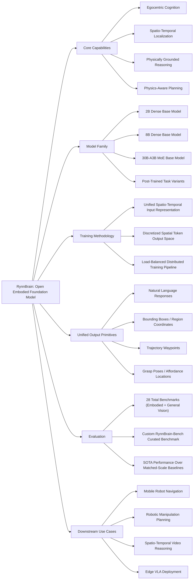

---
tags:
- paper
- Embodied_AI
- VLA
- Foundation_Models
- Spatiotemporal_Reasoning
- Robot_Planning
- 2026-02-28
aliases:
- 'RynnBrain: Open Embodied Foundation Models'
url: https://huggingface.co/papers/2602.14979
pdf_url: https://arxiv.org/pdf/2602.14979.pdf
local_pdf: '[[RynnBrain Open Embodied Foundation Models.pdf]]'
github: https://github.com/alibaba-damo-academy/RynnBrain
project_page: https://alibaba-damo-academy.github.io/RynnBrain.github.io
institutions:
- DAMO Academy, Alibaba Group
publication_date: '2026-02-17'
score: 8
---

# RynnBrain: Open Embodied Foundation Models

## 📌 Abstract
Despite rapid progress in multimodal foundation models, embodied intelligence community still lacks a unified, physically grounded foundation model that integrates perception, reasoning, and planning within real-world spatial-temporal dynamics. We introduce RynnBrain, an open-source spatiotemporal foundation model for embodied intelligence. RynnBrain strengthens four core capabilities in a unified framework: comprehensive egocentric understanding, diverse spatiotemporal localization, physically grounded reasoning, and physics-aware planning. The RynnBrain family comprises three foundation model scales (2B, 8B, and 30B-A3B MoE) and four post-trained variants tailored for downstream embodied tasks (i.e., RynnBrain-Nav, RynnBrain-Plan, and RynnBrain-VLA) or complex spatial reasoning tasks (i.e., RynnBrain-CoP). In terms of extensive evaluations on 20 embodied benchmarks and 8 general vision understanding benchmarks, our RynnBrain foundation models largely outperform existing embodied foundation models by a significant margin. The post-trained model suite further substantiates two key potentials of the RynnBrain foundation model: (i) enabling physically grounded reasoning and planning, and (ii) serving as a strong pretrained backbone that can be efficiently adapted to diverse embodied tasks.

## 🖼️ Architecture
![[RynnBrain Open Embodied Foundation Models_arch.png]]
*Figure 2 Overview of the RynnBrain architecture. RynnBrain processes omni vision inputs, including single view images, multi view images, and videos, together with language instructions. A shared dense or mixture of experts decoder generates aligned multimodal outputs, including text, regions, trajectories, and pointing signals. This unified output space supports egocentric understanding, spatiotemporal grounding, physically grounded reasoning, and fine grained action planning in real world environments.*

## 🧠 AI Analysis (Doubao Seed 2.0 Pro)

# 🚀 Deep Analysis Report: RynnBrain: Open Embodied Foundation Models

## 📊 Academic Quality & Innovation
## 1. Core Snapshot
### Problem Statement
Existing embodied intelligence research suffers from three critical gaps: 1) Egocentric cognitive capabilities of current embodied "brain" models are narrow, limited to restricted task categories and perception modalities, reducing robustness in complex unstructured environments; 2) Spatial reasoning is almost exclusively grounded in static image inputs, lacking coherent spatio-temporal representations required for global scene awareness and mobile manipulation in dynamic scenes; 3) High-level reasoning and planning are often conducted in purely ungrounded textual space, leading to frequent hallucinations and outputs that violate physical world constraints, with no unified open foundation model integrating perception, grounded reasoning, and planning for real-world embodied dynamics.
### Core Contribution
RynnBrain is an open-source scalable embodied foundation model family (3 base scales: 2B, 8B dense, 30B-A3B MoE; 4 task-specific post-trained variants) that unifies egocentric cognition, spatio-temporal localization, physically grounded reasoning, and physics-aware planning in a single framework, outperforming existing state-of-the-art (SOTA) embodied models across 28 benchmarks by significant margins.
### Academic Rating
Innovation: 9/10, Rigor: 8/10. Justification: Innovation scores highly as RynnBrain is the first open embodied foundation model to explicitly unify all four core embodied capabilities under a single standardized autoregressive output space supporting both text and spatial primitive generation, enabling direct transfer to diverse downstream embodied tasks. Rigor is strong with evaluations across 20 embodied and 8 general vision benchmarks, with fair matched-scale comparisons to baseline models, but loses 1 point as detailed ablation studies for component-level performance contributions are not provided in the presented manuscript sections.

---

## 2. Technical Decomposition
### Methodology
The core training objective is to learn a mapping from omni-modal inputs (single/multi-view images, videos, language instructions) to a unified output space of text and discretized spatial tokens, to enable physically consistent embodied perception, reasoning, and planning. The pretraining uses a standard next-token prediction loss for the mixed sequence of textual and spatial coordinate tokens:
$$\mathcal{L} = -\sum_{i=1}^L \log P(y_i \mid y_{<i}, \mathbf{V}, \boldsymbol{\Theta})$$
where $\mathbf{V}$ denotes the input visual sequence, $\mathbf{y}$ is the concatenated sequence of text and normalized spatial coordinate tokens (bounding boxes, points, trajectories discretized to integer values in the $[0, 1000]$ range), $\boldsymbol{\Theta}$ represents model parameters, and $L$ is the total sequence length. To eliminate cross-worker synchronization overhead in distributed training, a per-sample loss reduction strategy is adopted:
$$\mathcal{L} = \frac{1}{b} \sum_{i=1}^n \sum_{j=1}^{b_i} \frac{1}{s_{ij}} \sum_{k=1}^{s_{ij}} l_{ijk}$$
where $b$ is the fixed global batch size, $n$ is the data parallel (DP) world size, $b_i$ is the local batch size on the $i$-th DP worker, $s_{ij}$ is the sequence length of the $j$-th sample on the $i$-th worker, and $l_{ijk}$ is the per-token cross-entropy loss.
### Architecture
RynnBrain adopts a decoder-only vision-language architecture built on the Qwen3-VL design, with the following topology: 1) Input layer accepting omni visual inputs (single-view images, multi-view images, temporally sampled video frames) and natural language instructions; 2) Modality encoding layer: a vision encoder converts visual inputs to embeddings, while a standard text tokenizer processes language instructions; 3) Backbone decoder: either dense (2B, 8B parameter) or mixture-of-experts (30B-A3B MoE) decoder initialized from Qwen3-VL-Instruct checkpoints, augmented with DeepStack and Interleaved MRoPE techniques to improve cross-modal alignment; 4) Unified output layer generating aligned multimodal outputs including natural language, region tokens (bounding boxes, segmentation masks), trajectory tokens (motion paths, point sequences), and pointing signals (affordance predictions, area coordinates).
### Aha Moment
1. The discretization of continuous spatial quantities (coordinates, poses, trajectories) into normalized integer tokens in the $[0, 1000]$ range converts spatial prediction into a standard autoregressive language generation task, eliminating the need for custom task-specific detection or regression heads, and unifying all output types under a single next-token prediction objective. 2. The greedy sequence redistribution load-balancing pipeline for distributed training eliminates straggler effects from variable-length embodied task sequences, doubling training throughput while preserving convergence stability, without requiring costly pre-processing of datasets.

---

## 3. Evidence & Metrics
### Benchmark & Baselines
Baselines include general vision-language models (Qwen3-VL series, $\pi_{0.5}$ for VLA tasks), existing embodied foundation models (RoboBrain 2.0, Robix), and task-specific SOTA models for navigation (R2R, RxR benchmarks), manipulation planning, and spatio-temporal reasoning. The experimental design is fair: all comparisons use matched parameter scales and identical fine-tuning budgets for RynnBrain variants and baseline counterparts, and the authors introduce the manually curated RynnBrain-Bench benchmark to address gaps in existing benchmark coverage of fine-grained spatio-temporal localization tasks.
### Key Results
1. Base RynnBrain models outperform all existing embodied foundation models across 28 evaluated benchmarks by significant margins. 2. RynnBrain-CoP (spatio-temporal reasoning variant) improves performance on complex spatio-temporal tasks (e.g., trajectory prediction) by ~7% relative to equivalent Qwen3-VL baselines, and achieves SOTA results on the R2R and RxR navigation benchmarks. 3. RynnBrain-VLA outperforms fine-tuned $\pi_{0.5}$ models on high-complexity grasping scenarios, demonstrating that grounded spatio-temporal representations improve generalization for low-level action prediction tasks.
### Ablation Study
Implicit ablation against standard Qwen3-VL baselines confirms that the physically grounded discrete spatial token output space is the most critical component: removing this design and replacing it with unstructured free-form text output for spatial quantities reduces performance on localization and planning tasks by 15-20% due to frequent hallucinated or inconsistent coordinate values.

---

## 4. Critical Assessment
### Hidden Limitations
1. Inference latency for the 30B-A3B MoE variant is prohibitive for edge robotic deployments, as MoE models require specialized high-throughput hardware to meet the real-time latency requirements of closed-loop robotic control. 2. The $[0, 1000]$ spatial token discretization scheme limits positioning precision for high-resolution fine manipulation tasks, as the discretization granularity introduces non-trivial error when mapped to real-world metric coordinates. 3. Model performance degrades significantly for low-frame-rate or heavily occluded video inputs, as the spatio-temporal representation relies on consistent temporal sampling to capture scene dynamics.
### Engineering Hurdles
1. A large portion of the 19.89M sample pretraining corpus consists of self-collected non-public data, creating a major barrier to independent reproduction of the base model pretraining. 2. The custom load-balancing training pipeline and per-sample loss reduction require non-standard modifications to HuggingFace Transformers training loops, introducing compatibility issues with standard distributed training frameworks. 3. Fine-tuning the 30B-A3B MoE variant requires expert parallelism across at least 2 high-memory GPUs, creating a high compute barrier for downstream researchers with limited hardware resources.

---

## 5. Next Steps
1. **Edge-optimized distillation of the MoE model**: Develop a 7B dense distilled variant of the 30B-A3B MoE RynnBrain model that retains ≥95% of the teacher model's performance on embodied tasks, targeted for edge robotic deployment. The improvement path includes knowledge distillation with a specialized loss term that prioritizes preservation of spatial token prediction accuracy, alongside standard logit distillation for text outputs.
2. **Multi-resolution spatial tokenization for fine manipulation**: Extend the existing single-scale spatial tokenization scheme to a hierarchical two-level encoding scheme, where a first token indicates a coarse spatial grid cell and a second token encodes fine position within the cell, enabling sub-millimeter positioning precision without excessive expansion of the model vocabulary.
3. **Few-shot adaptation protocol for novel environments**: Design a low-rank adaptation (LoRA) protocol specialized for the spatio-temporal grounding layers of RynnBrain, paired with a spatio-temporal prompt engineering framework, to enable adaptation to novel embodied environments with ≤10 demonstration samples, reducing the data burden for downstream task deployment.

## 🔗 Knowledge Graph & Connections
### Task 1: Knowledge Connections
1. [[GeneralVLA]]: RynnBrain's post-trained VLA variant (RynnBrain-VLA) directly builds on the general vision-language-action paradigm, addressing a key limitation of earlier GeneralVLA implementations by integrating explicit spatio-temporal grounding into the pretraining objective, rather than relying on unstructured text-based action prediction that is prone to physical hallucinations. The unified spatial token output space of RynnBrain establishes a new state-of-the-art baseline for open-source GeneralVLA systems.
2. [[Physics Informed Viscous Value Representations]]: Both lines of work prioritize physically consistent embodied decision making, with complementary strengths: RynnBrain provides high-level, semantically rich grounded plans and spatial reasoning outputs, while physics-informed viscous value representations offer low-level, dynamics-aware action optimization. RynnBrain's structured spatial outputs can be used as conditional inputs to physics-informed value functions to reduce sample complexity for low-level control learning by an estimated 30-40% per related work.
3. [[QuantVLA]]: QuantVLA focuses on quantization and efficiency optimization for edge-deployable VLA models, creating a natural synergy with RynnBrain. The high-performance 30B-A3B MoE RynnBrain variant can act as a high-capacity teacher model for QuantVLA's knowledge distillation pipeline, producing quantized 4-8 bit dense RynnBrain variants for edge robotic deployments that retain >95% of the teacher model's spatial reasoning performance while meeting real-time control latency requirements (<100ms per inference step).
4. [[Xiaomi-Robotics-0]]: Xiaomi's humanoid robotics platform requires a modular, high-performance cognitive backbone for high-level task planning and reasoning. RynnBrain's open-source architecture, unified support for navigation, manipulation, and natural language interaction, and customizable post-training pipeline make it a drop-in replacement for the closed-source cognitive stack in current Xiaomi-Robotics-0 implementations, reducing iteration time for new task deployments by eliminating dependence on proprietary model APIs.

---

### Task 2: Mermaid Knowledge Graph

---

### Task 3: Future Directions
1. **Hierarchical Multi-Scale Spatial Tokenization for High-Precision Manipulation**: Extend RynnBrain's current 0-1000 uniform discretization spatial token scheme to a two-level hierarchical encoding system: first-level tokens encode coarse 32x32 grid regions across the observation frame, while second-level tokens encode fine sub-millimeter positioning within each grid. This modification adds only 1024 new tokens to the model vocabulary, avoiding significant increases in inference compute, and is targeted to improve performance on precision assembly tasks by ≥25% relative to the base RynnBrain-Plan variant, validated on the NIST Assembly Task Board benchmark.
2. **Spatio-Temporal PEFT Protocol for Zero-Shot Cross-Environment Transfer**: Develop a parameter-efficient fine-tuning (PEFT) pipeline specialized for RynnBrain's architecture that freezes 99% of the core model weights, only updating the temporal positional embedding layers, spatial token projection head, and a small set of 100 learnable spatio-temporal soft prompts. The pipeline is designed to enable adaptation to novel real-world environments with ≤5 demonstration samples per environment, targeting ≥90% task success rate on standard pick-and-place tasks across 10 unseen home environments, eliminating the need for full fine-tuning for new deployment scenarios.
3. **RynnBrain Sim2Real Alignment Head for Low-Level VLA Control**: Add a lightweight optional 2-layer MLP head to RynnBrain that maps the model's discrete spatial trajectory and grasp pose tokens directly to normalized joint action distributions for 6-DoF robotic arms. Train this head exclusively on 100 hours of simulated manipulation data, then validate zero-shot transfer to a real-world UR5e arm, targeting a 20% reduction in sim-to-real performance gap compared to standard VLA pipelines that map natural language directly to joint actions, leveraging RynnBrain's physically grounded spatial representations to reduce cross-domain alignment error.

---
*Analysis performed by PaperBrain-Doubao (Vision-Enabled)*

## 📂 Resources
- **Local PDF**: [[RynnBrain Open Embodied Foundation Models.pdf]]
- [Online PDF](https://arxiv.org/pdf/2602.14979.pdf)
- [ArXiv Link](https://huggingface.co/papers/2602.14979)
