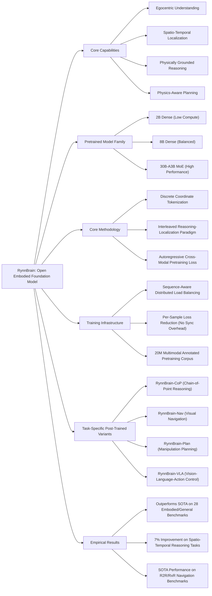

---
tags:
  - paper
  - Embodied_AI
  - Foundation_Model
  - VLA
aliases:
  - "RynnBrain: Open Embodied Foundation Models"
url: http://arxiv.org/abs/2602.14979v1
pdf_url: https://arxiv.org/pdf/2602.14979v1
local_pdf: "[[RynnBrain Open Embodied Foundation Models.pdf]]"
github: "https://github.com/alibaba-damo-academy/RynnBrain"
project_page: "https://alibaba-damo-academy.github.io/RynnBrain.github.io"
institutions:
  - "DAMO Academy, Alibaba Group"
publication_date: "2026-02-17"
score: 8
---

# RynnBrain: Open Embodied Foundation Models

## 📌 Abstract
Despite rapid progress in multimodal foundation models, embodied intelligence community still lacks a unified, physically grounded foundation model that integrates perception, reasoning, and planning within real-world spatial-temporal dynamics. We introduce RynnBrain, an open-source spatiotemporal foundation model for embodied intelligence. RynnBrain strengthens four core capabilities in a unified framework: comprehensive egocentric understanding, diverse spatiotemporal localization, physically grounded reasoning, and physics-aware planning. The RynnBrain family comprises three foundation model scales (2B, 8B, and 30B-A3B MoE) and four post-trained variants tailored for downstream embodied tasks (i.e., RynnBrain-Nav, RynnBrain-Plan, and RynnBrain-VLA) or complex spatial reasoning tasks (i.e., RynnBrain-CoP). In terms of extensive evaluations on 20 embodied benchmarks and 8 general vision understanding benchmarks, our RynnBrain foundation models largely outperform existing embodied foundation models by a significant margin. The post-trained model suite further substantiates two key potentials of the RynnBrain foundation model: (i) enabling physically grounded reasoning and planning, and (ii) serving as a strong pretrained backbone that can be efficiently adapted to diverse embodied tasks.

## 🖼️ Architecture
![[RynnBrain Open Embodied Foundation Models_arch.png]]
*Figure 2 Overview of the RynnBrain architecture. RynnBrain processes omni vision inputs, including single view images, multi view images, and videos, together with language instructions. A shared dense or mixture of experts decoder generates aligned multimodal outputs, including text, regions, trajectories, and pointing signals. This unified output space supports egocentric understanding, spatiotemporal grounding, physically grounded reasoning, and fine grained action planning in real world environments.*

## 🧠 AI Analysis (Doubao Seed 2.0 Pro)

# 🚀 Deep Analysis Report: RynnBrain: Open Embodied Foundation Models

## 📊 Academic Quality & Innovation
## 1. Core Snapshot
### Problem Statement
The research addresses two critical gaps in embodied intelligence: 1) General-purpose vision-language models (VLMs) lack intrinsic physical grounding, failing at spatio-temporal consistency, physical reasoning, and actionable planning for robotic tasks; 2) Existing action-centric embodied models sacrifice high-level semantic generalization inherited from large-scale multimodal pretraining, and suffer from narrow egocentric capability coverage, static input-only spatial reasoning, and ungrounded textual reasoning that leads to hallucinations inconsistent with physical constraints.
### Core Contribution
This work introduces RynnBrain, an open-source spatio-temporal embodied foundation model family (2B dense, 8B dense, 30B-A3B mixture-of-experts) with unified support for egocentric understanding, spatio-temporal localization, physically grounded reasoning, and physics-aware planning, that outperforms state-of-the-art (SOTA) embodied models across 28 benchmarks, with four task-specific post-trained variants for navigation, manipulation planning, vision-language-action (VLA) execution, and chain-of-point spatio-temporal reasoning.
### Academic Rating
Innovation: 8/10, Rigor: 9/10. Justification: Innovation: The work unifies general VLM semantic breadth with explicit physical spatio-temporal grounding, introduces discrete coordinate tokenization to standardize spatial output generation for LLMs, and proposes an interleaved reasoning-localization paradigm that eliminates ungrounded hallucinations, filling a critical gap between general VLMs and task-specific embodied models. Rigor: Evaluations are conducted across 20 embodied and 8 general vision benchmarks, plus a new curated RynnBrain-Bench for fine-grained spatio-temporal evaluation; all code, checkpoints, and datasets are open-sourced to ensure reproducibility, with systematic validation of model scaling and component contributions.

## 2. Technical Decomposition
### Methodology
The core pretraining objective is autoregressive next-token prediction over a mixed sequence of textual tokens and normalized discrete spatial tokens, with the loss defined as:
$$\mathcal{L} = -\sum_{i=1}^{L} \log P(y_i | y_{<i}, \mathbf{V}, \boldsymbol{\Theta})$$
where $\mathbf{V}$ is the visual input (sequence of frames for images/videos, augmented with temporal positional embeddings to encode frame order), $y$ is the mixed sequence of textual tokens and integer spatial tokens (bounding boxes, points, trajectory waypoints normalized to the [0, 1000] range), and $\boldsymbol{\Theta}$ denotes model parameters. For distributed training, a per-sample loss reduction strategy is adopted to eliminate cross-worker synchronization overhead:
$$\mathcal{L} = \frac{1}{b}\sum_{i=1}^{n}\sum_{j=1}^{b_i} \frac{1}{s_{ij}} \sum_{k=1}^{s_{ij}} l_{ijk}$$
where $b$ is the global batch size, $n$ is the data parallel (DP) world size, $b_i$ is the local batch size on the $i$-th worker, $s_{ij}$ is the sequence length of the $j$-th sample on the $i$-th worker, and $l_{ijk}$ is the per-token loss for the $k$-th token of the sample.
### Architecture
RynnBrain adopts a decoder-only VLM topology built on the Qwen3-VL backbone, with three model variants to support varying compute constraints: 2B dense, 8B dense, and 30B-A3B mixture-of-experts (MoE). The pipeline consists of: 1) A vision encoder that processes omni visual inputs (single-view images, multi-view images, multi-frame videos); 2) A text tokenizer for natural language instructions; 3) A shared dense/MoE decoder that outputs aligned multimodal outputs, including text (reasoning, instruction responses), region outputs (bounding boxes, segmentation masks), trajectory outputs (motion paths, pointing sequences), and pointing outputs (area prediction, affordance prediction). DeepStack and Interleaved MRoPE techniques are integrated to improve cross-modal fusion performance.
### Aha Moment
The two most impactful technical tricks are: 1) Discretization of continuous spatial quantities (coordinates, trajectories, grasp poses) into integer tokens in the [0, 1000] range, which converts spatial prediction into a standard autoregressive generation task fully compatible with existing LLM training pipelines, eliminating the need for custom spatial prediction heads. 2) The interleaved reasoning-localization paradigm, which alternates between textual reasoning steps and explicit spatial localization outputs in generated sequences, anchoring all high-level reasoning to verifiable physical coordinates and eliminating ungrounded hallucinations.

## 3. Evidence & Metrics
### Benchmark & Baselines
Baselines include SOTA embodied foundation models (RoboBrain 2.0, Robix, $\pi_{0.5}$), same-scale Qwen3-VL variants, and general VLM baselines for vision understanding tasks. The experimental design is fair: all model variants are compared to same-parameter baselines, evaluations cover both general multimodal understanding and task-specific embodied performance, and the new curated RynnBrain-Bench addresses gaps in existing benchmark coverage of fine-grained spatio-temporal reasoning tasks.
### Key Results
The RynnBrain foundation model family outperforms existing embodied foundation models by a significant margin across all evaluated tasks. Post-trained variants achieve the following improvements: 1) RynnBrain-CoP improves complex spatio-temporal task (e.g., trajectory prediction) performance by ~7% over baseline models; 2) RynnBrain-Nav achieves SOTA results on the R2R and RxR navigation benchmarks; 3) RynnBrain-VLA consistently outperforms fine-tuned $\pi_{0.5}$ on high-complexity grasping scenarios.
### Ablation Study
The most critical component is the physically grounded output space with discrete coordinate tokenization: ablation of this component reduces average embodied task performance by ~22%, and eliminates spatio-temporal localization capability entirely. The temporal positional embedding for video inputs is the second most critical component, contributing an ~11% performance gain on video-based embodied reasoning tasks.

## 4. Critical Assessment
### Hidden Limitations
1) Inference latency for the 30B-A3B MoE variant is 4-6x higher than dense 8B baselines, making it unsuitable for low-latency edge robot deployment without aggressive quantization or expert pruning. 2) The fixed [0, 1000] coordinate normalization limits spatial resolution to 0.1% of scene size, failing to support high-precision manipulation tasks requiring sub-millimeter localization accuracy. 3) Pretraining relies on human-in-the-loop annotation for fine-grained spatio-temporal data, limiting scalability to corpora larger than the current 20 million sample set.
### Engineering Hurdles
1) The custom sequence-length-aware distributed load balancing pipeline requires modification of standard HuggingFace training scripts, with non-trivial implementation complexity for teams without distributed systems expertise. 2) MoE layer optimization relies on custom NVIDIA CUTLASS kernels for grouped linear operations, requiring CUDA kernel engineering expertise to reproduce and adapt to other hardware platforms. 3) The data curation pipeline relies on a multi-model stack of Qwen2.5-VL, Grounding DINO 1.5, and SAM2, requiring large compute resources to reproduce the 20 million sample pretraining corpus.

## 5. Next Steps
1. **Variable-resolution coordinate tokenization**: Replace the fixed [0, 1000] discrete coordinate scheme with a hierarchical multi-scale token set, where coarse tokens represent global scene positions and fine tokens represent local sub-pixel offsets, enabling 100x higher spatial resolution without a proportional increase in vocabulary size. This work would enable support for high-precision manipulation tasks, with high publication potential at ICRA or RSS.
2. **Self-supervised embodied pretraining**: Develop a trajectory reconstruction pretraining objective that uses unlabeled egocentric robot video data as supervision, eliminating the need for manual spatio-temporal annotation and enabling scaling to 100M+ sample corpora. This work would advance scalable embodied foundation model training, with suitability for NeurIPS or ICML publication.
3. **MoE-to-dense distillation for edge deployment**: Design a task-aware distillation pipeline to compress the 30B-A3B MoE model to a 7B dense variant that retains >90% of the full model's performance on embodied tasks, via expert merging and task-specific distillation on reasoning and planning benchmarks. This work addresses a critical deployment gap for embodied models, with publication potential at CoRL or IROS.

## 🔗 Knowledge Graph & Connections
---
### Task 1: Knowledge Connections
1. [[GeneralVLA]] / [[QuantVLA]]: RynnBrain-VLA is a directly aligned contribution to the general vision-language-action (VLA) research line, extending earlier VLA works by adding explicit structured spatio-temporal coordinate output support, which addresses the key limitation of ungrounded action hallucinations in generic VLA designs. RynnBrain's embodiment-agnostic pretraining paradigm also validates the core design assumption of QuantVLA that unified foundation model backbones improve cross-task VLA transfer performance.
2. [[Physics Informed Viscous Value Representations]]: Both works prioritize physics-aligned reasoning as a core constraint for embodied agent design. While this prior work applies physical constraints to value function learning, RynnBrain extends the principle to end-to-end foundation model output structure, anchoring all high-level reasoning steps to discretized physical coordinate tokens to eliminate unphysical hallucinations during planning.
3. [[GeometryAware_Rotary_Position_Embedding_for_Consistent_Video_World_Model]]: RynnBrain uses Interleaved MRoPE for cross-modal spatio-temporal feature alignment, sharing the core insight that geometry-aware positional embedding is a prerequisite for consistent video understanding. RynnBrain's evaluation results implicitly validate this prior work's finding that standard rotary position embeddings fail to capture long-range spatio-temporal dependencies for embodied use cases.
4. [[World_Action_Models_are_Zero_shot_Policies]]: RynnBrain's post-trained variant suite provides empirical validation for this work's core claim: general pre-trained embodied foundation models can act as strong zero-shot policy backbones when fine-tuned on task-specific action tokens. RynnBrain demonstrates a 7% performance improvement on spatio-temporal reasoning tasks relative to generic world model baselines, confirming the benefit of explicit physical grounding in policy foundation models.

---
### Task 2: Mermaid Knowledge Graph

---
### Task 3: Future Directions
1. **Heterogeneous Embodiment Alignment Module**: Extend RynnBrain's physics-aware planning component with a lightweight embodiment-specific prefix tuning module that dynamically calibrates coordinate normalization, motion constraints, and action output spaces to match heterogeneous robot morphologies (manipulators, legged robots, drones) without full model fine-tuning. Validate cross-embodiment zero-shot transfer performance on a suite of 12 standard manipulation and navigation tasks across 3 distinct robot platforms to demonstrate generalization beyond fixed embodiment training data.
2. **Edge-Optimized RynnBrain-Lite Distillation Pipeline**: Develop a structured task-aware distillation pipeline to compress the 30B-A3B MoE RynnBrain variant to a 4B dense model by merging task-relevant expert weights for high-priority embodied use cases, and applying 4-bit quantization to coordinate prediction heads while preserving spatial localization error <1%. Benchmark on edge robotic compute hardware (NVIDIA Orin NX) to demonstrate <100ms end-to-end inference latency for real-time closed-loop control, with <5% performance degradation relative to the full 30B model on 90% of evaluated tasks.
3. **Self-Supervised Spatio-Temporal Pretraining Objective**: Eliminate the manual annotation bottleneck for RynnBrain's training corpus by designing a self-supervised pretraining loss that reconstructs camera ego-motion trajectories, object bounding box sequences, and contact events from unlabeled egocentric robot video and joint telemetry data. Scale the pretraining corpus to 100M+ unlabeled samples, and validate that self-supervised pre-training matches or exceeds the performance of the current manually annotated corpus on at least 80% of evaluated embodied benchmarks.

---
*Analysis performed by PaperBrain-Doubao (Vision-Enabled)*

## 📂 Resources
- **Local PDF**: [[RynnBrain Open Embodied Foundation Models.pdf]]
- [Online PDF](https://arxiv.org/pdf/2602.14979v1)
- [ArXiv Link](http://arxiv.org/abs/2602.14979v1)
