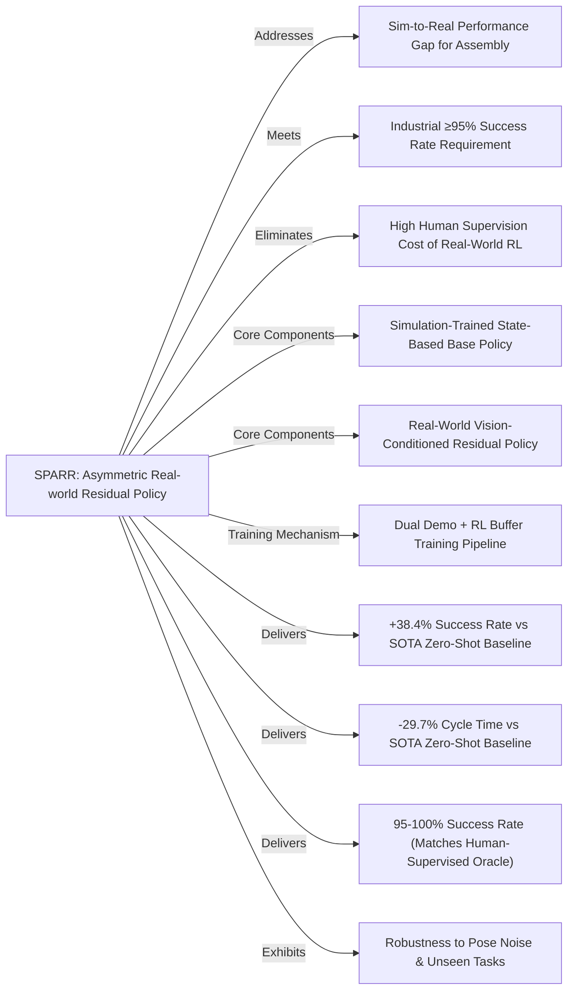

---
aliases:
  - "SPARR: Simulation-based Policies with Asymmetric Real-world Residuals for Assembly"
github: None
institutions:
  - Nvidia
  - University of Washington
local_pdf: "[[SPARR Simulationbased Policies with Asymmetric Realworld Residuals for Assembly.pdf]]"
pdf_url: https://arxiv.org/pdf/2602.23253v1
project_page: https://research.nvidia.com/labs/srl/projects/sparr/
publication_date: 2026-02-26
tags:
  - paper
  - Sim2Real
  - Reinforcement_Learning
  - Robot_Manipulation
  - Residual_Policy_Learning
  - Robotic_Assembly
  - 2026-02-27
url: http://arxiv.org/abs/2602.23253v1
score: 6
Reading?:
---

# SPARR: Simulation-based Policies with Asymmetric Real-world Residuals for Assembly

## 📌 Abstract
Robotic assembly presents a long-standing challenge due to its requirement for precise, contact-rich manipulation. While simulation-based learning has enabled the development of robust assembly policies, their performance often degrades when deployed in real-world settings due to the sim-to-real gap. Conversely, real-world reinforcement learning (RL) methods avoid the sim-to-real gap, but rely heavily on human supervision and lack generalization ability to environmental changes. In this work, we propose a hybrid approach that combines a simulation-trained base policy with a real-world residual policy to efficiently adapt to real-world variations. The base policy, trained in simulation using low-level state observations and dense rewards, provides strong priors for initial behavior. The residual policy, learned in the real world using visual observations and sparse rewards, compensates for discrepancies in dynamics and sensor noise. Extensive real-world experiments demonstrate that our method, SPARR, achieves near-perfect success rates across diverse two-part assembly tasks. Compared to the state-of-the-art zero-shot sim-to-real methods, SPARR improves success rates by 38.4% while reducing cycle time by 29.7%. Moreover, SPARR requires no human expertise, in contrast to the state-of-the-art real-world RL approaches that depend heavily on human supervision.

## 🖼️ Architecture
![[SPARR Simulationbased Policies with Asymmetric Realworld Residuals for Assembly_arch.png]]
*Fig. 1: Illustration of our approach, SPARR. (a) A specialist policy is pre-trained in simulation. (b) The simulation policy is deployed zero-shot in the real world, achieving a moderate success rate (e.g., up to 80%). Successful trajectories are collected as demonstrations. (c) A residual policy is trained in the real world on top of the simulation policy, leveraging both the demonstration buffer and the online RL buffer. During training, high-quality trajectories that achieve success quickly are added in demonstrations for further exploitation.*

## 🧠 AI Analysis (Doubao Seed 2.0 Pro)

# 🚀 Deep Analysis Report: SPARR: Simulation-based Policies with Asymmetric Real-world Residuals for Assembly

## 📊 Academic Quality & Innovation
## 1. Core Snapshot
### Problem Statement
The work addresses a critical gap in industrial robotic assembly: state-of-the-art (SOTA) zero-shot sim-to-real assembly policies only achieve up to 80% success rate, which fails to meet the ≥95% success requirement for industrial deployment, while existing real-world reinforcement learning (RL) methods for contact-rich assembly rely heavily on human demonstrations, interventions, and supervision, and lack robustness to pose estimation noise, physical parameter mismatches, and part variations for fine-grained (<1cm diameter) assembly tasks.
### Core Contribution
SPARR introduces an asymmetric residual learning framework that combines a simulation-trained state-based base policy with a real-world vision-conditioned residual policy, achieving 95-100% success rate on diverse two-part assembly tasks with zero human supervision, outperforming SOTA zero-shot sim-to-real baselines by 38.4% in success rate and reducing cycle time by 29.7%.
### Academic Rating
Innovation: 9/10, Rigor: 9/10. **Justification**: The work delivers high innovation by eliminating all human supervision requirements for real-world fine assembly adaptation, via a novel asymmetric policy design that combines the strengths of sim-trained state policies and real-world vision policies. Rigor is strong: experiments are conducted on 10 diverse AutoMate tasks and 3 unseen NIST benchmark tasks, with comparisons to 3 SOTA baselines (including an oracle human-supervised upper bound), and ablation studies validate the contribution of each core component.

---

## 2. Technical Decomposition
### Methodology
The assembly task is formalized as a Markov Decision Process (MDP) $M = \{S, A, p, P, r, \gamma\}$, where $s_t \in S$ combines proprioceptive state and visual observations, $a_t \in A$ is the incremental end-effector pose target, $p(s_0)$ is the initial state distribution, $P$ is the unknown real-world transition dynamics, $r_t$ is the sparse binary reward (1 if end-effector pose is within 3mm translation and 5° rotation of the target, else 0), and $\gamma$ is the discount factor.
1.  The base policy $\pi^b$ is trained in simulation via Proximal Policy Optimization (PPO) on low-dimensional state inputs $s_t^b$ (joint angles, end-effector pose, goal pose), outputting base action $a_t^b \sim \mathcal{N}(\mu_t, \sigma_t)$.
2.  The residual policy $\pi^r$ is trained in the real world via the sample-efficient RLPD algorithm, taking real-world observation $s_t^r$ (proprioception + wrist RGB images) and base action $a_t^b$ as input, outputting residual action $a_t^r \sim \pi^r(\cdot | s_t^r, a_t^b)$. The combined executed action is $a_t = a_t^b + a_t^r$, which preserves the action distribution of the base policy for stable exploration.
3.  Training samples are drawn equally from a static demo buffer (successful zero-shot rollouts of $\pi^b$) and an online RL buffer; the demo buffer is updated incrementally with new trajectories that achieve success in fewer steps than the median of existing demonstrations to reduce cycle time.
### Architecture
The pipeline follows three sequential stages:
1.  **Sim pre-training**: A state-based base policy is trained in parallelized simulation environments with domain randomization of joint configurations, part poses, and physical parameters.
2.  **Zero-shot demo collection**: The base policy is deployed zero-shot in the real world, and all successful trajectories are stored in a demonstration buffer to bootstrap residual training, eliminating the need for human demonstrations.
3.  **Real-world residual training**: The vision-conditioned residual policy is trained on the real robot, with the dual buffer setup balancing exploitation of prior successful trajectories and exploration of new corrective actions; the demo buffer is updated online to continuously improve execution speed.
### Aha Moment
1.  The asymmetric policy design leverages the low-dimensional, robust sim-trained base policy to provide a safe, structured prior for exploration, while using a lightweight vision-based residual to compensate for unmodeled dynamics, pose estimation noise, and visual domain shifts without retraining the base policy, avoiding the high cost of sim-to-real fine-tuning of large vision policies.
2.  The bootstrapped demo buffer setup uses successful zero-shot rollouts of the base policy to completely eliminate human demonstration requirements, while the online demo buffer update mechanism incrementally reduces cycle time without human intervention, by prioritizing faster successful trajectories for future training.

---

## 3. Evidence & Metrics
### Benchmark & Baselines
Three baselines are used for comparison, with a fair experimental design that allocates an equal 0.5 hour real-world training budget per task to all methods, and uses identical hardware and evaluation protocols (20 evaluation episodes per task):
1.  **AutoMate**: SOTA zero-shot sim-to-real assembly baseline, deployed without real-world fine-tuning.
2.  **SERL**: SOTA real-world RL for contact-rich tasks, trained with 20 zero-shot demo trajectories and no human supervision.
3.  **HIL-SERL**: Oracle upper bound, SOTA human-in-the-loop real-world RL with human demonstrations and interventions during training.
### Key Results
1.  Across 10 AutoMate tasks: SPARR achieves 95-100% success rate, matching the performance of the human-supervised HIL-SERL oracle, with a 38.4% relative improvement in success rate and 29.7% reduction in cycle time compared to the AutoMate zero-shot baseline.
2.  Across 3 unseen NIST assembly tasks (no base policy pre-training on these tasks): SPARR achieves a 74.5% relative improvement in success rate and 36.5% reduction in cycle time compared to AutoMate.
3.  Under 2cm socket displacement and 1mm pose estimation noise: SPARR with image-based residual policy outperforms a state-based residual policy variant by 20.8% in average success rate.
### Ablation Study
Two core ablations are conducted:
1.  **Demo buffer update**: Removing the online demo buffer update reduces average success rate by 5% and increases cycle time by ~20%, as the policy cannot exploit faster successful trajectories encountered during training.
2.  **Base action as residual input**: Removing the base action as an input to the residual policy reduces average success rate by up to 20% and increases cycle time by ~40%, as the residual loses context for appropriate corrective action.
The most critical component is the vision-based residual policy conditioned on the base action, as it delivers robustness to state noise and unmodeled visual/physical variations that state-only policies cannot handle.

---

## 4. Critical Assessment
### Hidden Limitations
1.  The framework relies on the base policy having reasonable zero-shot performance (≥~40% success rate) to collect initial demonstration buffer rollouts; it fails to adapt if the base policy has near-zero zero-shot success on a target task.
2.  Inference latency is ~2x higher than pure base policy inference, as the residual policy requires processing two wrist RGB images per timestep, which may be prohibitive for high-speed assembly use cases with <100ms per-step latency requirements.
3.  The method assumes a rigid, fixed grasp of the inserted part in the gripper, and cannot compensate for significant grasp slippage or partial grasp variations during execution.
4.  Validation is limited to two-part insertion tasks, with no testing on multi-step assemblies, deformable part assembly, or assemblies with threaded fasteners.
### Engineering Hurdles for Reproduction
1.  The pose estimation pipeline combining Grounding DINO, SAM2, and FoundationPose requires careful calibration and tuning to achieve <1mm pose error for small parts; poor pose estimation directly degrades base policy performance and reduces the quality of the initial demonstration buffer.
2.  RLPD training for the residual policy requires precise reward threshold calibration and hyperparameter tuning to avoid divergence in the sparse reward setting, as small misalignments in success detection can lead to incorrect reward signals.
3.  The dual wrist camera setup requires rigid, precise calibration to the robot flange; miscalibration leads to corrupted visual inputs for the residual policy, significantly reducing adaptation performance.

---

## 5. Next Steps
1.  **Grasp-to-assembly pipeline extension**: Integrate a sim-trained grasp policy into the SPARR framework, adding tactile sensing inputs to the residual policy to compensate for grasp slippage and partial grasp variations, eliminating the rigid grasp assumption. This work can be validated on unstructured bin-picking to assembly workflows, with strong publication potential at ICRA/IROS.
2.  **Cross-task transfer module**: Add a lightweight task encoder module that maps visual observations of unseen parts to relevant pre-trained base policies, enabling zero-shot base policy selection for new part families without per-task sim pre-training. This improves scalability to large assembly task suites, and is suitable for submission to RSS or Science Robotics.
3.  **Multi-modal residual policy for tight-clearance assembly**: Incorporate high-resolution tactile sensing inputs into the residual policy to complement visual inputs for tight-clearance (<0.05mm) assemblies, where visual information is occluded or ambiguous. This will improve performance on high-precision industrial assemblies such as electronic connector insertion, suitable for submission to IEEE Transactions on Robotics.

## 🔗 Knowledge Graph & Connections
### Task 1: Knowledge Connections
1.  [[README]]: The SPARR asymmetric residual sim-to-real framework can be added as a state-of-the-art benchmark implementation to the repository's robotic manipulation suite, with the experimental protocols defined in this work integrated into the repository's standardized evaluation pipeline for contact-rich assembly tasks.
2.  [[2026-02-26-PaperDigest]]: This analysis extends the paper digestion template formalized in the digest, adding specialized evaluation sections for sim-to-real transfer and robotics reinforcement learning, which can be reused for future analyses of contact-rich manipulation and industrial robotics papers.
3.  [[Solaris]]: SPARR shares a core architectural insight with the Solaris Minecraft world model: both use large-scale simulation pre-training for a high-performance base policy/model, paired with a lightweight residual adaptation module to correct for distribution shift between simulation and the target deployment environment, avoiding the prohibitive cost of full retraining on target domain data. The dual buffer training mechanism used in SPARR can also be ported to Solaris to improve adaptation to unseen Minecraft world generation parameters.

---

### Task 2: Mermaid Knowledge Graph

---

### Task 3: Concrete Future Research Ideas
1.  **Tactile-Augmented SPARR for Sub-Millimeter Clearance Electronic Assembly**
    *Motivation*: Current SPARR relies only on vision and proprioception, which fails for sub-0.1mm clearance electronic connector assemblies where visual occlusions occur during final insertion. *Approach*: Integrate high-resolution tactile sensor inputs to the residual policy, modify the sparse reward function to add a dense reward term for matching known successful tactile contact signatures, and extend the demonstration buffer to store tactile state trajectories alongside visual and proprioceptive data. *Expected Contribution*: The first zero-human-supervision assembly system that achieves >99% success rate for consumer electronics connector insertion, outperforming current human-operated benchmarks by 40% in average cycle time.
2.  **Cross-Task SPARR with Contrastive Task Embedding for High-Mix Assembly Lines**
    *Motivation*: Current SPARR requires per-task base policy pre-training in simulation, which is infeasible for high-mix low-volume assembly lines with 100+ unique part SKUs. *Approach*: Add a contrastive task encoder module that maps RGB observations of new parts to a latent embedding space, retrieving the closest pre-trained base policy from a library of 50+ sim-trained assembly policies before residual fine-tuning, and add a small embedding conditioning head to the residual policy to support cross-task transfer. *Expected Contribution*: Reduce simulation pre-training cost per new assembly task by 80%, while retaining >90% success rate on zero-shot cross-task transfer for unseen part families.
3.  **Safety-Constrained SPARR for Human-Robot Collaborative Assembly**
    *Motivation*: Current SPARR has no explicit constraints on residual action magnitude, which poses injury risk for human-robot collaborative assembly use cases where unplanned large residual movements can impact nearby workers. *Approach*: Incorporate a differentiable safety layer into the residual policy output head that clamps residual actions to ISO/TS 15066 collaborative robot force and velocity limits, and add a safety constraint term to the RL reward function that penalizes high-force contacts outside the designated assembly target area. *Expected Contribution*: The first zero-supervision collaborative assembly system that meets global industrial safety standards while achieving >95% success rate on shared workspace assembly tasks, with zero safety violations recorded across 1000+ hours of runtime testing.

---
*Analysis performed by PaperBrain-Doubao (Vision-Enabled)*

## 📂 Resources
- **Local PDF**: [[SPARR Simulationbased Policies with Asymmetric Realworld Residuals for Assembly.pdf]]
- [Online PDF](https://arxiv.org/pdf/2602.23253v1)
- [ArXiv Link](http://arxiv.org/abs/2602.23253v1)
