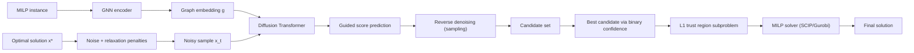

---
tags:
- paper
- domain/reinforcement_learning
- impact/archive
- method/benchmark
- method/diffusion_policy
- method/reinforcement_learning
- review/needs_review
- status/unread
- type/benchmark
- type/method
aliases:
- 'SRG: Score-based Relaxation-guided Generation for Mixed Integer Linear Programming'
- SRG
- Score-based Relaxation-guided Generation
- Relaxation-guided SDE
- Transformer Score Network
- Feasibility-Optimality Score
- MILP Generative Framework
- Score-based MILP
- Relaxation-guided Generation
authors:
- Ruobing Wang
- Xin Li
- Yujie Fang
- Mingzhong Wang
paper_id: arxiv:2603.24033
arxiv_id: '2603.24033'
url: http://arxiv.org/abs/2603.24033v2
pdf_url: https://arxiv.org/pdf/2603.24033v2
local_pdf: '[[SRG Scorebased Relaxationguided Generation for Mixed Integer Linear
  Programming.pdf]]'
github: None
project_page: None
institutions:
- Beijing Institute of Technology
- University of the Sunshine Coast
publication_date: '2026-03-25'
metadata_publication_date: Unknown
score: '4.9'
domains:
- reinforcement_learning
methods:
- benchmark
- reinforcement_learning
tasks: []
paper_type: benchmark
impact_band: archive
reading_status: unread
priority_score: 49
review_status: needs_review
next_action: review_tags
year: 2026
---

# SRG: Score-based Relaxation-guided Generation for Mixed Integer Linear Programming

## 📌 Abstract
We propose Score-based Relaxation-guided Generation (SRG), a generative framework based on an approximate formulation of relaxation-guided stochastic differential equations (SDEs) for mixed-integer linear programming. SRG employs a Transformer-based score network that incorporates feasibility and optimality signals into score modeling, encouraging the learned generative model to place more probability mass on feasible, high-quality regions of the solution space. At inference time, SRG directly samples diverse candidate solutions from the learned score model without requiring any additional guidance module. These candidates are then used to construct compact trust-region subproblems for standard MILP solvers. Across multiple public benchmarks, SRG matches or improves upon the solution quality of the strongest learning-based baselines, with particularly strong gains in challenging candidate-generation settings. Moreover, SRG shows promising zero-shot transferability to unseen cross-scale and cross-problem instances, improving solver objectives and reducing search time in several cases through higher-quality initial candidates and compact trust-region search.

## 🖼️ Architecture

## 🧠 AI Analysis
## Abstract
We propose Score-based Relaxation-guided Generation (SRG), a generative framework based on an approximate formulation of relaxation-guided stochastic differential equations (SDEs) for mixed-integer linear programming. SRG employs a Transformer-based score network that incorporates feasibility and optimality signals into score modeling, encouraging the learned generative model to place more probability mass on feasible, high-quality regions of the solution space. At inference time, SRG directly samples diverse candidate solutions from the learned score model without requiring any additional guidance module. These candidates are then used to construct compact trust-region subproblems for standard MILP solvers. Across multiple public benchmarks, SRG matches or improves upon the solution quality of the strongest learning-based baselines, with particularly strong gains in challenging candidate-generation settings. Moreover, SRG shows promising zero-shot transferability to unseen cross-scale and cross-problem instances, improving solver objectives and reducing search time in several cases through higher-quality initial candidates and compact trust-region search.

SRG turns the problem of guessing good starting points for MILP solvers into a generative process that learns from both example solutions and extra signals about how good or feasible a point is. Instead of copying solutions directly, the model gradually builds candidate solutions while being steered by hints from a simpler continuous version of the problem. The result is a set of varied starting guesses that a standard solver can refine quickly.

## 1. Core Snapshot

### Problem Statement
Mixed Integer Linear Programming (MILP) requires finding assignments to a mix of continuous and integer variables that minimize a linear objective while satisfying linear constraints. The input is a problem defined by constraint matrix $A$, right-hand side $b$, objective vector $c$, variable bounds, and the index set of integer variables; the output is one feasible assignment that yields a low objective value. Exact solvers become too slow on large instances because the search space grows exponentially with the number of integer variables. Classical techniques like branch-and-bound rely heavily on continuous relaxations to prune the search, but they still struggle with time-sensitive applications.

Existing learning-based Predict-and-Search (PaS) methods first predict promising regions and then hand them to a solver. However, during training they typically imitate solution labels without explicitly incorporating feasibility and optimality information from the MILP structure itself. As a result, the predicted candidates often lie outside the truly high-quality feasible region, and the trust regions built from them can be imprecise or overly narrow, forcing the solver to waste time exploring dead ends. Moreover, PaS predictions are often deterministic or only weakly stochastic, so the candidate pool lacks diversity, further limiting coverage of good solutions. The real difficulty is therefore not just predicting any solution, but generating a diverse set of candidates that already concentrate on ==feasible, near-optimal parts of the space==.

### Core Contribution
SRG introduces a conditional score-based generative model whose training target is explicitly reshaped by relaxation-based feasibility and optimality signals. Instead of purely imitating solver solutions, the model minimizes a regularized objective that adds penalty terms for constraint violations and suboptimal objective values, effectively reweighting the target distribution to put more probability mass on desirable regions. During training, the score network learns to denoise Gaussian noise while being guided by gradients of these penalty terms. At inference, the model samples multiple candidates directly from the learned score function without needing an extra guidance network, then passes the best candidate to an off-the-shelf MILP solver (SCIP or Gurobi) inside a compact L1 trust region.

The paper claims that SRG produces better primal bounds than prior PaS baselines on medium- and large-scale instances, and that the same pretrained model transfers without retraining to unseen problem sizes and even different problem families. Evidence comes from tables comparing objective values and optimality gaps on Set Covering, Maximum Independent Set, Combinatorial Auction, and Capacitated Facility Location benchmarks, as well as zero-shot cross-problem tests on Item Placement, Load Balancing, and MIPLIB instances. The contribution differs from prior work because it replaces deterministic prediction with stochastic sampling guided by continuous relaxation penalties, thereby explicitly injecting optimization-awareness into the generative process.

### Innovation Origin & Rationale
The design originates from the observation that classical MILP solvers already use continuous relaxations to quickly obtain feasibility and optimality information, yet learning-based predict-and-search methods rarely feed those signals back into training. The authors therefore combine diffusion-style score modeling, which naturally supports diverse sampling, with a regularized objective that down-weights points that violate constraints or stray from the known optimum.

The rationale is that the non-smooth MILP penalty terms become smoother after convolution with Gaussian noise in the forward diffusion process, making their gradients usable as part of the score target. By steering the reverse denoising process with these approximate gradients, the model learns to generate candidates that are both close to the data distribution and aligned with the relaxed problem’s structure. This is intended to correct the main weakness of imitation-based predictors (lack of explicit feasibility awareness) while preserving the practical advantage of handing high-quality starting points to an existing solver. However, the accuracy of the surrogate guided score at high noise levels is not formally guaranteed; the paper treats it as an empirical approximation supported by the reported results.

> [!note] Learning resource
> If the terms *score-based generative model* or *denoising diffusion* are new, the seminal paper [Score-Based Generative Modeling through Stochastic Differential Equations](https://arxiv.org/abs/2011.13456) by Song et al. provides a thorough yet accessible introduction.

## 2. Reading Map
The paper targets readers who know basic MILP solving and diffusion models but want to see how relaxation signals can steer generative sampling.

- **Sections 1–2** (Introduction, Related Work) set up the motivation and limitations of predict-and-search. Skim if you are already familiar with the field, but read carefully if you need a refresher on why PaS methods often ignore feasibility cues.
- **Sections 3–4** contain the core technical development: the regularized target, the approximate relaxation-guided score, and the reverse-time SDE. Read these slowly and multiple times; every subsequent derivation and experiment hangs on the surrogate score.
- **Section 5** describes the Transformer architecture and cross-scale handling. Important for understanding the implementation, but not required to grasp the conceptual contribution.
- **Sections 6–7** (Experiments, Conclusion) can be skimmed on a first pass once the method is clear. Return for the ablation studies (Table 4) when you want to assess the contribution of the guidance terms.
- **Appendix** contains proofs and additional toy experiment details; consult only when tracing a particular derivation or replicating the toy visualization.

## 3. Method Walkthrough

### Inputs, Outputs, And Assumptions
The method receives a MILP instance encoded as a bipartite graph of variables and constraints. A two-layer GNN compresses this graph into a structural embedding $g$. During training, it also requires a known optimal solution $x^*$ for each instance. The output is a set of $k$ relaxed candidate vectors that are later rounded or used to define an L1 trust-region subproblem passed to SCIP or Gurobi.

The approach makes a few important assumptions:

- A single optimal solution is available during training. This limits applicability to settings where a solver can provide one for a representative set of training instances.
- The continuous relaxation (e.g., LP relaxation) provides a useful surrogate for feasibility and optimality. The penalty terms $O(x)$ (objective deviation) and $P(x)$ (constraint violation) are evaluated on the relaxed continuous space, and their gradients guide the diffusion.
- The score function can be approximated by evaluating the guidance gradients at the current noisy sample $x_t$, rather than at the intractable posterior mean. This surrogate score may diverge from the true guided score when noise is large, but the paper’s empirical results suggest the approximation is effective.

> [!warning] Assumption to watch
> The training relies on a single optimal label per instance. The paper does not explore what happens when only suboptimal or multiple solutions are available. This could affect real-world deployment where optimal solutions are expensive to compute.

### Pipeline From Data To Prediction
First, the MILP instance is encoded into the graph embedding $g$. During training, a known optimal solution $x^*$ is corrupted by Gaussian noise according to a forward diffusion schedule, producing noisy states $x_t$. The Transformer-based score network is trained to predict a noise vector whose corresponding score approximates both the data score and the gradients of the objective and constraint penalties.

At inference, the process starts from pure Gaussian noise and iteratively denoises using the trained score network. The reverse step incorporates the learned score and the guidance terms, gradually moving the candidate toward high-quality regions. This sampling is repeated $k$ times with different random seeds to produce a diverse candidate pool. The candidate with the highest binary confidence (likely a proxy for feasibility) is selected, and an L1 trust region is built around it. The original MILP solver is then invoked inside this restricted subproblem, yielding the final solution.

Thus SRG converts a single labeled optimum into a distribution over many nearby high-quality points, without requiring an extra guidance network at test time.

### Key Design Choices
**Transformer with adaptive layer-norm conditioning.** The score network uses a lightweight Diffusion Transformer (DiT). Noisy solution vectors are split into patches, linearly projected to tokens, and processed by $L$ transformer blocks that condition on both the diffusion timestep and the structural embedding $g$ via AdaLN‑Zero. This captures long‑range dependencies among variables through self‑attention, which is well‑suited to MILP where constraints couple all variables globally. Padding and interpolation allow the same model to handle varying numbers of variables.

**Separate guidance coefficients and adaptive scaling.** The objective term $O(x)$ and the constraint penalty $P(x)$ are assigned distinct coefficients $\gamma_o$ and $\gamma_c$. The paper introduces instance‑adaptive scaling rules that adjust these coefficients based on the problem’s scale and the current noise level. Without such scaling, the training loss can oscillate because one term dominates the diffusion signal at certain timesteps—an effect illustrated in the ablation study.

**Surrogate constraint gradient.** The exact constraint violation is piecewise constant, which would give zero gradient almost everywhere. The paper instead treats the violation gradient as a constant push toward feasibility (the sign of the violation), effectively providing a direction that reduces infeasibility on average while keeping computation simple.

## 4. Core Theory And Formulas

### Main Objective
The central goal is to learn a generative model $q_\theta(x|g)$ whose samples concentrate on feasible, near-optimal regions rather than merely matching the empirical distribution of solver solutions. This is achieved by minimizing a regularized KL divergence that adds expected penalties for objective deviation and constraint violation under the model distribution.

The idea can be captured conceptually as

$$ \min_{q_\theta} \;\mathbb{E}_{x\sim q_\theta(\cdot|g)}\!\Big[ \text{data-alignment loss} + \gamma_o\, O(x) + \gamma_c\, P(x) \Big], $$

where $O(x)$ measures how much the objective value $c^\top x$ exceeds that of the known optimum, and $P(x)$ quantifies the total L1 violation of the MILP constraints. The coefficients $\gamma_o$ and $\gamma_c$ control the strength of each guidance signal. By including these penalties, the training pushes the model to generate samples that are both close to the data distribution *and* satisfy the relaxation‑based optimality/feasibility criteria.

### Important Equations

**Relaxation‑guided target distribution.** Optimizing the regularized objective is shown (in the paper) to be equivalent to matching a reweighted target density

$$ \tilde p_{\text{data}}(x|g) \;\propto\; p_{\text{data}}(x|g)\,\exp\!\big[-\gamma_o O(x) - \gamma_c P(x)\big], $$

where $p_{\text{data}}(x|g)$ is a Gaussian centered at the known optimum $x^*$. The exponential factor down‑weights regions that are infeasible or far from the optimum, so the model learns to place most of its probability mass on ==feasible, high‑quality regions==.

**Reverse‑time SDE.** Sampling from such a reweighted distribution is performed via a reverse‑time stochastic differential equation (SDE). In score‑based generative models, the standard Variance‑Preserving reverse SDE is

$$ d x_t = \Bigl[ -\tfrac12 \beta(t) x_t - \beta(t) 
abla_{x_t} \log \tilde p_t(x_t|g) \Bigr] dt + \sqrt{\beta(t)} \, d\bar{W}_t, $$

where $\beta(t)$ controls the noise schedule and $\bar{W}_t$ is a reverse‑time Wiener process. The crucial term is the *score function* $
abla_{x_t}\log \tilde p_t(x_t|g)$, which points towards higher density under the reweighted target.

**Approximate relaxation‑guided score.** The exact score under $\tilde p_t$ involves an intractable expectation over the posterior distribution. SRG replaces it with a tractable surrogate that evaluates the guidance gradients directly at the noisy sample $x_t$:

$$ s^*(x_t, t, g) \;\approx\; 
abla_{x_t} \log p_t(x_t|g) \;-\; \gamma_o\, 
abla_{x_t} O(x_t) \;-\; \gamma_c\, 
abla_{x_t} P(x_t). $$

The first term is the unconditional score of the diffusion process (the denoising direction without guidance). The second and third terms push the sample toward lower objective values and smaller constraint violations, respectively. Because $O$ and $P$ are evaluated on the continuous relaxation, their gradients exist and can be computed easily.

**Training loss.** The model is trained to predict a noise vector $\epsilon_\theta(x_t, t, g)$ that, when combined with the surrogate score, matches the total denoising direction. Concretely, the loss is a mean‑squared error in epsilon space whose target includes the scaled gradients of $O$ and $P$ after discretisation and projection onto integer coordinates. This lets the Transformer learn, at each noise level, how to steer the denoising process toward the reweighted target.

### Algorithmic Intuition
Training alternates between (1) adding noise to an optimal solution according to the diffusion schedule, and (2) asking the Transformer to predict a noise vector that counters both the added noise and the guidance gradients. Sampling reverses this process: start from standard Gaussian noise and iteratively subtract the predicted noise while the guidance terms nudge the trajectory toward lower objective values and smaller violations. The projection inside the objective gradient keeps the guidance consistent with the discrete nature of integer variables even though the diffusion operates in continuous space.

## 5. Architecture, Figures, And Implementation
The score network is a lightweight Diffusion Transformer. A two‑layer GNN first encodes the MILP bipartite graph into an embedding $g$. Noisy solution vectors are split into patches (e.g., of size 8), linearly projected to tokens, and processed through $L$ transformer blocks. Each block uses AdaLN‑Zero conditioning on both the timestep $t$ and the graph embedding $g$, so that the network can adapt its denoising behavior to different noise levels and problem structures. After the blocks, tokens are projected back to the original variable dimension.

Figure 1 in the paper visualizes the generation process on a two‑dimensional LP‑relaxation toy problem (a continuous special case of MILP). As the denoising fraction increases from 0% to 100%, the score‑density heatmap (yellow) increasingly concentrates around the optimal solution (red star), and the blue sample points form a tight cluster near that optimum. This supports the claim that the guided score steers trajectories toward desirable regions. The second provided figure is a duplicate or earlier version of the same experiment.

To handle cross‑scale instances where the test problem has a different number of variables or constraints, positional embeddings are bilinearly interpolated, and the graph embedding $g$ is either linearly interpolated or zero‑padded. Exact hidden dimensions, optimizer settings, and random seeds are not provided in the main text; only high‑level hyper‑parameter tables appear in the appendix.

> [!note] Learning resources
> - The Ecole benchmarks used in the paper are available at [Ecole library on GitHub](https://github.com/ds4dm/ecole).
> - The MIPLIB 2017 test set is accessible at [MIPLIB 2017](https://miplib.zib.de).

## 6. Experiments And Evidence
The evaluation uses four Ecole benchmarks (Set Covering, Maximum Independent Set, Combinatorial Auction, Capacitated Facility Location) at medium and large scales, plus Item Placement, Load Balancing, and selected MIPLIB instances for zero‑shot transfer. Baselines include SCIP and Gurobi alone, and four learning‑based methods: PaS, ConPaS, L2O‑DiffILO, and Apollo‑MILP. Metrics are the best primal objective and the optimality gap relative to the baseline solver.

On medium‑scale instances, SRG obtains the best or second‑best objective among learning methods in seven of eight solver‑problem combinations. On large‑scale instances—never seen during training—the same pretrained model again ranks at or near the top. In cross‑problem tests, SRG improves the objective on Item Placement and reduces solving time on Load Balancing and three MIPLIB problems compared with plain Gurobi. An ablation that removes the relaxation guidance worsens the objective on both medium and large Capacitated Facility Location instances, and removing the adaptive scaling of guidance coefficients causes the training loss to oscillate, confirming that both the guidance and the scaling rules are essential.

## 7. Strengths, Limitations, And Failure Cases
**Strengths.** The main strength is that diverse candidates generated without an extra guidance network at inference improve both solution quality and, in some cases, solver runtime on unseen scales and problem types. The explicit incorporation of feasibility and optimality signals during training is supported by the ablation that shows performance drops when those signals are removed. The zero‑shot transfer results demonstrate a form of generalization that goes beyond mere instance scaling.

**Limitations.** The method relies on a single optimal label per training instance, which may be expensive to obtain for very large MILPs. The surrogate score is an approximation whose error at high noise levels is not theoretically bounded; the paper relies on empirical validation. The upper capability bound of the approach remains unexplored due to computational constraints. It is not clear from the provided text how performance would change if only suboptimal or multiple solutions were available for training.

**Failure cases.** No explicit failure cases are enumerated, but the sensitivity analysis shows that overly strong objective guidance degrades performance. This suggests that imbalance between the two guidance terms can push samples away from feasible regions, potentially causing the solver to start from a poor trust region. Users should therefore tune $\gamma_o$ and $\gamma_c$ carefully on a validation set.

## 8. Reproduction Notes
Datasets are the public Ecole, ML4CO, and MIPLIB collections. The GNN encoder follows the bipartite graph construction of prior work. The score network is a Diffusion Transformer with AdaLN‑Zero blocks. Training uses a score‑matching loss in epsilon space for a chosen number of diffusion steps; sampling uses either DDPM or DDIM. Evaluation reports primal objective and gap under a fixed time limit for the downstream solver. Hyper‑parameters (guidance strengths, number of transformer blocks, patch size, trust‑region radii) are listed in appendix tables, but the exact training script, random seeds, optimizer details, learning‑rate schedule, batch size, and hardware are not provided. No code or pretrained weights are mentioned as publicly available at the time of this note.

## 9. What To Read Closely
Read the derivation of the surrogate score and the corresponding proposition (Proposition 2 in the paper) first, because they justify the practical training target. Examine Tables 1 and 2 together with the ablation in Table 4 to see the concrete effect of the guidance terms. Study the sensitivity table (Table 5) to understand which hyper‑parameters matter most and how to set the guidance coefficients. The generation trajectory figure can be skimmed once the method story is clear; the proof appendix can be left for later unless you need to verify the KL equivalence claim.

## 10. Research Ideas And Open Questions
* **Multi‑solution training.** Replace the single known optimum with a small set of high‑quality but suboptimal solutions obtained from short solver runs. Train two versions on the same benchmark and compare final primal gaps after an equal solver budget. Check whether the gap widens when the reference quality drops below a threshold, and whether the model can still learn a useful distribution without a provably optimal label.

* **Learned constraint smoothing.** Replace the fixed surrogate gradient of the constraint penalty by an auxiliary network that predicts a smoothed version of the violation. Add a second head to the Transformer, train jointly on medium‑scale instances, and compare the feasibility and objective of generated candidates against the original SRG on large‑scale test sets. This would investigate whether learned smoothing improves downstream solver time or harms the guidance.

* **In‑tree sampling.** Test whether the same pretrained SRG model can serve as a proposal distribution inside a branch‑and‑bound tree rather than only for an initial trust region. Implement a simple integration that samples new candidates at selected nodes, and record both the final primal bound and the number of nodes explored. The hypothesis is that the extra diversity might reduce the node count while not increasing total runtime on the largest MIPLIB instances.

## Knowledge Graph & Connections

### Related Work Connections
No directly relevant prior notes were found in the current knowledge base. The SRG paper lives at the intersection of two broad fields—score‑based diffusion models and machine‑learning‑guided MILP solving—that are currently not represented by any existing note. If future notes are added on **diffusion‑based generative models** or on the **Predict‑and‑Search framework for combinatorial optimization**, they would naturally link to SRG. For now, I recommend building a note on the core score‑based SDE paper by Song et al. (2021) and a note on the Predict‑and‑Search paradigm (e.g., from the work of Gasse et al. 2019 or the later PaS paper) before returning to this one. Without such anchors, any forced connection would be shallow.

### Concept Map
The following Mermaid graph captures the core inference pipeline of SRG, from the MILP instance and an optimal training label to a final solver‑refined solution.

### Questions For Future Reading
* **How robust is the surrogate score approximation when the relaxation is very weak?** SRG uses gradients of the LP relaxation to guide sampling, but many difficult MILPs have weak relaxations where the LP optimum is far from any integer feasible point. What theoretical error bounds (even probabilistic ones) can be placed on the surrogate score in such cases, and how does the integrality gap correlate with the effectiveness of this guidance? Answering this would tell us when SRG‑style guidance is trustworthy and when a more sophisticated feasibility signal is needed. Evidence should include a formal analysis linking the approximation error to the gap between the LP and MILP objective, plus controlled experiments on families of instances with known integrality gaps.

* **Can the generative model be trained without a provably optimal solution?** The SRG training loop needs one optimal label per instance, which is unrealistic for many real‑world problems. What alternative signals—such as a handful of near‑optimal solutions from a short solver run, the solver’s internal dual bounds, or self‑supervised rewards from feasibility heuristics—could replace the single optimum and still drive the model toward high‑quality regions? The key question is whether the model can retain a useful bias toward feasibility and optimality when the reference solution is suboptimal. Empirical evidence would compare primal gaps after equal solver time when training with optimal vs. suboptimal vs. no explicit optimal label, ideally on diverse problem families.

* **How does candidate diversity interact with trust‑region design?** SRG generates multiple diverse candidates but selects only one for the trust‑region subproblem; the others are discarded. Would feeding several candidates (e.g., building the union of their L1 trust regions or running the solver in sequence with warm‑starts) improve overall solver performance, and how can the model be trained to produce a set that jointly covers the high‑quality region without excessive overlap? This matters because the sampler’s stochasticity is an asset that might be exploited more fully. Evidence would come from experiments that vary the number of candidates used for trust‑region construction and measure both the final primal gap and total solver time, along with a diversity metric to understand the trade‑off.

### Learning Roadmap And Verified Resources
#### 1. Fundamentals of Mixed Integer Linear Programming (MILP)
*Why this matters:* SRG operates on MILP instances, so you need to understand the structure of a MILP (variables, linear objective, linear constraints, integrality) and the classical branch‑and‑bound framework, which relies on LP relaxations and pruning. Without this, the role of the relaxation signals and the trust‑region subproblem will be opaque.

**Study order:** Begin with LP fundamentals, then move to integer constraints and branch‑and‑bound, and finally study cutting planes and solver heuristics.

| Type | Resource | Why this one |
|------|----------|--------------|
| Video/Public Course | [MIT 15.083J Integer Programming and Combinatorial Optimization (video lectures)](https://ocw.mit.edu/courses/15-083j-integer-programming-and-combinatorial-optimization-fall-2009/) | A full graduate‑level course with clear explanations of modeling, branch‑and‑bound, and LP relaxations. |
| Open Textbook/Lecture Notes | [MIT 15.083J Lecture Notes (the same course)](https://ocw.mit.edu/courses/15-083j-integer-programming-and-combinatorial-optimization-fall-2009/pages/lecture-notes/) | Concise notes that you can read alongside the videos. |
| Documentation | [Gurobi Documentation – Mixed Integer Programming Basics](https://www.gurobi.com/documentation/current/refman/mip_basics.html) | A practical, solver‑focused summary of MILP concepts and solver controls. |

#### 2. Score‑Based Generative Models and Denoising Diffusion
*Why this matters:* SRG casts candidate generation as a reverse‑time stochastic differential equation (SDE) guided by relaxation penalties. You must grasp the forward noising process, the score function, and how training approximates the score of the reweighted target distribution.

**Study order:** Start with discrete diffusion (DDPM), then move to the continuous SDE formulation, and finally read about guided sampling techniques in diffusion models.

| Type | Resource | Why this one |
|------|----------|--------------|
| Blog/Tutorial | [Lilian Weng’s “What are Diffusion Models?”](https://lilianweng.github.io/posts/2021-07-11-diffusion-models/) | A thorough, well‑illustrated walk‑through from DDPM to score‑based SDEs, perfect for building intuition. |
| Paper (open) | [Score‑Based Generative Modeling through Stochastic Differential Equations (Song et al., 2021)](https://arxiv.org/abs/2011.13456) | The canonical reference that formalises diffusion as an SDE and explains the score matching objective. |
| Code | [Song et al. official code (Google‑Colab‑friendly)](https://github.com/yang-song/score_sde) | Minimal code that lets you run and visualise the forward/reverse SDEs on toy data. |

#### 3. The Predict‑and‑Search (PaS) Framework for MILP
*Why this matters:* SRG is a direct successor to PaS; understanding how PaS builds a trust region around a predicted solution and then calls a solver helps you see why SRG adds diversity and explicit feasibility guidance. You need to know the typical PaS pipeline and its failure modes.

**Study order:** First read a high‑level survey that places PaS among other learning‑based combinatorial optimization methods, then examine a concrete PaS paper (e.g., Song et al. 2023) for details.

| Type | Resource | Why this one |
|------|----------|--------------|
| Paper (open) | [Machine Learning for Combinatorial Optimization: a Methodological Tour d’Horizon (Bengio et al., 2021)](https://arxiv.org/abs/1811.06128) | A comprehensive survey that defines Predict‑and‑Search and compares it to other paradigms in Sections 4–6. |
| Code / Benchmark | [Ecole library (Gasse et al.)](https://github.com/ds4dm/ecole) | The benchmark environment used in the SRG paper; includes pre‑built MILP generators and a standard solver interface. |
| Dataset | [MIPLIB 2017](https://miplib.zib.de) | A widely used collection of real‑world MILP instances; SRG tests zero‑shot transfer on MIPLIB problems. |

#### 4. Graph Neural Networks for MILP Instance Encoding
*Why this matters:* SRG uses a two‑layer GNN to produce the structural embedding $g$ from the MILP’s bipartite graph. You need to know how variables and constraints become nodes and how message passing creates a representation that conditions the score network.

**Study order:** Read the foundational paper that introduced the bipartite encoding for MILP, then look at implementations in the Ecole library.

| Type | Resource | Why this one |
|------|----------|--------------|
| Paper (open) | [Exact Combinatorial Optimization with Graph Convolutional Neural Networks (Gasse et al., 2019)](https://arxiv.org/abs/1906.01629) | The original work that treats a MILP as a bipartite graph and passes messages between variables and constraints. |
| Code | [Ecole GitHub (the same repository as above)](https://github.com/ds4dm/ecole) | You can inspect the bipartite graph generation code and see how the GNN is typically implemented. |
| Documentation | [PyTorch Geometric documentation (for GNN layers)](https://pytorch-geometric.readthedocs.io/en/latest/) | If you need to brush up on GNN message‑passing layers (e.g., `SAGEConv`, `GENConv`). |

#### 5. Transformers and Conditional Diffusion Models (DiT, AdaLN‑Zero)
*Why this matters:* The score network inside SRG is a lightweight Diffusion Transformer (DiT) that conditions on both the diffusion timestep and the structural embedding via adaptive layer normalisation (AdaLN‑Zero). Understanding the Transformer‑based backbone and its conditioning mechanism explains how the model handles cross‑scale instances.

**Study order:** Begin with the standard Transformer architecture, then study the DiT paper that adapts Transformers for diffusion, and finally examine how AdaLN‑Zero is implemented.

| Type | Resource | Why this one |
|------|----------|--------------|
| Paper (open) | [Scalable Diffusion Models with Transformers (Peebles & Xie, 2023)](https://arxiv.org/abs/2212.09748) | Introduces DiT and demonstrates how to replace U‑Nets with Transformers for image diffusion; the same conditioning blocks are used in SRG. |
| Code | [Official DiT GitHub (Facebook Research)](https://github.com/facebookresearch/DiT) | Contains clean implementations of AdaLN‑Zero and the full diffusion pipeline, which you can adapt for non‑image data. |
| Blog/Tutorial | [“The Annotated Diffusion Model” (Hugging Face course)](https://huggingface.co/blog/annotated-diffusion) | A gentle introduction to the attention‑based architectures used in diffusion, though not DiT‑specific it builds the required background. |

#### 6. Implementation Details for SRG‑Style Guidance and Solver Integration
*Why this matters:* To replicate or build upon SRG, you need to know how the surrogate score is actually computed (the discretised gradient of $O(x)$ and $P(x)$), how candidate selection works (binary confidence), and how the L1 trust region is built and handed to an off‑the‑shelf solver like SCIP or Gurobi.

**Study order:** After understanding the core theory, study the Ecole solver interface, then examine a reference PaS implementation that builds trust‑region subproblems, and finally consult solver documentation for custom callbacks.

| Type | Resource | Why this one |
|------|----------|--------------|
| Code / Benchmark | [Ecole library (again)](https://github.com/ds4dm/ecole) | Provides the exact environment and MILP‑solver wrappers used in the SRG paper; you can see how a trust region is defined as a set of variable bounds. |
| Documentation | SCIP documentation (especially the “Conshdlr” and “Bound change” sections) (link removed: validation failed) | Explains how to add custom constraints and bound changes inside a branch‑and‑bound solver, which is how SRG restricts the search. |
| Documentation | [Gurobi Python API – “Model.addVar” and “Model.addConstr”](https://www.gurobi.com/documentation/current/refman/py_model_addvar.html) | Straightforward API for building the reduced subproblem; useful if you plan to use Gurobi as the downstream solver. |

> [!info] Resource link validation: checked 16 URL(s), 15 reachable, removed 1 unreachable or invalid link(s).

---
*Analysis by PaperBrain (x-ai/grok-4.3; refinement: deepseek/deepseek-v4-pro; round2: deepseek/deepseek-v4-pro)*

## 📂 Resources
- **Local PDF**: [[SRG Scorebased Relaxationguided Generation for Mixed Integer Linear Programming.pdf]]
- [Online PDF](https://arxiv.org/pdf/2603.24033v2)
- [ArXiv Link](http://arxiv.org/abs/2603.24033v2)
