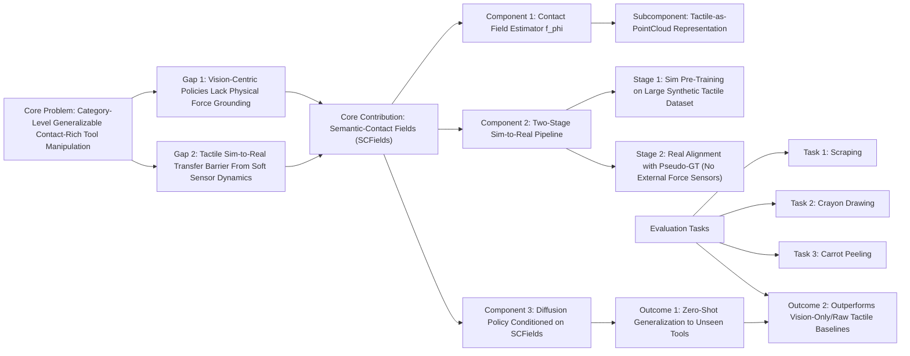

---
tags:
  - paper
  - Diffusion_Model
  - Embodied_AI
  - Sim2Real
  - Robot_Manipulation
aliases:
  - "Semantic-Contact Fields for Category-Level Generalizable Tactile Tool Manipulation"
url: http://arxiv.org/abs/2602.13833v1
pdf_url: https://arxiv.org/pdf/2602.13833v1
local_pdf: "[[SemanticContact Fields for CategoryLevel Generalizable Tactile Tool Manipulation.pdf]]"
github: "None"
project_page: "https://kevinskwk.github.io/SCFields"
institutions:
  - "Robotics & Autonomous Systems Division, Institute for Infocomm Research, A*STAR, Singapore"
  - "Show Lab, National University of Singapore, Singapore"
  - "College of Computing and Data Science, Nanyang Technological University, Singapore"
publication_date: "2026-02-14"
score: 7
---

# Semantic-Contact Fields for Category-Level Generalizable Tactile Tool Manipulation

## 📌 Abstract
Generalizing tool manipulation requires both semantic planning and precise physical control. Modern generalist robot policies, such as Vision-Language-Action (VLA) models, often lack the high-fidelity physical grounding required for contact-rich tool manipulation. Conversely, existing contact-aware policies that leverage tactile or haptic sensing are typically instance-specific and fail to generalize across diverse tool geometries. Bridging this gap requires learning unified contact representations from diverse data, yet a fundamental barrier remains: diverse real-world tactile data are prohibitive at scale, while direct zero-shot sim-to-real transfer is challenging due to the complex dynamics of nonlinear deformation of soft sensors.
  To address this, we propose Semantic-Contact Fields (SCFields), a unified 3D representation fusing visual semantics with dense contact estimates. We enable this via a two-stage Sim-to-Real Contact Learning Pipeline: first, we pre-train on a large simulation data set to learn general contact physics; second, we fine-tune on a small set of real data, pseudo-labeled via geometric heuristics and force optimization, to align sensor characteristics. This allows physical generalization to unseen tools. We leverage SCFields as the dense observation input for a diffusion policy to enable robust execution of contact-rich tool manipulation tasks. Experiments on scraping, crayon drawing, and peeling demonstrate robust category-level generalization, significantly outperforming vision-only and raw-tactile baselines.

## 🖼️ Architecture
![[SemanticContact Fields for CategoryLevel Generalizable Tactile Tool Manipulation_arch.png]]
*Fig. 1: Semantic-Contact Fields (SCFields) Overview. 1. Multimodal Inputs: The system takes RGB-D observations and tactile readings from GelSight sensors. 2. SCFields Generation: Our unified perception module fuses these inputs into a dense point cloud representation containing both category-level semantics (blue/green heatmap) and extrinsic contact force vectors (green arrows). 3. Policy Execution: A diffusion policy conditioned on the SCFields enables zero-shot generalization to novel tools variants (e.g., peelers of different shapes) in contact-rich tasks by reasoning about functional affordance and contact forces simultaneously.*

## 🧠 AI Analysis (Doubao Seed 2.0 Pro)

# 🚀 Deep Analysis Report: Semantic-Contact Fields for Category-Level Generalizable Tactile Tool Manipulation

## 📊 Academic Quality & Innovation
## 1. Core Snapshot
### Problem Statement
The work addresses two critical gaps in generalizable tool manipulation: (1) Existing vision-centric generalizable policies (e.g., GenDP, D3Field) are physically naive, failing at contact-rich tasks requiring precise force regulation, while existing tactile-aware policies are instance-specific and cannot generalize across diverse tool geometries; (2) Large-scale real-world tactile data collection is prohibitively expensive, and pure simulation-trained tactile models fail to transfer to real hardware due to unmodeled nonlinear deformation dynamics of soft tactile sensors, making zero-shot sim-to-real transfer infeasible for contact-rich tasks.
### Core Contribution
This work proposes Semantic-Contact Fields (SCFields), a unified 3D representation fusing dense category-level semantic affordance features and explicit extrinsic contact force estimates, paired with a data-efficient two-stage sim-to-real training pipeline that enables zero-shot cross-geometry generalization to unseen tool variants for contact-rich manipulation, without requiring expensive ground-truth force sensing or large-scale real tactile data.
### Academic Rating
Innovation: 9/10, Rigor: 8/10. **Justification**: Innovation is very high as this is the first framework to unify semantic affordance modeling with dense explicit contact force estimation for category-level tool manipulation, with a low-cost alignment step that solves the long-standing sim-to-real tactile transfer gap. Rigor is strong with comprehensive ablations, evaluations across 3 distinct real-world contact-rich tasks, and comparisons to 8+ state-of-the-art baselines; the score is capped at 8/10 due to limited evaluation on only 3 tool categories and reliance on pre-trained category-specific semantic encoders.

## 2. Technical Decomposition
### Methodology
The work formalizes two core learning objectives:
1. **Contact Field Estimation**: Train a multimodal perception model $f_\phi$ that maps raw inputs (tool point cloud $P_{tool}$, environment point cloud $P_{env}$, tactile readings $T$, proprioceptive state $q$) to a dense contact field on $P_{tool}$, where each point $p_i \in P_{tool}$ is assigned a contact probability $c_i \in [0,1]$ and 3D extrinsic force vector $\mathbf{f}_i \in \mathbb{R}^3$. The training loss for $f_\phi$ is:
   $$\mathcal{L}_{total} = \lambda_{prob}\mathcal{L}_{prob} + \lambda_{force}\mathcal{L}_{force}$$
   where $\mathcal{L}_{prob}$ is Focal Loss (to handle imbalanced contact/non-contact class distribution), and $\mathcal{L}_{force}$ is a weighted sum of Adaptive MSE (for force magnitude) and Cosine Similarity loss (for force direction).
2. **Generalizable Policy Learning**: Train a diffusion policy $\pi_\theta$ conditioned on fused SCFields representations (contact field outputs + pre-trained 3D semantic features) to generate end-effector action sequences $a_{t:t+H}$, with the objective of minimizing standard diffusion denoising score matching loss, invariant to tool instance geometry.
### Architecture
The system pipeline is split into two decoupled modules:
1. **Contact Field Learning**: (a) *Sim Pre-training*: $f_\phi$ is pre-trained on a 320,000 frame synthetic dataset generated via a multi-simulator pipeline: IsaacGym (rigid body dynamics) + TacSL (GelSight sensor simulation) + Open3D (signed distance function calculation) + PyBullet (ground truth force extraction). (b) *Real-World Alignment*: $f_\phi$ is fine-tuned on a small set of real-world interactions with pseudo-labels generated via geometric heuristics (for contact probability) and Second-Order Cone Programming (for force vector optimization, no external force sensors required).
2. **Policy Learning**: (a) *SCFields Construction*: Outputs of the aligned contact field model are fused with pre-trained 3D semantic features from GenDP to form the unified SCFields representation. (b) *Diffusion Policy Training*: SCFields are fed into a PointNet++ backbone to extract global geometric-semantic features, which condition a 3D diffusion policy to output closed-loop end-effector action trajectories.
### Aha Moment
1. **Tactile-as-PointCloud Representation**: Instead of processing tactile data as 2D images with separate encoders, the framework maps tactile sensor markers to 3D geometric points in the world frame, fusing them directly with scene point clouds via PointNet++. This eliminates the need for explicit sensor-pose calibration and implicitly learns the mapping between tactile deformation, tool geometry, and contact state.
2. **Sensor-Aligned Pseudo-Labeling**: The real-world alignment step uses heuristic-based pseudo-labeling (no ground-truth force/torque sensors required) to adapt simulation-trained models to real tactile sensors, reducing real data requirements by orders of magnitude and avoiding the cost of instrumenting arbitrary tools for force measurement.

## 3. Evidence & Metrics
### Benchmark & Baselines
For contact field evaluation, baselines include: Neural Contact Fields (NCF), No-Tactile ablation, 2D CNN Tactile Encoder ablation, BCE Loss ablation, Sim-Only (no real alignment), Real-Only (no simulation pre-training). For policy evaluation, baselines include: Vision-Only (GenDP), Raw Tactile end-to-end policy, plus ablations for Sim-Only Contact Field, Real-Only Contact Field, and No Explicit Force. The experimental design is fair: all baselines are evaluated on identical held-out unseen tool sets, with controlled environmental variations (different table heights, tool geometries) across all 3 tasks.
### Key Results
- **Contact Field**: The aligned SCFields model achieves 0.657 F1 score on unseen crayon tools, a 99% improvement over the Sim-Only baseline (0.008 F1) and 7% improvement over the Real-Only baseline (0.614 F1), with 0.0085 force MSE (68% reduction from Real-Only baseline 0.0106).
- **Policy Performance**:
  1. Scraping: 79.6% success rate (SR) on unseen tools, 126% improvement over Vision-Only (35.1% SR) and 59% improvement over Raw Tactile (50.0% SR).
  2. Crayon Drawing: 0.78 consistency score on unseen crayons, 30% improvement over Vision-Only (0.60).
  3. Peeling: 90.0% contact SR on unseen peelers, 80% improvement over Vision-Only (50.0% SR), with 4.52cm average peel length (277% improvement over Vision-Only 1.12cm).
### Ablation Study
The explicit contact force estimation component is the most critical to performance: the No Force ablation (trained only on contact probability) achieves a 67% drop in success rate on unseen scrapers (26.0% SR vs 79.6% for full model), 76% reduction in average peel length (1.08cm vs 4.52cm), proving that contact probability alone is insufficient for contact-rich manipulation, and explicit force modeling is required for robust generalization.

## 4. Critical Assessment
### Hidden Limitations
1. **Inference Latency**: The current pipeline runs at ~5Hz on commodity GPU hardware, due to the PointNet++ encoder and iterative diffusion policy inference, making it unsuitable for high-frequency dynamic manipulation tasks (e.g., cutting, dynamic insertion) requiring 30Hz+ control.
2. **Category Scalability**: The semantic feature backbone is pre-trained on 3 fixed tool categories, so the framework cannot generalize to entirely unseen tool categories (e.g., screwdrivers, knives) without retraining the semantic encoder.
3. **Edge Case Robustness**: The model fails under out-of-distribution contact events (e.g., tool slipping, large environment deformation) not present in training/alignment data, as the contact force estimator is not calibrated for these events.
### Engineering Hurdles
1. **Tactile Sensor Calibration**: The pseudo-labeling step requires highly precise calibration of GelSight sensors to map marker displacement to force, which is highly sensitive to mounting position, lighting, and sensor wear, leading to large variance in label quality across hardware setups.
2. **Multi-Simulator Data Generation**: The synthetic data pipeline requires cross-synchronization of 4 separate simulators, which is prone to implementation errors and requires ~100 GPU hours to generate the 320k frame pre-training dataset.
3. **Diffusion Policy Tuning**: The diffusion policy requires careful tuning of noise schedules and feature fusion weights to avoid mode collapse, particularly for force-sensitive tasks like peeling where sub-millimeter action errors lead to task failure.

## 5. Next Steps
1. **Temporal SCFields for High-Frequency Manipulation**: Extend the static SCFields representation to a spatiotemporal contact field that models force dynamics over time, paired with a lightweight transformer encoder to reduce inference latency to 30Hz+. This can be validated on dynamic tasks like rigid assembly or hard material cutting, with publication potential at top robotics venues (RSS, ICRA).
2. **Open-Vocabulary SCFields**: Integrate open-vocabulary 3D semantic segmentation backbones (e.g., OpenScene) to replace the category-specific GenDP semantic encoder, enabling zero-shot generalization to entirely unseen tool categories without retraining. This work is suitable for submission to CVPR or ICCV as a generalizable 3D perception framework for robotics.
3. **Self-Supervised Sim-to-Real Alignment**: Replace the heuristic pseudo-labeling step with a contrastive self-supervised objective that aligns simulated and real tactile feature distributions without any manual labeling, further reducing real-world data requirements to <10 minutes of unlabeled interaction. This work has significant impact for low-data robot adaptation, suitable for submission to *Nature Machine Intelligence* or *Science Robotics*.

## 🔗 Knowledge Graph & Connections
### Task 1: Knowledge Connections
1. [[SimToolReal]]: This work is a direct instantiation of the SimToolReal paradigm, as it leverages large-scale simulated tool interaction data for pre-training, followed by a low-cost real-world alignment step to transfer contact manipulation skills to physical hardware, directly addressing SimToolReal's core goal of reducing real-world data requirements for tool use policies.
2. [[GeneralVLA]]: SCFields provides a missing physical grounding interface for GeneralVLA systems, which typically rely solely on visual-semantic features and lack the dense contact force estimates required to execute contact-rich tool manipulation tasks. The fused semantic-physical SCFields representation can be directly integrated as an observation input for generalist VLA policies to extend their capabilities to force-sensitive tasks.
3. [[VisPhyWorld]]: The SCFields framework aligns with the core principle of VisPhyWorld, which advocates for unifying visual semantic understanding and explicit physical dynamics modeling. This work instantiates this principle for tool manipulation by combining pre-trained 3D semantic visual features with physics-constrained contact force estimates, validating that joint visual-physical representations improve generalization of manipulation policies.
4. [[World_Action_Models_are_Zero_shot_Policies]]: The diffusion policy conditioned on SCFields directly supports the findings of this line of work: the grounded SCFields representation acts as a structured world model observation that enables zero-shot policy transfer to unseen tool instances, without retraining the policy network for new tool geometries.
5. [[Physics Informed Viscous Value Representations]]: Both works share the core methodological insight of incorporating explicit physical constraints into robot learning pipelines to improve sim-to-real transfer. This work uses friction cone and contact plausibility constraints when generating pseudo-GT force labels, while the physics informed value representation work uses physical dynamics constraints for value function learning, both demonstrating that physics priors reduce real-world data requirements for manipulation.

---
### Task 2: Mermaid Knowledge Graph

---
### Task 3: Future Directions
1. **Open-Vocabulary SCFields for Cross-Category Tool Repurposing**: Replace the category-locked GenDP semantic encoder with an open-vocabulary 3D segmentation backbone (e.g., OpenScene) and add a text-alignment head to map natural language task prompts to functional contact regions on arbitrary tools. Evaluate on a benchmark of 50+ cross-category tool-task pairs (e.g., using a utility knife as a peeler, a spatula as a scraper) to demonstrate zero-shot cross-category tool repurposing capability, eliminating the need for category-specific semantic encoder retraining.
2. **Temporal SCFields for Low-Latency Dynamic Manipulation**: Extend the static per-frame SCFields to a spatiotemporal representation by adding a temporal point transformer encoder that ingests 10-step histories of tactile readings and contact force sequences, paired with knowledge distillation of the full diffusion policy into a lightweight feedforward network to reduce inference latency to 30Hz. Validate on high-precision dynamic contact tasks including hard material cutting and 100um-tolerance peg-in-hole assembly, addressing the latency limitation of the current framework.
3. **Self-Supervised SCField Alignment Without Heuristic Pseudo-Labeling**: Replace the current rule-based pseudo-GT generation step with a contrastive cross-modal alignment objective that uses cycle consistency between predicted contact states and observed tactile marker displacements to align simulated and real tactile feature distributions, eliminating the need for manual heuristic tuning for new tool categories or sensor types. This reduces real-world alignment data requirements to <5 minutes of unlabeled random tool interaction, enabling fast deployment to new sensor and tool sets.
```json
{
  "publication_date": "2026-02-14",
  "institutions": ["A*STAR I2R, Singapore", "National University of Singapore", "Nanyang Technological University, Singapore"],
  "github": "None",
  "project_page": "https://kevinskwk.github.io/SCFields"
}
```

---
*Analysis performed by PaperBrain-Doubao (Vision-Enabled)*


## 📂 Resources
- **Local PDF**: [[SemanticContact Fields for CategoryLevel Generalizable Tactile Tool Manipulation.pdf]]
- [Online PDF](https://arxiv.org/pdf/2602.13833v1)
- [ArXiv Link](http://arxiv.org/abs/2602.13833v1)
