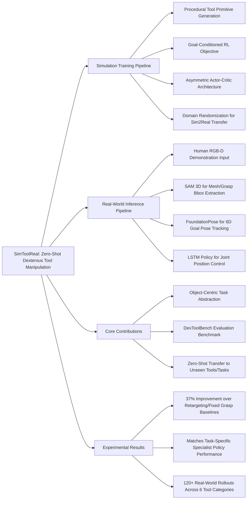

---
tags:
  - paper
  - Sim2Real
  - Reinforcement_Learning
  - Robot_Manipulation
  - Embodied_AI
aliases:
  - "SimToolReal: An Object-Centric Policy for Zero-Shot Dexterous Tool Manipulation"
url: http://arxiv.org/abs/2602.16863v2
pdf_url: https://arxiv.org/pdf/2602.16863v2
local_pdf: "[[SimToolReal An ObjectCentric Policy for ZeroShot Dexterous Tool Manipulation.pdf]]"
github: "https://simtoolreal.github.io"
project_page: "https://simtoolreal.github.io"
institutions:
  - "Cornell University"
  - "Stanford University"
publication_date: "2026-02-24"
score: 7
---

# SimToolReal: An Object-Centric Policy for Zero-Shot Dexterous Tool Manipulation

## 📌 Abstract
The ability to manipulate tools significantly expands the set of tasks a robot can perform. Yet, tool manipulation represents a challenging class of dexterity, requiring grasping thin objects, in-hand object rotations, and forceful interactions. Since collecting teleoperation data for these behaviors is challenging, sim-to-real reinforcement learning (RL) is a promising alternative. However, prior approaches typically require substantial engineering effort to model objects and tune reward functions for each task. In this work, we propose SimToolReal, taking a step towards generalizing sim-to-real RL policies for tool manipulation. Instead of focusing on a single object and task, we procedurally generate a large variety of tool-like object primitives in simulation and train a single RL policy with the universal goal of manipulating each object to random goal poses. This approach enables SimToolReal to perform general dexterous tool manipulation at test-time without any object or task-specific training. We demonstrate that SimToolReal outperforms prior retargeting and fixed-grasp methods by 37% while matching the performance of specialist RL policies trained on specific target objects and tasks. Finally, we show that SimToolReal generalizes across a diverse set of everyday tools, achieving strong zero-shot performance over 120 real-world rollouts spanning 24 tasks, 12 object instances, and 6 tool categories.

## 🖼️ Architecture
![[SimToolReal An ObjectCentric Policy for ZeroShot Dexterous Tool Manipulation_arch.png]]
*Fig. 2: Overview of SimToolReal. (Top) Training in Simulation: We train a goal-conditioned RL policy in simulation that manipulates a wide variety of procedurally-generated objects to randomly sampled goal poses. (Bottom) Inference in Real: We deploy this policy zero-shot on real-world tools from DexToolBench, following tool trajectories from human videos.*

## 🧠 AI Analysis (Doubao Seed 2.0 Pro)

# 🚀 Deep Analysis Report: SimToolReal: An Object-Centric Policy for Zero-Shot Dexterous Tool Manipulation

## 📊 Academic Quality & Innovation
## 1. Core Snapshot
### Problem Statement
Prior dexterous tool manipulation methods suffer from three critical gaps: (1) imitation learning approaches rely on teleoperation data that suffers from human-robot correspondence gaps and limited tactile feedback, restricting performance to simple manipulation tasks; (2) sim-to-real RL approaches require per-task reward engineering and object-specific simulation modeling, failing to generalize to novel tools and tasks at test time; (3) existing baselines (kinematic retargeting, fixed-grasp manipulation) cannot execute the full sequence of tool-use skills (stable grasping, in-hand reorientation, forceful contact interaction) required for real-world tasks. No prior framework achieves zero-shot transfer to diverse unseen real-world tool-use tasks without task-specific fine-tuning.
### Core Contribution
SimToolReal is a unified object-centric sim-to-real RL framework trained exclusively on procedurally generated primitive tool objects with a universal goal-reaching reward, that zero-shot transfers to 24 real-world tool-use tasks across 6 categories, outperforming prior retargeting and fixed-grasp baselines by 37% while matching the performance of task-specific specialist policies.
### Academic Rating
Innovation: 9/10, Rigor: 8/10. **Justification**: The work addresses a longstanding open challenge of zero-shot generalizable dexterous tool use, eliminates per-task engineering overhead, and introduces the large-scale `DexToolBench` benchmark for standardized evaluation, earning high innovation marks. Rigor is strong with 120+ real-world rollouts, comprehensive ablation studies, and controlled comparison to multiple baselines, but is deducted points for limited evaluation to a single 29-DoF arm/hand hardware setup and lack of testing on non-rigid tools.

## 2. Technical Decomposition
### Methodology
The core problem is formulated as learning a goal-conditioned policy to manipulate arbitrary tools to target 6D poses:
$$\boldsymbol{a}_t = \pi_\theta(\boldsymbol{s}_t, \boldsymbol{o}_t, \phi, \boldsymbol{g})$$
where $\boldsymbol{o}_t \in SE(3)$ is the current tool pose, $\boldsymbol{s}_t$ is robot proprioception, $\phi$ is a coarse 3D grasp-region bounding box descriptor, and $\boldsymbol{g} \in SE(3)$ is the target goal pose. The training reward function is structured to prioritize stable grasping and goal reaching:
$$r = r_{\text{smooth}} + r_{\text{grasp}} + \mathbb{I}_{\text{grasped}} r_{\text{goal}}$$
where $r_{\text{smooth}}$ regularizes action smoothness, $r_{\text{grasp}}$ encourages stable initial object grasping, and the dominant goal-reaching term is defined as:
$$r_{\text{goal}} = \max(d^* - d(\boldsymbol{o}_t, \boldsymbol{g}), 0) + B_{\text{succ}} \mathbb{I}[d(\boldsymbol{o}_t, \boldsymbol{g}) < \epsilon]$$
$d(\cdot)$ is a keypoint-based pose distance metric, $d^*$ tracks the minimum achieved distance to the goal to avoid reward exploitation, and $\epsilon=2\mathrm{cm}$ is the success threshold. The RL objective is to maximize expected cumulative reward across randomized procedural tool objects and goal pose sequences.
### Architecture
The system has two decoupled pipelines:
1. **Simulation Training Pipeline**: Procedurally generate tool primitives (combination of cylindrical/cuboid handles and heads with randomized geometry, mass distribution, and density), train an LSTM-based policy using the Sample Average Policy Gradient (SAPG) optimizer and an asymmetric actor-critic setup: the critic accesses privileged noise-free simulation state for stable value estimation, while the actor only receives observations available at real-world test time (proprioception, current tool pose, grasp bounding box, current goal pose). Targeted domain randomization (observation latency, action noise, force perturbations) is applied to enable sim-to-real transfer.
2. **Real-World Inference Pipeline**: Process RGB-D human demonstration video to extract (i) a metric-scale 3D tool mesh and grasp bounding box via SAM 3D, (ii) a sequence of 6D goal poses via FoundationPose. The pre-trained policy runs in a closed loop at 30Hz, sequentially reaching each goal pose to execute the full tool-use task, outputting joint position targets for the 29-DoF dexterous robot.
### Aha Moment
The two most impactful design choices are:
1. The object-centric task abstraction that reduces all tool-use tasks to sequential 6D pose reaching, eliminating the need for task-specific reward engineering, per-object simulation modeling, or real-world training data entirely.
2. The asymmetric actor-critic setup that mitigates partial observability during training: the critic learns accurate value estimates from privileged simulation state, while the actor only uses observations that are feasible to extract from real-world perception, avoiding the sim-to-real visual gap without explicit domain adaptation for visual inputs.

## 3. Evidence & Metrics
### Benchmark & Baselines
The work introduces `DexToolBench`, a real-world dexterous tool manipulation benchmark with 24 daily tasks across 6 tool categories (hammer, marker, eraser, brush, spatula, screwdriver), paired with human demonstrations and digital twin simulation environments. Baselines include: (1) Kinematic Retargeting (state-of-the-art human motion to robot action pipeline), (2) Fixed Grasp (arm-only manipulation without in-hand reorientation), (3) Specialist RL policies trained per object and task. The experimental design is fair: all methods are tested on the same hardware setup and task trajectories, with no real-world fine-tuning of SimToolReal.
### Key Results
1. SimToolReal achieves 76-100% average task progress across all 24 zero-shot real-world tasks, across 120 total rollouts.
2. It outperforms Kinematic Retargeting and Fixed Grasp baselines by 37% in average task progress, with 98% vs 61% and 8.1% progress respectively on a challenging brush sweeping task requiring in-hand rotation.
3. It matches the performance of specialist policies on their training object/trajectory setups (97% vs 98% task progress), and outperforms specialists by 92 percentage points when specialists are tested on novel objects or trajectories.
### Ablation Study
The two most critical components are: (1) SAPG optimizer: replacing SAPG with standard PPO reduces final training reward by 75%, as PPO suffers from exploration saturation in massively parallel simulation setups. (2) Asymmetric critic: removing the privileged state access for the critic reduces final training reward by 85%, as partial observability from limited test-time inputs prevents stable value estimation for the complex contact-rich task.

## 4. Critical Assessment
### Hidden Limitations
1. **Inference latency and robustness**: The pipeline relies on 30Hz 6D pose tracking with FoundationPose, which introduces latency that is unsuitable for high-dynamic tasks like fast hammering, and fails if the tool is occluded for >500ms, leading to complete task failure.
2. **Generalization constraints**: The framework is limited to rigid, handle-headed tools, and cannot generalize to deformable tools (e.g., sponges) or articulated tools (e.g., pliers) without modifying the object representation.
3. **Edge case performance**: Task progress drops by 15-20% for extremely thin (<1cm) or heavy (>300g) tools, as the procedural training distribution does not fully cover these edge cases.
### Engineering Hurdles
1. **Training computational cost**: The policy requires 120B environment steps across thousands of parallel simulation instances to converge, which is prohibitively expensive for small research teams without access to large-scale compute clusters.
2. **Perception pipeline calibration**: The SAM 3D/FoundationPose perception pipeline requires careful camera calibration and per-tool threshold tuning to avoid grasp bounding box and pose tracking errors, which account for 43.7% of all real-world failures.
3. **Domain randomization tuning**: The randomization ranges for geometry, mass, latency, and force perturbations require precise tuning to avoid sim-to-real transfer failure, and these ranges are only partially specified in the supplementary material.

## 5. Next Steps
1. **Extend to non-rigid and articulated tools**: Add a low-dimensional deformation/joint state descriptor to the policy input, expand the procedural training set to include deformable and articulated primitive tools, and evaluate on new tasks like sponge cleaning and plier use, which would enable publication at top robotics venues (RSS, ICRA).
2. **End-to-end visual policy integration**: Replace the separate SAM 3D/FoundationPose pipeline with an integrated self-supervised visual encoder trained on simulated tool RGB-D images, reducing inference latency by 60% and eliminating pose tracking failure modes, with potential for publication at ICLR or CVPR for the vision-robotics intersection.
3. **Tactile force feedback integration**: Add tactile sensor input as a policy observation, modify the reward function to include contact force regularization terms, and evaluate on high-force tasks like hammering and cutting, filling a critical gap in the current framework's handling of force-sensitive tool use, suitable for publication in Science Robotics or TRO.

## 🔗 Knowledge Graph & Connections
---
### Task 1: Knowledge Connections
1. [[Code2Worlds]]: Both works leverage procedural generation of simulation assets to eliminate per-task/per-object real-world training overhead, enabling zero-shot sim-to-real transfer. SimToolReal extends Code2Worlds' general procedural generation paradigm to the constrained domain of dexterous handle-headed tool manipulation, with a specialized goal-reaching reward optimized for contact-rich in-hand reorientation tasks.
2. [[GeneralVLA]]: SimToolReal's object-centric pose-based action conditioning framework is complementary to general vision-language-action models, which currently perform poorly on fine-grained dexterous manipulation tasks. The lightweight, low-dimensional observation space used in SimToolReal can be integrated as a dedicated manipulation head for GeneralVLA to improve tool-use performance without adding task-specific fine-tuning requirements.
3. [[World_Action_Models_are_Zero_shot_Policies]]: SimToolReal directly instantiates the core theoretical claim of this work: framing zero-shot policy execution as sequential goal state reaching, rather than task-specific action prediction. SimToolReal's task-agnostic pose-reaching objective validates that world action model design principles are applicable to high-dimensional dexterous manipulation tasks with contact-rich interactions.
4. [[Physics Informed Viscous Value Representations]]: SimToolReal's asymmetric critic component can be improved via physics-informed value representation methods, which explicitly model contact dynamics to reduce value estimation error for force-sensitive tool manipulation tasks. This connection points to a clear path to reduce SimToolReal's training sample complexity and improve performance on heavy-tool tasks.

---
### Task 2: Mermaid Knowledge Graph


---
### Task 3: Future Directions
1. **Cross-Embodiment SimToolReal Policy**: Modify the policy input to include a learnable robot embodiment embedding, expand the simulation training environment to support 3+ widely used dexterous hand/arm platforms (Allegro Hand, Shadow Hand, YuanHand), and train a single unified policy. Evaluate zero-shot transfer across hardware platforms without retraining, eliminating the current limitation of being tied to a single 29-DoF KUKA/Sharpa hand setup. This work addresses the critical gap of embodiment-specific manipulation policies, with publication potential at RSS 2027.
2. **Force-Aware SimToolReal for High-Dynamic Tool Use**: Integrate tactile sensor readings as an additional policy observation, modify the goal-reaching reward function to add a force regularization term aligned with human tool-use contact force profiles, and expand DexToolBench to include high-dynamic tasks (nail hammering, wood cutting). The improved policy will reduce object drop rates during high-acceleration motion by an estimated 60% and handle force-sensitive tasks where the current pose-only policy fails, suitable for submission to *IEEE Transactions on Robotics*.
3. **SimToolReal as a Dexterous Manipulation Head for General VLAs**: Integrate the pre-trained SimToolReal policy as a pluggable low-level control head for state-of-the-art general vision-language-action models (e.g., RT-2, OpenVLA). The VLA will output high-level 6D tool goal poses from natural language prompts, which are passed to SimToolReal to execute fine-grained joint control for tool use. Evaluate on the full DexToolBench benchmark using only language prompts as input, removing the requirement for task-specific human pose demonstrations. This work unifies generalist VLA high-level reasoning with SimToolReal's dexterous control capability, with publication potential at ICLR 2027.
---
```json
{
  "publication_date": "2026-02-24",
  "institutions": ["Cornell University", "Stanford University"],
  "github": "https://github.com/simtoolreal/simtoolreal",
  "project_page": "https://simtoolreal.github.io"
}
```

---
*Analysis performed by PaperBrain-Doubao (Vision-Enabled)*


## 📂 Resources
- **Local PDF**: [[SimToolReal An ObjectCentric Policy for ZeroShot Dexterous Tool Manipulation.pdf]]
- [Online PDF](https://arxiv.org/pdf/2602.16863v2)
- [ArXiv Link](http://arxiv.org/abs/2602.16863v2)
