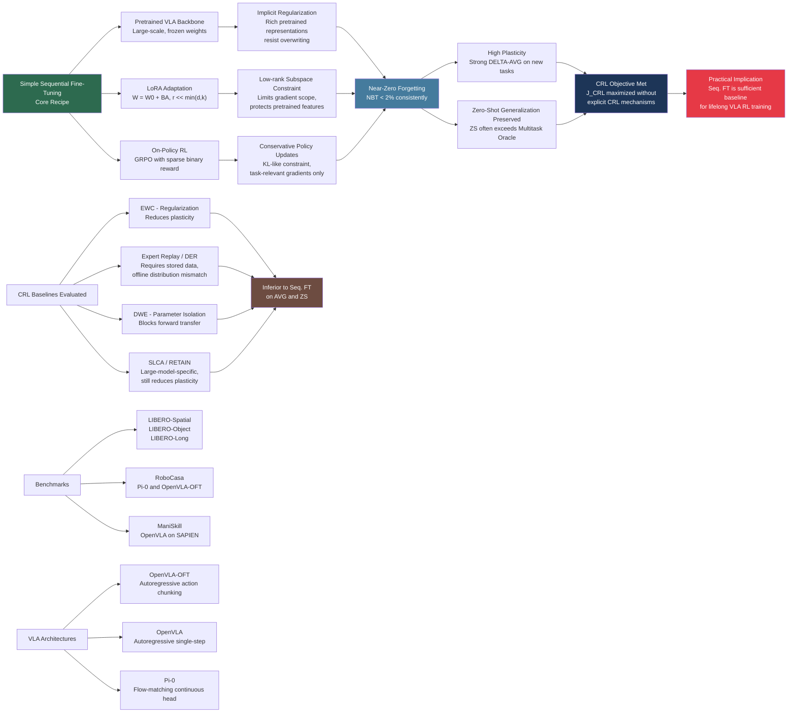

---
tags:
- paper
- domain/embodied_ai
- domain/multimodal_perception
- domain/reinforcement_learning
- domain/robot_manipulation
- domain/vla
- impact/must_read
- method/benchmark
- method/foundation_model
- method/reinforcement_learning
- review/auto_tagged
- status/unread
- task/manipulation
- task/scene_understanding
- type/benchmark
aliases:
- 'Simple Recipe Works: Vision-Language-Action Models are Natural Continual Learners
  with Reinforcement Learning'
url: https://huggingface.co/papers/2603.11653
pdf_url: https://arxiv.org/pdf/2603.11653.pdf
local_pdf: '[[Simple Recipe Works VisionLanguageAction Models are Natural Continual
  Learners with Reinforcement Le.pdf]]'
github: https://github.com/UT-Austin-RobIn/continual-vla-rl
project_page: None
institutions:
- University of Texas at Austin
- UCLA
- NTU
- Sony AI
publication_date: '2026-03-12'
score: '9.0'
domains:
- embodied_ai
- multimodal_perception
- reinforcement_learning
- robot_manipulation
- vla
methods:
- benchmark
- foundation_model
- reinforcement_learning
tasks:
- manipulation
- scene_understanding
paper_type: benchmark
impact_band: must_read
reading_status: unread
year: 2026
priority_score: 119
review_status: auto_tagged
next_action: deep_read
arxiv_id: '2603.11653'
paper_id: arxiv:2603.11653
---

# Simple Recipe Works: Vision-Language-Action Models are Natural Continual Learners with Reinforcement Learning

## 📌 Abstract
Continual Reinforcement Learning (CRL) for Vision-Language-Action (VLA) models is a promising direction toward self-improving embodied agents that can adapt in openended, evolving environments. However, conventional wisdom from continual learning suggests that naive Sequential Fine-Tuning (Seq. FT) leads to catastrophic forgetting, necessitating complex CRL strategies. In this work, we take a step back and conduct a systematic study of CRL for large pretrained VLAs across three models and five challenging lifelong RL benchmarks. We find that, contrary to established belief, simple Seq. FT with low-rank adaptation (LoRA) is remarkably strong: it achieves high plasticity, exhibits little to no forgetting, and retains strong zero-shot generalization, frequently outperforming more sophisticated CRL methods. Through detailed analysis, we show that this robustness arises from a synergy between the large pretrained model, parameter-efficient adaptation, and on-policy RL. Together, these components reshape the stability-plasticity trade-off, making continual adaptation both stable and scalable. Our results position Sequential Fine-Tuning as a powerful method for continual RL with VLAs and provide new insights into lifelong learning in the large model era. Code is available at github.com/UT-Austin-RobIn/continual-vla-rl.

## 🖼️ Architecture
![[Simple Recipe Works VisionLanguageAction Models are Natural Continual Learners with Reinforcement Le_arch.png]]

## 🧠 AI Analysis

# 🚀 Deep Analysis Report: Simple Recipe Works: Vision-Language-Action Models are Natural Continual Learners with Reinforcement Learning

## 📊 Academic Quality & Innovation
---

## 1. Core Snapshot

### Problem Statement
The central research pain point is the assumption that Sequential Fine-Tuning (Seq. FT) is fundamentally inadequate for Continual Reinforcement Learning (CRL) in large pretrained Vision-Language-Action (VLA) models. Prior continual learning literature treats catastrophic forgetting as near-inevitable under naive sequential training, leading practitioners to adopt complex mitigation strategies (regularization, replay buffers, parameter isolation). However, these strategies were largely developed for small models trained from scratch, without accounting for the distinct properties of large pretrained models, parameter-efficient fine-tuning (PEFT), and on-policy RL objectives. The gap is therefore both empirical (what actually happens to large VLAs under Seq. FT) and mechanistic (why the expected forgetting may not materialize).

### Core Contribution
The paper demonstrates empirically and analytically that the synergy between a large pretrained VLA backbone, LoRA-based parameter-efficient adaptation, and on-policy reinforcement learning (GRPO) collectively suppresses catastrophic forgetting to near-zero levels, rendering simple Sequential Fine-Tuning a competitive and often superior method compared to established CRL algorithms across five diverse robotics benchmarks and three VLA architectures.

### Academic Rating
- **Innovation: 6/10** — The finding is genuinely surprising and well-substantiated, but the technical novelty is primarily empirical/analytical rather than algorithmic; no new method is proposed.
- **Rigor: 8/10** — Experiments span 3 VLA architectures, 5 benchmarks, 8 algorithms, 3 random seeds, controlled perturbations, ablations, and mechanistic analysis, constituting a thorough and carefully controlled empirical study.

---

## 2. Technical Decomposition

### Algorithmic Logic

The paper does not propose a new algorithm per se; rather, it defines and validates a *recipe* comprising three existing components applied in sequence. The training flow is as follows.

**Step 1: Task Arrival.** A continual stream of T language-conditioned tasks $\{\mathcal{T}^1, \ldots, \mathcal{T}^T\}$ arrives in fixed order. Each task $\mathcal{T}^k$ is specified by a natural-language instruction $\ell^k$ and a sparse binary reward function $r^k : \mathcal{S} \times \mathcal{A} \times \mathcal{L} \to \{0,1\}$.

**Step 2: LoRA Parameterization.** The VLA backbone weights $W_0 \in \mathbb{R}^{d \times k}$ are frozen. Only low-rank adapter matrices $B \in \mathbb{R}^{d \times r}$ and $A \in \mathbb{R}^{r \times k}$ (with $r \ll \min(d,k)$) are updated, yielding effective weights $W = W_0 + BA$. This drastically reduces the parameter space subject to gradient updates and constrains the direction of weight change to a low-dimensional subspace.

**Step 3: On-Policy RL with GRPO.** For task $\mathcal{T}^k$, the VLA policy $\pi_\theta(a_t | s_t, \ell^k)$ is trained using Group Relative Policy Optimization (GRPO), a stable policy-gradient method suited for autoregressive and flow-based action heads. GRPO collects on-policy rollouts from the current environment and computes group-relative advantages, avoiding the need for a separate critic network. The policy is updated to maximize cumulative sparse reward.

**Step 4: Sequential Progression.** Upon task completion, the agent moves to $\mathcal{T}^{k+1}$ with no access to previous task data or environments. The LoRA parameters carry forward as the initialization for the next task. No replay buffer, regularization penalty, or parameter isolation is applied.

**Intuition for this flow over alternatives.** The choice of Seq. FT is justified post-hoc by three complementary mechanisms identified through ablation: (a) the pretrained backbone acts as a strong implicit regularizer because LoRA updates are low-rank perturbations that do not fully overwrite rich pretrained representations; (b) on-policy RL provides a form of implicit regularization through conservative policy updates (GRPO enforces a KL-like constraint relative to the reference policy), reducing the effective gradient magnitude; and (c) the sparse reward signal limits the gradient signal to task-relevant features, avoiding the broad parameter disruption seen in supervised fine-tuning with dense loss. Together, these make the stability–plasticity trade-off inherently favorable without explicit CRL mechanisms.

---

### Mathematical Formulation

**CRL Objective.** The agent maximizes the average expected return over all tasks seen up to task $k$:

$$\max_\theta J_{\text{CRL}}(\theta) = \frac{1}{k} \sum_{j=1}^{k} \mathbb{E}_{\pi_\theta} \left[ \sum_{t=1}^{H} r^j \right]$$

where:
- $\theta$ denotes the trainable LoRA parameters (i.e., $\{A, B\}$),
- $k$ is the current task index,
- $H$ is the finite episode horizon,
- $r^j \in \{0,1\}$ is the sparse binary reward for task $j$,
- the expectation is over trajectories induced by $\pi_\theta$ conditioned on instruction $\ell^j$.

**Physical meaning.** Maximizing $J_{\text{CRL}}$ requires the policy to simultaneously succeed on the current task (plasticity) and retain competence on prior tasks (stability). The paper's finding is that Seq. FT with LoRA + GRPO achieves both without explicitly enforcing the average — it optimizes only the current task's reward at each stage yet incidentally preserves prior task performance.

**LoRA Weight Update.**

$$W = W_0 + BA, \quad B \in \mathbb{R}^{d \times r},\ A \in \mathbb{R}^{r \times k},\ r \ll \min(d,k)$$

After training, LoRA weights merge as $W_{\text{new}} \leftarrow W_0 + BA$, enabling inference without architectural overhead. The constraint $r \ll \min(d,k)$ restricts gradient updates to a low-rank subspace, reducing the capacity to overwrite pretrained representations.

**GRPO Policy Gradient (as applied).** GRPO computes group-relative advantages by sampling $G$ rollouts per state and normalizing rewards within the group:

$$\hat{A}_i = \frac{r_i - \mu_{\{r_g\}_{g=1}^G}}{\sigma_{\{r_g\}_{g=1}^G}}$$

where $r_i$ is the return for rollout $i$, and $\mu, \sigma$ are the group mean and standard deviation. The policy gradient then maximizes the clipped surrogate objective analogous to PPO but without a value network. The on-policy nature means gradient updates reflect the current policy's behavior distribution, reducing the distribution shift problem that exacerbates forgetting in offline methods.

---

### Tensor Flow & Architecture

The paper evaluates three VLA architectures:

1. **OpenVLA-OFT** (primary): An action-chunking autoregressive VLA based on a large language model backbone. Input: RGB image $[B, 3, H, W]$ concatenated with tokenized language instruction $[B, L_{\text{lang}}]$ → vision-language transformer → action token sequence $[B, T_a, 7]$ (7-DoF end-effector pose + gripper). LoRA is applied to the query and value projection matrices within transformer attention layers.

2. **OpenVLA**: Same backbone as OFT but without action chunking; outputs a single 7-dimensional action per step.

3. **Pi-0**: A flow-matching VLA built on PaliGemma (Llama-2-based). Input: image + language → diffusion-based continuous action head → $[B, T_a, 7]$. LoRA is applied to the VLM backbone; the flow-matching head is trained with a denoising objective.

Key architectural observation: LoRA is inserted only into the pretrained backbone, not the action head, ensuring that the pretrained visual and linguistic representations are shielded from direct gradient overwriting.

---

### Innovation Logic

Relative to prior CRL baselines in the study:

- **vs. EWC (regularization-based):** EWC adds a quadratic penalty $\lambda \sum_i F_i (\theta_i - \theta_i^*)^2$ to constrain parameter drift. This reduces plasticity because it actively limits how much parameters can change. Seq. FT with LoRA achieves implicit parameter stability through the low-rank constraint without sacrificing adaptability.

- **vs. Expert Replay / DER (replay-based):** These methods store past demonstrations or activations and mix them with current task data during training. They require growing storage proportional to the number of tasks and assume access to expert data or saved model checkpoints. Seq. FT makes neither assumption and avoids the distribution mismatch between stored offline data and current on-policy behavior.

- **vs. DWE (parameter isolation):** Dynamic Weight Expansion allocates separate parameters per task, preventing interference but also preventing positive forward transfer. Seq. FT with shared LoRA parameters allows forward transfer (positive FWT scores in Table 1) because prior task adaptation can serve as useful initialization.

- **vs. SLCA / RETAIN (large-model-specific methods):** These use layerwise learning-rate decoupling or discounted weight merging to protect pretrained representations. The paper shows these introduce overhead and reduce plasticity without meaningfully reducing forgetting beyond what LoRA alone achieves.

---

## 3. Evidence & Metrics

### Benchmark & Baselines

**Benchmarks (5 total):**
- **LIBERO-Spatial, LIBERO-Object, LIBERO-Long:** Three robot manipulation suites with 5 sequential tasks each, differing in the type of knowledge transfer required (spatial vs. object vs. long-horizon).
- **RoboCasa:** Diverse kitchen manipulation with many non-pick-and-place tasks; evaluated with Pi-0 and OpenVLA-OFT.
- **ManiSkill:** SAPIEN-engine benchmark; evaluated with OpenVLA.

**Baselines (8 algorithms):**
- Lower bound: Sequential Fine-Tuning (Seq. FT)
- Upper bound oracle: Multi-Task Training
- CRL regularization: EWC
- CRL replay: Expert Replay (ER), Dark Experience Replay (DER)
- CRL parameter isolation: Dynamic Weight Expansion (DWE)
- Large-model-specific: SLCA (layered LR), RETAIN (weight merging)

**Fairness of experimental design:** The setup is carefully controlled — all methods share the same core hyperparameters (learning rate, batch size, LoRA rank, GRPO config) inherited from a prior reference (Yu et al. 2025a). Method-specific hyperparameters are swept within one order of magnitude of original paper values. No hyperparameter tuning is performed for Seq. FT, which makes the result more, not less, conservative in favor of Seq. FT. Three random seeds are used and results are reported as mean ± standard error.

### Key Results

From Table 1 (LIBERO benchmarks, primary results):

| Setting | Method | AVG (%) | NBT (%) | ZS (%) |
|---|---|---|---|---|
| LIBERO-Spatial | Seq. FT | **81.2 ± 0.4** | 0.3 ± 0.5 | **57.1 ± 1.1** |
| LIBERO-Spatial | Multitask Oracle | 85.8 ± 0.2 | — | 51.2 ± 0.7 |
| LIBERO-Object | Seq. FT | **93.2 ± 0.7** | 1.0 ± 0.7 | 25.4 ± 0.2 |
| LIBERO-Object | Best CRL (ER) | 88.8 ± 0.2 | 4.5 ± 0.6 | 26.7 ± 0.5 |
| LIBERO-Long | Seq. FT | **89.8 ± 0.9** | -2.4 ± 1.0 | 86.6 ± 0.2 |

Notable observations:
- **Forgetting (NBT):** Seq. FT achieves NBT consistently below 2%, and often negative (meaning performance on prior tasks *improves* after learning more tasks).
- **Zero-shot generalization (ZS):** Seq. FT matches or exceeds the oracle on ZS across nearly all settings, indicating that sequential RL fine-tuning does not erode pretrained generalization.
- **Plasticity (ΔAVG):** Seq. FT shows consistently large ΔAVG (e.g., +37.6 on LIBERO-Object), indicating strong adaptation to new tasks.

From Table 2 (robustness study): Seq. FT maintains its advantages across camera perturbation, lighting perturbation, robot state perturbation, alternative VLA models (Pi-0, OpenVLA), and task order permutations. The ZS metric for OpenVLA on ManiSkill reaches 51.0 ± 0.8 for Seq. FT vs. 50.7 ± 0.8 for the oracle, with a remarkable ΔZS of +11.0.

### Ablation Study

The paper identifies three components contributing to forgetting resistance and conducts ablations by removing each:

1. **Removing LoRA (replacing with full fine-tuning):** Causes significant increase in forgetting, as full-parameter updates overwrite pretrained representations more broadly.

2. **Removing the large pretrained model (training from scratch with LoRA + RL):** Causes significant forgetting, confirming that the pretrained backbone provides implicit regularization through rich, generalizable feature representations that are not easily overwritten.

3. **Replacing on-policy RL with supervised fine-tuning (SFT) on demonstrations:** Causes increased forgetting, indicating that on-policy RL's conservative update nature (gradient signals concentrated on task-relevant policy changes) is a critical stabilizing factor.

The finding is that each of the three components independently reduces forgetting from a complementary angle, and their combination is synergistic rather than redundant.

---

## 4. Critical Assessment

### Hidden Limitations

**Sparse reward dependence:** The stability-inducing property of on-policy RL is partly attributed to the sparse, binary reward signal limiting gradient scope. In environments requiring dense or shaped reward functions — or where reward engineering is complex — the gradient signal would be broader and potentially more destructive to pretrained representations. The claim of "natural continual learner" may not generalize beyond sparse-reward settings.

**Task similarity and scale:** All evaluated benchmarks involve robot manipulation tasks that are semantically and perceptually similar (same robot morphology, similar visual scenes, shared action space). The absence of forgetting may be partly attributable to high task similarity rather than a fundamental property of the VLA + LoRA + RL combination. Performance on genuinely dissimilar task sequences (e.g., manipulation followed by navigation with distinct visual domains) is not evaluated.

**LoRA rank sensitivity:** The rank $r$ of LoRA adapters is fixed and inherited from a prior reference configuration. The paper does not systematically study how forgetting scales with LoRA rank, leaving open the question of whether the observed stability persists at higher ranks (which would approach full fine-tuning behavior).

**Number of tasks:** Benchmarks use 5 sequential tasks per suite. CRL at scale (e.g., 50–100 tasks) may reveal forgetting dynamics not apparent at this small task count.

### Engineering Hurdles

- Deploying this recipe on real physical robots requires reliable on-policy rollout collection, which is time- and hardware-intensive; the paper's simulation-only validation leaves the real-robot sample efficiency and safety constraints unexplored.
- The GRPO training stability documented in prior work (requiring small learning rates and careful policy objective design) means that practitioners must inherit those hyperparameter constraints precisely, reducing the plug-and-play simplicity implied by the "simple recipe" framing.

## 🔗 Knowledge Graph & Connections
## Task 1: Differential Analysis & Connections

### Connection 1: [[Xiaomi-Robotics-0]]

**Relevance:** Both papers centrally address the challenge of catastrophic forgetting during VLA post-training and share the practical concern of maintaining pretrained VLM knowledge while adapting to new tasks.

**Differential Analysis:** Xiaomi-Robotics-0 treats forgetting prevention as an *architectural and training recipe design problem* solved through explicit cross-embodiment pretraining strategies and asynchronous execution alignment — it implicitly assumes forgetting is a genuine threat requiring deliberate mitigation. The present paper challenges this premise empirically, demonstrating that under LoRA + on-policy RL, forgetting is largely self-suppressed without explicit countermeasures. Furthermore, Xiaomi-Robotics-0 operates in the imitation learning regime (supervised on demonstrations), while this paper operates purely in the RL regime with sparse rewards — a regime the authors argue is itself a stabilizing factor. The two papers therefore occupy complementary positions: Xiaomi-Robotics-0 provides engineering solutions for forgetting prevention under SFT, while this paper argues that switching to on-policy RL removes the need for many such solutions.

---

### Connection 2: [[Chain of World]]

**Relevance:** CoWVLA and the present paper both grapple with how to endow VLA models with temporally persistent, generalizable representations across diverse task distributions — CoWVLA through explicit latent motion disentanglement, and this paper through the implicit retention of pretrained representations under LoRA + RL.

**Differential Analysis:** CoWVLA argues that standard VLAs lack the temporal-causal structure needed for robust generalization, and proposes a world-model paradigm with disentangled motion latents as the architectural solution. The present paper takes an orthogonal stance: it shows that even architecturally simple autoregressive VLAs (OpenVLA-OFT) retain strong zero-shot generalization *without* explicit temporal modeling, provided the training procedure (LoRA + GRPO) is appropriate. CoWVLA improves generalization through richer internal representations; this paper achieves similar ends through training dynamics. A key open question connecting the two: would CoWVLA-style architectures with richer motion latents exhibit even less forgetting under the Seq. FT + RL recipe, or would the richer parameterization introduce new instabilities?

---

### Connection 3: [[World_Action_Models_are_Zero_shot_Policies]]

**Relevance:** DreamZero and this paper both report strong zero-shot generalization results and both challenge the assumption that standard VLA fine-tuning degrades pretrained capabilities.

**Differential Analysis:** DreamZero achieves zero-shot transfer by grounding the policy in physical world dynamics via video diffusion, arguing that semantic generalization in VLAs is insufficient for novel physical motions. The present paper shows that sequential RL fine-tuning of VLAs not only preserves but often *enhances* zero-shot generalization (positive ΔZS), even without explicit physical dynamics modeling. This is a partial empirical contradiction: DreamZero implies VLAs need world models for genuine zero-shot transfer, while this paper demonstrates strong zero-shot retention in standard VLAs fine-tuned with RL. The resolution may be domain-specific — DreamZero's gains appear most pronounced on physical motion novelty (e.g., cross-embodiment), while this paper's ZS metric measures generalization to new task semantics within the same robot morphology and environment class.

---

## Task 2: Mermaid Knowledge Graph

---

## Task 3: Future Research Directions

### Direction 1: Boundary Conditions of Stability — Task Dissimilarity and Scale Stress Testing

The current paper evaluates up to 5 sequentially similar manipulation tasks within shared visual and action domains. A concrete next study would systematically vary **task dissimilarity** (measured by representation distance in the VLA's penultimate layer) and **task count** (scaling from 5 to 50 to 500 tasks) to identify the precise conditions under which the LoRA + GRPO stability breaks down. This would require constructing a hierarchical benchmark spanning navigation, manipulation, and semantic reasoning tasks with quantified inter-task feature distance, and fitting a forgetting-vs-dissimilarity curve. The practical payoff is a principled criterion for *when* to engage auxiliary CRL mechanisms versus relying on the simple recipe.

---

### Direction 2: Mechanistic Gradient Analysis — Disentangling the Three Stabilizing Factors Quantitatively

The paper's ablation demonstrates that removing any one of the three components (large pretraining, LoRA, on-policy RL) increases forgetting, but the analysis is purely performance-based. A mechanistic follow-up would apply **gradient orthogonality analysis** (measuring the cosine similarity between gradient vectors from current and past tasks in the LoRA parameter space) and **effective rank tracking** of the gradient covariance matrix across training steps. This would quantify, rather than just assert, how much each component reduces gradient interference. Concretely, one could compare the gradient subspace overlap under (SFT + full FT), (SFT + LoRA), (RL + full FT), and (RL + LoRA) to decompose the stabilizing contributions multiplicatively.

---

### Direction 3: Adaptive LoRA Rank Scheduling for Plasticity-Stability Control

A directly actionable extension is to treat the LoRA rank $r$ as a dynamic hyperparameter that is adjusted across the task sequence based on online estimates of forgetting risk. When inter-task similarity is high (as measured by gradient alignment or feature distance), $r$ can be small (high stability, low plasticity needed); when a genuinely novel task arrives, $r$ is transiently increased to allow broader adaptation. This could be formalized as a **rank-scheduling policy** trained via meta-learning on a distribution of task sequences, outputting a rank recommendation given task embedding distance and current NBT estimate. The hypothesis, grounded in this paper's LoRA ablation, is that rank reduction is the single most cost-effective lever for controlling forgetting without sacrificing the on-policy RL benefits.

---
*Analysis performed by PaperBrain-OpenRouter (anthropic/claude-4.6-sonnet) (Vision-Enabled)*

## 🧩 Claim Cards

### Claim-01
- Claim: Sequential Fine-Tuning (Seq. FT) with on-policy reinforcement learning and parameter-efficient fine-tuning (LoRA) is sufficient for continual learning in large pretrained VLA models, matching or outperforming dedicated CRL algorithms without any forgetting mitigation mechanism.
- Evidence: Across LIBERO-Spatial, LIBERO-Object, and LIBERO-Long benchmarks (5 sequential tasks each), Seq. FT with GRPO-based RL achieves performance comparable to or better than EWC, Expert Replay (ER), Dark Experience Replay (DER), Dynamic Weight Expansion (DWE), SLCA, and RETAIN, while requiring no additional memory buffers, regularization terms, or architectural modifications. All methods share identical core hyperparameters (learning rate, batch size, LoRA rank, GRPO config) from Yu et al. 2025a, making the Seq. FT result conservative rather than cherry-picked.
- Boundary/Failure: The claim is evaluated exclusively on robot manipulation tasks sharing the same morphology, visual scene style, and action space. It may break down when tasks are semantically or perceptually dissimilar (e.g., cross-domain continual learning spanning manipulation and navigation), where catastrophic forgetting is more likely to re-emerge.
- Compared Against: EWC, Expert Replay, Dark Experience Replay, Dynamic Weight Expansion, SLCA, RETAIN, and Multi-Task Training (oracle upper bound).
- Confidence: 8
- Links:
  - same_problem:: [[Xiaomi-Robotics-0]]
  - improves_over:: 待定
  - conflicts_with:: 待定

### Claim-02
- Claim: On-policy RL with sparse binary rewards structurally limits gradient scope during sequential fine-tuning, preserving pretrained representations and thereby preventing catastrophic forgetting in large VLA models.
- Evidence: The paper attributes the absence of forgetting under Seq. FT to two mechanistic factors: (1) LoRA confines weight updates to low-rank subspaces, reducing interference with pretrained feature representations; and (2) sparse, binary reward signals restrict the breadth of gradient updates compared to dense supervised losses, limiting destructive overwriting of previously learned task knowledge. This mechanistic account is supported by the empirical observation that Seq. FT does not degrade on earlier tasks across all three LIBERO suites and RoboCasa evaluations with Pi-0 and OpenVLA-OFT.
- Boundary/Failure: In environments requiring dense or shaped reward functions — or where reward engineering produces broad, high-magnitude gradient signals — the gradient-limiting property of sparse rewards disappears. The "natural continual learner" characterization is therefore not expected to hold in dense-reward RL settings.
- Compared Against: Supervised sequential fine-tuning baselines and prior continual learning theory developed for small models trained from scratch without PEFT.
- Confidence: 6
- Links:
  - same_problem:: 待定
  - improves_over:: 待定
  - conflicts_with:: 待定

### Claim-03
- Claim: The empirical advantage of Seq. FT over dedicated CRL baselines in VLA continual learning is contingent on high task similarity within the benchmark suite, and the results may not generalize to heterogeneous task sequences.
- Evidence: All five benchmarks used (LIBERO-Spatial, LIBERO-Object, LIBERO-Long, RoboCasa, ManiSkill) involve robot manipulation tasks sharing the same robot morphology, similar visual environments, and a common action space. No cross-domain or cross-morphology task sequences are evaluated. The paper acknowledges this as a limitation, noting that the absence of forgetting may be partly attributable to high inter-task similarity rather than a fundamental property of large pretrained VLAs under RL fine-tuning.
- Boundary/Failure: The claim breaks down when the continual learning sequence includes tasks from substantially different domains (e.g., manipulation followed by locomotion or navigation), different robot embodiments, or drastically different visual distributions, where shared representations are less transferable and forgetting is more likely.
- Compared Against: Prior CRL benchmarks in the literature that include more heterogeneous task sequences, and the implicit assumption that results on manipulation suites generalize broadly.
- Confidence: 7
- Links:
  - same_problem:: [[Xiaomi-Robotics-0]]
  - improves_over:: 待定
  - conflicts_with:: 待定

### Claim-04
- Claim: Large pretrained VLA models fine-tuned with PEFT and on-policy RL represent a qualitatively different continual learning regime from small models trained from scratch, rendering classical CRL algorithms (designed for the latter) unnecessary and sometimes counterproductive.
- Evidence: Classical CRL methods including EWC (regularization), ER and DER (replay), and DWE (parameter isolation) — all originally designed for small models trained from scratch — fail to outperform the naive Seq. FT baseline when applied to large VLAs (Pi-0, OpenVLA-OFT, OpenVLA) across LIBERO, RoboCasa, and ManiSkill benchmarks. Large-model-specific methods SLCA and RETAIN also do not surpass Seq. FT, suggesting that the pretrained initialization and LoRA fine-tuning regime fundamentally alter the forgetting dynamics assumed by prior CRL literature. The experimental design uses method-specific hyperparameters swept within one order of magnitude of original paper values, ensuring fair comparison.
- Boundary/Failure: This implication holds only for large pretrained models fine-tuned with PEFT under sparse-reward RL. For small models trained from scratch, or for full fine-tuning of large models without PEFT, classical CRL algorithms may remain necessary and effective.
- Compared Against: EWC, Expert Replay, Dark Experience Replay, Dynamic Weight Expansion, SLCA, and RETAIN as representatives of the classical and large-model-specific CRL algorithm families.
- Confidence: 8
- Links:
  - same_problem:: [[Xiaomi-Robotics-0]]
  - improves_over:: 待定
  - conflicts_with:: 待定

## 📂 Resources
- **Local PDF**: [[Simple Recipe Works VisionLanguageAction Models are Natural Continual Learners with Reinforcement Le.pdf]]
- [Online PDF](https://arxiv.org/pdf/2603.11653.pdf)
- [ArXiv Link](https://huggingface.co/papers/2603.11653)