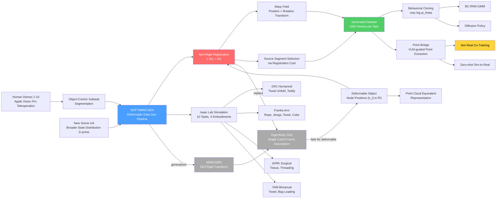

---
tags:
- paper
- domain/embodied_ai
- domain/reinforcement_learning
- domain/robot_manipulation
- domain/sim2real
- impact/high_value
- method/benchmark
- method/imitation_learning
- method/reinforcement_learning
- method/simulation
- review/auto_tagged
- status/unread
- task/dexterous_contact
- task/loco_manipulation
- task/manipulation
- type/benchmark
aliases:
- 'SoftMimicGen: A Data Generation System for Scalable Robot Learning in Deformable
  Object Manipulation'
url: http://arxiv.org/abs/2603.25725v1
pdf_url: https://arxiv.org/pdf/2603.25725v1
local_pdf: '[[SoftMimicGen A Data Generation System for Scalable Robot Learning in
  Deformable Object Manipulation.pdf]]'
github: None
project_page: https://softmimicgen.github.io
institutions:
- NVIDIA
- University of Toronto
- Georgia Institute of Technology
publication_date: '2026-03-26'
score: '8.0'
domains:
- embodied_ai
- reinforcement_learning
- robot_manipulation
- sim2real
methods:
- benchmark
- imitation_learning
- reinforcement_learning
- simulation
tasks:
- dexterous_contact
- loco_manipulation
- manipulation
paper_type: benchmark
impact_band: high_value
reading_status: unread
year: 2026
priority_score: 99
review_status: auto_tagged
next_action: inspect_protocol
arxiv_id: '2603.25725'
paper_id: arxiv:2603.25725
---

# SoftMimicGen: A Data Generation System for Scalable Robot Learning in Deformable Object Manipulation

## 📌 Abstract
Large-scale robot datasets have facilitated the learning of a wide range of robot manipulation skills, but these datasets remain difficult to collect and scale further, owing to the intractable amount of human time, effort, and cost required. Simulation and synthetic data generation have proven to be an effective alternative to fuel this need for data, especially with the advent of recent work showing that such synthetic datasets can dramatically reduce real-world data requirements and facilitate generalization to novel scenarios unseen in real-world demonstrations. However, this paradigm has been limited to rigid-body tasks, which are easy to simulate. Deformable object manipulation encompasses a large portion of real-world manipulation and remains a crucial gap to address towards increasing adoption of the synthetic simulation data paradigm. In this paper, we introduce SOFTMIMICGEN, an automated data generation pipeline for deformable object manipulation tasks. We introduce a suite of high-fidelity simulation environments that encompasses a wide range of deformable objects (stuffed animal, rope, tissue, towel) and manipulation behaviors (high-precision threading, dynamic whipping, folding, pick-and-place), across four robot embodiments: a single-arm manipulator, bimanual arms, a humanoid, and a surgical robot. We apply SOFTMIMICGEN to generate datasets across the task suite, train high-performing policies from the data, and systematically analyze the data generation system.

### 中文译文

大规模机器人数据集促进了各类机器人操作技能的学习，但由于需要投入大量的人力、时间和成本，这些数据集的采集与进一步扩展依然十分困难。仿真与合成数据生成已被证明是满足数据需求的有效替代方案，尤其是近期研究表明，此类合成数据集能够显著减少对真实世界数据的依赖，并促进对真实世界演示中未见新场景的泛化。然而，这一范式至今仍局限于易于仿真的刚体任务。可变形物体操作涵盖了真实世界操作的重要组成部分，是推动合成仿真数据范式广泛应用亟需填补的关键空白。本文提出 SOFTMIMICGEN，一种面向可变形物体操作任务的自动化数据生成流程。我们构建了一套高保真仿真环境，涵盖多种可变形物体（填充玩具、绳索、组织、毛巾）和操作行为（高精度穿线、动态甩鞭、折叠、拾放），以及四种机器人形态：单臂机械臂、双臂系统、人形机器人和手术机器人。我们将 SOFTMIMICGEN 应用于整个任务套件的数据集生成，以生成数据训练高性能策略，并对数据生成系统进行了系统性分析。

---

## 🖼️ Architecture
![[SoftMimicGen A Data Generation System for Scalable Robot Learning in Deformable Object Manipulation_arch.png]]

## 🧠 AI Analysis
# 🚀 Deep Analysis Report: SoftMimicGen: A Data Generation System for Scalable Robot Learning in Deformable Object Manipulation

## 📊 Academic Quality & Innovation
一、核心摘要（Core Snapshot）

### 问题陈述（Problem Statement）

现有的合成数据生成范式（以 MIMICGEN 为代表）依赖于物体存在固定刚体坐标系（SE(3) 参考框架）的假设，可高效地将少量人工演示转化为大规模多样化数据集。然而，**可变形物体不具备单一稳定的参考坐标系**，其形态呈连续高维变化，直接沿用刚体变换策略会导致轨迹迁移失败。与此同时，可变形物体操作的真实场景数据采集成本极高，需要操作者进行精细化协调控制。现有开源仿真环境和数据集极为匮乏，严重阻碍了该领域大规模模仿学习和机器人基础模型的研究进展。

### 核心贡献（Core Contribution）

SOFTMIMICGEN 提出以**非刚性配准（non-rigid registration）**替代刚体 SE(3) 变换，作为物体中心轨迹迁移的核心机制，从而将自动化演示数据生成范式从刚体操作拓展至可变形物体操作领域。

### 创新来源与合理性（Innovation Origin & Rationale）

本工作的核心创新直接源于对 MIMICGEN 框架假设的诊断：MIMICGEN 利用 $T^{o'_i}_W (T^{o_i}_W)^{-1}$ 这一常数 SE(3) 变换来保持末端执行器与物体参考系之间的相对位姿不变性。该假设对可变形物体天然失效，因为可变形物体的状态需要全部节点位置 $\{n_i\}_{i=1}^{N_O}$ 联合描述，而非单一刚体姿态。

非刚性配准（如 CPD、Coherent Point Drift 等方法）能够在两种不同形态之间建立平滑的连续形变场 $f: \mathbb{R}^3 \to \mathbb{R}^3$，其输出 Jacobian $J_f(p_t)$ 可进一步用于旋转矩阵的局部线性变换。这一思路在数学上是自洽的：对于近刚性变形，$J_f$ 趋近于正交矩阵，退化为 MIMICGEN 的 SE(3) 变换，因此 SOFTMIMICGEN 是 MIMICGEN 的严格泛化。利用仿真器提供的精确节点坐标（而非有噪声的深度点云）进行配准，则进一步保证了数据生成阶段的配准精度。

### 学术评分（Academic Rating）

| 维度 | 评分 | 说明 |
|---|---|---|
| **创新性** | 7/10 | 非刚性配准技术本身已有成熟研究，但将其系统化整合到自动化演示生成流程并与可变形仿真环境深度耦合，具有明确的工程原创性和领域开拓价值 |
| **严谨性** | 7/10 | 任务覆盖面广、消融实验较为系统，但真实世界评估样本量偏小，部分任务（YAM 系列）的策略成功率偏低，揭示了方法在复杂双臂任务上的局限 |

---

## 二、技术分解（Technical Decomposition）

### 算法逻辑（Algorithmic Logic）

SOFTMIMICGEN 的数据生成流程可分为以下关键步骤：

**Step 1 — 源演示采集与分段（Source Demo Segmentation）**
人工操作者使用 Apple Vision Pro 采集 1～10 条高质量遥操作演示，每条演示按照任务语义被划分为若干**物体中心子任务段（object-centric subtask segments）** $\{\tau_i\}_{i=1}^{M}$，每段对应一个子任务 $S_i(o_i)$。分段可由启发式信号（如抓取/释放事件）自动完成或由人工标注。每段轨迹表示为末端执行器位姿序列 $\tau_i = (T^{C_0}_W, T^{C_1}_W, \ldots, T^{C_K}_W)$。

**Step 2 — 新场景初始状态采样（Scene Initialization）**
从更广泛的初始状态分布 $\mathcal{D}' \subseteq \mathcal{S}$ 中采样新场景起始状态，允许物体的形态、位置和朝向在更大范围内变化。

**Step 3 — 源段选择（Source Segment Selection）**
对于当前子任务，观测目标场景中的可变形物体配置 $O'_i = \{v_j\}_{j=1}^{N_{O_i}}$（节点位置集合）。对所有候选源段，分别运行非刚性配准，以配准优化代价（registration cost）作为相似度度量，选择代价最低（即形态最接近）的源段。这是 MIMICGEN 中基于物体姿态距离的近邻选择策略在可变形场景下的对应物，对连续高维配置空间尤为关键。

**Step 4 — 非刚性配准与轨迹变形（Non-Rigid Registration + Trajectory Warp）**
对所选源段，在源物体配置 $O_i$ 与目标配置 $O'_i$ 之间运行非刚性配准，求解连续形变场 $f: \mathbb{R}^3 \to \mathbb{R}^3$。该场通过以下公式将源轨迹中的每个位姿 $T_t = (p_t, R_t)$ 变换到目标场景中：

$$p_t \rightarrow f(p_t)$$
$$R_t \rightarrow \text{orth}(J_f(p_t) \cdot R_t)$$

其中 $J_f(p_t)$ 为形变场 $f$ 在点 $p_t$ 处的 Jacobian 矩阵，$\text{orth}(\cdot)$ 为正交化算子（确保输出为合法旋转矩阵）。在变换后的段前端追加线性插值段，确保机器人平滑过渡到变形轨迹的起点。

**Step 5 — 轨迹执行与数据筛选（Execution & Filtering）**
在目标场景中按子任务顺序执行变形后的轨迹。若整条演示完成任务（达到成功判定条件），则将其加入生成数据集；否则丢弃。

**Step 6 — 策略训练（Policy Training）**
利用生成的数据集，通过行为克隆（Behavioral Cloning）训练视觉运动策略（BC-RNN-GMM 或 Diffusion Policy），策略直接从图像或点云观测输出动作，推断时**不需要**显式的非刚性配准。

### 数学公式（Mathematical Formulation）

#### 非刚性配准优化目标

设源配置 $O_1 = \{a_i\}_{i=1}^{N}$，目标配置 $O_2 = \{b_i\}_{i=1}^{N}$，非刚性配准求解：

$$f^* = \arg\min_{f} \sum_{i,j} w_{ij} \|f(a_i) - b_j\|^2 + \lambda \cdot \mathcal{R}(f)$$

其中：
- $f: \mathbb{R}^3 \to \mathbb{R}^3$ 为连续形变场；
- $w_{ij}$ 为点对应权重（无需预设，由优化过程联合估计）；
- $\lambda \cdot \mathcal{R}(f)$ 为光滑正则项，约束 $f$ 的变化不过于剧烈（物理意义：确保形变场连续平滑，与真实可变形物体的材料连续性相符）；
- 最小化该目标在数学上等价于寻找"最少扭曲"的映射使源形态逼近目标形态。

#### 旋转变换的几何意义

对旋转矩阵的变换公式 $R_t \rightarrow \text{orth}(J_f(p_t) R_t)$，其直觉在于：$J_f(p_t)$ 捕捉了点 $p_t$ 邻域内的局部线性形变，将其作用于旋转矩阵后，末端执行器的朝向会随物体局部曲面的扭曲相应调整，从而**保持末端执行器与可变形物体局部表面的空间相对关系不变**。

#### 行为克隆目标

$$\theta^* = \arg\max_{\theta} \mathbb{E}_{(s,o,a) \sim \mathcal{D}} [\log \pi_\theta(a \mid o)]$$

其中 $\pi_\theta: \mathcal{O} \to \mathcal{A}$ 为参数化策略，$o \in \mathcal{O}$ 为图像或点云观测，$a \in \mathcal{A}$ 为末端执行器位姿及夹爪指令，$\mathcal{D}$ 为 SOFTMIMICGEN 生成的数据集。

### 张量流与架构（Tensor Flow & Architecture）

```
Human Demo (1~10 trajectories)
    │
    ▼ Segmentation (heuristic / annotation)
Object-centric Segments {τ_i}^M_{i=1}
    │                           ▲
    │  per subtask               │ select min-cost
    │                           │
    ▼                           │
New Scene Initial State        │
  O'_i ∈ R^{N_{O_i} × 3} ────► Non-Rigid Registration ──► f(·), J_f(·)
                                                              │
                                                              ▼
                                               Warped Poses: {(f(p_t), orth(J_f(p_t)R_t))}
                                                              │
                                              + Linear Interp. Prefix Segment
                                                              │
                                                              ▼
                                                    Execute → Success? → Add to D
                                                              │
                                                              ▼
                                              Generated Dataset D (1000 demos/task)
                                                              │
                                                              ▼
                              BC-RNN-GMM / Diffusion Policy (Image or Point Cloud input)
                                                              │
                                                              ▼
                                              Visuomotor Policy π_θ
```

关键设计选择：
- **仿真器提供 ground-truth 节点坐标**：避免了真实场景下深度传感器噪声对配准精度的负面影响，这是整个流程能够达到高成功率（70%～100%）的关键条件。
- **Point Bridge 用于 sim-to-real 桥接**：推断时从 RGB-D 相机提取任务相关点云，与仿真中提取的点云使用统一表示，绕过了 sim-to-real 外观差异问题。
- **策略架构选择**：BC-RNN-GMM 利用循环网络捕捉时序依赖，Diffusion Policy 通过去噪网络建模多模态动作分布；两者均采用最大似然/去噪目标训练，无需在线强化学习。

### 创新逻辑（Innovation Logic）

| 方面 | MIMICGEN | SOFTMIMICGEN |
|---|---|---|
| 物体表示 | 单一刚体姿态 $T^o_W \in SE(3)$ | 节点位置集合 $\{n_i\} \subset \mathbb{R}^3$（等价于点云） |
| 轨迹变换算子 | 常数 SE(3) 变换：$T^{o'}_W (T^o_W)^{-1}$ | 非刚性形变场 $f(\cdot)$ + Jacobian 旋转修正 |
| 源段选择度量 | 物体姿态欧氏/SO(3)距离 | 非刚性配准优化代价 |
| 适用范围 | 刚体任务 | 可变形物体 + 刚体（严格泛化） |
| 推断时依赖 | 物体位姿估计 | 图像/点云（无需显式配准） |

---

## 三、证据与指标（Evidence & Metrics）

### 基准与基线（Benchmark & Baselines）

**实验设计**：论文在 Isaac Lab 仿真平台上构建了 10 个任务（涵盖 4 种机器人形态），对每个任务从 1～3 条人工演示生成 1,000 条数据；真实世界评估在 3 个任务上进行，各设 30 条真实演示对照。

**基线选择**：
- **Source Demo BC-RNN-GMM**：仅在少量原始人工演示（1～3 条）上训练 BC-RNN-GMM，代表不使用数据增强的下限；
- **MIMICGEN（消融）**：在 Franka – Rope 任务上与 SOFTMIMICGEN 直接对比数据生成成功率；
- **Real-only（30 demos）**：真实世界实验中仅使用真实数据训练的基线；
- **Zero-shot Sim**：仅使用仿真生成数据、不接触任何真实数据的迁移基线。

实验设计总体公平：三随机种子重复、报告最高成功率（而非均值），在评估可重复性方面是常规做法，但也会略微高估实际性能。

### 关键结果（Key Results）

**仿真策略性能（Table I，BC-RNN-GMM，Source vs. Generated）**

| 任务 | Source Demo | Generated Demo | 提升幅度 |
|---|---|---|---|
| Humanoid - Teddy | 0.0% | 32.0% | +32pp |
| Humanoid - Towel | 1.3% | 50.7% | +49.4pp |
| Franka - Rope | 2.0% | 99.3% | +97.3pp |
| Franka - Jenga | 4.0% | 89.3% | +85.3pp |
| Franka - Towel | 0.0% | 78.7% | +78.7pp |
| Surgical - Threading | 5.3% | 98.7% | +93.4pp |
| YAM - Towel | 4.0% | 13.3% | +9.3pp |
| YAM - Bag Loading | 12.0% | 14.7% | +2.7pp |

最大改善见于 Franka – Rope（+97pp）、Surgical – Threading（+93pp）等任务；YAM 双臂任务改善有限（最低仅 +2.7pp），揭示了方法在复杂协同操作任务上的短板。

**SOFTMIMICGEN vs. MIMICGEN（Franka – Rope，50次生成）**

- MIMICGEN：4/50 成功（8%）
- SOFTMIMICGEN：49/50 成功（98%）
- 相对提升约 **12.25×**

**真实世界部署（Table III）**

| 任务 | Real 30 | Zero-shot Sim | Sim-Real Co-Train |
|---|---|---|---|
| Franka - Towel | 76.6% | 70.0% | 76.6% |
| Franka - Rope | 46.7% | 33.3% | **76.6%** |
| YAM - Bag Loading | 33.3% | **63.3%** | **93.3%** |

Sim-Real 联合训练在 Franka – Rope 和 YAM – Bag Loading 上均显著优于单独使用真实数据，验证了合成数据的迁移价值。

### 消融分析（Ablation Study）

**数据集规模对策略性能的影响（Table II）**：在大多数任务上，成功率随数据量增加而单调提升（50→250→500→750 demos）。但 Franka – Towel 在 250 demos 时成功率出现波动（76% → 74.7%，500 demos），暗示策略训练对数据分布的敏感性，并非单纯的单调关系。YAM 系列任务在所有数据量级下均未超过 20%，表明**数据规模不是该类任务的瓶颈**，根本问题可能在于任务本身的协调复杂性或生成数据质量（生成成功率本身较低）。

最关键的组件：**非刚性形变场的应用（Trajectory Warp）** 是核心，直接对应了 MIMICGEN 对比实验中 4/50 vs. 49/50 的差距，其贡献远超其他工程细节。

---

## 四、批判性评估（Critical Assessment）

### 隐性局限（Hidden Limitations）

**固定子任务序列假设的脆弱性**：SOFTMIMICGEN 假设任务可分解为固定顺序的物体中心子任务序列（Assumption A2），但真实可变形物体操作（如织物整理、手术缝合）往往需要条件分支或多次重试，该假设使系统难以扩展到结构更自由的任务。

**双臂协调任务的低成功率**：YAM 系列任务（Towel: 最高 52%，Bag Loading: 最高 29.3% via Diffusion Policy）的策略成功率显著低于单臂任务，说明当子任务之间存在强双臂时序耦合时，独立的物体中心段变换策略未能有效捕捉双臂协调的内在约束，是方法论层面的核心瓶颈。

**对仿真器 ground-truth 节点的强依赖性**：整个配准流程在仿真阶段依赖精确的节点坐标。在真实世界中，论文通过 Point Bridge 绕开了这一问题，但这引入了额外的 VLM 辅助点云提取步骤，增加了部署复杂度并带来新的误差来源。

### 工程挑战（Engineering Hurdles）

- **非刚性配准的计算开销**：每次子任务均需对所有候选源段运行非刚性配准优化，随源演示数量和物体节点数增加，计算代价显著上升，可能成为大规模并行数据生成的瓶颈。
- **仿真资产获取与标注的非平凡性**：虽然论文强调了环境构建，但为不同可变形物体（绳索、毛巾、组织等）准备具有真实物理参数的仿真资产，在实际工程中仍需大量手工调参工作。

---

## 五、研究者灵感提示（Researcher Inspiration）

### 灵感 1：将 SOFTMIMICGEN 的形变场迁移机制扩展至在线适应控制器

**为何有前景**：当前流程仅在**数据生成**阶段使用非刚性配准，推断时的策略完全依赖图像/点云输入。若在推断阶段也引入轻量级形变场估计，可能使策略在遭遇形态极端偏离训练分布的可变形物体时仍能自适应调整动作，实现更强的 out-of-distribution 泛化。

**最小可行实验**：在 Franka – Towel 任务上，仿真中构造训练分布内和分布外的毛巾初始形态，比较三种策略的成功率：(a) 纯 BC（当前）；(b) 推断时使用低分辨率形变场对观测点云做对齐后再输入 BC；(c) 形变场直接用于动作修正（residual warp controller）。

**首要风险**：真实场景中实时非刚性配准的精度和延迟是否满足机器人控制实时性要求（通常 ≤10ms/step），需优先在仿真中做基准测试。

---

### 灵感 2：利用 SOFTMIMICGEN 生成的合成数据预训练可变形物体操作的基础模型

**为何有前景**：当前工作展示了合成数据对单任务策略的价值，而近期刚体操作领域的工作（如 π0、OpenVLA）已证明跨任务合成数据预训练能显著提升样本效率。SOFTMIMICGEN 提供了一个此前几乎不存在的可变形物体操作合成数据来源，有望支持类似范式。

**最小可行实验**：在 SOFTMIMICGEN 的全部 10 个任务上生成数据集，使用跨任务联合数据预训练一个 Transformer-based 视觉运动策略，然后以少量真实数据对单任务进行 fine-tuning，与从头训练的单任务基线进行成功率和数据效率的对比。

**首要风险**：不同可变形物体的节点表示与图像观测之间是否存在足够强的跨任务共享表征，需首先通过可视化中间层特征的相似性来验证。

---

### 灵感 3：研究非刚性配准代价作为形态距离度量在任务泛化中的有效性上界

**为何有前景**：源段选择策略的质量直接决定了轨迹迁移的成功率，而论文直接使用配准代价作为相似度度量，尚未与其他可能更高效的度量（如基于学习的形态嵌入、拓扑特征距离）进行系统比较。理解这一选择的性能边界，有助于提出更高效的源段选择方案。

**最小可行实验**：在 Franka – Rope 和 Humanoid – Towel 任务上，比较以下源段选择策略对数据生成成功率的影响：(a) 非刚性配准代价（当前）；(b) 点云 Chamfer 距离；(c) 基于 PointNet 编码器的余弦相似度；并分析每种策略的计算耗时与生成成功率的 Pareto 曲线。

**首要风险**：学习型嵌入在域外形态（如极端褶皱）上可能退化为任意值，需首先评估其在形态分布外的泛化稳定性。

---

## 🧩 Claim Cards

### Claim-01

- **Claim**: SOFTMIMICGEN 通过非刚性配准形变场替代刚体 SE(3) 变换，使可变形物体操作演示的自动生成成功率从约 8% 提升至约 98%（在 Franka – Rope 任务上）。
- **Evidence**: 论文在 Franka – Rope 任务上进行了直接对比实验：MIMICGEN 在 50 次尝试中成功 4 次（8%），SOFTMIMICGEN 成功 49 次（98%）；论文同时指出 MIMICGEN 仅在绳索配置与源演示高度一致时才能成功，说明其泛化范围极为有限。
- **Boundary/Failure**: 该对比仅针对单一任务（绳索操作）进行，且在受控仿真环境中使用 ground-truth 节点坐标；对于真实世界中存在传感器噪声的场景，性能差距可能缩小。当可变形物体发生拓扑变化（如绳索打结）时，形变场的连续性假设可能失效。
- **Compared Against**: MIMICGEN [14]
- **Confidence**: 8
- **Links:**
  - same_problem:: [[MIMICGEN]]
  - improves_over:: [[MIMICGEN]]
  - conflicts_with:: None

---

### Claim-02

- **Claim**: 在可变形物体操作任务中，使用 SOFTMIMICGEN 生成的 1,000 条演示训练的策略，相比仅在 1～3 条人工演示上训练的策略，成功率提升幅度为 25%～97%（绝对百分点）。
- **Evidence**: Table I 中所有任务的对比结果均支持这一主张；其中 Franka – Rope (+97.3pp)、Surgical – Threading (+93.4pp)、Franka – Towel (+78.7pp) 改善最为显著。唯一例外是 YAM – Bag Loading 仅提升 2.7pp（BC-RNN-GMM 结果）。
- **Boundary/Failure**: YAM – Bag Loading 任务中策略成功率极低（最高 14.7% via BC-RNN-GMM），表明对于需要复杂双臂协调的任务，仅增加数据量无法有效弥补策略学习的困难；该结论的泛化性受限于所测试的具体任务分布。
- **Compared Against**: Source Demo BC-RNN-GMM（1～3 条人工演示）
- **Confidence**: 8
- **Links:**
  - same_problem:: [[DexMimicGen]], [[SkillMimicGen]]
  - improves_over:: [[MIMICGEN]]
  - conflicts_with:: None

---

### Claim-03

- **Claim**: 在真实世界部署中，Sim-Real 联合训练（1,000 条仿真数据 + 30 条真实数据）优于仅使用 30 条真实数据训练，在 Franka – Rope 和 YAM – Bag Loading 任务上分别提升 +29.9pp 和 +60pp。
- **Evidence**: Table III 数据支持：Franka – Rope Real 46.7% → Sim-Real 76.6%；YAM – Bag Loading Real 33.3% → Sim-Real 93.3%。
- **Boundary/Failure**: 每个任务的真实世界测试评估回合数未在正文中明确报告，置信区间缺失；Franka – Towel 任务中 Sim-Real 与 Real-only 并列（均 76.6%），说明合成数据并非在所有任务上都有增益；此外，结果高度依赖 Point Bridge 的点云提取质量。
- **Compared Against**: Real-only (30 demos), Zero-shot Sim (1,000 sim demos)
- **Confidence**: 6
- **Links:**
  - same_problem:: [[RoboAgent]], [[Bridge Data v2]]
  - improves_over:: None
  - conflicts_with:: None

---

### Claim-04

- **Claim**: SOFTMIMICGEN 是 MIMICGEN 的严格泛化：对刚体物体，SOFTMIMICGEN 的非刚性配准退化为等价于刚体变换的行为，且可处理形状差异较大的刚体几何，而 MIMICGEN 无法处理此类情况。
- **Evidence**: 论文在 Franka – Rigid Cube Stack 任务上应用 SOFTMIMICGEN 并取得 90.7%（BC-RNN-GMM）的策略成功率，证明方法对刚体任务的适用性；理论论证基于：当可变形物体趋近刚体时，形变场 $f$ 趋近仿射变换，Jacobian $J_f$ 趋近正交矩阵，退化为 SE(3) 变换。对形状差异较大的刚体几何（如不同尺寸的方块）的处理优势论文仅作理论陈述，缺乏对应的消融实验支持。
- **Boundary/Failure**: 对于具有拓扑变化（孔洞结构变化）或极大形状差异的刚体，非刚性配准的求解质量依赖正则化参数的选择，理论退化保证可能不成立。
- **Compared Against**: MIMICGEN [14]
- **Confidence**: 7
- **Links:**
  - same_problem:: [[MIMICGEN]]
  - improves_over:: [[MIMICGEN]]
  - conflicts_with:: None

---

### Claim-05

- **Claim**: 策略性能随生成数据集规模的增加总体单调提升，但在部分任务上存在数据量饱和或非单调现象（如 YAM – Towel 在 750 demos 时成功率仍低于 20%），表明数据规模不是所有任务的唯一瓶颈。
- **Evidence**: Table II 中 Franka – Rope 在 250 demos 已达 100%（饱和），YAM – Towel 在全部数据量级上均未超过 17.3%（无法通过增加数据解决）；Surgical – Tissue 在 250 demos 时出现成功率下降（从 69.3% 降至 56%）后在 500 demos 回升（84%），说明训练动态并非简单单调。
- **Boundary/Failure**: 实验仅测试了 50/250/500/750 demos 四个点，未探索更大规模（>1,000）下是否存在进一步增益；同时评估协议（三种子最大值）可能掩盖了训练方差对结果的影响。
- **Compared Against**: 不同数据规模的自身消融对比
- **Confidence**: 7
- **Links:**
  - same_problem:: [[DexMimicGen]], [[SkillMimicGen]]
  - improves_over:: None
  - conflicts_with:: None

## 🔗 Knowledge Graph & Connections
## 差异分析与知识连接（Connection & Refinement）

---

## 任务一：差异分析与知识库连接

### 连接 1：[[HydroShear]] — 触觉 Sim-to-Real 与可变形接触建模的平行路径

**相关性**：两篇论文都在处理"仿真物理模型不够精确导致 sim-to-real gap"的核心问题，且都涉及接触丰富（contact-rich）的机器人操作。HydroShear 通过建模 stick-slip 转变和路径依赖剪切力来弥合触觉传感器的仿真-真实差距；SOFTMIMICGEN 则通过非刚性配准（non-rigid registration）使轨迹适应可变形物体的形态变化，利用 Point Bridge 桥接视觉 sim-to-real 差距。

**关键差异**：

| 维度 | [[HydroShear]] | SOFTMIMICGEN |
|---|---|---|
| **核心问题** | 触觉力/剪切场的精确仿真，以支持强化学习策略迁移 | 可变形物体操作的大规模演示数据生成，以支持模仿学习 |
| **物理建模层** | 使用 SDF 对传感器膜面接触建立物理场模型，代价高但精度高 | 利用仿真器 ground-truth 节点坐标进行非刚性配准，不显式建模接触力 |
| **Sim-to-Real 桥接策略** | 改进仿真物理精度本身（减小 gap 的源头） | 接受仿真-真实外观差距，用统一点云表示 + VLM 点提取绕开（Point Bridge） |
| **推断时机制** | 需要触觉传感器实时反馈 | 纯视觉/点云，无需在线物理配准 |

**核心洞见**：HydroShear 代表"减小 sim-to-real gap 根源"的路线，SOFTMIMICGEN 代表"接受 gap 存在并用域无关表示绕过"的路线。两者路线互补，未来可结合：用 HydroShear 级别的精确接触模型生成高保真可变形物体操作数据，再用 SOFTMIMICGEN 的流程扩展数据规模，同时用 Point Bridge 部署。

---

### 连接 2：[[SPARR]] — 仿真基础策略 + 真实世界残差的混合范式对比

**相关性**：SPARR 和 SOFTMIMICGEN 都针对"仿真数据如何有效迁移到真实世界"这一核心问题，且都涉及接触丰富的操作任务。两者都采用了某种形式的"sim + real 联合训练"策略。

**关键差异**：

| 维度 | [[SPARR]] | SOFTMIMICGEN |
|---|---|---|
| **联合训练机制** | 仿真基础策略（状态观测 + 密集奖励 RL）+ 真实残差策略（视觉观测 + 稀疏奖励 RL），两阶段异步训练 | 仿真数据（1,000 demos）+ 真实数据（30 demos）联合行为克隆，单策略端到端训练 |
| **学习范式** | 强化学习（RL）为核心 | 模仿学习（IL/BC）为核心，无在线交互 |
| **可变形物体** | 针对刚性装配任务 | 专门针对可变形物体操作 |
| **数据来源** | 仿真端 RL 自动生成轨迹 | 人工演示 → 自动增广（SOFTMIMICGEN） |
| **残差设计** | 显式残差策略网络补偿动力学差异 | 通过 Point Bridge 统一观测表示隐式弥合 gap，无显式残差结构 |

**核心洞见**：SPARR 的残差策略思路对 SOFTMIMICGEN 的可变形物体场景有启发价值——当可变形物体的仿真-真实动力学差距较大时（如毛巾摩擦系数误差），训练一个专门补偿形变预测误差的残差策略，可能比单纯增加仿真数据量更有效。

---

### 连接 3：[[SIMART]] — 仿真资产生成与操作任务数据流程的上游互补

**相关性**：SIMART 关注如何将真实世界 3D 几何资产转化为物理仿真就绪（sim-ready）的铰接体资产；SOFTMIMICGEN 依赖高质量的仿真资产作为环境构建的前提，且明确指出"为可变形物体任务获取和标注仿真资产是非平凡的工程挑战"。

**关键差异**：

| 维度 | [[SIMART]] | SOFTMIMICGEN |
|---|---|---|
| **解决的问题** | 如何自动化生成铰接体仿真资产（几何分解 + 运动学预测） | 如何从少量人工演示生成大规模可变形物体操作数据集 |
| **资产类型** | 铰接体（articulated objects，如门、抽屉）的刚体分解 | 可变形软体（布料、绳索、组织等）的物理建模 |
| **在数据流程中的位置** | 上游：资产制备阶段 | 中游：给定资产后的演示数据生成阶段 |
| **对可变形物体的处理** | 不涉及可变形软体的物理参数化 | 专门针对可变形物体，但资产仍需人工调参 |

**核心洞见**：SIMART 的自动化资产生成能力若能扩展至软体（soft body）资产——自动估计弹性模量、阻尼系数等物理参数——将直接解决 SOFTMIMICGEN 的资产获取瓶颈，形成"自动资产生成（SIMART-style）→ 大规模演示生成（SOFTMIMICGEN）"的端到端自动化数据工厂。

---

## 任务二：Mermaid 知识图谱



---

## 任务三：未来研究方向

### 方向一：将 SOFTMIMICGEN 与软体资产自动物理参数化流程结合，构建端到端可变形操作数据工厂

**为何有前景**：当前 SOFTMIMICGEN 的最大工程瓶颈之一是可变形仿真资产的物理参数（弹性模量、阻尼系数、摩擦系数等）需要手工调参，导致资产制备成本高。若能借鉴 SIMART 的思路，开发一个从真实物品扫描（RGB-D 或多视角视频）自动估计软体物理参数的模块，则可将整个流程自动化为：物品扫描 → 自动参数化仿真资产 → SOFTMIMICGEN 生成演示 → 策略训练与部署。

**最小可行实验**：针对单一材质（如棉质毛巾），使用真实跌落实验采集变形数据，通过差分仿真（differentiable simulation，如 Warp 框架）优化弹性参数，然后将该参数化资产导入 SOFTMIMICGEN 流程，与手工调参资产进行 sim-to-real 策略成功率对比。

**首要风险**：从静态扫描几何中估计软体动力学参数（而非仅几何形状）的逆问题是高度欠约束的；需首先在可控实验室条件下验证差分仿真在该类材质上是否能收敛到真实物理参数。

---

### 方向二：设计支持条件分支与重试的灵活子任务结构，突破固定序列假设

**为何有前景**：SOFTMIMICGEN 当前假设任务分解为固定顺序子任务序列，而真实可变形物体操作（如缝合、织物对齐）往往需要依据当前形态状态决策下一步动作（条件分支），或在操作失败后切换策略（重试）。引入任务-动作有向图（task-action graph）或基于可变形物体形态的条件调度器，可显著扩展 SOFTMIMICGEN 的适用范围。

**最小可行实验**：在 Franka – Towel 任务上，手工设计一个两分支子任务图：若折叠后毛巾边缘对齐误差超过阈值则执行"重试展平"子任务，否则执行"退出"。比较固定序列策略与条件分支策略的成功率，以及 SOFTMIMICGEN 在含重试分支的数据生成流程中的成功率变化。

**首要风险**：分支条件的自动检测需要可靠的可变形物体状态估计（如边缘对齐检测），在仿真中可用 ground-truth 节点实现，但向真实场景迁移时估计误差可能导致分支误触发，需先在仿真中量化误检率的可接受上界。

---

### 方向三：结合 HydroShear 风格的精确接触模型，研究可变形物体精细抓取的仿真数据质量上界

**为何有前景**：当前 SOFTMIMICGEN 在 YAM – Bag Loading 等需要精细抓取软体物品的任务上策略成功率极低（最高 29.3%），根本原因之一可能是仿真中接触力学不够精确，导致生成数据中的抓取轨迹与真实抓取存在系统偏差。若能在可变形物体仿真中集成类似 HydroShear 的接触力学模型，有望显著提升生成数据质量并进一步弥合 sim-to-real 差距。

**最小可行实验**：在 YAM – Bag Loading 任务中，对比三种仿真接触模型下 SOFTMIMICGEN 生成数据训练的策略成功率：(a) 默认 Isaac Lab 接触模型；(b) 增强法向力模型（改进摩擦系数标定）；(c) 集成 hydroelastic 接触模型的改进版本。分析仿真接触精度与数据生成成功率及下游策略性能之间的相关性。

**首要风险**：Hydroelastic 接触模型的计算开销可能导致仿真速度下降至低于实时，而 SOFTMIMICGEN 的数据生成效率依赖实时或超实时仿真；需首先基准测试在目标硬件上的仿真步长，判断是否仍满足大规模数据生成的时间预算。

---

## 🧩 Claim Cards

### Claim-01

- **Claim**: SOFTMIMICGEN 通过非刚性形变场替代刚体 SE(3) 变换，在 Franka – Rope 任务上将自动演示生成成功率从 MIMICGEN 的 8% 提升至 98%，成功率提升约 12.25 倍。
- **Evidence**: 论文进行了直接对照实验：相同任务、相同源演示条件下，MIMICGEN 在 50 次尝试中成功 4 次，SOFTMIMICGEN 成功 49 次；MIMICGEN 失败的根本原因是其 SE(3) 变换策略无法处理绳索自由端的多样化配置，而非刚性形变场 $f(\cdot)$ 能够适应任意节点配置。
- **Boundary/Failure**: 该对比实验仅在单一任务（绳索操作）上进行，且依赖仿真中的 ground-truth 节点坐标；对于拓扑结构发生变化的场景（如绳索打结形成环状），形变场的双射性假设可能失效，导致配准代价异常高或形变场不连续。
- **Compared Against**: MIMICGEN [14]
- **Confidence**: 9
- **Links:**
  - same_problem:: [[MIMICGEN]]
  - improves_over:: [[MIMICGEN]]
  - conflicts_with:: None

---

### Claim-02

- **Claim**: Sim-Real 联合训练（1,000 条 SOFTMIMICGEN 仿真数据 + 30 条真实数据）相较于仅使用 30 条真实数据训练，在 YAM – Bag Loading 任务上成功率从 33.3% 提升至 93.3%（+60pp），证明可变形物体操作合成数据对真实场景部署具有显著增益。
- **Evidence**: Table III 直接数据支持；Point Bridge 通过统一点云表示弥合 sim-to-real 外观差距，使仿真中的策略结构可复用于真实场景。Franka – Rope 任务同样显示显著提升（46.7% → 76.6%）；仅 Franka – Towel 任务中联合训练与纯真实训练持平（均 76.6%），可能由于该任务的外观域差距较大。
- **Boundary/Failure**: 真实世界评估样本数未明确报告置信区间；结论对 Point Bridge 的 VLM 点云提取质量存在强依赖，若 VLM 在特定光照或遮挡条件下提取点云失败，联合训练的增益可能大幅下降；此外，评估设置中真实数据固定为 30 条，未探索其他真实数据量下的结论稳健性。
- **Compared Against**: Real-only (30 demos); Zero-shot Sim (1,000 sim demos)
- **Confidence**: 6
- **Links:**
  - same_problem:: [[SPARR]]
  - improves_over:: None
  - conflicts_with:: None

---

### Claim-03

- **Claim**: 对于需要双臂协调的复杂任务（YAM 系列），仅增加生成数据量无法有效提升策略性能，揭示了 SOFTMIMICGEN 在强耦合双臂操作场景下的系统性局限。
- **Evidence**: Table II 中，YAM – Towel 在 50/250/500/750 demos 下最高成功率分别为 8.0%/12.0%/9.3%/17.3%，YAM – Bag Loading 最高为 6.7%/20.0%/17.3%/17.3%，均无法突破 20% 上限；而 Diffusion Policy 在 YAM – Bag Loading 上达到 29.3%（Table I），说明策略架构有一定影响，但整体上数据规模扩展的边际收益接近于零。
- **Boundary/Failure**: 论文未对 YAM 任务的低性能进行深入消融分析，无法区分以下原因：(a) SOFTMIMICGEN 生成数据质量不足（双臂协调约束未被形变场捕捉）；(b) YAM 臂的关节空间控制（joint-space control）使物体中心轨迹变换精度下降；(c) 任务本身对视觉遮挡严重，策略难以从图像观测中提取有效信息。
- **Compared Against**: 其他单臂任务（Franka – Rope: 100%，Surgical – Threading: 98.7%）
- **Confidence**: 8
- **Links:**
  - same_problem:: [[DexMimicGen]]
  - improves_over:: None
  - conflicts_with:: None

---

### Claim-04

- **Claim**: 在仿真数据生成阶段使用 ground-truth 节点坐标进行非刚性配准，是 SOFTMIMICGEN 能够达到 70%～100% 数据生成成功率的关键工程条件，且这一优势无法直接迁移至真实世界部署阶段。
- **Evidence**: 论文明确指出："我们利用软体仿真器提供的 ground-truth 节点信息执行精确场景配准，从而实现大规模数据集生成"，并特别区分了仿真生成阶段（使用 ground-truth）与部署阶段（使用 Point Bridge 点云）。论文同时引用了前期工作 [19, 20]，指出真实世界中深度传感器点云噪声会负面影响配准精度和整体成功率。
- **Boundary/Failure**: 若要将 SOFTMIMICGEN 框架直接用于真实世界在线数据增广（而非仅用于仿真数据生成），需要高质量的实时软体状态估计；当前尚无可靠的通用软体物体实时状态估计方法，这是将该框架扩展至真实世界数据生成的核心工程障碍，与 [[HydroShear]] 中讨论的触觉 sim-to-real 精度问题在根源上类似。
- **Compared Against**: 基于真实世界点云的配准-轨迹迁移方法 [19, 20]
- **Confidence**: 8
- **Links:**
  - same_problem:: [[HydroShear]]
  - improves_over:: None
  - conflicts_with:: None

---

### Claim-05

- **Claim**: SOFTMIMICGEN 是 MIMICGEN 的严格泛化：对刚体操作任务，非刚性形变场退化为近似刚体变换，且在形状差异较大的刚体几何上具有更强的鲁棒性，而 MIMICGEN 仅能处理形状接近的刚体物体。
- **Evidence**: 论文在 Franka – Rigid Cube Stack 任务上验证了 SOFTMIMICGEN 的有效性（BC-RNN-GMM 成功率 90.7%），并从理论上论证：当物体趋近刚性时，形变场 $f$ 趋近仿射变换，$J_f(p_t)$ 趋近正交矩阵，整体退化为 MIMICGEN 的 SE(3) 策略；对形状差异较大刚体的处理优势为理论推断，论文未提供对应的定量消融实验。
- **Boundary/Failure**: 泛化主张部分基于理论推断而非充分的实验证据；对于具有大量表面细节（如非凸形状、多空洞结构）的刚体，非刚性配准的计算代价远高于 MIMICGEN 的 SE(3) 变换，在数据生成效率上存在明显劣势；与 [[SIMART]] 处理铰接体的场景类比，当物体具有内部自由度时，单一形变场假设同样可能失效。
- **Compared Against**: MIMICGEN [14]
- **Confidence**: 6
- **Links:**
  - same_problem:: [[MIMICGEN]]
  - improves_over:: [[MIMICGEN]]
  - conflicts_with:: None


---
*Analysis performed by PaperBrain-OpenRouter (anthropic/claude-4.6-sonnet) (Text+Figure Mode)*

## 📂 Resources
- **Local PDF**: [[SoftMimicGen A Data Generation System for Scalable Robot Learning in Deformable Object Manipulation.pdf]]
- [Online PDF](https://arxiv.org/pdf/2603.25725v1)
- [ArXiv Link](http://arxiv.org/abs/2603.25725v1)
