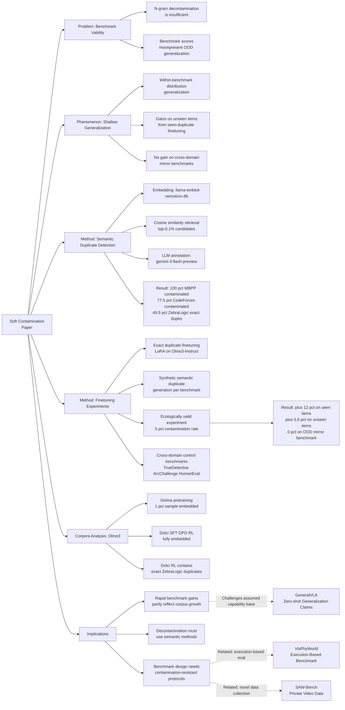

---
tags:
  - paper
  - LLM
  - Foundation_Model
  - VLA
  - Embodied_AI
aliases:
  - "Soft Contamination Means Benchmarks Test Shallow Generalization"
url: http://arxiv.org/abs/2602.12413v1
pdf_url: https://arxiv.org/pdf/2602.12413v1
local_pdf: "[[Soft Contamination Means Benchmarks Test Shallow Generalization.pdf]]"
github: "https://github.com/AriSpiesberger/Soft-Contamination-Prevelance"
project_page: "None"
institutions:
  - "Arb Research"
  - "Charles University, Prague"
  - "University of Cambridge"
  - "University of Oxford"
publication_date: "2026-02-12"
score: 7
---

# Soft Contamination Means Benchmarks Test Shallow Generalization

## 📌 Abstract
If LLM training data is polluted with benchmark test data, then benchmark performance gives biased estimates of out-of-distribution (OOD) generalization. Typical decontamination filters use n-gram matching which fail to detect semantic duplicates: sentences with equivalent (or near-equivalent) content that are not close in string space. We study this soft contamination of training data by semantic duplicates. Among other experiments, we embed the Olmo3 training corpus and find that: 1) contamination remains widespread, e.g. we find semantic duplicates for 78% of CodeForces and exact duplicates for 50% of ZebraLogic problems; 2) including semantic duplicates of benchmark data in training does improve benchmark performance; and 3) when finetuning on duplicates of benchmark datapoints, performance also improves on truly-held-out datapoints from the same benchmark. We argue that recent benchmark gains are thus confounded: the prevalence of soft contamination means gains reflect both genuine capability improvements and the accumulation of test data and effective test data in growing training corpora.

## 🖼️ Architecture
![[Soft Contamination Means Benchmarks Test Shallow Generalization_arch.png]]

## 🧠 AI Analysis

# 🚀 Deep Analysis Report: Soft Contamination Means Benchmarks Test Shallow Generalization

## 📊 Academic Quality & Innovation
---

## 1. Core Snapshot

### Problem Statement

Standard LLM benchmarks (e.g., CodeForces, MBPP, ZebraLogic, MuSR) are intended to measure out-of-distribution (OOD) generalization—the capacity to apply learned reasoning to genuinely novel problems. However, as training corpora have grown by at least 10,000× since 2020, they increasingly contain data that is *semantically* equivalent to benchmark test items, even when syntactically distinct. Conventional decontamination pipelines based on n-gram matching are blind to this "soft" contamination. The result is a systematic confound: observed benchmark score improvements may reflect training exposure to semantically similar data rather than genuine capability growth. Prior work studying this phenomenon either operated at small scale, did not study within-benchmark generalization, or did not use ecologically valid contamination rates.

### Core Contribution

The paper demonstrates, using the open-source Olmo3-7B model and its fully auditable training corpora, that semantic duplicates of major reasoning benchmarks are pervasive in pretraining and finetuning data, and that finetuning on such duplicates—even at ecologically realistic contamination rates (≈4 in 10,000 training points)—produces benchmark score inflations of approximately 15% on "seen" items and 5–6% on "unseen" items from the same benchmark, while leaving genuinely out-of-distribution benchmarks (in the same domain) unaffected, thereby establishing that benchmark gains are evidence of *shallow* rather than general reasoning generalization.

### Academic Rating

- **Innovation: 7/10.** The conceptual distinction between exact, semantic, and soft contamination is not entirely novel, but the paper's contribution lies in operationalizing it at scale (7B model, large corpora), introducing ecologically valid finetuning experiments, and carefully establishing the within-benchmark vs. cross-benchmark generalization boundary. The unified framing of shallow generalization as a phenomenon encompassing both item-level memorization and within-distribution generalization is a meaningful conceptual advance.
- **Rigor: 8/10.** The experimental design is careful: open-source models are chosen specifically to avoid confounds from undisclosed corpora; finetuning uses LoRA on verified-clean baselines; contamination rates are empirically estimated before designing experiments; and cross-benchmark controls are systematically applied. The main weakness is reliance on a single primary model (Olmo3-7B), with a noisy replication on Qwen3-8B that partially undermines generalizability.

---

## 2. Technical Decomposition

### Algorithmic Logic

The methodology can be decomposed into four sequential phases:

**Phase 1: Embedding-based Semantic Duplicate Discovery**

- *Step 1 — Corpus sampling:* Because embedding 100% of the Olmo3 pretraining corpus (Dolma + Dolmino) is computationally prohibitive, the authors sample 1% of base training data using a stratified reservoir sampling strategy that preserves the hierarchical sub-corpus distribution (e.g., proportional representation of `common_crawl/art-and-science` and other sub-sources). All finetuning data (Dolci SFT, Dolci DPO, Dolci RL) is embedded in full.
- *Step 2 — Embedding:* All sampled training data and all benchmark test items are embedded using `llama-embed-nemotron-8b` (rank 2 on MTEB at time of writing) in FP16 precision. For MBPP, inputs and outputs are concatenated to match the prompt-response format used in finetuning data.
- *Step 3 — Cosine similarity retrieval:* For each benchmark item, cosine similarity is computed against all training embeddings. The top-0.1% highest similarity matches are retained as candidate semantic duplicates.
- *Step 4 — LLM-assisted annotation:* From each benchmark item's top-0.1% matches, 100 candidates are randomly sampled. A `gemini-3-flash-preview` model is prompted to classify whether each (benchmark item, training item) pair constitutes a semantic duplicate, and if so, the type (exact, equivalent, subset, superset), the reasoning, and confidence. This yields labels for up to 10,000 annotation pairs per benchmark (e.g., 100 candidates × 100 benchmark items for ZebraLogic exact duplicate search; sampling 100 from top-0.1% for MBPP and CodeForces).

**Phase 2: Exact Duplicate Detection for ZebraLogic**

- The authors specifically investigate exact duplicates for ZebraLogic (observed verbatim in RL data). For each ZebraLogic test point, the 10 highest cosine similarity training matches are annotated for exact duplicate status, yielding up to 10,000 annotations for the full 1,000-item benchmark.

**Phase 3: Synthetic Semantic Duplicate Generation**

- For controlled finetuning experiments, the authors generate synthetic semantic duplicates of known benchmark items. Methods vary by benchmark:
  - *MuSR:* The provided logic tree structure is re-used to regenerate the narrative with different surface forms (levels 1–3 of paraphrase depth, exploiting the algorithmic data generation pipeline from the benchmark authors).
  - *ZebraLogic:* Grid puzzles are reformulated through shuffling, cell substitution, and paraphrasing of clues.
  - *MBPP:* Functionally equivalent Python solutions or alternative-language translations.
- This allows clean experimental separation between the type of duplicate (exact vs. semantic level 1/2/3) and their training effect.

**Phase 4: Finetuning Experiments**

- *Setup:* Olmo3-Instruct (non-reasoning model) is finetuned using LoRA. A teacher model (Claude Opus 4.5, and GPT-4.1-mini for MuSR) generates Chain-of-Thought (CoT) reasoning traces for each finetuning example. The formatted (question, CoT answer) pair is used as the finetuning input.
- *Train/test split of duplicates:* The set of benchmark items is split 50/50 into "seen" (used to generate duplicates that appear in finetuning data) and "unseen" (held-out; not used to generate finetuning duplicates). This allows within-benchmark generalization to be measured.
- *Ecologically valid experiment (Section 4.4):* The finetuning corpus consists of 10,000 SFT datapoints: 9,500 verified-clean samples and 500 semantic duplicates (corresponding to the 'seen' MuSR half; 4 duplicates per seen item across levels 2 and 3). This 5% contamination rate corresponds to the empirically estimated prevalence of ≈4 semantic duplicates per 10,000 training points for a given benchmark item.
- *Evaluation:* Models are evaluated at temperature 0.7 with 8 parallel generations on both benchmark halves ('seen', 'unseen') and on cross-domain benchmarks (TrueDetective for MuSR domain, Arc Challenge for ZebraLogic domain, HumanEval for MBPP domain; plus Arc Easy, BoolQ, HellaSwag, PIQA, Winogrande for broad capability checks).

**Intuition Behind the Flow**

The pipeline's key design choice is to use embedding-based retrieval rather than n-gram matching. The intuition is that semantically equivalent problems (e.g., two different grid puzzles testing the same logical structure, or two programming problems with different variable names but identical algorithmic requirements) will cluster in embedding space even when sharing few surface tokens. LLM-assisted annotation is then used to convert the continuous similarity score into a binary semantic-duplicate label, avoiding both false positives at low similarity thresholds and false negatives inherent in n-gram methods. The synthetic duplicate generation in controlled experiments allows causal identification of the contamination effect, while the ecologically valid experiment estimates the effect size under realistic conditions.

### Mathematical Formulation

The paper does not present novel loss functions; it uses standard supervised finetuning. The relevant formulations are:

**Semantic Similarity**

$$s(b_i, t_j) = \frac{\phi(b_i) \cdot \phi(t_j)}{\|\phi(b_i)\| \cdot \|\phi(t_j)\|}$$

where $b_i$ is the $i$-th benchmark item, $t_j$ is the $j$-th training corpus item, and $\phi(\cdot)$ denotes the embedding function (`llama-embed-nemotron-8b`). The top-$k$ training items by $s$ are retained as candidate duplicates.

**LoRA Finetuning Objective**

$$\mathcal{L}_{FT} = -\sum_{(x, y) \in \mathcal{D}_{ft}} \sum_{l=1}^{|y|} \log P_\theta(y_l \mid x, y_{<l})$$

where $x$ is the formatted question (with CoT reasoning trace prefix), $y$ is the CoT answer token sequence, $y_l$ is the $l$-th output token, $y_{<l}$ is all previous output tokens, $\mathcal{D}_{ft}$ is the finetuning dataset (either clean, contaminated, or exact/semantic duplicates of benchmark items), and $\theta$ are the LoRA-adapted parameters of Olmo3-Instruct. Minimizing this loss trains the model to reproduce the CoT answer given the question.

**Within-Benchmark Generalization Metric**

Let $\mathcal{B}_{seen}$ and $\mathcal{B}_{unseen}$ be disjoint halves of benchmark $\mathcal{B}$. Let $\mathcal{D}_{seen}$ be finetuning data consisting of duplicates of $\mathcal{B}_{seen}$ items only. Shallow generalization is operationalized as:

- *Seen effect:* $\Delta_{seen} = \text{Acc}(M_{ft}, \mathcal{B}_{seen}) - \text{Acc}(M_{base}, \mathcal{B}_{seen})$
- *Unseen effect:* $\Delta_{unseen} = \text{Acc}(M_{ft}, \mathcal{B}_{unseen}) - \text{Acc}(M_{base}, \mathcal{B}_{unseen})$
- *Cross-benchmark control:* $\Delta_{OOD} = \text{Acc}(M_{ft}, \mathcal{B}_{mirror}) - \text{Acc}(M_{base}, \mathcal{B}_{mirror})$

where $\mathcal{B}_{mirror}$ is a different benchmark in the same domain (e.g., TrueDetective for MuSR). The signature of shallow generalization is $\Delta_{seen} > 0$, $\Delta_{unseen} > 0$, and $\Delta_{OOD} \approx 0$.

### Tensor Flow & Architecture

This paper is empirical rather than architectural, so tensor-level description is limited to the embedding pipeline:

- **Input benchmark item** $b_i$: tokenized text string.
- **Embedding model** (`llama-embed-nemotron-8b`, FP16): maps variable-length token sequences to a fixed-dimensional embedding vector $\phi(b_i) \in \mathbb{R}^{d}$ where $d$ is the model's embedding dimension.
- **Training corpus items** $\{t_j\}$: embedded analogously. For MBPP, inputs and outputs are concatenated prior to embedding: $t_j = [input_j; output_j]$.
- **Similarity matrix** $S \in \mathbb{R}^{|\mathcal{B}| \times N_{train}}$: computed between all $|\mathcal{B}|$ benchmark items and $N_{train}$ sampled training items. Top-$k$ entries per row are extracted.
- **LoRA finetuning:** Olmo3-Instruct backbone is frozen; low-rank adapter matrices $A \in \mathbb{R}^{r \times d_{in}}$, $B \in \mathbb{R}^{d_{out} \times r}$ (with rank $r \ll \min(d_{in}, d_{out})$) are trained. Temperature 0.7, 8 parallel decoding passes per evaluation.

### Innovation Logic

Compared to prior work:

- **vs. Magar & Schwartz (2022) / Elazar et al. (2024):** These studies focused exclusively on exact (n-gram) syntactic duplicates. The present work extends to semantic duplicates, which n-grams systematically miss.
- **vs. Yang et al. (2023) / Riddell et al. (2024):** These studied the *item-to-item* effect of semantic contamination (performance on item $b_i$ from exposure to semantic duplicates of $b_i$). The present work additionally studies *within-benchmark distribution* generalization: finetuning on duplicates of $\mathcal{B}_{seen}$ improves performance on $\mathcal{B}_{unseen}$, a strictly broader contamination effect not captured by item-level analyses.
- **vs. Shilov et al. (2025):** Focused on canary memorization (MIA-style), which requires the model to have memorized specific tokens, not applicable to semantic duplicates.
- **vs. Kocyigit et al. (2025):** Studied ecologically valid rates of *exact* duplicates. The present work is the first to study ecologically valid rates of *semantic* duplicates in a finetuning experiment with an open-data model.

---

## 3. Evidence & Metrics

### Benchmarks and Baselines

**Benchmarks evaluated:** ZebraLogic (1,000 logic grid puzzles), MBPP (257 Python programming tasks, sanitized test set), CodeForces (468 competitive programming problems), MuSR murder mysteries (250 multi-step reasoning problems).

**Mirror/control benchmarks:** TrueDetective (same-domain control for MuSR), Arc Challenge (same-domain control for ZebraLogic), HumanEval (same-domain control for MBPP), Arc Easy, BoolQ, HellaSwag, PIQA, Winogrande (broad capability controls).

**Baseline models:** Olmo3-Instruct (primary), Qwen3-8B-base (replication, partially noisy). No closed models are used, by design, to ensure auditable corpora.

**Fairness of experimental design:** The experimental design is notably careful. The choice of open-source models is explicitly motivated by the need to rule out prior training exposure to finetuning examples. The 50/50 seen/unseen split is standard for contamination effect studies. The use of ecologically valid contamination rates (derived from empirical duplicate prevalence measurements) is a genuine methodological advance over prior proof-of-concept studies. The cross-benchmark controls (same domain, different benchmark) are well-chosen.

### Key Results

**Contamination prevalence:**
- ZebraLogic: ≥49.5% of benchmark tasks have at least one exact duplicate in Olmo3 training corpora (primarily Dolci Instruct RL); for grid sizes ≥4×4, ≥70% of problems have exact duplicates.
- MBPP: 100% of problems have at least one semantic duplicate in the top-100 cosine similarity training matches.
- CodeForces: 77.5% of problems have at least one semantic duplicate in the top-100 cosine similarity training matches.

**Finetuning effects (MuSR, Table 2):**
- Baseline: 66.0% on unseen items.
- Exact duplicates finetuning: 87.3% on unseen (+21.3 pp), 87.9% on seen.
- Semantic duplicate levels 1–3: 86.0–87.9% on unseen (+20–21.9 pp), comparable to exact duplicates.
- Cosine similarity neighbors (non-semantic-duplicate): 63.3–68.6% on unseen (no substantial gain).
- Cross-benchmark (TrueDetective): 27.7–29.8% (vs. baseline 28.3%), essentially flat.

**Finetuning effects (ZebraLogic, Table 3):**
- Baseline: 36.9% on unseen.
- Exact duplicates: 43.4% on unseen (+6.5 pp), 48.4% on seen.
- Semantic paraphrase only: 36.2% on unseen (+~0 pp); shuffle+subs+para degraded to 28.4% on unseen.
- Arc Challenge control: ~49–50.7%, essentially flat.

**Finetuning effects (MBPP, Table 4):**
- Baseline: 46.4% on unseen.
- Exact duplicates: 48.8% on unseen (+2.4 pp), 63.0% on seen.
- Semantic duplicates (Python): 53.6% on unseen (+7.2 pp), 55.1% on seen.
- HumanEval: 67.0% for semantic dupes (vs. 55.3% baseline, +11.7 pp — notable and discussed as potentially due to high-quality synthetic data).

**Ecologically valid finetuning (Table 5, MuSR):**
- Baseline: 42.8% seen, 40.4% unseen (Olmo3 without finetuning).
- Finetuned clean (10,000 SFT points, no duplicates): 50.0% unseen (+9.6 pp from SFT gains).
- Finetuned contaminated (same but 5% = 500 semantic duplicates of seen subset): 66.4% seen, 54.4% unseen (+4.4 pp above clean on unseen, +16.4 pp above clean on seen).
- TrueDetective: 28.0% for both clean and contaminated (flat).

**Key quantitative summary:** Even at a realistic contamination rate of 5% (≈4/10,000 training points being semantic duplicates of a given benchmark item), the contaminated model scores 12% higher than the clean model on seen benchmark items and 5.6% higher on unseen items, with no benefit on the out-of-distribution mirror benchmark.

### Ablation Study

The most critical experimental factor is the **type of duplicate used for finetuning**. For MuSR, semantic duplicates at all three levels of paraphrase depth produce gains equivalent to exact duplicates (~20 pp on unseen), while high cosine similarity neighbors that are *not* semantic duplicates produce no gain. This isolates the causal mechanism: it is semantic equivalence of content, not surface-level similarity, that drives benchmark improvement. For ZebraLogic, the picture is more nuanced: exact duplicates drive gains, but semantic paraphrases alone do not (and overly aggressive paraphrase/substitution combinations degrade performance), suggesting that ZebraLogic's grid-puzzle structure may require more precise semantic equivalence to transfer. The ecologically valid contamination experiment (Section 4.4) is the most policy-relevant ablation, confirming that realistic contamination rates are sufficient to produce a measurable and practically significant confound.

---

## 4. Critical Assessment

### Hidden Limitations

**Scope limited to one open-source model family.** All primary results use Olmo3-7B/Instruct. The Qwen3-8B replication is described as "noisy" and produces unexpected gains even in the clean finetuning condition, undermining the clean/contaminated comparison. The paper explicitly acknowledges that frontier model corpora (e.g., Llama 4 with 30T tokens) will have different semantic duplicate rates, and these cannot be studied without access to the corpora.

**False negative rate in duplicate detection.** The authors rely on top-0.1% cosine similarity matches and 100 randomly sampled candidates per benchmark item. By design, semantic duplicates that fall outside the top-0.1% cosine similarity range are not detected, so the contamination prevalence numbers (78% for CodeForces, 100% for MBPP) are acknowledged lower bounds. The embedding model used (llama-embed-nemotron-8b) may also miss structural semantic equivalence in domains where surface form and semantic content diverge (e.g., mathematically equivalent but syntactically distant problems).

**Underrepresentation of synthetic data pipelines.** Modern frontier model training corpora increasingly include intentional paraphrases and synthetic rephrasings generated by instruction-tuned LLMs (e.g., via Wei & Zou, 2019; Wang et al., 2022). Dolma/Dolmino, as relatively older corpora, have lower rates of such synthetic duplicates, meaning the paper likely underestimates the problem for state-of-the-art models.

**Within-benchmark generalization is not always observed.** For ZebraLogic, semantic duplicates (other than exact copies) do not consistently improve unseen performance, and some configurations degrade it. This undermines the universality of the "shallow generalization" claim and suggests the phenomenon is benchmark-architecture-dependent. The paper partially explains this by noting that ZebraLogic's grid structure makes it harder to create genuinely equivalent semantic duplicates through paraphrase.

**CoT teacher model confound.** Finetuning examples are labeled with CoT traces from Opus 4.5 or GPT-4.1-mini. The quality of the teacher's reasoning traces is a confound: observed performance gains could partly reflect the quality of the CoT reasoning demonstrations rather than (or in addition to) the contamination effect. This is partially addressed in Appendix C (better teacher → better finetuning result), but it complicates the isolation of the contamination mechanism.

### Engineering Hurdles

**Embedding scale.** Even at 1% sampling, embedding Dolma/Dolmino and computing cosine similarities against benchmark items at scale requires significant GPU memory and compute. The full finetuning data (Dolci SFT, DPO, RL) is embedded in full. Reproducing this at the scale of frontier corpora (30T tokens) would be computationally infeasible with current methods.

**LLM annotation cost and reliability.** The semantic duplicate annotation pipeline calls `gemini-3-flash-preview` on up to 10,000 pairs per benchmark. Annotation quality depends on the LLM's calibration for this judgment, which is not independently validated (no human inter-annotator agreement is reported). Practitioners reproducing this work must account for API costs and potential annotation drift across model versions.

**LoRA finetuning instability.** The Qwen3-8B replication is described as suffering from "training instability during finetuning," producing noisy results that cannot support clean inferences. This is a practical warning for practitioners: LoRA finetuning on small, potentially imbalanced datasets (500 contaminated points mixed into 10,000 clean) can be sensitive to hyperparameter choices and base model characteristics. No hyperparameter search protocol is reported.

**Benchmark-specific synthetic duplicate generation.** Generating valid semantic duplicates for ZebraLogic (grid puzzles) and MBPP (code) requires benchmark-specific pipelines. For ZebraLogic, the authors exploit the benchmark's internal logic tree structure; for MBPP, they generate Python alternatives and translations. These pipelines are non-trivial to generalize to arbitrary benchmarks and require domain knowledge for quality control.

**Ecological validity estimation is approximation-dependent.** The 4/10,000 semantic duplicate rate is derived from: (a) the proportion of top-0.1% cosine similarity matches that are true semantic duplicates (empirically estimated as ~40 per 100 sampled candidates for MBPP), and (b) the total volume of training data sampled. The chain of approximations (1% corpus sample × top-0.1% threshold × 100-candidate subsample × LLM annotation) means the final rate estimate carries compounding uncertainty that is not fully quantified.

## 🔗 Knowledge Graph & Connections
## Task 1: Differential Analysis & Connections

### Connection 1: [[VisPhyWorld]] — Benchmark Validity and Execution-Based Evaluation

**Relevance:** Both papers are fundamentally concerned with whether benchmarks actually test the capability they claim to measure. VisPhyWorld argues that recognition-style VQA benchmarks can be "solved" without genuine physical reasoning, and proposes execution-based evaluation as a more falsifiable protocol. The soft contamination paper makes an analogous argument: standard reasoning benchmarks can be "solved" partially through shallow generalization from semantically similar training data, not genuine OOD reasoning capability.

**Differential Analysis:** The two papers diagnose the same root problem — *benchmark validity* — but from orthogonal directions. VisPhyWorld addresses *protocol invalidity* (the evaluation format allows shortcut strategies regardless of training data), whereas the soft contamination paper addresses *training data invalidity* (the training pipeline injects shortcuts that inflate scores on otherwise well-designed benchmarks). VisPhyWorld's solution is to redesign the evaluation task (generate runnable code); the soft contamination paper's implicit solution is to redesign decontamination pipelines. Notably, VisPhyWorld's execution-based framework is largely immune to soft contamination because generating syntactically and semantically *correct executable code* that passes physics simulation tests is far harder to contaminate via paraphrase than multiple-choice or short-answer formats. This suggests a convergent insight: **harder-to-contaminate evaluation formats tend to demand more genuine generalization**, connecting the two papers at the level of benchmark design philosophy.

---

### Connection 2: [[Learning_Situated_Awareness_in_the_Real_World]] — Human-Model Performance Gap and Benchmark Saturation

**Relevance:** SAW-Bench documents a 37.66% human-model performance gap on egocentric situated awareness tasks and explicitly designs its benchmark to resist shortcut-solving by probing observer-centric relationships that require genuine viewpoint reasoning. This connects to the soft contamination paper's concern that benchmark scores on reasoning tasks may be inflated by shallow generalization.

**Differential Analysis:** SAW-Bench addresses contamination risk indirectly by using *self-recorded, proprietary video data* that is unlikely to appear in any training corpus — a form of hard decontamination by data provenance. The soft contamination paper, by contrast, studies benchmarks (MBPP, CodeForces, ZebraLogic) that were *publicly released* and subsequently absorbed into training corpora, making their decontamination status uncertain. SAW-Bench's approach of using novel, privately collected evaluation data represents an engineering-level solution to the contamination problem that the soft contamination paper's authors would likely endorse. However, SAW-Bench does not formally characterize *how much* of its observed human-model gap is genuine capability deficit versus data distribution artifacts — a gap that the soft contamination paper's methodology (embedding-based duplicate search + controlled finetuning) could in principle address. The papers are therefore *methodologically complementary*: SAW-Bench provides a contamination-resistant benchmark design; the soft contamination paper provides tools to quantify contamination in existing benchmarks.

---

### Connection 3: [[GeneralVLA]] — Generalization vs. Shallow Pattern Matching in Foundation Model Finetuning

**Relevance:** GeneralVLA is fundamentally concerned with the failure of foundation models to achieve genuine zero-shot generalization to unseen robotic scenarios, proposing hierarchical knowledge-guided planning to bridge this gap. This directly connects to the soft contamination paper's core finding that observed benchmark gains often reflect within-distribution shallow generalization rather than true OOD capability.

**Differential Analysis:** GeneralVLA implicitly *assumes* that the foundation models it builds upon have genuine OOD generalization capabilities in language and vision domains, and focuses on the robotics-specific grounding gap. The soft contamination paper challenges this assumption at the foundation level: if LLM reasoning benchmark gains are partly attributable to shallow generalization, then the "strong open-world generalization" that GeneralVLA relies on may itself be partially illusory. Furthermore, GeneralVLA's use of finetuning on trajectory data raises an analogous contamination concern: if finetuning data for the high-level planner semantically overlaps with evaluation scenarios, the zero-shot generalization claims could be confounded in exactly the way the soft contamination paper describes. The two papers thus stand in a *foundational critique relationship*: the soft contamination findings, if general, undermine the assumed capability base that hierarchical VLA models are built upon.

---

## Task 2: Mermaid Knowledge Graph

---

## Task 3: Future Research Directions

### Direction 1: Semantic Decontamination as a Standard Pipeline Component

The paper demonstrates that n-gram decontamination is systematically insufficient but stops short of proposing a deployable decontamination solution. A concrete research direction would be to develop and benchmark a **semantic decontamination pipeline** that can be practically integrated into LLM training workflows. This would require: (a) efficient approximate nearest neighbor retrieval at the scale of hundreds of billions of tokens (e.g., using FAISS with quantized embeddings); (b) a calibrated threshold-selection method that controls false negative rate without excessive false positive rate (which would wastefully remove clean training data); and (c) an evaluation framework that quantifies residual contamination after decontamination. The soft contamination paper provides the ground truth annotation methodology needed to validate such a pipeline. A key open question is whether the observed relationship between cosine similarity and semantic duplicate probability (Figure 2 of the paper) is stable across embedding models, domains, and corpus types — a necessary condition for a universal decontamination threshold.

---

### Direction 2: Contamination-Resistant Benchmark Design Principles

The paper's finding that ecologically realistic contamination rates produce significant benchmark score inflation motivates a principled study of **which benchmark design choices are inherently more resistant to soft contamination**. Connecting to the VisPhyWorld insight, benchmarks that require generating novel, executable artifacts (code, proofs, simulation programs) may be harder to contaminate because semantic duplicates of the *input problem* do not necessarily contain the *correct output*, whereas for multiple-choice or fixed-answer benchmarks, semantic duplicates may contain or strongly imply the correct answer. A research program could: (a) systematically compare contamination sensitivity across benchmark types (multiple-choice, open-ended generation, execution-verified); (b) develop a formal contamination resistance score for benchmark proposals; and (c) study whether procedurally generated benchmarks with controlled randomness (like ZebraLogic's grid structure) offer contamination resistance by making semantic duplicate generation computationally expensive. This connects directly to the observation in the paper that ZebraLogic's exact duplicates drove larger gains than paraphrased semantic duplicates — suggesting that even partial contamination resistance is achievable through structural complexity.

---

### Direction 3: Disentangling Shallow Generalization from Capability Growth in LLM Training Dynamics

The paper demonstrates the *existence* of shallow generalization as a confound but does not characterize *how much* of the observed gains in state-of-the-art models are attributable to it. A valuable research direction would be to develop a **longitudinal contamination-adjusted capability tracking** framework. Concretely: given access to training corpus snapshots across model generations (e.g., successive Llama, Olmo, or Mistral releases), one could estimate the semantic duplicate rate of major benchmarks at each training stage and regress observed benchmark score gains against the estimated contamination rate. If contamination explains a significant fraction of the variance in benchmark gains across model generations, this would provide the strongest evidence to date that the benchmark-progress narrative in AI is systematically overstated. This direction also connects to the GeneralVLA context: if foundational reasoning capabilities are partially illusory, then systems built on top of them (e.g., for zero-shot robotic planning) may have unexplained performance cliffs on genuinely novel deployment scenarios — a testable prediction that could be validated by designing robotic evaluation scenarios with provably zero semantic overlap to training data.

---
*Analysis performed by PaperBrain-OpenRouter (anthropic/claude-4.6-sonnet) (Vision-Enabled)*

## 📂 Resources
- **Local PDF**: [[Soft Contamination Means Benchmarks Test Shallow Generalization.pdf]]
- [Online PDF](https://arxiv.org/pdf/2602.12413v1)
- [ArXiv Link](http://arxiv.org/abs/2602.12413v1)
