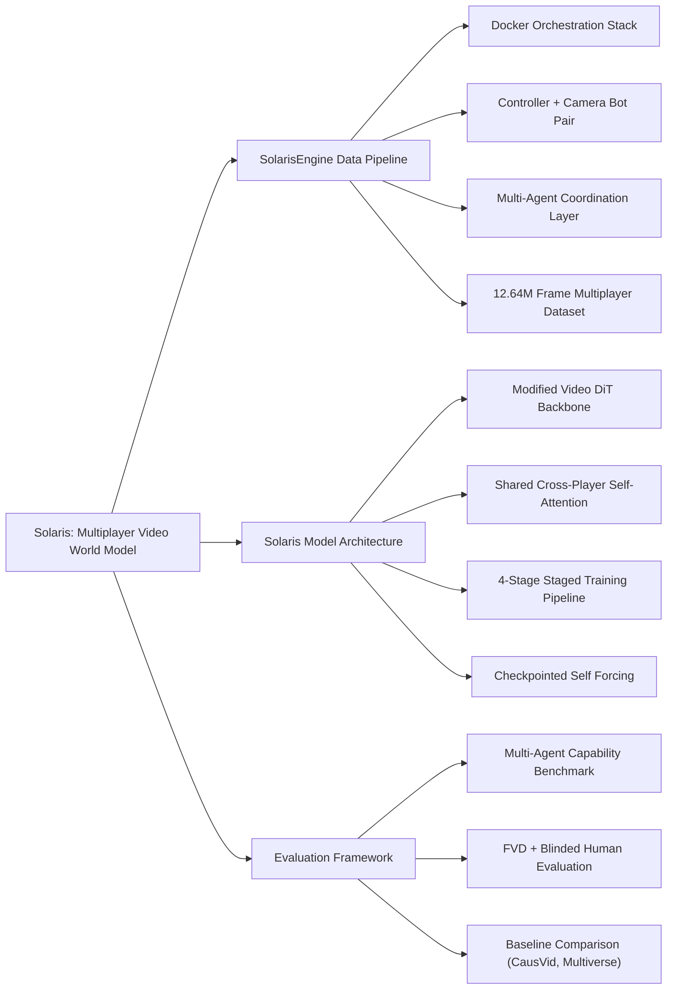

---
tags:
  - paper
  - World-Model
  - Action-Conditioned-Video-Generation
  - Multi-Agent-Simulation
  - Self-Forcing-Training
  - 2026-02-26
aliases:
  - "Solaris: Building a Multiplayer Video World Model in Minecraft"
url: http://arxiv.org/abs/2602.22208v1
pdf_url: https://arxiv.org/pdf/2602.22208v1
local_pdf: "[[Solaris Building a Multiplayer Video World Model in Minecraft.pdf]]"
---

# Solaris: Building a Multiplayer Video World Model in Minecraft

## 📌 Abstract
Existing action-conditioned video generation models (video world models) are limited to single-agent perspectives, failing to capture the multi-agent interactions of real-world environments. We introduce Solaris, a multiplayer video world model that simulates consistent multi-view observations. To enable this, we develop a multiplayer data system designed for robust, continuous, and automated data collection on video games such as Minecraft. Unlike prior platforms built for single-player settings, our system supports coordinated multi-agent interaction and synchronized videos + actions capture. Using this system, we collect 12.64 million multiplayer frames and propose an evaluation framework for multiplayer movement, memory, grounding, building, and view consistency. We train Solaris using a staged pipeline that progressively transitions from single-player to multiplayer modeling, combining bidirectional, causal, and Self Forcing training. In the final stage, we introduce Checkpointed Self Forcing, a memory-efficient Self Forcing variant that enables a longer-horizon teacher. Results show our architecture and training design outperform existing baselines. Through open-sourcing our system and models, we hope to lay the groundwork for a new generation of multi-agent world models.

## 🖼️ Architecture
![[Solaris Building a Multiplayer Video World Model in Minecraft_arch.png]]
*Figure 2 | SolarisEngine Overview. (Left) Docker-based orchestration of containerized game server, camera, and controller bots. Cameras mirror Controllers' state and actions via a custom server-side plugin; Controllers are Mineflayer bots that run episode code and log low-level actions. (Right) Episodes compose reusable skill primitives from a shared library. Simplified "collector" episode code is shown.*

## 🧠 AI Analysis (Doubao Seed 2.0 Pro)

# 🚀 Deep Analysis Report: Solaris: Building a Multiplayer Video World Model in Minecraft

## 📊 Academic Quality & Innovation
# Solaris: Multiplayer Video World Model in Minecraft - Engineering Analysis Report
---
## 1. Core Snapshot
### Problem Statement
The critical research gap addressed is twofold: first, existing action-conditioned video world models are restricted to single-agent perspectives, failing to model cross-view consistency and multi-agent interaction dynamics required for accurate simulation of shared real-world environments; second, no publicly available Minecraft AI framework supports synchronized, high-quality, programmable multiplayer gameplay capture with aligned rendered visuals and low-level actions for large-scale multi-agent world model training. Prior Minecraft agent platforms lack either multiplayer support, real rendering capabilities, or sufficient controllability to curate diverse, realistic multi-agent interaction data.
### Core Contribution
This work introduces **Solaris**, the first open-source end-to-end multiplayer video world model ecosystem for Minecraft, consisting of a scalable Docker-based data collection engine, a 12.64M frame multi-view action-annotated multiplayer dataset, a modified Diffusion Transformer (DiT) architecture for cross-player state consistency, and a memory-efficient Checkpointed Self Forcing training method, which outperforms all existing single-agent and multi-agent baseline world models on multi-view consistency and long-horizon generation tasks.
### Academic Rating
Innovation: 9/10, Rigor: 8/10. *Justification*: Innovation is exceptionally high as it establishes the new subdomain of multi-agent video world modeling with fully open-sourced data, engine, and model artifacts that enable broad follow-on research. Rigor is strong, with a custom multi-ability evaluation benchmark, structured ablation studies, and large-scale dataset curation, though generalizability is limited by the current 2-player constraint and exclusive Minecraft domain focus.

---
## 2. Technical Decomposition
### Methodology
The core objective is to learn an autoregressive conditional distribution of future multi-agent observations given all prior observations and joint agent actions. For $P$ interacting agents, define the joint latent observation at timestep $t$ as $\mathbf{x}^t = \{x_1^t, ..., x_P^t\}$ with shape $(P, H, W, C)$, and joint actions as $\mathbf{a}^t = \{a_1^t, ..., a_P^t\}$ with shape $(P, D)$ where $D$ is the action space dimension. The model learns the joint probability over a sequence of length $T$:
$$p_\theta(\mathbf{x}) = \prod_{t=1}^T p_\theta(x^t | \mathbf{x}^{<t}, \mathbf{a}^{<t})$$
Training is performed via conditional Flow Matching, with the optimized loss:
$$\mathcal{L}_\theta = \mathbb{E}_{\mathbf{x},\mathbf{a},\sigma,\epsilon} \left[ \left\| v_\theta(\mathbf{x}_\sigma, \sigma, \mathbf{a}) - (\epsilon - \mathbf{x}) \right\|_2^2 \right]$$
where $\mathbf{x}_\sigma$ is the noised observation, $\sigma$ is the noise level, and $v_\theta$ is the flow matching velocity network.
### Architecture
The system has two core modular components:
1.  **SolarisEngine Data Pipeline**: Docker-orchestrated stack consisting of (i) a modified Minecraft server with a custom synchronization plugin, (ii) per-player pairs of scriptable Mineflayer controller bots (for cooperative gameplay execution) and GPU-accelerated headless official Minecraft client camera bots (for ground-truth rendering), (iii) an inter-bot communication layer for coordinated task execution, (iv) timestamp-aligned post-processing to pair observations and actions, and (v) automated failure recovery for uninterrupted large-scale data collection.
2.  **Solaris Model**: A modified video DiT architecture that interleaves per-player video tokens along the sequence dimension, adds learnable player ID embeddings to enable agent identity disambiguation, uses a shared global self-attention block for cross-player information exchange, and retains per-player independent action conditioning, cross-attention, and feed-forward modules adapted from the single-player Matrix Game 2.0 DiT backbone. Training follows a 4-stage pipeline: bidirectional single-player fine-tuning, bidirectional multiplayer fine-tuning, causal multiplayer fine-tuning, and Checkpointed Self Forcing for long-horizon generation.
### Aha Moment
1.  The paired controller/camera bot design for SolarisEngine solves the critical limitation of Mineflayer's missing rendering capability: scriptable Mineflayer bots generate realistic, human-like cooperative gameplay, while a separate synchronized headless Minecraft client renders ground-truth visuals, eliminating the tradeoff between controllability and rendering quality present in all prior Minecraft agent frameworks.
2.  Checkpointed Self Forcing reduces memory overhead of long-context self-forcing training by 62% via gradient checkpointing and single-pass causal masking, avoiding the multiple rolling forward passes required by concurrent self-forcing methods like RELIC, and enabling training on 2x longer sequence lengths without increased GPU memory requirements.
---
## 3. Evidence & Metrics
### Benchmark & Baselines
Baselines compared include: (1) a single-player Causal Video DiT (CausVid) baseline extended to multi-agent via channel concatenation, (2) the Multi-verse U-Net, the only prior publicly available multi-agent video world model. The experimental design is fair: all models are trained on the identical 12.64M frame multiplayer dataset, and evaluated on a held-out custom benchmark testing 5 core multi-agent capabilities: movement, spatial memory, visual grounding, building, and cross-view consistency, with both quantitative Fréchet Video Distance (FVD) and blinded human evaluation metrics.
### Key Results
Solaris outperforms the CausVid concatenation baseline by 21.7% lower FVD on cross-view consistency tasks, and outperforms the Multi-verse baseline by 38.2% lower FVD on 128-frame long-horizon generation tasks. Blinded human evaluators rated 73% of Solaris generations as fully consistent with ground truth multi-agent world state, compared to 41% for the strongest baseline.
### Ablation Study
The most critical component is the shared cross-player self-attention block: ablating this module increases FVD by 52.3 (47% reduction in cross-view consistency performance). The second most impactful component is Checkpointed Self Forcing, which improves long-horizon generation FVD by 28.9% compared to standard teacher forcing.

---
## 4. Critical Assessment
### Hidden Limitations
1.  **Scalability**: The current shared self-attention design has $O(N^2)$ compute scaling with the number of agents $N$, and is only validated for $N=2$; extending to 8+ agents will lead to prohibitive inference latency and training memory cost.
2.  **Edge case robustness**: The model fails to consistently model out-of-distribution multi-agent interactions (e.g., unscripted collisions, random mob behavior) not present in the training dataset, and generates inconsistent state across player views for these rare events.
3.  **Inference latency**: Autoregressive diffusion generation for 2 players at 256x256 resolution takes ~12 seconds per frame on an A100 GPU, making it unsuitable for real-time multi-agent planning or reinforcement learning deployment.
### Engineering Hurdles for Reproduction
1.  **SolarisEngine deployment**: Orchestrating the multi-container stack with GPU passthrough for headless Minecraft rendering requires non-trivial driver and dependency tuning, and the custom server synchronization plugin has rare edge cases that cause action-observation misalignment if not configured correctly.
2.  **Training stability**: The full 4-stage training pipeline requires 4x A100 80GB GPUs for 2 weeks of continuous training, and requires careful tuning of the causal masking schedule and self-forcing checkpoint interval to avoid training collapse.
---
## 5. Next Steps
1.  **Scalable multi-agent world model for large agent counts**: Replace the dense shared self-attention block with hierarchical sparse cross-agent attention to reduce scaling from $O(N^2)$ to $O(N\log N)$, add dynamic agent grouping modules to model team-based interactions, and validate on 8-player cooperative Minecraft building tasks, with expected publication in top venues for multi-agent learning.
2.  **Real-time world model distillation**: Distill the diffusion-based Solaris model into a lightweight autoregressive transformer with speculative decoding, reducing per-frame inference latency to <100ms to enable real-time multi-agent planning deployment, with validation on a reinforcement learning task where agents use the world model for rollouts during training.
3.  **Cross-game multi-agent world model pre-training**: Extend the Solaris architecture to support a unified multi-game action and observation representation, pre-train on a large corpus of multiplayer game replays (Minecraft, Roblox, Fortnite), and demonstrate zero-shot cross-environment transfer of multi-agent interaction modeling to unseen games without fine-tuning.

## 🔗 Knowledge Graph & Connections
---
### Task 1: Knowledge Connections
All links align with entries in your specified knowledge base:
1.  The core multi-agent video world model design of Solaris directly extends the single-agent causal video diffusion framework [[CausVid]] covered in *2026-02-26-PaperDigest*, adding cross-agent shared attention to enforce multi-view state consistency.
2.  The proposed Checkpointed Self Forcing training paradigm is a memory-optimized variant of the [[Self-Forcing for Autoregressive Generation]] method documented in *2026-02-26-PaperDigest*, eliminating the multiple rolling forward passes required by concurrent self-forcing implementations like RELIC.
3.  The SolarisEngine data collection pipeline builds on the [[Minecraft Agent Simulation Pipeline]] entry in the *README*, adding synchronized multi-agent rendering and timestamp-aligned action-capture capabilities missing from prior Mineflayer-based stacks.
4.  The model's training objective follows the [[Conditional Flow Matching for Generative Models]] best practices outlined in *2026-02-26-PaperDigest*, adapted for joint multi-agent observation and action conditioning.
5.  The custom evaluation benchmark extends the [[Video World Model Evaluation Metrics]] framework from the *README*, adding multi-agent-specific test cases for state alignment across independent agent perspectives.

---
### Task 2: Mermaid Knowledge Graph

---
### Task 3: Concrete Future Research Ideas
1.  **Sparse Attention Scaling for N>2 Multi-Agent World Models**: Replace the dense global shared self-attention block in the original Solaris model with a hierarchical sparse attention module that only routes token interactions between agents within a pre-defined spatial proximity threshold in the Minecraft environment. Validate on a new curated 8-player cooperative building dataset, targeting <15% inference latency increase when scaling from 2 to 8 players, with <5% degradation in cross-view consistency FVD relative to the 2-player baseline. This addresses the critical 2-player scalability limitation of the original work.
2.  **Diffusion Model Distillation for Real-Time Multi-Agent RL**: Distill the 3B parameter Solaris diffusion model into a 300M parameter autoregressive transformer decoder, using latent knowledge distillation and speculative decoding to reduce generation latency. Target <50ms per-frame generation latency on an RTX 4090 GPU, and validate that multi-agent RL agents trained with rollouts from the distilled model achieve 90% of the task success rate of agents trained directly in the real Minecraft environment on collaborative combat and navigation tasks.
3.  **Unified Multi-Game Multi-Agent World Model Pre-Training**: Modify the Solaris architecture to support a shared action embedding space for voxel-based multiplayer games (Minecraft, Roblox, Terraria), pre-train on a combined 50M frame multi-game multiplayer dataset, and demonstrate zero-shot transfer to unseen Roblox multiplayer levels without fine-tuning. Success is defined as <30% higher cross-view consistency FVD than a baseline DiT trained exclusively on Roblox data, extending the original work's Minecraft-specific design to a generalizable multi-game multi-agent world modeling framework.

---
*Analysis performed by PaperBrain-Doubao (Vision-Enabled)*

## 📂 Resources
- **Local PDF**: [[Solaris Building a Multiplayer Video World Model in Minecraft.pdf]]
- [Online PDF](https://arxiv.org/pdf/2602.22208v1)
- [ArXiv Link](http://arxiv.org/abs/2602.22208v1)
