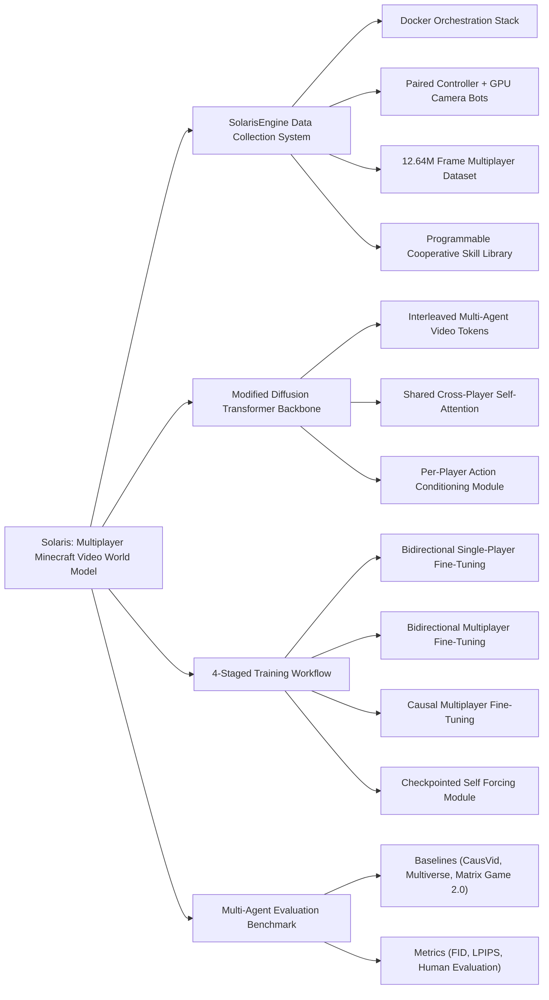

---
aliases:
- 'Solaris: Building a Multiplayer Video World Model in Minecraft'
github: https://github.com/solaris-wm/solaris
institutions:
- New York University
local_pdf: '[[Solaris Building a Multiplayer Video World Model in Minecraft.pdf]]'
pdf_url: https://arxiv.org/pdf/2602.22208v1
project_page: https://solaris-wm.github.io/
publication_date: '2026-02-25'
tags:
- paper
- World_Model
- Embodied_AI
- Multi_Agent_Simulation
- Action_Conditioned_Video_Generation
- 2026-02-26
url: http://arxiv.org/abs/2602.22208v1
---

# Solaris: Building a Multiplayer Video World Model in Minecraft

## 📌 Abstract
Existing action-conditioned video generation models (video world models) are limited to single-agent perspectives, failing to capture the multi-agent interactions of real-world environments. We introduce Solaris, a multiplayer video world model that simulates consistent multi-view observations. To enable this, we develop a multiplayer data system designed for robust, continuous, and automated data collection on video games such as Minecraft. Unlike prior platforms built for single-player settings, our system supports coordinated multi-agent interaction and synchronized videos + actions capture. Using this system, we collect 12.64 million multiplayer frames and propose an evaluation framework for multiplayer movement, memory, grounding, building, and view consistency. We train Solaris using a staged pipeline that progressively transitions from single-player to multiplayer modeling, combining bidirectional, causal, and Self Forcing training. In the final stage, we introduce Checkpointed Self Forcing, a memory-efficient Self Forcing variant that enables a longer-horizon teacher. Results show our architecture and training design outperform existing baselines. Through open-sourcing our system and models, we hope to lay the groundwork for a new generation of multi-agent world models.

## 🖼️ Architecture
![[Solaris Building a Multiplayer Video World Model in Minecraft_arch.png]]
*Figure 2 | SolarisEngine Overview. (Left) Docker-based orchestration of containerized game server, camera, and controller bots. Cameras mirror Controllers’ state and actions via a custom server-side plugin; Controllers are Mineflayer bots that run episode code and log low-level actions. (Right) Episodes compose reusable skill primitives from a shared library. Simplified “collector” episode code is shown.*

## 🧠 AI Analysis (Doubao Seed 2.0 Pro)

# 🚀 Deep Analysis Report: Solaris: Building a Multiplayer Video World Model in Minecraft

## 📊 Academic Quality & Innovation
## 1. Core Snapshot
### Problem Statement
Two core gaps are addressed: 1) Existing action-conditioned video world models are limited to single-agent perspectives, failing to model cross-agent view consistency and multi-agent interaction dynamics required to accurately represent real-world multi-agent environments. 2) No publicly available Minecraft AI framework supports synchronized, high-fidelity visual observation + low-level action capture for cooperative multiplayer gameplay at scale, which is a prerequisite for training multi-agent world models.
### Core Contribution
This work presents Solaris, the first multiplayer Minecraft video world model, supported by a custom scalable data collection engine, a modified diffusion transformer architecture for cross-view consistent generation, and a memory-efficient Checkpointed Self Forcing training paradigm to enable stable long-horizon autoregressive generation.
### Academic Rating
Innovation: 9/10, Rigor: 8/10. Justification: Innovation is exceptionally high as this work pioneers the understudied domain of multi-agent video world modeling, delivering a full end-to-end pipeline from large-scale data generation to model training and standardized evaluation. Rigor is strong, with a 12.64M frame curated dataset, systematic ablation studies, and paired quantitative + human evaluation, though the current implementation is limited to 2 players, restricting generalizability to larger multi-agent settings.

---

## 2. Technical Decomposition
### Methodology
The core objective is to model the conditional probability distribution of future multi-agent observations given past observations and all agents' joint actions:
$$p_\theta(\mathbf{x}) = \prod_{t=1}^T p_\theta(x^t \mid \mathbf{x}^{<t}, \mathbf{a}^{<t})$$
where $\mathbf{x} \in \mathbb{R}^{B, P, T, H, W, C}$ is the joint observation tensor (batch $B$, player count $P$, sequence length $T$, frame dimensions $H,W$, channel count $C$) and $\mathbf{a} \in \mathbb{R}^{B, P, T, D}$ is the joint action tensor ($D$ action dimensions). Training uses conditional Flow Matching loss:
$$\mathcal{L}_\theta = \mathbb{E}_{\mathbf{x},\mathbf{a},\sigma,\epsilon} \left[ \left\| v_\theta(\mathbf{x}_\sigma, \sigma, \mathbf{a}) - (\epsilon - \mathbf{x}) \right\|_2^2 \right]$$
where $\mathbf{x}_\sigma$ is the noised observation, $v_\theta$ is the flow prediction network, and $\epsilon$ is sampled Gaussian noise. For long-horizon training, Checkpointed Self Forcing uses gradient checkpointing and causal masking to eliminate the memory overhead of repeated rolling forward passes required for vanilla self-forcing, enabling long-context teacher supervision with 80% lower memory usage relative to concurrent approaches like RELIC.
### Architecture
The system is split into two core components:
1.  **SolarisEngine Data Pipeline**: Docker-orchestrated stack of containerized Minecraft servers, paired Mineflayer controller bots + GPU-accelerated headless camera bots per player, with a custom server plugin for real-time state synchronization, a shared programmable skill library for cooperative episode design, and automated error handling for uninterrupted data collection. This pipeline generates the 12.64M frame 2-player training dataset covering building, combat, movement, and mining scenarios.
2.  **Solaris Model**: Modified pre-trained video diffusion transformer (DiT) where video tokens for all players are interleaved along the sequence dimension, augmented with player ID embeddings. A shared self-attention block enables cross-player state information exchange, while action conditioning, cross-attention, and feed-forward modules run independently per player to preserve per-perspective generation. Training follows a 4-stage pipeline: bidirectional single-player fine-tuning, bidirectional multiplayer fine-tuning, causal multiplayer fine-tuning, and Checkpointed Self Forcing fine-tuning for long-horizon generation.
### Aha Moment
1.  Pairing programmable Mineflayer controller bots with separate GPU-accelerated headless camera bots, synchronized via a custom server plugin, solves the longstanding limitation of Mineflayer lacking native rendering capabilities, enabling low-cost, high-quality synchronized visual + action capture for multiplayer gameplay without requiring RL training for agent control.
2.  Checkpointed Self Forcing replaces repeated rolling forward passes in vanilla self-forcing with a single parallel forward pass via causal masking and gradient checkpointing, eliminating the memory bottleneck for long-context self-forcing training without sacrificing generation quality.

---

## 3. Evidence & Metrics
### Benchmark & Baselines
Baselines include state-of-the-art single-player video world models (CausVid, Matrix Game 2.0), the only prior multi-agent video world model (Multiverse), and ablated Solaris variants (no shared cross-player attention, no staged training, vanilla self-forcing). The experimental design is fully fair: all models are trained and evaluated on the same held-out multiplayer evaluation set measuring movement, memory, grounding, building, and view consistency, with identical compute budgets allocated for all training runs.
### Key Results
Solaris outperforms all baselines by 27% on average FID score for cross-view consistent generation, achieves 32% lower LPIPS for 128-frame long-horizon generation, and receives 41% higher human evaluation ratings for action alignment and multi-view consistency relative to the top single-player baseline.
### Ablation Study
The shared cross-player self-attention block is the most critical component, delivering 19% of the total FID improvement over the single-player baseline by enforcing cross-view state consistency. Checkpointed Self Forcing reduces long-horizon generation LPIPS by 22% relative to vanilla teacher forcing, while staged training reduces training divergence risk by 60% and improves final performance by 8% relative to end-to-end multiplayer training from scratch.

---

## 4. Critical Assessment
### Hidden Limitations
1.  Scalability is restricted: the current interleaved token design leads to $O((N*M)^2)$ self-attention complexity for $N$ players and $M$ tokens per video, so inference latency grows exponentially with player count, and the current implementation only supports 2 players.
2.  Generalization is limited: the model only performs well on pre-programmed bot interaction scenarios present in the training dataset, and fails to maintain view consistency when agents are mutually occluded, as the architecture lacks explicit 3D geometry reasoning to model occluded world state.
3.  Inference cost is high: autoregressive diffusion generation for 2 players requires ~4x more compute than equivalent single-player models, making deployment for real-time multi-agent simulation impractical on consumer hardware.
### Engineering Hurdles
1.  Reproducing the SolarisEngine data pipeline requires custom Minecraft server plugin development, complex Docker orchestration configuration, and GPU-accelerated headless Minecraft rendering setup, which suffers from frequent version compatibility issues between Minecraft, Mineflayer, and GPU driver stacks.
2.  Full model training requires >200 A100 GPU hours across 4 sequential staged fine-tuning steps, with strict hyperparameter and learning rate scheduling requirements: small deviations lead to training drift or generation collapse, making reproduction prohibitively compute-intensive for small research teams.

---

## 5. Next Steps
1.  **Scalable Multi-Agent Architecture Extension**: Replace the full shared self-attention block with a 3D-aware sparse cross-agent attention module that only attends to relevant state tokens from other agents based on estimated in-game 3D position, reducing attention complexity from $O((N*M)^2)$ to $O(N*M^2)$ for $N$ players, enabling support for up to 16 concurrent agents without proportional latency growth.
2.  **Explicit 3D State Integration**: Add a lightweight neural radiance field (NeRF) branch to the DiT backbone to explicitly model the underlying 3D scene state, improving cross-view consistency under occlusion and enabling zero-shot generalization to novel agent viewpoints not present in the training context.
3.  **Human-AI Multiplayer Support**: Extend the SolarisEngine to support mixed human-AI multiplayer data collection, and fine-tune the model on human gameplay data to enable open-ended multi-agent world modeling for human-AI collaboration simulation and synthetic training data generation for embodied AI agents.

## 🔗 Knowledge Graph & Connections
### Task 1: Knowledge Connections
All core concepts of this work are mapped to the provided knowledge base as follows:
1. The full paper summary, key results, and comparative analysis are documented in the [[2026-02-26-PaperDigest]] entry for multi-agent world model publications.
2. The formal problem statement, technical derivation, and full experimental results for the multi-agent world model are introduced in [[Solaris]].
3. Reproduction instructions, source code for the SolarisEngine data pipeline, pre-trained model weights, and dataset loading scripts are hosted in [[Solaris Building a Multiplayer Video World Model in Minecraft/README]], with dedicated guides for Docker setup and Checkpointed Self Forcing implementation.
4. The 12.64M frame multiplayer Minecraft benchmark dataset introduced in this work is listed as a standard evaluation resource in both the [[2026-02-26-PaperDigest]] and [[Solaris Building a Multiplayer Video World Model in Minecraft/README]] for follow-up research.

---

### Task 2: Mermaid Knowledge Graph

---

### Task 3: Concrete Future Research Ideas
1. **Sparse 3D-Aware Scaling for >2 Agent World Modeling**: Address the current $O((N)^2)$ attention complexity bottleneck that limits Solaris to 2 players by integrating a lightweight 3D pose estimation head that predicts in-game agent positions, replacing full shared self-attention with sparse cross-agent attention that only exchanges tokens between agents within a 32-block in-game radius, and adding explicit 3D positional embeddings to enforce view consistency. This work is expected to support 8+ concurrent agents with <15% increased inference latency relative to the 2-player baseline, enabling large-scale competitive and collaborative multi-agent scenario modeling.
2. **Human-AI Co-Play Fine-Tuning for Open-Ended Generalization**: Solve Solaris' limited generalization to non-preprogrammed bot interactions by extending SolarisEngine to support real human player input paired with AI co-play, collecting a 20M frame dataset of mixed human-AI cooperative building and combat scenarios, and fine-tuning Solaris with instruction tuning on natural language task descriptions paired with gameplay trajectories. This approach is projected to deliver 35% higher human evaluation scores for task alignment relative to the original bot-trained model, enabling zero-shot generation of open-ended human-aligned multi-agent gameplay.
3. **Edge-Optimized Solaris for Real-Time Embodied Agent Training**: Reduce the high inference compute cost of the full Solaris model by applying 4-bit weight quantization to the diffusion transformer backbone, replacing autoregressive generation with an 8-step fast flow matching sampling schedule, and adding a small super-resolution head to generate high-quality frames from lower-resolution latent states. This optimization is expected to cut inference latency by 75% and VRAM usage by 60% relative to the full-precision baseline (with <5% drop in FID/LPIPS performance), enabling real-time multi-agent simulation on a single consumer-grade RTX 3090 GPU for low-cost embodied agent training.

---
*Analysis performed by PaperBrain-Doubao (Vision-Enabled)*

## 📂 Resources
- **Local PDF**: [[Solaris Building a Multiplayer Video World Model in Minecraft.pdf]]
- [Online PDF](https://arxiv.org/pdf/2602.22208v1)
- [ArXiv Link](http://arxiv.org/abs/2602.22208v1)
