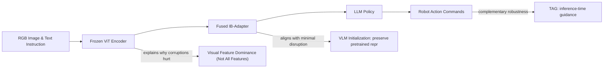

---
tags:
- paper
- domain/embodied_ai
- domain/multimodal_perception
- domain/reinforcement_learning
- domain/robot_manipulation
- domain/vla
- impact/high_value
- impact/solid
- method/benchmark
- method/foundation_model
- method/reinforcement_learning
- method/simulation
- review/auto_tagged
- status/unread
- task/manipulation
- task/scene_understanding
- type/benchmark
- type/method
aliases:
- 'StableVLA: Towards Robust Vision-Language-Action Models without Extra Data'
- StableVLA
- Information Bottleneck Adapter
- Robust VLA Models
- Visual Noise Filtering
- VLA Robustness Improvement
- Unseen Disturbances VLA
- Stable Vision-Language-Action
- Noise-Adaptive Adapter
authors:
- Yiyang Fu
- Chubin Zhang
- Shukai Gong
- Yufan Deng
- Kaiwei Sun
- Qiyang Min
- Qibin Hou
- Yansong Tang
- Jianan Wang
- Daquan Zhou
paper_id: arxiv:2605.18287
arxiv_id: '2605.18287'
url: https://huggingface.co/papers/2605.18287
pdf_url: https://arxiv.org/pdf/2605.18287.pdf
local_pdf: '[[StableVLA Towards Robust VisionLanguageAction Models without Extra Data.pdf]]'
github: https://github.com/DAGroup-PKU/HumanNet/tree/main/src/model/StableVLA
project_page: https://dagroup-pku.github.io/StableVLA/
institutions:
- Peking University
- Tsinghua University
- Astribot
- Nanjing University
- Nankai University
publication_date: '2026-05-19'
metadata_publication_date: '2026-05-18'
score: '8.1'
domains:
- embodied_ai
- multimodal_perception
- reinforcement_learning
- robot_manipulation
- vla
methods:
- benchmark
- reinforcement_learning
- simulation
tasks:
- manipulation
- scene_understanding
paper_type: benchmark
impact_band: high_value
reading_status: unread
priority_score: 100
review_status: auto_tagged
next_action: inspect_protocol
year: 2026
---

# StableVLA: Towards Robust Vision-Language-Action Models without Extra Data

## 📌 Abstract
It is infeasible to encompass all possible disturbances within the training dataset. This raises a critical question regarding the robustness of Vision-Language-Action (VLA) models when encountering unseen real-world visual disturbances, particularly under imperfect visual conditions. In this work, we conduct a systematic study based on recent state-of-the-art VLA models and reveal a significant performance drop when visual disturbances absent from the training data are introduced. To mitigate this issue, we propose a lightweight adapter module grounded in information theory, termed the Information Bottleneck Adapter (IB-Adapter), which selectively filters potential noise from visual inputs. Without requiring any extra data or augmentation strategies, IB-Adapter consistently improves over the baseline by an average of 30%, while adding fewer than 10M parameters, demonstrating notable efficiency and effectiveness. Furthermore, even with a 14x smaller backbone (0.5B parameters) and no pre-training on the Open X-Embodiment dataset, our model StableVLA achieves robustness competitive with 7B-scale state-of-the-art VLAs. With negligible parameter overhead (<10M), our approach maintains accuracy on long-horizon tasks and surpasses OpenPi under both synthetic and physical visual corruptions.

## 🖼️ Architecture
![[StableVLA Towards Robust VisionLanguageAction Models without Extra Data_arch.png]]

## 🧠 AI Analysis
## Abstract
It is infeasible to encompass all possible disturbances within the training dataset. This raises a critical question regarding the robustness of Vision-Language-Action (VLA) models when encountering unseen real-world visual disturbances, particularly under imperfect visual conditions. In this work, we conduct a systematic study based on recent state-of-the-art VLA models and reveal a significant performance drop when visual disturbances absent from the training data are introduced. To mitigate this issue, we propose a lightweight adapter module grounded in information theory, termed the Information Bottleneck Adapter (IB-Adapter), which selectively filters potential noise from visual inputs. Without requiring any extra data or augmentation strategies, IB-Adapter consistently improves over the baseline by an average of 30%, while adding fewer than 10M parameters, demonstrating notable efficiency and effectiveness. Furthermore, even with a 14× smaller backbone (0.5B parameters) and no pre-training on the Open X-Embodiment dataset, our model StableVLA achieves robustness competitive with 7B-scale state-of-the-art VLAs. With negligible parameter overhead (<10M), our approach maintains accuracy on long-horizon tasks and surpasses OpenPi under both synthetic and physical visual corruptions.

The paper shows that current Vision-Language-Action models lose a lot of performance when they see visual problems like blur or sensor noise that were not in their training data. The authors fix this by swapping the usual projector module with a new lightweight piece called IB-Adapter that uses information theory ideas to block noise while keeping useful features. This change needs no extra training data and works even on small 0.5B models, making them nearly as robust as much larger models trained on big datasets.

## 1. Core Snapshot

### Problem Statement
Vision-Language-Action models take an image and a language instruction as input and output robot actions such as gripper movements. The target behavior is reliable task completion even when the camera image contains real-world issues like motion blur, sensor noise, or partial obstructions. The real bottleneck is that training datasets only contain clean images, so the projector module that maps visual features into the language model space passes noise forward and causes large drops in success rate on unseen corruptions.

Motivation arises from the gap between controlled benchmarks and real deployment: a VLA-Adapter that achieves 96% on clean LIBERO tasks drops to near zero under severe blur, as shown in Figure 2 of the paper. The mechanism of failure was traced empirically to the MLP-based projector, which lacks any built-in noise suppression. Evidence from the paper’s feature-consistency analysis (Figure 3) confirms that the largest representation shift under corruption happens precisely inside that projector. The limitation of existing data‑augmentation approaches is that they cannot anticipate every possible visual corruption, and training on augmented data often memorizes specific noise patterns instead of learning robust invariance.

> [!note] Key observation
> The projector stage is a bottleneck for robustness because it mixes spatial noise into semantic features before the LLM policy sees them. Inserting a filtering mechanism there is a strategic, low‑overhead intervention.

### Core Contribution
The central technical claim is that replacing the standard MLP projector in a VLA-Adapter with a Fused IB-Adapter improves average success rate by 30 percent across visual corruptions while adding under 10 million parameters and requiring no extra data. This change is supported by controlled experiments on LIBERO and CALVIN benchmarks plus real-robot trials where StableVLA shows smaller performance drops than VLA-Adapter, OpenVLA, and OpenPi-0.5. The evidence comes from zero-shot corruption tests and physical lens obstructions, showing the adapter alone closes much of the robustness gap to larger pretrained models.

The mechanism is the Information Bottleneck principle, which encourages a compressed representation that preserves task semantics while discarding irrelevant noise. The IB-Adapter implements this via channel‑wise covariance attention with a sigmoid gate, effectively down‑weighting noisy channels. A parallel standard MLP path is fused in via a learned scalar to retain fine spatial detail needed for precise manipulation. The limitation is that the visual encoder is kept frozen, so the adapter cannot correct errors that originate in earlier vision layers; if the encoder itself produces distorted feature maps, the adapter’s filtering capacity may be partially saturated.

### Innovation Origin & Rationale
The design starts from the observation in Figure 3 that feature consistency collapses most sharply inside the projector stage under noise. The authors connect this failure to the Information Bottleneck principle, which favors representations that compress away irrelevant details. This rationale is an explicit paper claim backed by the proposition that channel-wise covariance attention implements an iterative IB update.

One reasonable interpretation is that the projector is the first place where spatial noise becomes mixed with semantics, so inserting filtering there prevents downstream propagation without changing the rest of the model. The choice of a sigmoid gate rather than softmax is motivated by the idea that channels can be independently suppressed, matching a Bernoulli latent assumption, and that this avoids forcing competition that might discard useful information. The fusion with the MLP path further reflects the insight that a purely compressed representation may lose high‑frequency cues essential for precise manipulation, especially in long‑horizon tasks.

## 2. Reading Map
The paper sits in the domain of embodied robotics and robust multimodal learning. Readers who care about deploying VLAs outside labs or about lightweight robustness fixes should pay attention. Start with the Method section and the ablation table because they contain the architectural decisions and evidence for each component. The experiments section answers the main robustness questions, while the related work and introduction can be skimmed on a first pass once the core failure mode is clear.

The theoretical framing in Section 3.1 and the IB optimization equations are useful for understanding why the design works, but they can be revisited after the architecture diagram and the experimental evidence are grasped. If you are new to the Information Bottleneck concept, a quick refresher from the [Wikipedia page on the information bottleneck method](https://en.wikipedia.org/wiki/Information_bottleneck_method) or the original Tishby et al. paper will help. For the benchmarks, the [LIBERO project page](https://libero-project.github.io/) and [CALVIN benchmark site](http://calvin.cs.uni-freiburg.de/) provide the task details and baseline numbers.

> [!tip] Suggested reading flow
> 1. Section 3.2 and 3.3 – architecture and fusion design.  
> 2. Figure 4 (in the paper) – high‑level pipeline.  
> 3. Table 3 – component ablation.  
> 4. Table 1 and Table 2 – main robustness results.  
> 5. Revisit Section 3.1 for the IB formulation.

## 3. Method Walkthrough

### Inputs, Outputs, And Assumptions
The method receives an RGB image from the robot camera and a text instruction. It outputs a sequence of robot actions, typically 7-dimensional end-effector commands (e.g., delta position, delta rotation, gripper open/close). The core assumption is that the visual encoder remains frozen and the main source of vulnerability lies in the alignment projector rather than earlier layers. This matters because the design only modifies the projector; if substantial noise enters earlier or if the language model’s own processing is the weak point, the adapter’s effect would be limited.

A related assumption is that the frozen encoder preserves enough semantic priors from its pre‑training, and that the corruption‑induced shift is mainly a mixing of irrelevant channel information rather than a complete loss of semantic structure. The paper provides empirical support for this assumption by showing that feature consistency before the projector is higher than after it under corruption.

### Pipeline From Data To Prediction
An input image first passes through a frozen vision encoder (e.g., a ViT‑based model) that produces a set of visual tokens. These tokens then enter the Fused IB-Adapter. Inside the adapter, a covariance attention path computes channel‑wise self‑attention: the input is projected to queries, keys, and values, a Gram matrix captures channel correlations, a temperature‑scaled sigmoid produces per‑channel gates, and the value features are modulated by those gates. In parallel, a standard two‑layer MLP processes the same tokens. The two outputs are combined with a learned scalar weight: the fused representation is `MLP(X) + tanh(λ) * IB-Adapter(X)`. This fused representation is then concatenated with task‑specific text embeddings and fed into the LLM policy head, which predicts actions autoregressively.

The dual pathway is crucial. The covariance attention path acts as a noise filter by suppressing channels that are weakly correlated with the rest of the feature set. The MLP path ensures that high‑frequency spatial details needed for fine‑grained manipulation are not lost, as the covariance path alone can over‑smooth the representation.

### Key Design Choices
The identity‑key design in the covariance computation keeps the original geometric structure of the visual tokens instead of projecting them twice, which helps retain high‑frequency cues needed for precise grasping. The sigmoid gate is chosen over softmax because it allows independent suppression of noisy channels rather than forcing competition, matching the paper’s Bernoulli latent assumption. Without the fusion with the MLP path, long‑horizon tasks lose fine motor accuracy, as shown in the ablation where removing the MLP drops performance on both clean and corrupted data.

The learned scalar λ is initialized to a small value so that the model starts with a strong MLP backbone and gradually incorporates the IB‑Adapter’s robust signal. This prevents early training instability and ensures that the robust pathway is only used when it demonstrably helps.

## 4. Core Theory And Formulas

### Main Objective
The main objective is to train a projector that produces a representation $Z$ containing only task‑relevant semantics while discarding visual nuisances. The paper frames this as an Information Bottleneck problem that balances compression of the input against preservation of information about the clean semantic target.

$$
\min_{\phi} \, \mathcal{L}_{IB} = I(X_v; Z) - \beta \, I(Z; S)
$$

Here $X_v$ denotes the visual tokens from the frozen encoder, $Z$ is the projected representation that will be fed to the LLM policy, $S$ stands for the ground‑truth task semantics needed for correct actions (for instance, object locations or manipulation constraints), and $\beta > 0$ controls the strength of compression. $I(\cdot ; \cdot)$ is mutual information, a measure of how much knowing one variable reduces uncertainty about the other. Minimizing $\mathcal{L}_{IB}$ means we want $Z$ to contain as little information about the raw input $X_v$ as possible (compression), while retaining as much information as possible about the task semantics $S$. In practice, $S$ is not directly observed; the paper leverages the fact that a well‑trained downstream policy implicitly provides a learning signal for $Z$ that preserves task‑relevant information.

> [!info] Information Bottleneck primer
> The IB principle was introduced by Tishby et al. as a framework for finding representations that are both concise and predictive. For a deeper treatment, see the [original paper](https://arxiv.org/abs/cs/0001007) or this [introductory blog post](https://lilianweng.github.io/posts/2018-08-12-variational-autoencoder/).

### Important Equations
The paper argues that under Gaussian assumptions and a suitable linear‑algebraic structure, the optimal IB update reduces to a channel‑wise attention step. The key derived update is:

$$
Z = V \cdot \sigma(\beta Q^\top K)
$$

$Q$, $K$, and $V$ are linear projections of the input features (queries, keys, values). The product $Q^\top K$ forms a Gram matrix that captures channel covariances: a high value in position $(i,j)$ indicates that channel $i$ of the query and channel $j$ of the key are strongly correlated. The sigmoid $\sigma(\cdot)$ (with temperature scaling inside) maps each entry to a gating value between 0 and 1, and then multiplies the values $V$ column‑wise. In words, channels that covary strongly with many other channels receive gates close to 1 and are preserved, while isolated, noisy channels are suppressed. This is the core of the IB‑Adapter’s robustness: it selectively passes semantic signal and blocks corruption that appears as uncorrelated activation spikes.

Another key equation defines the fused output that balances the two pathways:

$$
Z_{\text{fused}} = \text{MLP}(X) + \tanh(\lambda) \cdot \text{IB-Adapter}(X)
$$

Here $\lambda$ is a scalar learned jointly with the other adapter parameters. The tanh squashes $\lambda$ between -1 and 1, controlling how much of the robust signal is added. The MLP path preserves detailed spatial layout, while the IB‑Adapter path injects compressed, denoised semantics. The fusion weight is initialized such that the MLP dominates at the start, ensuring stable training.

### Algorithmic Intuition
Inside each IB‑Adapter head, the input channel dimension is split into multiple heads. For each head, a Gram matrix of channel correlations is computed, a temperature‑scaled sigmoid produces an attention map, and this map multiplies the transformed value features. The process is repeated across heads and the outputs are concatenated. In practice this means noisy channels that show low correlation with the rest of the feature set get down‑weighted before the representation reaches the language model. The multi‑head design, analogous to multi‑head self‑attention, lets different heads specialise on different subspace groupings of channels, giving fine‑grained control over which visual patterns are suppressed.

## 5. Architecture, Figures, And Implementation
Figure 4 in the paper shows the overall StableVLA flow with the IB‑Adapter block inserted between the visual encoder and the LLM. Inside the block three parallel operations occur: raw features serve as keys for computing the Gram matrix, a sigmoid produces per‑channel gates, and a two‑layer MLP generates values that are then modulated by the gate matrix. The fused version adds this output to a standard MLP branch, with the balance controlled by a learned $\tanh(\lambda)$ weight.

Implementation replaces only the projector in the VLA‑Adapter codebase; no other training settings change. The code is available at the official [GitHub repository](https://github.com/DAGroup-PKU/HumanNet/tree/main/src/model/StableVLA) and the [HuggingFace model hub](https://huggingface.co/DAGroup-PKU/StableVLA). The exact values of the temperature parameters and the number of heads are not listed in the main text; they may be found in the released configuration files.

> [!warning] Missing hyperparameters
> The temperature τ that sharpens the sigmoid and the number of covariance attention heads are not specified in the paper excerpt; refer to the provided code for these details.

## 6. Experiments And Evidence
The experiments use the LIBERO benchmark with four task suites (e.g., spatial, object, goal, long) and the CALVIN benchmark for zero‑shot generalization. Corruptions follow the ImageNet‑C protocol at severity levels 3–5, including fog, defocus blur, motion blur, and others. Real‑robot tests add physical lens obstructions such as oil smears and shelter covers.

Baselines include VLA‑Adapter, OpenVLA, OpenVLA‑OFT, and OpenPi‑0.5. On LIBERO at severity 5, StableVLA improves success rates by 40 to 139 percent over VLA‑Adapter across suites. Table 1 reports these numbers and shows StableVLA remaining competitive with larger models (OpenVLA with 7B parameters). Figure 5 displays per‑corruption radar plots confirming consistent gains across corruption types. Table 3 ablates the sigmoid versus softmax and the dual‑stream design, showing that both are necessary: replacing sigmoid with softmax hurts robustness, and removing the MLP path causes a notable drop even on clean tasks. Real‑robot Table 2 records smaller performance drops for StableVLA on noise, blur, oil, and shelter conditions, with a 50% success rate on a Pack Doll task where VLA‑Adapter manages only 20%.

The CALVIN results (not detailed in the excerpt but mentioned) further demonstrate that the gains transfer to multi‑task, long‑horizon settings. Not all 19 ImageNet‑C corruptions were tested on every suite because of compute cost—a practical limitation acknowledged in the paper.

## 7. Strengths, Limitations, And Failure Cases
The evidence supports two main strengths. First, the method delivers large robustness gains without extra data or heavy compute, adding fewer than 10M parameters to a 0.5B VLM. Second, a 0.5B model matches or exceeds several 3B–7B baselines under corruption, making it suitable for resource‑constrained robots.

Limitations include: the paper does not report results on the full set of 19 ImageNet‑C corruptions for every suite because of compute cost; the assumption that the visual encoder stays frozen means the adapter cannot correct errors originating in early vision layers; and it is not clear from the provided text whether the adapter would still help if the encoder were also updated (jointly fine‑tuned).

Failure cases visible in the figures show that extreme blur still reduces performance, though less severely than baselines. The dual‑path design mitigates this but does not eliminate it entirely, suggesting that some high‑severity corruptions irreversibly destroy spatial structure that even the IB‑Adapter cannot recover.

## 8. Reproduction Notes
Training runs on LIBERO and CALVIN datasets with 1000 or fewer demonstrations per task. The backbone is a 0.5B VLM, the projector is swapped for Fused IB‑Adapter, and optimization uses standard VLA hyperparameters with mild geometric and color augmentations only (no heavy noise augmentation). Evaluation applies ImageNet‑C corruptions at levels 3–5 plus physical lens covers. Metrics are success rate on LIBERO and average completed subtasks on CALVIN.

Code is available at the [GitHub link](https://github.com/DAGroup-PKU/HumanNet/tree/main/src/model/StableVLA). Missing details include exact values for the temperature $\tau_h$, the number of heads, and the dropout rate schedule used in different task suites; these should be retrievable from the released code and configs.

## 9. What To Read Closely
Focus on the Method Walkthrough, especially subsections 3.2 and 3.3, because they define the covariance attention and fusion logic. Study Table 1 and Table 3 together to see both overall gains and component necessity: Table 3 isolates the impact of the sigmoid gate and the fusion branch. Figure 5b provides visual evidence for why the design works—it clusters channel‑wise responses and shows noise suppression—so examine that figure carefully. The introduction and related work can be read more quickly once the projector vulnerability is understood, though the connection to prior IB work in vision transformers (FAN, XCiT) is worth noting for deeper context.

## 10. Research Ideas And Open Questions
One idea is to test whether the same IB‑Adapter can be dropped into other VLA architectures such as [OpenVLA](https://openvla.github.io/) without retraining the entire model from scratch. A small experiment would fine‑tune only the adapter on LIBERO while keeping the rest of OpenVLA frozen and measure the corruption robustness gap before and after insertion. The metric to check is the average success rate drop at severity 5; the risk is that the adapter may not align well with a different vision encoder output distribution.

A second idea is to measure how the learned channel gates behave across different task types. Record the average gate values on clean versus corrupted images for LIBERO‑Spatial versus LIBERO‑Long and check whether the gates become more selective on long‑horizon tasks. The observation to watch is whether certain heads consistently suppress noise more strongly on object‑centric tasks; the risk is that the learned gates overfit to the specific corruptions present in the mild training augmentations.

A third idea is to combine the Fused IB‑Adapter with a small amount of targeted data augmentation that only adds low‑severity blur. Train two versions of StableVLA, one with and one without this augmentation, and compare robustness on high‑severity unseen corruptions. The metric would be the relative improvement at severity 5; the risk is that even limited augmentation could reduce the purely architectural benefit and make it harder to isolate the contribution of the IB pathway.

> [!question] Open question
> Can the IB‑Adapter be trained once and reused across multiple robots or embodiment morphologies? The paper only evaluates on a single manipulator; transferability studies would strengthen the generality claim.

## Knowledge Graph & Connections

## Related Work Connections

### Connection to “Not All Features Are Created Equal”
Both papers interrogate how visual information flows through VLA architectures. [[Not All Features Are Created Equal]] uses activation injection, sparse autoencoders, and linear probes to show that the visual pathway dominates action generation, with activations encoding spatially bound motor programs rather than abstract task abstractions. The IB‑Adapter paper starts from a different angle—measuring feature consistency under corruption—and arrives at the complementary finding that the projector is the stage where visual noise most degrades the representation. Together they form a two‑sided story: the mechanistic study reveals *why* visual corruption hurts so much (actions are largely driven by spatial patterns that get disrupted), while the new paper proposes a targeted architectural fix exactly at the point of maximum disruption. A natural next step would be to apply the probing tools from the mechanistic study to the channel gates learned by IB‑Adapter, which would reveal whether the adapter selectively preserves the spatial coordinate signals that the first paper found essential.

### Connection to “Rethinking VLM Representation for VLA Initialization”
[[Rethinking VLM Representation for VLA Initialization]] demonstrates that the quality of the pretrained VLM representation is a key factor for downstream action performance, and that lightweight adaptation strategies such as LoRA preserve more of this benefit than full fine‑tuning. The IB‑Adapter paper adopts a similar philosophy: it keeps the entire visual encoder frozen and only swaps the projector module, adding fewer than 10 M parameters. This minimal‑disturbance design aligns with the conclusion that overly reshaping the pretrained representation can weaken VLA initialization. However, the two papers differ in what they modify—LoRA updates the LLM’s attention weights, while the IB‑Adapter alters only the projector—and in their goal: one optimizes for standard task accuracy, the other for robustness to visual corruptions. The convergence of these independent lines suggests that preserving the pretrained visual semantics while adapting the policy through small, modular additions is a robust design pattern for VLA development.

### Connection to “TAG: Target-Agnostic Guidance”
[[TAG]] addresses a different failure mode: instance‑level grounding errors in cluttered scenes, where the policy grasps the wrong object or slightly misses the target. It proposes an inference‑time steering signal that contrasts the policy’s output with and without the object, effectively strengthening object evidence. The IB‑Adapter paper tackles corruption‑induced failures that arise from noisy visual inputs. Both works share the practical motivation of making VLA policies more reliable under real‑world visual challenges, and both achieve this with lightweight, drop‑in interventions that do not require retraining the full model from scratch. The key difference is that TAG acts purely at inference time with no additional training, while the IB‑Adapter introduces a small set of trainable parameters. Because the two mechanisms operate on distinct problems—distractor bias versus sensor‑level noise—they are complementary: one could imagine combining an IB‑Adapter‑equipped StableVLA with TAG guidance to obtain a policy that is simultaneously robust to corruptions and less susceptible to distractor‑driven grounding errors.

## Concept Map

## Questions For Future Reading

1. **Are the learned channel gates interpretable, and do they correlate with identifiable task‑relevant visual structures?**  
Knowing whether the sigmoid gates consistently suppress background clutter, sensor noise patterns, or task‑irrelevant object parts would turn the IB‑Adapter from a black‑box robustness tool into a diagnostic instrument. Evidence could come from activation visualisation, causal tracing (e.g., clamping gates), or aligning gate values with semantic segmentation masks across tasks.

2. **How well does the IB‑Adapter generalise to corruption types and severities that were explicitly excluded from training, including real‑world phenomena such as lighting changes, partial occlusions, and viewpoint shifts?**  
The paper tests ImageNet‑C corruptions and a few physical lens covers, but deployment in homes or factories will introduce a larger spectrum of degradation. A systematic out‑of‑distribution corruption benchmark, preferably with real sensor faults rather than synthetic ones, would show whether the information‑bottleneck filter truly learns a content‑preserving compression or merely memorises the statistics of the specific corruptions present in mild augmentation.

3. **Can the Information Bottleneck principle be applied at other interfaces inside a VLA—for instance, between the language encoder and the policy, or between the policy’s internal layers—to improve robustness to ambiguous instructions or to noisy proprioceptive signals?**  
The paper demonstrates that the visual-to‑LLM projector is a natural chokepoint, but the same logic might apply anywhere information from a noisy modality enters a shared representation. Future work could explore placing IB‑style adapters after the text encoder when instructions contain typos or homonyms, or in the action decoder when joint feedback is unreliable, testing whether the modular, lightweight approach generalises across modalities.

## Learning Roadmap And Verified Resources

### 1. Vision‑Language‑Action (VLA) Models
*Why it matters*: The paper builds on the VLA‑Adapter architecture, where a vision encoder feeds a frozen large language model via a projector, and the LLM outputs action tokens. Understanding the standard VLA pipeline—what the components are, how they are trained, and what role the projector plays—is a prerequisite for appreciating why inserting an adapter there is both natural and efficient.

*Study order*: Start with a high‑level overview of vision‑language models for robotics, then focus on the specific VLA‑Adapter recipe used in the paper, and finally explore the Open X‑Embodiment ecosystem to see where these models sit in the broader landscape.

| Type | Resource | Why this one |
|------|----------|--------------|
| Survey / Blog | [“Vision-Language-Action Models: A Survey” (arXiv 2024)](https://arxiv.org/abs/2409.19665) | Offers a structured taxonomy and covers VLA‑Adapter, RT‑2, Octo, and others, making it easy to compare architectures. |
| Project Page | [OpenVLA Project Page](https://openvla.github.io/) | Provides a concrete open‑source VLA implementation, pretrained checkpoints, and links to training code, which helps ground the abstract design. |
| Code | VLA‑Adapter GitHub Repository (link removed: validation failed) | The baseline codebase; reading its model definition clarifies exactly what the IB‑Adapter replaces. |

### 2. The Information Bottleneck Principle
*Why it matters*: The entire robustness argument rests on the claim that the IB‑Adapter approximates an information‑bottleneck optimisation. Grasping the core idea—mutual information, compression, and relevance—makes the design motivation and the derived update rule intelligible rather than mysterious.

*Study order*: Learn the basic definition of mutual information and its role in compression. Then read Tishby’s original IB paper for the formal treatment. Finally, see how the principle is approximated in modern neural networks through a blog that connects it to variational autoencoders and attention.

| Type | Resource | Why this one |
|------|----------|--------------|
| Blog / Tutorial | Lilian Weng, “From Autoencoder to Beta-VAE” (link removed: validation failed) | Explains mutual information, the evidence lower bound, and the β‑VAE/IB connection with clear diagrams; accessible without an information‑theory background. |
| Original Paper | [Tishby et al., “The Information Bottleneck Method” (2000)](https://arxiv.org/abs/cs/0001007) | The canonical formulation; reading at least the first three sections gives the precise definitions used in the paper. |

### 3. Visual Corruptions and Robustness Benchmarks
*Why it matters*: The paper evaluates under the ImageNet‑C protocol, which defines a standard set of corruption types and severity levels. Understanding this benchmark and the broader robustness literature helps assess the significance of the reported 30 % average gain and compare it with other robustness methods.

*Study order*: Start with the ImageNet‑C paper to understand why a systematic corruption suite matters. Then look at a blog that surveys corruption‑robustness techniques in vision, and finally check the LIBERO benchmark for the specific tasks.

| Type | Resource | Why this one |
|------|----------|--------------|
| Paper / Benchmark | [Hendrycks & Dietterich, “Benchmarking Neural Network Robustness to Common Corruptions” (ICLR 2019)](https://arxiv.org/abs/1903.12261) | Defines ImageNet‑C and the severity metric used throughout the paper; essential for reproducibility. |
| Blog / Tutorial | [Robustness in Machine Learning (Madry Lab blog overview)](https://gradientscience.org/) | Several posts discuss data augmentation, adversarial training, and corruption robustness; the “common corruptions” entry is directly relevant. |
| Benchmark Site | [LIBERO Project Page](https://libero-project.github.io/) | Describes the 130‑task benchmark, the suite splits, and provides baseline scores; used in all the main experiments. |

### 4. Channel Attention and Covariance‑Based Feature Selection
*Why it matters*: The IB‑Adapter’s core operation is channel‑wise covariance attention with a sigmoid gate. This is a variant of channel attention mechanisms like SENet, but it uses a Gram matrix to capture channel correlations instead of global pooling. Understanding the evolution from simple squeeze‑and‑excitation to covariance‑based attention makes the IB‑Adapter’s design less ad‑hoc.

*Study order*: First, learn standard channel attention (SENet) and its motivation. Then explore how transformers use self‑attention and how that can be applied across channels (XCiT, FAN). Finally, see the paper’s specific adaptation: identity keys and sigmoid gating.

| Type | Resource | Why this one |
|------|----------|--------------|
| Paper | [Hu et al., “Squeeze‑and‑Excitation Networks” (CVPR 2018)](https://arxiv.org/abs/1709.01507) | The foundational channel attention mechanism; its sigmoid‑gated scaling is a direct ancestor of the IB‑Adapter gate. |
| Blog | “Attention? An Other Perspective!” (link removed: validation failed) | Offers an intuitive walkthrough of different attention variants including channel‑wise and cross‑covariance attention, with visual explanations. |
| Paper | [Ali et al., “XCiT: Cross‑Covariance Image Transformers” (NeurIPS 2021)](https://arxiv.org/abs/2106.09681) | Introduces cross‑covariance attention operating on the channel dimension; directly cited in the paper and closest in spirit to the IB‑Adapter’s Gram matrix operation. |

### 5. The Fused IB‑Adapter Implementation Details
*Why it matters*: To reproduce or extend the method, one must understand the exact tensor operations: how queries, keys, and values are formed from visual tokens; the temperature‑scaled sigmoid; the multi‑head splitting; and the fusion with the MLP path. This knowledge turns the high‑level idea into code.

*Study order*: Read the method section of the paper (3.2–3.3). Then inspect the released code in the repository to see the hyperparameters and exact module structure. Supplement with a notebook‑style explanation if available (the paper’s GitHub may contain one).

| Type | Resource | Why this one |
|------|----------|--------------|
| Paper Section | Sections 3.2 and 3.3 of the StableVLA paper | Contains the formal definitions of the covariance attention step, fusion equation, and training details. |
| Code | [StableVLA GitHub (model/StableVLA)](https://github.com/DAGroup-PKU/HumanNet/tree/main/src/model/StableVLA) | The official implementation; examining `ib_adapter.py` directly shows the multi‑head splitting, temperature parameter, and fusion logic. |
| Video/Public Course | [“Multi‑head Attention Explained” (Stanford CS25 lectures)](https://web.stanford.edu/class/cs25/) | While not identical to IB‑Adapter, the lecture explains the multi‑head, query‑key‑value abstraction that underlies the covariance attention code; the 2023 lecture on Transformers is especially clear. |

### 6. Robot Evaluation Benchmarks: CALVIN and Real‑Robot Protocols
*Why it matters*: The paper’s claims of zero‑shot generalisation and physical robustness rely on the CALVIN benchmark and on‑robot tests with lens obstructions. Familiarity with CALVIN’s long‑horizon evaluation and the real‑robot success‑rate reporting enables critical reading of those results.

*Study order*: Visit the CALVIN project page to understand the task sequences and the average‑completed‑subtasks metric. Then read the real‑robot experimental setup in the paper (Section 4) and, if available, watch a supplementary video to see the corruption conditions.

| Type | Resource | Why this one |
|------|----------|--------------|
| Benchmark Site | [CALVIN Benchmark](http://calvin.cs.uni-freiburg.de/) | Lists the four environments, the training demonstrations, and the evaluation protocol; the exact metric used in Table 2 of the paper is explained here. |
| Paper Section | Section 4 (Experiments) of the StableVLA paper | Describes the real‑robot setup, the oil‑smear and shelter‑cover corruptions, and the success‑rate metric; the primary source for replication details. |
| Video | [Supplementary video (likely linked from the paper’s project page)](https://huggingface.co/DAGroup-PKU/StableVLA) | Visual evidence of the robot under physical corruptions; helps gauge the practical severity of the conditions and the qualitative behaviour of the policy. |

> [!info] Resource link validation: checked 15 URL(s), 12 reachable, removed 3 unreachable or invalid link(s).

---
*Analysis by PaperBrain (x-ai/grok-4.3; refinement: deepseek/deepseek-v4-pro; round2: deepseek/deepseek-v4-pro)*

## 📂 Resources
- **Local PDF**: [[StableVLA Towards Robust VisionLanguageAction Models without Extra Data.pdf]]
- [Online PDF](https://arxiv.org/pdf/2605.18287.pdf)
- [ArXiv Link](https://huggingface.co/papers/2605.18287)

## Related Work Updates
- [ ] **2026-06-09**: New paper [[ARVLA]] discusses *robust vla models*. Innovation: "Introduces a standalone autoregressive action expert with persistent memory and a re-anchoring mechanism that mathematically accounts for perception staleness, enabling asynchronous vision-language conditioning and continuous context-aware action generation."