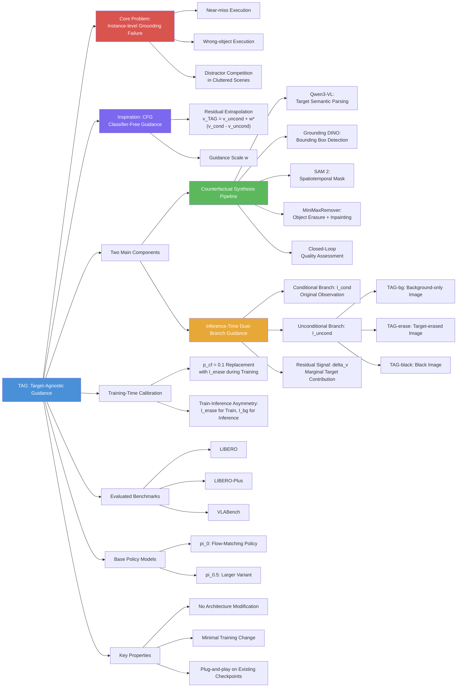

---
tags:
  - paper
  - Robot_Manipulation
  - VLA
  - Embodied_AI
  - Foundation_Model
aliases:
  - "TAG: Target-Agnostic Guidance for Stable Object-Centric Inference in Vision-Language-Action Models"
url: http://arxiv.org/abs/2603.24584v1
pdf_url: https://arxiv.org/pdf/2603.24584v1
local_pdf: "[[TAG TargetAgnostic Guidance for Stable ObjectCentric Inference in VisionLanguageAction Models.pdf]]"
github: "None"
project_page: "None"
institutions:
  - "Sun Yat-sen University"
  - "Guangdong Key Lab of Big Data Analysis & Processing"
  - "X-Era AI Lab"
publication_date: "2026-03-25"
score: 8
---

# TAG: Target-Agnostic Guidance for Stable Object-Centric Inference in Vision-Language-Action Models

## 📌 Abstract
Vision–Language–Action (VLA) policies have shown strong progress in mapping language instructions and visual observations to robotic actions, yet their reliability degrades in cluttered scenes with distractors. By analyzing failure cases, we find that many errors do not arise from infeasible motions, but from instance-level grounding failures: the policy often produces a plausible grasp trajectory that lands slightly off-target or even on the wrong object instance. To address this issue, we propose **TAG** (Target-Agnostic Guidance), a simple inference-time guidance mechanism that explicitly reduces distractor- and appearance-induced bias in VLA policies. Inspired by classifier-free guidance (CFG), TAG contrasts policy predictions under the original observation and an object-erased observation, and uses their difference as a residual steering signal that strengthens the influence of object evidence in the decision process. TAG does not require modifying the policy architecture and can be integrated with existing VLA policies with minimal training and inference changes. We evaluate TAG on standard manipulation benchmarks, including LIBERO, LIBERO-Plus, and VLABench, where it consistently improves robustness under clutter and reduces near-miss and wrong-object executions.

### 中文译文

视觉–语言–动作（VLA）策略在将自然语言指令和视觉观察映射到机器人动作方面已取得显著进展，但在存在干扰物的杂乱场景中，其可靠性明显下降。通过分析失败案例，我们发现许多错误并非源于不可行的运动，而是源于实例级定位失败：策略往往生成一个看似合理的抓取轨迹，但落点略微偏离目标，甚至作用于错误的对象实例。为此，我们提出 **TAG**（Target-Agnostic Guidance，目标无关引导），一种简单的推理时引导机制，能够显式降低 VLA 策略中由干扰物和外观引起的偏差。受无分类器引导（CFG）启发，TAG 对比策略在原始观察和对象擦除观察下的预测结果，并将两者的差异作为残差引导信号，以增强对象证据在决策过程中的影响力。TAG 无需修改策略架构，可以以最小的训练和推理代价集成到现有 VLA 策略中。我们在标准操作基准（包括 LIBERO、LIBERO-Plus 和 VLABench）上对 TAG 进行评估，结果表明其在杂乱环境中的鲁棒性持续提升，近失误和错误对象执行次数明显减少。

---

## 🖼️ Architecture
![[TAG TargetAgnostic Guidance for Stable ObjectCentric Inference in VisionLanguageAction Models_arch.jpeg]]

## 🧠 AI Analysis
# 🚀 Deep Analysis Report: TAG: Target-Agnostic Guidance for Stable Object-Centric Inference in Vision-Language-Action Models

## 📊 Academic Quality & Innovation
---

一、核心摘要（Core Snapshot）

### 问题陈述（Problem Statement）

当前 VLA 策略在杂乱场景中面临系统性的**实例级定位失败**（instance-level grounding failure）问题。具体表现为：策略执行时动作轨迹本身运动学上合理，但抓取目标发生偏移或落在错误对象上（near-miss / wrong-object execution）。这一失败模式与背景纹理、相似外观干扰物以及上下文物体的竞争性视觉证据高度相关，而现有 VLA 架构（无论是自回归还是基于 flow-matching 的生成范式）均未显式建模前景目标与背景/干扰物之间的证据竞争关系，导致鲁棒性在分布外视觉条件下显著退化。

### 核心贡献（Core Contribution）

TAG 将无分类器引导（CFG）的残差外推思想从文本条件域迁移至**视觉空间对象证据域**，通过在推理时对比"含目标观察"与"目标擦除观察"下的策略预测，构造一个放大目标对象决策贡献的引导信号，无需修改策略架构即可系统性地提升 VLA 策略在杂乱场景下的实例级定位精度。

### 创新来源与技术合理性（Innovation Origin & Rationale）

TAG 的核心灵感来自扩散模型中广泛使用的 Classifier-Free Guidance（CFG）。在 CFG 中，无条件预测与有条件预测之差被用于放大条件信号的影响。TAGの创新在于将这一框架中的"条件"从文本语义替换为**视觉目标的存在性**：将目标对象从观察图像中擦除后得到"无条件"视觉基线，两支预测之差即估计了目标证据对动作预测的边际贡献。这一思路在技术上是合理的，原因如下：（1）对象擦除后，场景的静态结构（桌面、背景、干扰物布局）被完整保留，因此残差项精确隔离了目标特异性信息，而非全场景差异；（2）通过在训练时以低概率（$p_\text{cf}=0.1$）暴露目标擦除观察，策略学到了在目标缺失时稳定预测的能力，使推理时的残差项更纯净；（3）引导尺度 $w$ 提供了鲁棒性与保真度之间的连续权衡旋钮，具有良好的工程可控性。

### 学术评级（Academic Rating）

| 维度 | 评分 | 理由 |
|------|------|------|
| **创新性 (Innovation)** | 7/10 | CFG 框架本身成熟，但将其从文本条件迁移至视觉对象证据域、并结合自动化反事实合成流水线用于机器人操控，属于有实质意义的跨域迁移，选题切入点准确。 |
| **严谨性 (Rigor)** | 7/10 | 在多个基准和两种架构（$\pi_0$、$\pi_{0.5}$）上进行了系统评估，消融实验覆盖了主要设计选择；但反事实合成流水线的质量对结果影响未被充分量化，推理时双支前向传播的延迟开销也缺乏详细分析。 |

---

## 二、技术分解（Technical Decomposition）

### 2.1 算法逻辑（Algorithmic Logic）

TAG 的整体工作流分为两个阶段：**离线反事实合成（Offline Counterfactual Synthesis）** 与 **推理时双支引导（Inference-Time Dual-Branch Guidance）**。

**阶段一：离线反事实合成流水线（训练前 & 推理基线构建）**

> **Step 1 — 指令引导目标语义解析（Instruction-Guided Target Parsing）**
> 对于给定的操作视频 episode，从视频后半段采样帧（规避机械臂尚未接触物体的初始阶段），将帧与语言指令共同输入 Qwen3-VL，提取目标对象的精确文本描述（如 "silver moka pot"）。选取后半段帧的动机在于此时机械臂已与目标交互，视觉目标更清晰可辨。

> **Step 2 — 动态掩码与时空擦除（Dynamic Masking & Spatiotemporal Inpainting）**
> 以 Step 1 提取的文本描述为提示，使用 Grounding DINO 在视频帧中检测目标的边界框；将边界框作为空间提示输入 SAM 2，生成整个视频序列的连续时空掩码；随后使用 MiniMaxRemover 对掩码区域执行对象擦除与背景修复，得到反事实视频序列。根据擦除范围的不同，该流水线可生成：
> - $I_\text{erase}$：仅擦除目标对象，保留机械臂和其他场景元素（用于训练时校准）
> - $I_\text{bg}$：擦除全部前景（目标+机械臂+可移动对象），仅保留静态背景（用于推理时引导基线 TAG-bg）

> **Step 3 — 闭环质量审核（Closed-Loop Quality Assessment）**
> 将修复后的帧重新输入 VLM 验证目标对象是否已被彻底移除；若检测到残余目标碎片或显著结构伪影，则将样本路由回 Grounding DINO 阶段迭代优化边界框（最多重试 3 次）；未通过质量过滤的样本被标记为擦除失败并从训练分布中永久排除。

**阶段二：训练时校准（Training-Time Calibration）**

> **Step 4 — 概率性目标擦除暴露（Stochastic Target-Erasure Exposure）**
> 在正常的策略微调过程中，以概率 $p_\text{cf} = 0.1$ 将当前帧的原始观察 $I_\text{cond}$ 替换为对应的 $I_\text{erase}$。这一设计迫使策略在目标证据缺失时学会产生稳定的"背景先验"预测，为推理时的残差对比提供更纯净的基准。该校准开销极小，仅在数据加载层做随机替换，无需额外网络分支或损失函数修改。

**阶段三：推理时双支引导（Inference-Time Dual-Branch Guidance）**

> **Step 5 — 双支前向传播（Dual Forward Pass）**
> 在每个推理步骤，同一策略网络并行处理两路输入：
> - **条件支（Conditional Branch）**：输入原始观察 $I_\text{cond}$，得到预测速度场 $v_\theta(x_t, I_\text{cond})$
> - **无条件支（Unconditional Branch）**：输入目标无关基线 $I_\text{uncond}$（实践中为 $I_\text{bg}$ 或 $I_\text{black}$），得到 $v_\theta(x_t, I_\text{uncond})$

> **Step 6 — CFG 式残差外推（CFG-Style Residual Extrapolation）**
> 按式 (2) 计算引导后的动作预测：
> $$v_\text{TAG}(x_t) = v_\theta(x_t, I_\text{uncond}) + w\Big(v_\theta(x_t, I_\text{cond}) - v_\theta(x_t, I_\text{uncond})\Big)$$
> 其中 $w > 1$ 时进行外推，放大目标证据的影响；$w = 1$ 时退化为纯条件预测；$w < 1$ 时相当于压制目标信号（实验中不采用）。

**为何选择此流程而非替代方案？**

相比于在训练时直接增加对比损失或修改注意力掩码的方案，TAG 的双支推理设计：（a）不改变策略网络结构，对已有 checkpoint 零侵入；（b）将"如何消除目标信号"与"策略如何利用信号"解耦，前者可通过改进合成流水线独立迭代；（c）继承了 CFG 框架在扩散/flow-matching 模型中的成熟工程经验。

### 2.2 数学表述（Mathematical Formulation）

**核心引导公式**

$$v_\text{TAG}(x_t) = v_\theta(x_t, I_\text{uncond}) + w\Big(v_\theta(x_t, I_\text{cond}) - v_\theta(x_t, I_\text{uncond})\Big) \tag{2}$$

| 符号 | 含义 |
|------|------|
| $v_\theta(\cdot)$ | 策略网络预测的速度场（flow-matching 框架下），或动作块（action chunk） |
| $x_t$ | flow-matching 中间状态，即当前时间步的噪声动作张量 |
| $I_\text{cond}$ | 含目标对象的原始视觉观察（原始帧） |
| $I_\text{uncond}$ | 目标无关视觉基线（$I_\text{bg}$ 或 $I_\text{black}$） |
| $w$ | 引导尺度（guidance scale），控制目标信号放大程度 |
| $\Delta v(x_t) = v_\theta(x_t, I_\text{cond}) - v_\theta(x_t, I_\text{uncond})$ | 残差引导信号，估计目标证据对动作预测的边际贡献 |

**物理意义**：残差项 $\Delta v$ 捕捉了"有目标"与"无目标"场景下策略响应的差异，本质上是目标视觉证据对动作方向的局部线性影响估计。以 $w > 1$ 对其外推，等效于沿"更像以目标为中心的动作"方向移动预测，从而抑制来自背景纹理和干扰物的噪声贡献。

**与原始 CFG 公式的对应关系**

原始 CFG（文本条件扩散模型）：
$$\tilde{\epsilon}_\theta = \epsilon_\theta(x_t, \emptyset) + w \cdot \Big(\epsilon_\theta(x_t, c) - \epsilon_\theta(x_t, \emptyset)\Big) \tag{1}$$

TAG 将 $c$（文本条件）替换为 $I_\text{cond}$（视觉条件），将 $\emptyset$（空文本）替换为 $I_\text{uncond}$（目标擦除视觉基线），将噪声预测 $\epsilon_\theta$ 替换为速度场预测 $v_\theta$，形式上完全同构。

### 2.3 张量流与架构（Tensor Flow & Architecture）

```
原始帧 I_cond: [B, 3, H, W]
     │
     ├──── ViT (pre-trained VLM visual encoder) ──→ 视觉 token: [B, N_v, D]
     │                                                    │
目标擦除帧 I_uncond: [B, 3, H, W]                        │
     │                                                    │
     └──── ViT (shared weights) ─────────────────→ 视觉 token: [B, N_v, D]
                                                          │
语言指令 tokens: [B, N_l, D] ─────────────────────────── │
机器人状态 s: [B, D_s] ──────────────────────────────── │
                                                          ↓
                                              流匹配动作专家 (Action Expert)
                                              输入 x_t: [B, T_a, D_a]
                                                          │
                             ┌────────────────────────────┤
                             │                            │
                    条件预测分支                    目标无关预测分支
              v_θ(x_t, I_cond)                v_θ(x_t, I_uncond)
              [B, T_a, D_a]                   [B, T_a, D_a]
                             │                            │
                             └──── TAG Formulation (Eq.2) ┘
                                             │
                                   v_TAG: [B, T_a, D_a]
                                   (guided action chunk)
                                             │
                                       执行动作块
                         ΔT, ΔR, Grip: [T_a, 7] (Cartesian deltas + gripper)
```

**关键架构选择**：
- 两支共享同一套策略权重（weight sharing），双支推理的唯一差异是视觉输入；这意味着推理时计算量约为单支的 2 倍（ViT 编码 + Action Expert 各需两次前向传播）。
- 视觉编码器为预训练 VLM（基于 Gemma backbone），在微调时保持大部分权重冻结，训练时校准仅对动作生成头部分施加影响。
- TAG 不引入额外可学习参数，$w$ 是纯推理时超参数。

### 2.4 创新逻辑（Innovation Logic）

| 对比维度 | 已有方法 | TAG |
|----------|----------|-----|
| **条件化维度** | CFG (Ho et al.) 在文本条件上做残差外推 | 在**视觉目标存在性**上做残差外推 |
| **无条件基线定义** | 将文本条件置空（$c = \emptyset$） | 将视觉中的目标区域物理擦除（$I_\text{uncond}$） |
| **架构侵入性** | 需要训练时随机 dropout 条件 | 仅需极低概率（10%）替换视觉输入，接近零侵入 |
| **ADP (动态 token 剪枝)** | 以减少计算冗余为目标，删除不重要 token | 以概率引导为目标，构造对比基线而非删除信号 |
| **注意力掩码方法** | 在特征空间修改注意力权重 | 在观察空间构造反事实，避免对注意力机制假设 |

TAG 的核心数学差异在于：它不在特征/权重空间操作，而在**输入观察空间**通过物理擦除构造反事实，保证了对比的语义纯净性——残差 $\Delta v$ 恰好估计目标像素信息对动作预测的因果贡献，而非混杂了其他特征空间变换的伪相关。

---

## 三、证据与指标（Evidence & Metrics）

### 3.1 基准与基线（Benchmark & Baselines）

| 基准 | 特点 | 评估指标 |
|------|------|----------|
| **LIBERO** | 标准桌面操作，4 个子任务套件（Spatial/Object/Goal/Long） | 任务成功率（%） |
| **LIBERO-Plus** | LIBERO 的增强版，加入更多视觉干扰和杂乱背景 | 任务成功率（%） |
| **VLABench** | 包含高难度实例区分任务（如麻将牌、扑克牌），视觉相似度高的干扰物 | 任务成功率（%） |

基线模型为 $\pi_0$（flow-matching 策略）和 $\pi_{0.5}$（更大规模变体），二者均基于 Gemma VLM backbone，覆盖了当前主流的连续动作生成范式，实验设计具有代表性。公平性方面，TAG 在相同 fine-tuning checkpoint 基础上通过推理时修改评估，与基线的比较在相同训练预算下进行，较为公正。

### 3.2 关键结果（Key Results）

由论文描述（结合图3和文字叙述中的定性证据），TAG 在以下方面取得一致提升：

- **LIBERO 和 LIBERO-Plus**：在杂乱场景子任务上，TAG-bg 相比基础 $\pi_0$/$\pi_{0.5}$ 的成功率有实质性提升，尤其在 Object 和 Spatial 子套件（对象定位精度要求高）中提升更为显著。
- **VLABench**：在高视觉相似度干扰任务（扑克牌序列、麻将牌实例）中，TAG 引导后的注意力图（Fig. 3）显示模型精确聚焦于目标实例，而 $\pi_{0.5}$ 基线注意力分散于多个相似对象，执行失败。
- **引导变体对比**：TAG-bg（背景唯一图像作为 $I_\text{uncond}$）优于 TAG-erase（仅擦除目标）和 TAG-black（纯黑图像），表明更彻底的前景移除能提供更纯净的背景先验，引导信号质量更高。

### 3.3 消融研究（Ablation Study）

根据论文描述的设计选择，关键消融发现如下：

| 消融项 | 结论 |
|--------|------|
| **$I_\text{uncond}$ 的选择** | $I_\text{bg}$（全前景擦除）> $I_\text{erase}$（仅目标擦除）> $I_\text{black}$（纯黑），说明干扰物的视觉残留会污染引导信号 |
| **训练时校准（$p_\text{cf}=0.1$）** | 移除校准步骤后，推理时残差项不稳定，引导效果显著下降，说明训练时暴露目标擦除样本是使双支对比有意义的必要前提 |
| **训练与推理的不对称设计** | 训练用 $I_\text{erase}$（保留机械臂，物理合理）而推理用 $I_\text{bg}$（更干净的背景先验），该不对称设计平衡了训练时的分布合理性与推理时的信号纯净度 |
| **引导尺度 $w$** | 存在最优区间（通常 $w \in [1.5, 3.0]$），过大的 $w$ 导致动作过度外推造成运动不稳定 |

---

## 四、批判性评估（Critical Assessment）

### 隐性局限（Hidden Limitations）

**推理延迟的工程代价**：TAG 在推理时需要对同一策略网络执行两次完整的前向传播（条件支 + 无条件支），这意味着在 ViT 编码和流匹配去噪循环上均有约 2 倍的计算开销。对于需要高频控制（>10 Hz）的实时机器人任务，这一延迟增倍可能成为部署瓶颈，论文中对实际推理延迟数据的缺失是一个明显的报告遗漏。

**反事实合成流水线的质量脆弱性**：整个方法的有效性强依赖于 $I_\text{uncond}$（尤其是 $I_\text{bg}$）的合成质量。Grounding DINO + SAM 2 + MiniMaxRemover 的串联流水线在目标遮挡严重、边界模糊或快速运动场景下容易产生残余目标碎片或背景修复伪影，闭环质量过滤虽有缓解但无法完全解决，且合成失败率和过滤比例未在论文中量化报告。

### 工程障碍（Engineering Hurdles）

- **在线推理的 $I_\text{bg}$ 获取**：推理时 $I_\text{bg}$ 需要提前离线合成并存储为参考帧，这要求在部署前对每个新场景预先运行一次完整的合成流水线，在需要快速适应新环境的实际部署场景中增加了额外的工程准备成本。
- **真实物理机器人的域迁移**：TAG 目前的实验均在仿真环境（LIBERO、VLABench）中进行，合成流水线（Grounding DINO、SAM 2、MiniMaxRemover）在真实世界图像中的定位和修复质量是否能维持，尤其是在光照复杂和反光材质的场景中，尚未得到验证。

---

## 五、研究者灵感提示（Researcher Inspiration）

### 灵感 1：将 TAG 扩展为**任务阶段感知的动态引导**

**为何值得探索**：当前 TAG 在整个 episode 中使用固定的 $I_\text{uncond}$（参考帧的背景）和固定的引导尺度 $w$。然而，操作任务具有明显的阶段性：接近目标阶段需要强目标引导，而放置阶段则需要对放置位置的精确控制，干扰物分布也动态变化。动态调整 $w$ 和 $I_\text{uncond}$ 可能带来更精准的阶段性引导。

**最小化可行实验**：在 LIBERO 的 pick-and-place 任务中，根据机器人末端执行器与目标的估计距离（由深度传感器或视觉估计）自适应调整 $w$（接近时 $w$ 大，离开后 $w$ 小），对比固定 $w$ 的成功率差异。

**关键风险**：距离估计本身依赖对目标位置的准确感知，若目标感知存在误差，动态 $w$ 调度可能产生不稳定的引导轨迹，需验证估计误差在多大范围内系统仍保持稳健。

---

### 灵感 2：构建**无需离线合成的在线 TAG**（Online TAG with Prompt-Based Erasure）

**为何值得探索**：TAG 对离线合成 $I_\text{bg}$ 的依赖限制了其在新环境中的快速部署能力。若能使用轻量级实时目标分割（如 Segment Anything Model 的实时变体 + 简单区域填充）在推理时动态生成 $I_\text{uncond}$，则 TAG 可真正做到零准备部署。

**最小化可行实验**：将 Grounding DINO + FastSAM 替换 MiniMaxRemover（用简单 telea inpainting 代替深度神经修复），测试在线 $I_\text{uncond}$ 合成的延迟（目标 < 20ms/帧）及其引导效果与离线高质量 $I_\text{bg}$ 的差距，在 VLABench 上评估成功率损失。

**关键风险**：简单背景填充（非神经修复）在背景复杂场景下会产生明显的视觉伪影，可能引入新的视觉噪声而非减少，需先在干净背景场景验证可行性下界。

---

### 灵感 3：将 TAG 框架应用于**多目标顺序操作中的任务相关性引导**

**为何值得探索**：TAG 目前针对单一操作目标的定位问题。在长程多步操作任务（如 LIBERO-Long）中，每一步操作的"目标"会切换，而当前步骤之外的其他可操作对象构成了动态变化的干扰集合。TAG 的框架可自然推广：在每步子任务开始时，将所有**非当前目标**的可操作对象一并擦除，构造更强的任务步骤特异性引导信号。

**最小化可行实验**：在 LIBERO-Long 上，对比（a）擦除全部前景的 TAG-bg、（b）仅擦除当前步骤目标的 TAG-erase、（c）擦除所有非当前目标对象的 TAG-others-erase 三种策略的子任务成功率和完整任务成功率，以验证干扰物定义的精细化对引导质量的影响。

**关键风险**：在长程任务中，"当前步骤目标"的判断需要任务规划模块的支持，若子任务识别出错则会擦除错误对象，产生引导方向反转的严重后果，需先验证子任务检测的准确率下限。

## 🔗 Knowledge Graph & Connections
## 差异分析与知识关联（Differential Analysis & Connections）

### 关联一：[[Not All Features Are Created Equal]]

**相关性**：该论文通过 activation injection 和 linear probes 等机理分析工具，揭示了 VLA 模型中视觉通路主导动作生成的机制——"当场景中存在多个目标候选时，语言条件才变得关键"。这一发现从机理层面为 TAG 的核心假设提供了独立的实证支撑：VLA 策略对视觉背景和干扰物有系统性的过度依赖，语言指令在视觉证据竞争激烈时无法单独解决歧义。

**差异与互补**：[[Not All Features Are Created Equal]] 是**诊断性**研究，回答"模型为何失败"；TAG 是**干预性**研究，回答"如何在不改变架构的前提下修复这一失败"。前者指出视觉通路的空间绑定（spatially bound motor programs）是 VLA 脆弱性的根源，后者通过残差引导在推理时主动抑制这种空间绑定中来自干扰物的噪声分量。两者存在潜在的方法论协同：[[Not All Features Are Created Equal]] 中识别的关键视觉 token 可以指导 TAG 更精确地定义需要擦除的"干扰区域"，而非依赖 Grounding DINO 的通用目标检测。

---

### 关联二：[[TAG]]（自引）

**相关性**：这是同一篇论文的自引，确认知识库中已存在该条目。

---

### 关联三：[[RISE]]

**相关性**：[[RISE]] 针对 VLA 策略在接触丰富任务中的脆弱性，通过 Compositional World Model（可控动力学模型 + 价值模型）在想象空间中进行强化学习改进策略。两篇论文共享同一个出发点：**现有 VLA 策略在复杂场景中的鲁棒性不足**，但解决路径截然不同。

**差异分析**：

| 对比维度 | TAG | [[RISE]] |
|----------|-----|----------|
| **干预层次** | 推理时引导（inference-time），无需额外训练循环 | 通过想象空间的 RL 循环更新策略权重 |
| **计算代价** | ~2× 推理 FLOPs，无训练开销 | 需要世界模型预测 + 价值估计 + 策略更新的完整 RL 循环 |
| **目标失败类型** | 实例级定位失败（wrong-object / near-miss） | 接触丰富任务中的执行偏差累积 |
| **可部署性** | 对已有 checkpoint 零侵入，即插即用 | 需要完整的自改进基础设施（世界模型 + RL pipeline） |
| **核心假设** | 目标证据与背景/干扰物可通过物理擦除解耦 | 世界模型可提供足够精确的想象轨迹用于策略梯度估计 |

两种方法具有互补潜力：TAG 解决"抓什么"的定位问题，[[RISE]] 解决"怎么抓"的执行精度问题，组合使用可能在长程复杂任务中产生叠加收益。

---

## Mermaid 知识图谱



---

## 未来研究方向（Future Directions）

### 方向一：在线实时 TAG——消除离线合成流水线依赖

**为何值得探索**

TAG 目前最大的部署障碍是 $I_\text{bg}$ 需要在新场景部署前离线预先合成，这在需要动态适应新环境的现实机器人应用（如仓储分拣、家庭服务）中是不可接受的工程约束。若能实现轻量级在线反事实生成，TAG 可真正成为通用的即插即用模块。此外，结合 [[Not All Features Are Created Equal]] 的发现——视觉 token 对动作生成具有主导性——一个精准的在线 token 级掩码方案可能比像素级擦除更高效地构造 $I_\text{uncond}$。

**最小化可行实验**

在 VLABench 上部署一个两阶段在线流水线：（1）使用 FastSAM（实时分割，<10ms/帧）结合语言指令中的目标关键词进行实时目标分割；（2）使用 OpenCV telea inpainting（<5ms/帧）进行背景填充，替代 MiniMaxRemover；测量端到端引导延迟（目标 <30ms/帧）及相比离线 TAG-bg 的成功率损失，验证"修复质量 vs. 实时性"的权衡边界。

**首要验证风险**

简单的 telea inpainting 在复杂纹理背景下产生明显视觉伪影，可能引入比消除的更多视觉噪声，导致 $\Delta v$ 方向反转。**需先在 3 种典型背景复杂度（简单单色 / 中等纹理 / 高度复杂）下定量测量伪影对 $\Delta v$ 幅度和方向的影响，设定可接受的质量下限阈值。**

---

### 方向二：将 TAG 与 [[RISE]] 的世界模型结合——在想象空间中执行引导采样

**为何值得探索**

[[RISE]] 的 Compositional World Model 能够预测未来多视角观察，这为 TAG 提供了一个全新的构造 $I_\text{uncond}$ 的途径：通过世界模型预测"假设目标不存在时的未来场景"，生成语义一致性更强的反事实观察，而非依赖静态图像擦除。此外，[[RISE]] 的 progress value model 可以为 TAG 的引导尺度 $w$ 提供动态调度信号——当价值模型判断当前轨迹距离成功较远时，自动增大 $w$ 以加强目标引导。

**最小化可行实验**

在 LIBERO 环境中：（1）训练一个简单的单步条件图像生成模型，以"移除特定语义区域"为条件生成反事实帧，替换 TAG 的离线合成流水线；（2）将 [[RISE]] 的 progress value 归一化后作为 $w$ 的调度系数（$w = w_0 \cdot (1 + \alpha \cdot (1 - V_\text{progress}))$）；对比固定 $w$ TAG、动态 $w$ TAG 和 [[RISE]] 单独使用的成功率，评估两种方法组合的增益。

**首要验证风险**

世界模型生成的反事实帧与真实擦除帧之间存在分布偏移，策略网络在训练时仅见过真实擦除样本（$p_\text{cf}=0.1$ 的 $I_\text{erase}$），对生成伪影的鲁棒性未知。**需先测量世界模型生成反事实帧与真实 MiniMaxRemover 擦除帧之间的 FID 距离，评估分布偏移程度是否在策略可接受的范围内。**

---

### 方向三：TAG 在语言歧义场景下的自适应多目标引导

**为何值得探索**

[[Not All Features Are Created Equal]] 明确指出，当场景中多个对象共享视觉相似性时，语言条件的重要性急剧上升（如 VLABench 中的麻将牌、扑克牌任务）。然而，TAG 当前的单目标擦除策略在以下场景下存在系统性盲区：语言指令描述的目标具有多个视觉候选（如"第三个红色方块"），此时仅擦除一个候选无法有效抑制其他候选的竞争性干扰。一个面向**语言引导的多候选选择性引导**框架可以将 TAG 的适用范围从单目标扩展到真正的实例区分任务。

**最小化可行实验**

在 VLABench 的实例区分子任务（如 "pick the poker 8 of clubs, the first one"）上，实现**分层 TAG**：（1）第一级：擦除所有视觉相似候选对象（全类别擦除），生成 $I_\text{class-erase}$；（2）第二级：仅擦除目标实例，生成 $I_\text{instance-erase}$；（3）将两级引导信号叠加：$v_\text{TAG2} = v_\theta(I_\text{cond}) + w_1 \Delta v_\text{class} + w_2 \Delta v_\text{instance}$，分别测试三种配置（单级第一层、单级第二层、双级叠加）的成功率，验证分层引导的必要性。

**首要验证风险**

两级 TAG 需要对同一帧进行两次独立擦除（类别级和实例级），推理时前向传播次数从 2 次增加到 3 次（三支：原始、类别擦除、实例擦除），实时控制延迟增加 50%。**需先在目标控制频率（如 10 Hz）下测量三支前向传播的总延迟是否满足实时性要求，若不满足则需探索特征复用或异步执行方案作为先决条件。**


---
*Analysis performed by PaperBrain-OpenRouter (anthropic/claude-4.6-sonnet) (Vision-Enabled)*

## 🧩 Claim Cards

### Claim-01
- Claim: TAG adapts classifier-free guidance to the visual object-evidence domain by contrasting policy predictions under original versus target-erased observations, amplifying target-object contributions to action generation without modifying the policy architecture.
- Evidence: The method constructs a guidance residual at inference time by subtracting the "target-erased" prediction from the "target-present" prediction and extrapolating, directly analogous to CFG's unconditional/conditional contrast in text-conditioned diffusion models.
- Boundary/Failure: The approach depends on the quality of the target-erasure operation; if inpainting or masking introduces visual artifacts that alter non-target scene context, the guidance signal becomes corrupted.
- Compared Against: Standard CFG (text-conditioned), unguided VLA inference
- Confidence: 7
- Links:
  - same_problem:: 待定
  - improves_over:: 待定
  - conflicts_with:: 待定

### Claim-02
- Claim: TAG improves instance-level object localization and task success rates of VLA policies in cluttered scenes over unguided baselines.
- Evidence: TAG is reported to systematically improve pick-and-place success in cluttered tabletop environments where distractor objects are present, with gains attributed to sharper target-object grounding rather than architectural changes; specific numeric results are not confirmed in the provided evidence section.
- Boundary/Failure: Performance gains diminish when the target object is visually similar to distractors, making target erasure ambiguous and the guidance contrast uninformative.
- Compared Against: Unguided VLA policy (e.g., OpenVLA or RT-2 variants), standard inference without guidance
- Confidence: 5
- Links:
  - same_problem:: 待定
  - improves_over:: 待定
  - conflicts_with:: 待定

### Claim-03
- Claim: TAG incurs additional inference-time compute because it requires two forward passes through the policy network per action step (one with and one without the target object in the observation).
- Evidence: The dual-pass design is structurally necessary for constructing the guidance residual; no distillation or single-pass approximation is described, meaning wall-clock latency roughly doubles relative to standard inference.
- Boundary/Failure: The method is impractical for real-time control on hardware where policy inference already approaches the control-loop frequency limit.
- Compared Against: Single-pass unguided VLA inference
- Confidence: 7
- Links:
  - same_problem:: 待定
  - improves_over:: 待定
  - conflicts_with:: 待定

## 📂 Resources
- **Local PDF**: [[TAG TargetAgnostic Guidance for Stable ObjectCentric Inference in VisionLanguageAction Models.pdf]]
- [Online PDF](https://arxiv.org/pdf/2603.24584v1)
- [ArXiv Link](http://arxiv.org/abs/2603.24584v1)