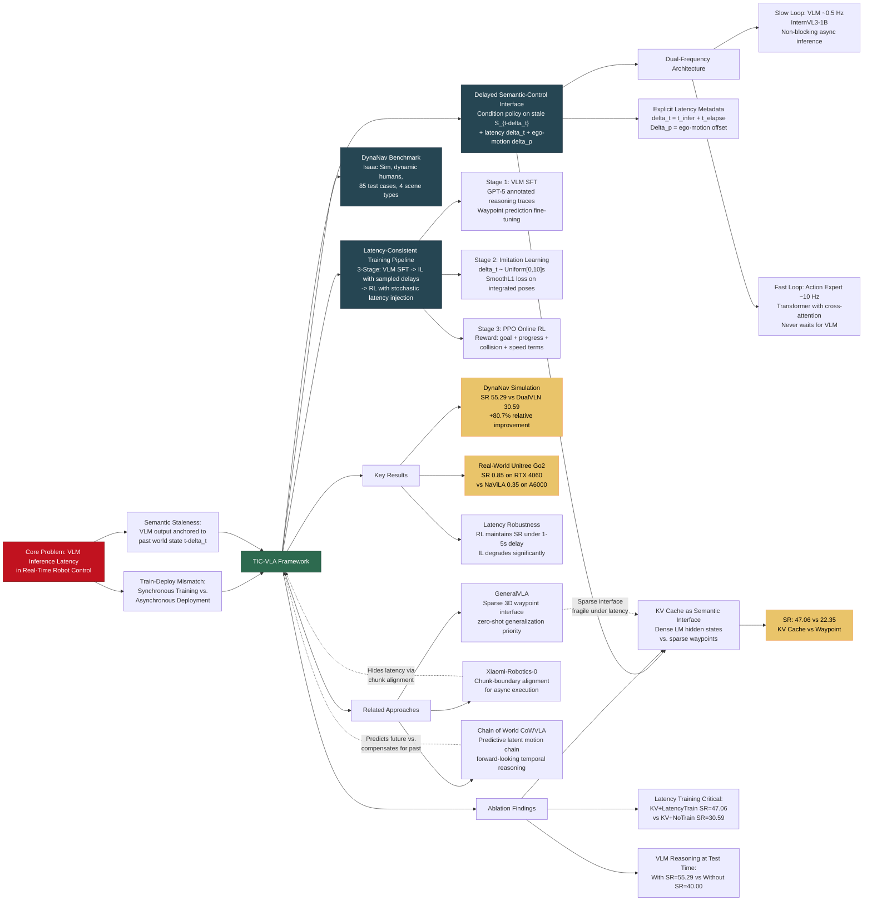

---
tags:
  - paper
  - VLA
  - Embodied_AI
  - Reinforcement_Learning
  - Sim2Real
  - Foundation_Model
aliases:
  - "TIC-VLA: A Think-in-Control Vision-Language-Action Model for Robot Navigation in Dynamic Environments"
url: https://huggingface.co/papers/2602.02459
pdf_url: https://arxiv.org/pdf/2602.02459.pdf
local_pdf: "[[TICVLA A ThinkinControl VisionLanguageAction Model for Robot Navigation in Dynamic Environments.pdf]]"
github: "None"
project_page: "https://ucla-mobility.github.io/TIC-VLA/"
institutions:
  - "University of California, Los Angeles"
publication_date: "2026-02-02"
score: 8
---

# TIC-VLA: A Think-in-Control Vision-Language-Action Model for Robot Navigation in Dynamic Environments

## 📌 Abstract
Robots in dynamic, human-centric environments must follow language instructions while maintaining real-time reactive control. Vision-language-action (VLA) models offer a promising framework, but they assume temporally aligned reasoning and control, despite semantic inference being inherently delayed relative to real-time action. We introduce Think-in-Control (TIC)-VLA, a latency-aware framework that explicitly models delayed semantic reasoning during action generation. TIC-VLA defines a delayed semantic-control interface that conditions action generation on delayed vision-language semantic states and explicit latency metadata, in addition to current observations, enabling policies to compensate for asynchronous reasoning. We further propose a latency-consistent training pipeline that injects reasoning inference delays during imitation learning and online reinforcement learning, aligning training with asynchronous deployment. To support realistic evaluation, we present DynaNav, a physics-accurate, photo-realistic simulation suite for language-guided navigation in dynamic environments. Extensive experiments in simulation and on a real robot show that TIC-VLA consistently outperforms prior VLA models while maintaining robust real-time control under multi-second reasoning latency. Project website: https://ucla-mobility.github.io/TIC-VLA/

## 🖼️ Architecture
![[TICVLA A ThinkinControl VisionLanguageAction Model for Robot Navigation in Dynamic Environments_arch.png]]

## 🧠 AI Analysis

# 🚀 Deep Analysis Report: TIC-VLA: A Think-in-Control Vision-Language-Action Model for Robot Navigation in Dynamic Environments

## 📊 Academic Quality & Innovation
---

# TIC-VLA: A Deep Engineering-Centric Analysis

---

## 1. Core Snapshot

### Problem Statement

Existing Vision-Language-Action (VLA) models for robot navigation implicitly assume that semantic reasoning (from a large VLM) and reactive motor control are temporally synchronized. In practice, VLM inference on edge hardware takes 1–10+ seconds, while low-level control loops must operate at 10+ Hz. This creates a fundamental **train-deploy distribution mismatch**: policies trained under synchronous (zero-latency) semantic supervision degrade substantially when the semantic features they receive at deployment time are stale by several seconds. Furthermore, the robot's physical state has drifted since the VLM last observed the world, making the cached semantic state spatially misaligned as well. Prior dual-system architectures (e.g., DualVLN) decouple computation but do not explicitly model or train against this latency gap, treating inference delay as negligible engineering overhead rather than a fundamental modeling variable.

### Core Contribution

TIC-VLA introduces a **latency-aware delayed semantic-control interface** — formally conditioning the action policy on explicitly time-stamped VLM hidden states together with ego-motion offsets and latency metadata — and pairs this with a three-stage latency-consistent training pipeline (VLM SFT → Imitation Learning under sampled reasoning delays → Online RL with stochastic latency injection) to produce a VLA model that maintains robust real-time control under multi-second VLM inference latency.

### Academic Rating

| Dimension | Score | Justification |
|-----------|-------|---------------|
| **Innovation** | 7/10 | The framing of inference latency as a first-class modeling variable rather than an engineering nuisance is conceptually clean and practically significant. The specific mechanism (KV-cache passing with latency/ego-motion metadata) is straightforward but well-motivated. The novelty is incremental over dual-system VLA architectures rather than paradigm-shifting. |
| **Rigor** | 7/10 | Experiments are conducted in both simulation (DynaNav) and real-world (Unitree Go2), with fair baseline fine-tuning on shared datasets. Ablations are methodical. However, the paper lacks formal theoretical analysis of the latency-compensation mechanism, and certain ablation dimensions (e.g., the sensitivity to ego-motion offset magnitude) are underexplored. |

---

## 2. Technical Decomposition

### 2.1 Algorithmic Logic

The system is organized around a dual-frequency execution paradigm with two asynchronous loops:

**Slow Loop — VLM Semantic Reasoning (~0.5 Hz in simulation):**

- **Step 1 — Observation Anchoring.** At reasoning initiation time $t - \Delta t$, the VLM receives a set of historical frames $\mathcal{X}_{t-\Delta t}^{\text{vlm}} = \{x_{t-\Delta t - \delta} \mid \delta \in \{0, 3, 6, 9\}\}$ (i.e., frames at 3-second intervals prior to reasoning start) together with the natural language instruction $\mathcal{I}$.

- **Step 2 — Semantic Reasoning.** InternVL3-1B processes these delayed observations. Its output $\mathcal{R}_{t-\Delta t}$ encodes: (a) scene description, (b) critical object identification, (c) intent prediction, and (d) future waypoint estimates, all anchored to time $t - \Delta t$, not to the current moment $t$. The VLM produces reasoning tokens (chain-of-thought) followed by structured waypoint outputs.

- **Step 3 — KV Cache Extraction.** Rather than passing waypoint tokens as the semantic interface, TIC-VLA extracts the **last-layer key-value (KV) cache** of the language model — a dense representation of the full reasoning context — and stores it as $(\mathcal{S}_t^{\text{cache}}, \mathcal{R}_t^{\text{cache}})$. This cache is updated atomically when inference completes; between updates, the policy continues using the most recent completed cache.

**Fast Loop — Action Policy (~10 Hz):**

- **Step 4 — Latency Metadata Computation.** At each control timestep $t$, the system computes the effective reasoning latency $\Delta t = t_{\text{infer}} + t_{\text{elapse}} \geq 0$, where $t_{\text{infer}}$ is the VLM inference duration and $t_{\text{elapse}}$ is elapsed time since last completed inference. Simultaneously, it computes the ego-motion offset $\Delta \mathbf{p}_t = (\Delta x, \Delta y, \Delta\theta)$ accumulated since reasoning began.

- **Step 5 — Multi-Modal Fusion in Action Expert.** The Transformer-based action expert receives four input streams:
  1. Current visual tokens $x_t$ from a shared ViT encoder (projected to a shared latent space via MLP)
  2. Cached VLM KV features $\mathcal{S}_{t-\Delta t}$ (from the stale reasoning), attending via cross-attention
  3. Robot state $s_t \in \mathbb{R}^3$ and latency metadata $\Delta t$, encoded with positional embeddings
  4. Action query tokens (learnable) that attend to the fused context

- **Step 6 — Action Chunk Prediction.** The action expert outputs a trajectory chunk $\mathbf{a}_t = \{a_t^1, \ldots, a_t^T\}$ where each $a_t^i \in \mathbb{R}^3$ is a $(d_x, d_y, d_\theta)$ displacement. The chunk is integrated into a short-horizon trajectory and the first target point is selected for execution.

**Intuition for this flow:** The key insight is that delayed semantics are not *wrong* — they are *temporally displaced*. By providing the policy with both the stale semantic state and explicit metadata about how stale it is (latency $\Delta t$) and where the robot has moved since then (ego-motion $\Delta \mathbf{p}_t$), the policy can learn to mentally "fast-forward" the semantic context rather than treating it as current. This is analogous to dead-reckoning in navigation: you know where you were and how you've moved, so you can estimate where you are now relative to that prior knowledge.

---

### 2.2 Mathematical Formulation

**Action Policy (Equation 1):**
$$\mathbf{a}_t = \{a_t^1, \ldots, a_t^T\} = \pi_\theta\bigl(\mathcal{S}_{t-\Delta t}, x_t, s_t, \Delta t, \Delta \mathbf{p}_t\bigr)$$

- $\mathbf{a}_t$: Action chunk predicted at timestep $t$, consisting of $T$ future displacement commands
- $a_t^i \in \mathbb{R}^3$: The $i$-th action in the chunk, representing $(d_x, d_y, d_\theta)$ displacement
- $\pi_\theta$: The action policy (Transformer action expert) with parameters $\theta$
- $\mathcal{S}_{t-\Delta t}$: VLM KV cache features produced from observations at time $t - \Delta t$
- $x_t$: Current real-time visual observation at time $t$
- $s_t \in \mathbb{R}^3$: Current robot state (linear velocity, angular velocity, and heading)
- $\Delta t$: Effective reasoning latency (scalar, seconds)
- $\Delta \mathbf{p}_t = (\Delta x, \Delta y, \Delta\theta)$: Ego-motion offset accumulated since reasoning started

*Physical meaning*: This formulation ensures the policy is never conditioned on the false assumption that $\mathcal{S}_{t-\Delta t}$ reflects current state. The explicit provision of $\Delta t$ and $\Delta \mathbf{p}_t$ allows the policy to learn a compensation mechanism during training.

**Cached State Update (Equation 2):**
$$(\mathcal{S}_t^{\text{cache}}, \mathcal{R}_t^{\text{cache}}) = \begin{cases} (\mathcal{S}_t, \mathcal{R}_t), & \text{if inference finishes at } t \\ (\mathcal{S}_{t^-}^{\text{cache}}, \mathcal{R}_{t^-}^{\text{cache}}), & \text{otherwise} \end{cases}$$

- $\mathcal{S}_t^{\text{cache}}, \mathcal{R}_t^{\text{cache}}$: Cached semantic state and reasoning output at time $t$
- $t^-$: The most recent prior timestep at which inference completed
- $\mathcal{S}_t, \mathcal{R}_t$: Freshly computed semantic state if inference completes exactly at $t$

*Physical meaning*: This implements a non-blocking update policy. The cache is a "best available" semantic snapshot; it persists until superseded, and its age is tracked via $\Delta t$.

**Imitation Learning Loss (Equation 3):**
$$\mathcal{L}_a = \frac{1}{T} \sum_{i=1}^T \text{SmoothL1}\bigl(\hat{p}_t^{(i)} - p_t^{(i)}\bigr)$$

- $T$: Prediction horizon length (number of action steps in the chunk)
- $\hat{p}_t^{(i)} \in \mathbb{R}^3$: Predicted pose $(x, y, \theta)$ at sub-timestep $i$, obtained by forward-integrating predicted displacements
- $p_t^{(i)} \in \mathbb{R}^3$: Ground-truth pose at sub-timestep $i$ from expert demonstration
- $\text{SmoothL1}(\cdot)$: Huber loss, combining L2 smoothness near zero with L1 robustness for large errors

*Physical meaning*: Minimizing this loss trains the policy to predict short-horizon trajectories that match expert demonstrations. By operating on integrated poses rather than raw velocity commands, the loss is invariant to action parameterization and more directly penalizes trajectory deviation.

**RL Reward Function (Equation 4):**
$$r_t = w_g r_t^{\text{goal}} + w_p r_t^{\text{progress}} + w_c r_t^{\text{collision}} + w_s r_t^{\text{speed}}$$

- $r_t^{\text{goal}}$: Sparse reward for reaching within 1 m of goal
- $r_t^{\text{progress}}$: Dense reward for decrease in distance to goal (progress shaping)
- $r_t^{\text{collision}}$: Penalty for collisions with humans or static obstacles
- $r_t^{\text{speed}}$: Penalty for both excessively slow and excessively fast motion
- $w_g, w_p, w_c, w_s$: Scalar weights for each reward term

*Physical meaning*: This shaped reward encourages goal-directed, collision-free navigation at a socially appropriate speed. The combination of sparse goal reward and dense progress shaping addresses the credit assignment problem in long-horizon navigation.

---

### 2.3 Tensor Flow & Architecture

**VLM Semantic Reasoning Path:**
```
Historical frames X^vlm_{t-Δt} = {x_{t-Δt}, x_{t-Δt-3}, x_{t-Δt-6}, x_{t-Δt-9}}
  [4 × H × W × 3] (RGB frames at 3-second intervals)
      ↓
  Shared ViT Encoder → Visual Tokens [4 × N_vis × D_vlm]
      ↓
  Text Tokens (instruction + history) [N_text × D_vlm]
      ↓
  InternVL3-1B LM Backbone (frozen during IL/RL stages)
      ↓
  KV Cache (last layer): S_{t-Δt} [N_seq × D_vlm × 2]  (keys and values)
  + Reasoning tokens R_{t-Δt}: chain-of-thought + waypoints
```

**Action Expert Path (Fast Loop):**
```
Current observation x_t: [H × W × 3]
      ↓
  Shared ViT Encoder → Visual Tokens [N_vis × D_act]
      ↓ (MLP projection)
  Projected Visual Tokens [N_vis × D_act]    ← K,V in Cross-Attention Layer 1

VLM KV Cache S_{t-Δt} [N_seq × D_vlm]
      ↓ (MLP projection)
  Projected KV Features [N_seq × D_act]     ← K,V in Cross-Attention Layer 2

Robot state s_t ∈ ℝ³
Latency Δt ∈ ℝ
      ↓ (MLP + Positional Embedding)
  State+Latency Embedding [D_act]
      ↓ (concatenation with action query)

Action Query (learnable) [T × D_act]        ← Q in both Cross-Attention Layers
      ↓
  × L Cross-Attention Transformer Layers
  (Query attends to both visual tokens and VLM KV features)
      ↓
  MLP head
      ↓
Action Chunk: [T × 3]  (T future displacement commands in R³)
```

**Value Network for RL:**
```
Current visual tokens [N_vis × D] → Conv1D → Avg Pooling → [D']
Goal position [3] + Robot state [3] → MLP → [D']
      ↓ (concatenation)
  [2D'] → MLP → V(s) ∈ ℝ (scalar state value)
```

**Key architectural choices:**
1. **KV Cache as semantic interface (not waypoints):** The KV cache is a dense, high-dimensional representation that captures the full context of VLM reasoning. Waypoints, by contrast, are sparse and lose the reasoning context. This explains the substantial performance gap seen in Table 2 (KV Cache SR: 30.59 vs. Waypoint SR: 16.47 without latency training).

2. **Shared ViT encoder:** The same visual encoder serves both the VLM (providing delayed visual tokens) and the action expert (providing real-time visual tokens). This parameter sharing is memory-efficient and ensures visual representations are compatible.

3. **Two-stream cross-attention in action expert:** Layer 1 cross-attention operates on current visual tokens; Layer 2 operates on projected VLM KV cache. This architectural separation allows the policy to explicitly distinguish real-time perception from delayed semantic context.

---

### 2.4 Innovation Logic

**vs. Standard VLA (e.g., NaViLA):** Standard VLAs perform synchronous inference, blocking the control loop during VLM forward passes. TIC-VLA never blocks: the action expert runs continuously at 10 Hz and accesses the most recent cached VLM output asynchronously. Mathematically, standard VLAs condition on $\pi(x_t, \mathcal{S}_t)$ (falsely assuming $\mathcal{S}_t$ is current), while TIC-VLA conditions on $\pi(x_t, \mathcal{S}_{t-\Delta t}, \Delta t, \Delta\mathbf{p}_t)$ (explicitly acknowledging staleness).

**vs. Dual-System VLA (e.g., DualVLN):** DualVLN also decouples reasoning and control but assumes the semantic output is temporally fresh — i.e., it trains as if $\Delta t \approx 0$. TIC-VLA's key additional contribution is the **latency-consistent training pipeline**: during imitation learning, reasoning delays $\Delta t$ are sampled uniformly from $[0, 10]$ seconds, and the policy is conditioned on correspondingly stale semantic features, explicitly training the policy to be robust to variable latency. This train-deploy alignment is what drives the robustness demonstrated in Figure 5.

**vs. Waypoint-Based Interface:** Using VLM-generated waypoints as the semantic interface (a common approach) discards the full reasoning context and is fragile when waypoints are computed relative to a stale world state. KV cache features encode the full reasoning context, allowing the action expert to extract whatever information is most relevant to its current situation through learned cross-attention.

---

## 3. Evidence & Metrics

### 3.1 Benchmark & Baselines

**Simulation benchmark (DynaNav):** 85 test cases across 4 scene types (warehouse, hospital, office, outdoor sidewalk), varying crowd density and navigation distance. Physics-accurate Isaac Sim with dynamic human pedestrians.

**Baselines:**
- *Point-goal methods (unfair upper bound for language tasks):* BC Policy, RL Policy, NavDP (diffusion-based)
- *Language-guided VLA/VLN methods (fair comparison):* Uni-NaVid, NaViLA, DualVLN — all fine-tuned on the same dataset split

**Fairness assessment:** The comparison is reasonably fair — all language-based baselines are fine-tuned on the same data (SCAND + GND + DynaNav simulation). The point-goal methods serve as context rather than direct comparisons. The main concern is that DynaNav is a proprietary benchmark designed by the authors, introducing potential evaluation bias; however, the real-world experiments on independent hardware partially mitigate this.

### 3.2 Key Results

**Table 1 — DynaNav Simulation:**

| Method | NE ↓ (m) | SR ↑ (%) | SPL ↑ | CR ↓ (%) |
|--------|-----------|----------|-------|----------|
| DualVLN | 16.45 | 30.59 | 27.82 | 47.06 |
| NaViLA | 17.20 | 28.24 | 25.51 | 48.24 |
| **TIC-VLA** | **10.55** | **55.29** | **50.29** | **28.24** |

TIC-VLA achieves **+80.7% relative SR improvement** over DualVLN (30.59 → 55.29) and a **40.0% relative reduction in Collision Rate** (47.06 → 28.24). These are substantial margins that meaningfully exceed expected noise levels in navigation evaluation.

**TIC-VLA (Sync.)** — the variant using synchronous (blocking) VLM inference — achieves only SR=32.94 (vs. 55.29 for async TIC-VLA), confirming that the asynchronous design is essential to performance, not merely an engineering convenience.

**Table 3 — Real-World (Unitree Go2):**

| Method | Platform | Success Rate ↑ |
|--------|----------|----------------|
| NaViLA (7B) | A6000 | 0.35 |
| Dual-VLN (7B) | A6000 | 0.50 |
| TIC-VLA (no RL) | RTX 4060 | 0.70 |
| **TIC-VLA** | **RTX 4060** | **0.85** |
| TIC-VLA | Orin NX | 0.75 |

TIC-VLA achieves 0.85 success rate on edge hardware (RTX 4060), outperforming DualVLN (0.50) and NaViLA (0.35) which require a full A6000 GPU. The Jetson Orin NX (25W) result (0.75) demonstrates genuine edge deployment feasibility. Action policy runtime is 85.73 ms (RTX 4060) and 120.27 ms (Orin NX), with VLM reasoning at 3430.73 ms and 4831.73 ms respectively — confirming the multi-second reasoning latency regime that motivates the work.

### 3.3 Ablation Study

**Table 2 — Semantic Interface and Latency Training:**

| Interface | Latency Training | SR ↑ | NE ↓ |
|-----------|-----------------|------|------|
| Waypoint | ✗ | 16.47 | 21.17 |
| Waypoint | ✓ | 22.35 | 20.32 |
| KV Cache | ✗ | 30.59 | 16.74 |
| **KV Cache** | **✓** | **47.06** | **10.85** |

**Most critical components, ranked by impact:**

1. **KV Cache vs. Waypoint Interface**: SR improvement of +85.4% relative (16.47 → 30.59) without latency training, and +110.5% (22.35 → 47.06) with it. This is the single largest performance lever, indicating that information richness of the semantic interface dominates.

2. **Latency-Consistent Training**: Given the KV Cache interface, latency training adds +53.8% relative SR improvement (30.59 → 47.06). This confirms that architectural decoupling alone is insufficient — training-deployment alignment in the temporal domain is essential.

3. **RL Fine-tuning** (Table 1): TIC-VLA without RL achieves SR=47.06; with RL, SR=55.29 (+17.5% relative). RL provides meaningful additional improvement, especially in collision avoidance (CR: 34.12 → 28.24).

4. **VLM Reasoning at Test Time** (Table 4): Disabling reasoning reduces SR from 55.29 to 40.00 (−27.7% relative), confirming that active VLM inference contributes meaningfully — the model is not merely using cached reasoning as a constant bias.

---

## 4. Critical Assessment

### 4.1 Hidden Limitations

**Latency Distribution Mismatch:** The imitation learning stage samples $\Delta t \sim \text{Uniform}[0, 10]$ seconds. However, real hardware latency distributions are neither uniform nor stationary — they are hardware-specific, load-dependent, and often bimodal (fast completions vs. occasional slowdowns). The training distribution may not adequately represent tail latencies or multi-inference queuing effects, potentially leaving the policy fragile under unexpected latency spikes.

**Ego-Motion Offset Scope:** The ego-motion compensation $\Delta \mathbf{p}_t = (\Delta x, \Delta y, \Delta\theta)$ captures where the robot has moved, but not how the *dynamic scene* has changed during the latency window. Pedestrians move, doors open/close, and new obstacles appear — none of this is captured by ego-motion offset alone. In high-density, fast-moving crowds, stale semantic features could be fundamentally misleading rather than merely spatially displaced.

**KV Cache Memory Footprint:** Caching last-layer KV features from a VLM across a full context window introduces non-trivial memory overhead. The paper does not report the memory footprint of $\mathcal{S}_{t-\Delta t}$. On memory-constrained edge devices (Jetson Orin NX with shared CPU/GPU memory), this could become a binding constraint.

**Single-Camera Monocular Vision:** The policy relies on egocentric RGB frames without depth information (despite LiDAR being available on the robot as shown in Figure 6(a)). Depth sensor fusion could substantially improve obstacle avoidance, particularly for detecting low-height obstacles that are visually ambiguous in RGB.

**Limited Real-World Evaluation Scale:** Real-world results are reported over only 5 trials per task across 4 tasks (20 total episodes per method), which is statistically insufficient to draw strong conclusions. Confidence intervals are not reported.

**VLM Frozen During RL:** The vision encoder and language model are frozen during RL fine-tuning, with only the action expert updated. This design choice limits the model's ability to adapt its semantic representations to the RL objective, potentially leaving performance gains on the table. The justification (stability) is pragmatic but not rigorously validated.

### 4.2 Engineering Hurdles for Reproduction

**DynaNav Non-Public Status:** The DynaNav simulation environment is described but not (at the time of submission) publicly released via the project page. Reproducing the primary benchmark results requires either waiting for the release or constructing an equivalent Isaac Sim environment — a substantial engineering effort involving custom human behavior scripting, scene asset creation, and robot controller integration.

**VLM Fine-Tuning Data Pipeline:** Training samples for VLM SFT are annotated using GPT-5, which is a non-deterministic, cost-incurring, and potentially access-gated step. The exact prompting strategy and annotation schema are deferred to supplementary material, which introduces a reproduction barrier. Additionally, the mix ratio between waypoint-only and scene-reasoning-augmented training targets is not precisely specified in the main paper.

**Asynchronous Inference Implementation Complexity:** The closed-loop asynchronous inference mechanism (Figure 3(d)) requires careful multi-threading or multi-process implementation with thread-safe cache updates and precise latency measurement. The interaction between Isaac Lab's GPU-accelerated simulation and the VLM inference process (potentially on a separate GPU or CPU) introduces synchronization complexity that is easy to get wrong, potentially invalidating latency measurements.

**RL Training Instability:** RL fine-tuning is conducted for only 400 iterations across 3 environments, which is modest. PPO with a Gaussian action distribution on continuous trajectory prediction can be sensitive to the action distribution initialization and clipping parameters. The paper does not report training curves or variance across seeds, making it unclear how reliable convergence is.

**Stochastic Latency Injection Implementation:** During RL, the paper states "we inject stochastic inference delays following each VLM update." The implementation of this — whether through actual sleep calls, simulated delay buffers, or latency-sampling from a replay buffer — is not detailed and could meaningfully affect the realism of the training distribution.

**Edge Deployment Dependency Stack:** Real-world deployment requires FlashAttention integration with InternVL3-1B on the Orin NX, a non-trivial compatibility exercise. The communication link between the Unitree Go2 robot (running the action policy) and the remote inference server (for VLM reasoning) introduces network latency as an additional variable not fully characterized in the paper.

## 🔗 Knowledge Graph & Connections
## Task 1: Differential Analysis & Connections

### Connection 1: TIC-VLA vs. [[Xiaomi-Robotics-0]] — Asynchronous Execution as Shared Core Problem

Both papers identify VLM inference latency as a critical barrier to real-robot deployment and independently converge on asynchronous execution as the solution. However, their approaches diverge substantially in both framing and mechanism.

**[[Xiaomi-Robotics-0]]** treats asynchronous execution primarily as a **deployment engineering problem**: it designs training recipes and chunk-alignment strategies to smooth the boundary between consecutive action chunk predictions, ensuring continuous rollouts despite variable latency. The latency is managed by overlapping chunk execution windows — the robot executes the tail of a prior chunk while the next chunk is being computed.

**TIC-VLA**, by contrast, treats latency as a **fundamental modeling variable** that must be explicitly represented in the policy's input space. Rather than minimizing the visible effects of latency through chunk alignment, TIC-VLA forces the policy to *reason about* how stale its semantic context is, conditioning on explicit $\Delta t$ and $\Delta \mathbf{p}_t$ metadata. This is a philosophically deeper intervention: instead of hiding the problem, TIC-VLA exposes it and trains the policy to adapt. Furthermore, TIC-VLA applies this specifically to the **semantic reasoning component** of a dual-system architecture, whereas Xiaomi-Robotics-0 appears to treat the VLA as a monolithic system with uniform latency characteristics.

The key differential: Xiaomi-Robotics-0 achieves smooth control by temporal stitching of action chunks; TIC-VLA achieves robust control by teaching the policy to compensate for semantic staleness. These are complementary, not competing, strategies.

---

### Connection 2: TIC-VLA vs. [[Chain of World]] — Alternative Approaches to Temporal Reasoning in VLAs

Both papers address the temporal structure of embodied decision-making, but from opposite ends of the problem.

**[[Chain of World]] (CoWVLA)** focuses on **predictive temporal reasoning**: the VLA learns to generate a latent chain of world states (future frames in latent space) conditioned on an initial observation and instruction, then aligns these predicted dynamics with robot actions. The temporal modeling is *forward-looking* — the model predicts how the world will evolve.

**TIC-VLA** addresses **retrospective temporal accounting**: it does not predict future world states but instead teaches the policy to correctly interpret *past* semantic observations that are misaligned with the present moment. The temporal reasoning is *backward-looking* — the model compensates for how much time has elapsed since the last semantic observation.

A meaningful synthesis exists here: CoWVLA's latent motion chain could theoretically serve as a temporally-grounded semantic interface that is more robust to staleness than a static KV cache snapshot, because the predicted future states could help bridge the gap between the stale VLM observation and the current moment. However, CoWVLA's approach introduces its own computational overhead (video VAE + latent chain prediction) that could amplify the very latency TIC-VLA is trying to mitigate. The fundamental tension — richer temporal modeling vs. inference speed — remains unresolved between these two approaches.

---

### Connection 3: TIC-VLA vs. [[GeneralVLA]] — Hierarchical Architecture Designs with Different Priorities

Both TIC-VLA and **[[GeneralVLA]]** adopt hierarchical, multi-module architectures that separate high-level semantic understanding from low-level action generation. However, their design priorities are orthogonal.

**[[GeneralVLA]]** prioritizes **generalization and zero-shot capability**: its hierarchy (ASM affordance perception → 3DAgent trajectory planning → low-level execution) is designed to maximize the leverage of pretrained foundation model knowledge for unseen scenarios. The semantic-to-action interface is designed for breadth — handling novel objects, skills, and task configurations.

**TIC-VLA** prioritizes **temporal robustness under latency**: its hierarchy (VLM reasoning → delayed semantic-control interface → action expert) is designed to maintain stable control when the high-level semantic module is slow and its outputs are stale. The semantic-to-action interface (KV cache + latency metadata) is designed for *temporal robustness* in dynamic real-time settings rather than generalization.

A critical structural difference: GeneralVLA's mid-level 3DAgent produces a 3D trajectory plan that the low-level controller executes — a relatively sparse, discrete semantic interface. TIC-VLA deliberately uses the dense KV cache rather than sparse waypoints precisely because sparse interfaces (analogous to GeneralVLA's trajectory plans) lose reasoning context and are fragile when computed from stale observations (as confirmed by Table 2). This provides an empirical data point relevant to GeneralVLA's design: if GeneralVLA were deployed under real latency conditions, its sparse trajectory interface might be more brittle than expected.

---

### Connection 4: Cross-Cutting Theme — The Semantic Interface Problem

Across all three related notes and TIC-VLA, a recurring unresolved question emerges: **what is the optimal representation for passing high-level semantic understanding to a low-level reactive policy?** The papers implicitly explore different points on a spectrum:

- **GeneralVLA**: 3D waypoint trajectory (sparse, geometric, human-interpretable)
- **TIC-VLA (waypoint variant)**: Language-model-generated waypoints (sparse, showed SR=16.47)
- **TIC-VLA (KV cache variant)**: Dense LM hidden states (rich, showed SR=47.06)
- **CoWVLA**: Latent motion chain (dense, temporally structured, predictive)
- **Xiaomi-Robotics-0**: Implicit (action chunk with chunk-boundary alignment)

TIC-VLA provides the clearest empirical evidence in this space (Table 2), demonstrating that interface richness dominates interface sparsity by a factor of ~2× in success rate, independent of latency training. This finding should be considered by researchers designing any hierarchical VLA system.

---

## Task 2: Mermaid Knowledge Graph



---

## Task 3: Future Research Directions

### Direction 1: Adaptive Latency Scheduling with Dynamic VLM Invocation

**Problem addressed:** TIC-VLA uses a fixed VLM invocation frequency (~0.5 Hz in simulation), regardless of scene complexity or semantic uncertainty. In static corridors, this wastes computation; in rapidly changing crowd scenarios, it may be insufficient.

**Proposed research:** Design an **uncertainty-aware, adaptive triggering policy** that determines *when* to invoke the VLM based on (a) estimated semantic staleness risk, (b) measured divergence between current visual tokens and the visual tokens that anchored the last VLM call, and (c) the ego-motion magnitude $\|\Delta \mathbf{p}_t\|$ since last inference. Formally, define a triggering criterion:
$$\text{Invoke VLM if: } \alpha \cdot \|\Delta \mathbf{p}_t\| + \beta \cdot D_{\text{vis}}(x_t, x_{t-\Delta t}) + \gamma \cdot \Delta t > \tau$$
where $D_{\text{vis}}$ is a visual change metric (e.g., cosine distance between ViT CLS tokens). This adaptive scheduler would concentrate VLM computation during semantically critical moments (entering intersections, encountering new obstacles) and reduce it during routine traversal, improving the effective reasoning quality-to-latency ratio without increasing total compute budget.

---

### Direction 2: Distributional Latency Robustness via Hardware-Specific Latency Modeling

**Problem addressed:** TIC-VLA samples $\Delta t \sim \text{Uniform}[0, 10]$ seconds during imitation learning, which is hardware-agnostic and fails to capture the true latency distribution of specific deployment platforms. Edge devices exhibit non-uniform latency distributions with heavy tails, thermal throttling effects, and memory contention spikes that differ systematically from a uniform prior.

**Proposed research:** Introduce **hardware-aware latency curriculum learning**. In Stage 2 of TIC-VLA's training pipeline, replace the uniform latency sampler with a **profile-fitted latency distribution** $p(\Delta t \mid \text{device})$ measured empirically from target hardware (e.g., log-normal fits to Jetson Orin NX inference time histograms under load). During RL fine-tuning (Stage 3), additionally apply **distributionally robust optimization (DRO)** over a latency uncertainty set:
$$\max_{\theta} \min_{p \in \mathcal{P}} \mathbb{E}_{\Delta t \sim p}[r_t(\pi_\theta)]$$
where $\mathcal{P}$ is a neighborhood around the nominal latency distribution. This would produce policies that are provably robust under the worst-case realistic latency distribution rather than merely robust in expectation under a uniform prior.

---

### Direction 3: Dynamic Scene Compensation via Lightweight Predictive World Models

**Problem addressed:** TIC-VLA's ego-motion offset $\Delta \mathbf{p}_t$ compensates for the robot's own motion since the last VLM inference but cannot account for changes in the dynamic scene (moving pedestrians, closing doors, newly appearing obstacles). In high-density crowd scenarios, the stale KV cache may encode scene state that is fundamentally incorrect, not merely spatially displaced.

**Proposed research:** Augment TIC-VLA's delayed semantic-control interface with a **lightweight scene dynamics predictor** that propagates the stale semantic state forward in time. Specifically, train a small transformer to predict $\hat{\mathcal{S}}_t \approx \mathcal{S}_t$ from $(\mathcal{S}_{t-\Delta t}, \Delta \mathbf{p}_t, \Delta t, \{x_{t-k}\}_{k=0}^{K})$, where the recent real-time visual frames $\{x_{t-k}\}$ provide cues about how the dynamic scene has evolved. This predictor can be trained with self-supervised objectives (predicting the actual VLM hidden state $\mathcal{S}_t$ from its delayed version) without additional human annotation. The predicted $\hat{\mathcal{S}}_t$ would then serve as a temporally-corrected semantic state, combining the rich reasoning context of the VLM KV cache with a lightweight forward model of scene dynamics — bridging the gap between TIC-VLA's retrospective compensation and CoWVLA's predictive temporal reasoning, while maintaining the computational tractability required for edge deployment.

---
*Analysis performed by PaperBrain-OpenRouter (anthropic/claude-4.6-sonnet) (Vision-Enabled)*


## 📂 Resources
- **Local PDF**: [[TICVLA A ThinkinControl VisionLanguageAction Model for Robot Navigation in Dynamic Environments.pdf]]
- [Online PDF](https://arxiv.org/pdf/2602.02459.pdf)
- [ArXiv Link](https://huggingface.co/papers/2602.02459)
