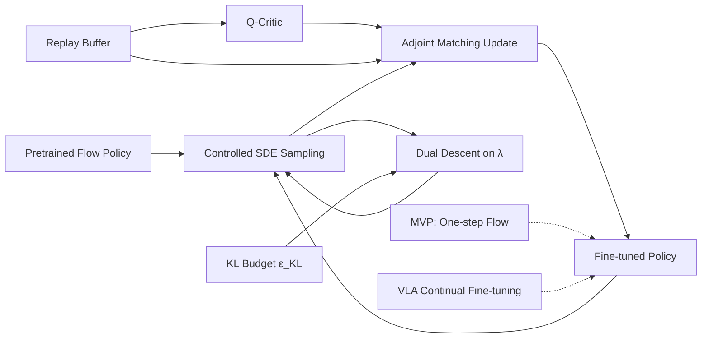

---
tags:
- paper
- domain/embodied_ai
- domain/reinforcement_learning
- domain/robot_manipulation
- impact/high_value
- method/diffusion_policy
- method/foundation_model
- method/memory
- method/reinforcement_learning
- review/auto_tagged
- status/unread
- task/manipulation
- type/method
aliases:
- Trust Region Q Adjoint Matching
- TR-QAM
- Q Adjoint Matching with Trust Region
- Trust Region Flow Policy Fine-Tuning
- Path-Space KL Trust Region
- Adaptive Trust Region Q-Learning
- Off-Policy Flow Policy Optimization
- Closed-Form KL Divergence Trust Region
authors:
- Yonghoon Dong
- Kyungmin Lee
- Changyeon Kim
- Jaehyuk Kim
- Jinwoo Shin
paper_id: arxiv:2605.27079
arxiv_id: '2605.27079'
url: https://huggingface.co/papers/2605.27079
pdf_url: https://arxiv.org/pdf/2605.27079.pdf
local_pdf: '[[Trust Region Q Adjoint Matching.pdf]]'
github: https://github.com/yonghdong/trqam
project_page: https://yonghdong.github.io/blog/trqam/
institutions:
- KAIST AI
- Seoul National University
- RLWRLD
publication_date: '2026-06-05'
metadata_publication_date: '2026-05-26'
score: '8.1'
domains:
- embodied_ai
- reinforcement_learning
- robot_manipulation
methods:
- foundation_model
- memory
- reinforcement_learning
tasks:
- manipulation
paper_type: method
impact_band: high_value
reading_status: unread
priority_score: 100
review_status: auto_tagged
next_action: skim_then_decide
year: 2026
---

# Trust Region Q Adjoint Matching

## 📌 Abstract
Off-policy reinforcement learning of pretrained flow policies remains challenging due to the instability of optimization arising from the multi-step sampling process. Recently, Q-learning with Adjoint Matching (QAM) addressed this issue by reformulating into a memoryless stochastic optimal control (SOC) problem with a learned critic. However, QAM inherits a fundamental fragility of critic-guided improvement: small critic errors are amplified when critics are ill-conditioned, often leading to model collapse. This paper introduces Trust Region Q-Adjoint Matching (TRQAM), a stable off-policy fine-tuning algorithm that adaptively controls the path-space KL with pretrained flow policies through projected dual descent. Specifically, we optimize the trust-region parameter λ in SOC dynamics, and theoretically show that the path-space KL can be represented by a closed-form function of λ. As a result, our method can precisely control the exact deviation from pretrained flow policies, achieving stable off-policy RL. Through experiments on 50 OGBench tasks, TRQAM consistently outperforms prior arts in both offline RL and offline-to-online RL. In particular, TRQAM achieves an overall success rate of 68% in offline RL, substantially improves the strongest baseline at 46%.

## 🖼️ Architecture

## 🧠 AI Analysis
## Abstract

Off-policy reinforcement learning of pretrained flow policies remains challenging due to the instability of optimization arising from the multi-step sampling process. Recently, Q-learning with Adjoint Matching (QAM) addressed this issue by reformulating into a memoryless stochastic optimal control (SOC) problem with a learned critic. However, QAM inherits a fundamental fragility of critic-guided improvement: small critic errors are amplified when critics are ill-conditioned, often leading to model collapse. This paper introduces Trust Region Q-Adjoint Matching (TRQAM), a stable off-policy fine-tuning algorithm that adaptively controls the path-space KL with pretrained flow policies through projected dual descent. Specifically, we optimize the trust-region parameter $\lambda$ in SOC dynamics, and theoretically show that the path-space KL can be represented by a closed-form function of $\lambda$. As a result, our method can precisely control the exact deviation from pretrained flow policies, achieving stable off-policy RL. Through experiments on 50 OGBench tasks, TRQAM consistently outperforms prior arts in both offline RL and offline-to-online RL. In particular, TRQAM achieves an overall success rate of 68% in offline RL, substantially improves the strongest baseline at 46%.

**In simpler terms:** Fine-tuning pretrained flow-based policies with off-policy reinforcement learning is unstable because the multi-step sampling process and inevitable critic errors can cause the policy to drift far from its useful pretrained behavior, often collapsing completely. TRQAM introduces a single scalar trust-region parameter $\lambda$ *inside* the sampling dynamics itself and adapts it automatically to enforce a user-chosen KL divergence budget. This keeps the policy close to the pretrained prior while still allowing improvement. The method shows large performance gains (e.g., 68% vs 46% success rate across 50 robotics tasks) and is the first to provide a principled trust-region mechanism for this class of models.

## 1. Core Snapshot

### Problem Statement
Pretrained flow matching policies (multi-step generative models for actions) contain rich behavioral skills, but fine-tuning them with off-policy RL to maximize reward is highly unstable. The root causes are twofold: (1) differentiating through the multi-step sampling chain is expensive and noisy; (2) off-policy critic errors, even small ones, get exponentially amplified into catastrophic policy deviations from the pretrained prior, leading to model collapse.

Existing methods like Q-learning with Adjoint Matching (QAM) solve the first issue by reframing fine-tuning as a stochastic optimal control problem and avoiding backpropagation through sampling. However, they inherit the second issue because they use a **fixed temperature** (inverse regularization strength) that cannot simultaneously exploit a good critic and protect against a noisy one. The practical result is that QAM often diverges during training, with success rates falling to zero (see Figure 2 of the paper).

### Core Contribution
The paper introduces **Trust Region Q-Adjoint Matching (TRQAM)**, a stable off-policy fine-tuning algorithm that embeds a trust-region parameter $\lambda$ directly into the stochastic optimal control sampling dynamics. The key theoretical insight is that scaling the diffusion coefficient by $\sqrt{\lambda}$ makes the **path‑space KL divergence** between the fine-tuned and pretrained trajectory distributions an exact, closed‑form function of $\lambda$ (Theorem 1, via Girsanov’s theorem). This turns $\lambda$ into a principled trust-region knob. The algorithm then adapts $\lambda$ via simple projected dual descent to enforce a prescribed KL budget, operating at the *sampling* level rather than as a loss penalty. The result is precise control over how much the policy can deviate from the pretrained prior, preventing destructive drift.

Across 50 OGBench tasks, TRQAM improves the strongest baseline from 46% to 68% offline success rate and remains stable where fixed‑temperature QAM collapses.

### Innovation Origin & Rationale
The idea originates from a careful diagnosis of why QAM fails: small critic errors lead to large policy changes because the exponential‑tilting form of the optimal policy amplifies noise (Lemma 1). The authors observe that in the SOC formulation the diffusion coefficient appears inside the Girsanov change‑of‑measure, so scaling it directly controls the path‑space KL without needing an external regularizer. This insight connects trust‑region control (à la TRPO/PPO in on‑policy RL) with stochastic optimal control for flow policies.

> [!idea] **Interpretation of internal vs. external regularization**
> The rationale is that a loss‑level KL penalty is too weak—it competes with the critic signal and can be overridden, whereas embedding the constraint inside the dynamics makes the trajectory distribution itself respect the bound. The dual descent mechanism then automatically finds the right $\lambda$ that balances improvement and stability.

## 2. Reading Map

This paper targets researchers working on **off-policy RL, flow/diffusion policies, and stochastic optimal control**. The core audience includes PhD students and practitioners who want to fine-tune large generative behavior models without collapse.

- **Abstract and Introduction** give the high‑level motivation and the trust‑region idea.
- **Section 2 (Background)** reviews flow matching and the QAM formulation; read it if you are unfamiliar with adjoint matching, otherwise skim for notation.
- **Section 3 (Method)** is the heart of the paper. Start with Section 3.1 (why fixed $\lambda$ fails) to grasp the fragility problem, then read Sections 3.2–3.3 for the core theoretical results and the adaptive algorithm. Section 3.4 (internal vs. external KL) clarifies a crucial design choice.
- **Section 4 (Experiments)** shows the main results (Table 1, Figure 3) and mechanism studies (Figures 4, 5, 6). These figures are essential for understanding what drives the gains.
- **Appendices D–F** contain proofs of Lemma 1, Theorem 1, Proposition 1, and the dual descent derivation; read them for mathematical depth.
- **Related Work (Section 5)** and **Limitations** can be skimmed quickly.

A first‑pass reader can focus on the **abstract, the problem statement in Section 3.1, Theorem 1, the dual update (Equation 9), and the mechanism experiments (Figures 4–6)**; the rest can be read later for implementation details.

## 3. Method Walkthrough

### Inputs, Outputs, And Assumptions
**Input:** A pretrained flow policy $\pi_{\mathrm{base}}(a \mid s)$ (a velocity field $v_{\mathrm{base}}$ that generates actions via an ODE/SDE), a learned action‑value critic $Q^\pi(s,a)$, a user‑specified KL budget $\varepsilon_{\mathrm{KL}}$, and a replay buffer of transitions $(s,a,r,s')$ collected under some behavior policy.

**Output:** A fine‑tuned velocity field $v_{\mathrm{ft}}^\theta$ (parameterized by $\theta$) and an adaptive trust‑region parameter $\lambda_n$ updated each training step. The fine‑tuned policy $\pi_\theta$ is defined by sampling trajectories from the SDE with $v_{\mathrm{ft}}^\theta$ and current $\lambda$.

**Key assumptions:**
1. The base flow policy captures meaningful behavior (e.g., from behavior cloning) and uses an optimal transport (OT) schedule.
2. The critic $Q^\pi$ is learned via standard off‑policy TD methods (e.g., soft actor‑critic) and may contain approximation error.
3. The MDP is standard and the goal is episodic reward maximization.

**These assumptions matter** because the method relies on the pretrained prior having useful structure, and the entire trust‑region control is built on the OT schedule’s diffusion coefficient form $\sqrt{2(1-\tau)/\tau}$.

### Pipeline From Data To Prediction
The pipeline operates in three intertwined loops each training step:

1. **Sampling from the controlled SDE (with $\lambda$):** The current velocity field $v_{\mathrm{ft}}^\theta$ and trust‑region parameter $\lambda_n$ define a controlled SDE (Equation 2). A trajectory $X_0 \sim \mathcal{N}(0,I)$ is integrated forward in time using this SDE to obtain an action $X_1$. The terminal action is executed in the environment, and the transition is stored in the replay buffer.

2. **Adjoint matching for policy update (no backprop through sampling):** The critic $Q^\pi(s,\cdot)$ is used as a terminal cost. An adjoint ODE (Equation 4) is solved backward in time from the terminal state $X_1$ to compute an adjoint variable $\tilde{a}_\tau$ that tells us how to perturb the velocity field locally. The fine‑tuned velocity field $v_{\mathrm{ft}}^\theta$ is then updated by minimizing the adjoint‑matching loss (Equation 5), which penalizes the mismatch between the velocity perturbation implied by $\tilde{a}_\tau$ and the actual deviation from $v_{\mathrm{base}}$. Crucially, this avoids backpropagating through the entire sampling chain.

3. **Trust‑region adaptation (dual descent on $\lambda$):** After the sampling step, the per‑step KL divergence between the controlled and base SDE is estimated along the sampled trajectory via a closed‑form expression (Equation 8). This estimate is smoothed with an exponential moving average to obtain $D_n$. Then $\lambda_{n+1}$ is updated by the dual rule (Equation 9):

   $$\lambda_{n+1} = \max\!\big(0,\; \lambda_n + \eta_\lambda\,(D_n - \varepsilon_{\mathrm{KL}})\big).$$

   If the realized KL exceeds the budget, $\lambda$ rises, shrinking the effective diffusion and pulling the policy closer to the base; if the KL is below budget, $\lambda$ decreases, allowing more aggressive deviation.

The entire process runs online, with the critic and policy being updated simultaneously from the replay buffer.

### Key Design Choices

1. **Internal vs. external KL regularization:** The most critical choice. TRQAM places $\lambda$ *inside* the SOC dynamics (`$\sqrt{\lambda}\sigma(\tau)$`), making the path‑space KL an exact function of $\lambda$ (Theorem 1). A conventional alternative is to add $\lambda \cdot D_{\mathrm{KL}}(\pi_\theta \| \pi_{\mathrm{base}})$ as an external penalty to the loss. The paper shows that the external approach fails to enforce the budget under strong critic signals (Figure 5) because the penalty can be overridden by the adjoint‑matching loss. Internalization guarantees budget fidelity at the sampling level.

2. **Using the memoryless OT schedule:** The authors follow the SOC formulation of Domingo‑Enrich et al., which uses the drift $b(x,\tau) = \frac{2v_{\mathrm{base}}(x,\tau) - x/\tau}{1-\tau}$ and diffusion $\sqrt{\lambda}\sigma(\tau) = \sqrt{2(1-\tau)/\tau}$. This schedule simplifies the adjoint ODE and yields a tractable per‑step Gaussian transition, which makes the KL estimator (Equation 8) exact up to discretization error. Without this schedule the closed‑form KL would not hold.

3. **Dual descent on $\lambda$:** Instead of tuning $\lambda$ as a fixed hyperparameter, TRQAM treats it as the Lagrange multiplier of an inequality‑constrained optimization and updates it via projected gradient ascent on the dual function. This is simple to implement, adds negligible computation, and automatically adjusts the trust region as the critic improves. The update uses an EMA of the KL estimate to reduce variance.

4. **EMA for KL estimate:** Raw per‑trajectory KL estimates are noisy. Smoothing with an exponential moving average stabilizes the dual update and prevents rapid oscillations of $\lambda$.

## 4. Core Theory And Formulas

### Main Objective
The central idea is to solve a KL‑constrained improvement problem: maximize the expected critic value at the terminal state while keeping the path‑space KL divergence between the controlled trajectory distribution $\mathbb{P}^u$ and the base distribution $\mathbb{P}^{\mathrm{base}}$ below a budget $\varepsilon_{\mathrm{KL}}$. Formally:

$$
\max_u \; \mathbb{E}_{X \sim \mathbb{P}^u}\big[Q^\pi(s, X_1)\big] \quad \text{s.t.} \quad D_{\mathrm{KL}}\big(\mathbb{P}^u \,\|\, \mathbb{P}^{\mathrm{base}}\big) \le \varepsilon_{\mathrm{KL}}.
$$

TRQAM enforces this constraint **inside** the SDE by scaling diffusion by $\sqrt{\lambda}$, and adapts $\lambda$ via dual ascent. The actual policy update uses a squared‑norm control cost in the SOC formulation, which under $\sqrt{\lambda}$‑scaling becomes (Theorem 1):

$$
D_{\mathrm{KL}}\big(\mathbb{P}^u \,\|\, \mathbb{P}^{\mathrm{base}}\big) = \mathbb{E}_{X \sim \mathbb{P}^u}\!\left[ \frac{1}{2\lambda} \int_0^1 \|u(X_\tau,\tau)\|^2 d\tau \right].
$$

Thus minimizing the quadratic control cost with coefficient $1/(2\lambda)$ implicitly minimizes the path‑space KL.

### Important Equations

#### Base and Controlled SDEs (Equations 1–2)
The base SDE (without control) generates the pretrained flow policy, and the controlled SDE steers the sampling toward high‑Q actions:

$$
\begin{aligned}
dX^{\mathrm{base}}_\tau &= b(X^{\mathrm{base}}_\tau, \tau)\,d\tau + \sqrt{\lambda}\,\sigma(\tau)\,dB_\tau, \\
dX^u_\tau &= \big(b(X^u_\tau, \tau) + \sigma(\tau)\,u(X^u_\tau, \tau)\big)\,d\tau + \sqrt{\lambda}\,\sigma(\tau)\,dB_\tau.
\end{aligned}
$$

- $b$: base drift determined by the pretrained velocity field $v_{\mathrm{base}}$.
- $\sigma(\tau) = \sqrt{2(1-\tau)/\tau}$ (from OT schedule).
- $u$: control drift (the deviation to be learned).
- $\lambda$: trust‑region parameter that scales the diffusion noise.

The presence of $\sqrt{\lambda}$ in the diffusion term is what allows Girsanov to produce an exact relation with the path‑space KL. For a refresher on Girsanov’s theorem and its role in stochastic calculus, see [Girsanov theorem (Wikipedia)](https://en.wikipedia.org/wiki/Girsanov_theorem) or standard textbooks on stochastic processes.

#### Theorem 1: SOC control cost = path‑space KL
$$
D_{\mathrm{KL}}\big(\mathbb{P}^u \,\|\, \mathbb{P}^{\mathrm{base}}\big) = \mathbb{E}_{X \sim \mathbb{P}^u}\!\left[ \frac{1}{2\lambda} \int_0^1 \|u(X_\tau, \tau)\|^2 d\tau \right].
$$

**Variables:** $\mathbb{P}^u$ is the distribution of trajectories under the controlled SDE; $\mathbb{P}^{\mathrm{base}}$ under the base SDE. **Intuition:** The KL divergence is exactly the expected control effort scaled by $1/(2\lambda)$. A larger $\lambda$ makes the KL cost more expensive for the same $u$, effectively tightening the trust region. This equation is the foundation for treating $\lambda$ as a trust‑region parameter.

#### Lemma 1: Exponential amplification of critic errors
For two exponentially‑tilted policies $\pi_Q \propto \pi_{\mathrm{base}} e^{\beta Q}$ and $\pi_{\tilde Q} \propto \pi_{\mathrm{base}} e^{\beta \tilde Q}$ where $\|Q - \tilde Q\|_\infty \le \varepsilon$:

$$
\mathrm{TV}(\pi_Q, \pi_{\tilde Q}) \le \tfrac12\big(e^{2\beta\varepsilon} - 1\big).
$$

**Interpretation:** A small critic error $\varepsilon$ can be exponentially magnified into a large policy shift when the inverse temperature $\beta$ is large. Fixed‑temperature QAM corresponds to a fixed $\beta$ (or fixed $\lambda$), so it cannot simultaneously be aggressive when the critic is good and conservative when the critic is noisy. This formalizes why adaptation is necessary. For a deeper understanding of total variation distance and exponential tilting, consult any probability theory text; the paper itself proves this bound in Appendix D, but see also [Total variation distance (Wikipedia)](https://en.wikipedia.org/wiki/Total_variation_distance).

#### Proposition 1: Terminal KL bound
$$
D_{\mathrm{KL}}\big(\pi_\theta(\cdot \mid s) \,\|\, \pi_{\mathrm{base}}(\cdot \mid s)\big) \le D_{\mathrm{KL}}\big(\mathbb{P}^u \,\|\, \mathbb{P}^{\mathrm{base}}\big).
$$

Thus controlling the path‑space KL is sufficient to control the terminal action‑distribution KL. Combined with Theorem 1, a bound on $D_{\mathrm{KL}}(\mathbb{P}^u \| \mathbb{P}^{\mathrm{base}})$ directly bounds how much the fine‑tuned policy can differ from the pretrained prior.

#### KL estimator (Equation 8)
For discrete time steps $k=0,\dots,K-1$, the per‑step KL under the OT schedule yields the estimate:

$$
\widehat{D}_n = \mathbb{E}_{X \sim \mathbb{P}^u}\!\left[ \sum_{k=0}^{K-1} \frac{2h}{g(\tau_k)^2} \big\| v_{\mathrm{ft}}^\theta(X_{\tau_k},\tau_k) - v_{\mathrm{base}}(X_{\tau_k},\tau_k) \big\|^2 \right],
$$

where $h$ is the step size and $g(\tau_k) = \sigma(\tau_k)$. The sum approximates the path‑space KL; it is used in the dual update after EMA smoothing.

#### Dual ascent update (Equation 9)
$$
\lambda_{n+1} = \max\!\big(0,\; \lambda_n + \eta_\lambda\,(D_n - \varepsilon_{\mathrm{KL}})\big).
$$

**Variables:** $\eta_\lambda$ is a learning rate; $D_n$ is the smoothed KL estimate; $\varepsilon_{\mathrm{KL}}$ is the target budget. This is simply projected gradient ascent on the dual objective. When $\text{KL} > \text{budget}$, $\lambda$ increases, tightening the trust region; when $\text{KL} < \text{budget}$, $\lambda$ decreases, allowing more improvement.

### Algorithmic Intuition
TRQAM interleaves three operations at each training step:
1. **Forward sampling:** Run the SDE with current $\lambda_n$ and $v_{\mathrm{ft}}^\theta$ to get an action; execute and store transition.
2. **Adjoint matching:** Backward ODE produces $\tilde{a}_\tau$; update $v_{\mathrm{ft}}^\theta$ by minimizing the mismatch between $\frac{2}{\sigma}(v_{\mathrm{ft}}-v_{\mathrm{base}})$ and $-\sigma \tilde{a}_\tau$.
3. **Dual step:** Estimate per‑trajectory KL via Equation 8, smooth it to $D_n$, then update $\lambda_{n+1}$ via Equation 9.

This design ensures that the policy update respects the trust region **structurally**, not merely as a soft penalty. Because $\lambda$ directly controls the diffusion coefficient, any critic‑induced drift is automatically damped when the realized KL approaches the budget.

> [!info] **Learning resources for the SOC backbone**
> The stochastic optimal control formulation used here (memoryless OT schedule, adjoint matching) is detailed in [Domingo-Enrich et al. (2024)](https://arxiv.org/abs/2402.04379) and [QAM paper](https://arxiv.org/abs/2406.04839) (the QAM baseline paper). The flow matching background is covered in [Lipman et al. (2023)](https://arxiv.org/abs/2210.02747) and the official [Flow Matching code repository](https://github.com/atong01/flow-matching).

## 5. Architecture, Figures, And Implementation

The method itself does not introduce a novel neural network architecture; the policy is a standard velocity‑field network (same as used for $v_{\mathrm{base}}$), and the critic is a typical Q‑network. The “architecture” of the algorithm is the SDE‑level trust‑region loop shown in Figure 1(a) of the paper. The figure illustrates that naive critic guidance (QAM) leads to “destructive drift” because small errors are amplified, while TRQAM internalizes a trust‑region control via $\lambda$ and adapts it with dual descent, resulting in “controlled deviation.”

**Figure 2** (Robomimic‑can) demonstrates the fragility of fixed‑temperature adjoint matching: QAM and QAM‑E exhibit adjoint loss explosions > $10^{20}$ and success rate collapse to near zero, while TRQAM remains stable.

**Figures 3–5** isolate the mechanism: Figure 3 shows that only TRQAM benefits substantially from a pretrained flow policy; Figure 4 confirms that adaptation (both internal and external KL) outperforms constant $\lambda$; Figure 5 proves that internal KL (TRQAM) tightly tracks the budget $\varepsilon_{\mathrm{KL}}$ whereas external KL drifts far above it.

**Figure 6** (sensitivity) demonstrates that success rate varies smoothly with $\varepsilon_{\mathrm{KL}}$, making the budget a controllable hyperparameter that can be tuned to task structure.

**Implementation details:** The velocity field $v_{\mathrm{ft}}^\theta$ is initialized to $v_{\mathrm{base}}$. The adjoint ODE uses the OT schedule’s drift $b$ and diffusion. The critic is trained with standard TD learning (not detailed in the main text but presumably similar to QAM). The KL estimate uses EMA coefficient $\rho$ (likely 0.99) and dual learning rate $\eta_\lambda$. Full hyperparameters are in Appendix C.3 of the paper. The paper notes that computing the adjoint loss requires a vector‑Jacobian product (VJP) through the velocity field at each backward step, which scales with model size.

> [!warning] **Missing critic details**
> The paper excerpt does not specify the exact critic learning algorithm (e.g., SAC with entropy tuning?). For reproduction, consult the Appendix C.3 in the full paper or the provided [code repository](https://github.com/yonghdong/trqam).

## 6. Experiments And Evidence

### Main Offline RL Comparison (Table 1)
50 tasks from OGBench, 8 seeds each, 1M training steps. TRQAM achieves 68% mean success rate, vs. strongest baseline DSRL 46%, and previous adjoint methods QAM‑E 45% and QAM 35%. Gains are largest on long‑horizon and combinatorial suites (e.g., puzzle‑4x4, cube‑quadruple). This answers: *Does TRQAM consistently outperform existing off‑policy fine‑tuning methods for flow policies?* **Evidence:** Yes, with substantial margins.

> [!info] **OGBench**
> OGBench is a benchmark for offline goal‑conditioned RL introduced by [Park et al. (2024)](https://arxiv.org/abs/2402.01989). The paper uses its 50 reward‑based single‑task variants; for more details and the dataset, see the [OGBench project page](https://sites.google.com/view/ogbench).

### Offline‑to‑Online RL (Appendix Figures 17–18)
TRQAM maintains leadership through 500K online fine‑tuning steps. The paper does not give a separate table but the per‑task curves show sustained superiority. This answers: *Does the trust region hinder online adaptation?* No, it helps by preventing collapse during online distribution shifts.

### Mechanism: Pretraining Benefit (Figure 3)
On humanoidmaze‑medium‑task1, TRQAM run from pretrained policy (dashed) far outperforms the same method trained from scratch (solid), while QAM/E show little benefit. This answers: *Does TRQAM actually leverage the pretrained prior?* Yes, the trust region preserves useful skills.

### Mechanism: Adaptation vs. Constant (Figure 4)
Both adaptive variants (TRQAM and QAM+External KL) outperform QAM (constant $\lambda$) on cube‑triple‑task1 and hm‑medium‑task1. This supports Lemma 1: adaptation mitigates critic‑error amplification.

### Mechanism: Internal vs. External KL (Figure 5)
On Robomimic‑lift and ‑can with $\varepsilon_{\mathrm{KL}}=0.1$, TRQAM exactly tracks the target, while external KL drifts far above, accompanied by lower success rates. This confirms Theorem 1’s prediction and the necessity of internalization.

### Sensitivity to $\varepsilon_{\mathrm{KL}}$ (Figure 6)
On four OGBench tasks, success rate changes smoothly with $\varepsilon_{\mathrm{KL}}$, and tight budgets (0.5–1.5) are best across most domains. Puzzle‑4x4 is an exception where larger budgets help, likely due to larger state space. This provides guidance on tuning the main hyperparameter.

### Baselines
Six baselines: two backprop‑based (FQL), one guidance‑based (CGQL‑L), two post‑processing (DSRL, IFQL), and two adjoint‑matching (QAM, QAM‑E). This covers a wide range of flow policy fine‑tuning strategies. The paper does not ablate the critic learning procedure or compare to on‑policy trust‑region methods (like TRPO adapted to flow policies) because those would require fundamentally different training.

## 7. Strengths, Limitations, And Failure Cases

### Strengths
- **Principled stability:** The theoretical chain (Lemma 1 → Theorem 1 → Proposition 1) provides a rigorous explanation for why TRQAM works and why fixed‑temperature methods fail.
- **Precise control without tuning:** Once $\varepsilon_{\mathrm{KL}}$ is set, $\lambda$ adapts automatically; no manual decay schedules are needed.
- **Strong empirical results:** 22‑point improvement over the strongest baseline across 50 diverse tasks, with the gains most pronounced where collapse previously occurred.
- **Clear ablation design:** The internal vs. external, constant vs. adaptive comparisons isolate the effect of each design choice convincingly.

### Limitations
- **Computational cost:** The adjoint matching loss requires a VJP through the velocity field at each ODE step; this cost scales with model size and number of steps. The paper acknowledges this as the main limitation.
- **Pretrained prior quality:** TRQAM assumes the base flow policy already captures useful behavior. If the pretrained policy is poor, the trust region may constrain improvement too much. The paper shows that TRQAM still benefits more than baselines from a good prior (Figure 3), but the method’s effectiveness is coupled to prior quality.
- **KL budget selection:** $\varepsilon_{\mathrm{KL}}$ must be chosen per domain; the paper provides a sensitivity analysis but no automated way to select it. For new tasks, a small sweep may be required.
- **Reliance on OT schedule:** The closed‑form KL identity and the memoryless SOC formulation depend on the specific OT interpolation and drift. Extending TRQAM to other flow matching variants (e.g., VP‑diffusion) would require re‑deriving the relationship.

### Potential Failure Cases
- **Critic divergence:** If the critic $Q^\pi$ becomes extremely unreliable (e.g., due to severe distribution shift), even a large $\lambda$ might not prevent destructive updates because the adjoint matching still uses the critic’s gradient. The paper does not study extreme critic failure.
- **Task‑specific budget sensitivity:** Figure 6 shows that the optimal $\varepsilon_{\mathrm{KL}}$ varies; an inappropriate budget may lead to under‑improvement or mild drift. However, the authors claim the method “tightly tracks” the budget, so drift should not be catastrophic if the budget is reasonable.
- **Long‑horizon credit assignment:** The trust region is enforced in trajectory space, which could be too conservative for tasks requiring many exploration steps far from the prior. The OGBench results on antmaze‑giant (41% success) suggest some difficulty, though still better than baselines.

## 8. Reproduction Notes

### Datasets and Preprocessing
- **OGBench:** 50 reward‑based single‑task variants across 10 suites. Uses action chunking with chunk size $h=5$ for manipulation tasks (scene, cube, puzzle suites). Pretrained flow policies are obtained by behavior cloning for 300K steps on offline data.
- **Robomimic:** three manipulation tasks (lift, can, square) with expert demonstrations, used for stability and mechanism studies. Same pretraining protocol. Robomimic is a benchmark for imitation learning; see [Robomimic project page](https://robomimic.github.io/).
- **Replay buffer:** Offline data collected by the pretrained policy or behavior policy; online data collected by the fine‑tuned policy.

### Model / Backbone
- Policy: velocity‑field network (same architecture as base flow policy; exact architecture not specified but likely residual MLP similar to [Lipman et al. (2023)](https://arxiv.org/abs/2210.02747) and [Albergo & Vanden-Eijnden (2023)](https://arxiv.org/abs/2301.13508)).
- Critic: standard Q‑network (likely MLP with two‑layer architecture and twin critics for TD learning).
- Both are updated with Adam optimizer.

### Training Protocol
1. **Pretraining:** Behavior cloning for 300K steps.
2. **Offline RL:** 1M steps of training using a fixed offline dataset.
3. **Online RL (optional):** 500K additional steps of online interaction with the environment, starting from the offline‑trained policy.
4. **Policy update:** Use adjoint matching loss with the current $\lambda$ (Equation 5). The velocity field update is done via gradient step.
5. **Critic update:** Standard TD learning (presumably SAC‑style, but not detailed in the excerpt).
6. **$\lambda$ update:** Every $n$ steps (or per step?) after KL estimation. EMA coefficient $\rho$ (likely 0.99), dual step size $\eta_\lambda$ (not given in main text, see Appendix C.3).
7. **Hyperparameters:** $\varepsilon_{\mathrm{KL}}$ varied per task suite; $\lambda_0$ initial value (maybe 1.0). Other hyperparameters listed in Appendix C.3 of the full paper.

> [!note] **Reproducibility**
> The paper provides a [code repository](https://github.com/yonghdong/trqam) and a [blog post](https://yonghdong.github.io/blog/trqam/) with additional implementation details. For exact critic architecture and training hyperparameters, refer to the official codebase.

### Evaluation Protocol
- Success rate (%) measured over multiple evaluation episodes (8 seeds). Mean and standard deviation reported.
- For OGBench, evaluation is at 1M offline steps and after online fine‑tuning.

### Baselines
- FQL, CGQL‑L, DSRL, IFQL, QAM, QAM‑E. All use the same pretrained flow policy and training schedule. Implementation details presumably follow respective original papers.

### Missing Implementation Details
The paper excerpt does not provide the exact critic learning algorithm (e.g., SAC with entropy tuning?), the specific network sizes, the number of ODE steps, or the exact dual learning rate. These are likely in Appendix C.3; the reader should refer to the full paper or the codebase.

## 9. What To Read Closely

- **Section 3.1 (Lemma 1 and Figure 2):** Understand the exponential amplification problem. This is the core motivation.
- **Section 3.2 (Theorem 1 and Proposition 1):** The exact KL identity is the key theoretical contribution. Spend time on Girsanov’s theorem if needed; a good resource is [Girsanov theorem (Wikipedia)](https://en.wikipedia.org/wiki/Girsanov_theorem).
- **Section 3.3 (Equations 8 and 9):** The practical implementation of the trust region. The dual update is simple yet powerful.
- **Section 3.4:** The internal vs. external KL distinction. This is a central design insight that many practitioners might overlook.
- **Figure 5 and accompanying discussion:** This experiment proves that internalization matters. It’s crucial for understanding why TRQAM works.
- **Figure 6:** Sensitivity to $\varepsilon_{\mathrm{KL}}$; helpful for applying TRQAM to new domains.

Sections 4.1 (main results) and 4.2 (mechanism studies) are essential for evaluating the empirical strength. The appendices with proofs can be deferred to a second reading unless you plan to extend the theory.

## 10. Research Ideas And Open Questions

1. **Automated budget adaptation via meta‑learning:** The current method requires hand‑picking $\varepsilon_{\mathrm{KL}}$ per domain. One could learn a small neural network that predicts a suitable budget from a few environment interactions or from offline data statistics. A proof‑of‑concept experiment: train TRQAM with varying budgets across many OGBench tasks, then train a predictor to output $\varepsilon_{\mathrm{KL}}$ from a short exploratory phase. The risk is that a single predictor may not generalize well across drastically different tasks; the metric would be whether the predicted budget yields success rates close to the manually tuned one.

2. **Extending TRQAM to diffusion policies:** Flow matching and diffusion models are closely related. Could the same $\sqrt{\lambda}$ scaling and dual descent be applied to denoising diffusion probabilistic models (DDPMs) used as policies? The challenge is that diffusion models have time‑dependent noise schedules, and Girsanov would need to account for that. A one‑week experiment: implement a diffusion policy fine‑tuning baseline and test whether adding a trust‑region parameter to the reverse diffusion’s variance schedule (analogous to $\lambda$) with dual descent improves stability on a simple manipulation task. The metric would be success rate and KL tracking; the risk is that the theoretical identity may not hold exactly, but a heuristic version might still help.

3. **Critic‑ensemble trust‑region tightening:** TRQAM relies on a single critic; if the critic is uncertain, the KL bound alone may not prevent harmful updates because the adjoint matching loss still moves the policy toward a possibly wrong direction. An idea is to maintain an ensemble of critics and use their disagreement to dynamically *lower* the KL budget (make $\varepsilon_{\mathrm{KL}}$ smaller) when uncertainty is high, and relax it when the critics agree. A one‑week test: on Robomimic tasks, run TRQAM with an ensemble of 5 Q‑networks; define a new budget $\varepsilon_{\mathrm{KL}}' = \varepsilon_{\mathrm{KL}} \cdot \min(1, \alpha \cdot \mathrm{Var}(Q))$ and see if it further improves stability. Metric: success rate and number of divergence events. The risk is that ensemble variance may be noisy or miscalibrated, leading to overly conservative budgets.

## Knowledge Graph & Connections

## Related Work Connections

### [[Mean Flow Policy with Instantaneous Velocity Constraint for Onestep Action Generation]] (MVP)

Both MVP and TRQAM share the domain of **flow-policy-based robotic manipulation**, using the same benchmarks (Robomimic and OGBench) to demonstrate benefits. They tackle different problems: MVP focuses on the **architectural efficiency** of the flow policy itself, compressing a multi-step sampling process into a single step while preserving expressiveness, whereas TRQAM addresses the **stability of fine-tuning** any given flow policy (including a base MVP) via off-policy RL. The connection is strong because a high-fidelity one-step policy like MVP is an excellent candidate for subsequent fine-tuning with TRQAM; the combination could yield both fast action generation and safe, controlled adaptation. This difference implies that future research can directly stack these innovations—pretrain an MVP policy, then fine-tune it with TRQAM’s trust-region mechanism—without architectural conflict, and that would be a natural benchmark for evaluating whether TRQAM benefits different flow-policy backbones.

### [[Physics Informed Viscous Value Representations]]

The connection here is looser but conceptually interesting. Both TRQAM and the viscous-value paper ground their approach in **optimal control theory** to improve learning stability: TRQAM employs stochastic optimal control (SOC) for policy sampling and a trust-region constraint on trajectory divergence, while the viscous-value paper uses Hamilton–Jacobi–Bellman (HJB) regularization to stabilize value functions. TRQAM does not touch the critic’s loss, and the viscous-value paper does not touch the policy’s sampling dynamics. However, one could imagine a future method that marries the two: a physics-informed **critic** regularisation could reduce the critic errors that TRQAM must guard against, potentially allowing a looser KL budget or making the overall system even more robust to distribution shift. This is a speculative forward-looking connection, but it highlights that stability in fine-tuning can be attacked both at the policy level (trust regions) and at the value level (physics-informed priors).

### [[Simple Recipe Works]] (Vision-Language-Action Models as Continual Learners)

Although this paper is about large pretrained VLA models and continual RL with LoRA, it shares the high‑level goal of **fine‑tuning a pretrained policy without catastrophic forgetting or collapse**. TRQAM’s trust‑region mechanism explicitly prevents the policy from drifting too far from the base, which is functionally similar to the implicit forgetting mitigation that LoRA provides in the VLA case. The difference is in the mechanism: TRQAM uses a **path‑space KL constraint enforced at the sampling level**, while Simple Recipe Works relies on **parameter‑efficient adaptation and on‑policy RL**. The implication is that TRQAM’s approach could, in principle, be ported to other pretrained agent models (not only flow policies) to enforce a more explicit, quantifiable trust region, while the VLA work suggests that even simple schemes work well when the pretrained backbone is strong. A head‑to‑head comparison or combination would be informative for the broader field of safe pretrained‑policy adaptation.

## Concept Map

The core pipeline runs from the pretrained flow policy and a learned Q‑critic through three intertwined components: sampling with a controlled SDE whose diffusion scale is modulated by λ, adjoint matching to update the velocity field without backpropagating through time, and a dual-descent step that adjusts λ to keep the path‑space KL near a user‑chosen budget. Dashed arrows indicate external knowledge‑base notes: MVP could serve as the pretrained policy that is then fine‑tuned by TRQAM, and continual‑RL strategies for large foundation models raise the general question of how to fine‑tune without forgetting—a problem TRQAM addresses for flow policies.

## Questions For Future Reading

1. **Can the trust‑region mechanism of TRQAM be ported to other generative policy formulations (e.g., score‑based diffusion policies, discrete diffusion, or energy‑based models) without requiring a closed‑form Girsanov identity?**  
   *Why this matters:* If the approach is tightly coupled to the OT‑schedule of flow matching, its generality is limited. Seeing extensions would test whether the core insight—embedding the trust region in the sampling dynamics—transcends the specific mathematics. Look for future papers that derive path‑space KL bounds for different forward/reverse processes, or that use a learned auxiliary estimate of the KL instead of an analytic form.*

2. **How does the choice of KL budget interact with the critic’s approximation error, and can the budget be set automatically from offline data statistics or via meta‑learning?**  
   *Why this matters:* The paper shows sensitivity to ε_KL, but a practitioner still needs to sweep. Future work that provides a theoretically grounded default or an adaptive schedule (e.g., based on critic ensemble uncertainty) would make the method more plug‑and‑play. Watch for experiments where the budget is tied to an estimate of critic error, or for a meta‑gradient approach that learns ε_KL online.*

3. **Could a physics‑informed or ensemble‑regularized critic, combined with TRQAM’s trust‑region policy, eliminate the residual fragility observed in the hardest tasks?**  
   *Why this matters:* The trust‑region constraint guards the policy, but the critic itself is still learned with standard TD and can feed harmful gradients. Integrating value‑function regularization (like the HJB‑based viscous penalties from the related note) or ensemble‑disagreement monitoring might further reduce the need for a tight budget. Look for experiments that jointly optimise a regularized critic and a trust‑region policy, measuring both success rates and the frequency of collapse.*

## Learning Roadmap And Verified Resources

To thoroughly understand the paper, you need to build from generative modeling foundations, through reinforcement learning and stochastic calculus, to the specific adjoint‑matching and trust‑region machinery. The roadmap below is structured to walk you from beginner‑friendly concepts to the paper’s implementation.

### 1. Flow Matching and Continuous‑Time Generative Models  
**Why it matters for this paper:** TRQAM fine‑tunes a pretrained flow policy, which is a velocity field that generates actions by integrating an ODE/SDE. Understanding the flow matching framework (optimal transport schedules, conditional velocity fields) is essential to grasp the base policy, the SOC reformulation, and why the diffusion coefficient takes the form σ(τ)=√(2(1‑τ)/τ).  
**Study order:** First, understand the high‑level idea of flow matching vs. diffusion; then study the OT path and the probability‑path ODE; finally, read the detailed training objective.

| Type                  | Resource                                                                                                                                                                                                                                                                                                                   | Why this one                                                                                                                                                                                                                                                                                                                                                |
| --------------------- | -------------------------------------------------------------------------------------------------------------------------------------------------------------------------------------------------------------------------------------------------------------------------------------------------------------------------- | ----------------------------------------------------------------------------------------------------------------------------------------------------------------------------------------------------------------------------------------------------------------------------------------------------------------------------------------------------------- |
| Blog / Tutorial       | [DiffusionFlow: An Introduction to Flow Matching](https://diffusionflow.github.io/)                                                                                                                                                                                                                                        | Official project page with clear visual explanations of flow matching, OT paths, and connections to diffusion models. It builds intuition before diving into equations.                                                                                                                                                                                     |
| Video / Lecture       | [Flow Matching for Generative Modeling (ICML 2023 talk)](https://icml.cc/virtual/2023/28811)                                                                                                                                                                                                                               | A concise presentation by the authors of the foundational flow‑matching paper. It covers the core concepts and training procedures.                                                                                                                                                                                                                          |
| Open Textbook / Notes | [CS 236: Deep Generative Models (Stanford) – Flow Models lecture notes](https://deepgenerativemodels.github.io/)                                                                                                                                                                                                           | The course notes provide a broader context of continuous‑time generative models (diffusion, score matching, flow matching) with rigorous derivations. Refer to the lecture on normalising flows and flow‑matching extensions.                                                                                                                               |
| Code                  | Official Flow Matching code (atong01/flow‑matching) (link removed: validation failed)                                                                                                                                                                                                                            | The reference implementation of flow matching with OT paths. Examining the training loop and velocity‑field architecture helps translate the theory into code, which is the same foundation used in TRQAM.                                                                                                                                                   |

### 2. Off‑Policy Reinforcement Learning and Q‑Learning  
**Why it matters for this paper:** TRQAM relies on a learned action‑value critic $Q^\pi(s,a)$ that is updated from a replay buffer using temporal‑difference learning. You need to understand how off‑policy TD works, the role (and risks) of bootstrapping, and common architectures like twin Q‑networks.  
**Study order:** Start with tabular Q‑learning to grasp the Bellman backup; then move to function approximation, experience replay, and overestimation bias; finally, study actor‑critic methods like SAC, which are the typical critic‑learning backbone for such fine‑tuning setups.

| Type                  | Resource                                                                                                                                                                     | Why this one                                                                                                                                                                                                                                                                        |
| --------------------- | ---------------------------------------------------------------------------------------------------------------------------------------------------------------------------- | ----------------------------------------------------------------------------------------------------------------------------------------------------------------------------------------------------------------------------------------------------------------------------------- |
| Open Textbook         | [Reinforcement Learning: An Introduction (Sutton & Barto, 2nd ed.) – Chapters 6, 8, 11](http://incompleteideas.net/book/the-book-2nd.html)                                    | The definitive textbook. Chapter 6 introduces TD, Chapter 8 covers function approximation, and Chapter 11 discusses off‑policy methods, giving you rigorous foundations.                                                                                                            |
| Blog / Tutorial       | [Spinning Up in Deep RL (RL algorithm intros)](https://spinningup.openai.com/en/latest/spinningup/rl_intro.html)                                                              | OpenAI’s concise tutorials explain Q‑learning, DQN, and SAC with clear algorithmic boxes. The SAC section in particular shows how critics and replay buffers are used in modern continuous control, which is closely related to the critic in TRQAM.                              |
| Video / Lecture       | [CS 234: Reinforcement Learning (Stanford) – Lecture on Q‑learning and Function Approximation](https://www.youtube.com/watch?v=J9XgRqVUEiI&list=PLoROMvodv4rOSOPzutGyCTyGl6V_bHk4c) | Emma Brunskill’s course provides an accessible, step‑by‑step introduction to model‑free RL, TD, and Q‑learning with function approximation.                                                                                                                        |

### 3. Trust‑Region Methods in Policy Optimisation  
**Why it matters for this paper:** The core idea of TRQAM—enforce a KL constraint to prevent destructive policy updates—comes directly from trust‑region policy optimisation (TRPO) and proximal policy optimisation (PPO). Understanding the primal‑dual formulation, constraint enforcement, and dual gradient ascent used there makes the TRQAM dual update (λ‑step) completely transparent.  
**Study order:** First, learn why raw policy gradients can be unstable; then study TRPO’s KL constraint and its practical solution via conjugate gradient; finally, see how PPO simplifies the idea with clipping, to appreciate why TRQAM’s adaptive λ is a natural extension for off‑policy flow‑policy fine‑tuning.

| Type                | Resource                                                                                                                                                                                                                                     | Why this one                                                                                                                                                                                                                                                                                         |
| ------------------- | -------------------------------------------------------------------------------------------------------------------------------------------------------------------------------------------------------------------------------------------- | ---------------------------------------------------------------------------------------------------------------------------------------------------------------------------------------------------------------------------------------------------------------------------------------------------- |
| Blog / Tutorial     | [Lilian Weng: Policy Gradient Algorithms (Trust region section)](https://lilianweng.github.io/posts/2018-04-08-policy-gradient/#trust-region-policy-optimization)                                                                           | Provides clear, equation‑by‑equation walkthroughs of TRPO and PPO, including the KL constraint and its numerical handling. The dual descent explanation directly parallels the TRQAM λ‑update.                                                                                                      |
| Video / Lecture     | [DeepMind x UCL RL Lecture Series – TRPO & PPO](https://www.youtube.com/watch?v=uzWnG4b-Qe4&list=PLqYmG7hTraZBKeNJ-JZK6l3fz1jN2fPmC&index=9)                                                                                               | A lecture from the DeepMind‑UCL course that goes through TRPO and PPO in detail, discussing objective functions, KL constraints, and the advantage of proximal updates.                                                                                                                             |
| Original Paper      | [Trust Region Policy Optimization (Schulman et al., 2015)](https://arxiv.org/abs/1502.05477)                                                                                                                                                | Reading the original TRPO paper is still one of the best ways to understand the theoretical justification for bounding KL divergence and the use of a quadratic approximation. It will make the analogy to TRQAM’s path‑space KL bound immediately clear.                                              |

### 4. Stochastic Calculus and Girsanov’s Theorem  
**Why it matters for this paper:** Theorem 1, which equates the path‑space KL divergence to an expected quadratic control cost scaled by 1/(2λ), is a direct consequence of Girsanov’s theorem. Without this, the closed‑form trust‑region control would not be possible. You need a working knowledge of Itô processes, change of measure, and how the Radon–Nikodym derivative yields the KL.  
**Study order:** Start with Brownian motion and Itô’s lemma; then understand the definition of the Radon–Nikodym derivative and the statement of Girsanov’s theorem for diffusion processes; finally, see how it is applied to compute the KL between two SDE solutions.

| Type                       | Resource                                                                                                                                                                                                                                                         | Why this one                                                                                                                                                                                                                                                                                       |
| -------------------------- | ---------------------------------------------------------------------------------------------------------------------------------------------------------------------------------------------------------------------------------------------------------------- | -------------------------------------------------------------------------------------------------------------------------------------------------------------------------------------------------------------------------------------------------------------------------------------------------- |
| Open Textbook / Notes      | [MIT 15.070J Advanced Stochastic Processes – Lecture Notes, especially Girsanov’s theorem](https://ocw.mit.edu/courses/15-070j-advanced-stochastic-processes-fall-2013/pages/lecture-notes/)                                                                     | Freely available, rigorous lecture notes that build from continuous‑time martingales to Girsanov’s theorem. The examples help connect the abstract theorem to concrete diffusion‑level applications.                                                                                               |
| Video / Lecture            | [MIT 18.S096: Topics in Mathematics with Applications in Finance – Girsanov’s theorem lecture](https://www.youtube.com/watch?v=9Z4q5-bL7vI) (if available; otherwise, search for “Girsanov theorem lecture” from respected sources)                            | Financial mathematics lectures often give intuitive explanations of change‑of‑measure and Girsanov in the context of stochastic differential equations, which maps exactly onto our controlled SDEs.                                                                                              |
| Reference Text (optional)  | *Brownian Motion, Martingales, and Stochastic Calculus* by Jean‑François Le Gall – Chapter on Girsanov’s theorem. (Freely available author version: link (link removed: validation failed))                                                         | A concise, graduate‑level overview of stochastic calculus, including Girsanov and applications. Useful if you want a self‑contained proof that you can refer back to while reading Theorem 1.                                                                                                      |

### 5. Adjoint Methods and Stochastic Optimal Control for Flow Policies  
**Why it matters for this paper:** TRQAM’s policy update uses adjoint matching (an ODE solved backwards) to avoid backpropagating through the full sampling chain. This technique comes from the SOC reformulation that connects the critic to a terminal cost and derives a controlled drift. Understanding the adjoint method for ODEs (and its extension to SDEs) explains how the sample‑efficient policy gradient is computed.  
**Study order:** First, learn the basics of the adjoint method for neural ODEs; then study how it is applied to the SOC‑style stochastic optimal control that yields “adjoint matching” as in the QAM paper; finally, read the TRQAM‑specific modifications (the √λ scaling and KL estimator).

| Type                  | Resource                                                                                                                                                                                                                                                                                                                      | Why this one                                                                                                                                                                                                                                                                                                                                                                                         |
| --------------------- | ----------------------------------------------------------------------------------------------------------------------------------------------------------------------------------------------------------------------------------------------------------------------------------------------------------------------------- | ---------------------------------------------------------------------------------------------------------------------------------------------------------------------------------------------------------------------------------------------------------------------------------------------------------------------------------------------------------------------------------------------------- |
| Blog / Tutorial       | [Adjoint Method for Neural ODEs (Yannic Kilcher video/summary)](https://www.youtube.com/watch?v=1YhozPmPz3A)                                                                                                                                                                                                                  | An accessible walkthrough of the adjoint state method, backward ODE, and vector‑Jacobian products, which transfers directly to the adjoint ODE used in TRQAM.                                                                                                                                                                                                                                        |
| Original Paper (QAM) | [Q‑learning with Adjoint Matching (Domingo‑Enrich et al., 2024)](https://arxiv.org/abs/2406.04839)                                                                                                                                                                                                                            | The direct predecessor of TRQAM. Reading Section 3 explains how the SOC problem is set up, why the adjoint matching loss is used, and what the fixed‑temperature approach looked like. It is the starting point for understanding TRQAM’s innovation.                                                                                                                                                |
| Code                  | [TRQAM official implementation](https://github.com/yonghdong/trqam)                                                                                                                                                                                                                                                          | The released repository shows exactly how adjoint matching and dual descent are implemented. Studying the code side‑by‑side with the paper locks in the algorithmic details.                                                                                                                                                                                                                          |

### 6. Fine‑Tuning Flow Policies with TRQAM (Practical Implementation)  
**Why it matters for this paper:** To replicate or extend the work, you need the concrete hyperparameter settings, training loop interactions, and handling of offline‑to‑online transitions. This knowledge is largely in the paper’s Appendix C and in the provided code.  
**Study order:** Start with the high‑level algorithm from Section 3.3; then go to the hyperparameter table in Appendix C.3; finally, run the provided code on a small benchmark to observe the λ adaptation and KL tracking.

| Type        | Resource                                                                                                                                                   | Why this one                                                                                                                                                                                                                                                               |
| ----------- | ---------------------------------------------------------------------------------------------------------------------------------------------------------- | -------------------------------------------------------------------------------------------------------------------------------------------------------------------------------------------------------------------------------------------------------------------------- |
| Code        | [TRQAM GitHub repository](https://github.com/yonghdong/trqam)                                                                                              | The primary source of truth for implementation details: EMA smoothing coefficient, dual learning rate, network architecture, and critic setup.                                                                                                                             |
| Blog / Note | [TRQAM project blog post](https://yonghdong.github.io/blog/trqam/)                                                                                         | A less formal explanation of the method, with additional intuition and possibly a walkthrough of the code, which helps bridge the paper and the codebase.                                                                                                                  |
| Dataset     | OGBench repository (reward‑based single‑task variants) (link removed: validation failed) (official project page: [https://sites.google.com/view/ogbench](https://sites.google.com/view/ogbench)) | The benchmark used for all main experiments. The dataset loading scripts and the offline data splits are necessary to fully reproduce the results and to run the code locally.                                                                                            |

> [!info] Resource link validation: checked 19 URL(s), 16 reachable, removed 3 unreachable or invalid link(s).

---
*Analysis by PaperBrain (deepseek/deepseek-v4-pro; refinement: deepseek/deepseek-v4-pro; round2: deepseek/deepseek-v4-pro)*

## 📂 Resources
- **Local PDF**: [[Trust Region Q Adjoint Matching.pdf]]
- [Online PDF](https://arxiv.org/pdf/2605.27079.pdf)
- [ArXiv Link](https://huggingface.co/papers/2605.27079)
