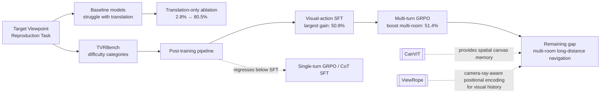

---
tags:
- paper
- domain/3d_perception
- domain/embodied_ai
- domain/multimodal_perception
- domain/reinforcement_learning
- domain/vla
- impact/solid
- method/benchmark
- method/foundation_model
- method/reinforcement_learning
- method/simulation
- review/auto_tagged
- status/unread
- task/navigation
- task/scene_understanding
- type/benchmark
aliases:
- 'Where to Look: Can Foundation Models Reach a Target Viewpoint Through Active Exploration?'
- Target Viewpoint Reproduction
- TVR task
- Active viewpoint matching
- Foundation models spatial reasoning
- Perception-action loop
- Active 3D exploration
- Viewpoint reproduction
- Spatial reasoning bottleneck
paper_id: arxiv:2606.01247
arxiv_id: '2606.01247'
url: https://huggingface.co/papers/2606.01247
pdf_url: https://arxiv.org/pdf/2606.01247.pdf
local_pdf: '[[Where to Look Can Foundation Models Reach a Target Viewpoint Through
  Active Exploration.pdf]]'
github: https://github.com/aim-uofa/TVRBench
project_page: None
institutions:
- Zhejiang University
publication_date: '2026-06-02'
score: '7.9'
domains:
- 3d_perception
- embodied_ai
- multimodal_perception
- reinforcement_learning
- vla
methods:
- benchmark
- foundation_model
- reinforcement_learning
- simulation
tasks:
- navigation
- scene_understanding
paper_type: benchmark
impact_band: solid
reading_status: unread
priority_score: 79
review_status: auto_tagged
next_action: inspect_protocol
year: 2026
metadata_publication_date: '2026-05-31'
---

# Where to Look: Can Foundation Models Reach a Target Viewpoint Through Active Exploration?

## 📌 Abstract
Humans can reproduce the viewpoint specified by a target image through active head and body motion, yet spatial intelligence in foundation models has largely been studied as passive understanding of pre-collected observations. We introduce Target Viewpoint Reproduction (TVR) -- an active task where an agent adjusts its viewpoint in a 3D environment until its observation matches a given target image -- and TVRBench, an indoor-simulation benchmark spanning scene scale and target-view visual richness. TVR is far from solved: on the evaluation split, the strongest open-source and closed-source models reach only 7.8% and 12.0% success. Fine-grained analysis identifies two consistent bottlenecks: off-the-shelf models struggle with multi-turn visual history, and performance drops sharply when viewpoint reproduction requires body translation rather than in-place rotation, exposing a gap in mapping spatial discrepancies to embodied movement. To study reducing this gap, we build a unified TVR post-training framework covering expert-trajectory SFT, rationale-supervised CoT-SFT, offline Single-turn GRPO, and on-policy Multi-turn GRPO from live simulator rollouts. Visual-action SFT supplies the main gain, raising a 9B open-source model to 50.8% success; Multi-turn GRPO provides targeted multi-room refinement and reaches 51.4% overall, while CoT supervision and Single-turn GRPO degrade closed-loop performance. These results establish TVRBench as a testbed for measuring and training foundation models that actively perceive and act in 3D environments. Our code, data, and models are available at https://github.com/aim-uofa/TVRBench.

## 🖼️ Architecture
![[Where to Look Can Foundation Models Reach a Target Viewpoint Through Active Exploration_arch.png]]

## 🧠 AI Analysis
## Abstract
Where to Look: Can Foundation Models Reach a Target Viewpoint Through Active Exploration?  
Liyang Li*, Muzhi Zhu*, Zhiyue Zhao, Hengyu Zhao, Ke Liu, Linhao Zhong, Hao Chen, Chunhua Shen†  
Zhejiang University  
*Equal contribution †Corresponding author  

Humans can reproduce the viewpoint specified by a target image through active head and body motion, yet spatial intelligence in foundation models has largely been studied as passive understanding of pre-collected observations. We introduce Target Viewpoint Reproduction (TVR)—an active task where an agent adjusts its viewpoint in a 3D environment until its observation matches a given target image—and TVRBench, an indoor-simulation benchmark spanning scene scale and target-view visual richness. TVR is far from solved: on the evaluation split, the strongest open-source and closed-source models reach only 7.8% and 12.0% success. Fine-grained analysis identifies two consistent bottlenecks: off-the-shelf models struggle with multi-turn visual history, and performance drops sharply when viewpoint reproduction requires body translation rather than in-place rotation, exposing a gap in mapping spatial discrepancies to embodied movement. To study reducing this gap, we build a unified TVR post-training framework covering expert-trajectory SFT, rationale-supervised CoT-SFT, offline Single-turn GRPO, and on-policy Multi-turn GRPO from live simulator rollouts. Visual-action SFT supplies the main gain, raising a 9B open-source model to 50.8% success; Multi-turn GRPO provides targeted multi-room refinement and reaches 51.4% overall, while CoT supervision and Single-turn GRPO degrade closed-loop performance. These results establish TVRBench as a testbed for measuring and training foundation models that actively perceive and act in 3D environments. Our code, data, and models are available at https://github.com/aim-uofa/TVRBench.

## 1. Core Snapshot

### Problem Statement
Foundation models can describe what they see in a static image, but they cannot reliably translate an observed viewpoint difference into a plan of body and head movements. The core challenge is not *visual matching*—recognising that the current view differs from the target view. Instead, the ==*primary bottleneck lies in mapping spatial discrepancies to embodied translation*==: models tend to rotate in place or walk in small circles rather than advance toward distant locations when the required move exceeds a local adjustment.

At each step the agent receives its current first‑person RGB image together with the fixed target image. It must produce a sequence of discrete actions—forward or sideways translation, body rotation, head pitch change, or stop—until its final pose equals the target pose on a shared $0.25\,\text{m}$ grid. Success is defined by =="exact pose match"= rather than reaching a general area, which forces the agent to reproduce the precise viewpoint instead of merely arriving near the goal.

A controlled ablation in the paper removes all body‑translation actions, leaving only rotation and head movement. Under this reduced action space a $9\,\text{B}$ open‑source model jumps from $2.8\%$ to $80.5\%$ success, demonstrating that translation mapping is the dominant failure mode—not visual recognition. The narrow focus on exact viewpoint reproduction therefore isolates the perception‑to‑action gap more sharply than standard navigation benchmarks, where reaching a region is sufficient.

> [!warning] The difficulty is not about seeing the target; it’s about converting that visual knowledge into a sequence of steps that move the agent to the right viewpoint.

### Core Contribution
The paper introduces the TVR task together with TVRBench, a diagnostic indoor‑simulation benchmark that cross‑categorises tasks by **scene scale** (single‑room vs. multi‑room) and **target‑view visual richness** (object‑rich vs. sparse). The success criterion demands exact final‑pose match, which makes translation errors directly measurable.

On top of the benchmark the authors build a unified post‑training pipeline that compares four supervision strategies: expert‑trajectory supervised fine‑tuning (SFT), chain‑of‑thought supervised fine‑tuning (CoT‑SFT), offline single‑turn group‑relative policy optimisation (GRPO), and on‑policy multi‑turn GRPO from live simulator rollouts. The concrete claim is that =="visual‑action SFT supplies the main gain"= (raising a $9\,\text{B}$ model from $2.8\%$ to $50.8\%$ on the held‑out split), while multi‑turn GRPO provides a targeted lift on harder multi‑room tasks, pushing overall success to $51.4\%$. CoT supervision and single‑turn GRPO, in contrast, degrade closed‑loop performance.

### Innovation Origin & Rationale
Almost all prior spatial‑intelligence benchmarks supply observations that are pre‑collected, not acquired through active exploration. Even ImageNav, which uses a goal image, measures proximity to a target region rather than exact viewpoint match. The authors therefore take the image‑goal idea and tighten the metric to require identical poses. This choice is reasonable because the translation ablation (mentioned above) directly validates that the new metric isolates movement mapping rather than mere visual recognition. The design thus provides a controlled test of the closed perception–action loop without confounding factors such as language instruction understanding.

## 2. Reading Map
The paper sits at the intersection of embodied spatial reasoning and vision‑language model post‑training. Researchers working on active vision, visual navigation, or reinforcement learning for multimodal agents will benefit most from a full read.

- **First pass:** the abstract and Section 4 (foundation‑model baselines) together with its tables. They quantify the performance gap and identify the two bottlenecks.
- **Second, detailed pass:** Section 5 (post‑training) and its table. The training ablations there reveal which supervision signals actually transfer to closed‑loop control—the single‑turn and CoT degradations are especially instructive.
- **Figures to study closely:** Figure 3 (failure modes and translation ablation) and Figure 4 (post‑training data flow).
- **Skim on first reading:** the related‑work section once the distinction from ImageNav is clear.
- **Read early:** the limitations paragraph at the end, to keep expectations about real‑world transfer realistic.

> [!note] The key takeaway for a reader is the asymmetry: SFT gives the largest boost, while single‑turn RL that ignores trajectory context harms performance.

## 3. Method Walkthrough

### Inputs, Outputs, And Assumptions
The agent receives two fixed inputs at every timestep: the target RGB image $I^\star$ rendered from the goal pose, and the current first‑person RGB image $I_t$. It must select one action from a discrete set of nine: move forward/backward, move left/right, rotate body left/right, rotate head up/down, or stop. An episode terminates when the agent issues `Stop` or when a step budget is exhausted ($30$ steps in single‑room scenes, $40$ steps in multi‑room scenes).

The central assumption is that all poses lie on a discrete $0.25\,\text{m}$ grid. This makes exact pose matching possible and eliminates ambiguity that would arise from continuous coordinates or tolerance‑based success criteria. The design keeps evaluation clean inside simulation, but it also means that the benchmark does not test robustness to motor noise or real‑world observation imperfections.

### Pipeline From Data To Prediction
1. **Expert trajectory generation:** A rule‑based shortest‑path planner on the reachable grid produces successful trajectories, filtering by visible‑object count to ensure trajectory quality. The trajectories are stored either as action‑only summaries or as full visual‑action sequences.
2. **Supervised fine‑tuning (SFT):** The model is trained to predict the expert action at each step, given the current view, the target view, and a memory of past steps. Two memory formats are compared: action‑only memory (a compressed action recap) and visual‑action memory (the full observation–action history). For chain‑of‑thought variants, an external model annotates intermediate rationale text before the SFT objective is applied.
3. **Post‑SFT reinforcement learning:** After SFT, the model can be further trained with GRPO. Two variants exist:
   - **Single‑turn GRPO:** Optimisation on static single‑step prompts with an action‑matching reward.
   - **Multi‑turn GRPO:** Optimisation over live simulator rollouts that accumulate per‑step and terminal rewards, while a KL penalty keeps the policy close to the SFT checkpoint.
4. **Evaluation:** The final policy is evaluated zero‑shot on a held‑out split with the same step budgets and memory format used during training.

### Key Design Choices
The decision to use **visual‑action memory** rather than action‑only memory preserves the full observation history. Ablations show that off‑the‑shelf models perform *worse* with visual‑action memory (a gap of $+3.8$ percentage points on average), but after SFT the model learns to exploit its own past images to update spatial belief and avoid repeating poses. Without full visual history the policy cannot correct drift across steps.

The choice of **multi‑turn GRPO over single‑turn GRPO** follows from the closed‑loop nature of TVR. Single‑turn GRPO only matches expert actions on static prompts; it does not penalise the long‑term consequences of, for example, repeatedly choosing a safe rotation that does not advance the agent. Multi‑turn GRPO evaluates whole trajectories and is therefore aligned with the task’s requirement of sustained, goal‑directed movement.

## 4. Core Theory And Formulas

The paper does not present a single unifying mathematical theory; instead it compares several training objectives whose effectiveness is measured by the downstream success rate.

### Main Objective
The practical objective is to maximise the fraction of episodes in which the agent issues `Stop` at a pose identical to the target pose. This success rate is reported overall and stratified by scene difficulty.

### Important Equations
For supervised fine‑tuning, the model is trained to maximise the likelihood of the expert action $a_t$ at each step. The loss over a trajectory of length $T$ is the average negative log‑likelihood:

$$
\mathcal{L}_{\text{SFT}} = -\frac{1}{T} \sum_{t=1}^{T} \log \pi_\theta \bigl(a_t \mid I_t,\, I^\star,\, \text{mem}_t \bigr).
$$

Here $\pi_\theta$ is the policy (the language model), $I_t$ is the current observation, $I^\star$ the target image, and $\text{mem}_t$ summarises the history up to step $t$ (either action‑only or visual‑action). Minimising this loss pushes the model to imitate the expert’s mapping from perceived discrepancy to movement command.

For multi‑turn GRPO, the objective is to maximise expected trajectory reward while staying close to the supervised policy $\pi_{\text{ref}}$:

$$
\mathcal{L}_{\text{GRPO}} = \mathbb{E}_{\tau \sim \pi_\theta} \Bigl[ R(\tau) - \beta \, D_{\text{KL}}\bigl( \pi_\theta \| \pi_{\text{ref}} \bigr) \Bigr].
$$

The trajectory $\tau$ is a full rollout until terminal action or step limit. $R(\tau)$ combines per‑step progress rewards and a terminal success reward; the KL penalty with coefficient $\beta$ prevents the policy from forgetting the SFT prior. Optimising this objective rewards policies that reliably complete whole episodes, not just individual correct steps.

### Algorithmic Intuition
SFT first forces the model to learn the action‑token vocabulary and basic association between viewpoint gap and movement. The multi‑turn GRPO then behaves like a *trajectory‑level finetuning*: it compares several full rollouts (the “group” in GRPO), favours those that end closer to the goal, and suppresses those that loop or stop prematurely. The single‑turn variant fails because it optimises for immediate action correctness without any signal about whether the action ultimately leads the agent to the target. This explains why single‑turn GRPO can *regress* below its SFT initialisation—it drifts toward a policy that looks good on isolated frames but sabotages multi‑step progress.

> [!note] The crucial mathematical distinction is that SFT models per‑step conditional probabilities, while multi‑turn GRPO models per‑trajectory returns.

## 5. Architecture, Figures, And Implementation
The backbone for all post‑training experiments is the Qwen3.5‑9B model. No architectural modifications to the transformer or vision encoder are described beyond standard instruction tuning.

- **Figure 1** shows the closed‑loop cycle: current view, target view, reasoning/action selection, and the updated spatial memory.
- **Figure 2** illustrates representative start and target poses for the four difficulty categories (single‑room easy/hard, multi‑room easy/hard) together with the corresponding first‑person views.
- **Figure 3** documents the two dominant failure modes—circular walking and circular head scanning—along with action histograms and the translation ablation that dissociates body movement from rotation. The ablation is key: removing translation actions brings success from $2.8\%$ to $80.5\%$.
- **Figure 4** depicts the data flow for the four post‑training variants side by side, clarifying how expert trajectories, rationale annotation, and live rollouts feed into the respective losses.
- **Figure 5** provides an additional example of a goal viewpoint.

Implementation details (learning rates, batch sizes, exact GRPO group sizes) are deferred to the appendix and are =="not clear from the provided text"=. The released repository includes all code and pretrained checkpoints.

## 6. Experiments And Evidence
The main evaluation uses $500$ held‑out tasks evenly split across the four categories (single‑room easy/hard, multi‑room easy/hard). Success is measured by =="exact final‑pose match"= after the agent stops or hits the step limit.

**Off‑the‑shelf results (Table 1):** The strongest open‑source model reaches $7.8\%$ success, the strongest closed‑source model $12.0\%$. Every open‑source model performs better with action‑only memory than with full visual‑action memory, by an average margin of $+3.8$ percentage points. This indicates that untuned models cannot exploit multi‑turn visual history and are instead confused by it.

**Translation ablation:** When body‑translation actions are removed (only rotation and head tilt allowed), a $9\,\text{B}$ model jumps from $2.8\%$ to $80.5\%$, confirming that =="mapping spatial discrepancies to body translation is the dominant failure mode"=.

**Post‑training results (Table 2):** Visual‑action SFT without chain‑of‑thought raises a $9\,\text{B}$ model to $50.8\%$ overall—the largest gain. Adding multi‑turn GRPO further lifts multi‑room performance (e.g., $+7.2$ points on the easy split) while preserving single‑room accuracy, reaching $51.4\%$ overall. In contrast, single‑turn GRPO and CoT‑SFT both reduce closed‑loop success below the SFT baseline. Human performance on a $100$‑task subset is $93.0\%$, emphasising the large remaining gap.

> [!warning] The evidence is limited to one $9\,\text{B}$ backbone and simulated discrete‑grid environments. Whether these training gains transfer to other model families or to continuous real‑world settings remains an open question.

## 7. Strengths, Limitations, And Failure Cases
A clear strength is the diagnostic benchmark that separates scene scale from target‑view richness and directly measures pose‑match accuracy. The translation‑only ablation provides concrete evidence for the perception‑to‑action gap, rather than relying on anecdotal failure stories.

Several limitations should be kept in mind:
- The entire study is **simulation‑only** and operates on a **discrete pose grid**. This removes continuous motor noise and real‑world observation imperfections, so the results cannot be directly extrapolated to physical robots.
- Post‑training is tested on **only one model family** (Qwen3.5‑9B); it is not known whether the same ranking of SFT > Multi‑turn GRPO > Single‑turn GRPO holds for other backbones.
- The evaluation **does not compare against specialised navigation baselines** that might already handle translation better.

Despite large supervised gains, two failure modes persist: repetitive local orbits (the agent walks in small circles) and premature stopping at incorrect poses. These are particularly pronounced on multi‑room tasks where long‑range spatial update is required. Multi‑turn GRPO partially mitigates the multi‑room failures but does not eliminate them, suggesting that current training signals are still insufficient for robust long‑distance viewpoint reproduction.

## 8. Reproduction Notes
The code, expert trajectories, evaluation split, and trained checkpoints are available at the GitHub repository listed in the abstract. Single‑room tasks run in AI2‑THOR, multi‑room tasks in ProcTHOR‑10k. Expert trajectories are generated by a rule‑based shortest‑path planner filtered by visible‑object count. SFT uses standard cross‑entropy on action tokens. GRPO uses both format and accuracy rewards. =="Not clear from the provided text"= are the precise learning‑rate schedule, the number of GRPO sample rollouts per group, and the exact weighting between per‑step progress and terminal success rewards. Evaluation follows the same step budgets and memory formats reported in Table 2.

## 9. What To Read Closely
Begin with the abstract and Section 4 to understand the baseline gap and the two identified bottlenecks. Next, examine Table 2 and the surrounding paragraphs in Section 5—these contain the main training ablations and show why multi‑turn RL helps only on the harder splits. Figure 3 should be studied together with its caption to internalise the circular‑behaviour failure modes. The limitations paragraph at the end can be read immediately after the results so that expectations about real‑world transfer remain realistic. The related‑work section can be skimmed once the distinction from ImageNav is grasped.

## 10. Research Ideas And Open Questions
1. **Finer discretisation or continuous control:** The current $0.25\,\text{m}$ grid guarantees that exact pose recovery is possible, but it masks the challenge of stopping at the right moment. A one‑week experiment would be to subsample existing trajectories at half the translation step size, retrain the $9\,\text{B}$ model with the same visual‑action SFT objective, and measure success under the same stop criterion. The risk is that smaller steps make pose errors harder to distinguish, causing the agent never to stop.
2. **Effect of memory type after RL:** The performance drop from visual‑action memory to action‑only memory is large in off‑the‑shelf models and remains after SFT. Would multi‑turn GRPO erase that gap? A straightforward experiment would be to train a second multi‑turn policy that is forced to use action‑only memory and compare its multi‑room success and final‑pose error distribution against the current visual‑action multi‑turn checkpoint.
3. **Self‑generated CoT rationales:** CoT‑SFT with externally generated rationales degraded performance. But what if the rationales are produced by the *post‑SFT* model itself? A small experiment would be to annotate a subset of the expert trajectories using the fine‑tuned $9\,\text{B}$ model, mix those self‑generated rationales into a second supervised stage, and check whether overall success exceeds the $50.8\%$ baseline. The risk is that self‑generated rationales simply echo the model’s existing action distribution without adding novel spatial‑mapping cues.

> [!question] Open question: Can trajectory‑level credit assignment be improved without full simulator rollouts, perhaps through offline replay of successful and failed trajectories?

## Knowledge Graph & Connections

### Related Work Connections

**[[CanViT]] (Active-Vision Foundation Models)**  
Both papers share the ambition of building foundation models that actively perceive the world through sequential observations rather than passively consuming a single pre‑collected input. CanViT proposes a dedicated active‑vision backbone: a retinotopic ViT that writes into a spatiotopic canvas via Canvas Attention, separating *thinking* (glimpse processing) from *memory* (scene‑wide latent workspace). TVR, in contrast, simply repurposes a generic vision‑language model (Qwen3.5‑9B) and learns active behaviour entirely through post‑training on expert trajectories. The architectural difference implies that TVR’s policy lacks a geometrically grounded spatial memory; it relies on the transformer’s generic context window to store past observations. This makes TVR’s policy susceptible to the circular‑walking and premature‑stopping failures, whereas CanViT’s canvas could, in principle, maintain a persistent world‑centred representation and reason explicitly about visited locations. The practical question is whether injecting a CanViT‑style memory module into the TVR pipeline would close the remaining gap, especially on multi‑room tasks that demand long‑range spatial consistency.

**[[GeometryAware Rotary Position Embedding for Consistent Video World Model]] (ViewRope)**  
ViewRope targets exactly the kind of geometric drift that plagues multi‑step visual history in TVR. While ViewRope was developed for video world models that simulate future frames under camera control, the underlying problem—maintaining 3D consistency across frames with a model that otherwise relies on screen‑space positional embeddings—is directly relevant to TVR’s visual‑action memory. The TVR agent must look back at earlier observations to decide whether its current pose is new or previously visited; standard RoPE encodes image tokens by sequence order, not by camera geometry, so the transformer cannot easily recognize that two views correspond to nearby poses. ViewRope’s geometry‑aware encoding, which injects camera‑ray directions into attention, could serve as a drop‑in replacement for the current positional encoding in the TVR policy, potentially boosting the model’s ability to exploit its own visual history. A cross‑paper hypothesis is that after such an encoding, the offline SFT policy would need less multi‑turn RL to achieve the same success rate.

*The remaining note, [[Generated Reality]], focuses on interactive video generation for extended reality and conditions on tracked body poses; while it addresses viewpoint control, its core concern is photorealism and dexterous hand manipulation, not the closed‑loop perception‑to‑action mapping that TVR isolates. A connection would therefore be forced, and I do not explore it here.*

### Concept Map

- Solid arrows show the core experimental flow of the paper.
- Dashed arrows indicate open connections: CanViT’s canvas and ViewRope’s geometry‑aware attention could address the persistent failure modes in multi‑turn visual reasoning that remain after SFT and multi‑turn GRPO.

### Questions For Future Reading

1. **Can spatially grounded memory architectures (e.g., CanViT’s canvas or a 3D‑aware neural field) be retrofitted to existing VLMs without full retraining, and would such a retrofit improve translation‑mapping success as much as SFT?**  
   *Why it matters:* The paper shows that SFT gives the biggest gain, but this might simply reflect that the model needs a better internal world representation, not necessarily more trajectory data. If a lightweight memory module or position encoding could substitute for millions of expert steps, it would suggest that much of the perception‑to‑action gap is architectural rather than data‑limited. Concrete evidence would be an experiment where the Qwen3.5‑9B model is augmented with a ViewRope‑style encoding and fine‑tuned on the *same* SFT dataset; if success jumps to, say, 70% without multi‑turn RL, the conclusion would be that current VLMs are missing geometric inductive biases.

2. **What aspect of multi‑turn GRPO is critical—the KL penalty that preserves SFT knowledge, or the trajectory‑level reward signal itself?**  
   *Why it matters:* Single‑turn GRPO harmed performance, while multi‑turn GRPO helped (modestly). The multi‑turn variant includes both a trajectory reward and a KL penalty towards the SFT policy. If the sole benefit comes from preventing catastrophic forgetting (i.e., even a simple behaviour‑cloning regulariser would work), then the value of on‑policy RL for this task is questionable; the community could instead rely on larger SFT corpora. Evidence would come from an ablation that trains a policy with the same per‑step SFT loss plus an additional term that penalises deviation from the original SFT distribution (e.g., a distillation loss) without any online rollout. If that matches multi‑turn GRPO’s performance, then the RL component is not the driver.

3. **Does the translation difficulty primarily stem from long‑range metric depth estimation (how far away is the target?) or from path planning (which sequence of turns and forward moves closes the gap)?**  
   *Why it matters:* The paper demonstrates that rotation is easy and translation is hard, but it does not disentangle *sensing the distance* from *synthesising a plan*. If depth estimation is the bottleneck, then providing the model with a depth map or point cloud (or even a simple disparity signal) might drastically improve success. If instead the bottleneck is planning, then even perfect depth would leave the agent struggling to chain actions over many steps. A future paper could answer this by training a TVR policy that receives an additional input (e.g., a top‑down map of the room with start and goal positions) and measuring whether the translation‑mapping gap closes. If it does, the community’s effort should shift toward better depth sensing; if not, the focus should be on trajectory planning algorithms integrated with LLMs.

---
*Analysis by PaperBrain (x-ai/grok-4.3; refinement: deepseek/deepseek-v4-pro)*

## 📂 Resources
- **Local PDF**: [[Where to Look Can Foundation Models Reach a Target Viewpoint Through Active Exploration.pdf]]
- [Online PDF](https://arxiv.org/pdf/2606.01247.pdf)
- [ArXiv Link](https://huggingface.co/papers/2606.01247)

## Related Work Updates
- [ ] **2026-06-03**: New paper [[QwenVLA Unified VLA for Manipulation and Navigation]] discusses *foundation models spatial reasoning*. Innovation: "Unifies manipulation, navigation, and trajectory prediction into a single VLA model using embodiment-aware prompts and a DiT-based action decoder."
- [ ] **2026-06-03**: New paper [[GEM Generative Supervision for Embodied VLM]] discusses *foundation models spatial reasoning*. Innovation: "Integrating depth map generation as an auxiliary generative supervision task during VLM pre-training to enhance spatial and physical reasoning for embodied tasks."
- [ ] **2026-06-04**: New paper [[AffordVLA]] discusses *foundation models spatial reasoning*. Innovation: "Internalizing task-conditioned affordance as learnable tokens that decode masks and directly condition action generation in a tightly coupled VLA framework."
- [ ] **2026-06-05**: New paper [[OVOSBench]] discusses *foundation models spatial reasoning*. Innovation: "First hierarchical streaming benchmark for spatial intelligence with human-annotated questions across four levels of abstraction."
- [ ] **2026-06-06**: New paper [[WLA]] discusses *foundation models spatial reasoning*. Innovation: "Proposes a unified autoregressive model that predicts both high-level textual subtasks and low-level physical dynamics to guide action synthesis, enabling optional world prediction for test-time scaling."
- [ ] **2026-06-09**: New paper [[ARVLA]] discusses *foundation models spatial reasoning*. Innovation: "Introduces a standalone autoregressive action expert with persistent memory and a re-anchoring mechanism that mathematically accounts for perception staleness, enabling asynchronous vision-language conditioning and continuous context-aware action generation."
- [ ] **2026-06-12**: New paper [[EmbodiedR15]] discusses *foundation models spatial reasoning*. Innovation: "A unified Embodied Foundation Model with integrated reasoning, planning, and self-correction, trained with multi-task balanced RL and automated data pipelines, achieving strong zero-shot real-robot performance."
- [ ] **2026-06-18**: New paper [[OneCanvas]] discusses *foundation models spatial reasoning*. Innovation: "A panoramic canvas that reprojects multi-view patch features into a continuous angular coordinate system with 3D position embeddings, enabling a frozen VLM to reason spatially without specialized geometry encoders."
- [ ] **2026-07-22**: New paper [[Appleπ]] discusses *foundation models spatial reasoning*. Innovation: "Introduces the first benchmark that evaluates video models as world models through a three-stage law-grounded reasoning protocol (Perception, Formulation, Deduction) with hybrid physics-law and MLLM metrics."