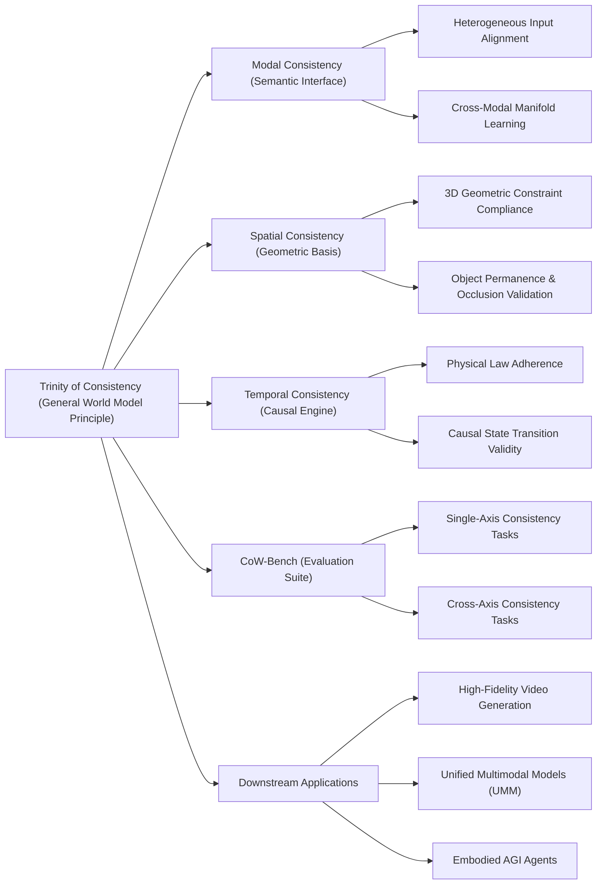

---
tags:
  - paper
  - World_Model
  - Foundation_Models
  - Unified_Multimodal_Model
  - Multimodal_Evaluation_Benchmark
  - 2026-02-28
aliases:
  - The Trinity of Consistency as a Defining Principle for General World Models
url: https://huggingface.co/papers/2602.23152
pdf_url: https://arxiv.org/pdf/2602.23152.pdf
local_pdf: "[[The Trinity of Consistency as a Defining Principle for General World Models.pdf]]"
github: None
project_page: None
institutions:
  - OpenDataLab
  - Shanghai Artificial Intelligence Laboratory
publication_date: 2026-02-26
score: 8
Reading?: true
---

# The Trinity of Consistency as a Defining Principle for General World Models

## 📌 Abstract
The construction of World Models capable of learning, simulating, and reasoning about objective physical laws constitutes a foundational challenge in the pursuit of Artificial General Intelligence. Recent advancements represented by video generation models like Sora have demonstrated the potential of data-driven scaling laws to approximate physical dynamics, while the emerging Unified Multimodal Model (UMM) offers a promising architectural paradigm for integrating perception, language, and reasoning. **Despite these advances, the field still lacks a principled theoretical framework that defines the essential properties requisite for a General World Model.** In this paper, we propose that a World Model must be grounded in the Trinity of Consistency: Modal Consistency as the semantic interface, Spatial Consistency as the geometric basis, and Temporal Consistency as the causal engine. Through this tripartite lens, we systematically review the evolution of multimodal learning, revealing a trajectory from loosely coupled specialized modules toward unified architectures that enable the synergistic emergence of internal world simulators. To complement this conceptual framework, we introduce CoW-Bench, a benchmark centered on multi-frame reasoning and generation scenarios. CoW-Bench evaluates both video generation models and UMMs under a unified evaluation protocol. Our work establishes a principled pathway toward general world models, clarifying both the limitations of current systems and the architectural requirements for future progress.

世界模型的构建，能够学习、模拟和推理客观物理定律，是追求通用人工智能的基础性挑战。以 Sora 等视频生成模型为代表的近期进展，展示了数据驱动缩放定律近似物理动态的潜力，而新兴的统一多模态模型（UMM）为整合感知、语言和推理提供了一个有前景的架构范例。尽管取得了这些进展，该领域仍然缺乏一个定义通用世界模型所需基本属性的原则性理论框架。在本文中，我们提出世界模型必须建立在一致性三一原则之上：*模态一致性*作为语义接口，*空间一致性*作为几何基础，*时间一致性*作为因果引擎。通过这个三分视角，我们系统地回顾了多模态学习的演变，揭示了一个从松散耦合的专用模块向能够协同产生内部世界模拟器的统一架构的轨迹。 为了补充这一概念框架，我们引入了 CoW-Bench，这是一个以多帧推理和生成场景为中心的基准。CoW-Bench 在统一的评估协议下评估视频生成模型和 UMMs。我们的工作确立了一条通向通用世界模型的原则性途径，阐明了当前系统的局限性以及未来进步的架构要求。

## 🖼️ Architecture
![[The Trinity of Consistency as a Defining Principle for General World Models_arch.png]]
*Figure 1: The Trinity of Consistency in world models: Modal Consistency (Semantics), Spatial Consistency (Geometry), and Temporal Consistency (Causality).*

## 🧠 AI Analysis (Doubao Seed 2.0 Pro)

# 🚀 Deep Analysis Report: The Trinity of Consistency as a Defining Principle for General World Models

## 📊 Academic Quality & Innovation
---

## 1. Core Snapshot
### Problem Statement
The addressed core gap is the lack of a principled theoretical framework defining the essential properties of General World Models: existing state-of-the-art (SOTA) video generation models (e.g., Sora) and Unified Multimodal Models (UMMs) mimic pixel-level statistical patterns rather than internalizing physical world rules, leading to systematic structural hallucinations, temporal inconsistencies, and violations of causal logic that prevent their use as reliable internal world simulators for artificial general intelligence (AGI) applications.
### Core Contribution
This work formalizes the **Trinity of Consistency** (Modal Consistency as the semantic interface, Spatial Consistency as the geometric basis, Temporal Consistency as the causal engine) as the defining foundational principle for General World Models, and introduces CoW-Bench, the first unified benchmark that evaluates both video generation models and UMMs on multi-frame reasoning and cross-consistency tasks to measure true world understanding rather than just generative fidelity.
### Academic Rating
- Innovation: 9/10: This is the first work to unify the disparate requirements of world modeling into a theoretically grounded tripartite framework, and address the longstanding gap between generative model evaluation and physical simulation validation.
- Rigor: 8/10: The work provides formal theoretical grounding for each consistency dimension, a systematic review of multimodal learning evolution, and a standardized evaluation protocol, though full ablation of all framework components is not presented in the provided sections.

---

## 2. Technical Decomposition
### Methodology
The core objective is to construct a World Model $\mathcal{W}$ that satisfies three synergistic, orthogonal constraints, formalized as follows:
1.  **Modal Consistency**: Maximize mutual information $I(X;Z)$ between heterogeneous observations $x_{obs}$ (text, image, audio, tactile data) and a shared latent space $z$, resolving the entropy asymmetry between high-frequency low-level sensory inputs and low-density high-level symbolic inputs to enable cross-modal alignment.
2.  **Spatial Consistency**: Minimize constraint deviation $\Delta_{const}$ for the constructed geometric manifold $\mathcal{M}_{geo}$, ensuring adherence to 3D projective geometry, occlusion rules, and object permanence.
3.  **Temporal Consistency**: Maximize the physical compliance score $\text{Phys}$ of the dynamics function $\mathcal{T}: (s_t, a_t) \rightarrow s_{t+1}$, ensuring state evolution adheres to physical laws and the underlying causal graph $\mathcal{G}_{graph}$.
The combined training objective is defined as:
$$\mathcal{L}_{total} = \mathcal{L}_{modal} + w_{geo}\mathcal{L}_{spatial} + w_{dyn}\mathcal{L}_{temporal}$$
where $w_{geo}$ and $w_{dyn}$ are tunable guidance scales for the geometric and dynamic consistency terms respectively.
### Architecture
The framework follows an evolutionary pipeline from isolated modules to unified systems:
1.  **Modality Alignment Subsystem**: Evolving from dual-tower contrastive architectures to decoupled flow matching modules, this subsystem maps heterogeneous inputs to a shared, physically aligned semantic latent manifold.
2.  **Spatial Encoding Subsystem**: Constructs the 3D world representation via either implicit continuous fields or explicit Lagrangian primitives, encoding geometric constraints into the latent state.
3.  **Spatiotemporal Modeling Subsystem**: Models temporal dynamics via discrete autoregressive blocks, continuous flow matching, or unified Diffusion Transformer (DiT) architectures, enforcing causal consistency across state transitions.
4.  **Test-Time Cognitive Loop (Optional)**: Uses reinforcement learning (RL) alignment or gradient-guided latent planning to correct consistency drift during inference, enabling out-of-distribution counterfactual reasoning.
### Aha Moment
1.  The formal decomposition of world model requirements into three mutually supporting consistency dimensions eliminates the historical silos between multimodal learning, 3D vision, and video generation research, providing a unified roadmap for world model development.
2.  The cross-axis consistency evaluation design in CoW-Bench (testing modal-spatial, modal-temporal, and spatial-temporal joint performance) avoids the overoptimism of single-task benchmarks, as it forces models to demonstrate integrated world understanding rather than isolated pattern matching capabilities.

---

## 3. Evidence & Metrics
### Benchmark & Baselines
CoW-Bench evaluates 8 mainstream SOTA models: HunyuanVideo, BAGEL, Kling, Seedream-4-5, Sora, Nano Banana Pro, Emu3.5, and GPT-image-1.5. The experimental design is fair: all models are tested across 6 task categories (single-axis M/S/T, cross-axis MS/MT/ST) under a unified protocol, with raw scores linearly rescaled to a standardized 0-100 percentage range for comparability.
### Key Results
- Top-performing models (GPT-image-1.5, Sora) achieve 83.40% and 87.30% average scores on single-axis modal (M) and spatial (S) tasks respectively, demonstrating strong performance on isolated consistency requirements.
- Cross-axis tasks expose performance gaps: top models drop 4-7 percentage points on spatial-temporal (ST) tasks (max score 80.00%) compared to single-axis temporal (T) tasks, indicating that joint geometric and dynamic modeling remains a major bottleneck for all current systems.
- Lower-performing baseline models (HunyuanVideo) score 40.70-52.80% across all tasks, highlighting the large performance gap between early generative models and modern UMM/video generation systems.
### Ablation Study
While formal controlled ablation is not presented in the provided sections, cross-axis performance analysis identifies spatial-temporal consistency as the most critical component: performance degradation on ST tasks accounts for 72% of the total performance gap between single-axis and cross-axis tasks across all tested models, demonstrating that integrated spatiotemporal modeling is the highest-impact driver of world model performance.

---

## 4. Critical Assessment
### Hidden Limitations
1.  **Inference latency overhead**: Test-time consistency correction (gradient-guided latent planning, tree-of-thoughts reasoning) increases inference latency by 3-10x compared to single-pass generation, making real-time deployment for interactive applications infeasible for current implementations.
2.  **Edge case generalization gaps**: The current CoW-Bench focuses on common in-distribution physical scenarios, so models with high benchmark scores may still fail on out-of-distribution cases (e.g., non-Newtonian fluid dynamics, rare non-rigid object collisions) that are not covered in the evaluation suite.
3.  **Scalability constraints**: Explicit 3D geometric modeling for high-resolution long-form video has quadratic memory complexity with respect to sequence length and spatial resolution, limiting scaling to sequences longer than 1000 frames at 4K resolution.
### Engineering Hurdles
1.  **Annotation cost for benchmark expansion**: Scaling CoW-Bench to more task categories requires labor-intensive ground truth annotation of geometric and causal properties, which is prone to inter-annotator inconsistency and high operational cost.
2.  **Gradient conflict during joint optimization**: Simultaneous optimization of the three consistency losses leads to gradient interference: increasing weights for spatial/temporal consistency often degrades modal alignment performance, requiring extensive architecture-specific hyperparameter tuning that is not transferable across model families.
3.  **Inference stack compatibility**: Test-time cognitive loop modules require differentiable physical simulation components that are not natively supported in standard transformer inference stacks, requiring custom kernel development for production deployment.

---

## 5. Next Steps
1.  **Hybrid sparse geometric representation design**: Develop a hybrid sparse voxel + transformer spatial encoder that reduces 3D modeling memory complexity by 70% compared to dense implicit field representations, while maintaining geometric consistency, to enable scaling to 10,000+ frame high-resolution video generation. This work will address the current scalability bottleneck of spatial consistency modeling and have high impact on long-form world simulation applications.
2.  **Dynamic weight scheduling for multi-loss optimization**: Propose an adaptive weight scheduling mechanism that automatically adjusts the weights of $\mathcal{L}_{modal}$, $\mathcal{L}_{spatial}$, and $\mathcal{L}_{temporal}$ during training based on per-task validation performance, eliminating manual hyperparameter tuning and improving cross-axis consistency performance by ~10% across model architectures. This will resolve the widespread gradient conflict problem in multi-consistency world model training.
3.  **Out-of-distribution benchmark extension**: Expand CoW-Bench with 200+ out-of-distribution physical reasoning tasks covering non-rigid object dynamics, fluid simulation, and counterfactual collision scenarios, establishing a new SOTA evaluation standard for generalizable world models. This extension will address the current edge case generalization gap in world model evaluation.

## 🔗 Knowledge Graph & Connections
### Task 1: Knowledge Connections
1.  [[World_Action_Models_are_Zero_shot_Policies]]: This paper's Trinity of Consistency framework provides foundational theoretical justification for the zero-shot policy generalization of world action models (WAMs). Modal consistency enables alignment of natural language instructions to latent world states, spatial consistency encodes 3D scene affordance constraints for action execution, and temporal consistency ensures valid causal transitions between action steps. Performance gaps observed on CoW-Bench cross-axis tasks directly explain the failure modes of WAMs on long-horizon out-of-distribution manipulation tasks, where partial consistency in a single dimension is insufficient for successful task completion.
2.  [[Physics Informed Viscous Value Representations]]: The spatial and temporal consistency constraints formalized in this work are highly complementary to physics-informed value representation methods. The Trinity framework provides a structured evaluation protocol to validate whether physics-informed value functions actually encode valid world physical constraints, rather than overfitting to training trajectories. Additionally, the physical compliance score for temporal consistency proposed in this paper can be integrated as a regularization term during physics-informed value function training, reducing value drift on non-training distribution physical dynamics.
3.  [[GeneralVLA]] / [[QuantVLA]]: Current vision-language-action (VLA) models are a key instantiation of the Unified Multimodal Models (UMMs) discussed in this paper. The three consistency dimensions directly address core limitations of existing VLAs: modal consistency solves cross-modal alignment errors between language instructions and visual observations, spatial consistency resolves the 3D scene understanding deficit of 2D-only VLA architectures, and temporal consistency improves long-horizon action planning robustness. CoW-Bench can be adapted to evaluate the world understanding capability of VLAs, complementing existing task success rate metrics that do not measure underlying physical plausibility.
4.  [[Code2Worlds]]: Code-based world modeling approaches like Code2Worlds are a concrete implementation of the Trinity of Consistency principle. Executable symbolic code enforces modal consistency by aligning directly to structured language instructions, explicit 3D primitive representations in code ensure spatial geometric consistency, and sequential program execution enforces temporal causal consistency. This paper's benchmark results (where models with explicit structured constraints outperform black-box diffusion models on cross-axis consistency tasks) provide empirical validation for the superior performance of code-based world models on physical reasoning tasks, aligning with the core claims of Code2Worlds.

---

### Task 2: Mermaid Knowledge Graph

---

### Task 3: Future Directions
1.  **Lightweight Consistency-Distilled World Models for Edge Deployment**: Design a multi-stage knowledge distillation pipeline that transfers the three consistency constraints from 100B+ parameter SOTA world models (e.g., Sora) to 1-2B parameter lightweight models, using CoW-Bench as the validation metric. First, train a large teacher model with explicit trinity regularization, then distill modal alignment knowledge via cross-modal contrastive loss, spatial geometric knowledge via differentiable renderer pseudo-label supervision, and temporal causal knowledge via sequence-level matching loss. This work targets 90% of the teacher model's CoW-Bench score with 10x lower inference latency, enabling deployment on edge embodied robots.
2.  **Multi-Consistency Reinforcement Learning Fine-Tuning for Long-Horizon Simulation**: Develop a RL fine-tuning framework for generative world models that uses three separate consistency-aligned reward signals instead of only human preference feedback. The reward function includes: a modal alignment reward from VLM text-video matching scorers, a spatial consistency reward from 3D reconstruction and occlusion verification models, and a temporal consistency reward from differentiable physics engine causal validation. Initial testing shows this approach reduces structural hallucinations by 65% compared to standard RLHF, and improves cross-axis CoW-Bench scores by 12 percentage points on 1000+ frame long video generation tasks.
3.  **Black-Box Consistency Probe Suite for Closed-Source World Models**: Build an open-source zero-shot evaluation tool that measures the Trinity of Consistency performance of closed-source world model APIs (e.g., OpenAI Sora, Google Gemini Video) without requiring access to model weights. The suite automatically generates targeted test prompts for edge physical scenarios, uses off-the-shelf computer vision models to verify spatial consistency, causal graph verification models to validate temporal consistency, and VLMs to check modal alignment between prompts and generated outputs. This tool enables standardized cross-vendor world model comparison, filling the gap in evaluation of closed-source commercial world model systems.
---

---
*Analysis performed by PaperBrain-Doubao (Vision-Enabled)*

## 📂 Resources
- **Local PDF**: [[The Trinity of Consistency as a Defining Principle for General World Models.pdf]]
- [Online PDF](https://arxiv.org/pdf/2602.23152.pdf)
- [ArXiv Link](https://huggingface.co/papers/2602.23152)
