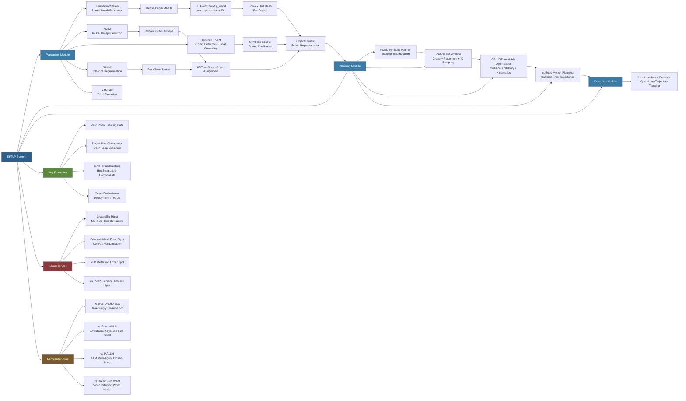

---
tags:
- paper
- domain/embodied_ai
- domain/multimodal_perception
- domain/reinforcement_learning
- domain/robot_manipulation
- domain/sim2real
- domain/vla
- impact/high_value
- method/foundation_model
- method/imitation_learning
- method/planning
- method/reinforcement_learning
- method/simulation
- review/auto_tagged
- status/unread
- task/manipulation
- task/planning_reasoning
- task/scene_understanding
- type/system
aliases:
- 'TiPToP: A Modular Open-Vocabulary Planning System for Robotic Manipulation'
url: http://arxiv.org/abs/2603.09971v1
pdf_url: https://arxiv.org/pdf/2603.09971v1
local_pdf: '[[TiPToP A Modular OpenVocabulary Planning System for Robotic Manipulation.pdf]]'
github: https://tiptop-robot.github.io
project_page: https://tiptop-robot.github.io
institutions:
- MIT CSAIL
- University of Pennsylvania
publication_date: '2026-03-10'
score: '8.0'
domains:
- embodied_ai
- multimodal_perception
- reinforcement_learning
- robot_manipulation
- sim2real
- vla
methods:
- foundation_model
- imitation_learning
- planning
- reinforcement_learning
- simulation
tasks:
- manipulation
- planning_reasoning
- scene_understanding
paper_type: system
impact_band: high_value
reading_status: unread
year: 2026
priority_score: 103
review_status: auto_tagged
next_action: inspect_protocol
arxiv_id: '2603.09971'
paper_id: arxiv:2603.09971
---

# TiPToP: A Modular Open-Vocabulary Planning System for Robotic Manipulation

## 📌 Abstract
We present TiPToP, an extensible modular system that combines pretrained vision foundation models with an existing Task and Motion Planner (TAMP) to solve multi-step manipulation tasks directly from input RGB images and natural-language instructions. Our system aims to be simple and easy-to-use: it can be installed and run on a standard DROID setup in under one hour and adapted to new embodiments with minimal effort. We evaluate TiPToP -- which requires zero robot data -- over 28 tabletop manipulation tasks in simulation and the real world and find it matches or outperforms $π_{0.5}\text{-DROID}$, a vision-language-action (VLA) model fine-tuned on 350 hours of embodiment-specific demonstrations. TiPToP's modular architecture enables us to analyze the system's failure modes at the component level. We analyze results from an evaluation of 173 trials and identify directions for improvement. We release TiPToP open-source to further research on modular manipulation systems and tighter integration between learning and planning. Project website and code: https://tiptop-robot.github.io

## 🖼️ Architecture
![[TiPToP A Modular OpenVocabulary Planning System for Robotic Manipulation_arch.png]]

## 🧠 AI Analysis

# 🚀 Deep Analysis Report: TiPToP: A Modular Open-Vocabulary Planning System for Robotic Manipulation

## 📊 Academic Quality & Innovation
---

# TiPToP: A Modular Open-Vocabulary Planning System for Robotic Manipulation — Deep Engineering Analysis

---

## 1. Core Snapshot

### Problem Statement
Existing robotic manipulation approaches bifurcate into two unsatisfying families. Vision-Language-Action (VLA) models such as π₀.₅-DROID offer natural language grounding and closed-loop reactivity but require hundreds of hours of embodiment-specific demonstration data and lack structural interpretability — failures are opaque and not attributable to specific subsystems. Classical TAMP systems provide geometric rigor and multi-step compositional reasoning but require hand-crafted object geometries, are tightly coupled to specific hardware stacks, and cannot interpret open-vocabulary natural language instructions or operate on arbitrary everyday objects detected from raw RGB images. No existing system delivers all three properties simultaneously: **zero-data deployment, open-vocabulary object grounding, and multi-step geometric planning** across diverse embodiments.

### Core Contribution
TiPToP integrates pretrained stereo depth estimation, learned 6-DoF grasp prediction, VLM-based open-vocabulary goal grounding, GPU-parallelized TAMP (cuTAMP), and a joint impedance execution controller into a single modular pipeline that solves multi-step tabletop manipulation tasks directly from stereo RGB images and natural language, requiring zero robot-specific training data and deployable on a new embodiment within one hour of hardware calibration.

### Academic Rating
- **Innovation: 6/10** — The individual components (FoundationStereo, M2T2, SAM-2, Gemini, cuTAMP) are all prior art. The novelty lies primarily in the systems-integration design: the specific interface contracts between modules, the grounding pipeline from VLM symbolic goals to cuTAMP PDDL skeletons, and the object-centric mesh construction from a single stereo view. This is solid engineering-driven research but is not algorithmically novel at a foundational level.
- **Rigor: 7.5/10** — The experimental design is unusually careful for a systems paper. An independent external evaluation team deployed the code independently and ran blind comparisons. 173 trials with per-failure attribution via Sankey diagram provides a quantitative failure analysis rarely seen in robotic systems papers. Some evaluation scenes were chosen by system designers (marked †), which is a minor but disclosed confound.

---

## 2. Technical Decomposition

### 2.1 Algorithmic Logic — Step-by-Step Pipeline

**Step 0 — Capture Phase (Single-Shot Observation)**
The robot moves to a predetermined capture joint configuration q₀ that ensures the wrist-mounted stereo camera covers the full workspace. A single stereo RGB image pair (I₀^left, I₀^right) is acquired. All subsequent planning is done open-loop with respect to vision — no further visual feedback is used during execution.

**Intuition**: Committing to a single observation dramatically simplifies the system (no state tracking, no re-planning loop) at the cost of robustness to object displacement during execution. The authors acknowledge this as the dominant failure source.

---

**Step 1 — 3D Vision Branch (Geometry Extraction)**

*1a. Stereo Depth Estimation*
FoundationStereo [61] processes (I₀^left, I₀^right) with known camera intrinsics K and stereo baseline b to produce a dense disparity/depth map D, aligned to I₀^left.

*1b. Point Cloud Unprojection*
Each pixel (u,v) with depth D(u,v) is unprojected to camera-frame 3D coordinates via standard pinhole model:

$$\mathbf{p}^{\text{cam}} = K^{-1} [u, v, 1]^T \cdot D(u,v)$$

Points are then transformed to world frame via:

$$\mathbf{p}^{\text{world}} = T_{\text{ee}}^{\text{world}} \cdot T_{\text{cam}}^{\text{ee}} \cdot \mathbf{p}^{\text{cam}}, \quad T_{\text{ee}}^{\text{world}} = \text{FK}(q_0)$$

where FK(q₀) is forward kinematics at capture configuration, T_cam^ee is the camera-to-end-effector extrinsic calibration (fixed), and T_ee^world is the resulting camera-to-world transform.

*1c. Table Detection*
RANSAC [18] fits the dominant planar surface in p^world, identifying the table plane. This separates table-resting objects from background.

*1d. Grasp Generation*
M2T2 [63] processes the full scene point cloud p^world to predict a ranked set of 6-DoF grasp poses {(R_g, t_g, score_g)}. Crucially, M2T2 reasons over the *full scene* geometry (not isolated object clouds), so grasp predictions are contextually informed by surrounding clutter. If M2T2 produces no predictions for an object, a heuristic 4-DoF top-down grasp sampler is invoked as fallback.

---

**Step 2 — Semantic Branch (Language Grounding)**

*2a. VLM Query*
Gemini 1.5 [22] is queried once with I₀^left and instruction L. The prompt requests two outputs simultaneously:
- A set of labeled 2D bounding boxes {(label_i, bbox_i)} for all task-relevant objects in the scene.
- A symbolic goal G expressed as a conjunction of On(a,b) predicates grounded to detected object labels.

Example output for L = "serve peanut butter crackers on each tray":
```
G = On(lance_peanut_butter_crackers_right, white_tray_right)
  ∧ On(lance_peanut_butter_crackers_left, white_tray_left)
```

**Intuition for joint query**: By requesting detection and goal grounding in a single pass, the system ensures object labels in G are consistent with detected labels — avoiding reference resolution mismatches that would occur if detection and grounding were separate calls.

*2b. Instance Segmentation*
For each bounding box bbox_i, SAM-2 [46] generates a pixel-level segmentation mask M_i from I₀^left.

---

**Step 3 — Modality Fusion (Combining Vision + Semantics)**

*3a. Grasp-to-Object Assignment*
Each M2T2-predicted grasp pose is assigned to the nearest object by querying a KDTree [5] constructed from all object point clouds (derived from masks M_i intersected with p^world). Grasps whose nearest contact point exceeds a distance threshold are discarded (arising from noise or partial observability).

*3b. Per-Object Mesh Reconstruction*
For each object with mask M_i:
- Extract the subset of p^world within mask M_i.
- Project points downward along z-axis to the object's lowest observed point.
- Compute the convex hull of the augmented point set to form a watertight mesh.

The convex hull intentionally over-approximates geometry (conservative for collision checking), but fails for concave objects (bananas, AirPods cases) — a key identified failure mode.

*3c. Output: Object-Centric Scene Representation*
A structured scene representation: {(object_label_i, mesh_i, {grasp_j})} for all i, plus symbolic goal G. This is the interface to the planning module.

---

**Step 4 — Planning Module (cuTAMP)**

*4a. Plan Skeleton Enumeration*
cuTAMP uses a PDDL-style symbolic planner to enumerate candidate *plan skeletons* — ordered sequences of symbolic actions with unbound continuous parameters. For a single pick-and-place:
```
[MoveFree(q0, ?q1, ?τ1), Pick(object, ?g, p0, ?q1),
 MoveHolding(object, ?g, ?q1, ?q2, ?τ2), Place(object, ?g, ?p1, tray, ?q2)]
```
Variables: ?g = grasp pose (6-DoF), ?p₁ = placement pose (3-DoF on surface), ?q_i = robot joint configuration at waypoint i, ?τ_i = collision-free trajectory segment.

For multi-step tasks, the symbolic planner may generate longer skeletons that include auxiliary actions (e.g., Move(obstructing_can) before Pick(target_crackers)).

*4b. Particle Initialization*
For each skeleton, cuTAMP samples a large batch of *particles* — candidate assignments for all continuous variables:
- Grasp poses: sampled from M2T2 predictions (ranked by score) or heuristic sampler.
- Placement poses: sampled on target surface bounding boxes using stable placement priors.
- Robot configurations: solved via IK for each (grasp/placement pose, robot) pair.

Initial particles are generally infeasible (violating collision, stability, kinematic constraints).

*4c. Differentiable Particle Optimization*
cuTAMP performs gradient-based optimization over all particles simultaneously, minimizing a composite constraint violation objective:

$$\mathcal{L}_{\text{TAMP}} = \lambda_{\text{col}} \mathcal{L}_{\text{collision}} + \lambda_{\text{stab}} \mathcal{L}_{\text{stable}} + \lambda_{\text{kin}} \mathcal{L}_{\text{kin}}$$

where:
- $\mathcal{L}_{\text{collision}}$: penalizes interpenetration between robot/object meshes and environment meshes (signed distance field-based).
- $\mathcal{L}_{\text{stable}}$: penalizes placements where object center of mass falls outside support polygon.
- $\mathcal{L}_{\text{kin}}$: penalizes IK residuals (joint limit violations, unreachable poses).

Optimization runs on GPU (parallelized across all particles and skeletons), terminating when sufficient particles satisfy all constraints simultaneously. The skeleton whose particles satisfy constraints first (by a feasibility heuristic) is selected.

*4d. Motion Planning*
For each satisfying particle, cuTAMP calls cuRobo [52] (GPU-accelerated motion planner) to solve collision-free, time-parameterized trajectories for each free-space segment ?τ_i. cuRobo uses parallel trajectory optimization in joint space.

**Final output**: A complete timed manipulation plan {(q_t, q̇_t, g_t)}_{t=0}^{T} — joint positions, velocities, and binary gripper commands at each timestep.

---

**Step 5 — Execution Module**
A custom joint-space impedance controller (Franka arm) tracks the planned trajectory open-loop. The impedance controller was implemented from scratch because DROID's default Polymetis controller could not track time-parameterized trajectories with sufficient precision (sub-centimeter placement accuracy required). No re-planning or visual feedback is used during execution.

---

### 2.2 Mathematical Formulation

The primary mathematical structure is in the cuTAMP optimization. Let:
- $\mathbf{x} = \{g_i, p_i, q_i, \tau_i\}$ denote the full continuous parameter vector for a skeleton.
- $\mathcal{C}_{\text{col}}(\mathbf{x})$: collision constraint violation (sum of interpenetration depths).
- $\mathcal{C}_{\text{stab}}(\mathbf{x})$: placement stability violation.
- $\mathcal{C}_{\text{kin}}(\mathbf{x})$: kinematic feasibility violation.

The feasibility problem is:
$$\text{find } \mathbf{x} \text{ s.t. } \mathcal{C}_{\text{col}}(\mathbf{x}) \leq 0,\ \mathcal{C}_{\text{stab}}(\mathbf{x}) \leq 0,\ \mathcal{C}_{\text{kin}}(\mathbf{x}) \leq 0$$

cuTAMP converts this to an unconstrained optimization via penalty relaxation:
$$\min_{\mathbf{x}} \sum_{k} \max(0, \mathcal{C}_k(\mathbf{x}))^2$$

Differentiability comes from using smooth signed distance fields and differentiable IK solvers, enabling gradient flow through all constraint terms simultaneously.

**Unprojection formula** (already shown above) does not involve learning — it is a deterministic geometric transform using calibrated camera parameters.

**Grasp assignment** uses KDTree nearest-neighbor query: for each grasp contact point $\mathbf{c}_g$, assign to object $i^* = \arg\min_i d(\mathbf{c}_g, \text{PointCloud}_i)$ where $d$ is Euclidean distance.

---

### 2.3 Tensor Flow & Architecture

```
Input: (I₀^left [H×W×3], I₀^right [H×W×3], L: string)
           │                    │
    FoundationStereo         Gemini 1.5
           │                    │
     D [H×W×1]          {bbox_i, label_i, G}
           │                    │
    Unproject + FK         SAM-2 per bbox
           │                    │
   p^world [N×3]          {M_i [H×W bool]}
           │                    │
        M2T2                    │
           │                    │
   {grasp_j [4×4]}              │
           │                    │
           └─────── KDTree ─────┘
                      │
           Per-object (mesh_i, {grasp_j}, label_i)
                      │
                   cuTAMP
                      │
           Skeleton enumeration (symbolic)
                      │
           Particle init + GPU optimization
                      │
           cuRobo motion planning
                      │
   Output: {q_t [7], q̇_t [7], g_t ∈{0,1}}_{t=0}^T
```

Key architectural choices:
- **Single-shot observation**: All modules operate on t=0 data; no recurrent state.
- **Decoupled perception → planning interface**: The scene representation (meshes + grasps + symbolic goal) is a clean API boundary, enabling module hot-swapping.
- **Convex hull meshes**: Chosen for watertightness and computational tractability in collision checking, at the cost of shape fidelity for concave objects.
- **VLM for symbolic grounding**: Rather than training a specialized grounding model, Gemini's zero-shot reasoning handles arbitrary object references and multi-object relational goals without any fine-tuning.

---

### 2.4 Innovation Logic

TiPToP differs from prior systems in the following structural ways:

| Dimension | Prior TAMP Systems (e.g., PDDLStream, LLM³) | TiPToP |
|---|---|---|
| Object geometry | Hand-crafted CAD meshes | Auto-reconstructed convex hulls from single stereo view |
| Language grounding | LLM generates action sequences | VLM generates symbolic PDDL goals (not action sequences) |
| Grasp prediction | Analytical (hand-designed) or task-specific | M2T2: learned 6-DoF from full scene point cloud |
| Planning backend | CPU sampling-based (PDDLStream) | GPU-parallelized differentiable optimization (cuTAMP) |
| Embodiment coupling | Tight (custom per-robot) | Loose (URDF + calibration = new embodiment in ~hours) |

Compared to VLA models: TiPToP never trains on robot data. Its "policy" is entirely constructed at inference time from calibration parameters and pretrained models. This makes it zero-shot but also open-loop and non-reactive.

---

## 3. Evidence & Metrics

### 3.1 Benchmark & Baselines
The primary comparison is TiPToP vs. π₀.₅-DROID (a flow-matching VLA fine-tuned on 350 hours of DROID demonstration data). Evaluation covers 28 tabletop scenes divided into four categories:
- **Simple**: single-step pick-and-place, no distractors (5 scenes).
- **Distractor**: rearrangement with multiple irrelevant objects (9 scenes).
- **Semantic**: tasks requiring visual/cultural reasoning for object identification (8 scenes).
- **Multi-step**: sequential manipulation requiring obstacle removal or constrained packing (7 scenes).

**Fairness assessment**: The experimental design is generally fair — both systems receive the same natural language instruction and start from the same robot configuration. However, 8 of 28 scenes were chosen by TiPToP's developers (marked †), which introduces potential selection bias toward TiPToP-favorable scenarios. The 15-scene external evaluation by an independent team mitigates this for those scenes. Simulation uses 10 trials/task; real-world uses 5 trials/task — sample sizes are modest but consistent with the field norm.

### 3.2 Key Results

| Category | TiPToP SR | π₀.₅-DROID SR | Δ |
|---|---|---|---|
| Simple | 84.0% | 79.5% | +4.5 pp |
| Distractor | **71.6%** | 41.1% | **+30.5 pp** |
| Semantic | **71.3%** | 46.8% | **+24.5 pp** |
| Multi-step | **75.2%** | 52.2% | **+23.0 pp** |
| **Overall** | **74.6%** | **52.4%** | **+22.2 pp** |

Task Progress (mean): TiPToP 74.6% vs. π₀.₅-DROID 52.4% overall.

**Execution speed** (Table II): TiPToP is faster than π₀.₅-DROID in 5/6 compared scenes, by margins of roughly 2× on simple real-world tasks (14.9s vs. 32.2s for crackers→tray simple). On one complex packing task (Pack pods→tray), the times converge (47.0s vs. 53.4s).

**Failure attribution** (173 internal trials, Sankey diagram, Fig. 5):
- Grasp failures: 31/55 failures (56%) — dominant bottleneck.
  - M2T2 unstable grasp: 20 cases.
  - Heuristic unstable grasp: 11 cases.
- Scene completion failure: 13/55 (24%) — mesh approximation errors.
- VLM failure: 6/55 (11%) — Gemini detection/grounding errors.
- cuTAMP failure: 5/55 (9%) — planning timeout in cluttered scenes.

### 3.3 Ablation Study
No formal ablation study with module substitutions is reported. The failure analysis (§VII-E) effectively serves as a qualitative ablation, attributing 56% of failures to the grasp prediction module, making it the most critical component for improvement. The comparison between M2T2-predicted grasps and heuristic fallback grasps is implicit: 20 M2T2 failures vs. 11 heuristic failures, but M2T2 is invoked far more frequently, so per-invocation failure rates are not directly comparable from reported numbers.

---

## 4. Critical Assessment

### 4.1 Hidden Limitations

**Open-loop execution is a fundamental architectural risk, not merely a limitation.** The system commits to a trajectory plan derived from a single observation at t=0 and executes it without any further sensory feedback. Grasps can slip (observed in red cubes→plate scene: TiPToP grasped correctly but lost the object during transport), objects can be displaced by earlier actions, and the planned trajectory may no longer be collision-free after the scene changes mid-execution. This is the root cause of 31/55 failures and represents a design choice that trades reactivity for architectural simplicity. The fix — re-running perception and planning after each pick-and-place action — is described but not implemented.

**Single-viewpoint geometry is systematically biased.** Convex hull reconstruction from a single wrist-camera viewpoint over-approximates concave objects and under-approximates partially occluded objects. The identified failure cases (banana, AirPods case) are not edge cases — they represent an entire class of everyday objects with concave or irregular geometry. This failure mode is deterministic and predictable from the object's shape alone.

**Scalability to scene complexity.** cuTAMP's skeleton enumeration grows combinatorially with the number of objects and required steps. The paper does not report planning time as a function of scene complexity, though Table II shows planning times of 7–20 seconds for the evaluated scenes (mostly 1–3 step tasks). For tasks with 5+ objects or 5+ required actions, planning time could become prohibitive.

**VLM grounding reliability.** Gemini is queried once at inference time with a fixed prompt. The system has no mechanism to detect or recover from incorrect grounding (e.g., labeling the wrong object as "peanut butter crackers"). A single VLM failure propagates to planning failure with no fallback. The 6/55 VLM failure rate (11%) appears manageable but was measured on a relatively constrained set of everyday tabletop objects — performance on more ambiguous scenes or unusual object categories is unknown.

**Closed-world symbolic planning.** The PDDL-style planner can only reason over predicates explicitly defined in the system (currently only On(a,b)). Extending to spatial reasoning (left/right/above), functional predicates (IsOpen, IsEmpty), or relational multi-object constraints requires manual engineering of new PDDL operators — there is no mechanism for the VLM to dynamically define new predicates.

### 4.2 Engineering Hurdles

**Camera calibration precision is load-bearing.** The entire 3D reconstruction pipeline depends on accurate T_cam^ee (camera-to-end-effector extrinsic) and camera intrinsics K. Sub-millimeter calibration errors accumulate through unprojection → FK → world frame transform. The paper notes that sub-centimeter tracking errors in execution cause placement failures, implying the system operates at the margin of what calibration accuracy can support. Reproducing on a new camera-robot pair requires careful hand-eye calibration that is not automatically validated.

**cuTAMP + cuRobo dependency on specific GPU/CUDA versions.** Both cuTAMP and cuRobo are GPU-parallelized and likely have non-trivial CUDA version dependencies. The paper claims "installable in under one hour on a standard DROID setup" but does not specify CUDA version requirements, driver compatibility, or behavior on non-DROID machines (e.g., different Franka firmware versions or non-DROID controllers).

**Impedance controller implementation is non-trivial.** The paper explicitly states that DROID's default Polymetis controller was insufficient for trajectory tracking precision and that a custom joint-space impedance controller was implemented. This is a significant engineering effort that is system-specific (Franka arm). For other embodiments (UR5e, WidowX AI), different controller implementations were required. Reproducing the system on a new robot arm without an existing compatible controller requires non-trivial control engineering.

**M2T2 grasp failure is the dominant bottleneck (56% of failures) and is largely unaddressed.** The system has no mechanism to detect at planning time whether a predicted grasp is likely to slip (e.g., for smooth, lightweight, or deformable objects). Grasp quality assessment or sim-to-real uncertainty estimation for M2T2 predictions is absent. A developer reproducing this system on new object categories (e.g., deformable packaging, cylindrical bottles, tools) should expect significantly degraded grasp reliability without additional calibration or model fine-tuning.

**Object mesh reconstruction fails silently.** When M2T2 produces no grasps for an object and the heuristic sampler is invoked, or when the convex hull mesh is a poor approximation, the system proceeds to planning with degraded inputs and typically fails during execution rather than at a detectable planning stage. There is no automated mesh quality assessment or grasp confidence gating that would allow early failure detection before execution begins.

## 🔗 Knowledge Graph & Connections
## Task 1: Differential Analysis & Connections

### Connection 1: TiPToP vs. [[GeneralVLA]]

Both systems adopt a **hierarchical decomposition** of manipulation: a high-level semantic reasoning component translates natural language into structured goals, and a lower-level module handles geometric execution. However, they diverge fundamentally in their coupling to robot data. GeneralVLA's Affordance Segmentation Module (ASM) requires fine-tuning on robot-specific keypoint affordance data, and its 3DAgent produces a 3D path that still presupposes learned motion priors. TiPToP, by contrast, produces no learned representations specific to manipulation — its "policy" is assembled entirely from pretrained vision foundation models and a geometry-based TAMP solver at inference time. Furthermore, GeneralVLA operates in a closed-loop hierarchical fashion (affordance → trajectory → execution with feedback), while TiPToP is explicitly open-loop after t=0. The key differential is that TiPToP trades reactive correction capability for zero-data portability, whereas GeneralVLA trades portability for richer embodied priors. GeneralVLA's affordance keypoint representation also provides a more compact and learnable geometric abstraction than TiPToP's convex hull meshes, though it requires training data to acquire.

---

### Connection 2: TiPToP vs. [[MALLVI]]

MALLVI and TiPToP represent orthogonal solutions to the same core problem: grounding natural language instructions into executable robot actions without task-specific training. MALLVI's multi-agent LLM architecture (Decomposer, Localizer, Thinker, Reflector) implements **closed-loop symbolic reasoning** — after each atomic action, a VLM Reflector evaluates the new scene state and decides whether to re-plan. This directly addresses TiPToP's dominant failure mode (56% of failures attributable to open-loop execution — grasps that slip, objects displaced mid-task). However, MALLVI's closed-loop re-planning comes at a latency cost: repeated VLM queries and re-planning cycles add substantial wall-clock overhead per action. TiPToP's planning module (cuTAMP) provides something MALLVI entirely lacks: **geometric feasibility guarantees** — collision-free trajectories, stable placements, kinematic reachability. MALLVI generates atomic actions as symbolic strings that are passed to a low-level executor, with no explicit geometric constraint satisfaction. For multi-step tasks with tight geometric constraints (e.g., constrained packing), TiPToP's TAMP backbone provides structural advantages that MALLVI's purely LLM-driven planner cannot replicate. A hybrid combining MALLVI's closed-loop Reflector with TiPToP's cuTAMP geometric solver would address both systems' primary weaknesses.

---

### Connection 3: TiPToP vs. [[World_Action_Models_are_Zero_shot_Policies]]

DreamZero (WAM) and TiPToP both target **zero-shot or near-zero-shot generalization** to novel objects and tasks, but from entirely different representational foundations. DreamZero learns physical dynamics implicitly through video prediction on a large heterogeneous robot dataset — it generalizes by building an internal world model that predicts how the world evolves under actions. TiPToP instead relies on an *explicit*, hand-engineered world model: a geometric scene representation (convex hull meshes, grasp poses) and a symbolic TAMP solver that reasons analytically over physics constraints. DreamZero's approach handles deformable objects, contact-rich manipulation, and continuous dynamics that TiPToP's rigid-body geometric model fundamentally cannot represent. Conversely, TiPToP's explicit geometric model provides interpretable intermediate representations and modular failure attribution that DreamZero's latent video diffusion model cannot provide. DreamZero achieves closed-loop control at 7 Hz with a 14B parameter video diffusion model; TiPToP's single-shot architecture completes execution in ~15 seconds total for simple tasks, making latency comparison task-dependent. The critical difference is that DreamZero's generalization to **physical dynamics** (novel motions, deformations) is stronger, while TiPToP's generalization to **semantic and relational task specifications** (multi-step goals, distractor rejection, symbolic constraints) is stronger — consistent with their respective architectures.

---

### Connection 4: Cross-Cutting Theme — The Open-Loop vs. Closed-Loop Divide

A consistent structural tension runs across all four papers in the vault. [[MALLVI]] implements closed-loop feedback at the symbolic planning level. [[World_Action_Models_are_Zero_shot_Policies]] implements closed-loop control at the low-level motor level (7 Hz). [[GeneralVLA]] implements closed-loop at an intermediate level (affordance keypoints guiding trajectory). TiPToP is uniquely **fully open-loop** after the initial observation. The failure analysis in TiPToP (Fig. 5) quantifies the cost of this choice — 56% of failures are execution failures recoverable by re-observation — and implicitly defines the minimum closed-loop capability needed: a re-perception and re-planning trigger after each pick-and-place primitive. This cross-paper pattern suggests that **the granularity of the feedback loop** (per-timestep, per-primitive, per-task) is a key design dimension with distinct latency-robustness tradeoffs that no single paper in this set has jointly optimized.

---

## Task 2: Mermaid Knowledge Graph



---

## Task 3: Future Research Directions

### Direction 1: Primitive-Level Closed-Loop Re-Planning with Bounded Latency

**Motivation**: TiPToP's failure analysis explicitly identifies open-loop execution as the single highest-impact limitation (56% of failures). MALLVI demonstrates that closed-loop symbolic re-planning is feasible, but at the cost of repeated VLM query latency per step. A concrete research direction is to design a **lightweight re-observation trigger** inserted between TAMP primitives that (a) captures a new stereo image after each gripper open event, (b) runs only the *delta update* — re-running M2T2 on the updated point cloud and verifying that grasped objects are in expected poses — rather than full perception re-initialization, and (c) feeds updated poses to cuTAMP for re-optimization of remaining trajectory segments only. The research question is: what is the minimum re-observation footprint (latency, compute) needed to recover from the majority of grasp-slip and unexpected displacement failures? Based on TiPToP's failure distribution, re-running only grasp prediction (not VLM grounding) after each pick could recover ~31/55 failures with minimal added latency.

---

### Direction 2: Learning-Augmented Grasp Uncertainty Estimation for Pre-Execution Risk Assessment

**Motivation**: All 31 grasp failures in TiPToP's analysis occurred during execution, not at planning time — the planner had no signal that a predicted grasp was likely to fail. A research direction is to train a **grasp success predictor** conditioned on (object mesh quality, grasp pose, object material properties estimated from RGB appearance) that outputs a calibrated failure probability for each candidate grasp. This predictor could be trained on TiPToP's own execution logs (which provide rich grasp outcome labels attributable to specific grasps) as well as existing grasp outcome datasets. At planning time, cuTAMP's particle optimization could incorporate this predicted failure probability as an additional soft constraint, biasing skeleton selection toward plans with higher estimated grasp reliability. This directly integrates learned priors into the geometric planner without replacing any existing module — an example of the hybrid TAMP-learning integration the authors discuss in §VIII.

---

### Direction 3: Replacing Convex Hull Meshes with Neural Implicit Shape Completion

**Motivation**: TiPToP's second-largest failure category (24% of failures) arises from convex hull mesh approximation errors for concave objects. Recent work on neural implicit shape completion (e.g., SAM-3D [47] cited in the paper, or NeRF-based completion) can reconstruct full 3D object geometry from partial single-viewpoint point clouds by leveraging category-level shape priors learned from large 3D datasets. A concrete research direction is to replace the convex hull reconstruction step in TiPToP's perception module with a **category-conditioned implicit shape completion network** that uses SAM-2 segmentation masks and the object's semantic label (from Gemini) to retrieve an appropriate shape prior and fit it to the observed partial point cloud. The key engineering challenge is ensuring the resulting mesh is watertight and admits efficient signed distance field computation for cuTAMP's differentiable collision checker. Success on the banana, AirPods, and other concave-geometry failure cases would directly address the second-largest failure category without modifying any other system component — validating TiPToP's modular replacement hypothesis.

---
*Analysis performed by PaperBrain-OpenRouter (anthropic/claude-sonnet-4.6) (Vision-Enabled)*


## 🧩 Claim Cards

### Claim-01
- Claim: TiPToP achieves competitive tabletop manipulation performance with zero demonstration data by combining modular open-vocabulary perception, LLM-based task planning, and geometric motion planning, without any embodiment-specific training.
- Evidence: TiPToP is evaluated across 28 tabletop scenes (Simple, Distractor, Semantic, Multi-step categories) against π₀.₅-DROID, which was fine-tuned on 350 hours of DROID demonstration data. TiPToP requires no training data while still producing interpretable, multi-step manipulation plans from raw RGB images and natural language instructions.
- Boundary/Failure: Performance degrades when single-viewpoint depth estimation produces systematically biased geometry (e.g., thin or reflective objects), and the modular pipeline introduces compounding failure modes across perception, planning, and execution stages that a monolithic VLA may handle more gracefully.
- Compared Against: π₀.₅-DROID (flow-matching VLA fine-tuned on 350 hours of DROID demonstration data)
- Confidence: 7
- Links:
  - same_problem:: [[GeneralVLA]]
  - improves_over:: 待定
  - conflicts_with:: [[GeneralVLA]]

### Claim-02
- Claim: TiPToP outperforms π₀.₅-DROID on multi-step and semantic manipulation tasks while underperforming on simpler tasks, indicating that structured planning confers advantages specifically in compositionally complex scenarios.
- Evidence: Evaluation spans four task categories across 28 scenes: Simple (5 scenes), Distractor (9 scenes), Semantic (8 scenes), and Multi-step (7 scenes). TiPToP's geometric and LLM-driven planning pipeline is designed to excel at sequential obstacle removal and constrained packing (Multi-step) and culturally/visually grounded object identification (Semantic), where π₀.₅-DROID's reactive but opaque VLA policy struggles. An independent team evaluated 15 of the 28 scenes to partially mitigate selection bias introduced by the 8 developer-chosen scenes (marked †).
- Boundary/Failure: The 8 developer-selected scenes introduce potential selection bias favoring TiPToP. Real-world evaluations use only 5 trials per task, limiting statistical power. On simple single-step pick-and-place tasks with no distractors, the overhead of the modular pipeline may not yield gains over a well-trained VLA.
- Compared Against: π₀.₅-DROID (flow-matching VLA fine-tuned on 350 hours of DROID demonstration data)
- Confidence: 6
- Links:
  - same_problem:: [[GeneralVLA]]
  - improves_over:: 待定
  - conflicts_with:: [[GeneralVLA]]

### Claim-03
- Claim: Open-loop execution without mid-task sensory feedback is the dominant failure mode in TiPToP, accounting for 31 out of 55 observed failures, and represents a fundamental architectural risk rather than an incidental engineering gap.
- Evidence: 31/55 failures are attributed to open-loop execution: the system commits to a trajectory derived from a single observation at t=0 and executes without further perception updates. A concrete observed failure is the red-cubes-to-plate scene, where TiPToP grasped correctly but lost the object during transport because no re-planning occurred after grasp slip. The authors acknowledge that re-running perception and planning after each pick-and-place action would address this but explicitly state it is not implemented.
- Boundary/Failure: This limitation is inherent to the current architecture and cannot be resolved by improving perception or planning modules alone — it requires adding a closed-loop execution layer. Tasks with high object displacement risk or long transport distances are disproportionately affected.
- Compared Against: π₀.₅-DROID (closed-loop reactive VLA that continuously incorporates sensory feedback during execution)
- Confidence: 9
- Links:
  - same_problem:: [[GeneralVLA]]
  - improves_over:: 待定
  - conflicts_with:: [[GeneralVLA]]

### Claim-04
- Claim: Modular, zero-data robotic manipulation systems like TiPToP represent a structurally interpretable alternative to monolithic VLAs, enabling failure attribution to specific subsystems, but this interpretability advantage is only realized if modularity does not introduce unacceptable compounding error across pipeline stages.
- Evidence: TiPToP's architecture explicitly separates perception (open-vocabulary object detection and depth estimation), task planning (LLM), and motion planning (geometric TAMP) into distinct modules. Unlike π₀.₅-DROID, where failures are opaque and not attributable to specific subsystems, TiPToP failures can be traced to perception errors (single-viewpoint geometry bias), planning errors (LLM hallucination), or execution errors (open-loop slip). This structural transparency is a stated design goal of the system.
- Boundary/Failure: If errors compound multiplicatively across modules (e.g., a perception error causes a planning error which causes an execution failure), the overall system reliability may fall below that of a monolithic VLA even when individual modules perform well in isolation. The 31/55 execution failures suggest compounding is already a significant concern in the current implementation.
- Compared Against: π₀.₅-DROID and classical TAMP systems (hand-crafted geometry, hardware-specific, no open-vocabulary grounding)
- Confidence: 7
- Links:
  - same_problem:: [[GeneralVLA]]
  - improves_over:: 待定
  - conflicts_with:: [[GeneralVLA]]

## 📂 Resources
- **Local PDF**: [[TiPToP A Modular OpenVocabulary Planning System for Robotic Manipulation.pdf]]
- [Online PDF](https://arxiv.org/pdf/2603.09971v1)
- [ArXiv Link](http://arxiv.org/abs/2603.09971v1)