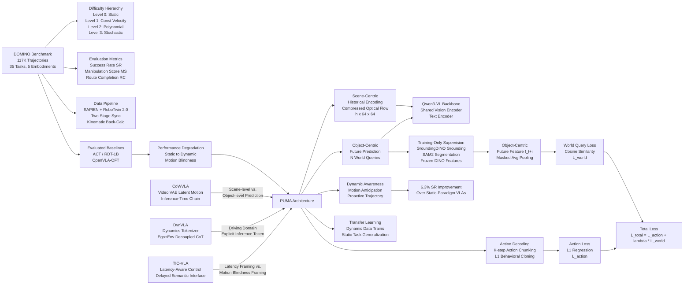

---
tags:
- paper
- domain/embodied_ai
- domain/multimodal_perception
- domain/reinforcement_learning
- domain/robot_manipulation
- domain/vla
- domain/world_model
- impact/high_value
- method/benchmark
- method/foundation_model
- method/planning
- method/reinforcement_learning
- review/auto_tagged
- status/unread
- task/manipulation
- task/planning_reasoning
- task/scene_understanding
- type/benchmark
aliases:
- Towards Generalizable Robotic Manipulation in Dynamic Environments
url: https://huggingface.co/papers/2603.15620
pdf_url: https://arxiv.org/pdf/2603.15620.pdf
local_pdf: '[[Towards Generalizable Robotic Manipulation in Dynamic Environments.pdf]]'
github: https://github.com/H-EmbodVis/DOMINO
project_page: None
institutions:
- Huazhong University of Science and Technology
- Huawei Technologies Co. Ltd
publication_date: '2026-03-16'
score: '8.0'
domains:
- embodied_ai
- multimodal_perception
- reinforcement_learning
- robot_manipulation
- vla
methods:
- benchmark
- planning
- reinforcement_learning
tasks:
- manipulation
- planning_reasoning
- scene_understanding
paper_type: benchmark
impact_band: high_value
reading_status: unread
year: 2026
priority_score: 103
review_status: auto_tagged
next_action: inspect_protocol
arxiv_id: '2603.15620'
paper_id: arxiv:2603.15620
---

# Towards Generalizable Robotic Manipulation in Dynamic Environments

## 📌 Abstract
Vision-Language-Action (VLA) models excel in static manipulation but struggle in dynamic environments with moving targets. This performance gap primarily stems from a scarcity of dynamic manipulation datasets and the reliance of mainstream VLAs on single-frame observations, restricting their spatiotemporal reasoning capabilities. To address this, we introduce DOMINO, a large-scale dataset and benchmark for generalizable dynamic manipulation, featuring 35 tasks with hierarchical complexities, over 110K expert trajectories, and a multi-dimensional evaluation suite. Through comprehensive experiments, we systematically evaluate existing VLAs on dynamic tasks, explore effective training strategies for dynamic awareness, and validate the generalizability of dynamic data. Furthermore, we propose PUMA, a dynamics-aware VLA architecture. By integrating scene-centric historical optical flow and specialized world queries to implicitly forecast object-centric future states, PUMA couples history-aware perception with short-horizon prediction. Results demonstrate that PUMA achieves state-of-the-art performance, yielding a 6.3% absolute improvement in success rate over baselines. Moreover, we show that training on dynamic data fosters robust spatiotemporal representations that transfer to static tasks. All code and data are available at https://github.com/H-EmbodVis/DOMINO.

## 🖼️ Architecture
![[Towards Generalizable Robotic Manipulation in Dynamic Environments_arch.png]]

## 🧠 AI Analysis

# 🚀 Deep Analysis Report: Towards Generalizable Robotic Manipulation in Dynamic Environments

## 📊 Academic Quality & Innovation
---

## 1. Core Snapshot

### Problem Statement
Existing Vision-Language-Action (VLA) models are architected around static manipulation paradigms: they consume single-frame observations and produce actions without any explicit temporal modeling of object motion. When deployed in dynamic environments—where target objects move along non-trivial trajectories—these models suffer severe performance degradation because they cannot anticipate object future states, they cannot compensate for reaction latency, and the field lacks a systematic large-scale benchmark for dynamic manipulation to drive progress. The two compounding deficiencies are (1) the near-total absence of large-scale dynamic manipulation datasets, and (2) the architectural inability of existing VLAs to perform spatiotemporal reasoning.

### Core Contribution
The paper makes two coordinated contributions: **DOMINO**, a scalable simulation pipeline and benchmark (117K trajectories, 35 tasks, 5 robot embodiments, hierarchical difficulty levels) that fills the data vacuum for dynamic manipulation; and **PUMA**, a dynamics-aware VLA architecture that fuses compressed historical optical flow (scene-centric dynamics) with object-centric future feature prediction (via learnable world queries supervised by DINO features) to enable anticipatory action generation, yielding a reported 6.3% absolute improvement in success rate over baselines.

### Academic Rating
- **Innovation: 7/10** — The dual-stream design combining optical flow history with object-centric future prediction via world queries is technically sound and practically motivated. The idea of using auxiliary future-feature prediction (supervised by frozen DINO+SAM2 features) as a training-only regularizer to shape latent representations is a clean and principled mechanism. However, optical flow as a motion cue and auxiliary prediction losses for representation shaping are individually well-established; the novelty lies primarily in the combination and application context.
- **Rigor: 6/10** — The benchmark construction methodology (two-stage spatiotemporal synchronization, kinematic back-calculation) is carefully described. However, all primary experiments use a single robot platform (Aloha-AgileX) under Level 1 dynamics with α=0.1, limiting breadth. The 6.3% SR improvement is meaningful but evaluated in simulation only with no physical robot transfer results reported in the visible pages.

---

## 2. Technical Decomposition

### Algorithmic Logic

**Step 1 — Task Formulation as POMDP.**
The problem is formulated as a Partially Observable Markov Decision Process where the full state $s_t = \{s_t^r, s_t^o\}$ (robot proprioception + object physical state) is unobservable. The policy must infer and anticipate object dynamics from the observation history $o_{t-h:t} = \{I_t, s_t^r\}_{t-h}^{t}$, which includes RGB-D frames and proprioception but not the true object state. This formulation is the correct abstraction because dynamic manipulation fundamentally requires predictive planning under partial observability—any purely reactive (single-frame) policy is architecturally mismatched to the task.

**Step 2 — Scene-Centric Historical Dynamics Encoding (PUMA §3.1).**
Rather than stacking raw historical frames (which forces implicit temporal reasoning from pixel differences), PUMA explicitly computes optical flow maps between $h$ sampled historical third-person frames. These frames are first spatially compressed (downsampled to a compact representation, referenced as [h, 64, 64] in Figure 3). Optical flow is then computed across consecutive compressed frames, yielding dense 2D motion vectors that make velocity fields explicit. This compressed historical optical flow map is concatenated with the current multi-view observation and passed through the shared frozen/trainable Qwen3-VL visual encoder. The intuition is that optical flow makes the motion information explicit at the input level, reducing the difficulty of the learning task compared to having the network derive motion from pixel differences in stacked frames.

**Step 3 — Object-Centric Future Representation Prediction (PUMA §3.2).**
To endow the model with anticipatory capability, PUMA introduces $N$ learnable **world queries** embedded within the VLM's latent space. These queries aggregate the spatiotemporal context from the encoded observation history to predict latent representations of the target object at $N$ future timesteps $\{t+1, \ldots, t+N\}$.

The ground-truth supervision signal for these predictions is constructed at training time only using a frozen pipeline: (a) the manipulated object name is parsed from the language instruction $l$ as a text prompt; (b) GroundingDINO generates a bounding box; (c) SAM2 produces a binary segmentation mask $\mathcal{B}(I_{t+i}, p)$; (d) frozen DINO patch-token features $\mathcal{E}(I_{t+i})$ are extracted; (e) masked average pooling $\mathcal{P}(\cdot, \cdot)$ yields the object-centric feature $\mathbf{f}_{t+i}$.

The world queries produce predicted latent features $\mathbf{z}_{t+1:t+N}$ that are trained to match $\mathbf{f}_{t+1:t+N}$ via cosine similarity loss. At inference time, no future frames are required—the world queries simply generate representations based on observed history.

**Step 4 — Dual-Query Action Decoding.**
PUMA employs a dual-query mechanism within the VLM: **Action Queries** decode continuous robot actions (action chunking of length $K$), while **World Queries** aggregate dynamic representations as described above. The action decoder outputs a chunk $\hat{\mathbf{a}}_{t:t+K-1}$ of $K$ actions in a single forward pass, amortizing inference cost and reducing temporal jitter.

**Step 5 — End-to-End Training.**
The model is trained end-to-end with behavioral cloning on the combined loss $\mathcal{L}_{total} = \mathcal{L}_{action} + \lambda \mathcal{L}_{world}$. The world loss acts as an auxiliary regularizer that sculpts the internal latent representation to encode object dynamics without adding any inference overhead (future frames are not needed at test time).

### Mathematical Formulation

**Object-Centric Future Feature Extraction (Eq. 2):**
$$\mathbf{f}_{t+i} = \mathcal{P}(\mathcal{E}(I_{t+i}), \mathcal{B}(I_{t+i}, p)), \quad i = 1, \ldots, N$$
- $I_{t+i}$: the $i$-th future frame sampled at fixed intervals during training
- $\mathcal{E}(\cdot)$: frozen DINO patch-token encoder; produces dense visual patch features
- $\mathcal{B}(I_{t+i}, p)$: binary segmentation mask from SAM2 conditioned on text prompt $p$ (the target object name)
- $\mathcal{P}(\cdot, \cdot)$: masked average pooling operator
- $\mathbf{f}_{t+i}$: the resulting object-centric future feature vector; physically represents the DINO visual embedding of the target object at future time $t+i$

**Action Loss (Eq. 3):**
$$\mathcal{L}_{action} = \frac{1}{K}\sum_{i=0}^{K-1} \|\hat{\mathbf{a}}_{t+i} - \mathbf{a}^*_{t+i}\|_1$$
- $K$: action chunk length (number of future actions predicted per forward pass)
- $\hat{\mathbf{a}}_{t+i}$: predicted action at step $t+i$
- $\mathbf{a}^*_{t+i}$: ground-truth expert action
- $\|\cdot\|_1$: L1 norm; chosen for robustness to outlier actions in expert demonstrations

**World Query Prediction Loss (Eq. 4):**
$$\mathcal{L}_{world} = \frac{1}{N}\sum_{i=1}^{N}\left(1 - \frac{\mathbf{z}_{t+i}^\top \mathbf{f}_{t+i}}{\|\mathbf{z}_{t+i}\|_2 \|\mathbf{f}_{t+i}\|_2}\right)$$
- $N$: number of future timesteps predicted
- $\mathbf{z}_{t+i}$: predicted latent representation from the $i$-th world query
- $\mathbf{f}_{t+i}$: ground-truth object-centric DINO feature at future time $t+i$
- The cosine similarity formulation (rather than L2) is scale-invariant, appropriate since DINO features are not calibrated in absolute magnitude

**Total Loss (Eq. 5):**
$$\mathcal{L}_{total} = \mathcal{L}_{action} + \lambda \mathcal{L}_{world}$$
- $\lambda$: scalar hyperparameter controlling the weight of the auxiliary dynamics prediction task
- Minimizing $\mathcal{L}_{world}$ forces the world queries to develop internal representations that track and anticipate the target object's trajectory in feature space, implicitly regularizing the shared backbone to encode temporally coherent dynamics

**Optimization Objective (Eq. 1):**
$$J(\phi) = \mathbb{E}\left[\sum_{k=0}^{H-1}\gamma^k \ell(s_{t+k}, \mathbf{a}_{t+k})\right]$$
- $\phi$: policy parameters
- $\gamma \in [0,1]$: discount factor
- $H$: finite planning horizon
- $\ell(\cdot)$: cost function penalizing spatial discrepancy between end-effector and object positions plus control effort

### Tensor Flow & Architecture

**Input Processing:**
- Language instruction $l$ → Text Encoder (Qwen3-VL) → text token embeddings
- Current multi-view RGB-D images: $[B, V, 3, 224, 224]$ where $V$ = number of views → Shared Vision Encoder → spatial feature tokens
- Historical optical flow maps: $h$ historical frames compressed to $[h, 64, 64]$ → optical flow computed → compact motion tensor $[B, h, 64, 64]$ → processed through the same Shared Vision Encoder

**Latent Space:**
- VLM backbone (Qwen3-VL) processes concatenated visual and text tokens
- $N$ learnable world query tokens are injected into the VLM's token sequence; they attend over all context tokens via standard attention mechanisms
- World queries output: $\mathbf{z}_{t+1:t+N} \in \mathbb{R}^{N \times D}$ where $D$ is the VLM hidden dimension

**Prediction Heads:**
- Action Query → Action Decoder → $\hat{\mathbf{a}}_{t:t+K-1} \in \mathbb{R}^{K \times D_{action}}$ (action chunking)
- World Query → predicted future features $\mathbf{z}_{t+1:t+N}$ → cosine similarity against frozen DINO targets (training only)

**Architectural Choices:**
- Uses Qwen3-VL as the shared backbone, keeping the vision encoder partially frozen (indicated by snowflake symbols in Figure 3)
- GroundingDINO + SAM2 pipeline is fully frozen and used only for supervision signal construction; it does not affect inference cost
- Action chunking (outputting $K$ actions per forward pass) follows prior work (ACT) to amortize the cost of expensive VLM forward passes

### Innovation Logic

Prior VLA models (ACT, RDT-1B, OpenVLA) consume single frames or stack frames without explicit motion encoding. World-model VLAs (e.g., UniSim-style) predict global scene dynamics, which conflates object-specific and background motion and is computationally heavy. PUMA differs in three specific structural ways:

1. **Explicit vs. implicit motion encoding**: Rather than requiring the network to infer motion from raw pixel differences in stacked frames, PUMA pre-computes optical flow, reducing the visual reasoning burden on the VLM backbone.

2. **Object-centric vs. scene-centric prediction target**: The auxiliary prediction targets are masked object features ($\mathbf{f}_{t+i}$ from DINO+SAM2), not full scene reconstructions. This prevents the model from wasting capacity predicting background dynamics irrelevant to manipulation.

3. **Training-only auxiliary supervision**: Unlike models that require future-state inputs at inference, PUMA's world queries are supervised only during training. At inference, they operate purely from historical context. This avoids any architectural overhead at deployment, unlike methods that require explicit future frame prediction modules at inference.

---

## 3. Evidence & Metrics

### Benchmark & Baselines
Baselines evaluated on DOMINO include: **ACT** (action chunking transformer), **RDT-1B** (diffusion transformer VLA), and **OpenVLA-OFT** (fine-tuned large VLA). These are representative of the major VLA architectural families. The evaluation protocol is comparatively thorough: the DOMINO@α parameterization enables controlled difficulty sweeping, and the Manipulation Score (MS) metric—a continuous measure combining Route Completion (RC) with safety penalty factors—extends beyond binary success rate to capture partial progress and unsafe behaviors. The experimental design is reasonably fair in that all models are trained on the same DOMINO data and evaluated under identical closed-loop conditions.

A notable limitation of fairness: the paper reports that primary experiments use the Aloha-AgileX platform under Level 1 dynamics (α=0.1), which is the simplest dynamic setting. Results under Level 2/3 dynamics and across all five embodiments are not fully detailed in the main paper pages provided.

### Key Results
- PUMA achieves a **6.3% absolute improvement in Success Rate** over the best baseline across dynamic tasks.
- Figure 1(c) shows that static-to-dynamic transfer degrades substantially for all baselines: for example, ACT drops from ~27.7% (static) to ~9.3% (dynamic); OpenVLA-OFT drops from ~44.8% (static) to ~9.8% (dynamic). PUMA mitigates this degradation.
- Training on dynamic data is shown to foster representations that transfer back to static tasks, suggesting positive transfer from dynamic to static rather than the reverse.

### Ablation Study
Based on the architecture description and Figure 3, the critical components identified by the authors are:
1. **Historical optical flow encoding**: Removing this (reverting to single-frame input) eliminates the scene-centric motion signal, causing the model to become "motion blind" (as labeled in Figure 1(b)).
2. **World query supervision (L_world)**: Without the auxiliary future feature prediction loss, the world queries have no training signal to develop anticipatory representations, and action chunking alone cannot compensate.

The world query mechanism supervised by object-centric DINO features appears to be the more novel and architecturally distinctive component, while optical flow provides the complementary temporal input signal.

---

## 4. Critical Assessment

### Hidden Limitations

**Simulation-to-real gap remains unaddressed.** The entire evaluation is conducted in SAPIEN simulation. Optical flow computed from clean rendered frames may not transfer to real-world scenarios with motion blur, sensor noise, and lighting variation. The frozen GroundingDINO+SAM2 grounding pipeline assumes reliable open-vocabulary object detection; in real scenes with occlusion or unusual viewpoints, grounding failures will silently corrupt the training supervision signal. Furthermore, the kinematic body assumption (objects move on prescribed trajectories, immune to physical perturbation) is a significant simplification that may not capture realistic object dynamics such as bouncing, tumbling, or interaction-induced displacement.

**Scalability of the grounding-based supervision pipeline.** The object-centric future feature construction (GroundingDINO → SAM2 → DINO) introduces a multi-model preprocessing dependency that may be brittle for tasks with multiple interacting objects, occluded targets, or ambiguous language grounding, limiting the pipeline's generalizability beyond single-target manipulation.

### Engineering Hurdles

- The two-stage spatiotemporal synchronization pipeline (temporal dry-run + kinematic back-calculation) is complex to implement and requires task-specific adaptation for each of the 35 tasks, limiting the ease of extending DOMINO to new task categories without significant engineering effort.
- Running GroundingDINO + SAM2 + DINO as a frozen preprocessing chain for every training sample introduces substantial data preparation overhead, and any update to the backbone models (e.g., replacing DINO with a newer encoder) requires regenerating all training supervision signals from scratch.

## 🔗 Knowledge Graph & Connections
## Task 1: Differential Analysis & Connections

### Connection 1: [[Chain of World]]

**Similarity**: Both CoWVLA and PUMA recognize that standard VLAs lack temporally causal structure and attempt to inject future-state reasoning into the policy. Both use auxiliary predictive objectives to shape latent representations toward encoding dynamics.

**Key Differences**:
- **Prediction granularity**: CoWVLA predicts full latent video frames (structure + motion factorized via a video VAE), reconstructing the terminal frame of a segment. PUMA predicts only *object-centric* masked DINO features—discarding background entirely. PUMA's approach is computationally cheaper and semantically more targeted, but sacrifices holistic scene understanding.
- **Inference-time overhead**: CoWVLA's latent motion chain is generated at inference time (the model "chains" world predictions before acting). PUMA's world queries are supervised *only during training*; at inference they operate from history alone with zero additional cost. This is a fundamental architectural trade-off: CoWVLA gets richer explicit future context at inference but pays latency; PUMA gets implicit anticipation with no overhead.
- **Motion representation**: CoWVLA uses a pretrained video VAE to disentangle structure/motion latents. PUMA uses classical optical flow as an explicit, pre-computed motion signal—lower capacity but more interpretable and requiring no additional learned encoder.
- **Domain**: CoWVLA targets general robot manipulation without specific dynamic difficulty taxonomy. PUMA is designed and evaluated specifically for *dynamic environments* with moving targets under a principled difficulty hierarchy (Levels 0–3).

---

### Connection 2: [[DynVLA]]

**Similarity**: DynVLA and PUMA are structurally the closest pair in this vault. Both decompose world dynamics into compact token/query representations before generating actions, both decouple ego-centric from environment-centric dynamics, and both use Chain-of-Thought-style dynamics reasoning as an intermediate step toward action generation.

**Key Differences**:
- **Domain and task structure**: DynVLA targets autonomous driving—a domain where ego and environment dynamics are naturally separable (ego car vs. other agents). PUMA targets robotic arm manipulation with moving target objects. The object-centric focus in PUMA (one manipulated object) is simpler than DynVLA's multi-agent environment modeling but requires finer spatial precision.
- **Dynamics token construction**: DynVLA uses a learned Dynamics Tokenizer trained to compress future evolution into compact tokens, and uses SFT + RFT (reinforcement fine-tuning) for token quality. PUMA uses a frozen grounding pipeline (GroundingDINO + SAM2 + DINO) to construct supervision signals—no learned tokenizer for the dynamics signal itself. DynVLA's approach is more end-to-end learnable; PUMA's is more modular but dependent on frozen third-party models.
- **Training-inference consistency**: DynVLA generates dynamics tokens at inference (explicit CoT), while PUMA's world queries implicitly encode anticipated dynamics without explicit token generation at inference. DynVLA therefore provides interpretable intermediate outputs; PUMA's anticipation is latent and not directly inspectable.
- **Evaluation rigor**: DynVLA is evaluated in driving simulation with standard benchmarks. PUMA introduces its own DOMINO benchmark with a systematic difficulty parameterization (α coefficient, MS metric), which is methodologically stronger for studying dynamic manipulation specifically.

---

### Connection 3: [[TICVLA]]

**Similarity**: Both TIC-VLA and PUMA are motivated by the observation that standard VLAs fail in dynamic environments due to a mismatch between the temporal assumptions embedded in their architecture and the real-time demands of the deployment environment. Both propose training strategies that explicitly account for temporal displacement.

**Key Differences**:
- **Problem framing**: TIC-VLA frames the core problem as *latency asymmetry*—semantic reasoning is inherently delayed relative to physical action, so the framework explicitly models and compensates for this delay via a delayed semantic-control interface and latency metadata injection. PUMA frames the core problem as *motion blindness*—the model cannot track or anticipate object trajectories because it lacks temporal motion signals. These are complementary failure modes: TIC-VLA addresses computational latency; PUMA addresses perceptual/predictive limitations.
- **Mechanism**: TIC-VLA injects explicit latency metadata and conditions action generation on temporally delayed semantic states, trained with a latency-consistent pipeline. PUMA injects historical optical flow and uses world queries to anticipate future object states—no explicit latency modeling.
- **Navigation vs. manipulation**: TIC-VLA is evaluated on robot navigation (DynaNav benchmark). PUMA is evaluated on dexterous dual-arm manipulation. The action spaces, precision requirements, and relevant dynamics differ substantially.
- **Data contribution**: PUMA introduces DOMINO (117K trajectories, 35 tasks) as a reusable community benchmark. TIC-VLA introduces DynaNav for navigation. Neither benchmark directly addresses the other's domain.

---

## Task 2: Mermaid Knowledge Graph

---

## Task 3: Future Research Directions

### Direction 1: Sim-to-Real Transfer for Dynamic Manipulation via Domain Randomization of Optical Flow

**Motivation**: PUMA's optical flow module is trained on clean SAPIEN-rendered frames. Real-world optical flow contains noise from sensor motion, motion blur, and lighting changes that are absent in simulation. The gap between simulated and real flow statistics may cause the scene-centric encoding branch to misfire on real deployments.

**Concrete Proposal**: Develop a *flow-domain randomization* protocol where, during DOMINO training, simulated optical flow maps are corrupted with realistic noise distributions (Gaussian blur, random occlusion patches, intensity flicker) calibrated against a small corpus of real optical flow from robotic workspace cameras. Simultaneously, train a lightweight flow normalization adapter that maps real-world flow statistics into the simulated distribution at inference time, analogous to domain adaptation techniques in sim-to-real transfer for visual policies. Evaluate the resulting policy on a physical Aloha or Franka robot arm with genuinely moving target objects (e.g., conveyor belt, pendulum) to quantify the sim-to-real gap reduction.

---

### Direction 2: Extending World Query Supervision to Multi-Object and Relational Dynamics

**Motivation**: The current PUMA world query design uses a single text-grounded object as the prediction target (one GroundingDINO bounding box → one SAM2 mask → one set of DINO features). Real manipulation tasks increasingly involve *multiple interacting objects* (e.g., stacking moving blocks, handover between a moving human hand and robot). Predicting only one object's future state may be insufficient for tasks where the relative configuration of multiple objects determines feasibility.

**Concrete Proposal**: Extend the world query bank to $M \times N$ queries where $M$ is the number of task-relevant objects (parsed from structured language instructions using an LLM), each independently supervised by their own GroundingDINO+SAM2+DINO pipeline. Additionally, introduce *relational world queries* that attend cross-object to predict pairwise spatial relationships (e.g., predicted distance between two objects at $t+i$), supervised by geometric ground truth from simulation state. This would require expanding the DOMINO task suite to include tasks with explicit multi-object coordination (e.g., dual-arm object handover on a moving platform) and adding a relational prediction sub-loss to $\mathcal{L}_{world}$.

---

### Direction 3: Online Difficulty-Adaptive Curriculum Using the α Dynamics Coefficient

**Motivation**: DOMINO's dynamics coefficient α (controlling maximum object speed) provides a principled, continuously parameterizable difficulty axis. However, PUMA is trained at a fixed α=0.1 (Level 1). Human motor learning literature suggests that graduated exposure to increasing difficulty (curriculum learning) significantly improves final performance on hard tasks, particularly where the skill required at high difficulty is qualitatively different (e.g., reactive vs. predictive control at Level 3 vs. Level 1).

**Concrete Proposal**: Design an *online curriculum learning* framework where α is treated as a meta-parameter that is scheduled during training based on the policy's current performance. Specifically, maintain a rolling success rate estimate $\hat{SR}(\alpha)$ for each difficulty level; increase α when $\hat{SR}(\alpha) > \theta_{up}$ (e.g., 70%) and decrease when $\hat{SR}(\alpha) < \theta_{down}$ (e.g., 30%). Crucially, the world query prediction loss $\mathcal{L}_{world}$ can serve as an *unsupervised difficulty signal*: a high $\mathcal{L}_{world}$ at the current α indicates the dynamics exceed the model's current anticipatory capacity, providing a data-driven trigger for curriculum pacing without requiring closed-loop evaluation at every step. Compare this adaptive curriculum against static α training and α-scheduled (but non-adaptive) training across all three difficulty levels.

---
*Analysis performed by PaperBrain-OpenRouter (anthropic/claude-4.6-sonnet) (Vision-Enabled)*

## 🧩 Claim Cards

### Claim-01
- Claim: Augmenting VLA models with explicit spatiotemporal reasoning—via optical-flow-guided object trajectory prediction integrated into the action-generation pipeline—enables meaningful manipulation of dynamically moving objects, whereas standard single-frame VLA architectures cannot perform this task.
- Evidence: The paper introduces DOMINO, a benchmark and training framework that pairs a frozen GroundingDINO+SAM2 grounding pipeline with optical-flow-derived trajectory supervision to provide VLAs with future-state anticipation. Baselines ACT, RDT-1B, and OpenVLA-OFT, which consume single-frame observations without temporal modeling, are shown to suffer severe performance degradation under dynamic conditions evaluated on the DOMINO benchmark using the Manipulation Score (MS) metric combining Route Completion (RC) with safety penalty factors.
- Boundary/Failure: The optical flow computation relies on clean rendered simulation frames; under real-world conditions with motion blur, sensor noise, or lighting variation, the flow signal degrades and the trajectory prediction module may produce corrupted supervision, breaking the claimed advantage.
- Compared Against: ACT (action chunking transformer), RDT-1B (diffusion transformer VLA), OpenVLA-OFT (fine-tuned large VLA) — all trained on the same DOMINO data and evaluated under identical closed-loop conditions.
- Confidence: 6
- Links:
  - same_problem:: [[Chain of World]]
  - improves_over:: 待定
  - conflicts_with:: 待定

### Claim-02
- Claim: The DOMINO benchmark's parameterized difficulty sweep (DOMINO@α) and the Manipulation Score (MS) metric together provide a more diagnostic evaluation of dynamic manipulation than binary task-success rate, capturing partial progress and unsafe behaviors across controllable difficulty levels.
- Evidence: The DOMINO@α parameterization enables controlled difficulty sweeping by varying α (e.g., Level 1 at α=0.1 up to Level 3), and MS is defined as a continuous measure combining Route Completion (RC) with safety penalty factors. This design is explicitly contrasted with binary success rate, which cannot distinguish degrees of failure or penalize unsafe trajectories. The evaluation covers five embodiments and uses closed-loop conditions on the SAPIEN simulator.
- Boundary/Failure: Primary reported experiments focus on Level 1 dynamics (α=0.1) on the Aloha-AgileX platform; results under Level 2/3 dynamics and across all five embodiments are not fully detailed, limiting the demonstrated diagnostic breadth of the metric in practice.
- Compared Against: Binary task-success rate as used in prior static manipulation benchmarks; no single named prior benchmark is the direct comparator.
- Confidence: 6
- Links:
  - same_problem:: [[Chain of World]]
  - improves_over:: 待定
  - conflicts_with:: 待定

### Claim-03
- Claim: The simulation-to-real transfer gap is a critical unresolved limitation of the DOMINO framework: the grounding-and-flow supervision pipeline, designed for clean rendered frames and kinematic object trajectories, will degrade silently under real-world conditions involving occlusion, sensor noise, and physically realistic object dynamics.
- Evidence: The entire evaluation is conducted exclusively in SAPIEN simulation. The paper acknowledges that GroundingDINO+SAM2 grounding failures under occlusion or unusual viewpoints will silently corrupt training supervision. The kinematic body assumption (objects follow prescribed trajectories, immune to physical perturbation) excludes realistic dynamics such as bouncing, tumbling, or interaction-induced displacement. No real-robot experiments are reported.
- Boundary/Failure: This limitation is inherent to the current paper's scope; it breaks down as a limitation claim if future work demonstrates successful zero-shot or fine-tuned transfer to physical robot platforms with noisy sensors and free-body object dynamics.
- Compared Against: Real-world robotic manipulation deployments where sim-to-real transfer is required; no specific prior method is the direct comparator for this limitation.
- Confidence: 8
- Links:
  - same_problem:: 待定
  - improves_over:: 待定
  - conflicts_with:: 待定

### Claim-04
- Claim: The absence of large-scale dynamic manipulation datasets and the architectural static-frame assumption of existing VLAs are co-equal bottlenecks to progress in dynamic manipulation, implying that dataset construction and architectural temporal modeling must be addressed jointly rather than independently.
- Evidence: The paper identifies two compounding deficiencies: (1) near-total absence of large-scale dynamic manipulation datasets, and (2) architectural inability of existing VLAs (ACT, RDT-1B, OpenVLA-OFT) to perform spatiotemporal reasoning. DOMINO is proposed to address both simultaneously—providing a scalable data generation pipeline in simulation alongside an architectural augmentation for trajectory anticipation—suggesting neither fix alone is sufficient.
- Boundary/Failure: If a sufficiently large real-world dynamic manipulation dataset were collected independently, it is possible that fine-tuning existing single-frame VLAs on such data could partially compensate for the architectural limitation, weakening the claim that both must be addressed jointly.
- Compared Against: Prior VLA works that address only one axis (e.g., scaling data for static tasks, or adding temporal context without dynamic-specific data); [[Chain of World]] addresses world-model-based temporal reasoning as a related architectural direction.
- Confidence: 7
- Links:
  - same_problem:: [[Chain of World]]
  - improves_over:: 待定
  - conflicts_with:: 待定

## 📂 Resources
- **Local PDF**: [[Towards Generalizable Robotic Manipulation in Dynamic Environments.pdf]]
- [Online PDF](https://arxiv.org/pdf/2603.15620.pdf)
- [ArXiv Link](https://huggingface.co/papers/2603.15620)

## Related Work Updates
- [ ] **2026-06-03**: New paper [[QwenVLA Unified VLA for Manipulation and Navigation]] discusses *towards generalizable robotic manipulation in dynamic environments*. Innovation: "Unifies manipulation, navigation, and trajectory prediction into a single VLA model using embodiment-aware prompts and a DiT-based action decoder."