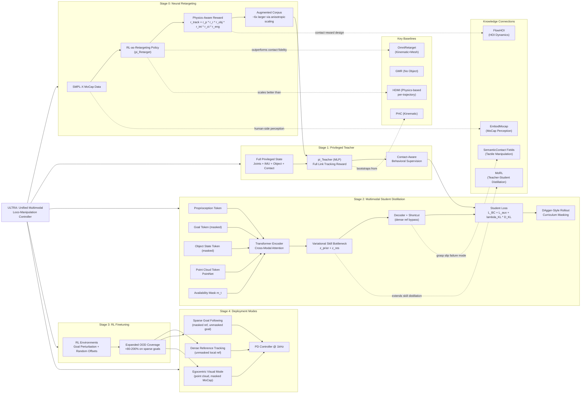

---
tags:
  - paper
  - Embodied_AI
  - Sim2Real
  - Reinforcement_Learning
  - Robot_Manipulation
aliases:
  - "ULTRA: Unified Multimodal Control for Autonomous Humanoid Whole-Body Loco-Manipulation"
url: http://arxiv.org/abs/2603.03279v1
pdf_url: https://arxiv.org/pdf/2603.03279v1
local_pdf: "[[ULTRA Unified Multimodal Control for Autonomous Humanoid WholeBody LocoManipulation.pdf]]"
github: "None"
project_page: "https://ultra-humanoid.github.io/"
institutions:
  - "University of Illinois Urbana-Champaign"
publication_date: "2026-03-03"
score: 8
---
![[ULTRA Unified Multimodal Control for Autonomous Hu_Podcast.mp3]]
# ULTRA: Unified Multimodal Control for Autonomous Humanoid Whole-Body Loco-Manipulation

## 📌 Abstract
Achieving autonomous and versatile whole-body loco-manipulation remains a central barrier to making humanoids practically useful. Yet existing approaches are fundamentally constrained: retargeted data are often scarce or low-quality; methods struggle to scale to large skill repertoires; and, most importantly, they rely on tracking predefined motion references rather than generating behavior from perception and high-level task specifications. To address these limitations, we propose ULTRA, a unified framework with two key components. First, we introduce a physics-driven neural retargeting algorithm that translates large-scale motion capture to humanoid embodiments while preserving physical plausibility for contact-rich interactions. Second, we learn a unified multimodal controller that supports both dense references and sparse task specifications, under sensing ranging from accurate motion-capture state to noisy egocentric visual inputs. We distill a universal tracking policy into this controller, compress motor skills into a compact latent space, and apply reinforcement learning finetuning to expand coverage and improve robustness under out-of-distribution scenarios. This enables coordinated whole-body behavior from sparse intent without test-time reference motions. We evaluate ULTRA in simulation and on a real Unitree G1 humanoid. Results show that ULTRA generalizes to autonomous, goal-conditioned whole-body loco-manipulation from egocentric perception, consistently outperforming tracking-only baselines with limited skills.

## 🖼️ Architecture
![[ULTRA Unified Multimodal Control for Autonomous Humanoid WholeBody LocoManipulation_arch.png]]

## 🧠 AI Analysis

# 🚀 Deep Analysis Report: ULTRA: Unified Multimodal Control for Autonomous Humanoid Whole-Body Loco-Manipulation

## 📊 Academic Quality & Innovation
---

# ULTRA: A Deep Engineering Analysis

## 1. Core Snapshot

### Problem Statement
Existing humanoid whole-body loco-manipulation controllers face three compounding failure modes: (i) kinematic retargeting of MoCap data produces physically inconsistent demonstrations—particularly in contact-rich tasks where foot placement and hand-object interaction violate dynamics—yielding low-quality training data at scale; (ii) controller architectures are rigidly conditioned on a single input modality (typically dense reference trajectories), meaning they collapse when references are unavailable, partially observed, or replaced by sparse goal specifications; and (iii) the gap between dense-tracking policies and goal-conditioned policies is treated as a regime boundary rather than a continuum, forcing separate system designs that cannot unify autonomous perception-driven control with fine-grained reference replay.

### Core Contribution
ULTRA introduces a unified four-stage training framework that couples a physics-driven neural retargeting policy (eliminating per-trajectory optimization) with a multimodal distilled student controller that handles dense reference tracking, operator command following, and egocentric visual goal pursuit within a single parametric model.

### Academic Rating
- **Innovation: 7/10** — The combination of RL-as-retargeting and variational skill bottleneck distillation is technically well-motivated and practically significant. The availability-masking trick enabling a single policy to handle heterogeneous modalities is elegant, though each individual component draws on established ideas (teacher-student distillation, CVAE-style bottleneck, DAgger). The novelty lies in the integration and the specific application to contact-rich loco-manipulation at dataset scale.
- **Rigor: 7/10** — Experiments are systematic and include ablations that isolate the contribution of each training stage. Comparisons against OmniRetarget, HDMI, PHC, and GMR are reasonable, though the real-world evaluation (Table IV) uses only 20 trials per setting, which limits statistical power. Sim-to-sim and sim-to-real gaps are evaluated but not deeply characterized.

---

## 2. Technical Decomposition

### Algorithmic Logic: Step-by-Step Flow

**Stage 0 — Neural Retargeting Policy (π_Retarget)**

*Input*: A human-object MoCap sequence from SMPL-X, scaled and aligned to the Unitree G1 morphology via a fixed key-link correspondence. Preprocessing establishes a heading-aligned frame (global yaw removed) so that residuals between reference and simulation states are well-defined.

*Formulation*: Retargeting is cast as a simulation-constrained RL problem. The policy observes a privileged triple: simulator state $o_t^{\text{sim}}$, reference quantities $o_t^{\text{ref}}$ (object pose, joint targets derived from the SMPL-X sequence), and heading-aligned residuals $o_t^\Delta$. Episodes initialize from the default standing pose and track the first reference frame before transitioning to full tracking with smoothly increasing weights. Early termination occurs on falls, excessive deviation, or contact mismatch for 20 consecutive frames.

*Reward*: $r_{\text{track}} = r_p \cdot r_r \cdot r_{\text{obj}} \cdot r_{\text{int}} \cdot r_{\text{ct}} \cdot r_{\text{eng}}$, defined as a multiplicative product:
- $r_p$: sparse end-effector position anchoring (feet and palms only), prioritizing loco-manipulation-critical links.
- $r_r$: normalized link direction matching over a fixed edge set.
- $r_{\text{obj}}$: object pose/velocity tracking.
- $r_{\text{int}}$: palm-to-surface offset matching, sampled over contact object points.
- $r_{\text{ct}}$: contact alignment — human link contacts mapped to humanoid links, yielding a contact consistency term.
- $r_{\text{eng}}$: joint effort and foot placement regularization.

*Intuition for RL-as-retargeting*: Kinematic IK solvers enforce joint limits but ignore ground contact and object dynamics. When lifting a box, the IK solution may produce a standing configuration that is kinematically valid but dynamically infeasible (feet slip, object penetrates). By making the simulator enforce physics and using rewards to encourage contact alignment, the policy discovers physically achievable approximations automatically, without per-trajectory optimization. A single trained policy then generalizes to arbitrary new sequences at inference time.

*Augmentation*: The retargeting policy enables zero-shot augmentation by applying anisotropic trajectory scaling (translating trajectories along coordinate axes) and object resizing (scaling the manipulated object with different coefficients). Since preprocessing already handles scaling, the same policy handles augmented inputs without retraining, yielding a ~6× larger corpus from the OMOMO dataset.

*Low-level control*: An idealized PD controller (control frequency = simulation frequency) is used during retargeting to maximize tracking fidelity. This differs from deployment PD control, which is intentionally not used here since retargeting is only for generating reference rollouts—not deploying hardware.

---

**Stage 1 — Privileged Teacher Policy (π_Teacher)**

*Inputs*: Full privileged simulator state (joint states, IMU, contact signals, object pose/velocity) and dense reference trajectories from retargeted rollouts.

*Architecture*: Standard MLP policy conditioned on the privileged observation tuple. The teacher uses the deployment-compatible actuation interface (PD control targets, actuator limits) but trains without domain randomization and without observation noise, enabling strong, stable optimization.

*Reward*: Same template as retargeting but replaces sparse end-effector anchoring with *full link tracking* — all humanoid links are tracked densely, along with object, interaction, and contact reward. Physics perturbations and randomized initial reference frames are introduced to broaden state visitation and teach fall recovery. This produces high-quality behavioral supervision for the student.

*Intuition*: The teacher's role is to learn a contact-aware, dynamically consistent tracking policy under full information. Its output trajectories serve as behavioral targets for distillation. The gap between a kinematic retargeting demonstration and a teacher rollout on the same sequence is deliberately preserved: the teacher learns to correct for simulation dynamics that kinematic retargeting cannot anticipate.

---

**Stage 2 — Multimodal Student Policy (π_Student): Distillation**

*Architecture*: A transformer-based encoder processes heterogeneous input tokens. The student observes:

$$o_t^{\text{student}} = \left[o_t^{\text{proprio}},\ o_t^{\text{goal}},\ o_t^{\text{object}},\ o_t^{\text{pcd}},\ m_t\right]$$

where:
- $o_t^{\text{proprio}}$: proprioception (joint states, IMU history)
- $o_t^{\text{goal}}$: task conditioning — long-horizon object transforms, long-horizon root transforms, next-frame local state changes for tracking, or discretized commands (e.g., stand still)
- $o_t^{\text{object}}$: object state (MoCap-based when available)
- $o_t^{\text{pcd}}$: egocentric point cloud from headmounted depth camera
- $m_t$: availability mask indicating which modalities are present

Each modality is independently tokenized. A transformer encoder processes all present tokens; $m_t$ gates cross-modal attention to ignore missing inputs.

*Variational Skill Bottleneck*: The student maintains two latent components:
- **Prior** $p_\theta(z_t^{\text{prior}} \mid m(o_t^{\text{student}}))$: predicts a latent from masked student observations.
- **Encoder** $q_\phi(z_t^{\text{res}} \mid o_t^{\text{student}}, o_t^{\text{teacher}})$: infers a residual latent using privileged teacher inputs during training.

Combined latent: $z_t = z_t^{\text{prior}} + z_t^{\text{res}}$. Actions sampled as $a_t^{\text{student}} \sim \pi_{\text{student}}(a_t \mid o_t^{\text{student}}, z_t)$.

*Training Objective*:
$$\mathcal{L} = \|a_t^{\text{student}} - a_t^{\text{teacher}}\|_2^2 + \mathcal{L}_{\text{aux}} + \lambda_{\text{KL}} D_{\text{KL}}\!\left(q_\phi(z_t \mid o_t^{\text{student}}, o_t^{\text{teacher}}) \;\|\; p_\theta(z_t \mid o_t^{\text{student}})\right)$$

- **$\|a_t^{\text{student}} - a_t^{\text{teacher}}\|_2^2$**: Behavioral cloning loss. Forces student actions to match teacher actions in joint-position space.
- **$\mathcal{L}_{\text{aux}}$**: Reconstruction loss on masked modalities using auxiliary heads. Encourages the latent $z_t$ to retain task-relevant information about unavailable inputs, preventing posterior collapse.
- **$\lambda_{\text{KL}} D_{\text{KL}}(\cdot \| \cdot)$**: KL divergence between posterior (conditioned on teacher) and prior (conditioned only on student observations). Aligns the prior with the posterior so that at deployment (when only the prior is available), the latent is still behaviorally coherent.

*Curriculum Learning*: Two curricula are applied: (i) progressive modality masking — masking probability is gradually increased, forcing the prior to cover broader observability scenarios; (ii) $\lambda_{\text{KL}}$ annealing — KL weight is annealed together with auxiliary weights to prevent posterior collapse while preserving latent diversity.

*Shortcut for tracking*: When a dense local reference is present, behavior is largely deterministic. To avoid forcing a stochastic latent to carry redundant information, a residual shortcut passes the full-body goal directly to the decoder, bypassing the stochastic bottleneck. This cleanly separates the latent space role: under dense references, the shortcut provides low-level guidance; under sparse goals, the latent resolves ambiguity.

*DAgger-style distillation*: Initial rollouts use the teacher. The ratio gradually shifts to the student, and at visited states, the teacher is queried to obtain action labels. This prevents distribution shift compounding that pure behavioral cloning would suffer.

---

**Stage 3 — RL Finetuning**

After distillation, a subset of parallel environments is switched from imitation to RL with goal-reaching objectives. Environments are partitioned: (i) distillation environments replay reference motions with imitation loss; (ii) RL environments optimize task success under state/goal perturbations (random object goal offsets, humanoid root goal offsets). Reward details emphasize terminal goal proximity rather than trajectory fidelity. This stage expands interaction-state coverage beyond the demonstration manifold and reinforces closed-loop recovery behaviors.

---

**Stage 3 — Deployment**

At inference, only $o_t^{\text{student}}$ is available. The prior network $p_\theta$ runs at 60 Hz, the decoder runs at 60 Hz, and PD targets are sent to hardware at 1 kHz. Control mode is selected by setting the availability mask: unmasking dense reference gives tracking mode; masking reference and unmasking sparse goal gives goal-conditioned mode; masking MoCap object state and unmasking point cloud gives egocentric visual mode.

---

### Mathematical Formulation Summary

| Term | Definition | Physical Meaning |
|---|---|---|
| $r_p$ | End-effector position error (feet, palms) | Anchors contact-critical links spatially |
| $r_r$ | Normalized link direction error | Enforces limb orientation consistency |
| $r_{\text{obj}}$ | Object pose and velocity error | Tracks manipulated object trajectory |
| $r_{\text{int}}$ | Palm-to-surface offset over sampled contact points | Preserves grasp geometry |
| $r_{\text{ct}}$ | Contact label alignment (human→humanoid mapping) | Enforces contact timing and location |
| $r_{\text{eng}}$ | Joint effort + foot placement regularization | Reduces energy and unnatural stances |
| $z_t^{\text{prior}}$ | Latent from masked student observations | Encodes motion intent under partial observability |
| $z_t^{\text{res}}$ | Residual latent from privileged teacher inputs | Refines intent using full information during training |
| $\mathcal{L}_{\text{aux}}$ | Reconstruction of masked modalities | Prevents posterior collapse; retains task information |
| $\lambda_{\text{KL}}$ | KL weight (annealed) | Controls posterior-prior alignment vs. expressiveness |

---

### Tensor Flow & Architecture

```
MoCap (SMPL-X) → Scale/Align → [o_t^sim, o_t^ref, o_t^Δ] ∈ R^D
    → π_Retarget (MLP, PPO) → Joint targets ∈ R^23 → IsaacGym simulation
    → Physically feasible rollouts (humanoid + object trajectories)

Teacher:
    [o_t^sim ∈ R^D_full, o_t^ref ∈ R^D_ref] → MLP → a_t^teacher ∈ R^23

Student:
    Proprioception token: R^D_p → Linear → R^d
    Goal token(s): R^D_g → Tokenizer → R^d  [masked by m_t]
    Object token: R^D_o → Tokenizer → R^d   [masked by m_t]
    PCD token: PointNet → R^d               [masked by m_t]
    Tokens ∈ R^{N_tokens × d} → Transformer Encoder → Context ∈ R^{N × d}
    → Prior head: p_θ(z^prior | masked tokens) ∈ R^{d_z}
    → [Training only] Encoder: q_φ(z^res | all tokens + teacher) ∈ R^{d_z}
    → z_t = z^prior + z^res ∈ R^{d_z}
    → Decoder (+ shortcut from goal if dense ref available) → a_t ∈ R^23
    → PD Controller → Motor torques (1kHz)
```

Key architectural choices:
- **Transformer with availability masking**: Rather than zero-padding missing modalities, $m_t$ explicitly gates cross-attention, preventing spurious correlations between absent and present tokens.
- **Additive latent decomposition** ($z = z^{\text{prior}} + z^{\text{res}}$): Allows the prior to be learned independently from residual correction, cleanly separating deployment behavior from training-time privileged information.
- **Multiplicative reward** for retargeting: A single near-zero term (e.g., contact mismatch) collapses the entire reward, strongly discouraging any physically implausible trajectory rather than allowing partial compensation between terms.
- **Shortcut bypass for dense tracking**: Avoids forcing a stochastic variational bottleneck to carry low-ambiguity reference information that is better passed deterministically.

---

### Innovation Logic vs. Prior Work

| Aspect | Prior Work | ULTRA |
|---|---|---|
| Retargeting | Kinematic IK (PHC, GMR): fast but contact-unaware; physics-based RL (HDMI): per-trajectory, expensive | Single RL policy, contact/dynamics-aware, runs at dataset scale in one pass |
| Controller modality | Single-modality conditioning (reference or goal, not both) | Unified availability-masking with shared latent space |
| Distillation coverage | Offline distillation limited to teacher rollout state distribution | DAgger + RL finetuning expands interaction-state coverage beyond demonstrations |
| Latent structure | Flat latent or deterministic | Variational prior+encoder decomposition; curriculum annealing prevents collapse |

---

## 3. Evidence & Metrics

### Benchmarks & Baselines

**Retargeting (Table II)**: PHC (kinematic), GMR (humanoid without objects), OmniRetarget (interaction-preserving kinematic + mesh augmentation). Evaluated on penetration duration/depth, foot skating duration/velocity, and contact floating duration. Fair comparison: all methods retarget from the same OMOMO subset processed by the same preprocessing pipeline.

**Tracking (Table I)**: OmniRetarget (original data), OmniRetarget (retrained on augmented data), HDMI (adapted to their setting), plus ULTRA ablations (direct RL, tracking-only distillation, all-task unified). Metrics: success rate (Succ), humanoid MPJPE ($E_{g\text{-mpjpe}}$), upper-body MPJPE ($E_{\text{mpjpe}}$), jitter ($E_{\text{jitter}}$), object position/rotation error ($E_{\text{pos}}$, $E_{\text{rot}}$). Evaluated on in-distribution (ID) and out-of-distribution (OOD) splits.

**Goal-conditioned (Table III)**: Ablation across RL finetuning presence, perception modality (points vs. position), and goal distribution (ID vs. OOD). Evaluated in MuJoCo with 20 selected motions per setting.

**Real-world (Table IV)**: Unitree G1, 2 trials per setting, dense reference tracking and sparse goal following with both MoCap and egocentric sensing. Small sample but provides existence proof of sim-to-real transfer.

### Key Quantitative Results

**Retargeting**: ULTRA achieves near-zero penetration duration (0.000 ± 0.002 on Largebox, 0.002 ± 0.013 on Suitcase) and foot skating velocity (0.012 ± 0.002 cm/s Largebox) vs. OmniRetarget (0.205 ± 0.106 duration, 0.061 ± 0.045 velocity) — essentially eliminating both artifacts.

**Tracking**: ULTRA (Ours, multimodal) achieves 67.3% / 57.4% humanoid/object success ID and 70.6% / 52.0% OOD, outperforming OmniRetarget (51.3% / 20.9% ID, 25.8% / 68.3% OOD) and HDMI (13.1% / 9.9% ID). Notably, OD tracking success for ULTRA is comparable to or exceeds ID for some baselines, indicating broad generalization.

**Distillation vs. direct RL**: Direct RL under student observations achieves only 54.5% / 41.8% humanoid/object success ID — a ~12-13 percentage point gap vs. the distilled student, confirming that the teacher's privileged contact information is critical for bootstrapping stable contact-rich behavior.

**RL finetuning on OOD goals**: Position-only OOD goal success improves from 4/20 to 12/20 (+200%) and point cloud OOD improves from 5/20 to 9/20 (+80%) with RL finetuning, while ID performance increases modestly (+14-19%). This demonstrates that finetuning primarily expands coverage rather than improving in-distribution performance.

**Real-world**: Dense tracking 73% (19/26), MoCap-based sparse goal following 80-90%, egocentric sparse goal following 50-60%. The 10-20 percentage point drop in egocentric vs. MoCap settings is consistent with added perceptual noise and point cloud occlusion.

### Ablation Findings

The most critical component is the **privileged teacher combined with distillation**: removing it (direct RL) drops success by 12+ percentage points on both ID and OOD tracking. The second most impactful component is **RL finetuning**: without it, OOD goal-conditioned performance degrades dramatically (particularly point-cloud-based following). The **unified training** (combining dense tracking and sparse goals) slightly reduces ID tracking fidelity compared to a tracking-specialist student but preserves OOD performance — the tradeoff is intentional and reflects a move toward versatility.

The **shortcut for dense tracking** is important for jitter reduction: the student achieves lower jitter than the teacher itself, attributed to distillation suppressing high-frequency RL corrections. This is a notable regularization effect.

---

## 4. Critical Assessment

### Hidden Limitations

**Contact-rich failure modes**: The system still relies on learned domain randomization for grasp stability. Friction gap failures are listed as the primary real-world failure cause. Without tactile feedback, the policy cannot detect slip and trigger corrective grasping, limiting reliability on objects with varying surface properties or unusual weight distributions.

**Point cloud quality dependency**: Egocentric perception pipelines back-project depth pixels, crop a forward ROI, remove ground plane, and cluster to extract the object. This pipeline is sensitive to sensor noise, occlusion, and dynamic lighting. Depth-based object extraction fails gracefully when the object is partially occluded or when the robot's own body enters the FOV — scenarios not systematically evaluated.

**Small real-world sample size**: Table IV reports 2 trials per setting, which is insufficient for statistical conclusions. The 50-60% success rate in egocentric goal following (5-6 out of 10) has high variance. A more rigorous real-world evaluation with 20+ trials is needed to distinguish systematic capability from stochastic success.

**Dexterous manipulation exclusion**: The evaluation explicitly focuses on 4 box-shaped objects, excluding dexterous hand manipulation requiring finger dexterity. The system's scalability to non-box objects or tasks requiring precise finger placement is undemonstrated.

**Latent space at deployment**: At deployment, $z_t$ is sampled from the prior $p_\theta$. For dense tracking, the shortcut bypasses this, but for sparse goals, stochastic sampling introduces variability. The paper does not report variance across repeated deployments under identical goal conditions, which matters for real-world reliability.

### Engineering Hurdles

**Retargeting policy training stability**: The multiplicative reward structure is aggressive — a single zero term zeros the entire reward. This can cause sparse-reward problems early in training when the humanoid has not yet established stable contacts. Practitioners will need careful curriculum design (warm-starting with partial reward terms before multiplying) and may face instability on unusual MoCap sequences.

**DAgger distribution shift management**: The gradual teacher-to-student rollout shift requires careful hyperparameter tuning of the mixing schedule. If the student takes over too early, visited states diverge from teacher coverage, degrading query quality. Too late, and distillation does not benefit from student-corrected states. The paper describes a curriculum but does not quantify the sensitivity to this schedule.

**Availability mask curriculum**: Progressive masking probability increase and KL annealing interact non-trivially. Aggressive KL annealing can cause posterior collapse (all latents regress to prior), while insufficient annealing leaves the prior unable to handle fully-masked inputs. The two curricula must be coordinated, and the paper acknowledges this with "anneal $\lambda_{\text{KL}}$ and auxiliary weights to avoid posterior collapse" but provides no specific schedule.

**Sim-to-real transfer of contact rewards**: Retargeting trains in IsaacGym with idealized contact, but the G1 hardware has compliant actuators, sensor latency (~10ms at 100Hz joint state), and real-world friction variability. The contact-alignment rewards learned in simulation may not transfer directly, requiring domain randomization tuning specifically for contact dynamics — which the paper addresses only partially through physical property randomization.

**PointNet point cloud processing at 60Hz**: Processing egocentric depth frames through a PointNet at policy frequency is computationally demanding for onboard deployment. The paper does not report inference latency breakdown. If point cloud extraction (back-projection, clustering) plus PointNet inference exceeds ~16ms, the system cannot run at the claimed 60Hz, requiring either a faster architecture or asynchronous perception-control decoupling.

**Multi-stage training complexity**: The four-stage pipeline (retargeting → teacher → student distillation → RL finetuning) requires careful stage sequencing, dataset management (retargeted rollouts must be stored and replayed), and hyperparameter consistency across stages. Reproduction requires not just code but correctly generated retargeted data, which depends on the retargeting policy quality — a compounding dependency chain that makes end-to-end reproduction substantially more involved than single-stage methods.

## 🔗 Knowledge Graph & Connections
## Task 1: Knowledge Connections

### Connection 1: [[EmbodMocap]] — Shared MoCap-to-Robot Transfer Problem
ULTRA's Stage 0 (neural retargeting) directly addresses the same core bottleneck as EmbodMocap: how to faithfully transfer human motion capture data to a physically distinct robot embodiment while preserving contact semantics. EmbodMocap focuses on egocentric MoCap reconstruction for embodied agents; ULTRA goes further by treating retargeting itself as an RL optimization problem rather than a kinematic projection, which produces contact-consistent rollouts that EmbodMocap-style approaches would still need to physically validate downstream. The two are complementary: EmbodMocap solves the *human-side* perception problem, ULTRA solves the *robot-side* physical feasibility problem.

### Connection 2: [[MoRL]] — Motion-Conditioned RL and Skill Distillation
MoRL and ULTRA share the same teacher-student paradigm where a privileged motion-tracking teacher is distilled into a deployable student policy. The key structural difference is that ULTRA extends the latent bottleneck to a variational skill space with availability masking, enabling the student to handle heterogeneous conditioning (dense references, sparse goals, egocentric point clouds) from a single policy. MoRL's distillation is primarily modality-homogeneous; ULTRA's is explicitly multimodal. The KL-annealing curriculum in ULTRA can be seen as a refinement over MoRL's posterior alignment strategy for contact-rich loco-manipulation.

### Connection 3: [[FlowHOI]] — Human-Object Interaction Modeling
FlowHOI addresses the modeling of physically plausible human-object interaction dynamics, which is foundational to ULTRA's retargeting reward design. ULTRA's $r_{\text{int}}$ (palm-to-surface offsets over sampled contact points) and $r_{\text{ct}}$ (contact label alignment) are essentially a learned approximation of what FlowHOI attempts to model geometrically. A direct research bridge exists: FlowHOI-style interaction fields could replace or augment ULTRA's hand-crafted contact reward terms with richer geometric priors, potentially improving retargeting fidelity for non-box objects.

### Connection 4: [[SemanticContact_Fields_for_CategoryLevel_Generalizable_Tactile_Tool_Manipulation]] — Contact Semantics for Manipulation
ULTRA's explicit contact reward ($r_{\text{ct}}$) and palm-to-surface interaction reward ($r_{\text{int}}$) address the same problem as semantic contact fields: encoding *where* and *how* contacts should occur for successful manipulation. The semantic contact field approach provides category-level generalization of contact priors from tactile data, which ULTRA currently lacks. ULTRA's primary real-world failure mode (friction gaps causing grasp slip) is precisely the problem that tactile-aware contact field methods could address. This connection motivates a future integration path.

### Connection 5: [[SimToolReal]] — Sim-to-Real Transfer for Manipulation
SimToolReal explores the sim-to-real gap specifically for tool manipulation tasks, which is directly relevant to ULTRA's four-stage training pipeline and the unresolved sim-to-real contact fidelity challenge. ULTRA's domain randomization strategy (physical property randomization, perturbation injection) parallels SimToolReal's transfer methodology, but ULTRA does not report a systematic characterization of the sim-to-real gap in contact dynamics. SimToolReal's analysis framework could be applied to diagnose ULTRA's contact-fidelity degradation when moving from IsaacGym to physical Unitree G1.

---

## Task 2: Mermaid Knowledge Graph



---

## Task 3: Future Research Directions

### Direction 1: Tactile-Augmented Contact Reward for Retargeting
**Motivation**: ULTRA's primary real-world failure mode is friction-induced grasp slip, caused by the absence of tactile feedback during both training and deployment. The retargeting reward $r_{\text{int}}$ uses geometric palm-to-surface offsets as a proxy for contact quality, but this does not encode friction cone constraints or deformation-based contact signals.

**Proposed Research**: Replace or augment $r_{\text{int}}$ and $r_{\text{ct}}$ with a learned contact field trained from real tactile sensor data (following the semantic contact field paradigm from [[SemanticContact_Fields_for_CategoryLevel_Generalizable_Tactile_Tool_Manipulation]]). Specifically, train a category-level contact quality predictor $f_\psi(\text{surface geometry}, \text{contact force}) \rightarrow q_{\text{contact}} \in [0,1]$ from a small real-world tactile dataset, then incorporate $q_{\text{contact}}$ as an additional multiplicative term in the retargeting reward. This would produce retargeted demonstrations with physically stable grasps that generalize across object surface properties, directly addressing the friction gap without requiring per-object tactile calibration at deployment.

**Expected Contribution**: Higher retargeting fidelity for objects with non-uniform surface friction, reduced grasp slip rate in real-world deployment, and a bridge between geometric contact modeling and tactile-feedback-aware imitation learning.

---

### Direction 2: Online Latent Space Adaptation via Egocentric World Model
**Motivation**: ULTRA's student prior $p_\theta(z_t \mid m(o_t^{\text{student}}))$ is fixed after training. Under significant distribution shift (novel objects, new environments, operator commands outside training vocabulary), the prior cannot adapt without full retraining. The RL finetuning stage partially mitigates this but is offline and not deployable continuously.

**Proposed Research**: Augment the student architecture with a lightweight online adaptation module: an egocentric world model (similar in spirit to [[VisPhyWorld]] or [[The_Trinity_of_Consistency_as_a_Defining_Principle_for_General_World_Models]]) that predicts future point cloud observations conditioned on proposed actions. At deployment, compute a prediction error signal between world-model forecasts and actual observations, and use this signal to adapt $p_\theta$ via a fast inner-loop gradient update (MAML-style). This would allow the prior to specialize to the current object geometry and interaction dynamics within seconds of contact, without modifying the teacher or requiring new demonstrations.

**Expected Contribution**: Closed-loop adaptation to novel objects and environments without offline retraining, demonstrated by measuring OOD success rate as a function of deployment time (i.e., success improves as the world model calibrates). This would convert ULTRA's offline generalization into genuine online adaptation capability.

---

### Direction 3: Hierarchical Goal Abstraction via Language-Conditioned Skill Composition
**Motivation**: ULTRA's goal specification interface is limited to SE(3) transforms for the object and humanoid root, plus discretized commands (e.g., "stand still"). This is insufficient for complex multi-step tasks (e.g., "pick up the box, walk to the table, place it at the far corner") that require composing multiple ULTRA skills sequentially. The current system has no mechanism to interpret natural language task descriptions or to chain discrete skills with state-dependent transitions.

**Proposed Research**: Introduce a language-conditioned high-level planner that maps natural language task descriptions to sequences of ULTRA goal specifications. Following the approach of [[GeneralVLA]] or [[World_Action_Models_are_Zero_shot_Policies]], fine-tune a vision-language model to output structured goal sequences $(g_1, g_2, \ldots, g_T)$ where each $g_i$ is an SE(3) object/root transform interpretable by ULTRA's existing multimodal controller. The key technical challenge is determining *when* to transition between goals — propose a learned transition detector $d_\psi(o_t^{\text{student}}, g_i) \rightarrow \{0,1\}$ that signals goal completion based on proprioception and point cloud state, allowing ULTRA's underlying controller to run unchanged. Train the planner on a small dataset of language-annotated multi-step loco-manipulation demonstrations without modifying ULTRA's weights.

**Expected Contribution**: An end-to-end system where a user specifies a task in natural language and ULTRA autonomously decomposes and executes it through sequential goal-conditioned control, extending ULTRA's capability from single-skill execution to multi-step compositional manipulation without retraining the low-level controller.

---
*Analysis performed by PaperBrain-OpenRouter (anthropic/claude-4.6-sonnet) (Vision-Enabled)*


## 📂 Resources
- **Local PDF**: [[ULTRA Unified Multimodal Control for Autonomous Humanoid WholeBody LocoManipulation.pdf]]
- [Online PDF](https://arxiv.org/pdf/2603.03279v1)
- [ArXiv Link](http://arxiv.org/abs/2603.03279v1)
