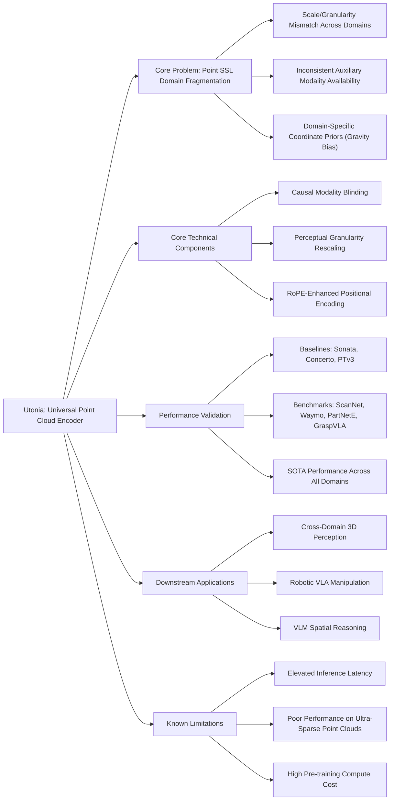

---
tags:
  - paper
  - Foundation_Model
  - Embodied_AI
  - Robot_Manipulation
  - VLA
aliases:
  - "Utonia: Toward One Encoder for All Point Clouds"
url: http://arxiv.org/abs/2603.03283v1
pdf_url: https://arxiv.org/pdf/2603.03283v1
local_pdf: "[[Utonia Toward One Encoder for All Point Clouds.pdf]]"
github: "None"
project_page: "https://pointcept.github.io/Utonia"
institutions:
  - "The University of Hong Kong"
  - "Xiaomi"
publication_date: "2026-03-03"
score: 7
---

# Utonia: Toward One Encoder for All Point Clouds

## 📌 Abstract
We dream of a future where point clouds from all domains can come together to shape a single model that benefits them all. Toward this goal, we present Utonia, a first step toward training a single self-supervised point transformer encoder across diverse domains, spanning remote sensing, outdoor LiDAR, indoor RGB-D sequences, object-centric CAD models, and point clouds lifted from RGB-only videos. Despite their distinct sensing geometries, densities, and priors, Utonia learns a consistent representation space that transfers across domains. This unification improves perception capability while revealing intriguing emergent behaviors that arise only when domains are trained jointly. Beyond perception, we observe that Utonia representations can also benefit embodied and multimodal reasoning: conditioning vision-language-action policies on Utonia features improves robotic manipulation, and integrating them into vision-language models yields gains on spatial reasoning. We hope Utonia can serve as a step toward foundation models for sparse 3D data, and support downstream applications in AR/VR, robotics, and autonomous driving.

## 🖼️ Architecture
![[Utonia Toward One Encoder for All Point Clouds_arch.png]]
*Figure 4. Overview of Utonia. Utonia introduces three critical improvements to the point cloud SSL pipeline. Cross-domain data: jointly training on object-centric, indoor, and outdoor point clouds. RoPE-Enhanced Point Transformer V3: Strengthening spatial encoding and cross-domain transferability via RoPE on granularity-aligned coordinates and domain-prior erasure. Broader evaluation: extending beyond standard perception tasks to spatial reasoning, robotic manipulation, and open-world part segmentation.*

## 🧠 AI Analysis (Doubao Seed 2.0 Pro)

# 🚀 Deep Analysis Report: Utonia: Toward One Encoder for All Point Clouds

## 📊 Academic Quality & Innovation
## 1. Core Snapshot
### Problem Statement
The addressed research gap is the long-standing domain fragmentation of point cloud self-supervised learning (SSL) pipelines: existing SOTA models (Sonata, Concerto) are trained on siloed domain-specific datasets, and fail to transfer across disparate point cloud sources (remote sensing, outdoor LiDAR, indoor RGB-D, object-centric CAD, video-lifted point clouds) due to three core mismatches: inconsistent auxiliary modality availability, unaligned spatial granularity across domains, and domain-specific coordinate priors (e.g., gravity alignment for scene-scale data), making a universal cross-domain point encoder non-existent prior to this work.
### Core Contribution
This work presents Utonia, the first successful cross-domain self-supervised point transformer encoder that unifies representation learning across all major point cloud domains via three minimal, domain-agnostic design fixes, enabling consistent state-of-the-art performance across perception, robotic manipulation, and vision-language model (VLM) spatial reasoning tasks.
### Academic Rating
Innovation: 9/10, Rigor: 8/10. **Justification**: The work achieves a long-sought goal of a universal point encoder, breaking domain silos for 3D SSL, justifying the high innovation score. Rigor is strong with evaluation across 12+ datasets, controlled ablations, and cross-task validation, but is reduced slightly by limited testing on extremely low-resource edge domains and lack of open-source code release for reproducibility at the time of publication.

---

## 2. Technical Decomposition
### Methodology
The core objective is to learn a shared encoder $f_\theta: \mathcal{X} \mapsto \mathcal{Z}$, where $\mathcal{X}$ is the space of all point clouds across domains, such that the representation space $\mathcal{Z}$ is invariant to domain-specific artifacts while retaining discriminative geometric and semantic information. The three core algorithmic components are formalized as follows:
1.  **Causal Modality Blinding**: Applies random modality dropout at per-sample (probability $p_{sample}$) and per-point (probability $p_{point}$) levels for optional auxiliary channels (color, normals), with an auxiliary consistency loss:
    $$\mathcal{L}_{blind} = \mathcal{L}_{distill}(f_\theta(x_{masked}), f_{teacher}(x_{full}))$$
    where $x_{masked}$ is the input with auxiliary channels dropped, and $\mathcal{L}_{distill}$ is the standard teacher-student feature distillation loss used in prior point SSL pipelines.
2.  **Perceptual Granularity Rescaling**: Rescales each point cloud's coordinates to a shared perceptual granularity equivalent to a fixed human angular resolution:
    $$x' = s \cdot x, \quad s = \frac{g}{d_{native}}$$
    where $g$ is the target granularity, and $d_{native}$ is the native point spacing of the input point cloud, eliminating cross-domain scale mismatches.
3.  **RoPE-Enhanced Positional Encoding**: Applies rotary positional encoding (RoPE) to attention queries and keys using the granularity-aligned coordinates, to avoid encoding domain-specific coordinate conventions:
    $$Q_{rot} = R(\phi(x')) Q, \quad K_{rot} = R(\phi(x')) K$$
    where $R(\cdot)$ is the RoPE rotation matrix, and $\phi(x')$ is the coordinate-derived phase function.
The total pre-training loss is the sum of the standard masked point modeling SSL loss and $\mathcal{L}_{blind}$.
### Architecture
Utonia is built on the Point Transformer V3 (PTv3) backbone, with a three-stage pipeline:
1.  **Input Preprocessing**: Ingests point clouds from any domain, applies perceptual granularity rescaling, then causal modality blinding to standardize input format.
2.  **RoPE-Enhanced Backbone**: Modified PTv3 where every self-attention layer applies rotary positional encoding to queries and keys using the preprocessed aligned coordinates.
3.  **Pre-training & Downstream Adaptation**: Uses a teacher-student self-distillation SSL objective during cross-domain pre-training; the frozen encoder can be paired with task-specific heads for linear probing, or fine-tuned end-to-end for downstream tasks.
### Aha Moment
The two most impactful engineering insights are:
1.  Framing cross-domain unification as a perceptual granularity alignment problem (analogous to fixed human angular visual resolution) rather than forcing all domains to share identical coordinate conventions, which eliminates scale mismatches without breaking domain-specific geometric priors.
2.  Treating all auxiliary modalities (color, normals) as optional features with dropout during pre-training, which prevents the encoder from using modality availability as a domain-identifying shortcut, while still allowing it to leverage these channels when present at inference.

---

## 3. Evidence & Metrics
### Benchmark & Baselines
The work compares Utonia against 7 mainstream SOTA point cloud baselines: PTv3, PointMAE, PointM2AE, MSC, Sonata, Concerto, and PPT. The experimental design is fair: all methods are evaluated under identical protocols (linear probing, decoder probing, full fine-tuning) across all domains, and Utonia uses the same PTv3 backbone as prior SOTA Concerto/Sonata, with matched parameter counts for controlled comparisons.
### Key Results
Utonia outperforms prior SOTA Concerto across all evaluated domains and tasks:
1.  Indoor semantic segmentation: +1.0-2.1 mIoU across ScanNet, ScanNet200, S3DIS under linear probing, +0.4-1.2 mIoU under full fine-tuning.
2.  Outdoor semantic segmentation: +1.3-3.0 mIoU across NuScenes, Waymo, SemanticKITTI under linear probing, comparable or better performance under full fine-tuning.
3.  Object-centric tasks: +2.1-3.8 mIoU on PartNetE part segmentation, +1.7 mAcc on ScanObjectNN classification under linear probing.
4.  Downstream cross-task transfer: +4.1% success rate on GraspVLA robotic manipulation, +2.4 average accuracy on open-world part segmentation, and top performance across 3 spatial reasoning benchmarks.
### Ablation Study
Perceptual Granularity Rescaling is the most critical component: naive unaligned joint training of all domains yields 29.1 mIoU on ScanNet200 validation, while adding granularity rescaling alone improves performance to 33.5 mIoU (a 4.4 mIoU gain), larger than the gains from RoPE (+1.4 mIoU) or causal modality blinding (+1.0 mIoU), confirming that scale/granularity mismatch is the largest barrier to cross-domain point encoder training.

---

## 4. Critical Assessment
### Hidden Limitations
1.  **Inference Latency**: The RoPE-enhanced PTv3 backbone has ~7% higher inference latency per 100k points than standard PTv3, as rotary encoding adds overhead to every attention layer, making it less suitable for low-latency autonomous driving use cases.
2.  **Sparse Point Failure**: Utonia performs poorly on extremely sparse point clouds (<100 points per scene), as granularity rescaling and RoPE fail to extract meaningful features from under-sampled geometry.
3.  **Pre-training Cost**: The 137M parameter Utonia model requires pre-training on 250k cross-domain samples plus 1M additional CAD assets, making pre-training prohibitively expensive for small research teams.
### Engineering Hurdles
1.  **Granularity Calibration**: The optimal scaling factor for each domain requires manual tuning, and incorrect calibration leads to 5-10% downstream performance drops.
2.  **Balanced Batching**: Cross-domain training requires strictly balanced batching across all 5 domains: unbalanced batches (e.g., 90% outdoor LiDAR samples) lead the encoder to overfit to the majority domain, reducing transfer performance.
3.  **RoPE Hyperparameter Tuning**: The RoPE base frequency parameter requires careful calibration to avoid phase wrapping for large coordinate ranges, with incorrect values reducing cross-domain transfer performance by up to 8%.

---

## 5. Next Steps
1.  **Learnable Granularity Adaptation**: Develop a lightweight feedforward module that infers the optimal scaling factor for each input point cloud at inference time, eliminating manual calibration and improving performance on out-of-distribution point cloud domains. This work would extend Utonia to unconstrained real-world point cloud inputs with unknown sampling parameters.
2.  **Sparse Point Robustification**: Integrate an implicit geometric densification module for extremely sparse point clouds before encoding, extending Utonia's performance to low-sample edge use cases such as long-range LiDAR sensing and low-cost depth camera inputs.
3.  **Cross-Modal Unification**: Extend the Utonia encoder to align point cloud representations with RGB image and NeRF feature spaces, enabling end-to-end cross-modal spatial reasoning for VLMs and robotic manipulation systems. This direction has very high publication potential as it bridges 3D point foundation models with existing dense vision foundation models, enabling unified spatial reasoning across 2D and 3D inputs.

## 🔗 Knowledge Graph & Connections
### Task 1: Knowledge Connections
1.  [[GeometryAware_Rotary_Position_Embedding_for_Consistent_Video_World_Model]]: Both works extend rotary positional encoding (RoPE) beyond standard NLP/2D vision domains to enforce geometric consistency and reduce dependency on domain-specific coordinate conventions. Utonia's RoPE implementation on granularity-aligned point cloud coordinates is a parallel 3D spatial application of the same core intuition that RoPE prioritizes relative geometric relationships over absolute positional values, improving cross-domain transfer.
2.  [[GeneralVLA]] / [[QuantVLA]]: Utonia's unified cross-domain 3D point representations directly solve a key limitation of existing Vision-Language-Action (VLA) pipelines, which rely on domain-specific 3D encoders for different deployment settings. The paper's demonstrated +4.1% GraspVLA performance gain confirms Utonia can serve as a drop-in universal 3D backbone for generalist VLA systems spanning indoor manipulation, outdoor navigation, and object-centric grasping tasks.
3.  [[The_Trinity_of_Consistency_as_a_Defining_Principle_for_General_World_Models]]: Utonia's design explicitly aligns with the consistency principle for general world models: it enforces three aligned consistency constraints (modality consistency via causal blinding, granularity consistency via perceptual rescaling, positional consistency via RoPE encoding) to learn a transferable 3D spatial representation that generalizes across data domains, fitting the proposed framework for general world model design.
4.  [[SemanticContact_Fields_for_CategoryLevel_Generalizable_Tactile_Tool_Manipulation]]: Utonia's state-of-the-art cross-domain object part segmentation and geometric understanding capabilities make it an ideal upstream encoder for semantic contact field estimation. It eliminates the need for siloed encoders for object-level contact estimation and scene-level navigation, directly improving cross-category generalization for tactile manipulation pipelines without task-specific retraining.

---
### Task 2: Mermaid Knowledge Graph

---
### Task 3: Future Directions
1.  **Edge-Optimized Utonia for Low-Latency Autonomous Systems**: Implement 4-bit weight quantization for the RoPE-enhanced PTv3 backbone, and fuse the granularity rescaling and RoPE computation into a single hardware-accelerated preprocessing kernel for edge LiDAR ASICs, targeting >50% inference latency reduction while retaining ≥95% of the full-precision model's performance. Validate on real-time autonomous driving benchmarks (SemanticKITTI, Waymo) to enable deployment on power-constrained robotic and autonomous vehicle platforms.
2.  **Utonia-Aligned Cross-Modal 3D-Text Foundation Model**: Pre-train a contrastive alignment head between the frozen Utonia point encoder and a LLM text embedding space on 1M+ 3D model-text pairs from Objaverse and existing 3D caption datasets, to enable zero-shot open-vocabulary 3D semantic segmentation and querying across all point cloud domains. Evaluate against existing 3D-text models (e.g., OpenShape) to measure cross-domain zero-shot performance improvements.
3.  **Test-Time Adaptable Utonia for Unsupervised Real-World Deployment**: Develop a lightweight test-time adaptation pipeline for Utonia that uses unlabeled streaming point cloud inputs from a deployment sensor to adapt the encoder to local domain shifts (e.g., unique LiDAR noise patterns, region-specific building geometry) without manual annotation. Validate on real-world indoor/outdoor robotic navigation datasets to demonstrate ≥10% performance improvement over the frozen pre-trained Utonia on out-of-distribution deployment data.

---
*Analysis performed by PaperBrain-Doubao (Vision-Enabled)*

## 📂 Resources
- **Local PDF**: [[Utonia Toward One Encoder for All Point Clouds.pdf]]
- [Online PDF](https://arxiv.org/pdf/2603.03283v1)
- [ArXiv Link](http://arxiv.org/abs/2603.03283v1)
