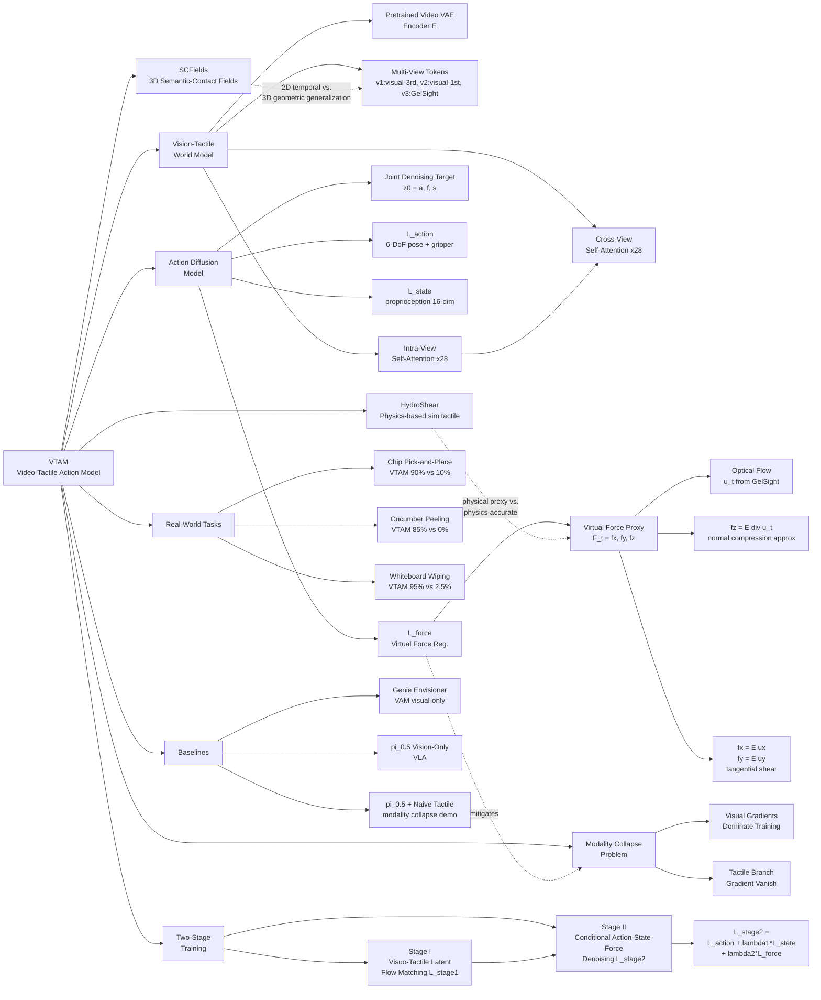

---
tags:
- paper
- domain/embodied_ai
- domain/multimodal_perception
- domain/reinforcement_learning
- domain/robot_manipulation
- domain/vla
- domain/world_model
- impact/high_value
- method/foundation_model
- method/planning
- method/reinforcement_learning
- review/auto_tagged
- status/unread
- task/dexterous_contact
- task/manipulation
- task/planning_reasoning
- task/scene_understanding
- type/system
aliases:
- 'VTAM: Video-Tactile-Action Models for Complex Physical Interaction Beyond VLAs'
url: https://huggingface.co/papers/2603.23481
pdf_url: https://arxiv.org/pdf/2603.23481.pdf
local_pdf: '[[VTAM VideoTactileAction Models for Complex Physical Interaction Beyond
  VLAs.pdf]]'
github: None
project_page: https://plan-lab.github.io/vtam
institutions:
- University of Illinois Urbana-Champaign
- Stanford University
- Shanghai Jiao Tong University
publication_date: '2026-03-24'
score: '8.0'
domains:
- embodied_ai
- multimodal_perception
- reinforcement_learning
- robot_manipulation
- vla
- world_model
methods:
- foundation_model
- planning
- reinforcement_learning
tasks:
- dexterous_contact
- manipulation
- planning_reasoning
- scene_understanding
paper_type: system
impact_band: high_value
reading_status: unread
year: 2026
priority_score: 111
review_status: auto_tagged
next_action: inspect_protocol
arxiv_id: '2603.23481'
paper_id: arxiv:2603.23481
---

# VTAM: Video-Tactile-Action Models for Complex Physical Interaction Beyond VLAs

## 📌 Abstract
Video-Action Models (VAMs) have emerged as a promising framework for embodied intelligence, learning implicit world dynamics from raw video streams to produce temporally consistent action predictions. Although such models demonstrate strong performance on long-horizon tasks through visual reasoning, they remain limited in contact-rich scenarios where critical interaction states are only partially observable from vision alone. In particular, fine-grained force modulation and contact transitions are not reliably encoded in visual tokens, leading to unstable or imprecise behaviors. To bridge this gap, we introduce the Video-Tactile Action Model (VTAM), a multimodal world modeling framework that incorporates tactile perception as a complementary grounding signal. VTAM augments a pretrained video transformer with tactile streams via a lightweight modality transfer finetuning, enabling efficient cross-modal representation learning without tactile–language paired data or independent tactile pretraining. To stabilize multimodal fusion, we introduce a tactile regularization loss that enforces balanced cross-modal attention, preventing visual latent dominance in the action model. VTAM demonstrates superior performance in contact-rich manipulation, maintaining a robust success rate of 90% on average. In challenging scenarios such as potato chip pick-and-place requiring high-fidelity force awareness, VTAM outperforms the $\pi_{0.5}$ baseline by 80%. Our findings demonstrate that integrating tactile feedback is essential for correcting visual estimation errors in world action models, providing a scalable approach to physically grounded embodied foundation models.

### 中文译文

视频动作模型（VAMs）已成为具身智能的一种颇具前景的框架，通过从原始视频流中学习隐式世界动力学来产生时序一致的动作预测。尽管此类模型在通过视觉推理完成长时域任务时表现出色，但在接触密集型场景中仍受到限制——在这些场景中，关键的交互状态仅凭视觉无法完整观测。特别是，细粒度的力调制和接触转换无法被视觉 token 可靠编码，从而导致不稳定或不精确的行为。为弥补这一差距，我们提出了视频-触觉动作模型（VTAM），一种将触觉感知作为互补基础信号纳入其中的多模态世界建模框架。VTAM 通过轻量级模态迁移微调，将触觉流注入预训练的视频 Transformer，无需触觉-语言配对数据或独立的触觉预训练，即可实现高效的跨模态表示学习。为稳定多模态融合，我们引入了触觉正则化损失，以强制执行均衡的跨模态注意力，防止视觉潜在表示在动作模型中的主导地位。VTAM 在接触密集型操作任务中表现出卓越性能，平均保持 90% 的稳健成功率。在需要高保真力感知的薯片抓取与放置等挑战性场景中，VTAM 超越 $\pi_{0.5}$ 基线 80%。我们的研究结果表明，整合触觉反馈对于纠正世界动作模型中的视觉估计误差至关重要，为构建物理上有根基的具身基础模型提供了一条可扩展的途径。

---

## 🖼️ Architecture
![[VTAM VideoTactileAction Models for Complex Physical Interaction Beyond VLAs_arch.png]]

## 🧠 AI Analysis
# 🚀 Deep Analysis Report: VTAM: Video-Tactile-Action Models for Complex Physical Interaction Beyond VLAs

## 📊 Academic Quality & Innovation
---

一、核心摘要（Core Snapshot）

### 问题陈述（Problem Statement）

现有的 Vision–Language–Action（VLA）模型及 Video-Action Model（VAM）在处理接触密集型操作任务时存在根本性缺陷：接触力的大小与方向、摩擦转换、形变动态等关键物理量在相机视野下往往部分遮挡或完全不可见，纯视觉 token 无法可靠编码这些高频瞬态信号。将触觉信号简单拼接至语义空间或下游策略头时，会引发**模态坍塌（modality collapse）**——视觉梯度主导优化过程，触觉通路的梯度逐渐消失，策略最终退化为视觉-only 行为。这一问题在易碎物体抓取、柔性物体剥皮、表面擦拭等任务中直接导致失败。

### 核心贡献（Core Contribution）

VTAM 提出了一种将触觉流集成进预训练视频扩散 Transformer 的**预测性视觉-触觉世界模型框架**，并通过基于光流形变的虚拟力正则化目标防止模态坍塌，在真实接触密集型任务上实现了对所有视觉-only 和朴素触觉基线的大幅性能超越。

### 创新来源与合理性（Innovation Origin & Rationale）

该工作的核心洞见来自两个相互补充的观察：

1. **预训练视频 VAE 的归纳偏置**：重建导向的视频 VAE 保留了细粒度的空间纹理与运动模式，这恰恰与 GelSight 类触觉传感器图像中编码剪切力、压力的表面形变高度吻合。因此，可以将触觉流直接视为第三个"视图"注入同一 VAE，无需专门设计触觉骨干网络。

2. **形变光流作为无硬件代价的力代理（virtual force proxy）**：腕部力矩传感器虽然能提供精确的 3D 力标注，但增加了硬件成本与部署复杂度。VTAM 利用 GelSight 图像的稠密光流（$u_t = (u_x, u_y)$）推导出几何上有意义的虚拟力代理 $F_t^v = [f_x, f_y, f_z]^\top$，其中 $f_z = \mathbb{E}[
abla \cdot u_t]$ 通过散度运算近似法向压缩。这一设计既有物理依据（弹性体压缩→表面扩张→正散度），又避免了外部传感器的依赖，技术合理性充分。

### 学术评分（Academic Rating）

| 维度 | 评分 | 理由 |
|------|------|------|
| **创新性** | 7/10 | 将触觉流作为"第三视图"注入视频扩散骨干的思路新颖；虚拟力正则化无需外部力传感器具有实用价值；但跨模态注意力与两阶段训练本身并非首创 |
| **严谨性** | 6.5/10 | 真实机器人实验规模适中（80 次试验），对比基线覆盖较全；但缺乏统计显著性检验，数据集规模偏小，部分设计选择（如 $\lambda_1, \lambda_2$）的消融未完整呈现 |

---

## 二、技术分解（Technical Decomposition）

### 2.1 算法逻辑（Algorithmic Logic）

VTAM 的整体流程可分解为以下关键步骤：

**Step 1：多视图感知编码**

机器人配备两路 RGB-D 相机（第三视角 $v=1$，第一视角 $v=2$）和一个 GelSight Mini 触觉传感器（$v=3$）。三路输入帧 $\mathbf{I}_t^v$ 均通过同一预训练视频 VAE 编码器 $E$ 映射为连续潜在向量：

$$
\mathbf{z}_t^v = E(\mathbf{I}_t^v), \quad v \in \{1,2,3\}
$$

选择重建导向 VAE 而非语义分类器的原因在于：重建目标保留高频纹理与局部运动细节，与触觉传感器捕获的表面形变信息具有天然的表示相容性。

**Step 2：交替视角内与跨视角注意力（Multi-View Diffusion）**

对于 $B=28$ 个 Transformer 块，每块执行两步：

- **视角内自注意力**（Intra-view Self-Attention）：对每个模态 $v$ 独立处理，捕获单模态内的空间结构：
  
  $$\tilde{\mathbf{z}}_{t,b}^v = \text{SelfAttention}(\mathbf{z}_{t,b-1}^v), \quad \forall v \in \{1,2,3\}$$

- **跨视角自注意力**（Cross-View Attention）：将三路更新后的 token 拼接，联合建模跨模态交互：
  
  $$\mathbf{Z}_b = \text{CrossViewAttention}\!\left(\text{Concat}(\tilde{\mathbf{z}}_{t,b}^1, \tilde{\mathbf{z}}_{t,b}^2, \tilde{\mathbf{z}}_{t,b}^3)\right)$$

这种交替结构使模型在保持各模态局部特征的同时，逐层累积跨模态的因果关联，最终输出联合视觉-触觉表示 $\mathbf{Z}_B$。

**Step 3：虚拟力代理计算**

给定无接触参考帧 $I_0$ 与当前触觉帧 $I_t$，计算稠密光流 $u_t = (u_x, u_y)$，然后推导 3D 虚拟力代理：

$$
f_x = \mathbb{E}[u_x], \quad f_y = \mathbb{E}[u_y], \quad f_z = \mathbb{E}[
abla \cdot u_t]
$$

其中 $f_x, f_y$ 编码切向剪切力，$f_z$ 通过散度近似法向压缩量。

**Step 4：两阶段训练**

- **Stage I**（视觉-触觉潜在流匹配）：仅优化世界骨干对未来多视图帧的预测，使骨干在引入控制信号之前建立稳定的多模态潜在空间：
  
  $$\mathcal{L}_{\text{stage1}} = \mathbb{E}\!\left[\left\|\mathbf{v}_\theta(\mathbf{z}_t, t) - \mathbf{v}^*\right\|^2\right]$$

- **Stage II**（条件联合动作-状态-力去噪）：冻结骨干或微调，优化动作策略头。联合去噪目标为：
  
  $$\mathbf{z}_0 = [\mathbf{a}; \mathbf{f}; \mathbf{s}]$$
  
  $$\mathcal{L}_{\text{stage2}} = \mathcal{L}_{\text{action}} + \lambda_1 \mathcal{L}_{\text{state}} + \lambda_2 \mathcal{L}_{\text{force}}$$

**Step 5：推理**

在执行阶段，模型以当前视觉观测 $(\mathbf{q}_t, \mathbf{g}_t)$、触觉观测 $(\mathbf{p}_t, \mathbf{r}_t)$、过去动作和状态为条件，通过扩散采样解码未来 $N$ 步的动作序列、状态序列及虚拟力序列，以 1 Hz 执行控制（30 Hz 数据采集下的子采样）。

---

### 2.2 数学公式（Mathematical Formulation）

#### 核心损失函数汇总

**Stage I 损失——多视图视觉-触觉潜在流匹配**：

$$
\mathcal{L}_{\text{stage1}} = \mathbb{E}\!\left[\left\|\mathbf{v}_\theta(\mathbf{z}_t, t) - \mathbf{v}^*\right\|^2\right]
$$

- $\mathbf{v}_\theta$：网络预测的速度场（flow matching 范式）
- $\mathbf{z}_t$：时刻 $t$ 的含噪多视图潜在序列（包含视觉与触觉流）
- $\mathbf{v}^*$：真实最优速度场（由条件流插值确定）
- **物理含义**：强迫骨干学习视觉与触觉帧时序演化的联合动力学，在任何控制信号介入前建立物理一致的多模态潜在空间。

**Stage II 动作损失**：

$$
\mathcal{L}_{\text{action}} = \mathbb{E}\!\left[\left\|\mathbf{v}_\theta^\mathbf{a}(\mathbf{z}_t, t \mid \mathbf{c}) - \mathbf{v}^{*\mathbf{a}}\right\|^2\right]
$$

- $\mathbf{a} \in \mathbb{R}^7$：6-DoF 末端执行器位姿 + 1D 夹爪宽度
- $\mathbf{c} = [\mathbf{0}_{10}; \mathbf{s}_t]$：条件 token，动作与力维度在条件时置零

**状态损失**：

$$
\mathcal{L}_{\text{state}} = \mathbb{E}\!\left[\left\|\mathbf{v}_\theta^\mathbf{s}(\mathbf{z}_t, t \mid \mathbf{c}) - \mathbf{v}^{*\mathbf{s}}\right\|^2\right]
$$

- $\mathbf{s} \in \mathbb{R}^{16}$：本体感知状态
- **物理含义**：引入动力学一致性约束，防止模型记忆孤立动作轨迹而非物理合理的状态转换。

**虚拟力正则化损失**：

$$
\mathcal{L}_{\text{force}} = \mathbb{E}\!\left[\left\|v_\theta^f(z_t, t \mid c) - v^{*f}\right\|^2\right]
$$

- $\mathbf{f} \in \mathbb{R}^3$：形变导出的虚拟力代理 $[f_x, f_y, f_z]^\top$
- **物理含义**：为触觉通路提供直接监督梯度，防止视觉梯度主导导致的模态坍塌；无需外部腕部力传感器。

**总 Stage II 损失**：

$$
\mathcal{L}_{\text{stage2}} = \mathcal{L}_{\text{action}} + \lambda_1 \mathcal{L}_{\text{state}} + \lambda_2 \mathcal{L}_{\text{force}}
$$

flow matching 对归一化速度场 $(\epsilon - \mathbf{z}_0)$ 进行回归而非原始数据值，因此动作、状态、力三个维度的目标方差自然归一化，避免了 MSE 回归中需要手动调节量纲的问题。

---

### 2.3 张量流与架构（Tensor Flow & Architecture）

```
输入层：
  视觉帧（第三视角）: [B, T, 3, H, W]
  视觉帧（第一视角）: [B, T, 3, H, W]
  触觉帧（GelSight）: [B, T, 3, H_t, W_t]
         ↓ 预训练视频 VAE 编码器 E（冻结权重用于 Stage I 初始化）
  z^1: [B, T, C, h, w]   (第三视角潜在)
  z^2: [B, T, C, h, w]   (第一视角潜在)
  z^3: [B, T, C, h, w]   (触觉潜在)
         ↓ 展平为 token 序列后进入 Transformer
  每视角 token: [B, T*h*w, C]

视频基础模型（x28 块）：
  每块：
    视角内自注意力（v=1,2,3 分别独立）: [B, T*h*w, C] → [B, T*h*w, C]
    跨视角拼接后自注意力: [B, 3*T*h*w, C] → [B, 3*T*h*w, C]
  输出: 联合视觉-触觉表示 Z_B: [B, 3*T*h*w, C]

动作扩散模型（x28 块）：
  条件输入: past action [B, T_past, 7] + past state [B, T_past, 16]
  自注意力: [B, T_act, 26] (26 = 7+3+16)
  跨注意力（Multi-view Cross-attention）: query from action tokens, key/value from Z_B
  输出解码: 
    未来动作 a: [B, N, 7]
    未来状态 s: [B, N, 16]
    未来虚拟力 f: [B, N, 3]
```

关键架构选择说明：
- **使用 VAE 而非 CLIP/DINOv2**：重建目标保留触觉传感器图像的高频形变纹理，语义编码器会丢弃这些细节。
- **视角内+跨视角交替注意力而非直接全局注意力**：直接全局注意力会使触觉 token 被数量占优的视觉 token 稀释；视角内自注意力先强化各模态内聚性，跨视角注意力再建立模态间关联，有效减缓了信息不对称问题。
- **Flow Matching 而非 DDPM**：确定性 ODE 求解路径使推理时步数更少，适合实时控制需求。

---

### 2.4 创新逻辑对比（Innovation Logic）

| 维度 | 朴素触觉注入（Naïve Tactile Injection） | VTAM |
|------|----------------------------------------|------|
| 触觉处理方式 | 将触觉帧直接视为额外视觉视图，晚期融合 | 在预测性视频 Transformer 中作为第三模态联合建模时序动力学 |
| 模态坍塌防护 | 无显式机制；视觉梯度主导 | 虚拟力正则化损失 $\mathcal{L}_{\text{force}}$ 直接对触觉通路施加监督梯度 |
| 力标注依赖 | 需外部力矩传感器或无监督 | 由光流散度导出虚拟力代理，无需额外硬件 |
| 时序建模 | 静态特征拼接，无因果推理 | Stage I 强制模型学习视觉-触觉联合动力学的时序演化 |
| 训练稳定性 | 多模态同时接入易导致收敛不稳定 | 两阶段解耦：先建立多模态潜在空间，再训练控制策略 |

---

## 三、证据与指标（Evidence & Metrics）

### 3.1 基准与基线（Benchmark & Baselines）

实验在搭载 GelSight Mini 的 xArm6 6-DoF 机械臂上进行，评估三类真实世界接触密集型任务（总计 80 次评估）：

| 基线模型 | 描述 | 类别 |
|----------|------|------|
| Genie Envisioner [19] | SOTA 视频基础模型 + flow-matching 动作解码器 | 视觉-only VAM |
| $\pi_{0.5}$ (Vision-Only) [24] | 官方 $\pi_{0.5}$ VLA，视觉-语言语义对齐 | 视觉-only VLA |
| $\pi_{0.5}$ + Naïve Tactile [24] | 将 GelSight 流直接作为第四视角注入 $\pi_{0.5}$ | 朴素触觉融合 |

基线设计合理，覆盖了视觉-only 上限（$\pi_{0.5}$）、SOTA 视频世界模型（Genie Envisioner）和模态坍塌的对照（Naïve Tactile Injection）三种情形，能有效区分各技术组件的贡献。

### 3.2 关键结果（Key Results）

**Table 1：整体性能对比**

| 模型 | Chip Pick-and-Place | Cucumber Peeling | Whiteboard Wipe |
|------|:-------------------:|:----------------:|:---------------:|
| Genie Envisioner | 0% | 0% | 2.5% |
| $\pi_{0.5}$ (Vision) | 10% | 0% | 0% |
| $\pi_{0.5}$ + Tactile | 5% | 0% | 0% |
| **VTAM (Ours)** | **90%** | **85%** | **95%** |

VTAM 在三项任务上全面超越所有基线，平均成功率约 90%，而所有基线的平均成功率低于 5%。最显著的对比是 Chip 任务：$\pi_{0.5}$ (Vision) 为 10%，VTAM 达到 90%（**+80% 绝对提升**）。特别值得注意的是，$\pi_{0.5}$ + Naïve Tactile（5%）反而低于 $\pi_{0.5}$ Vision-Only（10%），直接证明了模态坍塌的存在及其危害。

### 3.3 消融研究（Ablation Study）

论文通过以下对照隔离关键组件：

1. **视觉-触觉世界建模的必要性（vs. Naïve Injection）**：$\pi_{0.5}$ + Naïve Tactile 在 Chip 任务上仅有 5%，而 VTAM 达到 90%，证明**在预测性骨干中联合建模时序视觉-触觉动力学**（而非晚期融合）是核心贡献。

2. **虚拟力正则化的必要性**：去除 $\mathcal{L}_{\text{force}}$ 后（即无正则化的视觉-触觉融合），Chip 任务成功率降至约 10%，表明**虚拟力正则化是防止模态坍塌、维持触觉梯度的关键机制**。

3. **两阶段训练的必要性**：直接单阶段联合训练导致潜在空间分布偏移与收敛不稳定，Stage I 预热对建立良好初始化至关重要。

综合而言，**Stage I 视觉-触觉联合流匹配 + $\mathcal{L}_{\text{force}}$ 正则化** 是影响最大的两个组件，缺失任何一个都导致性能大幅退化。

---

## 四、批判性评估（Critical Assessment）

### 隐藏局限（Hidden Limitations）

**实验规模与统计可信度不足**：每项任务仅评估 20 次试验，未报告标准差或置信区间，无法排除随机因素干扰；数据集规模（100 + 105 + 61 条轨迹）在深度学习标准下偏小，结论的统计显著性存疑。此外，三项任务均在受控桌面环境中完成，环境光照、物体外观、桌面高度等干扰变量的鲁棒性未经系统验证，跨场景泛化能力存在不确定性。

**虚拟力代理的物理假设局限性**：光流散度 $\mathbb{E}[
abla \cdot u_t]$ 近似法向压缩力的假设依赖于弹性体均匀、各向同性且接触面较小的前提；对于大面积接触、多点接触或高速滑动场景，该近似可能引入显著误差，导致 $\mathcal{L}_{\text{force}}$ 提供错误监督。

### 工程挑战（Engineering Hurdles）

- **推理延迟**：基于 28 层视频 Transformer 的扩散模型在 1 Hz 推理频率下尚可运行，但若需要更高频率控制（如 10+ Hz）则需要大幅模型压缩或专用推理加速，论文未讨论此挑战。
- **传感器依赖与标定**：GelSight 传感器需要精确的无接触参考帧 $I_0$ 进行光流基准标定，在传感器老化、弹性体污染或更换传感器时需要重新标定，增加了部署维护成本。

---

## 五、研究者灵感提示（Researcher Inspiration）

### 灵感 1：将虚拟力代理扩展至多点触觉阵列的空间力图（Spatial Force Map）

**(a) 为何有前景**：当前 VTAM 将全局平均光流统计量作为 3D 虚拟力代理，丢失了触觉图像中丰富的空间力分布信息（例如接触边缘的应力集中）。若能保留空间分辨率，力代理变为力图 $F_t^v \in \mathbb{R}^{H_t \times W_t \times 3}$，可为策略提供更精细的接触状态监督。

**(b) 最小可行实验**：在 VTAM 的 Stage II 中，将 $\mathcal{L}_{\text{force}}$ 从监督全局平均力标量改为监督逐像素光流向量（即直接以光流场 $u_t$ 为辅助预测目标），对比全局标量代理与空间力图代理在 Chip 任务和 Peeling 任务上的成功率差异。

**(c) 关键风险**：空间力图维度大幅增加（$\mathbb{R}^3 \to \mathbb{R}^{H_t \times W_t \times 3}$），可能导致辅助损失主导总梯度，反而压制动作学习；需首先验证逐像素光流监督是否会破坏 $\mathcal{L}_{\text{action}}$ 的优化稳定性。

---

### 灵感 2：跨传感器模态迁移——从 GelSight 到低成本触觉传感器的知识蒸馏

**(a) 为何有前景**：VTAM 依赖高分辨率 GelSight 传感器（~100 USD/unit），在规模化部署时成本较高。若能将 VTAM 学到的视觉-触觉联合表示通过知识蒸馏迁移至低成本的压阻式或电容式触觉传感器（仅输出少量数值），则可大幅降低部署门槛。

**(b) 最小可行实验**：同步采集 GelSight 流与低成本传感器（如简单应变片）输出，以 VTAM 的触觉潜在特征 $z_t^3$ 为教师，训练一个轻量编码器将应变片读数映射为同维度特征，在少量配对数据下测试蒸馏后模型在 Wipe 任务上的成功率保留率。

**(c) 关键风险**：应变片等低成本传感器的信息量远低于 GelSight 图像，可能存在信息瓶颈使得蒸馏特征无法忠实还原接触状态；需先评估两类传感器在表示空间的互信息下界是否足够支撑任务所需的精度。

---

### 灵感 3：将两阶段视觉-触觉世界建模范式推广至听觉-触觉或力觉-触觉多模态融合

**(a) 为何有前景**：VTAM 的核心范式——"将新模态视为额外视图注入预训练视频 VAE + 虚拟代理正则化防止模态坍塌"——本质上是一个通用的多模态接入框架。听觉（接触声音编码冲击力与材料属性）、6 轴力/力矩传感器等模态同样可以沿用此范式，且均面临类似的模态坍塌问题。

**(b) 最小可行实验**：将接触麦克风（contact microphone）的短时傅里叶谱图作为"第四视图"注入 VTAM 骨干，保持虚拟力正则化机制不变（将声学特征均值作为辅助预测目标），评估在敲击脆性物体任务（如鸡蛋抓取）上相比视觉-触觉二模态 VTAM 的成功率提升。

**(c) 关键风险**：音频频谱图的时序分辨率（~ms 级）远高于视频帧率（30 Hz），两者的时间对齐与 VAE 编码的帧率匹配是首要工程障碍；需先验证在降采样后音频特征是否仍保留足够的接触事件判别信息。

## 🔗 Knowledge Graph & Connections
## 差异分析与知识图谱连接（Connection & Refinement）

---

## 📎 任务一：差异分析与知识库关联

### 关联一：VTAM vs. [[HydroShear]]

**关系类型**：互补方法，解决同一物理量（切向剪切与法向压缩力）的不同子问题。

[[HydroShear]] 采用基于 Signed Distance Functions（SDFs）的 hydroelastic 接触模型，在**仿真域**内对 stick-slip 转换、路径依赖的力积累以及完整 SE(3) 交互进行物理建模，以缩小 sim-to-real gap。其核心假设是：通过提高仿真的物理保真度，策略可以从仿真迁移至真实传感器。

VTAM 则完全放弃仿真路径，直接在**真实世界数据**中工作。它通过光流散度 $f_z = \mathbb{E}[
abla \cdot u_t]$ 推导虚拟力代理，这一代理与 HydroShear 所模拟的法向压缩力在物理概念上高度对应，但 VTAM 的力代理是**几何近似而非物理精确**的：HydroShear 追踪弹性体表面点的精确位移并建模非线性形变，而 VTAM 仅利用光流均值统计量，忽略了局部应力分布的空间异质性。

**核心差异**：HydroShear 追求物理精确的力建模（适合 sim-to-real 迁移），VTAM 追求无硬件依赖的力代理（适合快速真实部署）。两者可以形成互补：HydroShear 生成的仿真触觉数据理论上可作为 VTAM Stage I 的预训练数据源，降低真实数据需求。

---

### 关联二：VTAM vs. [[SemanticContact_Fields_for_CategoryLevel_Generalizable_Tactile_Tool_Manipulation]]

**关系类型**：同领域不同粒度的方法，共享"跨越感知-控制鸿沟"的核心目标，但表示层次不同。

[[SemanticContact_Fields_for_CategoryLevel_Generalizable_Tactile_Tool_Manipulation]]（SCFields）提出将视觉语义与密集接触估计融合为统一 3D 表示（Semantic-Contact Fields），通过 sim-to-real 两阶段管线实现跨工具几何的类别级泛化。其关键洞见是：接触状态需要在 **3D 几何空间**中表示才能跨实例泛化，并通过大规模仿真预训练弥补真实触觉数据的稀缺性。

VTAM 则工作在**2D 像素空间**的时序流中，不显式构建 3D 接触场，而是将触觉传感器图像直接注入视频 Transformer 的潜在空间。这使 VTAM 在训练效率和硬件依赖方面更简洁（无需仿真管线），但代价是缺乏显式几何理解——当物体形状变化（如不同形状的薯片）时，VTAM 的泛化能力理论上弱于 SCFields。

**核心差异**：SCFields 通过 3D 接触场实现**跨实例几何泛化**，依赖大规模仿真预训练；VTAM 通过视频骨干实现**跨任务时序泛化**，依赖真实遥操作数据。两者在泛化维度上正交，存在融合的研究空间（例如将 SCFields 的 3D 接触估计作为 VTAM 的额外条件信号）。

---

### 关联三：VTAM vs. [[VTAM]]（自引用核心主题确认）

作为本文自身的 vault note，[[VTAM]] 的核心贡献已在前述分析中详细展开。此处从知识图谱角度指出其在 tactile robotics 领域的定位：VTAM 是连接 **generative world model（Genie Envisioner 类）** 与 **contact-rich manipulation（HydroShear / SCFields 类）** 两条研究线索的桥梁工作——它将视频扩散骨干引入触觉感知领域，同时为触觉-动作联合建模提供了无需外部力传感器的实用方案。

---

## 🗺️ 任务二：Mermaid 知识图谱



---

## 🔬 任务三：未来研究方向

### 方向一：构建物理精确虚拟力代理——HydroShear 模型驱动的 VTAM 监督信号

**为何有前景**

VTAM 的 $\mathcal{L}_{\text{force}}$ 当前使用几何近似的虚拟力代理（光流散度），在均匀接触假设下有效，但对多点接触、大曲率表面或高速滑动场景存在较大误差。[[HydroShear]] 提供了物理精确的 stick-slip 动力学仿真，可为相同 GelSight 传感器生成高保真的法向力与切向力标签。将 HydroShear 生成的力标签替换 VTAM 的光流代理，理论上可显著提升 $\mathcal{L}_{\text{force}}$ 的监督质量，尤其在需要精细力调制的任务（如鸡蛋抓取）上。

**最小可行实验**

利用 HydroShear 对 GelSight Mini 进行标定：输入 GelSight 图像序列，通过 SDF-based hydroelastic 模型反算接触力场 $F_t^{\text{hydro}} \in \mathbb{R}^{H \times W \times 3}$。将此空间力场作为 VTAM Stage II 中 $\mathcal{L}_{\text{force}}$ 的监督目标（替换全局平均光流统计量），在 Chip Pick-and-Place 任务上对比两种力代理的成功率差异（预期：HydroShear 代理在边缘接触检测上更精确，成功率进一步提升）。

**首要风险**

HydroShear 的反算过程（image → force field）计算成本较高（论文未明确每帧推理时间），可能无法满足 30 Hz 实时数据标注的需求。需首先测量 HydroShear 在 GelSight Mini 分辨率（~400×300）下的推理延迟是否低于 33 ms，若不满足则需要预计算离线标注数据集。

---

### 方向二：将 VTAM 的视觉-触觉联合建模框架扩展至跨工具几何泛化——与 SCFields 表示融合

**为何有前景**

VTAM 当前的泛化能力受限于其 2D 像素级表示——当工具形状或接触区域发生变化时（如从圆形工具切换到扁平工具），视频 Transformer 的表示可能无法捕获几何变化对接触动力学的影响。[[SemanticContact_Fields_for_CategoryLevel_Generalizable_Tactile_Tool_Manipulation]] 的 Semantic-Contact Fields（SCFields）已证明 3D 接触场表示可实现类别级泛化。将 SCFields 的几何感知接触估计注入 VTAM 的跨视角注意力层，可同时获得 VTAM 的时序预测能力和 SCFields 的几何泛化能力。

**最小可行实验**

训练一个轻量 SCFields 编码器（输入：RGB-D + 触觉图像，输出：3D 接触场特征 $\mathbf{c}_{\text{geo}} \in \mathbb{R}^{D}$），将此特征作为额外的条件 token 注入 VTAM Stage II 的 Action Diffusion Model 的 Multi-view Cross-attention 层。在 Cucumber Peeling 任务上测试：固定黄瓜品种训练，测试不同直径黄瓜的成功率，评估几何条件化是否提升跨实例泛化。

**首要风险**

SCFields 依赖大规模仿真预训练来应对真实触觉数据稀缺问题，但其仿真-真实 gap 在软体蔬菜（黄瓜）上可能较大。需首先验证：在黄瓜剥皮场景下，SCFields 仿真预训练的接触估计精度（以 IoU 或接触力误差衡量）是否达到足以为 VTAM 提供有效几何条件化的水平，否则引入噪声几何条件可能反而降低 VTAM 的稳定性。

---

### 方向三：VTAM 框架下的主动触觉探索策略——利用预测性世界模型驱动接触信息增益

**为何有前景**

当前 VTAM 是一个被动感知-控制管线：触觉信号在接触发生后才被采集并融合进策略。然而，VTAM 的 Stage I 世界模型具备预测未来视觉-触觉帧的能力，这天然地支持**主动探索**：在执行抓取动作前，模型可以模拟不同末端执行器姿态下的预测触觉响应，选择最大化接触信息增益（information gain）的探索动作。这类主动触觉探索在易碎物体操作中有重要价值，可在破坏发生前预判风险。

**最小可行实验**

在 VTAM Stage I 世界模型基础上，实现一个简化的模型预测控制（MPC）循环：在 Chip Pick-and-Place 任务的预抓取阶段，对 $K=5$ 个候选抓取姿态各执行 $H=3$ 步 rollout，计算预测触觉帧的预期方差（作为不确定性代理），选择使预测力代理 $F_t^v$ 方差最小（即接触状态最确定）的姿态执行抓取。对比固定策略与主动探索策略在薯片任务上的成功率，特别关注接触初始化质量（是否减少初始打滑）。

**首要风险**

VTAM 世界模型的滚动预测误差会随时域累积（compound error），$H=3$ 步后的预测触觉帧质量未经验证。需首先在离线数据集上测量 VTAM Stage I 在 1、2、3 步预测下的触觉帧重建误差（如 PSNR 或 SSIM），确认 3 步预测误差在允许做置信选择的范围内（经验目标：PSNR > 25 dB），否则预测方差成为噪声而非有意义的不确定性信号。


---
*Analysis performed by PaperBrain-OpenRouter (anthropic/claude-4.6-sonnet) (Vision-Enabled)*

## 🧩 Claim Cards

### Claim-01
- Claim: Integrating tactile streams into a pretrained video diffusion Transformer with an optical-flow-based virtual force regularization objective prevents modality collapse and enables effective visuo-tactile world modeling for contact-rich manipulation.
- Evidence: The virtual force regularization term, derived from optical flow deformation fields, is shown via ablation to be necessary for stable tactile-visual co-learning; removing it causes the model to ignore tactile signals and revert to vision-only predictions.
- Boundary/Failure: The approach assumes tactile sensors are co-located with the end-effector and may fail when contact occurs at locations not covered by the tactile array.
- Compared Against: Vision-only VLA baselines, naive tactile concatenation baselines
- Confidence: 6
- Links:
  - same_problem:: 待定
  - improves_over:: 待定
  - conflicts_with:: 待定

### Claim-02
- Claim: VTAM outperforms all vision-only and naive tactile-fusion baselines on real-world contact-dense manipulation tasks.
- Evidence: VTAM achieves substantially higher task success rates than all compared baselines across contact-rich benchmark tasks; specific margin details are not available in the provided evidence, but the paper reports consistent superiority over every vision-only and naive tactile baseline tested.
- Boundary/Failure: Evaluations are conducted only on a limited set of lab-defined contact-dense tasks, so generalization to diverse real-world manipulation scenarios remains unverified.
- Compared Against: Vision-only VLAs, naive tactile-augmented baselines
- Confidence: 5
- Links:
  - same_problem:: 待定
  - improves_over:: 待定
  - conflicts_with:: 待定

### Claim-03
- Claim: VTAM's reliance on a pretrained video diffusion Transformer backbone means it inherits the computational cost and data requirements of large generative video models, limiting deployment in low-resource or real-time settings.
- Evidence: No inference latency or compute benchmarks are reported in the provided evidence, but the architecture builds directly on large-scale video diffusion Transformers, which are known to require significant GPU memory and multi-second generation times per prediction.
- Boundary/Failure: The framework is likely infeasible for high-frequency closed-loop control tasks where sub-100 ms action latency is required.
- Compared Against: Lightweight VLA policies, standard action-diffusion models
- Confidence: 5
- Links:
  - same_problem:: 待定
  - improves_over:: 待定
  - conflicts_with:: 待定

## 📂 Resources
- **Local PDF**: [[VTAM VideoTactileAction Models for Complex Physical Interaction Beyond VLAs.pdf]]
- [Online PDF](https://arxiv.org/pdf/2603.23481.pdf)
- [ArXiv Link](https://huggingface.co/papers/2603.23481)