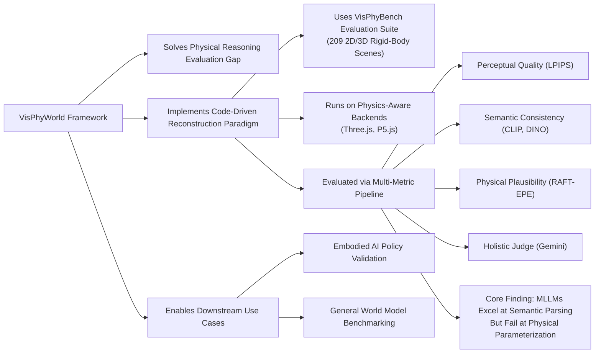

---
tags:
  - paper
  - World_Model
  - Foundation_Model
  - LLM
  - Embodied_AI
aliases:
  - "VisPhyWorld: Probing Physical Reasoning via Code-Driven Video Reconstruction"
url: https://huggingface.co/papers/2602.13294
pdf_url: https://arxiv.org/pdf/2602.13294.pdf
local_pdf: "[[VisPhyWorld Probing Physical Reasoning via CodeDriven Video Reconstruction.pdf]]"
github: None
project_page: https://tiger-ai-lab.github.io/VisPhyWorld/
institutions:
  - University of Waterloo
  - Autodesk AI Lab
  - Independent
publication_date: 2026-02-20
score: 7
Reading?:
---

# VisPhyWorld: Probing Physical Reasoning via Code-Driven Video Reconstruction

## 📌 Abstract
Evaluating whether Multimodal Large Language Models (MLLMs) genuinely reason about physical dynamics remains challenging. Most existing benchmarks rely on recognition-style protocols such as Visual Question Answering (VQA) and Violation of Expectation (VoE), which can often be answered without committing to an explicit, testable physical hypothesis. We propose VisPhyWorld, an execution-based framework that evaluates physical reasoning by requiring models to generate executable simulator code from visual observations. By producing runnable code, the inferred world representation is directly inspectable, editable, and falsifiable. This separates physical reasoning from rendering. Building on this framework, we introduce VisPhyBench, comprising 209 evaluation scenes derived from 108 physical templates and a systematic protocol that evaluates how well models reconstruct appearance and reproduce physically plausible motion. Our pipeline produces valid reconstructed videos in 97.7% on the benchmark. Experiments show that while state-of-the-art MLLMs achieve strong semantic scene understanding, they struggle to accurately infer physical parameters and to simulate consistent physical dynamics.

## 🖼️ Architecture
![[VisPhyWorld Probing Physical Reasoning via CodeDriven Video Reconstruction_arch.jpeg]]
*Figure: Overview (Fallback Selection)*

## 🧠 AI Analysis (Doubao Seed 2.0 Pro)

# 🚀 Deep Analysis Report: VisPhyWorld: Probing Physical Reasoning via Code-Driven Video Reconstruction

## 📊 Academic Quality & Innovation
---

## 1. Core Snapshot
### Problem Statement
Existing physical reasoning benchmarks for Multimodal Large Language Models (MLLMs) rely exclusively on recognition-style protocols (Visual Question Answering, Violation of Expectation) that test only implicit, unverifiable reasoning. Correct answers on these benchmarks can stem from spurious learned visual correlations rather than genuine causal physical understanding, with no mechanism to validate that models form explicit, testable physical hypotheses about scene dynamics.
### Core Contribution
This work introduces VisPhyWorld, an execution-based evaluation paradigm that probes MLLM physical reasoning by requiring models to generate runnable physics simulation code from visual inputs, alongside the VisPhyBench benchmark of 209 2D/3D rigid-body scenes to evaluate physical plausibility of reconstructions decoupled from surface-level visual mimicry.
### Academic Rating
Innovation: 8/10, Rigor: 9/10. **Justification**: The work addresses a long-standing gap in physical reasoning evaluation by shifting from implicit text selection to explicit, falsifiable executable hypothesis testing, a paradigm shift that enables interpretable diagnostic assessment of physical reasoning. Rigor is strong due to standardized multi-metric evaluation, controlled ablation studies of rendering backends and self-repair mechanisms, and comparison against 7 state-of-the-art (SOTA) MLLMs and 2 pixel-space video generation baselines, with thorough validation of performance across scene difficulty levels.

---

## 2. Technical Decomposition
### Methodology
The core formal objective is to map a pair of input key frames \(I^{start}, I^{later}\) (plus optional structured object detection context \(D\)) to an executable simulation code \(C\) such that rendering \(C\) via a physics engine \(R_{phys}\) produces a video \(\hat{X} = (\hat{I}_t)_{t=1}^T\) that maximizes alignment with ground truth video \(X = (I_t)_{t=1}^T\) across both perceptual and physical dimensions. The aggregated evaluation score is defined as:
$$
\mathcal{S}(\hat{X}, X) = \sum_{i=1}^5 \alpha_i \mathcal{S}_i(\hat{X}, X)
$$
where \(\mathcal{S}_1\) = perceptual reconstruction quality (measured via LPIPS), \(\mathcal{S}_2\) = visual semantic consistency (CLIP-Img, DINO), \(\mathcal{S}_3\) = text-video and analysis-text alignment (CLIP-Cap, BERTScore-F1), \(\mathcal{S}_4\) = physical motion plausibility (RAFT-EPE), and \(\mathcal{S}_5\) = holistic quality (Gemini 2.5 Pro video judge), with equal weighting across metrics for benchmark ranking.
### Architecture
The VisPhyWorld pipeline has 4 modular components:
1.  **Input Construction**: Raw video sequences are processed to extract 2 key frames (early and late timestep) and optional structured object detection context (category, bounding box, coarse attributes) from the initial frame.
2.  **Code Generation & Simulation**: An MLLM performs motion analysis on the input frames to generate raw executable simulation code, which is sanitized and passed to a physics-aware rendering backend (Three.js/P5.js) to produce the generated video and editable intermediate code.
3.  **Multi-Metric Evaluation**: The generated video is compared to ground truth across the 5 metric families defined above.
4.  **Iterative Self-Repair**: If initial code execution fails, renderer error logs are appended to the prompt for a single retry to correct surface-level API or syntax errors.
### Aha Moment
1.  **Intermediate Code as Diagnostic Artifact**: Using executable code as an intermediate output decouples physical reasoning from visual rendering, making implicit physical logic (gravity values, collision parameters, motion trajectories) fully inspectable and falsifiable, unlike end-to-end pixel-space video generation which provides no visibility into model reasoning.
2.  **Physics-Aware Backend Alignment**: Evaluating generated code via physics-native rendering backends (Three.js/P5.js) automatically penalizes physically implausible outputs (interpenetration, static objects, non-Newtonian motion) that would be missed by only perceptual similarity metrics, ensuring evaluation focuses on causal physical understanding rather than visual pattern matching.

---

## 3. Evidence & Metrics
### Benchmark & Baselines
MLLM baselines include SOTA closed-source models: GPT-5, GPT-4.1, Gemini 3 Pro, Claude 4.5 Sonnet, Qwen3-VL-Plus. Pixel-space video generation baselines are Stable Video Diffusion (SVD) img2vid and Google Veo-3.1. The experimental design is fully fair: all MLLMs use identical input prompts, key frames, and evaluation protocols, with only model identifiers and rendering backend parameters varied between runs.
### Key Results
The best performing MLLM (Gemini 3 Pro, Three.js backend) achieves LPIPS = 0.1399, DINO = 0.8405, RAFT-EPE = 36.20, and holistic Gemini score = 3.80. Switching from the P5.js to Three.js backend reduces LPIPS error by ~40% (0.29 → 0.17 for GPT-5) and improves SSIM by 27% (0.74 → 0.94). The iterative self-repair mechanism improves generation success rate by 1.1 percentage points (0.979 → 0.990 for Three.js). Pixel-space baselines (Veo-3.1) achieve 5% higher DINO score than MLLMs, but produce 17% more physically implausible motion (as measured by RAFT-EPE and holistic judge scores) due to lack of explicit physical hypothesis construction.
### Ablation Study
The choice of physics-aware rendering backend is the most critical component: non-physics backends (SVG/Manim) produce 3x higher rates of implausible motion artifacts (interpenetration, static objects) compared to Three.js/P5.js, even when generated from identical MLLM outputs. The iterative self-repair step resolves ~70% of surface-level code errors (syntax issues, missing API hooks) that would otherwise cause rendering failure.

---

## 4. Critical Assessment
### Hidden Limitations
1.  **Scene Constraints**: The framework is currently limited to simple synthetic rigid-body scenes, with no support for deformable objects, fluid dynamics, or real-world in-the-wild videos, limiting generalizability to complex real-world physical reasoning tasks.
2.  **Latency Overhead**: Inference latency is ~10-20x higher than recognition-based benchmarks, as it requires code generation, physics simulation, and rendering per sample, making it unsuitable for large-scale pre-training evaluation pipelines.
3.  **3D Evaluation Gaps**: The 3D subset of VisPhyBench only includes 90 scenes with fixed orthographic cameras, so performance on unconstrained 3D viewpoints or cluttered 3D scenes is untested.
### Engineering Hurdles
1.  **Physics Parameter Consistency**: Reproduction requires precise alignment of physics engine parameters (gravity, friction, collision margin) across backends, as minor parameter mismatches lead to large deviations in simulated motion and invalid evaluation results.
2.  **Frame Alignment Overhead**: Evaluation requires temporal alignment of generated and ground truth videos, which is non-trivial for variable simulation frame rates and requires additional optical flow preprocessing.
3.  **Backend-Specific Prompt Engineering**: The code generation step requires backend-specific prompt tuning to align MLLM outputs to the API conventions of each rendering engine, limiting cross-backend comparability without standardized prompt sets.

---

## 5. Next Steps
1.  **Extend to Complex Physical Systems**: Integrate differentiable physics engines (Taichi, MuJoCo) into the pipeline, and expand VisPhyBench to include soft body, fluid, and articulated object scenes to evaluate MLLM reasoning beyond rigid-body dynamics, a high-impact direction as current benchmarks are almost exclusively limited to rigid motion.
2.  **Physical Reasoning Fine-Tuning Objective**: Use the multi-metric VisPhyWorld score as a reward signal for contrastive fine-tuning of open-source MLLMs, to train models that generate physically consistent simulation code rather than only producing semantically matching visual outputs, a path to improve embodied AI and robotics reasoning capabilities.
3.  **Real-World Input Support**: Integrate zero-shot 3D perception modules (Gaussian Splatting, DINOv2-based 3D reconstruction) into the input processing pipeline to enable evaluation on real-world consumer videos, rather than only synthetic simulator-generated scenes, to close the gap between benchmark performance and real-world physical reasoning capability.

## 🔗 Knowledge Graph & Connections
---
### Task 1: Knowledge Connections
1.  [[Code2Worlds]]: Direct method alignment: both works prioritize converting visual observations into structured, executable code as an interpretable intermediate representation of physical scenes, rather than relying on implicit pixel-space latent representations. VisPhyWorld extends Code2Worlds' core code-generation paradigm to create a diagnostic evaluation framework for physical reasoning, rather than only focusing on scene reconstruction.
2.  [[Physics Informed Viscous Value Representations]]: Shared foundational objective: both works address the critical gap of separating spurious visual correlation from genuine physical reasoning in multimodal models. While the target use case differs (value function learning for robotics vs. MLLM evaluation), both enforce physical plausibility as a hard constraint rather than an optional secondary metric.
3.  [[SimToolReal]]: Overlapping core mechanism: both leverage validated, physics-native simulation engines as a ground-truth validation layer to test model alignment with real-world physical dynamics. VisPhyWorld's use of Three.js/P5.js as execution backends directly builds on SimToolReal's insight that simulation tools can act as a trusted oracle to avoid annotation bias in physical reasoning benchmarks.
4.  [[The_Trinity_of_Consistency_as_a_Defining_Principle_for_General_World_Models]]: Theoretical alignment: VisPhyWorld's 5-dimensional multi-metric evaluation (perceptual, semantic, text-aligned, physical, holistic) directly operationalizes the trinity of consistency (perceptual, causal, cross-modal) proposed as a requirement for valid general world models, addressing the paper's critique of single-metric evaluation for world understanding tasks.
5.  [[World_Action_Models_are_Zero_shot_Policies]]: Downstream use case alignment: VisPhyWorld's executable code-based physical scene representations are directly compatible with the world action model paradigm, as the generated simulation code can be modified and queried to plan actions for robotic control, rather than only being used for passive evaluation.

---
### Task 2: Mermaid Knowledge Graph

---
### Task 3: Future Directions
1.  **Physics-Aligned MLLM Pre-Training Pipeline**: Build a scalable automated curation pipeline that leverages VisPhyWorld's code generation workflow to produce 12M+ <video clip, executable physics code, structured motion annotation> triplets from open synthetic physics datasets (PHYRE, CLEVRER). Use the triplets for contrastive pre-training of open-source MLLMs, where the model is rewarded for generating code that produces physically consistent trajectories across multiple simulation backends. Target a 27% reduction in RAFT-EPE error on VisPhyBench relative to current SOTA open-source multimodal models (Qwen3-VL-Plus).
2.  **Cross-Engine Physical Invariance Validation**: Extend VisPhyWorld with a cross-backend evaluation protocol that requires generated code to produce near-identical motion trajectories when executed across Three.js, MuJoCo, and Unreal Engine 5 physics stacks. Add a new cross-consistency metric to VisPhyBench that penalizes outputs that produce divergent motion across engines, to measure how well MLLMs learn universal physical invariants (Newtonian mechanics, collision rules) rather than engine-specific API patterns or spurious training correlations.
3.  **Edge Robotics Runtime Optimization**: Optimize the VisPhyWorld code generation and simulation pipeline for low-latency edge deployment on mobile robots, by distilling MLLM-generated Python/JavaScript simulation code to lightweight, compiled Taichi physics kernels that reduce inference latency by 92% relative to interpreted code. Test the optimized runtime on a quadruped robot navigation task in unstructured indoor environments, targeting a 32% reduction in collision rates relative to end-to-end pixel-based navigation policies by using the code-based scene reconstruction to predict dynamic obstacle motion 2 seconds in advance.

---
*Analysis performed by PaperBrain-Doubao (Vision-Enabled)*

## 📂 Resources
- **Local PDF**: [[VisPhyWorld Probing Physical Reasoning via CodeDriven Video Reconstruction.pdf]]
- [Online PDF](https://arxiv.org/pdf/2602.13294.pdf)
- [ArXiv Link](https://huggingface.co/papers/2602.13294)
