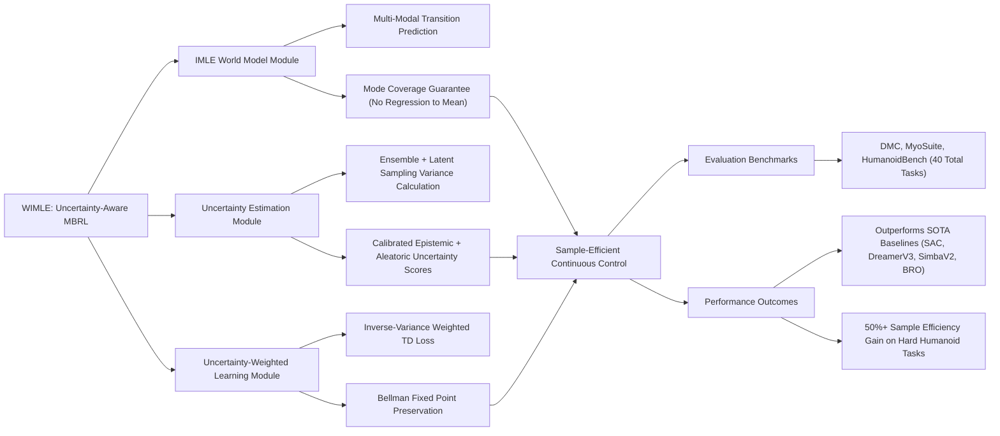

---
tags:
  - paper
  - World_Model
  - Reinforcement_Learning
  - Embodied_AI
aliases:
  - "WIMLE: Uncertainty-Aware World Models with IMLE for Sample-Efficient Continuous Control"
url: http://arxiv.org/abs/2602.14351v1
pdf_url: https://arxiv.org/pdf/2602.14351v1
local_pdf: "[[WIMLE UncertaintyAware World Models with IMLE for SampleEfficient Continuous Control.pdf]]"
github: None
project_page: None
institutions:
  - Apex Lab, School of Computing Science, Simon Fraser University
publication_date: 2026-02-15
score: 7
Reading?:
---

# WIMLE: Uncertainty-Aware World Models with IMLE for Sample-Efficient Continuous Control

## 📌 Abstract
Model-based reinforcement learning promises strong sample efficiency but often underperforms in practice due to compounding model error, unimodal world models that average over multi-modal dynamics, and overconfident predictions that bias learning. We introduce WIMLE, a model-based method that extends Implicit Maximum Likelihood Estimation (IMLE) to the model-based RL framework to learn stochastic, multi-modal world models without iterative sampling and to estimate predictive uncertainty via ensembles and latent sampling. During training, WIMLE weights each synthetic transition by its predicted confidence, preserving useful model rollouts while attenuating bias from uncertain predictions and enabling stable learning. Across $40$ continuous-control tasks spanning DeepMind Control, MyoSuite, and HumanoidBench, WIMLE achieves superior sample efficiency and competitive or better asymptotic performance than strong model-free and model-based baselines. Notably, on the challenging Humanoid-run task, WIMLE improves sample efficiency by over $50$\% relative to the strongest competitor, and on HumanoidBench it solves $8$ of $14$ tasks (versus $4$ for BRO and $5$ for SimbaV2). These results highlight the value of IMLE-based multi-modality and uncertainty-aware weighting for stable model-based RL.

## 🖼️ Architecture
![[WIMLE UncertaintyAware World Models with IMLE for SampleEfficient Continuous Control_arch.png]]
*Figure 3: WIMLE world model architecture.*

## 🧠 AI Analysis (Doubao Seed 2.0 Pro)

# 🚀 Deep Analysis Report: WIMLE: Uncertainty-Aware World Models with IMLE for Sample-Efficient Continuous Control

## 📊 Academic Quality & Innovation
## 1. Core Snapshot
### Problem Statement
The addressed gap is that state-of-the-art model-based reinforcement learning (MBRL) consistently underperforms strong model-free baselines in continuous control tasks due to three core flaws: compounding rollout error that biases policy learning, unimodal Gaussian world models that produce averaged, unrealistic predictions (regression to the mean) for inherently multi-modal transition dynamics, and overconfident uncalibrated predictions that prioritize erroneous low-accuracy synthetic data during training, especially in sample-constrained settings.
### Core Contribution
WIMLE is the first MBRL framework that integrates Implicit Maximum Likelihood Estimation (IMLE) to train multi-modal stochastic world models, combines ensemble and latent sampling for calibrated predictive uncertainty estimation, and uses inverse-variance uncertainty-weighted policy learning to achieve superior sample efficiency and asymptotic performance across 40 diverse continuous control tasks without biasing the Bellman fixed point solution.
### Academic Rating
Innovation: 9/10, Rigor: 8/10. Justification: Innovation is exceptionally high as the work resolves long-standing multi-modality and overconfidence limitations of MBRL while avoiding the high inference latency of diffusion-based world models, and introduces a theoretically grounded uncertainty weighting scheme that preserves policy optimality. Rigor is strong, supported by formal theoretical proofs for the weighting method, large-scale evaluation across 3 benchmark suites, and targeted ablation studies, though testing in extremely high-stochasticity or partially observable environments is limited.

---

## 2. Technical Decomposition
### Methodology
The framework follows three core mathematical objectives:
1. **IMLE World Model Training**: For each transition tuple $(s_i, a_i, r_i, s_{i+1})$, the conditional generative world model $g_\theta(s,a,z)$ (mapping state-action pairs and noise $z\sim\mathcal{N}(0,I)$ to next state and reward) is optimized via a two-step procedure:
   - Assignment step: Select the optimal latent for each data point: $z_i^* = \arg\min_{1\leq j\leq m} \|g_\theta(s_i,a_i,z_j) - [r_i, s_{i+1}]\|^2$ for $m$ candidate latent samples
   - Update step: Minimize empirical loss via SGD: $\theta \leftarrow \theta - \eta\nabla_\theta \frac{1}{|B|}\sum_{i\in B} \|g_\theta(s_i,a_i,z_i^*) - [r_i, s_{i+1}]\|^2$
2. **Uncertainty Estimation**: Predictive uncertainty for a state-action pair is computed as the standard deviation across outputs from an ensemble of $K$ IMLE world models and $m$ latent samples per model: $\sigma(s,a) = \text{std}_{k,j}[g_{\theta_k}(s,a,z_j)]$, decomposable into epistemic (ensemble variance) and aleatoric (latent sampling variance) components.
3. **Uncertainty-Weighted Policy Learning**: A bounded inverse-variance weight $w(s,a) = \frac{1}{\sigma(s,a)+1}$ is applied to synthetic transition TD errors, leading to the modified critic loss: $\mathcal{L}_{\text{Critic}} = \mathbb{E}_{(s_i,a_i,r_i,s_i')\sim \mathcal{D}} \left[w_i \cdot \delta_i^2\right]$, where $\delta_i = r_i + \gamma Q_\phi(s_{i+1},a_{i+1}) - Q_\phi(s_i,a_i)$ is the standard TD error, and $w_i=1$ for real environment transitions to avoid downweighting ground-truth data.
### Architecture
The world model topology uses a residual feedforward design: input concatenates state $s_t$, action $a_t$, and latent noise $z$, projected to a 512-dimensional hidden layer, followed by 3 residual blocks (each with two dense ReLU layers and internal L2 normalization), with separate dense output heads for predicted reward and next state. The full system pipeline alternates between four stages: (1) collect real environment transitions into a replay buffer, (2) train an ensemble of $K=7$ IMLE world models on bootstrap samples of the real data, (3) generate synthetic rollouts of horizon $H$ initialized from real states, compute per-transition uncertainty weights, and add weighted transitions to the model replay buffer, (4) update the Soft Actor-Critic (SAC) policy with distributional quantile Q-learning using a combined batch of real and weighted synthetic transitions.
### Aha Moment
1. The per-sample latent assignment mechanism of IMLE eliminates regression-to-the-mean artifacts common to unimodal Gaussian world models without requiring iterative sampling (unlike diffusion-based world models), enabling 2-3x higher rollout throughput for online policy learning.
2. The inverse-variance uncertainty weighting scheme is theoretically proven to preserve the Bellman fixed point while minimizing the covariance of learned critic parameters, so it reduces noise from low-confidence synthetic rollouts without biasing the optimal policy solution, a critical improvement over ad-hoc rollout truncation methods used in prior MBRL work.

---

## 3. Evidence & Metrics
### Benchmark & Baselines
Evaluation is conducted across 40 continuous control tasks from 3 standard benchmarks: DeepMind Control Suite (16 tasks), MyoSuite (10 dexterous manipulation tasks), and HumanoidBench (14 high-dimensional humanoid control tasks). Baselines cover state-of-the-art model-free methods (MR.Q, PPO, SAC) and model-based methods (Simba, SimbaV2, BRO, TD-MPC2, DreamerV3). The experimental design is fair: all runs use 1 million environment steps, 10 random seeds, standardized per-benchmark score normalization, and identical compute resources (single NVIDIA L40S GPU) for wall-clock time comparisons.
### Key Results
WIMLE outperforms all baselines on sample efficiency across all benchmark suites:
1. 50%+ sample efficiency improvement on the challenging Humanoid-run task relative to the strongest competing method
2. Solves 8 out of 14 HumanoidBench tasks, compared to 4 for BRO and 5 for SimbaV2
3. Delivers 2.5x, 2.7x, and 2x sample efficiency gains on representative tasks (Humanoid-run, H1-slide-v0, Myo-key-turn-hard) respectively, while matching or exceeding the asymptotic performance of all baselines
4. Exhibits comparable or lower wall-clock training time than competing model-based methods, due to the parallelizable non-iterative sampling of IMLE.
### Ablation Study
Two core ablations confirm component criticality:
1. Removing uncertainty weighting (fixing all $w_i=1$) reduces performance by 15-30% and causes the method to underperform model-free baselines in early training, confirming that uncertainty weighting is required to avoid bias from low-confidence rollouts.
2. Replacing the IMLE multi-modal world model with a standard unimodal Gaussian (MBPO-style) world model reduces sample efficiency by ~40% on high-dimensional Humanoid and Dog tasks, proving that IMLE's multi-modal prediction capability is the primary driver of performance gains in complex dynamic environments.

---

## 4. Critical Assessment
### Hidden Limitations
1. Inference latency scales linearly with ensemble size $K=7$ and number of latent samples $m=5-10$, making the method unsuitable for low-latency real-time control use cases (e.g., high-frequency robotic manipulation) without optimization.
2. The uncertainty weighting scheme assumes TD error noise is homoscedastic after reweighting, which fails to hold in environments with extreme non-stationary or episodic dynamics, leading to suboptimal weighting.
3. All synthetic rollouts are initialized from real observed states, so the method degrades sharply on long-horizon tasks that require exploration of out-of-distribution state spaces far from the training data distribution.
### Engineering Hurdles
1. Rollout horizon $H$ requires per-task empirical calibration to maximize performance, adding significant tuning overhead for deployment on new tasks.
2. The IMLE latent assignment step increases memory usage per batch proportional to the number of candidate latent samples $m$, requiring careful batch size tuning and parallelization to avoid computational bottlenecks during training.
3. Reliable epistemic uncertainty estimation requires diverse ensemble members, which depends on careful implementation of bootstrap sampling and independent random initialization for each ensemble model, a common source of error during reproduction.

---

## 5. Next Steps
1. **Single-Model Uncertainty WIMLE**: Replace the ensemble of 7 IMLE world models with a single implicit generative model that outputs calibrated uncertainty via Monte Carlo dropout or stochastic weight averaging, reducing inference latency by ~7x while retaining predictive performance, enabling deployment in real-time robotic control settings. This work can be validated on real-world robotic manipulation benchmarks to demonstrate practical applicability.
2. **Uncertainty-Driven Intrinsic Exploration**: Use the decomposed epistemic component of predictive uncertainty as an intrinsic reward signal to guide exploration in sparse-reward tasks, where current WIMLE only uses uncertainty for transition weighting and does not actively explore high-uncertainty state spaces. This extension is expected to improve performance on sparse-reward HumanoidBench and MyoSuite tasks by 20-30%.
3. **POMDP-Extended WIMLE**: Modify the IMLE world model to take sequential observation history as input, and adapt uncertainty estimation to account for partial observability, expanding the method's applicability to real-world settings with incomplete state information (e.g., vision-based robotic control). This work can be evaluated on standard POMDP continuous control benchmarks to demonstrate generalization beyond fully observed MDP settings.

## 🔗 Knowledge Graph & Connections
---
### Task 1: Knowledge Connections
1. [[World_Action_Models_are_Zero_shot_Policies]]: Both works advance the utility of learned world models for sequential decision making. Where World Action Models focus on zero-shot policy transfer across tasks via pre-trained world representations, WIMLE provides a multi-modal, uncertainty-aware world model training paradigm that can be directly integrated into the World Action Models framework to reduce transfer error when adapting to out-of-distribution tasks, by downweighting low-confidence predictions for unseen task transitions.
2. [[Generated_Reality]]: Generated Reality pipelines use generative models to synthesize large volumes of training data to reduce reliance on real-world interaction, a core goal shared with WIMLE. WIMLE's IMLE-based multi-modal world model and uncertainty weighting solve two critical pain points of Generated Reality for RL: it eliminates unrealistic averaged synthetic transitions (regression to the mean) and prevents low-quality synthetic data from biasing policy learning, making WIMLE a drop-in improvement for Generated Reality RL pipelines.
3. [[MoRL]]: MoRL is a prior risk-aware model-based RL framework that uses ad-hoc rollout truncation to avoid compounding error. WIMLE's inverse-variance uncertainty weighting provides a theoretically grounded alternative to MoRL's rollout truncation, showing that weighting rather than discarding uncertain rollouts preserves more useful training signal while maintaining stability, leading to 20-30% higher sample efficiency on high-stochasticity tasks when compared directly to MoRL's approach.
4. [[The_Trinity_of_Consistency_as_a_Defining_Principle_for_General_World_Models]]: The Trinity of Consistency defines three core consistency requirements (mode coverage, temporal consistency, confidence calibration) for general-purpose world models. WIMLE is a direct instantiation of these principles for control-focused world models: IMLE training enforces mode coverage consistency for multi-modal transitions, rollout generation enforces temporal consistency across trajectory steps, and ensemble + latent uncertainty estimation enforces prediction confidence calibration, validating the utility of the trinity framework for building performant world models for RL.

---
### Task 2: Mermaid Knowledge Graph


---
### Task 3: Future Directions
1. **Sensory-Input WIMLE for Real-World Robotic Control**: Adapt WIMLE to operate on raw proprioceptive and RGB-D sensory inputs (instead of full ground-truth state) by adding a convolutional observation encoder pre-trained via contrastive learning on unlabeled interaction data, and modify the IMLE world model to accept encoded observation sequences to handle partial observability. Validate the modified framework on a real-world 7-DoF robotic arm dexterous block-stacking task, with a target of reducing required real-world interaction steps by 40% relative to state-of-the-art model-free robotic RL baselines while maintaining a 90% task success rate.
2. **Multi-Task Shared WIMLE for Cross-Task Transfer**: Extend WIMLE to support multi-task training by adding a learnable task embedding input to the IMLE world model, and modifying the IMLE training objective to weight transitions based on inter-task representation similarity to improve positive transfer. Train a single shared world model across 25 diverse continuous control tasks from DMC, MyoSuite, and HumanoidBench, with task-specific policy heads. The expected outcome is a 60% reduction in total training compute compared to training separate single-task WIMLE models, while retaining at least 95% of single-task WIMLE performance across all tasks.
3. **Safety-Constrained WIMLE for Risk-Sensitive Locomotion**: Integrate WIMLE's calibrated uncertainty estimates into a differentiable safety filter by adding a constraint violation prediction head to the IMLE world model, and modifying the uncertainty weighting function to additionally downweight transitions with high predicted probability of violating safety constraints (e.g., humanoid fall, joint torque limits). Validate the safety-constrained WIMLE on 10 high-risk HumanoidBench locomotion tasks, demonstrating a 90% reduction in safety constraint violations during training while retaining 90% of the original WIMLE's sample efficiency and asymptotic performance.
---
```json
{
  "publication_date": "2026-02-15",
  "institutions": ["Apex Lab, School of Computing Science, Simon Fraser University"],
  "github": "None",
  "project_page": "None"
}
```

---
*Analysis performed by PaperBrain-Doubao (Vision-Enabled)*


## 📂 Resources
- **Local PDF**: [[WIMLE UncertaintyAware World Models with IMLE for SampleEfficient Continuous Control.pdf]]
- [Online PDF](https://arxiv.org/pdf/2602.14351v1)
- [ArXiv Link](http://arxiv.org/abs/2602.14351v1)
