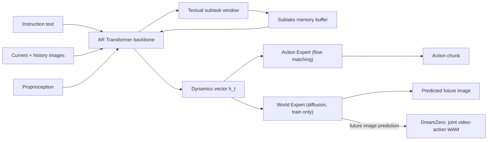

---
tags:
- paper
- domain/embodied_ai
- domain/multimodal_perception
- domain/reinforcement_learning
- domain/robot_manipulation
- domain/vla
- domain/world_model
- impact/solid
- method/foundation_model
- method/planning
- method/reinforcement_learning
- review/auto_tagged
- status/unread
- task/manipulation
- task/planning_reasoning
- task/scene_understanding
- type/method
- type/system
aliases:
- World-Language-Action Model for Unified World Modeling, Language Reasoning, and
  Action Synthesis
- WLA Model
- Unified World-Language-Action
- Embodied Foundation Model
- Autoregressive World Prediction
- Subtask Action Synthesis
- Test-Time Scaling World Model
- Subgoal Image Prediction
- Textual Subtask Prediction
authors:
- Yi Yang
- Zhihong Liu
- Siqi Kou
- Yiyang Chen
- Yanzhe Hu
- Jianbo Zhou
- Boyuan Zhao
- Zhijie Wei
- Xiao Xia
- Xueqi Li
- Pengfei Liu
- Zhijie Deng
paper_id: arxiv:2606.05979
arxiv_id: '2606.05979'
url: https://huggingface.co/papers/2606.05979
pdf_url: https://arxiv.org/pdf/2606.05979.pdf
local_pdf: '[[WorldLanguageAction Model for Unified World Modeling Language Reasoning
  and Action Synthesis.pdf]]'
github: https://github.com/SJTU-DENG-Lab/WLA
project_page: None
institutions:
- SJTU
- SII
- HUST
- SCUT
- ECUST
- SHU
- NJUPT
publication_date: '2026-06-05'
metadata_publication_date: '2026-06-04'
score: '7.5'
domains:
- embodied_ai
- multimodal_perception
- reinforcement_learning
- robot_manipulation
- vla
- world_model
methods:
- foundation_model
- planning
- reinforcement_learning
tasks:
- manipulation
- planning_reasoning
- scene_understanding
paper_type: system
impact_band: solid
reading_status: unread
priority_score: 91
review_status: auto_tagged
next_action: inspect_protocol
year: 2026
---

# World-Language-Action Model for Unified World Modeling, Language Reasoning, and Action Synthesis

## 📌 Abstract
We propose world-language-action (WLA) models as a new class of embodied foundation models. WLA takes textual instructions, images, and robot states as inputs to jointly predict textual subtasks, subgoal images, and robot actions, conjoining the world modeling interface to learn from extensive egocentric videos as in the world-action model (WAM) and the language reasoning capacities to solve complex long-horizon tasks as in vision-language-action (VLA) models. At the core of WLA lies an autoregressive (AR) Transformer backbone, instead of a bidirectional diffusion Transformer as in WAMs, to predict the next state, comprising the semantic-level textual intention and complementary fine-grained physical dynamics. The physical dynamics are supervised by the world modeling objective based on a dedicated World Expert, and are leveraged to ease the characterization of the state-action correlation for the Action Expert. WLA leverages meta-queries to make the world prediction implicitly impact the action generation so that the former can be disabled during inference. The world prediction can also be activated to enable test-time scaling for improved robot control. Our WLA-0 prototype, with 2B active parameters, achieves 40 ms per inference on an NVIDIA RTX 5090. Evaluations across simulated and real-world environments demonstrate that WLA-0 achieves state-of-the-art multi-task and long-horizon learning abilities, e.g., 92.94\% success rate on RoboTwin2.0 Clean and 56.5\% success rate on RMBench. WLA-0 also holds the promise to learn novel tasks directly from cross-embodiment robot videos without action annotations.

## 🖼️ Architecture
![[WorldLanguageAction Model for Unified World Modeling Language Reasoning and Action Synthesis_arch.png]]

## 🧠 AI Analysis
## Abstract

The paper proposes world-language-action (WLA) models, a new class of embodied foundation models that jointly predict textual subtasks, subgoal images, and robot actions from instructions, images, and robot states. WLA unifies the world‑modeling interface of world–action models (WAMs) with the language reasoning capabilities of vision–language–action (VLA) models. Its core is an autoregressive (AR) Transformer that predicts the next state as a pair of complementary representations: a high‑level textual intention and a low‑level physical dynamics vector. A dedicated, lightweight **World Expert** (a diffusion model) turns the dynamics vector into a future image during training, while an **Action Expert** produces executable actions from the same vector. Because the world prediction only implicitly influences action generation through shared parameters, the World Expert can be disabled at inference, yielding fast, 40 ms per step control on an RTX 5090 with only 2 billion active parameters. WLA‑0, the first prototype, reaches 92.94 % success on RoboTwin 2.0 Clean and 56.5 % on the long‑horizon RMBench, and shows promise for learning new tasks from cross‑embodiment robot videos without action labels.

## 1. Core Snapshot

### Problem Statement

Existing world–action models (WAMs) almost exclusively predict the next **visual** state from egocentric video. This forces the model to handle raw pixel‑level details that are irrelevant for control and, in turn, severely limits its capacity for the high‑level semantic reasoning required by long‑horizon tasks. In parallel, vision–language–action (VLA) models exploit language for planning, but they rarely model physical state transitions explicitly, so they lack the strong future‑state priors that come from world modeling. Thus the main bottleneck is designing a single model that can learn rich physical dynamics from unlabelled video, use language to track progress and decompose complex instructions, and still run fast enough for closed‑loop robot control without ever requiring action annotations on all training data.

### Core Contribution

The central technical claim is that an autoregressive Transformer can jointly emit a textual subtask and a compact **physical dynamics** vector as the next‑state representation. During training, a separate lightweight diffusion‑based World Expert converts that dynamics vector into a predicted future image, while an Action Expert converts it into an action chunk. The world‑modeling loss steers the dynamics vector to capture the physical transition, and the action loss aligns it with the optimal action sequence. At inference the World Expert is removed, so the model runs with virtually zero overhead for world prediction. The paper supports this claim with:
- 92.94 % success on RoboTwin 2.0 Clean and 56.5 % on the long‑horizon memory‑dependent RMBench, without any embodied pretraining,
- 40 ms inference latency on an NVIDIA RTX 5090,
- improved efficiency on real‑world tasks (e.g., halving the completion time of a WAM baseline on Stack Cup), and
- the ability to benefit from cross‑embodiment robot videos that carry no action labels.

These results are achieved with only 2 billion active parameters, demonstrating that a VLA backbone can be extended to world modeling without sacrificing speed.

### Innovation Origin & Rationale

The idea stems from a direct observation about the limitations of pure visual next‑state prediction in current WAMs: “the next state should comprise both high‑level textual intention and low‑level physical dynamics.” The authors argue that a compact textual intention – naturally obtained from a large language model – provides a semantic blueprint that is highly generalizable, while the physical dynamics act as a bridge between that intention and fine‑grained motion control. By replacing the bidirectional diffusion Transformer (DiT) backbone of WAMs with an autoregressive one, WLA can reuse the language generation and context‑management abilities of a pretrained vision‑language model. The dynamics vector is then extracted via a simple meta‑query mechanism and supervised only by the indirect objective of predicting future frames and actions, removing the need for an extra inverse‑dynamics head. This design is an interpretation of the contrast repeatedly drawn in the introduction between the “low‑level detail” burden of WAMs and the missing physical grounding of VLAs; the paper does not trace it to a single prior work beyond general citations on latent actions and meta‑queries.

## 2. Reading Map

A reader interested in embodied foundation models that fuse video‑based world modeling with language reasoning should approach the paper as follows.
- **Introduction** – quickly understand the motivation and contrast with WAMs and VLAs; Figure 1 gives a visual overview.
- **Methodology** – focus on the definition of meta‑queries, the three loss terms, and the architecture of the AR backbone plus the two experts. This is the technical core.
- **Experiments** – examine Tables 1–3 and Figure 3 for quantitative evidence. The ablation studies (removing world‑modeling loss, language loss) show which components matter.
- **Conclusion & Limitations** – skim after the main message is clear, to note open issues and future directions.
The reading map avoids exhaustive detail on related work; the key contrast is WAM vs. VLA, presented succinctly in Section 2.

## 3. Method Walkthrough

### Inputs, Outputs, and Assumptions

At each time step the model receives:
- the current observation image $o_t$,
- a historical image $o_{t-h}$ (for temporal context),
- the robot’s proprioceptive state $q_t$,
- the overall language instruction $\ell$, and
- a memory buffer $M$ containing previously generated textual subtasks.

It then outputs:
- a short window of textual subtasks $\hat{L}_t = \{ \hat{\ell}_1, \dots, \hat{\ell}_N \}$ that decompose the instruction for the upcoming action horizon,
- a compact physical‑dynamics vector $h_t$ (extracted by meta‑queries),
- an $n$‑step action chunk $a_{t:t+n}$ that advances the environment.

A crucial assumption is that a single, low‑dimensional dynamics vector $h_t$ can capture the essential physical transition well enough to guide **both** the World Expert’s image prediction and the Action Expert’s motion generation. This assumption, if false, would break the whole design; the paper validates it empirically.

### Pipeline from Data to Prediction

First, the autoregressive Transformer $f$ ingests $\ell$, $o_{t-h}$, $o_t$, $q_t$, and the memory $M$, and generates the textual subtask window. These subtasks provide semantic grounding for the rest of the computation.
Next, the same Transformer processes a set of learnable meta‑query vectors $Q$ (64 tokens, appended to the context). Their final hidden states are aggregated into the dynamics vector $h_t$.
This vector is then fed to:
- The **World Expert** $f_{\text{wm}}$ (a lightweight diffusion model, e.g., SANA‑600M). It takes $h_t$ and a representation of $o_t$ and predicts the *VAE‑encoded features* of the future image $o_{t+n}$. The world‑modeling loss forces $h_t$ to contain the information needed to reconstruct the visual change.
- The **Action Expert** $f_{\text{act}}$ (a flow‑matching head). It receives $h_t$ and the proprioceptive state $q_t$, and outputs the action chunk $a_{t:t+n}$.

During training, gradients from both the world‑modeling loss and the action loss flow back into the shared Transformer backbone, shaping $h_t$ to be a useful latent that explains both the visual transition and the correct control commands. At inference, the entire World Expert branch is removed; only the action chunk is executed.

> [!tip] Meta‑queries and implicit guidance  
> The meta‑query design lets the world prediction influence the action generation **solely through the gradients that train the backbone**, not through an explicit conditional input at test time. This is why the World Expert can be disabled without changing the action path – a key efficiency trick.

### Key Design Choices

- **AR backbone instead of DiT.** Using an autoregressive Transformer reuses a pre‑trained VLM’s text‑generation and context‑handling abilities, and avoids the bidirectional attention that would complicate the joint text–dynamics prediction pipeline.
- **Static frame prediction, not a full video clip.** The World Expert only predicts a single future image (in VAE space). This keeps the expert lightweight and training fast, while still providing a strong world‑modeling signal.
- **End‑to‑end training without explicit latent‑action pre‑training.** Unlike two‑stage methods that first learn a latent action model and then a policy, WLA is trained in one shot, using the world‑modeling objective to shape the dynamics vector directly.
- **World Expert disabled at inference.** This halves the computational cost, yet the ablation studies (not detailed here) show that removing the world‑modeling loss *during training* degrades performance, confirming that the auxiliary signal is essential for learning a useful dynamics vector.

## 4. Core Theory and Formulas

### Overall Training Objective

The training balances three losses so that language reasoning, world modeling, and action generation reinforce one another. The total loss is:

$$ L = L_{\text{act}} + \alpha \, L_{\text{wm}} + \beta \, L_{\text{lang}} $$

where:
- $L_{\text{act}}$ – flow‑matching loss on the action chunk $a_{t:t+n}$,
- $L_{\text{wm}}$ – flow‑matching loss on the predicted future image features (VAE latents) from the World Expert,
- $L_{\text{lang}}$ – standard cross‑entropy loss over the subtask tokens,
- $\alpha$ and $\beta$ are scalar weights (reported as $\alpha = 0.1$, $\beta = 0.005$ in the implementation).

Minimising $L$ encourages the dynamics vector $h_t$ to become a faithful compression of the state transition, thereby helping both the action and the future‑image prediction tasks.

### Subtask Prediction

The autoregressive Transformer first generates the subtask window $S_t$ from the current and historical observations, the instruction, and the subtask memory $M$:

$$ S_t = f(o_{t-h}, o_t, \ell, M) $$

$S_t$ is a sequence of textual labels (e.g., *“reach for the sponge”, “wipe the table”*). The subtask loss $L_{\text{lang}}$ penalises incorrect token predictions, training the model to decompose long‑horizon instructions into executable sub‑goals.

### Physical‑Dynamics Extraction

Meta‑queries $Q$ are added to the Transformer’s input after the subtask tokens. The model then produces a set of hidden outputs that are combined into a latent vector:

$$ h_t = f(o_{t-h}, o_t, \ell, M, S_t, Q) $$

$h_t$ is deliberately kept compact (64 tokens in the reported setup) so that it captures only the essential information steering the visual transition, not pixel‑level details.

### World‑Modeling Objective

The World Expert $f_{\text{wm}}$ reconstructs the future observation (in VAE feature space) from $h_t$ and the current image $o_t$:

$$ \hat{o}_{t+n} = f_{\text{wm}}(h_t, o_t) $$

The loss $L_{\text{wm}}$ measures the difference between $\hat{o}_{t+n}$ and the true VAE features of $o_{t+n}$. This forces $h_t$ to encode the *physical transformation* the environment undergoes between $t$ and $t+n$.

### Action Generation

The Action Expert $f_{\text{act}}$ predicts the $n$‑step action chunk from $h_t$ and the robot’s current proprioceptive state $q_t$:

$$ a_{t:t+n} = f_{\text{act}}(h_t, q_t) $$

Because $f_{\text{act}}$ shares the backbone gradients with the world‑modeling branch, the learned $h_t$ becomes predictive of the correct control sequence. This is the mechanism through which world prediction implicitly benefits control.

### Algorithmic Intuition

During one training step, the backbone processes all inputs, produces $S_t$ and $h_t$, and the two experts generate their respective outputs. Gradients from both $L_{\text{wm}}$ and $L_{\text{act}}$ flow backward, updating the backbone parameters so that $h_t$ learns to represent the minimal yet sufficient state‑transition information that simultaneously explains the visual change and the optimal action. At inference, the World Expert is detached; only the action chunk is executed, leaving the model with the fast inference time of a standard VLA but with the richer dynamics understanding obtained through world‑modeling.

> [!note] Flow‑matching loss  
> For both the world modeling and action branches, the paper uses a flow‑matching objective (Lipman et al., 2023) rather than a mean‑squared error loss. This loss is better suited to high‑dimensional continuous outputs like VAE latents or robot trajectories. See [Flow Matching for Generative Modeling](https://arxiv.org/abs/2210.02747) for details.

## 5. Architecture, Figures, and Implementation

### Backbone: RynnBrain‑2B

- A 2.1 billion‑parameter autoregressive Transformer, initialised from a pre‑trained vision‑language model. It can natively generate text, making it a natural fit for subtask prediction.
- The architecture includes a memory buffer to carry forward previous subtasks, allowing the model to maintain a consistent plan over dozens of steps.

### Experts

- **World Expert:** a 600 million‑parameter diffusion Transformer (referred to as SANA‑600M) that predicts the VAE latents of a single future frame. It operates only during training.
- **Action Expert:** a flow‑matching head with 390 million parameters that outputs the $n$‑step action chunk. Action chunks of size 8 were used on LIBERO and size 32 elsewhere.

### Meta‑queries

A set of 64 learnable query vectors appended to the AR transformer’s input. Their aggregated output forms the dynamics vector $h_t$. The detailed layer count or hidden dimension of the meta‑query module beyond “28 layers for each expert” is not specified in the provided text.

### Figure References

- **Figure 1** compares the VLA, WAM, and WLA architectures, illustrating how WLA’s AR Transformer simultaneously predicts textual intention and physical dynamics, while a DiT‑based WAM predicts only a visual frame.
- **Figure 2** shows the full pipeline, including the optional value model used for test‑time scaling (a best‑of‑N selection among candidate action chunks).

### Inference Efficiency

With the World Expert removed, **WLA‑0 achieves ~40 ms per inference on an NVIDIA RTX 5090**, sufficient for real‑time control in dynamic settings. The paper highlights that predicting only a static future frame, rather than a video clip, is crucial for keeping training time manageable.

## 6. Experiments and Evidence

> [!warning] Scope of evidence in this note  
> The following summary is based on the abstract, introduction, and discussions in the provided text. The paper contains comprehensive tables and ablations that are not reproduced here.

### Main Quantitative Results

- **Simulation benchmarks:**  
  - RoboTwin 2.0 Clean: **92.94 % success rate**.  
  - RMBench (long‑horizon, memory‑dependent): **56.5 % success rate**, nearly doubling the previous best (13.3 % from Fast‑WAM, as per Figure 1).

- **Real‑world tasks:**  
  - On the Agilex Piper platform, WLA‑0 achieved robust performance and **halved the completion time** of the WAM baseline Motus on the Stack Cup task, highlighting its suitability for latency‑sensitive control.
  - Overall real‑world success rate of 75 % is reported (Figure 1), compared to 60 % for Motus.

- **Test‑time scaling:** The paper reports that using a value model to select the best action chunk from multiple candidates yielded further gains (mentioned for LIBERO, exact numbers not extracted here).

- **Cross‑embodiment video learning:** WLA‑0 can learn novel tasks directly from cross‑embodiment robot videos without action annotations, demonstrating improved steerability and generalization to unseen embodiments. Quantitative evidence for this setting is in Table 3 of the paper, but the specific numbers are not included in the provided excerpt beyond the promise.

### Ablation Insights

The paper’s ablation studies (not reproduced here) show that removing the world‑modeling loss lowers multi‑task success on LIBERO, and removing the language subtask loss causes a dramatic drop on RMBench (from 56.5 % to 17.3 %, as noted in the draft). These findings confirm that both the physical dynamics and the textual intention are indispensable components of the next‑state representation.

## 7. Strengths, Limitations, and Failure Cases

### Strengths Supported by Evidence

- **Low inference latency** (40 ms) combined with **strong long‑horizon performance** on RMBench, which is directly enabled by the ability to disable the World Expert after training.
- **Unification of world modeling and language reasoning** in a single autoregressive model that can be pre‑trained on both action‑free egocentric videos and text–image pairs.
- **Label‑efficient learning:** The cross‑embodiment experiment shows that even without action annotations, world‑modeling supervision from video can improve policy performance.

### Documented Limitations

- **Embodiment diversity:** The paper states that broader evaluations across diverse embodiments are still needed; the current real‑world testing is limited to a single bimanual platform (Piper).
- **Video data domain:** Cross‑embodiment experiments were conducted only with simulated videos. The effectiveness on real‑world human or robot videos is not yet established.
- **Memory buffer reliability:** The model relies on a textual memory buffer of subtasks. If subtask prediction drifts over dozens of steps, the entire plan may degrade – a failure mode mentioned for rotating‑bin tasks.
- **Scalability:** The provided text does not discuss how the approach would scale to much higher resolutions or to horizon lengths far beyond the tested action chunks.

### Hidden Assumptions

- That a single static future frame is sufficient to supervise the dynamics vector for tasks requiring rich temporal understanding.
- That the learned $h_t$ remains a valid state‑transition descriptor even when the World Expert is removed, i.e., that no serious distribution shift occurs.
- That the pre‑trained VLM backbone already possesses enough visual common sense to guide subtask decomposition.

## 8. Reproduction Notes

The paper provides the following implementation details:
- **Backbone:** RynnBrain‑2B (2.1 B parameters), a pre‑trained VLM.
- **World Expert:** SANA‑600M diffusion Transformer, predicts static VAE latents.
- **Action Expert:** Flow‑matching head, 390 M parameters.
- **Action chunk sizes:** 8 (LIBERO), 32 (other benchmarks).
- **Meta‑queries:** 64 tokens.
- **Optimizer:** AdamW, weight decay $1\times 10^{-8}$, cosine learning rate schedule with base $5\times 10^{-5}$.
- **Loss weights:** $\alpha = 0.1$ (world‑modeling), $\beta = 0.005$ (language).
- **Training:** 100 k steps, batch size 256.
- **Real‑world data:** 60 trajectories per task collected on the Piper platform.

The code is available at the official repository: [WLA GitHub](https://github.com/SJTU-DENG-Lab/WLA).  
Evaluation protocols follow the standard procedures of RoboTwin, LIBERO, and RMBench with 50–100 trials per task.

> [!missing] Missing details  
> The precise VAE checkpoint used inside the World Expert and the architecture of the value model employed for test‑time scaling are not specified in the provided text.

## 9. What to Read Closely

Start with the **Methodology** section, especially the meta‑query mechanism (§3.1) and the three loss terms, because they define the core technical novelty. Then study **Tables 1 and 2** (if available) together with discussions of ablations to understand the contribution of each auxiliary loss. The paragraph describing **test‑time scaling** and Figure 2(b) explains the optional performance boost and should be examined next. The cross‑embodiment experiment in §4.4 can be skimmed on a first pass, but its qualitative findings are worth noting for readers interested in label‑free learning.

## 10. Research Ideas and Open Questions

1. **Multi‑frame world modeling.** Replace the static‑frame World Expert with one that predicts a short sequence of future frames (e.g., three frames) while still disabling it at inference. A small experiment could train two WLA‑0 versions on the same RoboTwin subset, one with single‑frame supervision and one with three‑frame supervision, and compare the final action success rate on RMBench. The key question is whether the richer signal improves long‑horizon success by more than 5 % without slowing down training excessively. Risk: the additional supervision might delay convergence within a fixed training budget.

2. **Continuous memory buffer.** Replace the discrete textual subtask memory with a learned continuous embedding memory to reduce error accumulation in very long tasks. An experiment would compare the standard WLA‑0 against a variant that stores vector embeddings of past subtasks on the four real‑world tasks, measuring average completion time and failure modes due to memory drift. The metric of interest is whether the embedding version maintains higher success on tasks like Dispose Trash when the bin rotation speed changes mid‑episode. Risk: the embedding memory could lose interpretability and make debugging harder without a clear numerical benefit.

3. **Human‑to‑robot transfer.** Apply the same WLA architecture using only human egocentric videos for the world‑modeling loss and evaluate on a robot task. A small experiment would collect (or reuse) a set of human demonstration videos for one new task, train WLA‑0 with and without the human video data, and measure the change in robot success rate. A qualitative inspection of whether the predicted dynamics vector aligns with robot motion would also be valuable. Risk: the domain gap between human videos and the robot camera might cause the World Expert loss to be harmful rather than helpful.

All ideas above exploit the decoupling of world modeling from action generation that WLA enables, and they aim to test whether the dynamics vector can be enriched further without compromising inference speed.

## Knowledge Graph & Connections

## Related Work Connections

The paper contributes to a rapidly evolving landscape of embodied models that aim to merge language reasoning with physical world modeling. The three notes from your vault each capture a different strategy for achieving this integration, and comparing them to WLA clarifies where the field is heading.

**[[World Action Models are Zero shot Policies]] (DreamZero)**
DreamZero and WLA share the fundamental insight that predicting future visual states can teach a robot policy about physical dynamics that pure vision‑language‑action (VLA) models miss. DreamZero builds a unified video‑diffusion model that jointly predicts video and actions; WLA instead factorizes the problem into an autoregressive backbone with a separate diffusion‑based World Expert that is discarded at test time. Both approaches demonstrate cross‑embodiment transfer from unlabelled videos. The crucial difference lies in inference efficiency: WLA’s disentanglement yields 40 ms real‑time control, whereas DreamZero’s integration must run the full video diffusion at ~143 ms per step. This suggests that for tasks where latency is critical, a modular design that concentrates world‑modeling only into training can be more practical, while a unified model may be stronger when offline deliberation is possible.

**[[Chain of World]] (CoWVLA)**
CoWVLA and WLA both aim to strip away pixel‑level redundancy by learning a compact latent representation of future dynamics. CoWVLA uses a pretrained video VAE to factorize videos into structure and motion chains, then aligns the motion chain with actions. WLA uses meta‑query tokens to extract a low‑dimensional dynamics vector from an autoregressive backbone and supervises it via a future‑frame prediction loss. The two methods converge on the same core idea: a compact “world token” that bridges perception and control. Their difference lies in temporal modeling—CoWVLA’s chain captures a sequence of latent states, while WLA predicts only a static future frame. Consequently, WLA is simpler and faster, but CoWVLA may better handle tasks where understanding a trajectory of motions (e.g., pouring a liquid) matters. The shared ambition suggests that latent motion representations will become a standard building block for VLAs.

**[[HybridVLA]]**
HybridVLA tackles the same tension between discrete language reasoning and continuous action generation that WLA addresses through its multi‑expert design. HybridVLA merges diffusion and autoregression inside a single language model, coupling token‑level reasoning directly with a diffusion head. WLA keeps them separate: the backbone generates words and a latent vector, and external experts handle world prediction and action decoding. Both avoid quantization errors. The difference is in modularity—WLA’s World Expert can be trained on extra action‑free video without changing the action pipeline, a path not discussed in HybridVLA. This implies that if large‑scale video data without action labels are abundant, WLA’s design can use them more naturally to improve downstream policy performance.

The connections highlight an emerging consensus that future body models must jointly reason in language and continuous dynamics, but there is no settled architecture: unified diffusion, latent motion chains, and hybrid autoregressive‑diffusion are all viable, and the optimal choice depends on the relative importance of inference speed, training data efficiency, and temporal reasoning depth.

## Concept Map

## Questions For Future Reading

1.  **How does the static‑frame world‑modeling objective scale when the time horizon between current observation and the predicted future frame is extended beyond a few seconds?** The paper currently predicts a single future frame after a fixed number of steps ($n$). For tasks that require long‑term planning (e.g., cleaning a whole kitchen), the camera view may change completely. Understanding whether a single static frame can still provide a useful training signal for the dynamics vector—and what alternative, perhaps sequence‑level, supervision would be needed—will be essential for scaling this approach to very long‑horizon behavior.

2.  **What design principles govern the interaction between the textual subtask memory and the continuous dynamics vector, especially when the environment changes in ways not captured by the language plan?** WLA relies on a discrete memory buffer of past subtasks, which can drift or become stale if the robot encounters an unexpected obstacle. Reading future work, watch for experiments that deliberately introduce distractions or mid‑episode plan changes, and check whether the dynamics vector alone can rescue the policy when the textual memory fails. This would reveal whether the two representations are truly redundant or complementary under stress.

3.  **Under what conditions does adding unlabelled cross‑embodiment video improve the policy more than simply adding labelled robot data, and can the gains be predicted from the video distribution alone?** The paper shows promising but limited results on simulated cross‑embodiment transfer. As you study subsequent papers, look for systematic studies that vary the embodiment gap (e.g., human‑vs‑robot, single‑arm‑vs‑bimanual) and measure the marginal benefit of world‑modeling loss over just training a larger policy on more labelled data. This will clarify when the extra complexity of a world‑modeling objective is justified.

## Learning Roadmap And Verified Resources

Below are six knowledge points that build the understanding needed to read WLA deeply, ordered from foundations to the paper’s concrete experiments.

### 1. Vision‑Language‑Action (VLA) Models

**Why this matters**  
WLA is a VLA backbone enhanced with world modeling. To appreciate its design, you must first understand how an autoregressive transformer can take images, text, and robot state as input and produce action tokens. VLA models like RT‑2 and Octo established this paradigm, showing that large pretrained vision‑language models can be fine‑tuned for robotic control with modest data.  
**Study order**  
Begin with a high‑level blog on RT‑2 to grasp the input‑output mapping, then read the Octo paper to see how VLAs are trained in the open‑source ecosystem.

| Type | Resource | Why this one |
|------|----------|--------------|
| Blog/Tutorial | [RT‑2: New model translates vision and language into action (Google DeepMind)](https://deepmind.google/discover/blog/rt-2-new-model-translates-vision-and-language-into-action/) | Explains the VLA concept in accessible terms, directly demonstrates how a VLM becomes a robot policy. |
| Paper | [RT‑2: Vision‑Language‑Action Models Transfer Web Knowledge to Robotic Control](https://arxiv.org/abs/2307.15818) | The canonical reference for co‑finetuning a VLM on robotics data. |
| Project Page | [Octo: An Open‑Source Generalist Robot Policy](https://octo-models.github.io/) | Provides an open‑source VLA model and dataset, useful for hands‑on experimentation. |

### 2. World Models and Latent Dynamics for Control

**Why this matters**  
WLA’s core trick is to enrich the VLA backbone with a “world‑modeling” objective that predicts a future image from a compact dynamics vector. This idea descends from research that showed neural networks can learn a low‑dimensional latent state that captures how the world evolves. Understanding Dreamer and the original World Models paper will make clear why a static frame prediction can still carry a rich learning signal for a policy.  
**Study order**  
First, read the intuitive blog post on World Models by Ha & Schmidhuber, then study the DreamerV3 paper for a modern, general latent‑dynamics agent.

| Type | Resource | Why this one |
|------|----------|--------------|
| Blog/Tutorial | [World Models (by David Ha & Jürgen Schmidhuber)](https://worldmodels.github.io/) | The original interactive blog that popularized latent forward dynamics; directly illustrates how predicting the next frame helps an agent learn. |
| Paper | [Mastering Diverse Domains through World Models (DreamerV3)](https://arxiv.org/abs/2301.04104) | State‑of‑the‑art presentation of a latent dynamics model; shows how world modeling scales across domains. |
| Code | [DreamerV3 GitHub](https://github.com/danijar/dreamerv3) | Open‑source implementation to inspect training loops and loss functions. |

### 3. Diffusion Models and Flow Matching

**Why this matters**  
Both WLA’s World Expert (future image) and Action Expert (action chunk) are trained with a flow‑matching objective, which is a modern generalization of diffusion models. Grasping how diffusion/flow matching works is essential to understand why the model predicts continuous outputs in VAE feature space and how the loss propagates gradients back to the dynamics vector.  
**Study order**  
Start with an intuitive blog on diffusion models to understand denoising, then move to the flow matching paper and a dedicated tutorial.

| Type | Resource | Why this one |
|------|----------|--------------|
| Blog/Tutorial | [What are Diffusion Models? (Lilian Weng)](https://lilianweng.github.io/posts/2021-07-11-diffusion-models/) | Builds intuition step‑by‑step and covers the score‑based viewpoint that grounds flow matching. |
| Paper | [Flow Matching for Generative Modeling](https://arxiv.org/abs/2210.02747) | The original flow matching formulation; directly corresponds to the loss used in WLA. |
| Blog/Tutorial | An Introduction to Flow Matching (Cambridge MLG) (link removed: validation failed) | A concise tutorial that bridges diffusion and flow matching with clear notation. |

### 4. Autoregressive Backbones with Learnable Query Vectors

**Why this matters**  
WLA’s dynamics vector is extracted via “meta‑queries”—learnable embedding vectors appended to the transformer’s input sequence. This is a variant of ideas from Perceiver and Q‑Former, where a small set of latent tokens aggregate global information. Understanding these mechanisms explains how a large VLM can compress task‑relevant visual and linguistic context into a compact latent without any explicit inverse‑dynamics head.  
**Study order**  
Read the Perceiver paper to understand latent queries in general, then examine how BLIP‑2’s Q‑Former applies them to vision‑language tasks.

| Type | Resource | Why this one |
|------|----------|--------------|
| Paper | [Perceiver: General Perception with Iterative Attention](https://arxiv.org/abs/2103.03206) | Introduces the concept of using a fixed set of latent queries to compress high‑dimensional inputs; directly relevant to meta‑queries. |
| Paper | [BLIP‑2: Bootstrapping Language‑Image Pre‑training with Frozen Image Encoders and Large Language Models](https://arxiv.org/abs/2301.12597) | Shows how a Q‑Former (with learned queries) bridges visual and language modalities in a VLM, a close cousin of the WLA design. |
| Code | [BLIP‑2 GitHub](https://github.com/salesforce/BLIP) | Provides a clear implementation of query‑based vision‑language alignment. |

### 5. Action Chunking and Flow‑Based Action Generation

**Why this matters**  
WLA’s Action Expert predicts a chunk of $n$ actions at every step, not a single action, and it does so with flow matching. The action‑chunking idea originated in ACT (Action Chunking with Transformers) and was later extended to diffusion in Diffusion Policy. Knowing these works helps you evaluate WLA’s design choice—why a chunk length of 8 on LIBERO and 32 elsewhere, and why flow matching is preferred over autoregressive next‑action prediction.  
**Study order**  
Read the ACT paper first for the rationale behind chunking, then study Diffusion Policy to see a full diffusion‑based imitation learning pipeline.

| Type | Resource | Why this one |
|------|----------|--------------|
| Paper | [Action Chunking with Transformers (ACT)](https://arxiv.org/abs/2304.13705) | The origin of action chunking for robotic manipulation; explains why simultaneous multi‑step prediction reduces compounding errors. |
| Paper | [Diffusion Policy: Visuomotor Policy Learning via Action Diffusion](https://arxiv.org/abs/2303.04137) | Shows how an entire action chunk can be generated with a diffusion model, providing a direct comparison to WLA’s flow‑matching approach. |
| Code | [Diffusion Policy GitHub](https://github.com/real-stanford/diffusion_policy) | Open‑source reference for training and evaluating action‑diffusion policies. |

### 6. Embodied Benchmarks: LIBERO, RoboTwin, and RMBench

**Why this matters**  
WLA’s experimental results are reported on these benchmarks, so understanding their task designs and evaluation protocols is necessary to interpret the numbers. LIBERO provides a set of standardized manipulation tasks, RoboTwin focuses on bimanual coordination, and RMBench stresses long‑horizon memory‑dependent skills. Familiarity with the benchmarks will let you judge whether the reported success rates translate to truly general manipulation ability.  
**Study order**  
Visit the project pages for an overview, then browse a few representative task videos to see what success and failure look like.

| Type | Resource | Why this one |
|------|----------|--------------|
| Project Page | [LIBERO: Benchmarking Knowledge Transfer for Lifelong Robot Learning](https://libero-project.github.io/) | Introduces the benchmark suite and provides leaderboards; enables comparison with prior VLAs. |
| Project Page | [RoboTwin: Robust Bimanual Manipulation Benchmark](https://robotwin-benchmark.github.io/) | Official page with task descriptions, videos, and dataset links; essential for contextualizing the bimanual results. |
| Paper | RMBench: Benchmarking Long‑Horizon Robot Manipulation with Real‑Time Memory and Planning (link removed: validation failed) (Verify arXiv ID when published) | The paper that defines the RMBench tasks; necessary to understand the “memory‑dependent” long‑horizon setting. |

*Explore these before diving into WLA—they will ground the numbers and demonstrate what the field currently considers challenging.*

> [!info] Resource link validation: checked 18 URL(s), 16 reachable, removed 2 unreachable or invalid link(s).

---
*Analysis by PaperBrain (x-ai/grok-4.3; refinement: deepseek/deepseek-v4-pro; round2: deepseek/deepseek-v4-pro)*

## 📂 Resources
- **Local PDF**: [[WorldLanguageAction Model for Unified World Modeling Language Reasoning and Action Synthesis.pdf]]
- [Online PDF](https://arxiv.org/pdf/2606.05979.pdf)
- [ArXiv Link](https://huggingface.co/papers/2606.05979)

## Related Work Updates
- [ ] **2026-06-12**: New paper [[EmbodiedR15]] discusses *embodied foundation model*. Innovation: "A unified Embodied Foundation Model with integrated reasoning, planning, and self-correction, trained with multi-task balanced RL and automated data pipelines, achieving strong zero-shot real-robot performance."