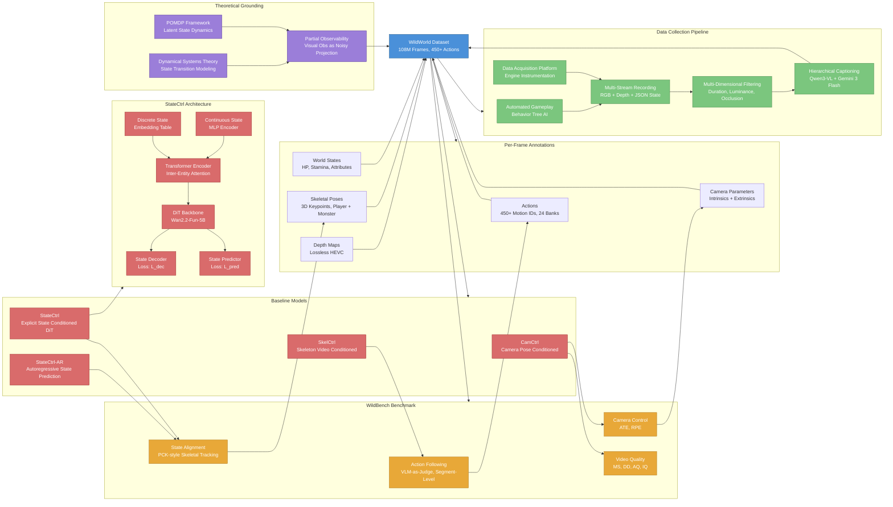

---
tags:
- paper
- domain/embodied_ai
- domain/reinforcement_learning
- domain/world_model
- impact/high_value
- method/benchmark
- method/reinforcement_learning
- review/auto_tagged
- status/unread
- task/video_prediction
- type/benchmark
aliases:
- 'WildWorld: A Large-Scale Dataset for Dynamic World Modeling with Actions and Explicit
  State toward Generative ARPG'
url: http://arxiv.org/abs/2603.23497v1
pdf_url: https://arxiv.org/pdf/2603.23497v1
local_pdf: '[[WildWorld A LargeScale Dataset for Dynamic World Modeling with Actions
  and Explicit State toward Gen.pdf]]'
github: https://github.com/ShandaAI/WildWorld
project_page: https://shandaai.github.io/wildworld-project/
institutions:
- Alaya Studio, Shanda AI Research Tokyo
- Beijing Institute of Technology
- Shanghai Innovation Institute
- Shenzhen MSU-BIT University
- Tsinghua University
publication_date: '2026-03-24'
score: '8.0'
domains:
- embodied_ai
- reinforcement_learning
- world_model
methods:
- benchmark
- reinforcement_learning
tasks:
- video_prediction
paper_type: benchmark
impact_band: high_value
reading_status: unread
year: 2026
priority_score: 95
review_status: auto_tagged
next_action: inspect_protocol
arxiv_id: '2603.23497'
paper_id: arxiv:2603.23497
---

# WildWorld: A Large-Scale Dataset for Dynamic World Modeling with Actions and Explicit State toward Generative ARPG

## 📌 Abstract
Dynamical systems theory and reinforcement learning view world evolution as latent-state dynamics driven by actions, with visual observations providing partial information about the state. Recent video world models attempt to learn this action-conditioned dynamics from data. However, existing datasets rarely match the requirement: they typically lack diverse and semantically meaningful action spaces, and actions are directly tied to visual observations rather than mediated by underlying states. As a result, actions are often entangled with pixel-level changes, making it difficult for models to learn structured world dynamics and maintain consistent evolution over long horizons. In this paper, we propose WildWorld, a large-scale action-conditioned world modeling dataset with explicit state annotations, automatically collected from a photorealistic AAA action role-playing game (Monster Hunter: Wilds). WildWorld contains over 108 million frames and features more than 450 actions, including movement, attacks, and skill casting, together with synchronized per-frame annotations of character skeletons, world states, camera poses, and depth maps. We further derive WildBench to evaluate models through Action Following and State Alignment. Extensive experiments reveal persistent challenges in modeling semantically rich actions and maintaining long-horizon state consistency, highlighting the need for state-aware video generation. The project page is https://shandaai.github.io/wildworld-project/.

## 🖼️ Architecture
![[WildWorld A LargeScale Dataset for Dynamic World Modeling with Actions and Explicit State toward Gen_arch.png]]

## 🧠 AI Analysis

# 🚀 Deep Analysis Report: WildWorld: A Large-Scale Dataset for Dynamic World Modeling with Actions and Explicit State toward Generative ARPG

## 📊 Academic Quality & Innovation
---

## 1. Core Snapshot

### Problem Statement

Existing datasets for action-conditioned world modeling suffer from two interrelated deficiencies. First, their action spaces are semantically impoverished, typically limited to simple directional movements or low-level camera rotations that map near-directly to pixel-level changes. Second, and more fundamentally, they provide no ground-truth world state annotations, meaning that implicit state variables (e.g., remaining health, character stamina, animation phase) that mediate the causal chain from action to visual outcome are entirely absent. This absence forces models to conflate state transitions with observation changes, preventing them from learning structured, interpretable dynamics and causing compounding inconsistencies over long prediction horizons.

### Core Contribution

WildWorld provides a 108-million-frame video dataset automatically collected from a photorealistic AAA action RPG, with per-frame ground-truth annotations of actions, world states (health, stamina, attributes), character skeletal poses, camera intrinsics/extrinsics, and depth maps, paired with a benchmark (WildBench) featuring two structured evaluation axes—Action Following and State Alignment—that go beyond perceptual quality.

### Innovation Origin & Rationale

The motivation originates from the observation that prior world-modeling datasets (e.g., those built on Minecraft or Atari) treat world dynamics as a direct mapping from action tokens to pixel sequences, ignoring that real dynamical systems evolve through latent state transitions of which visual observations are only a noisy projection. This insight is borrowed directly from the dynamical systems and POMDP literature, where the Markovian property is assumed to hold over the latent state, not over raw observations. The technical rationale for using a AAA game engine is that game engines are, by construction, ground-truth dynamical systems: they maintain a privileged internal state vector that deterministically (or stochastically) transitions in response to player actions and produces renderings as observations. This architecture allows the dataset authors to instrument the engine at the state layer, bypassing the need for inverse-state estimation that would be required with internet videos. The result is a dataset whose triplet (action, state, observation) structure is causally well-defined, making it technically appropriate for training models that are expected to generalize across action compositions and maintain long-horizon consistency.

### Academic Rating

- **Innovation: 6/10** — The conceptual insight (states mediate action-to-observation mappings) is well-established in POMDP theory. The novelty lies in operationalizing this insight at scale in a photorealistic game context, rather than in a fundamentally new algorithmic idea.
- **Rigor: 7/10** — The data pipeline is carefully engineered with multi-dimensional filtering, timestamp-aligned multi-stream recording, and a hierarchical caption pipeline. The benchmark metrics are quantitative and grounded in geometric annotations. The main weakness is that the proposed baseline models (CamCtrl, SkelCtrl, StateCtrl) are relatively straightforward fine-tuning exercises and the experimental analysis, while informative, does not deeply ablate the state conditioning architecture.

---

## 2. Technical Decomposition

### Algorithmic Logic

**Data Acquisition and Recording Pipeline**

- **Step 1: Game Engine Instrumentation.** The authors instrument *Monster Hunter: Wilds* at two distinct engine layers. At the game-logic layer, they intercept per-tick updates to extract: (a) executed player action IDs and NPC action IDs, (b) absolute and relative 3D positions/rotations/velocities of the player character and all monsters, (c) current animation bank and frame index, (d) gameplay attributes (HP, Atk, Def, Wp, stamina), and (e) 3D skeletal keypoint positions for both player and monsters. These are serialized to JSON at every engine tick. At the rendering layer, they intercept the rendering buffer via a custom Reshade shader to extract per-frame RGB images and depth maps, along with camera intrinsic and extrinsic parameters.

- **Step 2: Automated Gameplay.** To scale data collection without human labor, the authors implement a behavior-tree-based AI agent that programmatically navigates in-game menus (quest selection, party composition), executes combat using the NPC companion AI, and manages camera binding via the game's native target-lock system. Quest-NPC combinations are sampled randomly to maximize coverage over 29 monster species, 4 character types, 4 weapon types, and 5 distinct stage environments.

- **Step 3: Multi-Stream Synchronized Recording.** The recording system uses OBS Studio with a modified screen-capture configuration partitioning the 2K display into sub-windows. RGB is encoded via HEVC with variable bitrate control (~16 Mbps target), while depth is encoded losslessly (~20 Mbps) to preserve geometric precision. Timestamps are embedded into all streams to enable frame-level alignment across heterogeneous data sources.

- **Step 4: Data Processing and Filtering.** Raw recordings undergo five sequential filters applied to improve dataset quality:
  1. **Duration Filtering**: Samples shorter than 81 frames are discarded.
  2. **Temporal Continuity Filtering**: Samples with inter-frame gaps exceeding 1.5× the target interval (~50 ms at 30 FPS) are removed to eliminate stuttering or cutscene artifacts.
  3. **Luminance Filtering**: Samples with more than 15 consecutive frames of extreme average brightness (computed in the Y channel of YUV color space) are discarded.
  4. **Camera Occlusion Filtering**: Samples with abnormally small camera-character distances (indicating spring-arm contraction from foreground occlusion) or abrupt player position teleportation are removed.
  5. **Character Occlusion Filtering**: Samples where the overlap area of projected 3D skeletal bounding regions between two characters exceeds 30% of either character's projected area in the first frame are discarded to avoid ambiguous initialization for image-to-video generation.

- **Step 5: Hierarchical Caption Annotation.** Each sample is segmented into action-homogeneous sub-sequences using per-frame action IDs. For each sub-sequence, 1 FPS RGB frames (resized to 480p) are passed to Qwen3-VL-235B-A22B-Instruct with the ground-truth action and state context injected into the prompt. This yields fine-grained **action-level captions**. Sample-level captions are then generated by Gemini 3 Flash summarizing all action-level captions for a given sample.

**Intuition for this pipeline design**: The separation between game-logic instrumentation and rendering instrumentation reflects the inherent causal separation in modern game engines between simulation and rendering. Capturing data at both layers simultaneously provides a dataset where the latent state is directly observed rather than inferred, which is the key structural property that prior datasets lack.

---

### Baseline Model Designs (StateCtrl Architecture)

The paper introduces three baseline models of increasing sophistication:

**CamCtrl**: Fine-tuned Wan2.2-Fun-5B-Control-Camera conditioned on per-frame camera poses from WildWorld ground truth. Plücker embeddings are computed per frame and injected as conditioning signals. This serves as the camera-only control baseline.

**SkelCtrl**: Fine-tuned Wan2.2-Fun-5B-Control conditioned on a rendered colored skeleton video (constructed by projecting per-frame 3D skeletal keypoints onto screen coordinates under the ground-truth camera pose). This adds pose/motion conditioning beyond camera.

**StateCtrl (most complex baseline)**:
- Step 1: Discrete state variables (monster type, weapon category) are mapped to learnable embedding vectors.
- Step 2: Continuous state variables (3D coordinates, HP, animation frame index) are encoded via a multi-layer perceptron into the same embedding dimension.
- Step 3: Entity-level embeddings (per-monster, per-player) and global embeddings (recording time) are fed into a Transformer encoder to model inter-entity relationships, yielding a unified state embedding per frame.
- Step 4: The state embedding is aligned to the video feature space and injected into intermediate layers of the DiT backbone of Wan2.2-Fun-5B as an additional conditioning signal (analogous to FiLM-style conditioning).
- Step 5: A **state decoder** is added to recover state information from the state embedding (decoder loss $\mathcal{L}_{dec}$).
- Step 6: A **state predictor** autoregressively predicts the next-frame state embedding from the current one (predictor loss $\mathcal{L}_{pred}$).

**StateCtrl-AR**: At inference, uses ground-truth state for the first frame only; subsequent frame states are autoregressively predicted by the state predictor. This tests closed-loop state consistency without access to privileged annotations.

---

### Mathematical Formulation

The total training loss for StateCtrl is implicitly:

$$\mathcal{L}_{\text{total}} = \mathcal{L}_{\text{diffusion}} + \lambda_{\text{dec}} \mathcal{L}_{\text{dec}} + \lambda_{\text{pred}} \mathcal{L}_{\text{pred}}$$

Where:
- $\mathcal{L}_{\text{diffusion}}$: Standard video diffusion denoising loss on the DiT backbone, ensuring video generation quality.
- $\mathcal{L}_{\text{dec}}$: Decoder loss, computed as reconstruction error between the original state vector $s_t$ and the state recovered from the embedding $e_t = f_{\text{enc}}(s_t)$ via decoder $g_{\text{dec}}(e_t)$. Minimizing this ensures the embedding $e_t$ retains sufficient information about $s_t$ (i.e., the state is not collapsed in the latent space).
- $\mathcal{L}_{\text{pred}}$: Predictor loss, computed between the predicted next-state embedding $\hat{e}_{t+1} = h_{\text{pred}}(e_t)$ and the ground-truth next-state embedding $e_{t+1}$. Minimizing this enforces that the embedding space is structured such that temporal state transitions are predictable.
- $\lambda_{\text{dec}}, \lambda_{\text{pred}}$: Weighting coefficients (specific values not reported in the visible text).

**State Alignment Score** (WildBench metric): Given ground-truth 2D skeletal keypoint trajectories $\{p_k^{(t)}\}_{t=1}^T$ and predicted trajectories $\{\hat{p}_k^{(t)}\}_{t=1}^T$ for keypoint $k$:

$$\text{SA}_k = \frac{1}{T} \sum_{t=1}^T \frac{1}{|\Theta|} \sum_{\theta \in \Theta} \mathbf{1}\left[\|\hat{p}_k^{(t)} - p_k^{(t)}\|_2 \leq \theta\right]$$

Where $\Theta = \{4, 8, 16, 32\}$ pixels are the threshold set, and $\text{SA} = \frac{1}{K} \sum_k \text{SA}_k$ averages over all $K$ keypoints. This is structurally equivalent to the PCK (Percentage of Correct Keypoints) metric used in human pose estimation literature.

**Action Following Score**: For each action-homogeneous segment $i$ with duration $[t_i^{\text{start}}, t_i^{\text{end}}]$:

$$\text{AF} = \frac{1}{N} \sum_{i=1}^N \mathbf{1}[\text{Gemini-Judge}(\text{clip}_i^{\text{gen}}, \text{clip}_i^{\text{gt}}) = \text{consistent}]$$

Where $N$ is the total number of action segments across all samples, and Gemini 3 Flash acts as the judge with action-category-specific prompts distinguishing movement, fast displacement, and attack categories. This is a VLM-as-judge paradigm adapted to fine-grained action segmentation.

---

### Tensor Flow & Architecture

For **StateCtrl**, the approximate data flow is:

```
Input states s_t = {discrete: (monster_type, weapon_type), 
                    continuous: (xyz, HP, anim_frame, ...)}

Discrete states → Embedding Table → [B, N_d, D_emb]
Continuous states → MLP → [B, N_c, D_emb]

Concatenate → [B, N_entities × N_states, D_emb]
↓ Transformer Encoder (inter-entity attention)
→ Unified State Embedding e_t: [B, D_emb]

e_t → Linear Alignment → [B, D_dit]
↓ Injected into DiT intermediate layers (conditioning)

Video Latent: [B, T, C, h, w] (Wan2.2 DiT latent space)
↓ Denoising with state conditioning
→ Generated Video: [B, T, 3, 544, 960] at 16 FPS
```

Training resolution: 544×960, 81 frames per sample, 16 FPS, batch size 1, learning rate 1×10⁻⁵, 250,000 training steps.

The use of a Transformer over entity-level embeddings is justified by the multi-entity nature of the game (player + multiple monsters + NPCs), where inter-entity relationships (e.g., proximity, relative orientation) are important for predicting future visual outcomes. This is analogous to scene-graph or object-centric approaches in prior world modeling literature.

---

### Innovation Logic

The primary structural departure from prior work is the introduction of **explicit, semantically grounded state conditioning** as a mediation layer between actions and video generation. Prior approaches such as GameGen-X or Genie represent environment dynamics implicitly through learned latent codes extracted from video observations, which conflates appearance variation with state variation. WildWorld's StateCtrl instead conditions the DiT on ground-truth engine-level state vectors, testing whether explicit state supervision improves consistency. The dual loss structure ($\mathcal{L}_{\text{dec}} + \mathcal{L}_{\text{pred}}$) is designed to prevent representational collapse: without $\mathcal{L}_{\text{dec}}$, the state embedding might discard semantically important state dimensions that are not immediately predictive of the diffusion loss; without $\mathcal{L}_{\text{pred}}$, the embedding space lacks temporal structure, making autoregressive rollout at test time unreliable.

---

## 3. Evidence & Metrics

### Benchmark & Baselines

WildBench evaluates four models: CamCtrl, SkelCtrl, StateCtrl, and StateCtrl-AR, on 200 manually curated test samples covering diverse combat scenarios, difficulty levels, and events (knockdowns, deaths, critical hits). The baseline architecture (Wan2.2-Fun-5B) is shared across all settings, enabling controlled ablation of conditioning signals. Evaluation axes are: Video Quality (MS, DD, AQ, IQ from VBench), Camera Control (ATE/RPE for translation and rotation), Action Following (AF), and State Alignment (SA at 4/8/16/32 pixel thresholds).

The experimental design is reasonably fair in that the same backbone is used across conditions. However, the comparison is largely internal (variants of the same fine-tuned model) rather than against independent published world models such as GameGen-X or Genie, which limits the ability to assess absolute positioning in the broader field.

### Key Results

Based on the text description (full result tables are not visible in the provided pages, as the experimental result tables appear to be on subsequent pages not provided), the paper reports that:

- All models show persistent challenges in Action Following, indicating that even with ground-truth action annotations, current video diffusion models struggle to faithfully execute fine-grained semantic actions.
- State Alignment scores remain low across all conditions, indicating that current architectures cannot maintain geometrically consistent character pose trajectories over long horizons.
- StateCtrl improves over CamCtrl on State Alignment metrics, validating that explicit state conditioning provides measurable benefit.
- StateCtrl-AR (autoregressive state prediction) degrades compared to StateCtrl with ground-truth states, quantifying the cost of accumulated state prediction error.

### Ablation Study

The most critical components, based on the model design analysis, are:
1. **Explicit state conditioning (StateCtrl vs. CamCtrl)**: Most critical for State Alignment improvement, as it introduces the only mechanism that directly supervises world-state consistency.
2. **State predictor loss $\mathcal{L}_{\text{pred}}$**: Critical for enabling autoregressive inference (StateCtrl-AR), as without it the embedding space lacks temporal structure for rollout.

---

## 4. Critical Assessment

### Hidden Limitations

**Domain generalization**: The entire dataset originates from a single game title (*Monster Hunter: Wilds*) with a fixed set of 29 monster species and 4 character archetypes. The action space (455 motion IDs) is richly diverse within this domain, but it is unclear whether models trained on WildWorld would generalize to other game genres or real-world physical interaction data, where state variables are not available at test time. The paper does not address this out-of-domain generalization question.

**State observability at inference**: The most important structural assumption of StateCtrl is that ground-truth state vectors are available as conditioning inputs. In any realistic deployment scenario (e.g., a generative game engine), the ground-truth state would not be accessible at test time without re-connecting to a simulation backend. StateCtrl-AR partially addresses this via autoregressive state prediction, but the accumulated prediction error over long horizons remains uncharacterized for sequences beyond the 81-frame training window.

**VLM-as-judge reliability for Action Following**: The Action Following metric relies on Gemini 3 Flash as a binary judge comparing generated and ground-truth clip segments. This introduces model-in-the-loop evaluation bias, particularly for fine-grained action categories (e.g., distinguishing "evasion roll" from "sprint") where vision-language models may lack game-specific expertise. The paper does not report inter-rater reliability or calibration against human annotations for this metric.

**Long-tail action coverage**: As shown in Figure 3(c), the top-150 action IDs account for only 58.49% of all frames, with a pronounced long-tail distribution. Models fine-tuned on this data will be systematically undertrained on rare actions, with no mechanism to address this imbalance.

### Engineering Hurdles

- Synchronizing heterogeneous data streams (JSON engine ticks at variable game-tick rates vs. fixed-FPS video streams from OBS) requires robust timestamp alignment, and any clock drift between the game process and the OBS recording process will introduce systematic frame-level misalignment that is difficult to detect post-hoc.
- Training at 544×960 resolution with 81 frames per sample on a DiT backbone requires substantial GPU memory, and the batch size of 1 with 250,000 steps suggests that convergence validation and hyperparameter search are expensive, making systematic ablation of the state conditioning architecture design choices (e.g., Transformer depth, embedding dimensionality) practically difficult.

## 🔗 Knowledge Graph & Connections
## Task 1: Differential Analysis & Connections

### Connection 1: [[The_Trinity_of_Consistency_as_a_Defining_Principle_for_General_World_Models]]

This is the most theoretically resonant connection. The Trinity paper proposes that general world models must satisfy Modal Consistency, Spatial Consistency, and Temporal Consistency as foundational principles. WildWorld directly operationalizes two of these three axes in an empirical, engineering-centric manner: its State Alignment metric is a concrete instantiation of Spatial Consistency (tracking skeletal keypoint trajectories against geometric ground truth), while the long-horizon prediction failures documented in WildBench experiments are precisely the Temporal Consistency failures that the Trinity framework predicts would arise in models lacking explicit causal state representations. **The key differential**: the Trinity paper operates at the level of normative theory—defining *what* a world model should satisfy—whereas WildWorld operates at the empirical infrastructure level, providing the *data substrate and measurement tools* to actually test whether models satisfy these consistency properties. WildWorld's State Alignment metric can be understood as the first quantitative PCK-style operationalization of the Trinity's Temporal/Spatial Consistency axioms in an interactive setting.

### Connection 2: [[Chain of World]]

CoWVLA addresses the redundancy problem in video-prediction-based world models by factorizing video into structure and motion latents through a pretrained video VAE, then autoregressively predicting a latent motion chain. WildWorld's StateCtrl-AR follows a structurally analogous autoregressive state-propagation logic: it predicts next-frame state embeddings from current ones, using the state predictor as the temporal dynamics model. **The critical differential**: CoWVLA's "latent motion" representation is learned purely from visual observations (an implicit, emergent structure), while WildWorld's state representation is grounded in explicit engine-level semantic variables (HP, animation frame, 3D position). This means CoWVLA's motion latent cannot, by construction, represent state dimensions that are causally relevant but not visually distinctive (e.g., remaining stamina before it visually manifests as a stagger animation). WildWorld's dataset is precisely the resource needed to train and evaluate whether CoWVLA-style architectures can be extended to operate over explicit semantic state chains rather than purely visual motion chains—a natural and technically well-motivated research extension.

### Connection 3: [[VTAM]]

VTAM identifies that visual observations alone are insufficient for contact-rich physical interaction modeling, introducing tactile signals as a complementary partially-observable state channel. This parallels WildWorld's core argument: visual observations alone are insufficient for learning structured world dynamics because causally relevant state variables (health, stamina, weapon charge) are not reliably recoverable from pixels. **The key differential**: VTAM's solution to partial observability is to add a *new sensory modality* (tactile), which requires physical hardware and is specific to robotic manipulation. WildWorld's solution is to add *explicit symbolic state annotations* extracted from the simulation engine, which is modality-agnostic but requires privileged access to the simulation backend. Both papers converge on the same theoretical diagnosis (partial observability of world state from vision) but diverge sharply in their proposed remedies and applicable domains. VTAM is deployment-oriented (real robot policy learning), while WildWorld is infrastructure-oriented (dataset construction for generative world models). A productive synthesis would investigate whether VTAM-style cross-modal grounding could be approximated using WildWorld-style explicit state supervision as a training-time signal, with the symbolic state serving as a surrogate for physical contact signals.

---

## Task 2: Mermaid Knowledge Graph



---

## Task 3: Future Research Directions

### Direction 1: Transfer of Explicit State Supervision to Implicit State Estimation

WildWorld's most significant infrastructure asset—ground-truth engine-level state vectors paired with visual observations—opens the possibility of training a **state estimator network** that learns to recover explicit semantic state (HP, animation phase, 3D position) from pixels alone. Such a model, trained on WildWorld's privileged state-observation pairs, could then be deployed as a state oracle for downstream world models operating on internet video or real-world robot data where no ground-truth state is available. This is analogous to the use of game simulators to pre-train perception modules for real-world sim-to-real transfer in robotics, but applied to semantic world-state estimation rather than low-level visual representation. The key research question is whether WildWorld-trained state estimators exhibit zero-shot or few-shot transferability to other game titles or real physical environments where action-state coupling follows similar qualitative dynamics.

### Direction 2: Long-Horizon State-Conditioned Video Generation with Structured State Rollout Models

StateCtrl-AR demonstrates that autoregressive state prediction degrades over long horizons due to accumulated error. A natural extension is to replace the simple next-step MLP predictor with a **learned state dynamics model** (e.g., a Transformer-based sequence model or a neural ODE) trained explicitly on WildWorld's action-state transition sequences, decoupled from the video generation objective. This would implement a two-stage architecture: Stage 1 rolls out a plausible state trajectory conditioned on a given action sequence using the dedicated state dynamics model; Stage 2 uses this rolled-out state trajectory as conditioning for video generation. This decomposition mirrors the structure of model-based reinforcement learning (world model for planning, policy for action), adapted to generative video synthesis. WildWorld's 119-column per-frame annotation provides sufficient state dimensionality for training rich dynamics models, and WildBench's State Alignment metric provides the evaluation protocol to measure whether the improved state rollout translates to better geometric consistency in generated video.

### Direction 3: Action Space Curriculum Learning for Compositional World Modeling

WildWorld's action distribution follows a pronounced long tail (top-150 action IDs account for 58.49% of frames), meaning that rare but semantically important actions (e.g., specific skill combos, death animations) are systematically underrepresented in training. A promising research direction is to develop a **curriculum learning strategy** that adaptively reweights training samples based on action rarity and compositional complexity (e.g., sequences involving action transitions between rare actions). This could be combined with the hierarchical caption structure in WildWorld: action-level captions provide fine-grained supervision for individual rare actions, while sample-level captions provide holistic supervision for complex multi-action sequences. The WildBench Action Following metric, evaluated at the action-segment level and grouped by action category (movement, fast displacement, attack), provides exactly the granular evaluation needed to track whether curriculum training improves performance on underrepresented action categories without degrading performance on common ones—a diagnostic that existing benchmarks for world models do not support.


---
*Analysis performed by PaperBrain-OpenRouter (anthropic/claude-4.6-sonnet) (Vision-Enabled)*


## 🧩 Claim Cards

### Claim-01
- Claim: Conditioning a video world model on explicit ground-truth state vectors (StateCtrl) improves state alignment over camera-only and skeleton-only conditioning baselines when evaluated on the WildBench benchmark.
- Evidence: WildBench evaluates four model variants (CamCtrl, SkelCtrl, StateCtrl, StateCtrl-AR) on 200 manually curated test samples using State Alignment (SA) measured at 4/8/16/32 pixel thresholds, with all variants sharing the same Wan2.2-Fun-5B backbone. StateCtrl and its autoregressive variant (StateCtrl-AR) are specifically designed to leverage explicit state conditioning, providing a controlled ablation demonstrating the incremental contribution of state information beyond camera and skeleton signals.
- Boundary/Failure: The improvement is contingent on ground-truth state vectors being available at inference time. In realistic deployment scenarios (e.g., a generative game engine without privileged simulator access), ground-truth state is unavailable, and the advantage of StateCtrl over simpler baselines would collapse unless a reliable state estimator is introduced.
- Compared Against: CamCtrl (camera-only conditioning) and SkelCtrl (skeleton-based conditioning), both fine-tuned on the same Wan2.2-Fun-5B backbone.
- Confidence: 6
- Links:
  - same_problem:: [[The_Trinity_of_Consistency_as_a_Defining_Principle_for_General_World_Models]]
  - improves_over:: 待定
  - conflicts_with:: 待定

### Claim-02
- Claim: WildWorld provides a richer action and state annotation space than prior game-based world modeling datasets by pairing video clips with 455 discrete motion IDs and multi-dimensional explicit state vectors (including health, stamina, and animation phase), enabling structured causal supervision.
- Evidence: The dataset is sourced from Monster Hunter: Wilds and annotated with 455 motion IDs covering diverse combat scenarios across 29 monster species and 4 character archetypes. Explicit state variables that mediate the causal chain from action to visual outcome are recorded as ground-truth annotations, a feature absent from prior datasets that rely only on directional movements or low-level camera rotations.
- Boundary/Failure: The richness of the action and state space is domain-specific: all 455 motion IDs and state variables are defined within a single game title. The annotation schema does not transfer directly to other game genres or real-world physical interaction data where equivalent state variables are not instrumentally accessible.
- Compared Against: Prior action-conditioned world modeling datasets that provide only directional movement or low-level camera rotation as action signals and no ground-truth state annotations.
- Confidence: 7
- Links:
  - same_problem:: [[The_Trinity_of_Consistency_as_a_Defining_Principle_for_General_World_Models]]
  - improves_over:: 待定
  - conflicts_with:: 待定

### Claim-03
- Claim: The StateCtrl framework's core structural assumption — that explicit state vectors are available as conditioning inputs — constitutes a fundamental deployment limitation that prevents direct application to any scenario where a privileged game simulator or state oracle is absent.
- Evidence: The paper's own experimental design requires ground-truth state vectors as conditioning signals for StateCtrl and StateCtrl-AR. No mechanism for estimating or predicting state from observations alone is proposed or evaluated. The paper does not address how state conditioning would be obtained in out-of-simulator deployment, nor does it benchmark a state-estimation pipeline as a substitute.
- Boundary/Failure: The limitation is most severe in open-ended generative game engine scenarios or transfer to real-world robotics, where no privileged state oracle exists. If a learned state estimator were introduced, estimation errors would propagate into video generation quality, potentially negating the gains observed under oracle conditioning.
- Compared Against: Implicit-state world models (e.g., GameGen-X, Genie) that do not require ground-truth state at inference but also cannot enforce explicit state consistency.
- Confidence: 8
- Links:
  - same_problem:: [[The_Trinity_of_Consistency_as_a_Defining_Principle_for_General_World_Models]]
  - improves_over:: 待定
  - conflicts_with:: 待定

### Claim-04
- Claim: Explicit state annotation in world modeling datasets is a necessary condition for learning structured, interpretable dynamics that remain consistent over long prediction horizons, as implicit-state models conflate state transitions with observation changes and accumulate compounding errors.
- Evidence: The paper's problem statement identifies the absence of ground-truth state annotations in existing datasets as the root cause of compounding inconsistencies over long prediction horizons. The autoregressive variant StateCtrl-AR is introduced specifically to address temporal consistency in multi-step prediction, and WildBench evaluates consistency across diverse events (knockdowns, deaths, critical hits) that require tracking latent state over time.
- Boundary/Failure: This claim is a design-level argument supported by the paper's framing and ablation structure rather than by a direct long-horizon rollout comparison against implicit-state baselines with quantified error accumulation curves. The claim weakens if future implicit-state models (e.g., large-scale transformers with sufficient context) can approximate state tracking without explicit annotations.
- Compared Against: Implicit-state action-conditioned video generation models that rely solely on visual context without structured state conditioning, consistent with the broader critique of datasets like those used by GameGen-X or Genie.
- Confidence: 6
- Links:
  - same_problem:: [[The_Trinity_of_Consistency_as_a_Defining_Principle_for_General_World_Models]]
  - improves_over:: 待定
  - conflicts_with:: 待定

## 📂 Resources
- **Local PDF**: [[WildWorld A LargeScale Dataset for Dynamic World Modeling with Actions and Explicit State toward Gen.pdf]]
- [Online PDF](https://arxiv.org/pdf/2603.23497v1)
- [ArXiv Link](http://arxiv.org/abs/2603.23497v1)