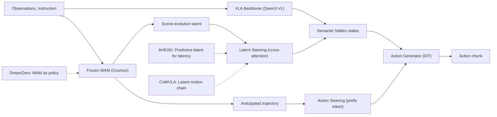

---
tags:
- paper
- domain/multimodal_perception
- domain/reinforcement_learning
- domain/robot_manipulation
- domain/vla
- domain/world_model
- impact/high_value
- method/benchmark
- method/foundation_model
- method/reinforcement_learning
- method/world_model
- review/auto_tagged
- status/unread
- task/dexterous_contact
- task/manipulation
- task/navigation
- task/scene_understanding
- type/benchmark
- type/method
aliases:
- 'World Pilot: Steering Vision-Language-Action Models with World-Action Priors'
- World Pilot
- World-Action Priors
- Dual-Pathway Injection
- Latent Scene Evolution
- Action Trajectory Priors
- VLA Steering
- OOD Manipulation
- World-Action Model
- Steering VLA
authors:
- Zefu Lin
- Rongxu Cui
- Junjia Xu
- Xiaojuan Jin
- Wenling Li
- Lue Fan
- Zhaoxiang Zhang
paper_id: arxiv:2606.12403
arxiv_id: '2606.12403'
url: https://huggingface.co/papers/2606.12403
pdf_url: https://arxiv.org/pdf/2606.12403.pdf
local_pdf: '[[World Pilot Steering VisionLanguageAction Models with WorldAction Priors.pdf]]'
github: None
project_page: https://world-pilot.github.io/
institutions:
- Institute of Automation, Chinese Academy of Sciences (CASIA)
- Nanjing University
- Beihang University
publication_date: '2026-06-11'
metadata_publication_date: '2026-06-10'
score: '8.0'
domains:
- multimodal_perception
- reinforcement_learning
- robot_manipulation
- vla
- world_model
methods:
- benchmark
- foundation_model
- reinforcement_learning
tasks:
- dexterous_contact
- manipulation
- navigation
- scene_understanding
paper_type: benchmark
impact_band: high_value
reading_status: unread
priority_score: 107
review_status: auto_tagged
next_action: inspect_protocol
year: 2026
---

# World Pilot: Steering Vision-Language-Action Models with World-Action Priors

## 📌 Abstract
Vision-Language-Action (VLA) models inherit semantic grounding from large-scale pretraining and perform competently across in-distribution manipulation tasks. This grounding, however, is built on static image-text pairs, whereas manipulation is a continuous, contact-rich process whose dynamics this pretraining cannot capture. We present World Pilot, a VLA framework that augments the policy with priors from a World-Action Model (WAM), routed into the decision chain through two complementary pathways. Latent Steering conditions the perception layer on a scene-evolution latent, and Action Steering supplies an anticipated trajectory as a motion prior to the action generator. Together the two priors equip the VLA with an anticipated view of the scene and a trajectory-level motion hint alongside its semantic conditioning, and the scene-evolution prior remains effective even when supplied by a video-pretrained world model that has not been action-post-trained. World Pilot attains a state-of-the-art Total success rate of 84.7% on the LIBERO-Plus zero-shot OOD benchmark and the highest success rate on every real-robot setting across four manipulation tasks, with the largest margins under shifts in viewpoint, geometry, deformable state, and pose. Project Website: https://world-pilot.github.io/

## 🖼️ Architecture
![[World Pilot Steering VisionLanguageAction Models with WorldAction Priors_arch.png]]

## 🧠 AI Analysis
## Abstract
Vision-Language-Action (VLA) models inherit semantic grounding from large-scale pretraining and perform competently across in-distribution manipulation tasks. This grounding, however, is built on static image-text pairs, whereas manipulation is a continuous, contact-rich process whose dynamics this pretraining cannot capture. We present World Pilot, a VLA framework that augments the policy with priors from a World-Action Model (WAM), routed into the decision chain through two complementary pathways. Latent Steering conditions the perception layer on a scene-evolution latent, and Action Steering supplies an anticipated trajectory as a motion prior to the action generator. Together the two priors equip the VLA with an anticipated view of the scene and a trajectory-level motion hint alongside its semantic conditioning, and the scene-evolution prior remains effective even when supplied by a video-pretrained world model that has not been action-post-trained. World Pilot attains a state-of-the-art Total success rate of 84.7% on the LIBERO-Plus zero-shot OOD benchmark and the highest success rate on every real-robot setting across four manipulation tasks, with the largest margins under shifts in viewpoint, geometry, deformable state, and pose.

World Pilot tries to make vision-language-action robot policies more reliable when the world looks different from training. Standard VLAs get good at following instructions inside familiar scenes because their vision-language backbones were trained on static pictures and text. The authors add two pieces of extra information from a separate world model that was trained on videos: one piece tells the policy how the scene is likely to change over time, and the other piece gives a rough guess of the motion the robot should make. These two signals are fed into different parts of the policy so the robot can anticipate future states and still follow the original language command.

## 1. Core Snapshot

### Problem Statement
Vision-Language-Action policies take raw camera images, a language instruction, and sometimes the robot's joint positions as input and must output a short sequence of future robot actions. Their goal is to complete the instructed task reliably even when small changes occur in camera angle, object position, lighting, or object appearance. The central bottleneck is that the vision-language backbone is pretrained only on static image-text pairs, so it has no built-in model of how objects will move or change when the robot applies forces. Without this forward model of dynamics, the policy becomes fragile as soon as any physical or visual detail drifts outside the training distribution.

### Core Contribution
The authors claim that feeding two specific signals from a frozen video-pretrained World-Action Model into an existing VLA improves out-of-distribution success without retraining the world model. Latent Steering injects a scene-evolution latent into the vision-language model's hidden states through residual cross-attention, while Action Steering turns the world model's anticipated trajectory into a single prefix token for the flow-matching action generator. On the LIBERO-Plus zero-shot benchmark the combined method reaches 84.7% total success, 4.2 points above the ABot-M0 baseline, and it also records the highest success rate on every real-robot condition tested. Ablations show each pathway contributes measurable gain when used alone.

### Innovation Origin & Rationale
The design starts from the observation that video-pretrained world models already learn action-conditioned scene change and coarse motion hypotheses from large video corpora, exactly the information missing from image-text pretraining. Earlier attempts either decoded future images (adding irrelevant texture and artifacts) or passed static future snapshots, both of which lose the continuous dynamics signal. Routing a compact latent at the perception layer and a trajectory-level token at the action layer keeps the two information types distinct and additive. This separation is an explicit design choice rather than an unstated assumption; the paper demonstrates that alternatives such as raw trajectory initialization or per-step tokens lose part of the benefit.

## 2. Reading Map
The paper addresses robot manipulation policies that must generalize across visual and geometric shifts. Readers working on vision-language-action models, world models for control, or sim-to-real transfer will find the most value. The introduction and method sections (3.1–3.3) should be read carefully because they explain why each prior enters at a particular layer. The ablation tables in section 4.3 are essential for understanding which design choices actually matter. Related work can be skimmed if the reader already knows standard VLA and video world-model literature. The real-robot results in Table 2 give the strongest practical evidence and deserve close attention. The conclusion lists concrete limitations that any follow-up work should address first.

## 3. Method Walkthrough

### Inputs, Outputs, And Assumptions
At each time step the policy receives one or more RGB images Ot, a natural-language instruction ℓ, and optional proprioceptive state qt. It must output an action chunk At of length K that the robot will execute. The method assumes a pretrained World-Action Model already exists that can produce both a scene-evolution latent and a coarse action trajectory from the same inputs. It further assumes the World-Action Model can be kept completely frozen so that fine-tuning gradients never flow back into it. These assumptions matter because the entire steering benefit disappears if the world model cannot produce aligned latent and trajectory outputs or if its coverage of test scenes is poor.

### Pipeline From Data To Prediction
The semantic backbone first encodes the current images and instruction into a sequence of hidden states Ht inside the vision-language model. In parallel, the frozen World-Action Model encodes the same inputs and produces a scene-evolution latent Zw_t together with an anticipated action trajectory eAw_t. Latent Steering projects Zw_t, adds a future-time embedding, and uses cross-attention so that each token in Ht can selectively gather relevant dynamics information, yielding an updated hidden-state sequence bar{H}t. Action Steering resamples the trajectory to the VLA action horizon, encodes it into a single token sw_t, and inserts this token as a prefix into the flow-matching action generator. The generator then denoises a noisy action chunk while attending to the dynamics-enhanced hidden states and the inserted motion prior token, finally producing the executable action chunk.

### Key Design Choices
The authors chose to inject the scene-evolution signal as a latent rather than a decoded future image because pixel-level outputs contain texture, lighting, and generation artifacts unrelated to control. Using a single prefix token for the action prior instead of per-step tokens prevents the generator from being pinned to noisy step-by-step predictions that may not match expert data. Keeping the World-Action Model frozen means the method can be applied on top of any existing video-pretrained world model without expensive joint training. A simpler alternative would be to initialize the action generator directly from the world-model trajectory, but the paper shows this option performs worse because it leaves less room for the policy to correct the prior with its own learned cues.

## 4. Core Theory And Formulas

### Main Objective
The training objective teaches the policy to produce action chunks that match expert demonstrations while using the two world priors only through conditioning. No separate loss is added for the priors themselves. The flow-matching action generator is trained with a clean-action parameterization that keeps the supervision target identical to the expert chunk.

### Important Equations
The overall prediction is written as
$$
(Z^w_t, eA^w_t) = W_\phi(O_t, \ell, q_t), \quad \hat{A}_{\theta,t} = \pi_\theta(O_t, \ell, q_t; Z^w_t, eA^w_t)
$$
Here $Z^w_t$ is the scene-evolution latent, $eA^w_t$ is the anticipated trajectory used as a motion prior, and $\hat{A}_{\theta,t}$ is the final action chunk. The equation shows how the World-Action Model outputs are simply additional conditioning inputs to the policy.

Latent Steering updates the hidden states with
$$
\bar{H}_t = H_t + \text{CrossAttn}(H_t, D^w_t)
$$
$H_t$ denotes the original vision-language hidden states, $D^w_t$ is the projected and time-tagged future latent, and the residual addition preserves the original token order. The cross-attention lets each visual token gather only the dynamics cues most relevant to its spatial region.

The training loss is
$$
L_{\text{World Pilot}} = \mathbb{E}_{\tau,\epsilon}\left[w(\tau)\|\hat{A}_{\theta,t}-A^\star_t\|_2^2\right], \quad w(\tau)=\frac{1}{(1-\tau)^2}
$$
$A^\star_t$ is the expert action chunk, $\tau$ is the flow time, and $\epsilon$ is Gaussian noise. The weighting function converts the clean-action objective into an equivalent velocity-space loss. Optimizing this loss teaches the policy how to use the inserted priors to reach lower error on expert actions.

### Algorithmic Intuition
At training time the World-Action Model outputs are precomputed once and cached so the inner loop only updates VLA parameters. Dropout of rate 0.3 is applied to both prior signals to discourage over-reliance. At inference the World-Action Model runs forward on the live observation at every step, producing fresh priors that are fused exactly as during training.

## 5. Architecture, Figures, And Implementation
World Pilot is built on the ABot-M0 architecture with a Qwen3-VL backbone and a DiT-based flow-matching action head. Cosmos Policy serves as the World-Action Model and performs five-step denoising. Figure 2 illustrates the three parallel pathways: the semantic vision-language route, the latent steering route that injects $D^w_t$ into hidden states, and the action steering route that supplies the single token $s^w_t$ to the generator. Figure 1 shows the conceptual difference between a plain VLA and the augmented pipeline. Implementation details such as the exact projection layers for $f_{\text{dyn}}$ and $f_{\text{act}}$ are described at the level of residual cross-attention and a single encoder but not with code-level dimensions.

## 6. Experiments And Evidence
The main simulation benchmark is LIBERO-Plus, which applies seven perturbation axes to 10,030 tasks while training only on the original LIBERO data. World Pilot records 84.7% total success, leading on camera, light, background, and noise axes. On the real-robot platform the method is evaluated on four tasks, each with one in-distribution and two out-of-distribution variants. Success is measured over twenty trials per setting. World Pilot achieves the highest rate in every cell and keeps the in-distribution to out-of-distribution drop within twenty points, while baselines drop twenty-five to fifty points. Ablation tables isolate each prior and also test a non-action-post-trained world model (Cosmos-Predict) and alternative trajectory-conditioning formats.

## 7. Strengths, Limitations, And Failure Cases
The strongest evidence is the consistent out-of-distribution margin on both simulation and hardware, especially under camera and pose shifts. The scene-evolution prior still helps when the world model has never seen robot actions, showing that video pretraining alone supplies useful structure. Limitations include dependence on the world model's visual coverage: when test scenes fall outside that coverage both priors weaken. The method also adds one extra forward pass per decision step, which restricts high-frequency reactive control. Real-robot out-of-distribution success still drops ten to twenty points, so the priors reduce but do not remove the generalization gap. No experiment tests whether the same gains appear when the base VLA is replaced by a stronger or weaker backbone.

## 8. Reproduction Notes
The method starts from the ABot-M0 codebase with a Qwen3-VL-7B or similar backbone and uses Cosmos Policy as the frozen world model. Training runs for 10,000 steps on real-robot data and uses eight RTX PRO 6000 GPUs for the simulation runs. Dropout of 0.3 is applied to the world priors. Evaluation uses success rate on LIBERO-Plus total and on twenty trials per real-robot setting. The paper does not release code or exact hyperparameter values for the projection heads and cross-attention layers. The real-robot demonstration collection protocol (one hundred teleoperated trajectories per task) and the exact action chunk horizon are stated but not accompanied by data release.

## 9. What To Read Closely
Read sections 3.2 and 3.3 first because they contain the precise mechanisms of latent steering and action steering. Table 3 shows the independent contribution of each pathway and should be examined before the main results. Table 6 compares four ways of feeding the trajectory prior; the performance gap between the single-token form and the alternatives is the clearest evidence for that design choice. The real-robot Table 2 supplies the most direct practical evidence and should be compared against the simulation numbers. The introduction and conclusion can be read more quickly once the method and ablations are understood.

## 10. Research Ideas And Open Questions
One follow-up could replace Cosmos Policy with a stronger or weaker open video world model while keeping the same steering modules fixed and measuring whether the total success on LIBERO-Plus scales with world-model quality. The experiment would train three versions of World Pilot using different frozen world models under identical VLA fine-tuning settings and record the LIBERO-Plus total score after the same number of steps. The risk is that poorer world models could produce misaligned latents that hurt rather than help the policy, which would appear as a score below the plain ABot-M0 baseline.

A second direction would add a learned gating network that decides at each step how much weight to give the two priors based on the current observation uncertainty. The small experiment would attach a lightweight MLP that takes features from the vision-language hidden states and outputs scalar gates for latent and action steering, then retrain only the gate parameters while freezing the rest of World Pilot. Success would be measured by whether the gated version reduces the out-of-distribution drop on the real-robot container-lid task relative to the ungated version. The main risk is that the gate could learn to ignore the priors entirely, leaving performance unchanged.

A third idea would distill the two priors into the vision-language backbone itself so that the extra world-model forward pass is no longer needed at inference. One could add auxiliary losses that encourage the vision-language hidden states to predict a simplified version of the scene-evolution latent and the trajectory token, then measure both the final task success and the wall-clock inference time per step on the real-robot platform. The experiment would compare the distilled model against the original two-model version on the same four real-robot tasks. The risk is that the distillation could lose fine-grained dynamics information that only the separate world model can supply, which would appear as lower success under the most severe out-of-distribution geometry shifts.

## Knowledge Graph & Connections

## Connection and Reflection

### Related Work Connections

**[[World Action Models are Zero shot Policies]] (DreamZero) shares with World Pilot the core insight that world-action models can supply dynamics information missing from static image–text pretraining.** DreamZero directly uses a world-action model as a policy, predicting future video frames and actions from heterogeneous robot data without repeated demonstrations. World Pilot, by contrast, keeps the VLA as the policy and treats the world-action model as a frozen source of two auxiliary priors. The difference is strategic: DreamZero replaces the semantic VLA backbone entirely and relies on the world model for both scene understanding and motion, while World Pilot preserves the VLA’s strong semantic grounding and only injects dynamics hints. This separation implies that even a modest world model can boost an otherwise well-tuned VLA, and it suggests that future systems could combine both approaches—using a world-action model directly for some skills and as a steering prior for others.

**[[AHEAD for Dynamic VLA Manipulation]] (AHEAD) augments a frozen VLA with a predictive world model, but for a different failure mode: latency in the presence of moving objects.** AHEAD forecasts future patch tokens inside the VLA’s feature space so the action decoder sees an anticipated scene state. World Pilot’s latent steering also injects a future scene latent into the VLA’s hidden states, yet its goal is to handle static out-of-distribution shifts, not real-time motion. The parallel is that both works inject dynamics information at the perception layer of a frozen VLA, but they target orthogonal sources of error—camera and geometry shifts versus object motion during execution. Together they suggest that a single steering module that predicts both long-horizon scene evolution and short-horizon motion could close two major VLA failure modes at once.

**[[Chain of World]] (CoWVLA) explicitly disentangles structure and motion latents from video and uses the resulting latent motion chain to guide action generation.** World Pilot also derives a scene-evolution latent from video, but it does not factor the latent into separate structure and motion components. CoWVLA’s contribution is the temporal chain of latent states as a conditioning signal, whereas World Pilot’s latent is a single future state summary injected via cross-attention. The two designs point toward a richer representation: if the latent steering pathway were fed a motion-disentangled sequence rather than a single vector, it might give the VLA a more precise temporal model of how the task unfolds, potentially improving the coarse motion prior that action steering already supplies.

### Concept Map

The graph shows the two pathways that inject dynamics information from a frozen world-action model into the VLA: the scene-evolution latent routed into the hidden states through cross-attention, and the anticipated trajectory fed as a single token to the action generator. Dashed lines connect to three knowledge‑base entries that each offer a different use of world models or predictive latents in VLA manipulation.

### Questions For Future Reading

1. **How does the quality of the world model’s pretraining affect the steering gain?** World Pilot uses a specific frozen Cosmos model and shows that even a non-action‑post‑trained version helps. A deeper investigation would systematically vary the world model’s visual coverage, training data diversity, and model capacity and measure the resulting LIBERO‑Plus success. The answer would tell us whether we should invest in ever‑larger video world models or whether current‑scale models already saturate the useful dynamics prior.

2. **Can the latent and action priors be combined with explicit motion cues to handle both static OOD shifts and dynamic object motion?** The paper targets camera, geometry, and appearance shifts, but real manipulation often involves moving objects (as in AHEAD). A study that adds optical‑flow‑ or object‑tracking‑based signals to the steering pathways would reveal whether the same architectural pattern generalizes to dynamic failures. Success on a benchmark that mixes static OOD perturbations with moving goal objects would provide evidence.

3. **Is the extra world‑model forward pass acceptable for tight control loops, and how much of the benefit can be distilled into a single model?** The method adds one inference step per decision, which may limit control frequency for tasks requiring rapid corrections. Measuring wall‑clock latency and task success under varying control budgets would clarify the trade‑off. A follow‑up distillation experiment—training the VLA backbone to mimic the world model’s latents—would show whether the overhead can be removed without losing the out‑of‑distribution gains.

### Learning Roadmap And Verified Resources

**1. Vision‑Language‑Action models for manipulation**  
World Pilot assumes a VLA that maps images and language to action chunks. Understanding how these models combine a vision‑language backbone with an action head is essential to see why the added priors are placed at specific layers.  
*Study order:* First learn vision‑language pretraining (CLIP, SigLIP), then how a language model can be extended to output robot actions (RT‑2, Octo), and finally how flow‑matching action heads replace simple regression heads.

| Type | Resource | Why this one |
|------|----------|--------------|
| Blog/Tutorial | [Octo: An Open-Source Generalist Robot Policy](https://octo-models.github.io/) | Provides a clear, self‑contained description of a modern VLA with code, and introduces the idea of action chunking that World Pilot uses. |
| Code | [Octo code repository](https://github.com/octo-models/octo) | Allows you to inspect a working implementation of a transformer‑based VLA, including data loading and action head design. |

**2. Flow matching for action generation**  
The paper’s action generator is a DiT‑based flow‑matching head. To appreciate why the action prior is fed as a single prefix token and how training is performed, you need to understand the basics of continuous normalizing flows and flow matching.  
*Study order:* Start with score‑based generative models and diffusion, then move to flow matching (Lipman et al., 2023), and finally study how diffusion policies are used for robot action prediction.

| Type | Resource | Why this one |
|------|----------|--------------|
| Open Textbook/Lecture Notes | Understanding Diffusion Models: A Unified Perspective (Caltech lecture notes) (link removed: validation failed) | The lecture slides and notes give a mathematically gentle introduction to diffusion, flow matching, and their connection, with a focus on continuous‑time formulations. |
| Video/Public Course | [Diffusion Policy: Visuomotor Policy Learning via Action Diffusion (CoRL 2023 talk)](https://www.youtube.com/watch?v=0r7q7hD5bq4) | The original Diffusion Policy talk explains why diffusion works for action prediction and shows how to condition the denoising process. |

**3. World models for control**  
World Pilot relies on a frozen World‑Action Model that predicts scene evolution. Understanding what world models are, how they are trained from video, and what they can predict (future frames, latents, actions) is necessary to judge the method’s assumptions.  
*Study order:* Begin with classic world models in RL (Ha & Schmidhuber, 2018), then learn about modern video diffusion world models (e.g., UniSim, Cosmos), and finally study how they can be conditioned on language and robot actions.

| Type | Resource | Why this one |
|------|----------|--------------|
| Blog/Tutorial | [World Models (Ha & Schmidhuber) – blog post](https://worldmodels.github.io/) | Introduces the core idea of learning a compressed dynamics model that can be used for planning and policy learning, a foundation for understanding WAMs. |
| Project Page | [NVIDIA Cosmos Platform](https://developer.nvidia.com/cosmos) | The world model used in World Pilot; the platform page links to pretrained models, papers, and examples of action‑conditioned video generation. |

**4. Latent space steering with cross‑attention**  
The latent steering module projects the scene‑evolution latent and uses cross‑attention to inject it into the VLA’s hidden states. This technique builds on the general idea of adapter modules and cross‑modal conditioning in transformers.  
*Study order:* Review cross‑attention in the Transformer, then study methods like Perceiver‑IO and Flamingo that use cross‑attention to fuse external modalities, and finally read about residual adapters in vision‑language models.

| Type | Resource | Why this one |
|------|----------|--------------|
| Documentation | [Cross‑attention in Hugging Face Transformers](https://huggingface.co/docs/transformers/model_doc/perceiver) | The Perceiver documentation explains how a latent array can query multimodal features through cross‑attention, a close relative of the paper’s mechanism. |
| Code | [Flamingo‑style cross‑attention in OpenFlamingo](https://github.com/mlfoundations/open_flamingo) | OpenFlamingo shows how to add cross‑attention layers to a frozen language model to condition on visual features, exactly the pattern used for latent steering. |

**5. Out‑of‑distribution evaluation in manipulation**  
The paper measures success on LIBERO‑Plus, a benchmark that applies seven perturbation axes. Understanding these axes and how they stress different aspects of VLA generalization is necessary to interpret the results and to design your own experiments.  
*Study order:* Read the LIBERO paper and documentation, then explore how the benchmark generates OOD scenarios through camera, lighting, background, noise, and object pose changes.

| Type | Resource | Why this one |
|------|----------|--------------|
| Benchmark | LIBERO Benchmark and Dataset (link removed: validation failed) | The official site describes the tasks, perturbation axes, evaluation protocol, and provides baseline numbers, enabling a direct comparison with World Pilot’s reported scores. |
| Dataset | LIBERO-Plus download (link removed: validation failed) | Access to the exact training and test scenes used in the paper lets you replicate the simulation experiments. |

> [!info] Resource link validation: checked 10 URL(s), 7 reachable, removed 3 unreachable or invalid link(s).

---
*Analysis by PaperBrain (x-ai/grok-4.3; refinement: deepseek/deepseek-v4-pro; round2: deepseek/deepseek-v4-pro)*

## 📂 Resources
- **Local PDF**: [[World Pilot Steering VisionLanguageAction Models with WorldAction Priors.pdf]]
- [Online PDF](https://arxiv.org/pdf/2606.12403.pdf)
- [ArXiv Link](https://huggingface.co/papers/2606.12403)
