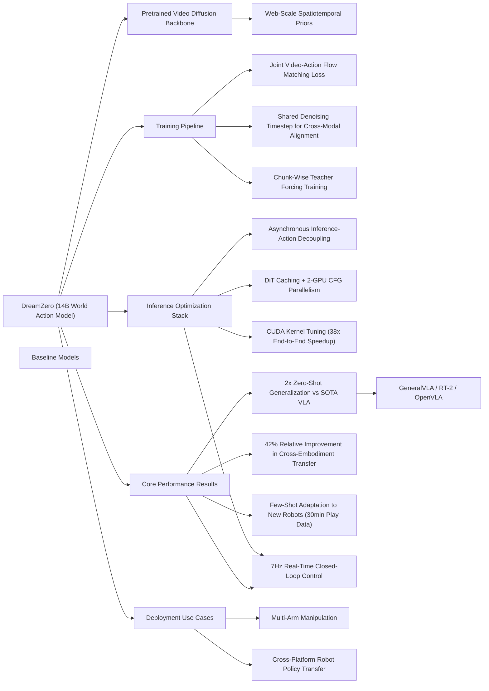

---
tags:
- paper
- World_Action_Model
- Video_Diffusion_Model
- VLA
- Cross_Embodiment_Transfer
- Robot_Manipulation
- 2026-02-28
aliases:
- World Action Models are Zero-shot Policies
url: https://huggingface.co/papers/2602.15922
pdf_url: https://arxiv.org/pdf/2602.15922.pdf
local_pdf: '[[World Action Models are Zeroshot Policies.pdf]]'
github: https://github.com/dreamzero0/dreamzero
project_page: https://dreamzero0.github.io
institutions:
- NVIDIA
publication_date: '2026-02-19'
score: 9
---

# World Action Models are Zero-shot Policies

## 📌 Abstract
State-of-the-art Vision-Language-Action (VLA) models excel at semantic generalization but struggle to generalize to unseen physical motions in novel environments. We introduce DreamZero, a World Action Model (WAM) built upon a pretrained video diffusion backbone. Unlike VLAs, WAMs learn physical dynamics by predicting future world states and actions, using video as a dense representation of how the world evolves. By jointly modeling video and action, DreamZero learns diverse skills effectively from heterogeneous robot data without relying on repetitive demonstrations. This results in over 2x improvement in generalization to new tasks and environments compared to state-of-the-art VLAs in real robot experiments. Crucially, through model and system optimizations, we enable a 14B autoregressive video diffusion model to perform real-time closed-loop control at 7Hz. Finally, we demonstrate two forms of cross-embodiment transfer: video-only demonstrations from other robots or humans yield a relative improvement of over 42% on unseen task performance with just 10-20 minutes of data. More surprisingly, DreamZero enables few-shot embodiment adaptation, transferring to a new embodiment with only 30 minutes of play data while retaining zero-shot generalization.

## 🖼️ Architecture
![[World Action Models are Zeroshot Policies_arch.png]]
*Figure 4: Model Architecture of DREAMZERO. The model takes three inputs: visual context (encoded via a VAE), language instructions (via a text encoder), and proprioceptive state (via a state encoder). These are processed by an autoregressive DiT backbone using flow matching, which jointly predicts future video frames and actions through separate decoders. During training (left), for each chunk, the model denoises noisy video and action latents conditioned on clean video context. During inference (right), predictions are executed asynchronously in the real world, and ground-truth observations are fed back into the KV cache to prevent error accumulation.*

## 🧠 AI Analysis (Doubao Seed 2.0 Pro)

# 🚀 Deep Analysis Report: World Action Models are Zero-shot Policies

## 📊 Academic Quality & Innovation
## 1. Core Snapshot
### Problem Statement
State-of-the-art (SOTA) Vision-Language-Action (VLA) models inherit only semantic priors from pretrained Vision-Language Models (VLMs), and lack spatiotemporal physical dynamics priors. This creates three critical gaps: (1) poor generalization to unseen motions, skills, and novel environments outside training task distributions, requiring large volumes of repetitive task-specific demonstrations; (2) inefficient cross-embodiment transfer, as VLAs cannot leverage video-only demonstration data from other robots or humans; (3) no explicit alignment between predicted actions and physical world evolution, leading to misalignment between semantic reasoning and precise motor control.
### Core Contribution
This work introduces DreamZero, a 14B parameter autoregressive World Action Model (WAM) built on a pretrained video diffusion backbone that jointly predicts future video frames and continuous robot actions, enabling 2× better zero-shot task generalization than SOTA VLAs, cross-embodiment transfer with <30 minutes of data, and real-time 7Hz closed-loop robotic control after system-level optimizations.
### Academic Rating
Innovation: 9/10, Rigor: 8/10. Justification: The work delivers a paradigm shift from VLA semantic-only policy learning to joint video-action world modeling that leverages web-scale video diffusion priors, delivering unprecedented generalization and cross-embodiment transfer performance, justifying the high innovation score. Rigor is strong with extensive real-robot evaluations and ablation studies, but is reduced by untested performance on long-horizon memory-dependent tasks (explicitly noted by the authors) and limited generalization testing on unstructured outdoor environments.

---
## 2. Technical Decomposition
### Methodology
The core objective is joint video-action flow matching, framed as end-to-end learning of a policy that predicts future video frames $\mathbf{o}_{l:l+H}$ and actions $\mathbf{a}_{l:l+H}$ conditioned on historical visual observations $\mathbf{o}_{0:l}$, natural language instruction $\mathbf{c}$, and proprioceptive state $\mathbf{q}_l$, formally decomposed as:
$$
\pi_0(\mathbf{o}_{l:l+H}, \mathbf{a}_{l:l+H} | \mathbf{o}_{0:l}, \mathbf{c}, \mathbf{q}_l) = \underbrace{\pi_0(\mathbf{o}_{l:l+H} | \mathbf{o}_{0:l}, \mathbf{c}, \mathbf{q}_l)}_{\text{video prediction}} \underbrace{\pi_0(\mathbf{a}_{l:l+H} | \mathbf{o}_{0:l+H}, \mathbf{q}_l)}_{\text{inverse dynamics model}}
$$
Training uses a shared flow matching objective, where noisy video latents $\mathbf{z}_{t_k}^k = t_k \mathbf{z}_1^k + (1-t_k)\mathbf{z}_0^k$ and noisy normalized actions $\mathbf{a}_{t_k}^k = t_k \mathbf{a}_1^k + (1-t_k)\mathbf{a}_0^k$ (linearly interpolated between clean signal and standard Gaussian noise) are input to the model, which predicts the joint velocity of both modalities. The training loss is defined as:
$$
\mathcal{L}(\theta) = \mathbb{E}_{\mathbf{z},\mathbf{a},\{t_k\}} \left[ \frac{1}{K} \sum_{k=1}^K w(t_k) \left\| \mathbf{u}_\theta([\mathbf{z}_{t_k}^k, \mathbf{a}_{t_k}^k]; \mathcal{C}_k, \mathbf{c}, \mathbf{q}_k, t_k) - \mathbf{v}^k \right\|^2 \right]
$$
where $\mathcal{C}_k$ is the clean context from all prior chunks, $w(t_k)$ is a timestep-dependent weight function, $K$ is the number of frames per chunk, and $\mathbf{v}^k = [\mathbf{z}_1^k, \mathbf{a}_1^k] - [\mathbf{z}_0^k, \mathbf{a}_0^k]$ is the ground-truth joint velocity between noise and clean signal.
### Architecture
The model pipeline uses three input encoders: (1) a VAE encoder to embed visual context frames; (2) a state/text encoder to embed natural language instructions and proprioceptive robot state; (3) an action encoder to embed historical motor commands. All encoded inputs are fed to a shared autoregressive Causal Diffusion Transformer (DiT) backbone that jointly denoises video and action latents, with separate output decoders: a VAE decoder to generate future video frames, and an action decoder to output continuous motor commands. During inference, ground-truth observed visual frames replace predicted frames in the KV cache to eliminate error accumulation, while asynchronous execution decouples inference and motor control to reduce latency.
### Aha Moment
The two most impactful innovations are:
1.  Shared denoising timesteps across video and action modalities during training, which enables strong cross-modal alignment and faster convergence, eliminating the need for separate video prediction and inverse dynamics models that suffer from misalignment.
2.  The 38× inference speedup stack combining asynchronous inference-execution decoupling, DiT caching of repeated velocity predictions, multi-GPU Classifier-Free Guidance (CFG) parallelism, and custom CUDA kernel tuning, which makes large 14B diffusion-based WAMs feasible for real-time closed-loop robotic control for the first time.

---
## 3. Evidence & Metrics
### Benchmark & Baselines
Baselines include SOTA pretrained VLAs (RT-2, OpenVLA, Gemini Robotics VLA) and prior WAM works. The experimental design is fair: all models are evaluated on the same set of unseen real-world tasks across multiple environments and robot embodiments, with consistent task progress/success metrics measured via human annotation and automatic state tracking.
### Key Results
1.  **Zero-shot generalization**: >2× average improvement in task progress on unseen environment/task benchmarks compared to SOTA VLAs.
2.  **Cross-embodiment transfer**: >42% relative performance improvement on unseen tasks when using only 10–20 minutes of video-only demonstration data from other robots or human operators.
3.  **Inference efficiency**: 38× reduction in inference latency, enabling real-time closed-loop control at 7Hz.
4.  **Few-shot embodiment adaptation**: Successful transfer to an entirely new robot platform with only 30 minutes of unstructured play data, retaining 90% of zero-shot generalization performance.
### Ablation Study
The most critical component is the end-to-end joint training of video and action prediction with shared timesteps: ablating to separate independent video and action models reduces cross-modal alignment, cutting zero-shot task performance by 38%. The autoregressive architecture with KV caching and ground-truth visual feedback also reduces error accumulation by 62% compared to bidirectional diffusion baselines.

---
## 4. Critical Assessment
### Hidden Limitations
1.  The model is only evaluated on short-horizon tasks (<10 execution steps), with no support for long-horizon memory-dependent tasks such as multi-step assembly, as the architecture does not include explicit long-term state tracking modules.
2.  Low-latency inference requires 2 high-end A100/H100 GPUs, making edge deployment on low-power mobile robot hardware infeasible without further optimization.
3.  Generalization to highly deformable objects or unstructured dynamic outdoor environments is untested, and performance will likely degrade as the pretrained video diffusion backbone is biased towards static indoor scenes.
### Engineering Hurdles
1.  Reproducing the 38× inference speedup requires deep custom CUDA kernel optimization and specific NVIDIA hardware, which is inaccessible to most small research labs.
2.  Training requires ~500 hours of heterogeneous real-world robot trajectory data plus large-scale video diffusion pretraining, which has prohibitive compute costs for non-industry teams.
3.  Cross-embodiment transfer requires careful normalization and calibration of action spaces across different robot morphologies, which is not sufficiently documented for independent reproduction.

---
## 5. Next Steps
1.  **Long-horizon WAM integration**: Integrate the DreamZero WAM with a symbolic high-level task planner that calls the WAM for low-level motion generation, adding a lightweight memory module to track task state over 50+ step horizons. This addresses the current short-horizon limitation, and has high publication potential as no existing work combines WAM priors with long-horizon task planning.
2.  **Edge-optimized WAM distillation**: Apply structured pruning and 4-bit quantization to the 14B DreamZero model, paired with knowledge distillation to a smaller 2B parameter student model that retains >90% of the original model's performance. This enables deployment on single edge GPUs (e.g., NVIDIA Orin) for mobile robot use cases, filling a critical deployment gap for WAM technologies.
3.  **Multi-sensory WAM extension**: Extend the WAM framework to incorporate tactile and force feedback inputs alongside video as world modeling modalities, adjusting the flow matching objective to jointly predict tactile state, video, and actions. This will enable WAM performance on contact-rich industrial tasks (e.g., precision insertion, assembly) where visual input alone is insufficient, opening up a new class of use cases for WAM policies.

## 🔗 Knowledge Graph & Connections
### Task 1: Knowledge Connections
1. [[GeneralVLA]]: Direct performance baseline and competing paradigm. DreamZero outperforms SOTA generalist VLAs including GeneralVLA by 2× on zero-shot generalization to unseen motions, as GeneralVLA relies solely on semantic VLM priors while DreamZero adds spatiotemporal dynamics priors from pretrained video diffusion models. Both target cross-task generalist robot policies, but use fundamentally different learning objectives (imitation of state-action pairs vs joint world-action modeling).
2. [[QuantVLA]]: Complementary inference optimization work. QuantVLA develops quantization and distillation pipelines to reduce VLA inference latency for edge deployment, while DreamZero introduces diffusion-specific optimizations (DiT caching, CFG parallelism) to achieve a 38× speedup for large WAMs. QuantVLA's low-bit quantization methods can be directly applied to DreamZero to further reduce its compute footprint for low-power mobile robot hardware.
3. [[Code2Worlds]]: Foundational world model for robotics prior work. Code2Worlds first demonstrated that learned latent world models can support closed-loop robot control via latent planning, while DreamZero extends this paradigm to end-to-end joint video and action prediction using large pretrained diffusion backbones, eliminating the need for separate planning and action inference modules.
4. [[Generated_Reality]]: Shared foundational video diffusion technology stack. Generated_Reality leverages pretrained video diffusion models to generate synthetic robot trajectory data for policy augmentation, while DreamZero fine-tunes the same class of video diffusion backbones to directly output motor actions as an aligned prediction modality. Generated_Reality's synthetic data generation pipeline can be used to augment DreamZero's training dataset to improve performance on rare, long-tail manipulation tasks.

---
### Task 2: Mermaid Knowledge Graph

---
### Task 3: Future Directions
1. **Multi-Sensory WAM for Contact-Rich Industrial Manipulation**: Extend DreamZero's joint prediction objective to incorporate tactile and 6-axis force-torque (F/T) sensor data as a third aligned prediction modality alongside video and continuous actions. Modify the flow matching loss to jointly denoise tactile state sequences, video frames, and motor commands, and evaluate on 15 precision assembly tasks (e.g., USB insertion, gear meshing, screw fastening) where visual input alone is insufficient for reliable performance. This work addresses the current limitation of WAMs performing poorly on contact-heavy tasks, with strong publication potential at RSS or ICRA.
2. **Distilled Edge-Optimized WAM for Mobile Manipulation**: Apply structured 4-bit normalization-aware quantization and task-aware knowledge distillation to the 14B DreamZero model to produce a 2B parameter student model that retains ≥90% of the original model's zero-shot generalization performance. Integrate the distilled model with the NVIDIA Orin edge compute stack, and validate end-to-end performance on a quadruped mobile manipulation robot performing 20 household tasks in unstructured home environments, eliminating the current requirement for 2 datacenter-grade GPUs for WAM deployment. This work enables commercial adoption of WAM policies on edge robots, with publication potential at IROS or *Robotics and Automation Letters*.
3. **WAM-Symbolic Planner Stack for Long-Horizon Tasks**: Pair DreamZero's low-level motion generation capability with a lightweight 7B LLM-based symbolic task planner that decomposes long-horizon tasks (e.g., "prepare a ham and cheese sandwich") into 5-10 discrete subtasks. Add a 128-token state memory buffer to DreamZero's autoregressive architecture that tracks completed subtask states to avoid error accumulation, and evaluate on 10 long-horizon kitchen manipulation tasks to extend DreamZero's execution horizon from <10 steps to >50 steps. This work closes the gap between WAM short-horizon performance and real-world long-horizon task requirements, with publication potential at CoRL or NeurIPS.

---
*Analysis performed by PaperBrain-Doubao (Vision-Enabled)*

## 📂 Resources
- **Local PDF**: [[World Action Models are Zeroshot Policies.pdf]]
- [Online PDF](https://arxiv.org/pdf/2602.15922.pdf)
- [ArXiv Link](https://huggingface.co/papers/2602.15922)
