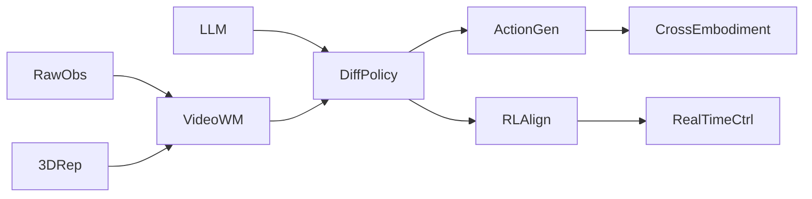

# 🧭 Diffusion-Based Policies（Theme_Diffusion_Policy）

## 🎯 主题定义
- 归属上位关键词：**Theme_Embodied_AI_System**
- 细分关注：diffusion, diffusion model, denoising, generative policy
- 标准标签参考：#Diffusion_Model #Policy

## 📊 主题仪表盘
- 总论文数：**22**
- 平均分：**7.68**
- 高频标签：#Embodied_AI #Diffusion_Model #Robot_Manipulation #World_Model #VLA #Foundation_Model #LLM #Reinforcement_Learning #Video_Diffusion_Model #Sim2Real

## 🆕 最近新增
- [[HiVLA]] | 2026-04-15 | HiVLA: A Visual-Grounded-Centric Hierarchical Embodied Manipulation System
- [[DreamerAD]] | 2026-03-25 | DreamerAD: Efficient Reinforcement Learning via Latent World Model for Autonomous Driving
- [[EgoForge]] | 2026-03-20 | EgoForge: Goal-Directed Egocentric World Simulator
- [[FASTER]] | 2026-03-19 | FASTER: Rethinking Real-Time Flow VLAs
- [[Generation_Models_Know_Space]] | 2026-03-19 | Generation Models Know Space: Unleashing Implicit 3D Priors for Scene Understanding
- [[Kinema4D]] | 2026-03-17 | Kinema4D: Kinematic 4D World Modeling for Spatiotemporal Embodied Simulation
- [[PPGuide]] | 2026-03-11 | PPGuide: Steering Diffusion Policies with Performance Predictive Guidance
- [[EmboAlign]] | 2026-03-05 | EmboAlign: Aligning Video Generation with Compositional Constraints for Zero-Shot Manipulation

## ⭐ 核心论文 Top
- [[World_Action_Models_are_Zero_shot_Policies]] | Score: 9/10 | 2026-02-19 | World Action Models are Zero-shot Policies
- [[Beyond Language Modeling]] | Score: 8/10 | 2026-03-03 | Beyond Language Modeling: An Exploration of Multimodal Pretraining
- [[DiReCT]] | Score: 8/10 | Unknown | DiReCT: Disentangled Regularization of Contrastive Trajectories for Physics-Refined Video Generation
- [[DreamerAD]] | Score: 8/10 | 2026-03-25 | DreamerAD: Efficient Reinforcement Learning via Latent World Model for Autonomous Driving
- [[EgoForge]] | Score: 8/10 | 2026-03-20 | EgoForge: Goal-Directed Egocentric World Simulator
- [[EmboAlign]] | Score: 8/10 | 2026-03-05 | EmboAlign: Aligning Video Generation with Compositional Constraints for Zero-Shot Manipulation
- [[FASTER]] | Score: 8/10 | 2026-03-19 | FASTER: Rethinking Real-Time Flow VLAs
- [[FlowHOI]] | Score: 8/10 | 2026-02-13 | FlowHOI: Flow-based Semantics-Grounded Generation of Hand-Object Interactions for Dexterous Robot Manipulation
- [[Generation_Models_Know_Space]] | Score: 8/10 | 2026-03-19 | Generation Models Know Space: Unleashing Implicit 3D Priors for Scene Understanding
- [[HybridVLA]] | Score: 8/10 | 2025-06-23 | HybridVLA: Collaborative Diffusion and Autoregression in a Unified Vision-Language-Action Model
- [[Kinema4D]] | Score: 8/10 | 2026-03-17 | Kinema4D: Kinematic 4D World Modeling for Spatiotemporal Embodied Simulation
- [[Persistent_Robot_World_Models]] | Score: 8/10 | Unknown | Persistent Robot World Models: Stabilizing Multi-Step Rollouts via Reinforcement Learning

## ✅ 核心贡献与共识
- 暂无可提取的核心贡献，待深度分析笔记积累后自动汇总。

## ⚠️ 局限性与关键分歧
- 暂未发现显式局限性记录，待深度分析笔记积累后自动汇总。

## 🔀 跨论文引用网络
- [[GeneralVLA]] ← 被 [[World_Action_Models_are_Zero_shot_Policies]], [[FlowHOI]], [[SemanticContact_Fields_for_CategoryLevel_Generalizable_Tactile_Tool_Manipulation]] 等 3 篇引用
- [[ProbeFlow]] ← 被 [[HybridVLA]], [[HiVLA]] 等 2 篇引用
- [[World_Action_Models_are_Zero_shot_Policies]] ← 被 [[Mean_Flow_Policy_with_Instantaneous_Velocity_Constraint_for_Onestep_Action_Generation]], [[SemanticContact_Fields_for_CategoryLevel_Generalizable_Tactile_Tool_Manipulation]] 等 2 篇引用
- [[Physics Informed Viscous Value Representations]] ← 被 [[Mean_Flow_Policy_with_Instantaneous_Velocity_Constraint_for_Onestep_Action_Generation]], [[SemanticContact_Fields_for_CategoryLevel_Generalizable_Tactile_Tool_Manipulation]] 等 2 篇引用
- [[QuantVLA]] ← 被 [[World_Action_Models_are_Zero_shot_Policies]] 等 1 篇引用
- [[Code2Worlds]] ← 被 [[World_Action_Models_are_Zero_shot_Policies]] 等 1 篇引用
- [[Generated_Reality]] ← 被 [[World_Action_Models_are_Zero_shot_Policies]] 等 1 篇引用
- [[Mean_Flow_Policy_with_Instantaneous_Velocity_Constraint_for_Onestep_Action_Generation]] ← 被 [[FlowHOI]] 等 1 篇引用

## 🏛️ 领域里程碑工作（AI Enriched）
- **Deep Unsupervised Learning using Nonequilibrium Thermodynamics (2015, ICML)** — Introduced the first deep diffusion probabilistic model, establishing the non-equilibrium thermodynamics foundation for iterative denoising.
- **Denoising Diffusion Probabilistic Models (2020, NeurIPS)** — Proposed DDPM, making diffusion models practically trainable and highly competitive with GANs for high-fidelity generation.
- **Score-Based Generative Modeling through Stochastic Differential Equations (2021, ICLR)** — Unified score matching with SDEs, enabling continuous-time diffusion and faster ODE-based sampling.
- **Planning with Diffusion for Flexible Behavior Synthesis (2022, ICML)** — Introduced Decision Diffuser, adapting diffusion models for offline RL by treating trajectories as denoising targets.
- **Diffusion Policies as an Expressive Policy Class for Offline Reinforcement Learning (2023, ICLR)** — Proposed Diffusion-QL, demonstrating that diffusion models can effectively represent multi-modal action distributions in offline RL.
- **Diffusion Policy: Visuomotor Policy Learning via Action Diffusion (2023, RSS)** — Established action diffusion as a robust, multi-modal visuomotor policy learning framework for robotic manipulation.
- **3D Diffusion Policy (2024, CoRL)** — Extended action diffusion to 3D spatial representations, significantly improving generalization in complex, contact-rich manipulation tasks.
- **Flow Matching for Generative Modeling (2023, ICLR)** — Introduced a direct regression approach to learn vector fields, offering a faster and more stable alternative to traditional diffusion for policy generation.
- **Video Diffusion Models (2022, NeurIPS)** — Scaled diffusion architectures to spatiotemporal data, laying the groundwork for video-based world models and predictive policy planning.
- **Consistency Models (2023, ICML)** — Developed a framework for distilling diffusion processes into single-step generators, enabling ultra-low-latency policy inference for real-time control.

## 🚀 前沿信号雷达（AI Enriched）
- **World_Action_Models_are_Zero_shot_Policies** 代表了将 Video_Diffusion_Model 扩展为 World_Action_Model 的趋势，通过联合建模视觉与动作序列实现跨具身平台的 zero-shot 策略迁移。
- **DreamerAD** 体现了在 latent space 中集成 Diffusion_Model 与 Dreamer 架构的技术路线，利用生成式世界模型替代传统动力学模型以支持更高效的离线 Reinforcement_Learning。
- **FlowHOI** 展示了将 3D_Gaussian_Splatting 与生成式策略结合的前沿方向，通过高保真 3D 场景重建与扩散/流匹配生成模型提升复杂人机交互任务的空间推理能力。
- **FASTER** 聚焦于解决 VLA 架构中 Diffusion_Model 推理延迟高的问题，通过动作分块优化或模型蒸馏技术实现高频实时 Robot_Manipulation 控制。

## 🧬 体系化关联补充（AI Enriched）
- **World_Action_Models_are_Zero_shot_Policies** 通过 Video_Diffusion_Model 构建了 Theme_Diffusion_Policy 与 World_Model 主题的技术桥梁，将动作预测作为视频生成的条件输入，实现策略生成与物理世界模拟的统一。
- **EmboAlign** 建立了 Diffusion_Model 与 Foundation_Model 之间的表征对齐机制，利用生成式去噪过程弥合视觉语言预训练模型与机器人底层控制策略之间的模态鸿沟。
- **FlowHOI** 作为连接 3D_Gaussian_Splatting 与 Embodied_AI 的枢纽，将显式 3D 几何表示注入扩散策略的观测编码器，显著提升了 Theme_Diffusion_Policy 在复杂空间操作中的几何一致性。
- **DreamerAD** 提供了 Diffusion_Model 与 Reinforcement_Learning 的深度融合范式，通过可微分的生成式世界模型替代传统环境交互，为离线策略优化提供高保真梯度信号。

## ❓ 开放性问题（AI Enriched）
- 跨形态机器人（如机械臂与双足机器人）共享同一视频扩散世界模型时，如何有效解耦动作空间与本体动力学差异以实现真正的零样本策略迁移？
- 多步去噪过程导致的高推理延迟如何在不牺牲动作分布多样性的前提下，通过隐空间蒸馏或一致性模型满足高频实时控制需求？
- 基于扩散的世界模型在长程任务中易出现状态预测误差累积，如何结合强化学习或外部记忆机制实现跨时间步的持久状态一致性？
- 将3D高斯溅射等显式空间表示与扩散策略融合时，如何保证生成动作在复杂遮挡与动态环境中的几何精确性与物理可行性？

## 🗺️ 主题关系可视化（AI Enriched）

## 🗓️ 本周推进建议（AI Enriched）
- [ ] 针对《World_Action_Models_are_Zero_shot_Policies》：聚焦视频扩散模型中的跨形态动作条件注入机制。在Jupyter中加载开源轻量级视频扩散权重，编写<150行代码将不同机械臂的关节角序列作为条件输入，观察去噪过程中动作轨迹的演变。测量并绘制条件注入强度与轨迹方差的对应曲线，验证零样本迁移时动力学解耦的有效性。
- [ ] 针对《DreamerAD》：聚焦扩散策略与模型预测控制的结合。在MuJoCo的InvertedPendulum环境中，用PyTorch实现一个简化版扩散Actor替换标准高斯分布，仅进行1000步的离线策略评估。记录并对比扩散采样步数从1到10时的累积奖励与动作平滑度指标，验证多步去噪对长程规划稳定性的影响。
- [ ] 针对《FlowHOI》：聚焦3D高斯溅射表征与扩散策略的空间对齐。使用预训练的3DGS渲染管线生成单视角深度图，编写<100行代码将其作为空间条件输入至2D扩散网络生成目标抓取点热力图。计算热力图峰值坐标与真实物体质心的像素误差，评估显式3D先验对生成动作几何可行性的约束作用。

## 🔗 关联主题
- [[Theme_VLA_Policy|Vision-Language-Action Policies]]
- [[Theme_Video_World_Model|Video World Models]]
- [[Theme_Robot_Manipulation_General|Robot Manipulation]]
