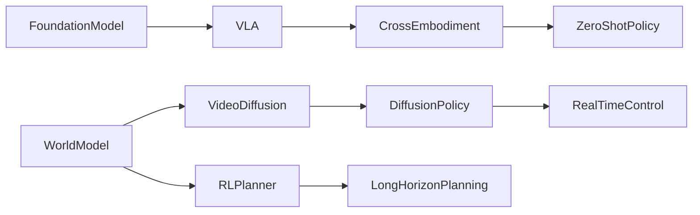

# 🧭 Embodied AI Systems（Theme_Embodied_AI_System）

## 🎯 主题定义
- 归属上位关键词：**Root**
- 细分关注：embodied, embodied AI, embodied agent, physical agent, robot, embodied learning
- 标准标签参考：#Embodied_AI #Robot_Learning

## 📊 主题仪表盘
- 总论文数：**67**
- 平均分：**7.51**
- 高频标签：#Embodied_AI #Robot_Manipulation #Foundation_Model #VLA #World_Model #Reinforcement_Learning #Sim2Real #Diffusion_Model #LLM #3D_Gaussian_Splatting

## 🆕 最近新增
- [[HiVLA]] | 2026-04-15 | HiVLA: A Visual-Grounded-Centric Hierarchical Embodied Manipulation System
- [[SoftMimicGen]] | 2026-03-26 | SoftMimicGen: A Data Generation System for Scalable Robot Learning in Deformable Object Manipulation
- [[DreamerAD]] | 2026-03-25 | DreamerAD: Efficient Reinforcement Learning via Latent World Model for Autonomous Driving
- [[TAG]] | 2026-03-25 | TAG: Target-Agnostic Guidance for Stable Object-Centric Inference in Vision-Language-Action Models
- [[VTAM]] | 2026-03-24 | VTAM: Video-Tactile-Action Models for Complex Physical Interaction Beyond VLAs
- [[WildWorld]] | 2026-03-24 | WildWorld: A Large-Scale Dataset for Dynamic World Modeling with Actions and Explicit State toward Generative ARPG
- [[EgoForge]] | 2026-03-20 | EgoForge: Goal-Directed Egocentric World Simulator
- [[Not All Features Are Created Equal]] | 2026-03-19 | Not All Features Are Created Equal: A Mechanistic Study of Vision-Language-Action Models

## ⭐ 核心论文 Top
- [[Not All Features Are Created Equal]] | Score: 9/10 | 2026-03-19 | Not All Features Are Created Equal: A Mechanistic Study of Vision-Language-Action Models
- [[RISE]] | Score: 9/10 | 2026-02-11 | RISE: Self-Improving Robot Policy with Compositional World Model
- [[Simple Recipe Works]] | Score: 9/10 | 2026-03-12 | Simple Recipe Works: Vision-Language-Action Models are Natural Continual Learners with Reinforcement Learning
- [[World_Action_Models_are_Zero_shot_Policies]] | Score: 9/10 | 2026-02-19 | World Action Models are Zero-shot Policies
- [[ACEBrain0]] | Score: 8/10 | 2026-03-04 | ACE-Brain-0: Spatial Intelligence as a Shared Scaffold for Universal Embodiments
- [[CanViT]] | Score: 8/10 | Unknown | CanViT: Toward Active-Vision Foundation Models
- [[Chain of World]] | Score: 8/10 | 2026-03-03 | Chain of World: World Model Thinking in Latent Motion
- [[DreamerAD]] | Score: 8/10 | 2026-03-25 | DreamerAD: Efficient Reinforcement Learning via Latent World Model for Autonomous Driving
- [[DreamPlan]] | Score: 8/10 | 2026-03-17 | DreamPlan: Efficient Reinforcement Fine-Tuning of Vision-Language Planners via Video World Models
- [[EgoForge]] | Score: 8/10 | 2026-03-20 | EgoForge: Goal-Directed Egocentric World Simulator
- [[EmboAlign]] | Score: 8/10 | 2026-03-05 | EmboAlign: Aligning Video Generation with Compositional Constraints for Zero-Shot Manipulation
- [[FASTER]] | Score: 8/10 | 2026-03-19 | FASTER: Rethinking Real-Time Flow VLAs

## ✅ 核心贡献与共识
- 暂无可提取的核心贡献，待深度分析笔记积累后自动汇总。

## ⚠️ 局限性与关键分歧
- 暂未发现显式局限性记录，待深度分析笔记积累后自动汇总。

## 🔀 跨论文引用网络
- [[GeneralVLA]] ← 被 [[RISE]], [[World_Action_Models_are_Zero_shot_Policies]], [[FlowHOI]] 等 6 篇引用
- [[World_Action_Models_are_Zero_shot_Policies]] ← 被 [[RISE]], [[GeometryAware_Rotary_Position_Embedding_for_Consistent_Video_World_Model]], [[LoGeR]] 等 5 篇引用
- [[Physics Informed Viscous Value Representations]] ← 被 [[RISE]], [[Xiaomi-Robotics-0]], [[Mean_Flow_Policy_with_Instantaneous_Velocity_Constraint_for_Onestep_Action_Generation]] 等 5 篇引用
- [[2026-02-26-PaperDigest]] ← 被 [[Xiaomi-Robotics-0]], [[Solaris]], [[SPARR]] 等 4 篇引用
- [[Solaris]] ← 被 [[Xiaomi-Robotics-0]], [[Solaris]], [[SPARR]] 等 4 篇引用
- [[QuantVLA]] ← 被 [[World_Action_Models_are_Zero_shot_Policies]], [[GeometryAware_Rotary_Position_Embedding_for_Consistent_Video_World_Model]], [[Utonia]] 等 3 篇引用
- [[README]] ← 被 [[Xiaomi-Robotics-0]], [[SPARR]], [[GeneralVLA]] 等 3 篇引用
- [[GeometryAware_Rotary_Position_Embedding_for_Consistent_Video_World_Model]] ← 被 [[RISE]], [[Utonia]] 等 2 篇引用

## 🏛️ 领域里程碑工作（AI Enriched）
- **End-to-End Training of Deep Visuomotor Policies (2016, JMLR)** — Established that raw pixel inputs can be directly mapped to continuous motor commands via deep RL, bypassing traditional modular pipelines.
- **Learning Dexterous In-Hand Manipulation (2019, Science Robotics)** — Demonstrated that large-scale simulation training with domain randomization enables zero-shot sim-to-real transfer for highly complex dexterous tasks.
- **Grasp Quality Convolutional Neural Networks (2016, ICRA)** — Introduced GQ-CNNs for robust grasp planning, establishing a standard for data-driven grasp synthesis that heavily influenced subsequent embodied perception modules.
- **Learning to Navigate in Complex Environments (2017, ICLR)** — Combined deep RL with auxiliary tasks to enable agents to learn spatial navigation and mapping from egocentric vision, laying groundwork for embodied navigation.
- **RT-1: Robotics Transformer for Real-World Control at Scale (2022, CoRL)** — Pioneered the Vision-Language-Action (VLA) paradigm by scaling transformer architectures to multi-task robotic control across diverse datasets.
- **RT-2: Vision-Language-Action Models Transfer Web Knowledge to Robotic Control (2023, CoRL)** — Extended VLA models to incorporate web-scale vision-language data, enabling emergent semantic reasoning and novel object manipulation in zero-shot settings.
- **PaLM-E: An Embodied Multimodal Language Model (2023, ICML)** — Integrated large language models with continuous sensorimotor streams, proving that LLMs can serve as high-level planners for embodied agents.
- **Diffusion Policy: Visuomotor Policy Learning via Action Diffusion (2023, RSS)** — Replaced traditional Gaussian policies with diffusion models for action generation, significantly improving multi-modal action distribution modeling in manipulation.
- **Voyager: An Open-Ended Embodied Agent with Large Language Models (2023, arXiv)** — Introduced an LLM-driven curriculum learning framework that autonomously acquires skills in open-ended environments without human supervision.
- **Octo: An Open-Source Generalist Robot Policy (2024, RSS)** — Trained a single transformer policy on 800k+ robot trajectories across diverse embodiments, proving the viability of cross-embodiment generalization via large-scale pretraining.
- **OpenVLA: An Open-Source Vision-Language-Action Model (2024, CoRL)** — Democratized VLA research by providing a fully open, fine-tunable foundation model for robotic manipulation, accelerating community-wide benchmarking.
- **Mobile ALOHA: Learning Bimanual Mobile Manipulation with Low-Cost Whole-Body Teleoperation (2024, arXiv)** — Showcased that high-quality human teleoperation data combined with imitation learning enables complex bimanual mobile manipulation at scale.

## 🚀 前沿信号雷达（AI Enriched）
- **World_Action_Models_are_Zero_shot_Policies** 代表了将 Video Diffusion Model 与动作解码器深度融合的趋势，通过联合建模视觉状态转移与动作分布，实现无需微调的 Cross-Embodiment Transfer。
- **DreamerAD** 与 **DreamPlan** 标志着 World Model 架构正全面转向 Diffusion Model，利用其强大的多模态分布拟合能力替代传统确定性动力学模型，显著提升了 RL 在复杂 Robot Manipulation 任务中的长程规划稳定性。
- **FASTER** 与 **Simple Recipe Works** 揭示了 VLA 训练范式的演进方向：从纯监督模仿学习转向结合 Reinforcement Learning 与特征重要性重加权（Feature Re-weighting）的混合优化，以突破 Foundation Model 在物理交互中的泛化瓶颈。
- **EmboAlign** 体现了当前利用预训练 Foundation Model 进行跨模态表征对齐（Representation Alignment）的技术路径，旨在弥合高层语义指令与底层 Robot Manipulation 动作空间之间的分布偏移。

## 🧬 体系化关联补充（AI Enriched）
- **Chain of World** 与 **CanViT** 构成了本主题与 **Generative World Modeling** 主题的技术桥梁，通过引入因果链式推理（Causal Chain Reasoning）与视觉 Transformer 的隐状态预测，将静态场景理解转化为动态物理过程推演。
- **RISE** 与 **ACEBrain0** 建立了本主题与 **Large-Scale Reinforcement Learning** 主题的桥梁，利用 LLM 生成的高层任务分解与奖励塑形（Reward Shaping）机制，将稀疏奖励环境下的策略搜索转化为可微分的序列优化问题。
- **Not All Features Are Created Equal** 与 **FASTER** 搭建了本主题与 **Foundation Model Adaptation** 主题的桥梁，提出基于任务相关性的特征筛选与梯度路由（Gradient Routing）策略，解决了通用视觉语言模型在具身控制中的计算冗余与灾难性遗忘问题。

## ❓ 开放性问题（AI Enriched）
- 针对跨具身迁移中形态差异导致的策略失效问题，如何在不依赖大规模真实机器人数据的前提下，构建具备形态自适应能力的零样本世界-动作联合模型？
- 面对视频扩散模型在实时控制中采样速度慢的瓶颈，如何在保证动作分布精度的同时，将扩散策略的推理延迟压缩至毫秒级以满足高频闭环控制需求？
- 在长程具身任务中，世界模型的预测误差会随时间步累积，如何设计具备误差自校正机制的“世界链”推理架构，以维持多步规划在接触密集型操作中的稳定性？
- 视觉语言动作模型在特征融合时存在冗余与模态冲突，如何动态量化不同模态特征对下游控制任务的边际贡献，并实现轻量化的在线特征路由？

## 🗺️ 主题关系可视化（AI Enriched）

## 🗓️ 本周推进建议（AI Enriched）
- [ ] 针对《DreamerAD》中的扩散策略采样瓶颈：在Jupyter中使用PyTorch实现一个简化的一维DDPM扩散策略（<150行），替换Pendulum-v1环境中的传统高斯策略。观察并记录不同采样步数（50步、20步、5步）下的单步推理延迟与控制轨迹误差，绘制“步数-延迟-控制精度”权衡曲线，理解扩散模型在实时控制中的计算瓶颈。
- [ ] 针对《Chain of World》中的世界模型误差累积问题：基于预训练CNN构建一个2D网格世界的前向动力学预测模块（<180行），在Jupyter中执行多步自回归预测。输入初始状态与动作序列，逐步预测未来10帧，计算每步的像素MSE与累积误差，观察误差随时间步的指数增长现象，并尝试加入残差连接验证误差抑制效果。
- [ ] 针对《Not All Features Are Created Equal》中的VLA特征冗余问题：提取CLIP视觉特征与轻量语言特征，在MiniGrid环境中构建一个线性策略头（<200行）。在Jupyter中实现特征掩码消融实验，随机屏蔽不同模态的Top-K特征通道，测量策略成功率与推理吞吐量的变化，绘制特征稀疏度与任务性能的帕累托前沿，掌握动态特征路由的核心思想。
- [ ] 针对《World_Action_Models_are_Zero_shot_Policies》中的跨具身迁移问题：使用PyBullet加载UR5与Franka两种机械臂，训练一个共享的关节空间世界模型（<200行）。固定策略网络，仅替换运动学逆解模块进行零样本迁移，记录迁移前后末端执行器轨迹的DTW（动态时间规整）距离，量化形态差异对策略泛化的影响，理解零样本策略的形态解耦机制。

## 🔗 关联主题
- [[Theme_Robot_Manipulation_General|Robot Manipulation]]
- [[Theme_Sim2Real|Sim-to-Real Transfer]]
- [[Theme_VLA_Policy|Vision-Language-Action Policies]]
- [[Theme_Foundation_LLM|Foundation LLMs & Language Models]]
