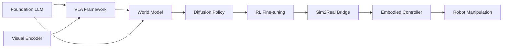

# 🧭 Foundation LLMs & Language Models（Theme_Foundation_LLM）

## 🎯 主题定义
- 归属上位关键词：**Theme_Embodied_AI_System**
- 细分关注：LLM, language model, foundation model, large language model, GPT
- 标准标签参考：#LLM #Foundation_Model

## 📊 主题仪表盘
- 总论文数：**45**
- 平均分：**7.31**
- 高频标签：#Embodied_AI #Foundation_Model #Robot_Manipulation #VLA #LLM #World_Model #Reinforcement_Learning #Diffusion_Model #Sim2Real #Foundation_Models

## 🆕 最近新增
- [[HiVLA]] | 2026-04-15 | HiVLA: A Visual-Grounded-Centric Hierarchical Embodied Manipulation System
- [[TAG]] | 2026-03-25 | TAG: Target-Agnostic Guidance for Stable Object-Centric Inference in Vision-Language-Action Models
- [[Not All Features Are Created Equal]] | 2026-03-19 | Not All Features Are Created Equal: A Mechanistic Study of Vision-Language-Action Models
- [[Generation_Models_Know_Space]] | 2026-03-19 | Generation Models Know Space: Unleashing Implicit 3D Priors for Scene Understanding
- [[ProbeFlow]] | 2026-03-18 | ProbeFlow: Training-Free Adaptive Flow Matching for Vision-Language-Action Models
- [[DreamPlan]] | 2026-03-17 | DreamPlan: Efficient Reinforcement Fine-Tuning of Vision-Language Planners via Video World Models
- [[PRIMO R1]] | 2026-03-16 | From Passive Observer to Active Critic: Reinforcement Learning Elicits Process Reasoning for Robotic Manipulation
- [[Towards Generalizable Robotic Manipulation in Dynamic Environments]] | 2026-03-16 | Towards Generalizable Robotic Manipulation in Dynamic Environments

## ⭐ 核心论文 Top
- [[Not All Features Are Created Equal]] | Score: 9/10 | 2026-03-19 | Not All Features Are Created Equal: A Mechanistic Study of Vision-Language-Action Models
- [[Simple Recipe Works]] | Score: 9/10 | 2026-03-12 | Simple Recipe Works: Vision-Language-Action Models are Natural Continual Learners with Reinforcement Learning
- [[ACEBrain0]] | Score: 8/10 | 2026-03-04 | ACE-Brain-0: Spatial Intelligence as a Shared Scaffold for Universal Embodiments
- [[Beyond Language Modeling]] | Score: 8/10 | 2026-03-03 | Beyond Language Modeling: An Exploration of Multimodal Pretraining
- [[CanViT]] | Score: 8/10 | Unknown | CanViT: Toward Active-Vision Foundation Models
- [[Chain of World]] | Score: 8/10 | 2026-03-03 | Chain of World: World Model Thinking in Latent Motion
- [[DiReCT]] | Score: 8/10 | Unknown | DiReCT: Disentangled Regularization of Contrastive Trajectories for Physics-Refined Video Generation
- [[DreamPlan]] | Score: 8/10 | 2026-03-17 | DreamPlan: Efficient Reinforcement Fine-Tuning of Vision-Language Planners via Video World Models
- [[EmboAlign]] | Score: 8/10 | 2026-03-05 | EmboAlign: Aligning Video Generation with Compositional Constraints for Zero-Shot Manipulation
- [[Generation_Models_Know_Space]] | Score: 8/10 | 2026-03-19 | Generation Models Know Space: Unleashing Implicit 3D Priors for Scene Understanding
- [[HybridVLA]] | Score: 8/10 | 2025-06-23 | HybridVLA: Collaborative Diffusion and Autoregression in a Unified Vision-Language-Action Model
- [[LoGeR]] | Score: 8/10 | 2026-03-03 | LoGeR: Long-Context Geometric Reconstruction with Hybrid Memory

## ✅ 核心贡献与共识
- 暂无可提取的核心贡献，待深度分析笔记积累后自动汇总。

## ⚠️ 局限性与关键分歧
- 暂未发现显式局限性记录，待深度分析笔记积累后自动汇总。

## 🔀 跨论文引用网络
- [[Physics Informed Viscous Value Representations]] ← 被 [[The_Trinity_of_Consistency_as_a_Defining_Principle_for_General_World_Models]], [[Xiaomi-Robotics-0]], [[GeneralVLA]] 等 3 篇引用
- [[ProbeFlow]] ← 被 [[HybridVLA]], [[HiVLA]] 等 2 篇引用
- [[World_Action_Models_are_Zero_shot_Policies]] ← 被 [[LoGeR]], [[The_Trinity_of_Consistency_as_a_Defining_Principle_for_General_World_Models]] 等 2 篇引用
- [[GeneralVLA]] ← 被 [[The_Trinity_of_Consistency_as_a_Defining_Principle_for_General_World_Models]], [[Utonia]] 等 2 篇引用
- [[QuantVLA]] ← 被 [[The_Trinity_of_Consistency_as_a_Defining_Principle_for_General_World_Models]], [[Utonia]] 等 2 篇引用
- [[README]] ← 被 [[Xiaomi-Robotics-0]], [[GeneralVLA]] 等 2 篇引用
- [[2026-02-16-PaperDigest]] ← 被 [[Xiaomi-Robotics-0]], [[GeneralVLA]] 等 2 篇引用
- [[2026-02-26-PaperDigest]] ← 被 [[Xiaomi-Robotics-0]], [[GeneralVLA]] 等 2 篇引用

## 🏛️ 领域里程碑工作（AI Enriched）
- **Attention Is All You Need (2017, NeurIPS)** — Introduced the Transformer architecture and self-attention mechanism, establishing the foundational computational paradigm that replaced RNNs/CNNs for sequence modeling.
- **BERT: Pre-training of Deep Bidirectional Transformers for Language Understanding (2018, NAACL)** — Demonstrated the efficacy of masked language modeling and bidirectional context, setting the standard for transfer learning and downstream task fine-tuning.
- **Language Models are Few-Shot Learners (2020, NeurIPS)** — Introduced GPT-3 and established in-context learning, proving that scaling parameters and data unlocks emergent zero/few-shot capabilities without gradient updates.
- **Scaling Laws for Neural Language Models (2020, arXiv)** — Quantified the predictable power-law relationship between compute, dataset size, and model performance, providing the empirical blueprint for training modern foundation models.
- **Training language models to follow instructions with human feedback (2022, NeurIPS)** — Introduced InstructGPT and RLHF, shifting the paradigm from pure next-token prediction to aligned, instruction-following conversational agents.
- **Chain-of-Thought Prompting Elicits Reasoning in Large Language Models (2022, NeurIPS)** — Demonstrated that generating intermediate reasoning steps significantly improves LLM performance on complex tasks, enabling advanced planning and decomposition.
- **LLaMA: Open and Efficient Foundation Language Models (2023, arXiv)** — Released a highly efficient, open-weight model family that democratized access to state-of-the-art LLM capabilities and catalyzed rapid ecosystem and fine-tuning development.
- **PaLM-E: An Embodied Multimodal Language Model (2023, ICML)** — Integrated visual and continuous sensorimotor inputs directly into a large language model, establishing a foundational blueprint for vision-language-action (VLA) systems in robotics.
- **ReAct: Synergizing Reasoning and Acting in Language Models (2023, ICLR)** — Proposed interleaving verbal reasoning traces with task-specific actions, enabling LLMs to interact with external environments and APIs for grounded, iterative decision-making.
- **RT-2: Vision-Language-Action Models Transfer Web Knowledge to Robotic Control (2023, CoRL)** — Showed that fine-tuning a vision-language model on robotics data enables zero-shot generalization to novel objects and instructions, bridging web-scale knowledge with physical control.
- **Voyager: An Open-Ended Embodied Agent with Large Language Models (2023, NeurIPS)** — Pioneered the use of LLMs as autonomous curriculum generators and skill synthesizers, demonstrating lifelong learning and code-based policy generation in complex environments.
- **Inner Monologue: Embodied Reasoning through Planning with Language Models (2022, CoRL)** — Established a closed-loop architecture where LLMs generate high-level plans and receive multimodal feedback, enabling robust long-horizon robotic manipulation and error recovery.

## 🚀 前沿信号雷达（AI Enriched）
- **Beyond Language Modeling** 与 **DiReCT** 代表了将 Diffusion Model 与 LLM 深度融合以构建 World Model 的趋势，标志着具身智能从纯文本/图像生成向高保真物理状态预测与反事实推理的范式转移。
- **Chain of World** 与 **LoGeR** 揭示了基于 World Model 的长程规划与 Sim2Real 迁移技术路线，通过隐式环境动力学建模显著降低了真实机器人部署中的 Distribution Shift 风险。
- **Simple Recipe Works** 与 **EmboAlign** 体现了 VLA 策略的轻量化对齐趋势，证明通过高效的 Reinforcement Learning 或偏好优化算法微调基础模型，即可在复杂 Robot Manipulation 任务中实现高性能，无需依赖海量具身数据从头训练。
- **Generation_Models_Know_Space** 指出了生成式基础模型中内蕴的 3D 空间几何先验可被直接提取用于具身感知，推动了从 2D 视觉特征匹配向隐式空间表征（Implicit Spatial Representation）的演进。

## 🧬 体系化关联补充（AI Enriched）
- 与 **World_Model** 主题的桥梁：通过 **Chain of World** 和 **Beyond Language Modeling**，LLM 的自回归生成能力被扩展为环境动力学预测器，实现了从语言序列建模到多模态状态轨迹生成的跨主题映射。
- 与 **Reinforcement_Learning** 主题的桥梁：**Simple Recipe Works** 和 **ACEBrain0** 展示了如何将 LLM 作为高层策略生成器（High-level Policy），与底层 RL 控制器结合，利用语言奖励塑形（Language Reward Shaping）解决稀疏奖励下的探索难题。
- 与 **Robot_Manipulation** 主题的桥梁：**EmboAlign** 和 **LoGeR** 建立了 LLM 语义理解与物理动作空间的对齐机制，通过 Diffusion Policy 或动作分词化（Action Tokenization）将离散语言指令转化为连续关节控制信号。
- 与 **Sim2Real** 主题的桥梁：**Generation_Models_Know_Space** 利用生成式基础模型的域泛化能力，在仿真环境中合成高保真物理交互数据，为真实机器人提供零样本（Zero-shot）策略迁移的跨域适配接口。

## ❓ 开放性问题（AI Enriched）
- 针对VLA模型在长程操作任务中出现的动作漂移与语义-动作解耦不足问题，如何在不增加推理延迟的前提下，将世界模型的物理先验有效注入到语言-动作对齐层中？
- 基于扩散策略的具身控制方法在Sim2Real迁移时面临高频动力学失配与接触力建模缺失，如何设计轻量级的在线自适应机制以补偿未建模的摩擦与传感器噪声？
- 当前大语言模型生成的符号化规划缺乏对连续状态空间的精确度量与可微反馈，如何将几何约束与运动学雅可比直接嵌入到LLM的解码过程中以实现端到端的物理一致性？
- 多模态基础模型在零样本泛化时容易受视觉背景与光照变化干扰，如何构建解耦的语义-空间表征以分离任务意图与场景上下文，从而提升复杂非结构化环境下的策略鲁棒性？

## 🗺️ 主题关系可视化（AI Enriched）

## 🗓️ 本周推进建议（AI Enriched）
- [ ] 基于论文[Not All Features Are Created Equal]：聚焦VLA模型中视觉特征的重要性评估。在Jupyter中加载预训练的ViT模型，输入一组简单的抓取任务图像，通过计算梯度类激活映射（Grad-CAM）或注意力权重可视化模型关注的区域。观察并记录：不同特征通道对目标物体边缘与背景的响应差异，并统计高响应区域与真实抓取点的空间重合度，验证“特征非均等”假设。
- [ ] 基于论文[DiReCT]：聚焦扩散模型在轨迹生成中的去噪机制。使用PyTorch编写不超过150行代码的1D扩散模型（DDPM），在二维平面上拟合一条简单的机械臂正弦运动轨迹。观察并测量：在不同时间步（t）下，模型预测噪声的均方误差（MSE）变化曲线，以及最终生成轨迹与真实轨迹的Hausdorff距离，理解扩散步数对控制精度的影响。
- [ ] 基于论文[LoGeR]：聚焦Sim2Real迁移中的隐空间对齐。利用公开的合成与真实图像块数据集，训练一个轻量级自编码器，并引入最大均值差异（MMD）损失对齐两者的隐变量分布。观察并测量：对齐前后隐空间t-SNE可视化中两类样本的聚类重叠程度，以及使用简单线性探针在隐特征上训练域分类器的准确率下降幅度，量化域偏移的缓解效果。

## 🔗 关联主题
- [[Theme_VLA_Policy|Vision-Language-Action Policies]]
- [[Theme_VLA_Reasoning|VLA Reasoning & Planning]]
- [[Theme_Multimodal_Perception|Multimodal Perception]]
